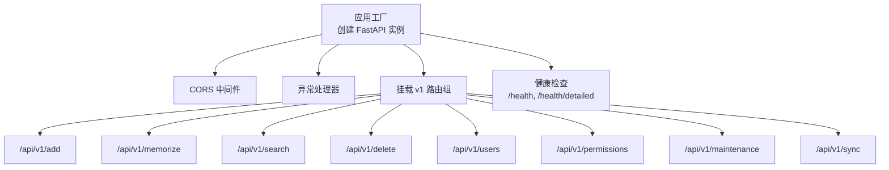
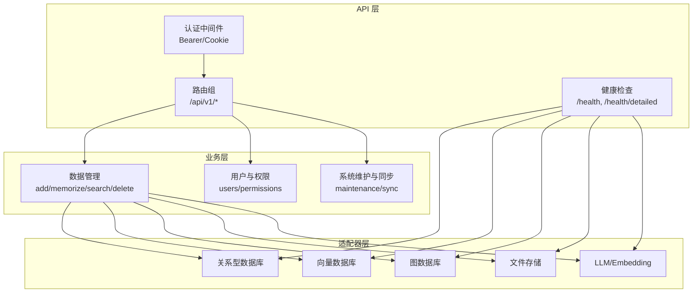
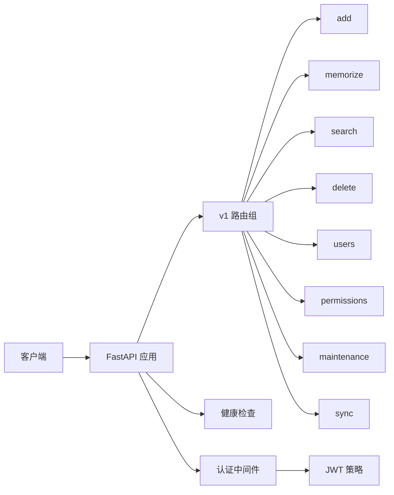
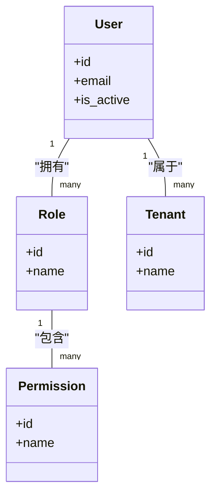

# API 参考文档

<cite>
**本文档引用的文件**
- [m_flow/api/client.py](file://m_flow/api/client.py)
- [m_flow/api/health.py](file://m_flow/api/health.py)
- [m_flow/auth/authentication/get_api_auth_backend.py](file://m_flow/auth/authentication/get_api_auth_backend.py)
- [m_flow/auth/authentication/api_bearer/api_bearer.py](file://m_flow/auth/authentication/api_bearer/api_bearer.py)
- [m_flow/cli/app.py](file://m_flow/cli/app.py)
- [m_flow/cli/commands/add_command.py](file://m_flow/cli/commands/add_command.py)
- [m_flow/cli/commands/memorize_command.py](file://m_flow/cli/commands/memorize_command.py)
- [m_flow/cli/commands/search_command.py](file://m_flow/cli/commands/search_command.py)
- [m_flow/cli/commands/delete_command.py](file://m_flow/cli/commands/delete_command.py)
- [m_flow/cli/commands/config_command.py](file://m_flow/cli/commands/config_command.py)
- [m_flow/data/methods/create_dataset.py](file://m_flow/data/methods/create_dataset.py)
- [m_flow/data/methods/delete_data.py](file://m_flow/data/methods/delete_data.py)
- [m_flow/data/methods/get_data.py](file://m_flow/data/methods/get_data.py)
- [m_flow/data/methods/get_datasets.py](file://m_flow/data/methods/get_datasets.py)
- [m_flow/search/methods/search.py](file://m_flow/search/methods/search.py)
- [m_flow/memory/episodic/write_episodic_memories.py](file://m_flow/memory/episodic/write_episodic_memories.py)
- [m_flow/retrieval/base_retriever.py](file://m_flow/retrieval/base_retriever.py)
- [m_flow/auth/models/User.py](file://m_flow/auth/models/User.py)
- [m_flow/auth/models/Role.py](file://m_flow/auth/models/Role.py)
- [m_flow/auth/models/Permission.py](file://m_flow/auth/models/Permission.py)
- [m_flow/auth/models/Tenant.py](file://m_flow/auth/models/Tenant.py)
- [m_flow/auth/permissions/methods/__init__.py](file://m_flow/auth/permissions/methods/__init__.py)
- [m_flow/auth/roles/methods/create_role.py](file://m_flow/auth/roles/methods/create_role.py)
- [m_flow/auth/roles/methods/add_user_to_role.py](file://m_flow/auth/roles/methods/add_user_to_role.py)
- [m_flow/auth/tenants/methods/create_tenant.py](file://m_flow/auth/tenants/methods/create_tenant.py)
- [m_flow/auth/tenants/methods/add_user_to_tenant.py](file://m_flow/auth/tenants/methods/add_user_to_tenant.py)
- [m_flow/auth/tenants/methods/select_tenant.py](file://m_flow/auth/tenants/methods/select_tenant.py)
- [m_flow/auth/methods/create_user.py](file://m_flow/auth/methods/create_user.py)
- [m_flow/auth/methods/get_user.py](file://m_flow/auth/methods/get_user.py)
- [m_flow/auth/methods/get_user_by_email.py](file://m_flow/auth/methods/get_user_by_email.py)
- [m_flow/auth/methods/delete_user.py](file://m_flow/auth/methods/delete_user.py)
- [m_flow/auth/methods/get_authenticated_user.py](file://m_flow/auth/methods/get_authenticated_user.py)
- [m_flow/auth/permissions/permission_types.py](file://m_flow/auth/permissions/permission_types.py)
- [m_flow/api/v1/add/routers.py](file://m_flow/api/v1/add/routers.py)
- [m_flow/api/v1/memorize/routers.py](file://m_flow/api/v1/memorize/routers.py)
- [m_flow/api/v1/search/routers.py](file://m_flow/api/v1/search/routers.py)
- [m_flow/api/v1/delete/routers.py](file://m_flow/api/v1/delete/routers.py)
- [m_flow/api/v1/users/routers.py](file://m_flow/api/v1/users/routers.py)
- [m_flow/api/v1/permissions/routers.py](file://m_flow/api/v1/permissions/routers.py)
- [m_flow/api/v1/maintenance/routers.py](file://m_flow/api/v1/maintenance/routers.py)
- [m_flow/api/v1/sync/routers.py](file://m_flow/api/v1/sync/routers.py)
</cite>

## 目录
1. [简介](#简介)
2. [项目结构](#项目结构)
3. [核心组件](#核心组件)
4. [架构总览](#架构总览)
5. [详细组件分析](#详细组件分析)
6. [依赖关系分析](#依赖关系分析)
7. [性能考虑](#性能考虑)
8. [故障排除指南](#故障排除指南)
9. [结论](#结论)
10. [附录](#附录)

## 简介
本文件为 M-flow 的完整 API 参考文档，覆盖以下接口类别：
- 数据管理：add、memorize、search、delete
- 用户与权限：users、permissions
- 系统维护与同步：maintenance、sync
- 健康检查：/health、/health/detailed
- 认证与授权：基于 Bearer Token 与 Cookie 的 API 认证

文档提供每个端点的 HTTP 方法、URL 模式、请求参数、响应格式、认证方式、错误码与常见问题排查，并给出 Python SDK 与 CLI 使用说明。

## 项目结构
后端基于 FastAPI 构建，统一在根应用中挂载各模块路由。核心入口负责：
- 初始化数据库与默认用户
- 配置 CORS 与安全方案（OpenAPI 中声明 Bearer 与 Cookie）
- 注册所有 v1 路由组
- 提供健康检查端点

图表来源
- [m_flow/api/client.py:268-337](file://m_flow/api/client.py#L268-L337)

章节来源
- [m_flow/api/client.py:110-127](file://m_flow/api/client.py#L110-L127)
- [m_flow/api/client.py:268-337](file://m_flow/api/client.py#L268-L337)

## 核心组件
- 应用生命周期与启动
  - 启动时创建数据库、确保默认用户存在
  - 关闭时对图数据库执行检查点并关闭连接
- 异常处理
  - 请求验证失败返回 400
  - 自定义服务异常按状态码返回
  - 其他异常统一返回 500
- OpenAPI 安全方案
  - BearerAuth：HTTP Bearer Token
  - CookieAuth：Cookie 名称可配置，默认从环境变量读取

章节来源
- [m_flow/api/client.py:68-103](file://m_flow/api/client.py#L68-L103)
- [m_flow/api/client.py:169-197](file://m_flow/api/client.py#L169-L197)
- [m_flow/api/client.py:135-161](file://m_flow/api/client.py#L135-L161)

## 架构总览
下图展示 API 层到业务层与适配器层的交互关系，以及认证与健康检查的集成位置。

图表来源
- [m_flow/api/client.py:268-337](file://m_flow/api/client.py#L268-L337)
- [m_flow/api/health.py:341-398](file://m_flow/api/health.py#L341-L398)

## 详细组件分析

### 健康检查 API
- GET /health
  - 功能：存活/就绪探针，聚合各后端组件状态
  - 返回：包含状态、版本、各组件探测结果
  - 成功：200；严重不健康：503；超时：返回 warn
- GET /health/detailed
  - 功能：详细健康报告，包含每个组件的延迟与备注
  - 返回：SystemHealth 结构体
  - 成功：200；严重不健康：503

章节来源
- [m_flow/api/client.py:211-261](file://m_flow/api/client.py#L211-L261)
- [m_flow/api/health.py:317-398](file://m_flow/api/health.py#L317-L398)

### 数据管理 API

#### add
- 路径：/api/v1/add
- 方法：POST
- 功能：新增数据项，支持多种数据源与类型
- 请求体字段（示例）：数据内容、元数据、数据集标识等
- 响应：新增数据项的唯一标识与状态
- 注意：具体字段以各适配器实现为准

章节来源
- [m_flow/api/v1/add/routers.py](file://m_flow/api/v1/add/routers.py)

#### memorize
- 路径：/api/v1/memorize
- 方法：POST
- 功能：将输入内容记忆化（写入知识图谱/向量库）
- 请求体字段（示例）：文本、上下文、时间戳、实体识别结果等
- 响应：记忆节点 ID、写入统计

章节来源
- [m_flow/api/v1/memorize/routers.py](file://m_flow/api/v1/memorize/routers.py)
- [m_flow/memory/episodic/write_episodic_memories.py](file://m_flow/memory/episodic/write_episodic_memories.py)

#### search
- 路径：/api/v1/search
- 方法：POST
- 功能：检索知识库，支持图检索与向量检索
- 请求体字段（示例）：查询文本、检索模式、过滤条件、返回数量等
- 响应：匹配结果列表、相关度分数、上下文片段

章节来源
- [m_flow/api/v1/search/routers.py](file://m_flow/api/v1/search/routers.py)
- [m_flow/search/methods/search.py](file://m_flow/search/methods/search.py)
- [m_flow/retrieval/base_retriever.py](file://m_flow/retrieval/base_retriever.py)

#### delete
- 路径：/api/v1/delete
- 方法：POST
- 功能：删除指定数据或记忆节点
- 请求体字段（示例）：数据 ID 列表、软删除标志等
- 响应：删除结果统计

章节来源
- [m_flow/api/v1/delete/routers.py](file://m_flow/api/v1/delete/routers.py)
- [m_flow/data/methods/delete_data.py](file://m_flow/data/methods/delete_data.py)

### 用户与权限 API

#### users
- 路径：/api/v1/users
- 方法：GET/POST/PUT/DELETE 等（视具体子路由）
- 功能：用户 CRUD、密码重置、邮箱验证等
- 认证：需要有效 Bearer Token 或 Cookie
- 响应：用户对象、操作结果

章节来源
- [m_flow/api/v1/users/routers.py](file://m_flow/api/v1/users/routers.py)
- [m_flow/auth/methods/create_user.py](file://m_flow/auth/methods/create_user.py)
- [m_flow/auth/methods/get_user.py](file://m_flow/auth/methods/get_user.py)
- [m_flow/auth/methods/get_user_by_email.py](file://m_flow/auth/methods/get_user_by_email.py)
- [m_flow/auth/methods/delete_user.py](file://m_flow/auth/methods/delete_user.py)

#### permissions
- 路径：/api/v1/permissions
- 方法：GET/POST/DELETE 等（视具体子路由）
- 功能：权限查询、分配、回收
- 认证：需要有效 Bearer Token 或 Cookie
- 响应：权限集合、操作结果

章节来源
- [m_flow/api/v1/permissions/routers.py](file://m_flow/api/v1/permissions/routers.py)
- [m_flow/auth/permissions/methods/__init__.py](file://m_flow/auth/permissions/methods/__init__.py)
- [m_flow/auth/permissions/permission_types.py](file://m_flow/auth/permissions/permission_types.py)

### 系统维护与同步 API

#### maintenance
- 路径：/api/v1/maintenance
- 方法：POST/GET 等（视具体子路由）
- 功能：系统维护任务（如索引重建、清理、迁移等）
- 认证：需要有效 Bearer Token 或 Cookie
- 响应：维护任务状态与进度

章节来源
- [m_flow/api/v1/maintenance/routers.py](file://m_flow/api/v1/maintenance/routers.py)

#### sync
- 路径：/api/v1/sync
- 方法：POST/GET 等（视具体子路由）
- 功能：数据同步、增量更新、一致性校验
- 认证：需要有效 Bearer Token 或 Cookie
- 响应：同步结果与统计

章节来源
- [m_flow/api/v1/sync/routers.py](file://m_flow/api/v1/sync/routers.py)

### 认证与授权

- 安全方案
  - BearerAuth：HTTP Bearer Token
  - CookieAuth：Cookie 名称为可配置项
- JWT 策略
  - 使用 API JWT Strategy，密钥来自环境变量，生产环境必须配置
  - 默认有效期 10 小时
- 获取认证用户
  - 提供受保护的用户上下文解析方法

章节来源
- [m_flow/api/client.py:135-161](file://m_flow/api/client.py#L135-L161)
- [m_flow/auth/authentication/get_api_auth_backend.py:22-46](file://m_flow/auth/authentication/get_api_auth_backend.py#L22-L46)
- [m_flow/auth/authentication/api_bearer/api_bearer.py](file://m_flow/auth/authentication/api_bearer/api_bearer.py)
- [m_flow/auth/methods/get_authenticated_user.py](file://m_flow/auth/methods/get_authenticated_user.py)

## 依赖关系分析

图表来源
- [m_flow/api/client.py:268-337](file://m_flow/api/client.py#L268-L337)

## 性能考虑
- 健康检查采用并发探测与超时策略，避免阻塞主请求
- 图数据库健康探测设置超时，防止长事务导致探针阻塞
- 建议在高并发场景下启用连接池与缓存

章节来源
- [m_flow/api/health.py:123-173](file://m_flow/api/health.py#L123-L173)

## 故障排除指南
- 400 错误
  - 原因：请求体参数校验失败
  - 处理：检查请求体字段类型与必填项
- 401/403 错误
  - 原因：缺少或无效的认证凭据
  - 处理：确认 Bearer Token 或 Cookie 是否正确传递
- 500 错误
  - 原因：服务内部异常
  - 处理：查看服务日志，定位具体异常堆栈
- 健康检查失败
  - 关系型/向量/图数据库不可达：检查连接配置与网络
  - LLM/Embedding 未配置：检查必要环境变量

章节来源
- [m_flow/api/client.py:169-197](file://m_flow/api/client.py#L169-L197)
- [m_flow/api/health.py:341-398](file://m_flow/api/health.py#L341-L398)

## 结论
本文档提供了 M-flow API 的全面参考，涵盖数据管理、用户权限、系统维护与健康检查等核心能力。通过统一的认证与异常处理机制，配合健康检查与并发探测，保障了系统的稳定性与可观测性。建议在生产环境中严格配置认证密钥与环境变量，并结合监控与日志进行持续运维。

## 附录

### Python SDK 使用指南
- 客户端初始化
  - 通过 API 客户端类创建实例，传入基础 URL 与认证头
- 方法调用
  - 使用对应模块的方法封装（如 add、memorize、search、delete）
- 结果处理
  - 统一解析响应模型，处理分页与错误码

章节来源
- [m_flow/api/client.py:110-127](file://m_flow/api/client.py#L110-L127)

### CLI 命令参考
- add
  - 语法：mflow add [选项]
  - 用途：添加数据项
- memorize
  - 语法：mflow memorize [选项]
  - 用途：记忆化输入内容
- search
  - 语法：mflow search [选项]
  - 用途：检索知识库
- delete
  - 语法：mflow delete [选项]
  - 用途：删除数据
- config
  - 语法：mflow config [选项]
  - 用途：查看或修改配置

章节来源
- [m_flow/cli/app.py](file://m_flow/cli/app.py)
- [m_flow/cli/commands/add_command.py](file://m_flow/cli/commands/add_command.py)
- [m_flow/cli/commands/memorize_command.py](file://m_flow/cli/commands/memorize_command.py)
- [m_flow/cli/commands/search_command.py](file://m_flow/cli/commands/search_command.py)
- [m_flow/cli/commands/delete_command.py](file://m_flow/cli/commands/delete_command.py)
- [m_flow/cli/commands/config_command.py](file://m_flow/cli/commands/config_command.py)

### 数据模型与权限概览

图表来源
- [m_flow/auth/models/User.py](file://m_flow/auth/models/User.py)
- [m_flow/auth/models/Role.py](file://m_flow/auth/models/Role.py)
- [m_flow/auth/models/Permission.py](file://m_flow/auth/models/Permission.py)
- [m_flow/auth/models/Tenant.py](file://m_flow/auth/models/Tenant.py)