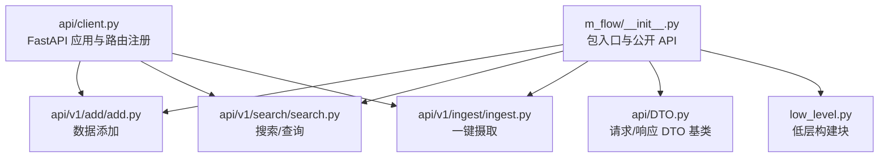
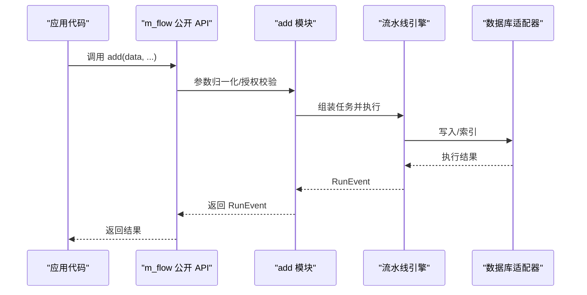
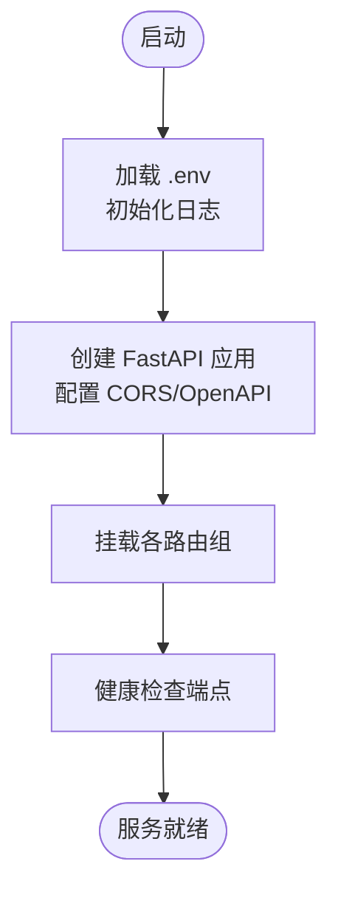
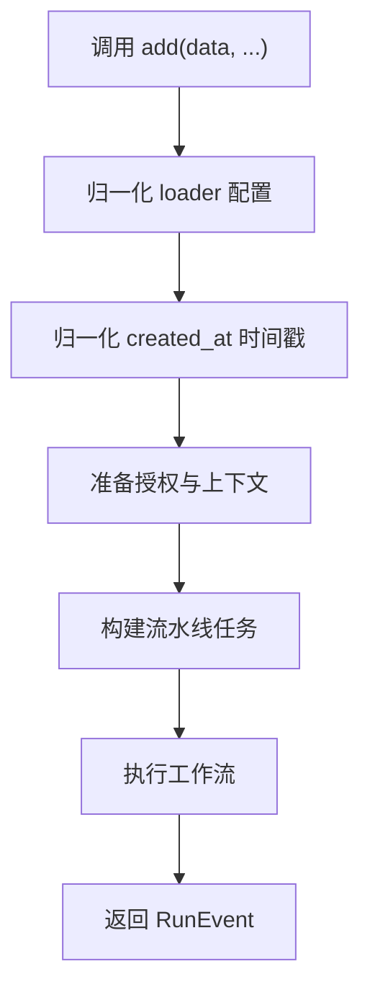
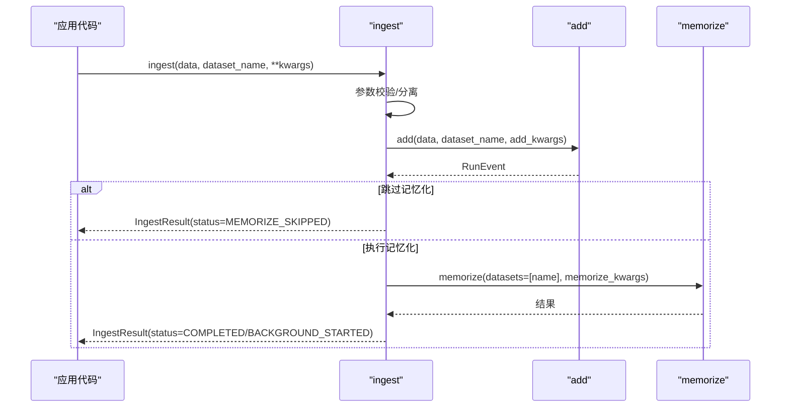
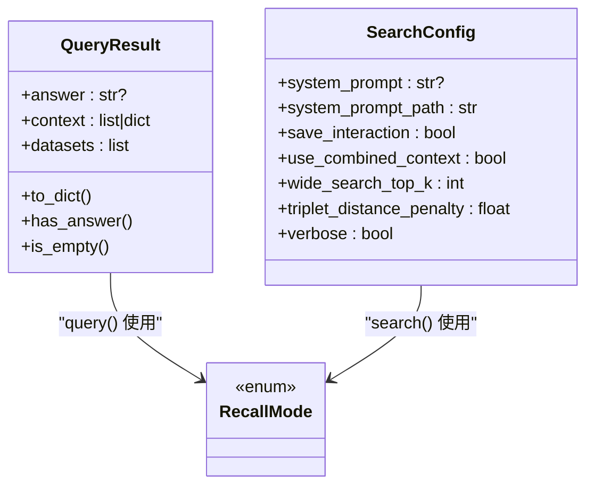
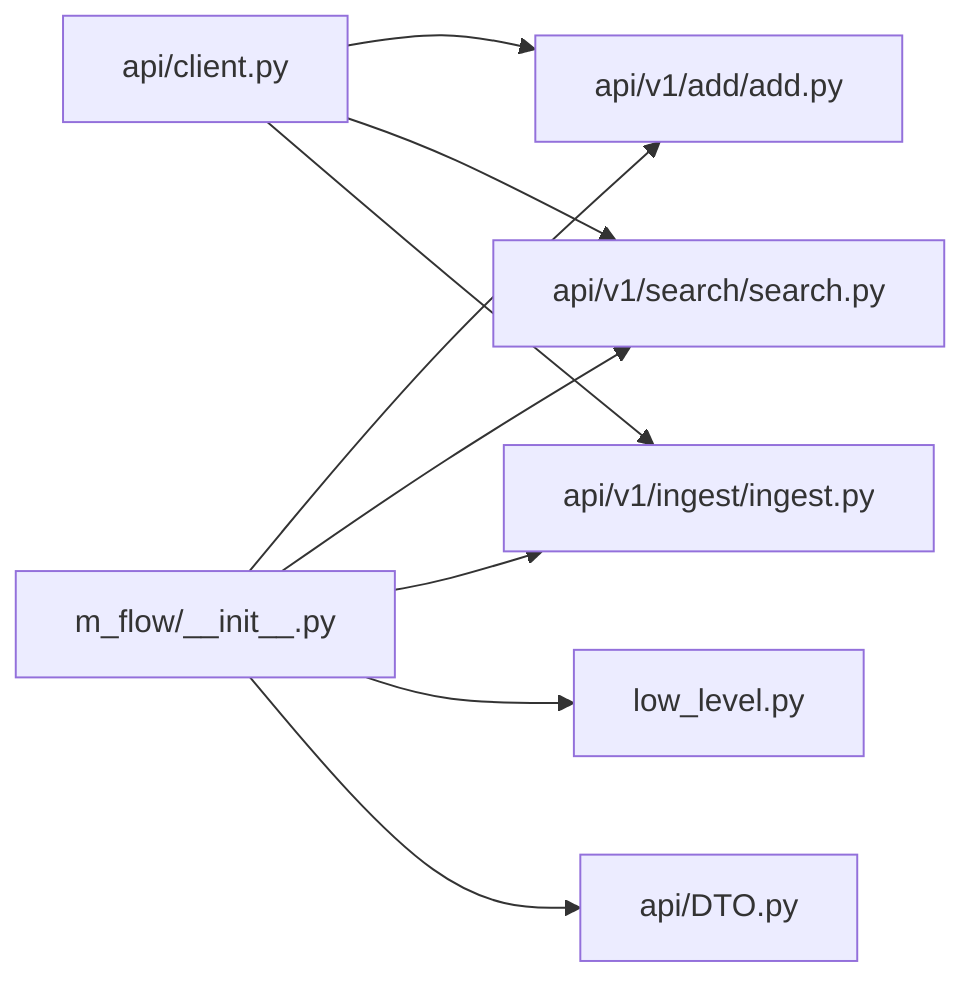

# Python SDK 使用

<cite>
**本文引用的文件**
- [m_flow/__init__.py](file://m_flow/__init__.py)
- [m_flow/api/DTO.py](file://m_flow/api/DTO.py)
- [m_flow/api/client.py](file://m_flow/api/client.py)
- [m_flow/low_level.py](file://m_flow/low_level.py)
- [m_flow/api/v1/add/add.py](file://m_flow/api/v1/add/add.py)
- [m_flow/api/v1/search/search.py](file://m_flow/api/v1/search/search.py)
- [m_flow/api/v1/ingest/ingest.py](file://m_flow/api/v1/ingest/ingest.py)
- [examples/python/simple_example.py](file://examples/python/simple_example.py)
- [examples/python/m_flow_simple_document_demo.py](file://examples/python/m_flow_simple_document_demo.py)
</cite>

## 目录
1. [简介](#简介)
2. [项目结构](#项目结构)
3. [核心组件](#核心组件)
4. [架构总览](#架构总览)
5. [详细组件分析](#详细组件分析)
6. [依赖分析](#依赖分析)
7. [性能考虑](#性能考虑)
8. [故障排查指南](#故障排查指南)
9. [结论](#结论)
10. [附录](#附录)

## 简介
本指南面向希望在 Python 中使用 M-flow 的开发者，系统讲解如何通过 SDK 完成数据的添加、记忆化、检索与管理，并覆盖同步与异步调用模式、认证与连接配置、异常处理、DTO 结构与返回数据格式、错误处理最佳实践、性能优化与批量操作等主题。文档中的方法与流程均来自仓库源码与示例脚本。

## 项目结构
M-flow 的 Python SDK 以模块化方式组织，核心入口位于包根导出，具体功能分布在 API v1 子模块中，如 add、search、ingest 等；同时提供低层接口用于高级用法。

**图表来源**
- [m_flow/__init__.py:1-95](file://m_flow/__init__.py#L1-L95)
- [m_flow/api/v1/add/add.py:1-249](file://m_flow/api/v1/add/add.py#L1-L249)
- [m_flow/api/v1/search/search.py:1-415](file://m_flow/api/v1/search/search.py#L1-L415)
- [m_flow/api/v1/ingest/ingest.py:1-362](file://m_flow/api/v1/ingest/ingest.py#L1-L362)
- [m_flow/api/DTO.py:1-58](file://m_flow/api/DTO.py#L1-L58)
- [m_flow/low_level.py:1-23](file://m_flow/low_level.py#L1-L23)
- [m_flow/api/client.py:268-337](file://m_flow/api/client.py#L268-L337)

**章节来源**
- [m_flow/__init__.py:1-95](file://m_flow/__init__.py#L1-L95)
- [m_flow/api/client.py:268-337](file://m_flow/api/client.py#L268-L337)

## 核心组件
- 包入口与公开 API：统一导出 add、memorize、learn、search、query、ingest、datasets、delete、update、prune、manual_* 等方法，以及相关类型（如 RecallMode、QueryResult、SearchConfig、IngestResult、IngestStatus、ContentType 等）。
- DTO 基类：OutDTO 用于响应序列化（snake_case 到 camelCase），InDTO 用于请求反序列化（接受 snake_case/camelCase）。
- 低层接口：提供 MemoryNode、setup 等低阶能力，适合需要直接访问图节点或系统引导的高级场景。

**章节来源**
- [m_flow/__init__.py:21-94](file://m_flow/__init__.py#L21-L94)
- [m_flow/api/DTO.py:24-58](file://m_flow/api/DTO.py#L24-L58)
- [m_flow/low_level.py:9-22](file://m_flow/low_level.py#L9-L22)

## 架构总览
SDK 的调用链路通常为：应用代码调用公开 API（add/search/query/ingest 等）→ 进入对应模块实现 → 触发内部流水线（pipeline）与适配器（向量/图/关系型数据库）→ 返回结果或运行事件。

**图表来源**
- [m_flow/api/v1/add/add.py:147-249](file://m_flow/api/v1/add/add.py#L147-L249)

## 详细组件分析

### 客户端初始化与认证配置
- 包入口加载环境变量与日志；公开 API 通过模块导入暴露。
- FastAPI 应用支持 CORS、OpenAPI 安全方案（Bearer 与 Cookie）、健康检查端点、异常处理。
- 认证与权限：OpenAPI 定义了 BearerAuth 与 CookieAuth；实际鉴权策略由后端路由与用户体系决定。

**图表来源**
- [m_flow/api/client.py:110-127](file://m_flow/api/client.py#L110-L127)
- [m_flow/api/client.py:135-161](file://m_flow/api/client.py#L135-L161)
- [m_flow/api/client.py:268-337](file://m_flow/api/client.py#L268-L337)

**章节来源**
- [m_flow/__init__.py:13-19](file://m_flow/__init__.py#L13-L19)
- [m_flow/api/client.py:37-42](file://m_flow/api/client.py#L37-L42)
- [m_flow/api/client.py:135-161](file://m_flow/api/client.py#L135-L161)

### 数据添加（add）
- 支持多种输入：字符串、本地/远程文件路径、URL、二进制流、列表组合。
- 关键参数：dataset_name、user、graph_scope、vector_db_config、graph_db_config、dataset_id、preferred_loaders、incremental_loading、enable_cache、items_per_batch、created_at。
- 流程：参数归一化 → 授权与上下文准备 → 构建流水线任务 → 执行工作流 → 返回 RunEvent。

**图表来源**
- [m_flow/api/v1/add/add.py:35-86](file://m_flow/api/v1/add/add.py#L35-L86)
- [m_flow/api/v1/add/add.py:106-140](file://m_flow/api/v1/add/add.py#L106-L140)
- [m_flow/api/v1/add/add.py:225-248](file://m_flow/api/v1/add/add.py#L225-L248)

**章节来源**
- [m_flow/api/v1/add/add.py:147-249](file://m_flow/api/v1/add/add.py#L147-L249)

### 一键摄取（ingest）
- 将 add 与 memorize 合并为一步操作，简化常用场景。
- 参数透传：动态解析 add/memorize 有效参数，自动分离并传递；支持 skip_memorize、run_in_background 等。
- 返回值：IngestResult，包含 dataset_id、dataset_name、status、add_run_id、memorize_run_id、error_message。

**图表来源**
- [m_flow/api/v1/ingest/ingest.py:146-327](file://m_flow/api/v1/ingest/ingest.py#L146-L327)

**章节来源**
- [m_flow/api/v1/ingest/ingest.py:146-327](file://m_flow/api/v1/ingest/ingest.py#L146-L327)

### 检索与查询（search/query）
- search：多召回模式（TRIPLET_COMPLETION、EPISODIC、PROCEDURAL、CYPHER、CHUNKS_LEXICAL），支持系统提示、会话缓存、集合过滤、复杂参数合并。
- query：简化接口，默认“episodic”，支持 mode 映射（episodic/triplet/chunks/procedural/cypher）。
- 返回类型：QueryResult（answer/context/datasets）或 SearchResult 列表/CombinedSearchResult。

**图表来源**
- [m_flow/api/v1/search/search.py:30-74](file://m_flow/api/v1/search/search.py#L30-L74)
- [m_flow/api/v1/search/search.py:77-104](file://m_flow/api/v1/search/search.py#L77-L104)
- [m_flow/api/v1/search/search.py:135-301](file://m_flow/api/v1/search/search.py#L135-L301)
- [m_flow/api/v1/search/search.py:318-379](file://m_flow/api/v1/search/search.py#L318-L379)

**章节来源**
- [m_flow/api/v1/search/search.py:135-301](file://m_flow/api/v1/search/search.py#L135-L301)
- [m_flow/api/v1/search/search.py:318-379](file://m_flow/api/v1/search/search.py#L318-L379)

### 删除与更新（delete/update）
- 提供 delete 与 update 方法，配合数据集与权限控制使用。
- 使用前需确保已添加数据并完成记忆化，以便检索与定位目标。

**章节来源**
- [m_flow/__init__.py:29-32](file://m_flow/__init__.py#L29-L32)

### 手动摄取与节点修补（manual_*）
- manual_ingest、manual_add_episode、patch_node 及其请求 DTO，用于绕过 LLM 抽取的手工流程与节点修补。

**章节来源**
- [m_flow/__init__.py:36-46](file://m_flow/__init__.py#L36-L46)

### 配置与 UI（config/start_ui）
- config：系统配置读取与持久化。
- start_ui：启动前端 UI。

**章节来源**
- [m_flow/__init__.py:49-51](file://m_flow/__init__.py#L49-L51)

### 低层接口（low_level）
- 提供 MemoryNode、setup，便于高级用户直接操作图节点或系统初始化。

**章节来源**
- [m_flow/low_level.py:9-22](file://m_flow/low_level.py#L9-L22)

## 依赖分析
- 包入口聚合导出：统一暴露核心 API 与类型，便于上层按需导入。
- FastAPI 应用集中挂载路由：将 add、search、ingest、delete、update、prune、manual、users、settings、prompts、responses、sync、graph、datasets、permissions、pipeline、maintenance、coreference、playground 等路由纳入统一服务。
- DTO 层：OutDTO/InDTO 提供一致的序列化/反序列化行为，保证前后端字段命名一致性。

**图表来源**
- [m_flow/__init__.py:21-94](file://m_flow/__init__.py#L21-L94)
- [m_flow/api/client.py:268-337](file://m_flow/api/client.py#L268-L337)

**章节来源**
- [m_flow/__init__.py:21-94](file://m_flow/__init__.py#L21-L94)
- [m_flow/api/client.py:268-337](file://m_flow/api/client.py#L268-L337)

## 性能考虑
- 批量与增量：add 支持 items_per_batch 与 incremental_loading，有助于控制内存与吞吐。
- 缓存：enable_cache 可跳过已完成的 add 阶段，减少重复处理。
- 异步执行：SDK 为异步设计，建议在异步上下文中并发调度多个任务，避免阻塞。
- 后台运行：ingest 的 run_in_background 可将耗时的记忆化移至后台，快速返回状态。
- 数据预处理：合理选择 preferred_loaders 与 content_type，减少无效解析成本。

[本节为通用指导，不直接分析特定文件]

## 故障排查指南
- 异常处理：FastAPI 应用对验证错误与通用异常进行统一处理，返回结构化的错误信息。
- 健康检查：/health 与 /health/detailed 提供服务状态与组件诊断。
- 日志：包入口与各模块使用统一日志工具，便于定位问题。
- 常见问题：
  - 未设置 LLM_API_KEY：TRIPLET_COMPLETION 模式无法生成答案。
  - 数据未记忆化：仅 add 成功但未执行 memorize 时，数据不可查询。
  - 参数不合法：ingest 对透传参数进行动态校验，非法参数会抛出 TypeError。

**章节来源**
- [m_flow/api/client.py:169-198](file://m_flow/api/client.py#L169-L198)
- [m_flow/api/client.py:211-261](file://m_flow/api/client.py#L211-L261)

## 结论
M-flow Python SDK 提供从数据添加、知识图谱构建到检索查询的完整链路，支持异步调用、灵活的召回模式与参数配置。通过统一的 DTO 层与健康检查机制，开发者可以快速集成并稳定运行。建议优先使用 ingest 简化流程，在高负载场景下结合批量、增量与后台运行策略提升性能。

[本节为总结性内容，不直接分析特定文件]

## 附录

### 同步与异步调用模式
- SDK 采用异步设计，推荐在异步上下文中调用（如 asyncio.run(...)）。
- 示例脚本展示了在异步函数中依次执行 prune、add、memorize、search 的完整流程。

**章节来源**
- [examples/python/simple_example.py:21-50](file://examples/python/simple_example.py#L21-L50)
- [examples/python/m_flow_simple_document_demo.py:12-38](file://examples/python/m_flow_simple_document_demo.py#L12-L38)

### DTO 结构与返回数据格式
- OutDTO：响应序列化，字段名自动转为 camelCase。
- InDTO：请求反序列化，支持 snake_case/camelCase。
- QueryResult：简化查询结果，包含 answer、context、datasets。
- IngestResult：摄取结果，包含 dataset_id、status、run_id 等。

**章节来源**
- [m_flow/api/DTO.py:24-58](file://m_flow/api/DTO.py#L24-L58)
- [m_flow/api/v1/search/search.py:30-74](file://m_flow/api/v1/search/search.py#L30-L74)
- [m_flow/api/v1/ingest/ingest.py:89-144](file://m_flow/api/v1/ingest/ingest.py#L89-L144)

### 使用示例（路径）
- 快速开始：[examples/python/simple_example.py:21-50](file://examples/python/simple_example.py#L21-L50)
- 文档演示：[examples/python/m_flow_simple_document_demo.py:12-38](file://examples/python/m_flow_simple_document_demo.py#L12-L38)