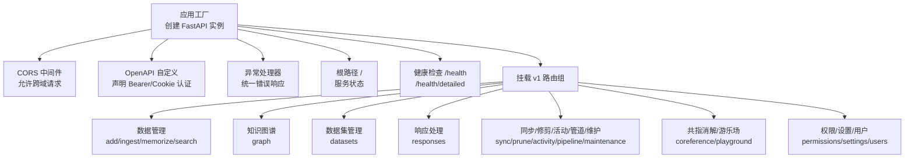
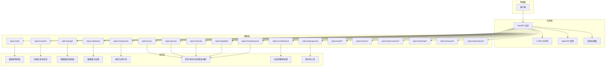
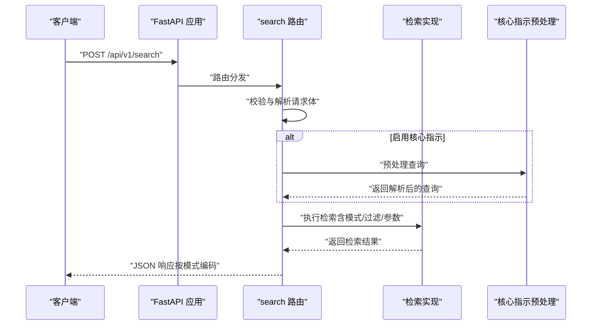
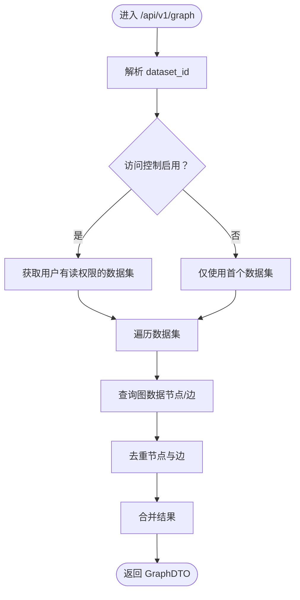
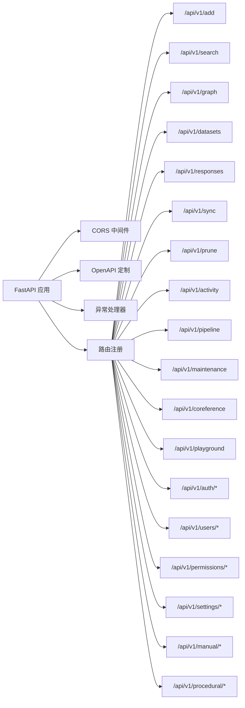

# RESTful API 接口

<cite>
**本文引用的文件**
- [m_flow/api/client.py](file://m_flow/api/client.py)
- [m_flow/api/v1/add/routers/get_add_router.py](file://m_flow/api/v1/add/routers/get_add_router.py)
- [m_flow/api/v1/search/routers/get_search_router.py](file://m_flow/api/v1/search/routers/get_search_router.py)
- [m_flow/api/v1/graph/routers/get_graph_router.py](file://m_flow/api/v1/graph/routers/get_graph_router.py)
- [m_flow/api/v1/datasets/routers/get_datasets_router.py](file://m_flow/api/v1/datasets/routers/get_datasets_router.py)
- [m_flow/api/v1/responses/routers/get_responses_router.py](file://m_flow/api/v1/responses/routers/get_responses_router.py)
- [m_flow/api/v1/sync/routers/get_sync_router.py](file://m_flow/api/v1/sync/routers/get_sync_router.py)
- [m_flow/api/v1/prune/routers/get_prune_router.py](file://m_flow/api/v1/prune/routers/get_prune_router.py)
- [m_flow/api/v1/activity/routers/get_activity_router.py](file://m_flow/api/v1/activity/routers/get_activity_router.py)
- [m_flow/api/v1/pipeline/routers/get_pipeline_router.py](file://m_flow/api/v1/pipeline/routers/get_pipeline_router.py)
- [m_flow/api/v1/maintenance/routers/get_maintenance_router.py](file://m_flow/api/v1/maintenance/routers/get_maintenance_router.py)
- [m_flow/api/v1/coreference/routers.py](file://m_flow/api/v1/coreference/routers.py)
- [m_flow/api/v1/playground/routers/get_playground_router.py](file://m_flow/api/v1/playground/routers/get_playground_router.py)
- [m_flow/api/v1/delete/routers/get_delete_router.py](file://m_flow/api/v1/delete/routers/get_delete_router.py)
- [m_flow/api/v1/update/routers/get_update_router.py](file://m_flow/api/v1/update/routers/get_update_router.py)
- [m_flow/api/v1/memorize/routers/get_memorize_router.py](file://m_flow/api/v1/memorize/routers/get_memorize_router.py)
- [m_flow/api/v1/ingest/routers/get_ingest_router.py](file://m_flow/api/v1/ingest/routers/get_ingest_router.py)
- [m_flow/api/v1/manual/routers/get_manual_router.py](file://m_flow/api/v1/manual/routers/get_manual_router.py)
- [m_flow/api/v1/procedural/routers/extract_from_episodic_router.py](file://m_flow/api/v1/procedural/routers/extract_from_episodic_router.py)
- [m_flow/api/v1/permissions/routers/get_permissions_router.py](file://m_flow/api/v1/permissions/routers/get_permissions_router.py)
- [m_flow/api/v1/prompts/routers/get_prompts_router.py](file://m_flow/api/v1/prompts/routers/get_prompts_router.py)
- [m_flow/api/v1/settings/routers/get_settings_router.py](file://m_flow/api/v1/settings/routers/get_settings_router.py)
- [m_flow/api/v1/users/routers/get_auth_router.py](file://m_flow/api/v1/users/routers/get_auth_router.py)
- [m_flow/api/v1/users/routers/get_register_router.py](file://m_flow/api/v1/users/routers/get_register_router.py)
- [m_flow/api/v1/users/routers/get_reset_password_router.py](file://m_flow/api/v1/users/routers/get_reset_password_router.py)
- [m_flow/api/v1/users/routers/get_verify_router.py](file://m_flow/api/v1/users/routers/get_verify_router.py)
- [m_flow/api/v1/users/routers/get_users_router.py](file://m_flow/api/v1/users/routers/get_users_router.py)
</cite>

## 目录
1. [简介](#简介)
2. [项目结构](#项目结构)
3. [核心组件](#核心组件)
4. [架构总览](#架构总览)
5. [详细组件分析](#详细组件分析)
6. [依赖关系分析](#依赖关系分析)
7. [性能考量](#性能考量)
8. [故障排查指南](#故障排查指南)
9. [结论](#结论)
10. [附录](#附录)

## 简介
本文件面向 M-flow 的 RESTful API，覆盖数据管理、知识图谱操作、数据集管理、响应处理、同步、修剪清理、活动跟踪、管道管理、系统维护、共指消解与游乐场等全部 v1 接口。文档提供每个端点的请求/响应要点、参数类型、校验规则、错误处理策略，并说明认证方式（Bearer Token 与 Cookie）、CORS 配置与安全注意事项，以及版本控制与向后兼容性说明。

## 项目结构
M-flow 的 API 服务基于 FastAPI 构建，通过统一入口挂载各功能模块路由。核心启动逻辑负责：
- 初始化数据库与默认用户
- 注册 CORS 中间件
- 构建自定义 OpenAPI，声明 Bearer 与 Cookie 认证方案
- 挂载 v1 各模块路由（如 add、search、graph、datasets、responses、sync、prune、activity、pipeline、maintenance、coreference、playground 等）
- 提供健康检查端点与根路径状态返回

图表来源
- [m_flow/api/client.py:110-161](file://m_flow/api/client.py#L110-L161)
- [m_flow/api/client.py:268-337](file://m_flow/api/client.py#L268-L337)

章节来源
- [m_flow/api/client.py:1-361](file://m_flow/api/client.py#L1-L361)

## 核心组件
- 应用工厂与生命周期：负责应用启动/关闭钩子、数据库初始化、默认用户确保、图数据库检查点与连接关闭。
- CORS 配置：从环境变量解析允许的源列表，默认包含前端与控制台地址；支持凭据、全方法与通配头。
- OpenAPI 定制：生成包含 Bearer 与 Cookie 安全方案的接口文档；根据配置决定是否强制全局认证。
- 异常处理：对请求验证错误与通用异常进行统一编码返回，便于客户端处理。
- 健康检查：提供基础与详细健康报告，包含版本号与组件状态。

章节来源
- [m_flow/api/client.py:68-103](file://m_flow/api/client.py#L68-L103)
- [m_flow/api/client.py:115-124](file://m_flow/api/client.py#L115-L124)
- [m_flow/api/client.py:135-161](file://m_flow/api/client.py#L135-L161)
- [m_flow/api/client.py:169-197](file://m_flow/api/client.py#L169-L197)
- [m_flow/api/client.py:205-261](file://m_flow/api/client.py#L205-L261)

## 架构总览
下图展示 API 入口与各功能模块的关系，以及认证与中间件层：

图表来源
- [m_flow/api/client.py:268-337](file://m_flow/api/client.py#L268-L337)

## 详细组件分析

### 数据管理（add、memorize、search、delete、update、ingest）
- add（POST /api/v1/add）
  - 功能：上传文件或导入 URL/仓库内容到指定数据集，触发知识图谱构建流水线。
  - 关键参数：data（文件/URL）、datasetName（可选，新建数据集）、datasetId（可选，覆盖名称）、graph_scope（可选，节点范围）、incremental_loading（布尔）。
  - 认证：依赖用户认证。
  - 返回：成功返回执行结果模型；若流水线失败返回特定失败模型；参数缺失或处理错误返回相应状态码与错误信息。
  - 错误处理：缺少必要参数抛出错误；处理异常返回 409；流水线失败返回 420。
  - 参考路径：[m_flow/api/v1/add/routers/get_add_router.py:71-125](file://m_flow/api/v1/add/routers/get_add_router.py#L71-L125)

- memorize（POST /api/v1/memorize）
  - 功能：将自然语言输入记忆化为知识图谱节点与关系，支持增量组织到 graph_scope。
  - 认证：依赖用户认证。
  - 返回：执行结果模型；异常返回 409。
  - 参考路径：[m_flow/api/v1/memorize/routers/get_memorize_router.py:140](file://m_flow/api/v1/memorize/routers/get_memorize_router.py#L140)

- search（GET/POST /api/v1/search）
  - GET /：获取当前用户的搜索历史。
  - POST /：执行语义检索，支持多种召回模式与数据集过滤；可选核心指示消解预处理。
  - 关键参数：recall_mode、datasets、dataset_ids、query、system_prompt、node_name、top_k、only_context、use_combined_context、宽搜参数、时间/权重相关参数、显示模式、集合选择、核心指示开关与会话参数。
  - 认证：依赖用户认证。
  - 返回：按模式返回检索结果或组合上下文；权限不足返回空列表；异常返回 409。
  - 参考路径：[m_flow/api/v1/search/routers/get_search_router.py:220-401](file://m_flow/api/v1/search/routers/get_search_router.py#L220-L401)

- delete（DELETE /api/v1/delete）
  - 功能：删除数据项或数据集；支持软删/硬删策略。
  - 认证：依赖用户认证。
  - 返回：删除结果；异常返回 409。
  - 参考路径：[m_flow/api/v1/delete/routers/get_delete_router.py:24](file://m_flow/api/v1/delete/routers/get_delete_router.py#L24)

- update（PUT /api/v1/update）
  - 功能：更新数据项属性或元数据。
  - 认证：依赖用户认证。
  - 返回：更新结果；异常返回 409。
  - 参考路径：[m_flow/api/v1/update/routers/get_update_router.py:64](file://m_flow/api/v1/update/routers/get_update_router.py#L64)

- ingest（POST /api/v1/ingest）
  - 功能：批量导入数据到知识图谱，支持多数据源与格式。
  - 认证：依赖用户认证。
  - 返回：执行结果；异常返回 409。
  - 参考路径：[m_flow/api/v1/ingest/routers/get_ingest_router.py:198](file://m_flow/api/v1/ingest/routers/get_ingest_router.py#L198)

图表来源
- [m_flow/api/v1/search/routers/get_search_router.py:237-348](file://m_flow/api/v1/search/routers/get_search_router.py#L237-L348)

章节来源
- [m_flow/api/v1/add/routers/get_add_router.py:71-125](file://m_flow/api/v1/add/routers/get_add_router.py#L71-L125)
- [m_flow/api/v1/memorize/routers/get_memorize_router.py:140](file://m_flow/api/v1/memorize/routers/get_memorize_router.py#L140)
- [m_flow/api/v1/search/routers/get_search_router.py:220-401](file://m_flow/api/v1/search/routers/get_search_router.py#L220-L401)
- [m_flow/api/v1/delete/routers/get_delete_router.py:24](file://m_flow/api/v1/delete/routers/get_delete_router.py#L24)
- [m_flow/api/v1/update/routers/get_update_router.py:64](file://m_flow/api/v1/update/routers/get_update_router.py#L64)
- [m_flow/api/v1/ingest/routers/get_ingest_router.py:198](file://m_flow/api/v1/ingest/routers/get_ingest_router.py#L198)

### 知识图谱操作（graph）
- GET /api/v1/graph
  - 功能：获取全局图数据，支持按数据集过滤；自动去重节点与边。
  - 参数：dataset_id（可选）。
  - 权限：仅返回用户有读权限的数据集图数据。
  - 返回：包含节点与边的结构化图数据；异常返回 500。
  - 参考路径：[m_flow/api/v1/graph/routers/get_graph_router.py:117-193](file://m_flow/api/v1/graph/routers/get_graph_router.py#L117-L193)

- GET /api/v1/graph/procedures
  - 功能：获取流程（Procedure）概览，统计步骤/上下文点数量。
  - 参数：dataset_id（可选）。
  - 返回：流程列表与总数；异常返回 500。
  - 参考路径：[m_flow/api/v1/graph/routers/get_graph_router.py:825-894](file://m_flow/api/v1/graph/routers/get_graph_router.py#L825-L894)

- GET /api/v1/graph/procedure/{procedure_id}
  - 功能：获取指定流程及其子节点的子图。
  - 参数：procedure_id（路径参数），dataset_id（可选）。
  - 返回：GraphDTO 子图；异常返回 500。
  - 参考路径：[m_flow/api/v1/graph/routers/get_graph_router.py:902-980](file://m_flow/api/v1/graph/routers/get_graph_router.py#L902-L980)

图表来源
- [m_flow/api/v1/graph/routers/get_graph_router.py:117-193](file://m_flow/api/v1/graph/routers/get_graph_router.py#L117-L193)

章节来源
- [m_flow/api/v1/graph/routers/get_graph_router.py:117-193](file://m_flow/api/v1/graph/routers/get_graph_router.py#L117-L193)
- [m_flow/api/v1/graph/routers/get_graph_router.py:825-894](file://m_flow/api/v1/graph/routers/get_graph_router.py#L825-L894)
- [m_flow/api/v1/graph/routers/get_graph_router.py:902-980](file://m_flow/api/v1/graph/routers/get_graph_router.py#L902-L980)

### 数据集管理（datasets）
- 功能：提供数据集的创建、查询、授权、删除等管理能力。
- 认证：依赖用户认证。
- 返回：按操作返回数据集信息或状态；异常返回 409。
- 参考路径：[m_flow/api/v1/datasets/routers/get_datasets_router.py:529](file://m_flow/api/v1/datasets/routers/get_datasets_router.py#L529)

章节来源
- [m_flow/api/v1/datasets/routers/get_datasets_router.py:529](file://m_flow/api/v1/datasets/routers/get_datasets_router.py#L529)

### 响应处理（responses）
- 功能：提供标准化响应结构与上下文输出，支持不同检索模式的响应格式。
- 认证：依赖用户认证。
- 返回：响应模型；异常返回 409。
- 参考路径：[m_flow/api/v1/responses/routers/get_responses_router.py:33](file://m_flow/api/v1/responses/routers/get_responses_router.py#L33)

章节来源
- [m_flow/api/v1/responses/routers/get_responses_router.py:33](file://m_flow/api/v1/responses/routers/get_responses_router.py#L33)

### 同步操作（sync）
- 功能：同步外部数据源与本地知识图谱，保持一致性。
- 认证：依赖用户认证。
- 返回：同步结果；异常返回 409。
- 参考路径：[m_flow/api/v1/sync/routers/get_sync_router.py:33](file://m_flow/api/v1/sync/routers/get_sync_router.py#L33)

章节来源
- [m_flow/api/v1/sync/routers/get_sync_router.py:33](file://m_flow/api/v1/sync/routers/get_sync_router.py#L33)

### 修剪清理（prune）
- 功能：清理过期或冗余数据，维护知识图谱健康。
- 认证：依赖用户认证。
- 返回：清理结果；异常返回 409。
- 参考路径：[m_flow/api/v1/prune/routers/get_prune_router.py:313](file://m_flow/api/v1/prune/routers/get_prune_router.py#L313)

章节来源
- [m_flow/api/v1/prune/routers/get_prune_router.py:313](file://m_flow/api/v1/prune/routers/get_prune_router.py#L313)

### 活动跟踪（activity）
- 功能：记录与查询用户活动日志。
- 认证：依赖用户认证。
- 返回：活动列表；异常返回 409。
- 参考路径：[m_flow/api/v1/activity/routers/get_activity_router.py:55](file://m_flow/api/v1/activity/routers/get_activity_router.py#L55)

章节来源
- [m_flow/api/v1/activity/routers/get_activity_router.py:55](file://m_flow/api/v1/activity/routers/get_activity_router.py#L55)

### 管道管理（pipeline）
- 功能：管理数据处理流水线的运行、状态与事件。
- 认证：依赖用户认证。
- 返回：流水线运行信息；异常返回 409。
- 参考路径：[m_flow/api/v1/pipeline/routers/get_pipeline_router.py:52](file://m_flow/api/v1/pipeline/routers/get_pipeline_router.py#L52)

章节来源
- [m_flow/api/v1/pipeline/routers/get_pipeline_router.py:52](file://m_flow/api/v1/pipeline/routers/get_pipeline_router.py#L52)

### 系统维护（maintenance）
- 功能：执行系统级维护任务（如索引重建、缓存清理等）。
- 认证：依赖用户认证。
- 返回：维护结果；异常返回 409。
- 参考路径：[m_flow/api/v1/maintenance/routers/get_maintenance_router.py:118](file://m_flow/api/v1/maintenance/routers/get_maintenance_router.py#L118)

章节来源
- [m_flow/api/v1/maintenance/routers/get_maintenance_router.py:118](file://m_flow/api/v1/maintenance/routers/get_maintenance_router.py#L118)

### 共指消解（coreference）
- 功能：对查询或文本进行共指消解，提升检索准确性。
- 认证：依赖用户认证。
- 返回：消解后的查询与替换信息；异常返回 409。
- 参考路径：[m_flow/api/v1/coreference/routers.py:99](file://m_flow/api/v1/coreference/routers.py#L99)

章节来源
- [m_flow/api/v1/coreference/routers.py:99](file://m_flow/api/v1/coreference/routers.py#L99)

### 游乐场功能（playground）
- 功能：提供交互式测试与演示接口，便于调试与验证。
- 认证：依赖用户认证。
- 返回：游乐场结果；异常返回 409。
- 参考路径：[m_flow/api/v1/playground/routers/get_playground_router.py:123](file://m_flow/api/v1/playground/routers/get_playground_router.py#L123)

章节来源
- [m_flow/api/v1/playground/routers/get_playground_router.py:123](file://m_flow/api/v1/playground/routers/get_playground_router.py#L123)

### 权限/设置/用户（permissions/settings/users）
- 权限（/api/v1/permissions）：管理资源访问权限。
- 设置（/api/v1/settings）：系统配置读写。
- 用户（/api/v1/users 与 /api/v1/auth）：用户注册、登录、密码重置、邮箱验证等。
- 认证：依赖用户认证。
- 返回：权限/设置/用户相关结果；异常返回 409。
- 参考路径：
  - [m_flow/api/v1/permissions/routers/get_permissions_router.py:77](file://m_flow/api/v1/permissions/routers/get_permissions_router.py#L77)
  - [m_flow/api/v1/settings/routers/get_settings_router.py:122](file://m_flow/api/v1/settings/routers/get_settings_router.py#L122)
  - [m_flow/api/v1/users/routers/get_auth_router.py:12](file://m_flow/api/v1/users/routers/get_auth_router.py#L12)
  - [m_flow/api/v1/users/routers/get_register_router.py:6](file://m_flow/api/v1/users/routers/get_register_router.py#L6)
  - [m_flow/api/v1/users/routers/get_reset_password_router.py:7](file://m_flow/api/v1/users/routers/get_reset_password_router.py#L7)
  - [m_flow/api/v1/users/routers/get_verify_router.py:](file://m_flow/api/v1/users/routers/get_verify_router.py)
  - [m_flow/api/v1/users/routers/get_users_router.py:](file://m_flow/api/v1/users/routers/get_users_router.py)

章节来源
- [m_flow/api/v1/permissions/routers/get_permissions_router.py:77](file://m_flow/api/v1/permissions/routers/get_permissions_router.py#L77)
- [m_flow/api/v1/settings/routers/get_settings_router.py:122](file://m_flow/api/v1/settings/routers/get_settings_router.py#L122)
- [m_flow/api/v1/users/routers/get_auth_router.py:12](file://m_flow/api/v1/users/routers/get_auth_router.py#L12)
- [m_flow/api/v1/users/routers/get_register_router.py:6](file://m_flow/api/v1/users/routers/get_register_router.py#L6)
- [m_flow/api/v1/users/routers/get_reset_password_router.py:7](file://m_flow/api/v1/users/routers/get_reset_password_router.py#L7)
- [m_flow/api/v1/users/routers/get_verify_router.py:](file://m_flow/api/v1/users/routers/get_verify_router.py)
- [m_flow/api/v1/users/routers/get_users_router.py:](file://m_flow/api/v1/users/routers/get_users_router.py)

### 手动与程序化（manual/procedural）
- manual（/api/v1/manual）：手动干预与批处理。
- procedural（/api/v1/procedural）：从回忆阶段抽取程序化知识。
- 认证：依赖用户认证。
- 返回：对应结果；异常返回 409。
- 参考路径：
  - [m_flow/api/v1/manual/routers/get_manual_router.py:79](file://m_flow/api/v1/manual/routers/get_manual_router.py#L79)
  - [m_flow/api/v1/procedural/routers/extract_from_episodic_router.py:41](file://m_flow/api/v1/procedural/routers/extract_from_episodic_router.py#L41)

章节来源
- [m_flow/api/v1/manual/routers/get_manual_router.py:79](file://m_flow/api/v1/manual/routers/get_manual_router.py#L79)
- [m_flow/api/v1/procedural/routers/extract_from_episodic_router.py:41](file://m_flow/api/v1/procedural/routers/extract_from_episodic_router.py#L41)

## 依赖关系分析
- 认证与权限：各路由均依赖用户认证依赖注入；权限控制贯穿数据集访问与检索过滤。
- 中间件：CORS 在应用层统一配置，允许来自前端与控制台的跨域请求。
- 异常处理：统一捕获请求验证错误与通用异常，返回结构化错误响应。
- OpenAPI：声明 Bearer 与 Cookie 两种认证方案；根据配置决定是否强制全局认证。

图表来源
- [m_flow/api/client.py:268-337](file://m_flow/api/client.py#L268-L337)

章节来源
- [m_flow/api/client.py:115-124](file://m_flow/api/client.py#L115-L124)
- [m_flow/api/client.py:135-161](file://m_flow/api/client.py#L135-L161)
- [m_flow/api/client.py:169-197](file://m_flow/api/client.py#L169-L197)

## 性能考量
- 检索参数调优：wide_search_top_k、triplet_distance_penalty、enable_hybrid_search、enable_time_bonus、hop_cost 等参数影响召回质量与性能，建议按场景调整。
- 图查询去重：全局图数据聚合时进行节点与边去重，避免重复渲染与传输。
- 访问控制优化：当后端访问控制关闭时，限制查询数据集数量以减少数据库往返。
- 核心指示预处理：仅在启用时进行，避免不必要的额外开销。

## 故障排查指南
- 请求验证错误：返回 400，包含错误详情与原始请求体，便于定位字段问题。
- 通用异常：返回 500，包含“内部服务器错误”描述；生产环境可结合 Sentry 追踪。
- 权限不足：检索端点在权限不足时返回空列表；确认用户对目标数据集的读权限。
- 流水线失败：add 端点在流水线失败时返回 420，包含失败详情模型。
- 健康检查：/health 与 /health/detailed 提供系统健康状态与版本信息，用于容器编排与运维监控。

章节来源
- [m_flow/api/client.py:169-197](file://m_flow/api/client.py#L169-L197)
- [m_flow/api/v1/search/routers/get_search_router.py:345-346](file://m_flow/api/v1/search/routers/get_search_router.py#L345-L346)
- [m_flow/api/v1/add/routers/get_add_router.py:120-124](file://m_flow/api/v1/add/routers/get_add_router.py#L120-L124)
- [m_flow/api/client.py:211-261](file://m_flow/api/client.py#L211-L261)

## 结论
M-flow 的 v1 RESTful API 采用模块化路由设计，围绕数据管理、知识图谱、数据集、响应、同步、修剪、活动、管道、维护、共指消解与游乐场等功能提供完整接口。通过统一的认证与 CORS 配置、OpenAPI 文档与异常处理机制，保障了易用性与安全性。建议在生产环境中结合健康检查与监控体系，持续优化检索参数与图查询性能。

## 附录

### 认证与安全
- 认证方式：Bearer Token 与 Cookie（Cookie 名称可通过环境变量配置）。
- 全局安全方案：OpenAPI 中声明 Bearer 与 Cookie 两种方案；根据配置决定是否强制全局认证。
- CORS：允许来源来自环境变量解析的白名单，默认包含前端与控制台地址；支持凭据、全方法与通配头。

章节来源
- [m_flow/api/client.py:37-42](file://m_flow/api/client.py#L37-L42)
- [m_flow/api/client.py:135-161](file://m_flow/api/client.py#L135-L161)

### API 版本控制与兼容性
- 版本：OpenAPI 标题为 Mflow API，版本号为 1.0.0。
- 兼容性：当前路由前缀为 /api/v1，遵循语义化版本控制约定；新增端点优先在 v1 下扩展，尽量保持向后兼容。

章节来源
- [m_flow/api/client.py:142-158](file://m_flow/api/client.py#L142-L158)