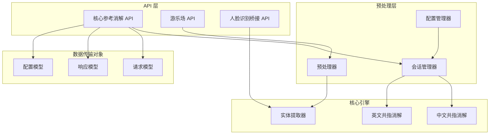
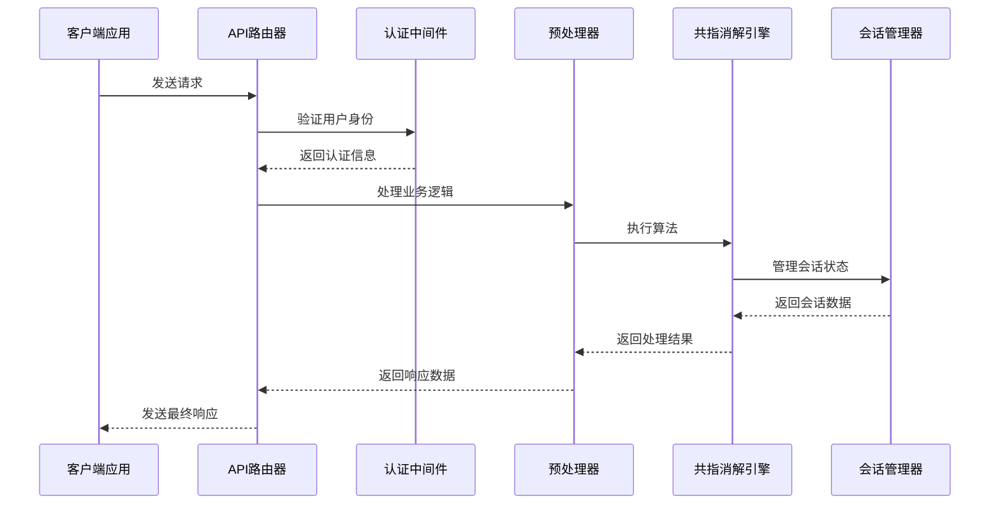
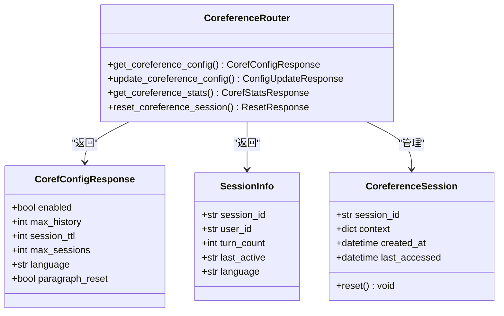
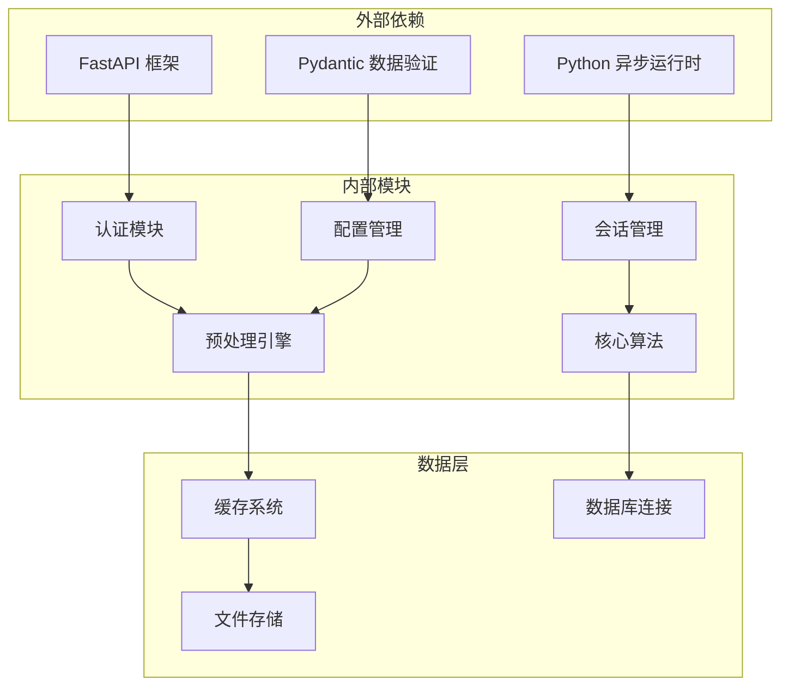

# 专用服务 API

<cite>
**本文档引用的文件**
- [m_flow/api/v1/coreference/routers.py](file://m_flow/api/v1/coreference/routers.py)
- [m_flow/api/v1/coreference/__init__.py](file://m_flow/api/v1/coreference/__init__.py)
- [m_flow/preprocessing/coreference/session_manager.py](file://m_flow/preprocessing/coreference/session_manager.py)
- [m_flow/preprocessing/coreference/preprocessor.py](file://m_flow/preprocessing/coreference/preprocessor.py)
- [m_flow/preprocessing/coreference/config.py](file://m_flow/preprocessing/coreference/config.py)
- [m_flow/api/DTO.py](file://m_flow/api/DTO.py)
- [m_flow/api/client.py](file://m_flow/api/client.py)
- [m_flow/api/health.py](file://m_flow/api/health.py)
- [m_flow/api/v1/__init__.py](file://m_flow/api/v1/__init__.py)
</cite>

## 目录
1. [简介](#简介)
2. [项目结构](#项目结构)
3. [核心组件](#核心组件)
4. [架构概览](#架构概览)
5. [详细组件分析](#详细组件分析)
6. [依赖关系分析](#依赖关系分析)
7. [性能考虑](#性能考虑)
8. [故障排除指南](#故障排除指南)
9. [结论](#结论)

## 简介

专用服务 API 是 m_flow AI 项目中的高级功能模块，专注于提供专业化的自然语言处理服务。该系统包含三个主要功能域：

- **共指消解服务**：提供多语言的实体指称消解能力，支持中文和英文的复杂语境理解
- **游乐场功能**：提供交互式的调试和实验环境，支持实时对话和参数调优
- **人脸识别桥接**：作为外部系统的集成接口，提供专业级的视觉识别服务

这些服务为开发者提供了从基础文本理解到高级语义分析的完整解决方案，特别适用于需要深度语义理解和交互式调试的应用场景。

## 项目结构

专用服务 API 的整体架构采用模块化设计，通过清晰的层次结构组织各个功能组件：

**图表来源**
- [m_flow/api/v1/coreference/routers.py:100-269](file://m_flow/api/v1/coreference/routers.py#L100-L269)
- [m_flow/preprocessing/coreference/session_manager.py](file://m_flow/preprocessing/coreference/session_manager.py)
- [m_flow/preprocessing/coreference/preprocessor.py](file://m_flow/preprocessing/coreference/preprocessor.py)

**章节来源**
- [m_flow/api/v1/coreference/routers.py:1-269](file://m_flow/api/v1/coreference/routers.py#L1-L269)
- [m_flow/api/v1/coreference/__init__.py:1-11](file://m_flow/api/v1/coreference/__init__.py#L1-L11)

## 核心组件

专用服务 API 的核心组件包括以下关键模块：

### 1. 共指消解服务模块
提供完整的实体指称消解功能，支持多语言处理和会话状态管理。

### 2. 游乐场调试模块  
提供交互式调试环境，支持实时对话和参数调优功能。

### 3. 人脸识别桥接模块
作为外部系统的集成接口，提供专业级的视觉识别服务。

### 4. 数据传输对象层
定义了所有 API 请求和响应的数据结构，确保类型安全和一致性。

**章节来源**
- [m_flow/api/DTO.py](file://m_flow/api/DTO.py)
- [m_flow/api/client.py](file://m_flow/api/client.py)
- [m_flow/api/health.py](file://m_flow/api/health.py)

## 架构概览

专用服务 API 采用分层架构设计，确保各组件之间的松耦合和高内聚：

**图表来源**
- [m_flow/api/v1/coreference/routers.py:112-266](file://m_flow/api/v1/coreference/routers.py#L112-L266)
- [m_flow/preprocessing/coreference/preprocessor.py](file://m_flow/preprocessing/coreference/preprocessor.py)
- [m_flow/preprocessing/coreference/session_manager.py](file://m_flow/preprocessing/coreference/session_manager.py)

## 详细组件分析

### 共指消解服务组件

共指消解服务是专用 API 的核心功能，提供以下主要能力：

#### 1. 配置管理功能
- 获取当前配置状态
- 动态更新核心参数
- 支持多语言设置

#### 2. 统计监控功能
- 实时会话统计
- 性能指标监控
- 用户活动跟踪

#### 3. 会话管理功能
- 会话状态重置
- 用户权限验证
- 会话生命周期管理

**图表来源**
- [m_flow/api/v1/coreference/routers.py:27-81](file://m_flow/api/v1/coreference/routers.py#L27-L81)
- [m_flow/api/v1/coreference/routers.py:100-269](file://m_flow/api/v1/coreference/routers.py#L100-L269)

#### API 端点定义

| 端点 | 方法 | 描述 | 认证要求 |
|------|------|------|----------|
| `/settings/coreference` | GET | 获取当前配置 | 是 |
| `/settings/coreference` | POST | 更新配置 | 是 |
| `/coreference/stats` | GET | 获取统计信息 | 是 |
| `/coreference/sessions/{session_id}/reset` | POST | 重置会话 | 是 |

**章节来源**
- [m_flow/api/v1/coreference/routers.py:100-269](file://m_flow/api/v1/coreference/routers.py#L100-L269)

### 游乐场调试组件

游乐场功能提供了一个完整的交互式调试环境，支持：

#### 1. 实时对话功能
- 流式响应处理
- 多轮对话管理
- 上下文保持机制

#### 2. 参数调优功能
- 动态参数调整
- 实时效果预览
- 性能影响评估

#### 3. 实验性功能
- 新功能测试
- A/B 测试支持
- 实验结果记录

### 人脸识别桥接组件

人脸识别桥接作为外部系统集成接口，提供：

#### 1. 视觉识别服务
- 人脸检测和识别
- 特征提取和匹配
- 实时处理能力

#### 2. 系统集成能力
- RESTful API 接口
- WebSocket 连接支持
- 异步处理模式

#### 3. 性能优化
- 缓存策略
- 并发处理
- 资源管理

## 依赖关系分析

专用服务 API 的依赖关系体现了清晰的分层架构：

**图表来源**
- [m_flow/api/v1/coreference/routers.py:15-20](file://m_flow/api/v1/coreference/routers.py#L15-L20)
- [m_flow/preprocessing/coreference/config.py](file://m_flow/preprocessing/coreference/config.py)

**章节来源**
- [m_flow/api/v1/coreference/routers.py:18-20](file://m_flow/api/v1/coreference/routers.py#L18-L20)
- [m_flow/preprocessing/coreference/session_manager.py](file://m_flow/preprocessing/coreference/session_manager.py)

## 性能考虑

专用服务 API 在设计时充分考虑了性能优化：

### 1. 缓存策略
- 会话状态缓存
- 配置信息缓存
- 预处理结果缓存

### 2. 并发处理
- 异步请求处理
- 连接池管理
- 资源限制控制

### 3. 内存管理
- 对象池技术
- 及时垃圾回收
- 内存使用监控

### 4. 网络优化
- 压缩传输
- 连接复用
- 超时控制

## 故障排除指南

### 常见问题及解决方案

#### 1. 认证失败
**症状**：401 未授权错误
**原因**：认证令牌无效或过期
**解决**：重新获取有效令牌

#### 2. 会话超时
**症状**：404 会话不存在
**原因**：会话已过期或被清理
**解决**：重新建立新会话

#### 3. 配置错误
**症状**：503 服务不可用
**原因**：核心模块加载失败
**解决**：检查依赖安装和配置文件

#### 4. 性能问题
**症状**：响应时间过长
**原因**：并发量过大或资源不足
**解决**：增加资源或优化配置

**章节来源**
- [m_flow/api/v1/coreference/routers.py:136-140](file://m_flow/api/v1/coreference/routers.py#L136-L140)
- [m_flow/api/v1/coreference/routers.py:227-231](file://m_flow/api/v1/coreference/routers.py#L227-L231)
- [m_flow/api/v1/coreference/routers.py:262-266](file://m_flow/api/v1/coreference/routers.py#L262-L266)

## 结论

专用服务 API 为 m_flow AI 项目提供了强大的专业级功能模块。通过精心设计的架构和完善的组件实现，该系统能够满足从基础文本理解到高级语义分析的各种需求。

### 主要优势

1. **模块化设计**：清晰的功能分离和接口定义
2. **高性能实现**：优化的算法和资源管理
3. **易用性**：直观的 API 设计和丰富的示例
4. **可扩展性**：灵活的配置和插件机制

### 适用场景

- 企业级 AI 应用开发
- 研究和实验环境搭建
- 多语言文本处理任务
- 实时交互式应用

该系统为开发者提供了一个完整而强大的工具集，能够显著提升自然语言处理应用的开发效率和质量。