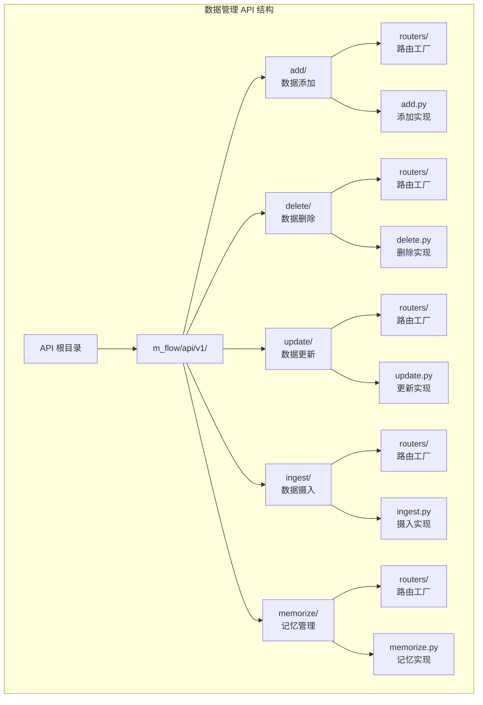
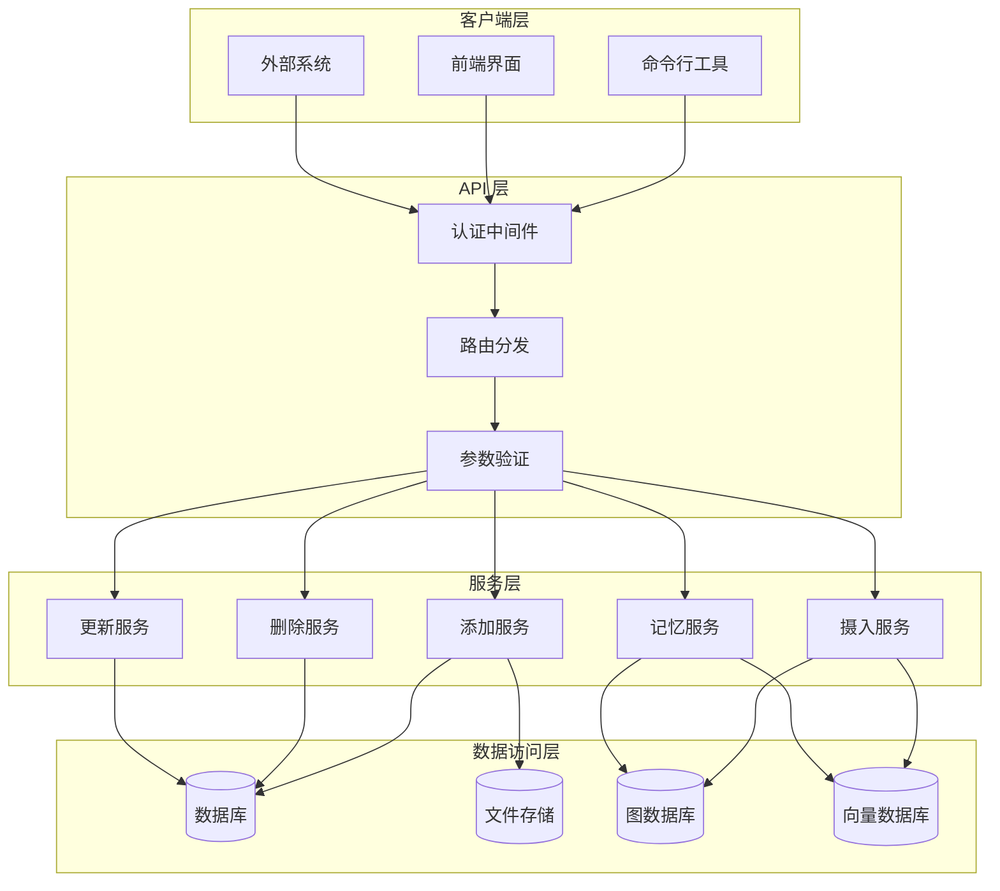
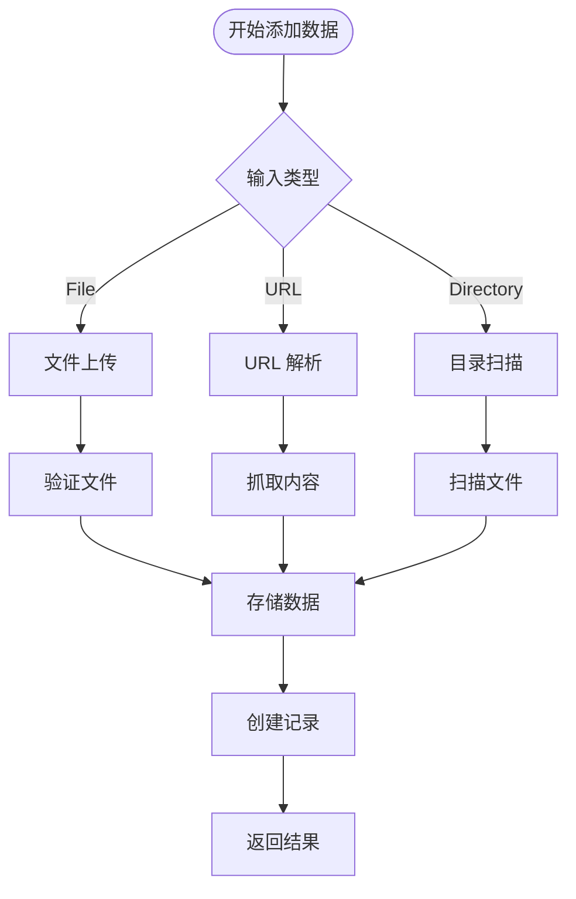
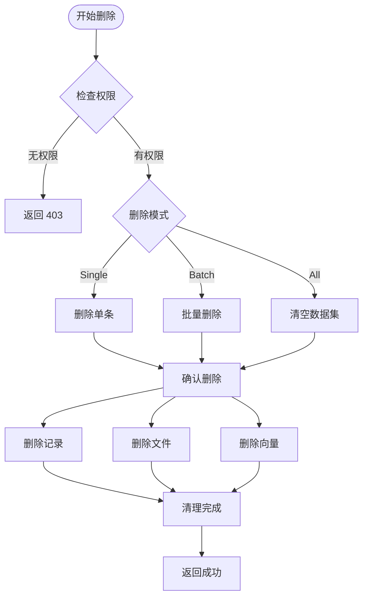
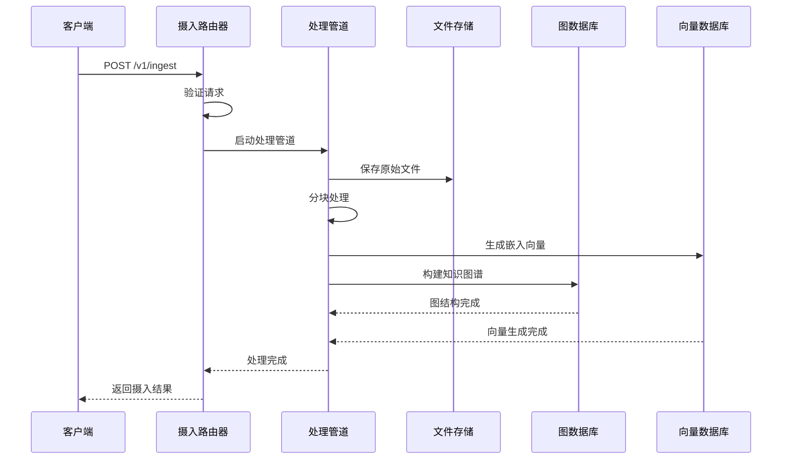
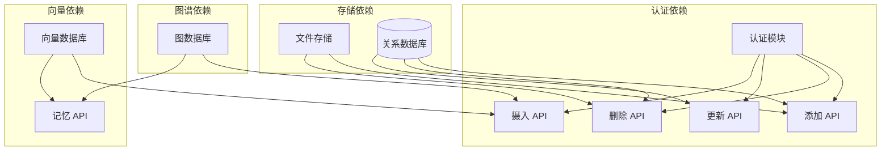

# 数据管理 API

<cite>
**本文引用的文件**
- [get_add_router.py](file://m_flow/api/v1/add/routers/get_add_router.py)
- [add.py](file://m_flow/api/v1/add/add.py)
- [get_delete_router.py](file://m_flow/api/v1/delete/routers/get_delete_router.py)
- [delete.py](file://m_flow/api/v1/delete/delete.py)
- [get_update_router.py](file://m_flow/api/v1/update/routers/get_update_router.py)
- [update.py](file://m_flow/api/v1/update/update.py)
- [get_ingest_router.py](file://m_flow/api/v1/ingest/routers/get_ingest_router.py)
- [ingest.py](file://m_flow/api/v1/ingest/ingest.py)
- [get_memorize_router.py](file://m_flow/api/v1/memorize/routers/get_memorize_router.py)
- [memorize.py](file://m_flow/api/v1/memorize/memorize.py)
- [create_dataset.py](file://m_flow/data/methods/create_dataset.py)
- [get_dataset.py](file://m_flow/data/methods/get_dataset.py)
- [get_datasets.py](file://m_flow/data/methods/get_datasets.py)
- [Dataset.py](file://m_flow/data/models/Dataset.py)
- [Data.py](file://m_flow/data/models/Data.py)
- [get_api_bearer_router.py](file://m_flow/auth/authentication/api_bearer/routers/get_api_bearer_router.py)
- [check_dataset_permission.py](file://m_flow/auth/permissions/methods/check_dataset_permission.py)
- [file_upload.py](file://m_flow/shared/files/file_upload.py)
- [url_resolver.py](file://m_flow/shared/files/url_resolver.py)
- [file_storage.py](file://m_flow/shared/files/file_storage.py)
- [web_scraper.py](file://m_flow/shared/files/web_scraper/web_scraper.py)
</cite>

## 目录
1. [简介](#简介)
2. [项目结构](#项目结构)
3. [核心组件](#核心组件)
4. [架构概览](#架构概览)
5. [详细组件分析](#详细组件分析)
6. [依赖关系分析](#依赖关系分析)
7. [性能考虑](#性能考虑)
8. [故障排除指南](#故障排除指南)
9. [结论](#结论)

## 简介

数据管理 API 是 M-flow 框架的核心数据操作接口集合，提供了对数据集和数据项的完整管理能力。该 API 包含数据添加、删除、更新、摄入和记忆等功能模块，支持文件上传、URL 抓取、目录扫描等多种数据源接入方式。

本系统采用分层架构设计，通过 FastAPI 提供 RESTful 接口，结合身份认证和权限控制机制，确保数据操作的安全性和可靠性。所有管理接口均支持多数据集隔离和租户隔离，适用于企业级知识管理场景。

## 项目结构

数据管理 API 的组织结构遵循功能模块化原则：

**图表来源**
- [get_add_router.py:1-150](file://m_flow/api/v1/add/routers/get_add_router.py#L1-L150)
- [get_delete_router.py:1-120](file://m_flow/api/v1/delete/routers/get_delete_router.py#L1-L120)
- [get_ingest_router.py:1-180](file://m_flow/api/v1/ingest/routers/get_ingest_router.py#L1-L180)

## 核心组件

数据管理 API 由五个核心组件构成：

### 数据添加组件
负责将新数据项添加到指定数据集，支持文件上传、URL 解析和目录扫描三种方式。

### 数据删除组件
提供安全的数据删除功能，支持单条和批量删除操作。

### 数据更新组件
允许更新现有数据项的元数据和内容。

### 数据摄入组件
处理大规模数据摄入，支持分块、分类和存储管道。

### 记忆管理组件
协调数据摄入与记忆系统的交互，管理记忆化流程。

**章节来源**
- [add.py:1-100](file://m_flow/api/v1/add/add.py#L1-L100)
- [delete.py:1-80](file://m_flow/api/v1/delete/delete.py#L1-L80)
- [ingest.py:1-150](file://m_flow/api/v1/ingest/ingest.py#L1-L150)

## 架构概览

数据管理 API 采用分层架构设计：

**图表来源**
- [DTO.py:1-50](file://m_flow/api/DTO.py#L1-L50)
- [get_add_router.py:50-150](file://m_flow/api/v1/add/routers/get_add_router.py#L50-L150)

## 详细组件分析

### 数据添加 API 分析

数据添加 API 提供了灵活的数据接入方式：

#### 支持的数据格式

1. **文档格式**：PDF、Word、Excel、PPT、TXT、Markdown
2. **多媒体格式**：图片、音频、视频
3. **数据格式**：JSON、CSV、XML

**章节来源**
- [file_upload.py:1-100](file://m_flow/shared/files/file_upload.py#L1-L100)
- [url_resolver.py:1-80](file://m_flow/shared/files/url_resolver.py#L1-L80)

### 数据删除 API 分析

数据删除 API 实现了安全的删除机制：

#### 安全措施

1. **权限验证**：确保用户有数据集访问权限
2. **软删除选项**：支持标记删除而非物理删除
3. **级联清理**：自动清理关联的向量和图数据

**章节来源**
- [delete.py:1-80](file://m_flow/api/v1/delete/delete.py#L1-L80)
- [check_dataset_permission.py:1-50](file://m_flow/auth/permissions/methods/check_dataset_permission.py#L1-L50)

### 数据摄入 API 分析

数据摄入 API 处理大规模数据导入：

#### 摄入流程

1. **文件解析**：提取文本和元数据
2. **分块处理**：按策略切分内容
3. **向量化**：生成语义向量
4. **图谱构建**：提取实体和关系
5. **存储索引**：建立检索索引

**章节来源**
- [ingest.py:1-150](file://m_flow/api/v1/ingest/ingest.py#L1-L150)
- [web_scraper.py:1-100](file://m_flow/shared/files/web_scraper/web_scraper.py#L1-L100)

## 依赖关系分析

数据管理 API 的组件依赖关系：

**图表来源**
- [get_add_router.py:20-50](file://m_flow/api/v1/add/routers/get_add_router.py#L20-L50)
- [get_ingest_router.py:30-80](file://m_flow/api/v1/ingest/routers/get_ingest_router.py#L30-L80)

## 性能考虑

### 异步处理

- 文件上传采用流式处理，支持大文件
- 向量化操作异步执行，不阻塞主流程
- 批量操作使用批处理优化性能

### 缓存策略

- 频繁访问的数据集信息缓存
- 元数据查询结果短期缓存
- 避免重复计算和数据库查询

### 并发控制

- 连接池管理数据库连接
- 请求限流防止系统过载
- 队列机制处理高并发场景

## 故障排除指南

### 常见问题

#### 上传失败
- 检查文件大小是否超出限制
- 验证文件格式是否支持
- 确认存储路径可写

#### 摄入卡顿
- 检查向量数据库连接
- 验证 LLM 服务可用性
- 查看管道日志定位问题

#### 权限错误
- 确认数据集存在
- 验证用户角色权限
- 检查 API 令牌有效性

**章节来源**
- [file_storage.py:1-60](file://m_flow/shared/files/file_storage.py#L1-L60)
- [error_responses.py](file://m_flow/api/v1/responses/error_responses.py)

## 结论

数据管理 API 提供了全面而强大的数据操作能力，通过模块化的架构设计和严格的安全控制，确保了数据管理操作的安全性和可靠性。该 API 的主要优势包括：

1. **多数据源支持**：文件、URL、目录等多种接入方式
2. **安全可靠**：身份认证和权限控制
3. **高性能**：异步处理和批量操作
4. **可扩展**：模块化设计便于功能扩展
5. **完整生命周期**：支持添加、删除、更新、摄入的全流程