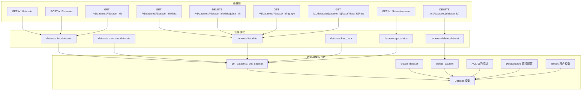
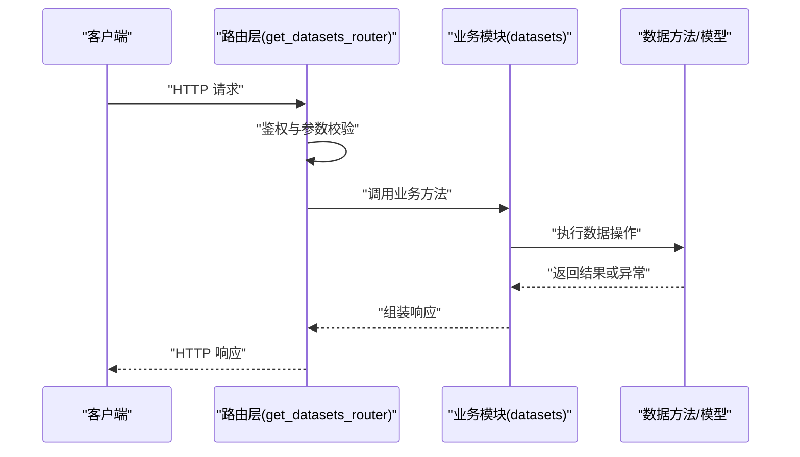
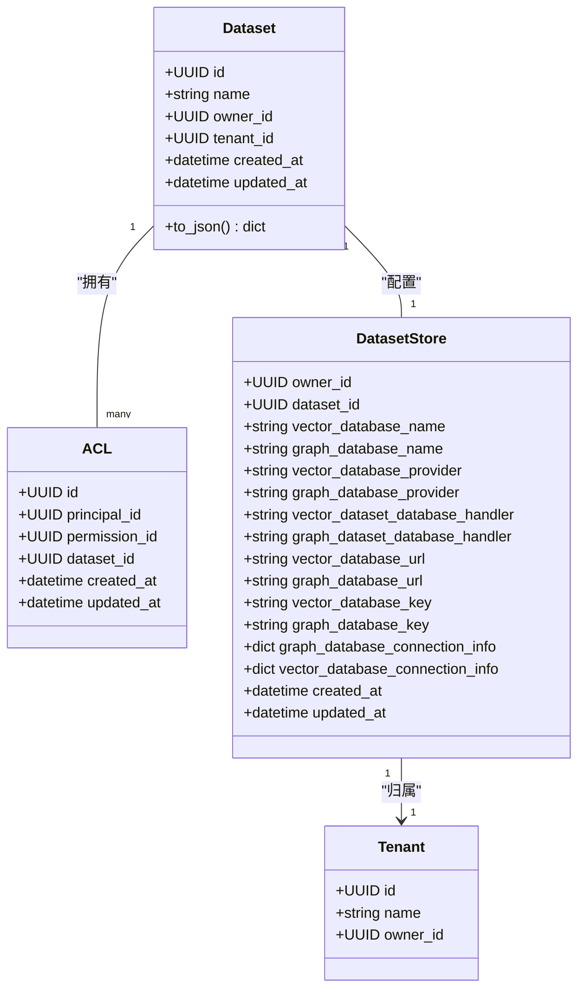
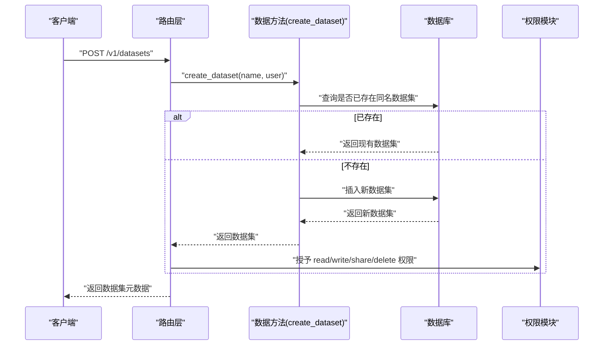
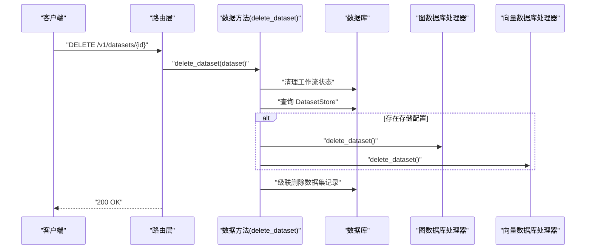
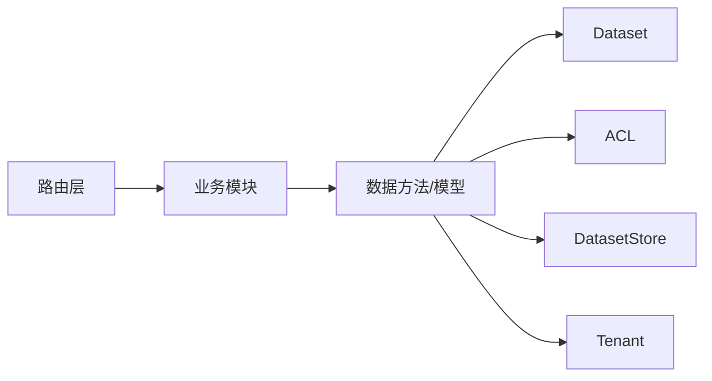

# 数据集管理 API

<cite>
**本文引用的文件**
- [m_flow/api/v1/datasets/routers/get_datasets_router.py](file://m_flow/api/v1/datasets/routers/get_datasets_router.py)
- [m_flow/api/v1/datasets/datasets.py](file://m_flow/api/v1/datasets/datasets.py)
- [m_flow/data/models/Dataset.py](file://m_flow/data/models/Dataset.py)
- [m_flow/data/methods/create_dataset.py](file://m_flow/data/methods/create_dataset.py)
- [m_flow/data/methods/get_datasets.py](file://m_flow/data/methods/get_datasets.py)
- [m_flow/data/methods/get_dataset.py](file://m_flow/data/methods/get_dataset.py)
- [m_flow/data/methods/delete_dataset.py](file://m_flow/data/methods/delete_dataset.py)
- [m_flow/auth/models/ACL.py](file://m_flow/auth/models/ACL.py)
- [m_flow/auth/models/DatasetStore.py](file://m_flow/auth/models/DatasetStore.py)
- [m_flow/auth/models/Tenant.py](file://m_flow/auth/models/Tenant.py)
</cite>

## 目录
1. [简介](#简介)
2. [项目结构](#项目结构)
3. [核心组件](#核心组件)
4. [架构总览](#架构总览)
5. [详细组件分析](#详细组件分析)
6. [依赖分析](#依赖分析)
7. [性能考虑](#性能考虑)
8. [故障排查指南](#故障排查指南)
9. [结论](#结论)
10. [附录](#附录)

## 简介
本文件面向数据集管理 API 的使用者与维护者，系统性说明数据集的创建、查询、更新与删除接口；阐述元数据管理、权限分配、容量与生命周期管理策略；介绍数据集发现、过滤与排序能力；并给出备份、恢复与迁移的 API 使用建议。同时解释数据集与用户权限、租户隔离及访问控制之间的关系。

## 项目结构
数据集管理 API 由三层组成：
- 路由层：定义 REST 接口与请求/响应模型，负责鉴权与错误处理
- 业务模块：封装数据集列表、创建、删除、状态查询等逻辑
- 数据模型与方法：定义数据集实体、持久化关系与数据库操作

图表来源
- [m_flow/api/v1/datasets/routers/get_datasets_router.py:150-555](file://m_flow/api/v1/datasets/routers/get_datasets_router.py#L150-L555)
- [m_flow/api/v1/datasets/datasets.py:19-137](file://m_flow/api/v1/datasets/datasets.py#L19-L137)
- [m_flow/data/models/Dataset.py:33-111](file://m_flow/data/models/Dataset.py#L33-L111)
- [m_flow/data/methods/create_dataset.py:18-66](file://m_flow/data/methods/create_dataset.py#L18-L66)
- [m_flow/data/methods/get_datasets.py:15-22](file://m_flow/data/methods/get_datasets.py#L15-L22)
- [m_flow/data/methods/get_dataset.py:13-37](file://m_flow/data/methods/get_dataset.py#L13-L37)
- [m_flow/data/methods/delete_dataset.py:28-119](file://m_flow/data/methods/delete_dataset.py#L28-L119)
- [m_flow/auth/models/ACL.py:21-38](file://m_flow/auth/models/ACL.py#L21-L38)
- [m_flow/auth/models/DatasetStore.py:19-49](file://m_flow/auth/models/DatasetStore.py#L19-L49)
- [m_flow/auth/models/Tenant.py:24-74](file://m_flow/auth/models/Tenant.py#L24-L74)

章节来源
- [m_flow/api/v1/datasets/routers/get_datasets_router.py:150-555](file://m_flow/api/v1/datasets/routers/get_datasets_router.py#L150-L555)
- [m_flow/api/v1/datasets/datasets.py:19-137](file://m_flow/api/v1/datasets/datasets.py#L19-L137)
- [m_flow/data/models/Dataset.py:33-111](file://m_flow/data/models/Dataset.py#L33-L111)

## 核心组件
- 数据集模型（Dataset）：描述数据集的标识、归属、时间戳与关联的数据项集合
- 路由器（get_datasets_router）：提供完整的数据集 CRUD、数据项管理、图谱可视化、状态查询与原始文件下载接口
- 业务模块（datasets）：以静态方法形式提供程序化调用能力，如列出、发现、检查数据存在性、获取处理状态、删除数据集
- 权限与租户（ACL、Tenant、DatasetStore）：实现基于用户的细粒度权限控制、多租户隔离与数据存储连接配置

章节来源
- [m_flow/data/models/Dataset.py:33-111](file://m_flow/data/models/Dataset.py#L33-L111)
- [m_flow/api/v1/datasets/routers/get_datasets_router.py:150-555](file://m_flow/api/v1/datasets/routers/get_datasets_router.py#L150-L555)
- [m_flow/api/v1/datasets/datasets.py:19-137](file://m_flow/api/v1/datasets/datasets.py#L19-L137)
- [m_flow/auth/models/ACL.py:21-38](file://m_flow/auth/models/ACL.py#L21-L38)
- [m_flow/auth/models/Tenant.py:24-74](file://m_flow/auth/models/Tenant.py#L24-L74)
- [m_flow/auth/models/DatasetStore.py:19-49](file://m_flow/auth/models/DatasetStore.py#L19-L49)

## 架构总览
数据集管理 API 的调用链路遵循“路由层 → 业务模块 → 数据方法/模型”的分层设计。路由层负责认证、鉴权、参数校验与异常转换；业务模块封装领域逻辑；数据层通过 SQLAlchemy ORM 与适配器完成持久化。

图表来源
- [m_flow/api/v1/datasets/routers/get_datasets_router.py:150-555](file://m_flow/api/v1/datasets/routers/get_datasets_router.py#L150-L555)
- [m_flow/api/v1/datasets/datasets.py:19-137](file://m_flow/api/v1/datasets/datasets.py#L19-L137)

## 详细组件分析

### 路由与端点概览
- 列表与创建
  - GET /v1/datasets：列出当前用户可访问的数据集，支持带计数参数
  - POST /v1/datasets：创建新数据集，若同名则返回现有实例，并授予完整权限
- 单个数据集
  - GET /v1/datasets/{dataset_id}：返回数据集元数据与数据项数量
  - DELETE /v1/datasets/{dataset_id}：删除数据集及其关联存储
- 数据项管理
  - GET /v1/datasets/{dataset_id}/data：列出数据项元数据
  - DELETE /v1/datasets/{dataset_id}/data/{data_id}：删除指定数据项
  - GET /v1/datasets/{dataset_id}/data/{data_id}/raw：下载原始文件
- 可视化与状态
  - GET /v1/datasets/{dataset_id}/graph：返回知识图谱节点与边
  - GET /v1/datasets/status：查询指定数据集的处理状态

章节来源
- [m_flow/api/v1/datasets/routers/get_datasets_router.py:150-555](file://m_flow/api/v1/datasets/routers/get_datasets_router.py#L150-L555)

### 数据集模型与关系

图表来源
- [m_flow/data/models/Dataset.py:33-111](file://m_flow/data/models/Dataset.py#L33-L111)
- [m_flow/auth/models/ACL.py:21-38](file://m_flow/auth/models/ACL.py#L21-L38)
- [m_flow/auth/models/DatasetStore.py:19-49](file://m_flow/auth/models/DatasetStore.py#L19-L49)
- [m_flow/auth/models/Tenant.py:24-74](file://m_flow/auth/models/Tenant.py#L24-L74)

章节来源
- [m_flow/data/models/Dataset.py:33-111](file://m_flow/data/models/Dataset.py#L33-L111)
- [m_flow/auth/models/ACL.py:21-38](file://m_flow/auth/models/ACL.py#L21-L38)
- [m_flow/auth/models/DatasetStore.py:19-49](file://m_flow/auth/models/DatasetStore.py#L19-L49)
- [m_flow/auth/models/Tenant.py:24-74](file://m_flow/auth/models/Tenant.py#L24-L74)

### 创建数据集流程

图表来源
- [m_flow/api/v1/datasets/routers/get_datasets_router.py:202-246](file://m_flow/api/v1/datasets/routers/get_datasets_router.py#L202-L246)
- [m_flow/data/methods/create_dataset.py:18-66](file://m_flow/data/methods/create_dataset.py#L18-L66)

章节来源
- [m_flow/api/v1/datasets/routers/get_datasets_router.py:202-246](file://m_flow/api/v1/datasets/routers/get_datasets_router.py#L202-L246)
- [m_flow/data/methods/create_dataset.py:18-66](file://m_flow/data/methods/create_dataset.py#L18-L66)

### 删除数据集流程

图表来源
- [m_flow/api/v1/datasets/routers/get_datasets_router.py:291-318](file://m_flow/api/v1/datasets/routers/get_datasets_router.py#L291-L318)
- [m_flow/data/methods/delete_dataset.py:28-119](file://m_flow/data/methods/delete_dataset.py#L28-L119)

章节来源
- [m_flow/api/v1/datasets/routers/get_datasets_router.py:291-318](file://m_flow/api/v1/datasets/routers/get_datasets_router.py#L291-L318)
- [m_flow/data/methods/delete_dataset.py:28-119](file://m_flow/data/methods/delete_dataset.py#L28-L119)

### 数据项管理与原始文件下载
- 列出数据项：GET /v1/datasets/{dataset_id}/data 返回数据项元数据列表
- 删除数据项：DELETE /v1/datasets/{dataset_id}/data/{data_id} 删除单条数据项
- 下载原始文件：GET /v1/datasets/{dataset_id}/data/{data_id}/raw 返回原始文件

章节来源
- [m_flow/api/v1/datasets/routers/get_datasets_router.py:379-511](file://m_flow/api/v1/datasets/routers/get_datasets_router.py#L379-L511)

### 知识图谱可视化
- GET /v1/datasets/{dataset_id}/graph 返回节点与边的图结构，用于前端可视化展示

章节来源
- [m_flow/api/v1/datasets/routers/get_datasets_router.py:360-377](file://m_flow/api/v1/datasets/routers/get_datasets_router.py#L360-L377)

### 处理状态查询
- GET /v1/datasets/status 支持传入多个数据集 ID，返回每个数据集的处理状态映射

章节来源
- [m_flow/api/v1/datasets/routers/get_datasets_router.py:420-448](file://m_flow/api/v1/datasets/routers/get_datasets_router.py#L420-L448)
- [m_flow/api/v1/datasets/datasets.py:102-121](file://m_flow/api/v1/datasets/datasets.py#L102-L121)

### 数据集发现与过滤排序
- 发现：业务模块提供目录扫描能力，返回潜在数据集名称列表
- 过滤与排序：路由层提供 with_counts 参数用于按数据项数量返回；具体排序字段可在响应模型中扩展

章节来源
- [m_flow/api/v1/datasets/datasets.py:42-58](file://m_flow/api/v1/datasets/datasets.py#L42-L58)
- [m_flow/api/v1/datasets/routers/get_datasets_router.py:152-193](file://m_flow/api/v1/datasets/routers/get_datasets_router.py#L152-L193)

### 元数据管理
- 数据集元数据包括：ID、名称、创建/更新时间、所有者 ID、可选租户 ID、数据项列表
- 数据项元数据包括：ID、名称、扩展名、MIME 类型、处理后路径、大小、token 数、工作流状态等

章节来源
- [m_flow/data/models/Dataset.py:90-111](file://m_flow/data/models/Dataset.py#L90-L111)
- [m_flow/api/v1/datasets/routers/get_datasets_router.py:62-76](file://m_flow/api/v1/datasets/routers/get_datasets_router.py#L62-L76)

### 权限分配与访问控制
- ACL 表将主体（用户/角色）与权限绑定到具体数据集
- 路由层在关键操作前进行权限校验，拒绝无权限请求
- 新建数据集自动授予创建者完整权限

章节来源
- [m_flow/auth/models/ACL.py:21-38](file://m_flow/auth/models/ACL.py#L21-L38)
- [m_flow/api/v1/datasets/routers/get_datasets_router.py:126-142](file://m_flow/api/v1/datasets/routers/get_datasets_router.py#L126-L142)
- [m_flow/api/v1/datasets/routers/get_datasets_router.py:237-239](file://m_flow/api/v1/datasets/routers/get_datasets_router.py#L237-L239)

### 租户隔离
- 数据集与租户 ID 关联，确保跨租户数据隔离
- 用户与租户通过中间表关联，权限继承与默认权限由租户维度管理

章节来源
- [m_flow/data/models/Dataset.py:68-69](file://m_flow/data/models/Dataset.py#L68-L69)
- [m_flow/auth/models/Tenant.py:24-74](file://m_flow/auth/models/Tenant.py#L24-L74)

### 容量限制与生命周期管理
- 容量限制：通过数据项数量与大小字段（如 data_size、token_count）在元数据中体现，实际阈值需结合存储后端配置
- 生命周期：删除数据集时会清理工作流状态、图/向量存储与数据库记录，确保资源回收

章节来源
- [m_flow/api/v1/datasets/routers/get_datasets_router.py:62-76](file://m_flow/api/v1/datasets/routers/get_datasets_router.py#L62-L76)
- [m_flow/data/methods/delete_dataset.py:28-119](file://m_flow/data/methods/delete_dataset.py#L28-L119)

### 备份、恢复与迁移
- 备份：通过“下载原始文件”接口导出数据项原始内容，结合元数据导出实现逻辑备份
- 恢复：先创建目标数据集，再上传数据项并重建索引
- 迁移：在不同租户或环境间复制数据集元数据与原始文件，必要时重建图/向量索引

章节来源
- [m_flow/api/v1/datasets/routers/get_datasets_router.py:450-511](file://m_flow/api/v1/datasets/routers/get_datasets_router.py#L450-L511)
- [m_flow/auth/models/DatasetStore.py:19-49](file://m_flow/auth/models/DatasetStore.py#L19-L49)

## 依赖分析
- 路由层依赖权限模块与数据方法，确保每次操作均经过鉴权与授权
- 业务模块依赖数据方法与工具函数，提供程序化调用入口
- 数据模型与方法通过 ORM 映射数据库表，ACL 与 DatasetStore 提供权限与存储配置支撑

图表来源
- [m_flow/api/v1/datasets/routers/get_datasets_router.py:150-555](file://m_flow/api/v1/datasets/routers/get_datasets_router.py#L150-L555)
- [m_flow/api/v1/datasets/datasets.py:19-137](file://m_flow/api/v1/datasets/datasets.py#L19-L137)
- [m_flow/data/models/Dataset.py:33-111](file://m_flow/data/models/Dataset.py#L33-L111)
- [m_flow/auth/models/ACL.py:21-38](file://m_flow/auth/models/ACL.py#L21-L38)
- [m_flow/auth/models/DatasetStore.py:19-49](file://m_flow/auth/models/DatasetStore.py#L19-L49)
- [m_flow/auth/models/Tenant.py:24-74](file://m_flow/auth/models/Tenant.py#L24-L74)

章节来源
- [m_flow/api/v1/datasets/routers/get_datasets_router.py:150-555](file://m_flow/api/v1/datasets/routers/get_datasets_router.py#L150-L555)
- [m_flow/api/v1/datasets/datasets.py:19-137](file://m_flow/api/v1/datasets/datasets.py#L19-L137)

## 性能考虑
- 列表接口支持 with_counts 参数，建议在需要统计时启用，避免额外查询
- 批量状态查询支持多数据集 ID，减少往返次数
- 删除数据集时先清理工作流状态，避免重复加载导致的额外开销

## 故障排查指南
- 404 错误：数据集或数据项不存在，检查 ID 与权限
- 500 错误：服务端异常，查看日志并重试
- 权限不足：确认 ACL 配置与租户归属

章节来源
- [m_flow/api/v1/datasets/routers/get_datasets_router.py:194-199](file://m_flow/api/v1/datasets/routers/get_datasets_router.py#L194-L199)
- [m_flow/api/v1/datasets/routers/get_datasets_router.py:347-357](file://m_flow/api/v1/datasets/routers/get_datasets_router.py#L347-L357)

## 结论
数据集管理 API 提供了从创建、查询、删除到数据项管理与状态监控的完整能力，配合 ACL 与租户模型实现了细粒度的权限控制与多租户隔离。通过原始文件下载与元数据导出，可构建完善的备份、恢复与迁移方案。

## 附录
- 常用端点清单
  - GET /v1/datasets
  - POST /v1/datasets
  - GET /v1/datasets/{dataset_id}
  - DELETE /v1/datasets/{dataset_id}
  - GET /v1/datasets/{dataset_id}/data
  - DELETE /v1/datasets/{dataset_id}/data/{data_id}
  - GET /v1/datasets/{dataset_id}/graph
  - GET /v1/datasets/status
  - GET /v1/datasets/{dataset_id}/data/{data_id}/raw