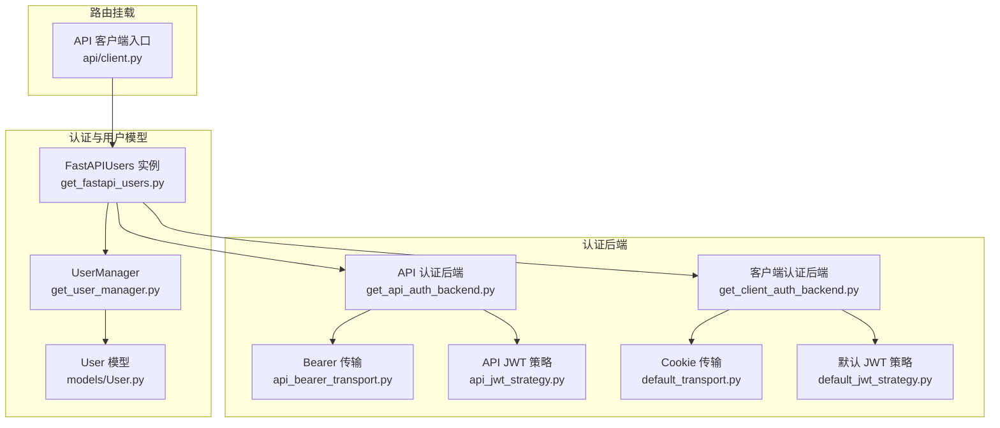
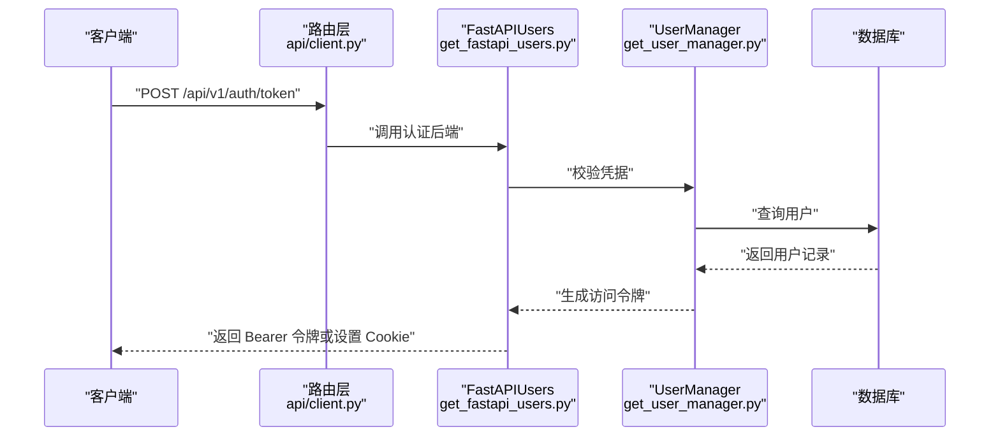
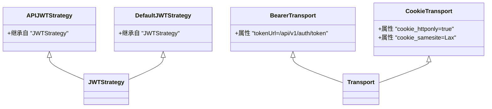
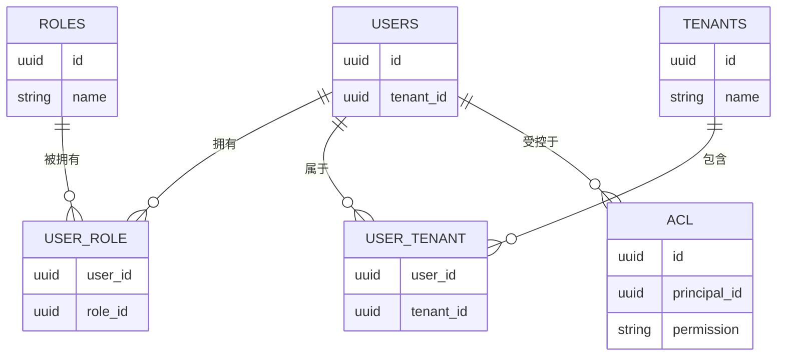
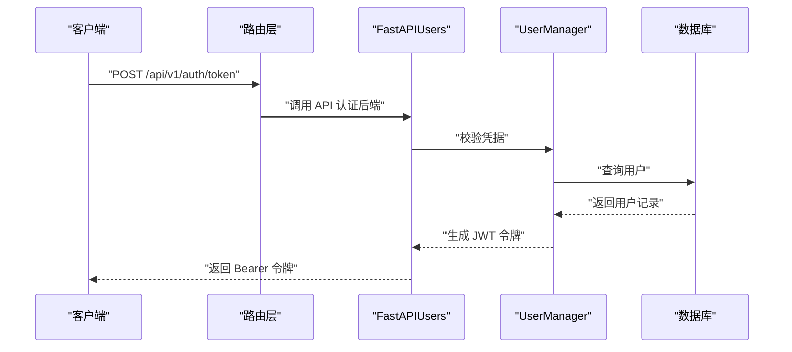
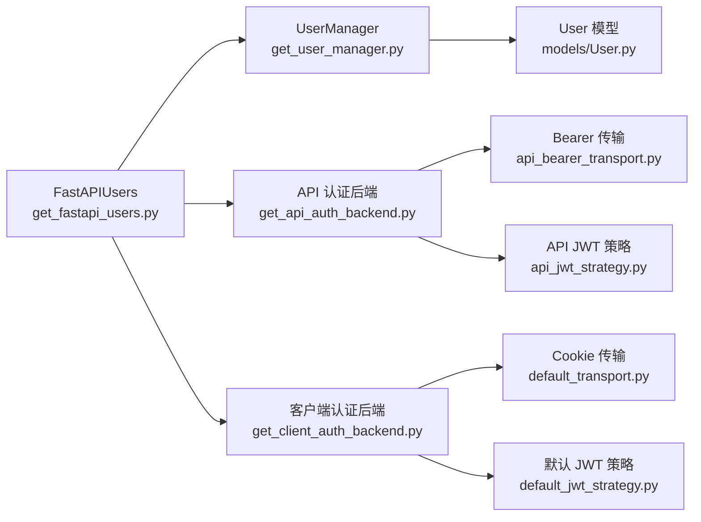

# 用户管理 API

<cite>
**本文引用的文件**
- [m_flow/auth/get_fastapi_users.py](file://m_flow/auth/get_fastapi_users.py)
- [m_flow/auth/get_user_manager.py](file://m_flow/auth/get_user_manager.py)
- [m_flow/auth/authentication/get_api_auth_backend.py](file://m_flow/auth/authentication/get_api_auth_backend.py)
- [m_flow/auth/authentication/get_client_auth_backend.py](file://m_flow/auth/authentication/get_client_auth_backend.py)
- [m_flow/auth/authentication/api_bearer/api_bearer_transport.py](file://m_flow/auth/authentication/api_bearer/api_bearer_transport.py)
- [m_flow/auth/authentication/api_bearer/api_jwt_strategy.py](file://m_flow/auth/authentication/api_bearer/api_jwt_strategy.py)
- [m_flow/auth/authentication/default/default_transport.py](file://m_flow/auth/authentication/default/default_transport.py)
- [m_flow/auth/authentication/default/default_jwt_strategy.py](file://m_flow/auth/authentication/default/default_jwt_strategy.py)
- [m_flow/auth/models/User.py](file://m_flow/auth/models/User.py)
- [m_flow/api/client.py](file://m_flow/api/client.py)
- [m_flow/tests/e2e/test_e2e_user_scenarios.py](file://m_flow/tests/e2e/test_e2e_user_scenarios.py)
</cite>

## 目录
1. [简介](#简介)
2. [项目结构](#项目结构)
3. [核心组件](#核心组件)
4. [架构总览](#架构总览)
5. [详细组件分析](#详细组件分析)
6. [依赖分析](#依赖分析)
7. [性能考虑](#性能考虑)
8. [故障排查指南](#故障排查指南)
9. [结论](#结论)
10. [附录](#附录)

## 简介
本文件面向用户管理 API 的使用与集成，覆盖以下接口与能力：
- 认证：POST /api/v1/auth/token（基于 Bearer 传输）
- 注册：POST /api/v1/users/register（由 FastAPI Users 默认路由提供）
- 用户信息管理：GET /api/v1/users/me 与 PUT /api/v1/users/me（由 FastAPI Users 默认路由提供）
- 账户验证：POST /api/v1/users/verify（由 FastAPI Users 默认路由提供）

同时，文档系统性阐述 JWT 令牌机制、会话管理、密码策略、用户角色与权限继承、多租户支持，并给出 OAuth 集成、双因素认证与安全审计的扩展建议。

## 项目结构
用户管理相关模块集中在 m_flow/auth 下，采用 FastAPI Users 框架进行认证与用户生命周期管理；API 路由通过 m_flow/api/client.py 统一挂载到 /api/v1 前缀下。

图表来源
- [m_flow/auth/get_fastapi_users.py:22-47](file://m_flow/auth/get_fastapi_users.py#L22-L47)
- [m_flow/auth/get_user_manager.py:28-46](file://m_flow/auth/get_user_manager.py#L28-L46)
- [m_flow/auth/models/User.py:25-63](file://m_flow/auth/models/User.py#L25-L63)
- [m_flow/auth/authentication/get_api_auth_backend.py:22-45](file://m_flow/auth/authentication/get_api_auth_backend.py#L22-L45)
- [m_flow/auth/authentication/get_client_auth_backend.py:22-47](file://m_flow/auth/authentication/get_client_auth_backend.py#L22-L47)
- [m_flow/auth/authentication/api_bearer/api_bearer_transport.py:11-16](file://m_flow/auth/authentication/api_bearer/api_bearer_transport.py#L11-L16)
- [m_flow/auth/authentication/api_bearer/api_jwt_strategy.py:10-16](file://m_flow/auth/authentication/api_bearer/api_jwt_strategy.py#L10-L16)
- [m_flow/auth/authentication/default/default_transport.py:30-38](file://m_flow/auth/authentication/default/default_transport.py#L30-L38)
- [m_flow/auth/authentication/default/default_jwt_strategy.py:8-15](file://m_flow/auth/authentication/default/default_jwt_strategy.py#L8-L15)
- [m_flow/api/client.py:321-321](file://m_flow/api/client.py#L321-L321)

章节来源
- [m_flow/auth/get_fastapi_users.py:22-47](file://m_flow/auth/get_fastapi_users.py#L22-L47)
- [m_flow/api/client.py:321-321](file://m_flow/api/client.py#L321-L321)

## 核心组件
- FastAPI Users 工厂：负责构建带多个认证后端的用户应用实例，确保单例行为。
- UserManager：扩展 FastAPI Users 默认实现，注入生命周期钩子与登录响应处理。
- 认证后端：
  - API 后端：基于 Bearer 传输与 JWT 策略，用于 API 密钥场景。
  - 客户端后端：基于 Cookie 传输与 JWT 策略，用于 Web 会话场景。
- 用户模型：定义用户表、角色关联、租户关联与 FastAPI-Users 兼容的 Pydantic 模式。

章节来源
- [m_flow/auth/get_fastapi_users.py:22-47](file://m_flow/auth/get_fastapi_users.py#L22-L47)
- [m_flow/auth/get_user_manager.py:28-46](file://m_flow/auth/get_user_manager.py#L28-L46)
- [m_flow/auth/authentication/get_api_auth_backend.py:22-45](file://m_flow/auth/authentication/get_api_auth_backend.py#L22-L45)
- [m_flow/auth/authentication/get_client_auth_backend.py:22-47](file://m_flow/auth/authentication/get_client_auth_backend.py#L22-L47)
- [m_flow/auth/models/User.py:25-86](file://m_flow/auth/models/User.py#L25-L86)

## 架构总览
用户管理 API 的认证路径与数据流如下：

图表来源
- [m_flow/api/client.py:321-321](file://m_flow/api/client.py#L321-L321)
- [m_flow/auth/get_fastapi_users.py:22-47](file://m_flow/auth/get_fastapi_users.py#L22-L47)
- [m_flow/auth/get_user_manager.py:118-133](file://m_flow/auth/get_user_manager.py#L118-L133)

## 详细组件分析

### 接口定义与路由挂载
- 认证（API 密钥）：POST /api/v1/auth/token（Bearer 传输）
- 注册：POST /api/v1/users/register（FastAPI Users 默认路由）
- 用户信息：GET /api/v1/users/me 与 PUT /api/v1/users/me（FastAPI Users 默认路由）
- 账户验证：POST /api/v1/users/verify（FastAPI Users 默认路由）

上述路由在客户端入口中统一挂载至 /api/v1 前缀，便于集中管理与版本化。

章节来源
- [m_flow/api/client.py:321-321](file://m_flow/api/client.py#L321-L321)
- [m_flow/tests/e2e/test_e2e_user_scenarios.py:588-588](file://m_flow/tests/e2e/test_e2e_user_scenarios.py#L588-L588)

### JWT 令牌机制与会话管理
- API 后端（Bearer）：
  - 传输：BearerTransport，令牌端点为 /api/v1/auth/token
  - 策略：APIJWTStrategy（继承自 JWTStrategy），令牌有效期 10 小时
- 客户端后端（Cookie）：
  - 传输：CookieTransport，默认 Cookie 名称可配置，安全标志可按环境调整
  - 策略：DefaultJWTStrategy（当前复用默认行为）
- 登录响应：
  - UserManager.on_after_login 在客户端登录成功后，将令牌写入响应体或 Cookie 中

图表来源
- [m_flow/auth/authentication/api_bearer/api_jwt_strategy.py:10-16](file://m_flow/auth/authentication/api_bearer/api_jwt_strategy.py#L10-L16)
- [m_flow/auth/authentication/default/default_jwt_strategy.py:8-15](file://m_flow/auth/authentication/default/default_jwt_strategy.py#L8-L15)
- [m_flow/auth/authentication/api_bearer/api_bearer_transport.py:11-16](file://m_flow/auth/authentication/api_bearer/api_bearer_transport.py#L11-L16)
- [m_flow/auth/authentication/default/default_transport.py:30-38](file://m_flow/auth/authentication/default/default_transport.py#L30-L38)

章节来源
- [m_flow/auth/authentication/get_api_auth_backend.py:17-39](file://m_flow/auth/authentication/get_api_auth_backend.py#L17-L39)
- [m_flow/auth/authentication/get_client_auth_backend.py:17-41](file://m_flow/auth/authentication/get_client_auth_backend.py#L17-L41)
- [m_flow/auth/get_user_manager.py:118-133](file://m_flow/auth/get_user_manager.py#L118-L133)

### 密码策略与安全配置
- 密码重置令牌密钥：FASTAPI_USERS_RESET_PASSWORD_TOKEN_SECRET
- 邮箱验证令牌密钥：FASTAPI_USERS_VERIFICATION_TOKEN_SECRET
- 生产环境检查：启动时对关键密钥进行校验，避免运行期错误
- 默认用户邮箱与自动创建：当默认用户缺失且允许自动创建时，登录流程可自动补齐

章节来源
- [m_flow/auth/get_user_manager.py:36-45](file://m_flow/auth/get_user_manager.py#L36-L45)
- [m_flow/auth/get_user_manager.py:67-82](file://m_flow/auth/get_user_manager.py#L67-L82)

### 用户角色分配、权限继承与多租户支持
- 角色与用户：User 模型通过中间表与 Role 关联，形成多对多关系
- 租户与用户：User 模型通过中间表与 Tenant 关联，支持多租户隔离
- 权限模型：User 模型包含 ACL 列表，支持细粒度权限控制

图表来源
- [m_flow/auth/models/User.py:43-61](file://m_flow/auth/models/User.py#L43-L61)

章节来源
- [m_flow/auth/models/User.py:25-63](file://m_flow/auth/models/User.py#L25-L63)

### OAuth 集成、双因素认证与安全审计（扩展建议）
- OAuth 集成：可通过 FastAPI Users 的第三方认证后端扩展接入（需在认证后端工厂中新增对应后端）
- 双因素认证：可在 UserManager 的登录钩子中增加二次校验逻辑，结合外部 TOTP/短信服务
- 安全审计：建议在 UserManager 的生命周期钩子中记录登录、注册、密码变更、验证等事件到审计日志

（本节为概念性指导，不直接分析具体源文件）

### API 工作流示例

#### 登录（API 密钥）

图表来源
- [m_flow/auth/get_fastapi_users.py:44-46](file://m_flow/auth/get_fastapi_users.py#L44-L46)
- [m_flow/auth/get_user_manager.py:118-133](file://m_flow/auth/get_user_manager.py#L118-L133)
- [m_flow/auth/authentication/get_api_auth_backend.py:41-45](file://m_flow/auth/authentication/get_api_auth_backend.py#L41-L45)

## 依赖分析
- 组件耦合：
  - FastAPIUsers 依赖 UserManager 与多个认证后端
  - 认证后端依赖对应的传输与 JWT 策略
  - UserManager 依赖数据库适配器与用户查询方法
- 外部依赖：
  - FastAPI Users：提供认证、令牌、用户管理基础能力
  - SQLAlchemy：提供 ORM 映射与数据库交互
- 潜在循环依赖：
  - 当前结构以工厂函数与依赖注入为主，未见明显循环导入

图表来源
- [m_flow/auth/get_fastapi_users.py:44-46](file://m_flow/auth/get_fastapi_users.py#L44-L46)
- [m_flow/auth/get_user_manager.py:28-46](file://m_flow/auth/get_user_manager.py#L28-L46)
- [m_flow/auth/authentication/get_api_auth_backend.py:41-45](file://m_flow/auth/authentication/get_api_auth_backend.py#L41-L45)
- [m_flow/auth/authentication/get_client_auth_backend.py:43-47](file://m_flow/auth/authentication/get_client_auth_backend.py#L43-L47)
- [m_flow/auth/models/User.py:25-63](file://m_flow/auth/models/User.py#L25-L63)

章节来源
- [m_flow/auth/get_fastapi_users.py:22-47](file://m_flow/auth/get_fastapi_users.py#L22-L47)
- [m_flow/auth/get_user_manager.py:28-46](file://m_flow/auth/get_user_manager.py#L28-L46)
- [m_flow/auth/authentication/get_api_auth_backend.py:22-45](file://m_flow/auth/authentication/get_api_auth_backend.py#L22-L45)
- [m_flow/auth/authentication/get_client_auth_backend.py:22-47](file://m_flow/auth/authentication/get_client_auth_backend.py#L22-L47)
- [m_flow/auth/models/User.py:25-63](file://m_flow/auth/models/User.py#L25-L63)

## 性能考虑
- 令牌缓存：认证后端与密钥获取使用 LRU 缓存，减少重复初始化开销
- 单例模式：FastAPIUsers 使用缓存确保全局唯一实例
- 数据库查询：UserManager 对默认用户邮箱提供自动创建与并发冲突处理，降低异常开销

章节来源
- [m_flow/auth/get_fastapi_users.py:22-38](file://m_flow/auth/get_fastapi_users.py#L22-L38)
- [m_flow/auth/get_user_manager.py:99-108](file://m_flow/auth/get_user_manager.py#L99-L108)

## 故障排查指南
- JWT 密钥未配置：
  - 现象：启动时报错或认证失败
  - 处理：设置 FASTAPI_USERS_JWT_SECRET、FASTAPI_USERS_RESET_PASSWORD_TOKEN_SECRET、FASTAPI_USERS_VERIFICATION_TOKEN_SECRET
- 默认用户自动创建失败：
  - 现象：默认邮箱登录时报用户不存在
  - 处理：确认 auto_create_default_user 开关与数据库约束，查看日志定位并发冲突
- Cookie 安全标志：
  - 现象：生产环境跨站请求失败
  - 处理：将 cookie_secure 设为 True，配置 cookie_domain 与 SameSite 策略

章节来源
- [m_flow/auth/authentication/get_api_auth_backend.py:33-35](file://m_flow/auth/authentication/get_api_auth_backend.py#L33-L35)
- [m_flow/auth/get_user_manager.py:67-82](file://m_flow/auth/get_user_manager.py#L67-L82)
- [m_flow/auth/authentication/default/default_transport.py:32-35](file://m_flow/auth/authentication/default/default_transport.py#L32-L35)

## 结论
本用户管理 API 基于 FastAPI Users 提供了完整的认证、注册、信息管理与验证能力，配合 JWT 与 Cookie 两种会话方式满足多场景需求。通过角色、租户与 ACL 的模型设计，系统具备良好的权限与多租户扩展性。建议在生产环境中完善密钥管理、Cookie 安全配置与审计日志，并按需扩展 OAuth 与双因素认证能力。

## 附录
- 端点清单（基于现有路由挂载）
  - POST /api/v1/auth/token（API 密钥认证）
  - POST /api/v1/users/register（注册）
  - GET /api/v1/users/me（获取当前用户信息）
  - PUT /api/v1/users/me（更新当前用户信息）
  - POST /api/v1/users/verify（邮箱验证）

章节来源
- [m_flow/api/client.py:321-321](file://m_flow/api/client.py#L321-L321)
- [m_flow/tests/e2e/test_e2e_user_scenarios.py:588-588](file://m_flow/tests/e2e/test_e2e_user_scenarios.py#L588-L588)