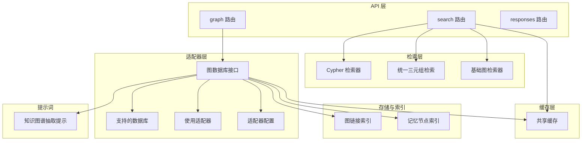
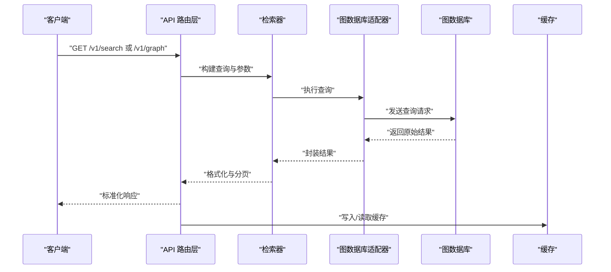
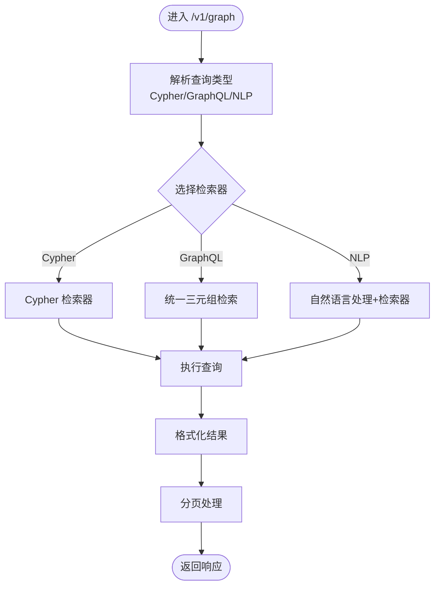
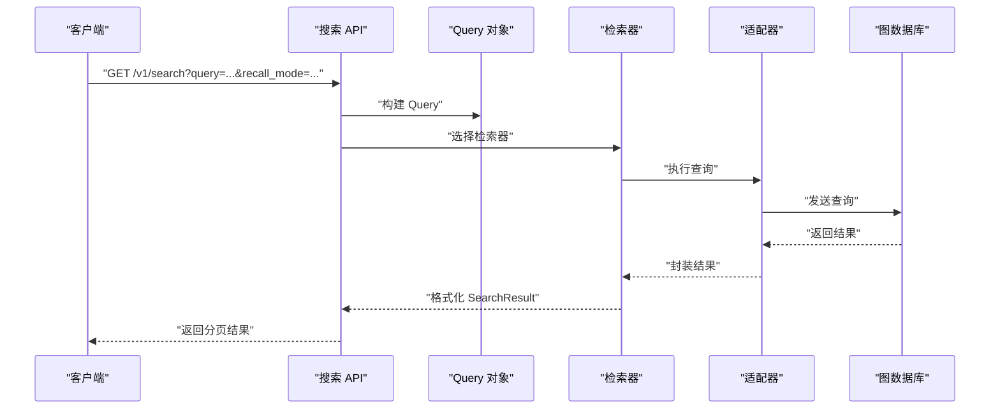
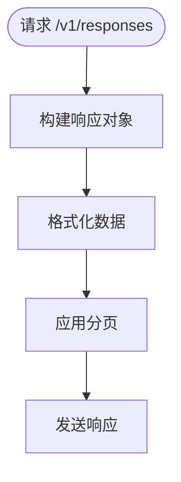
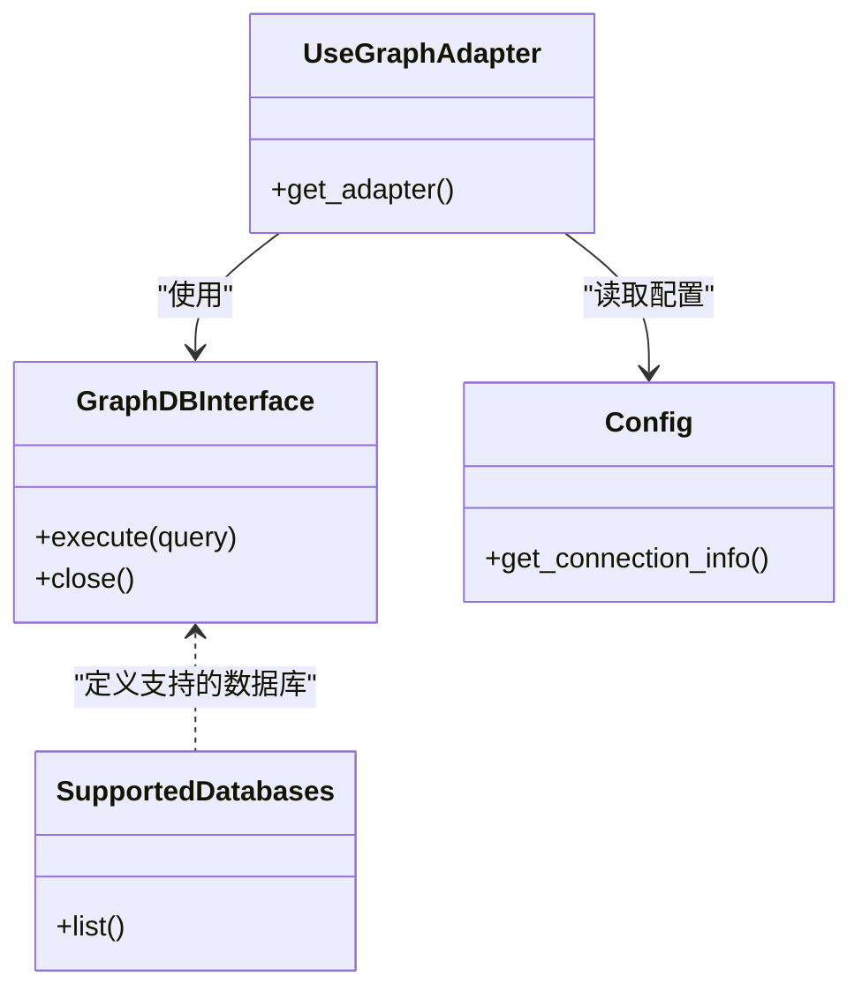
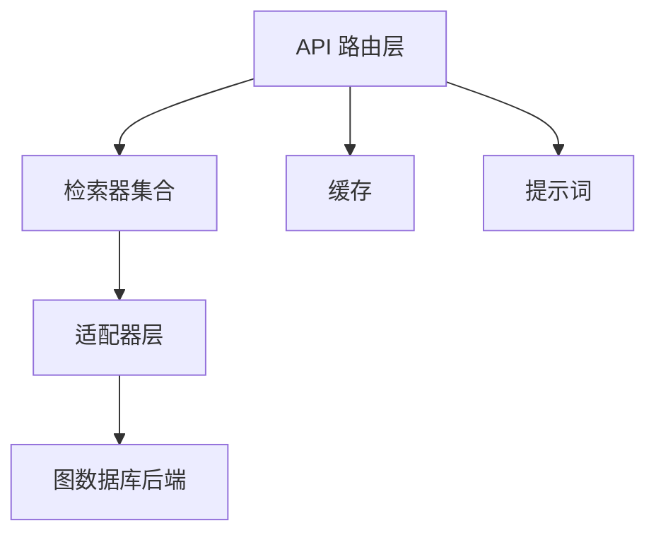

# 知识图谱 API

<cite>
**本文引用的文件**
- [m_flow/api/v1/graph/__init__.py](file://m_flow/api/v1/graph/__init__.py)
- [m_flow/api/v1/graph/routers/get_graph_router.py](file://m_flow/api/v1/graph/routers/get_graph_router.py)
- [m_flow/api/v1/search/__init__.py](file://m_flow/api/v1/search/__init__.py)
- [m_flow/api/v1/search/search.py](file://m_flow/api/v1/search/search.py)
- [m_flow/api/v1/responses/__init__.py](file://m_flow/api/v1/responses/__init__.py)
- [m_flow/api/v1/responses/routers.py](file://m_flow/api/v1/responses/routers.py)
- [m_flow/retrieval/cypher_search_retriever.py](file://m_flow/retrieval/cypher_search_retriever.py)
- [m_flow/retrieval/base_graph_retriever.py](file://m_flow/retrieval/base_graph_retriever.py)
- [m_flow/retrieval/unified_triplet_search.py](file://m_flow/retrieval/unified_triplet_search.py)
- [m_flow/search/methods/search.py](file://m_flow/search/methods/search.py)
- [m_flow/search/models/Query.py](file://m_flow/search/models/Query.py)
- [m_flow/search/types/SearchResult.py](file://m_flow/search/types/SearchResult.py)
- [m_flow/knowledge/graph_ops/m_flow_graph/__init__.py](file://m_flow/knowledge/graph_ops/m_flow_graph/__init__.py)
- [m_flow/knowledge/graph_ops/utils/parse_cypher.py](file://m_flow/knowledge/graph_ops/utils/parse_cypher.py)
- [m_flow/knowledge/graph_ops/utils/format_results.py](file://m_flow/knowledge/graph_ops/utils/format_results.py)
- [m_flow/shared/cache.py](file://m_flow/shared/cache.py)
- [m_flow/adapters/graph/graph_db_interface.py](file://m_flow/adapters/graph/graph_db_interface.py)
- [m_flow/adapters/graph/supported_databases.py](file://m_flow/adapters/graph/supported_databases.py)
- [m_flow/adapters/graph/use_graph_adapter.py](file://m_flow/adapters/graph/use_graph_adapter.py)
- [m_flow/adapters/graph/config.py](file://m_flow/adapters/graph/config.py)
- [m_flow/storage/index_graph_links.py](file://m_flow/storage/index_graph_links.py)
- [m_flow/storage/index_memory_nodes.py](file://m_flow/storage/index_memory_nodes.py)
- [m_flow/llm/prompts/knowledge_graph_extractor.txt](file://m_flow/llm/prompts/knowledge_graph_extractor.txt)
</cite>

## 目录
1. [简介](#简介)
2. [项目结构](#项目结构)
3. [核心组件](#核心组件)
4. [架构总览](#架构总览)
5. [详细组件分析](#详细组件分析)
6. [依赖关系分析](#依赖关系分析)
7. [性能考量](#性能考量)
8. [故障排查指南](#故障排查指南)
9. [结论](#结论)
10. [附录](#附录)

## 简介
本文件为知识图谱 API 的权威技术文档，聚焦以下核心能力：
- 图数据库操作：提供图数据的可视化与检索接口，支持多种查询范式（Cypher、GraphQL 风格、自然语言）。
- 搜索查询：统一的检索入口，结合多种检索器实现高效召回与排序。
- 响应处理：标准化的结果格式化与分页输出，便于前端与下游系统消费。

文档将从系统架构、数据流、处理逻辑、集成点、错误处理与性能优化等方面进行深入解析，并给出最佳实践与排障建议。

## 项目结构
围绕知识图谱 API 的关键模块分布如下：
- API 层：位于 v1 版本下，分别提供 graph、search、responses 三个子模块的路由入口。
- 检索层：包含 Cypher 检索器、统一三元组检索、基础图检索器等，支撑多范式查询。
- 存储与索引：提供图链接与记忆节点的索引管理，提升查询性能。
- 适配器层：抽象图数据库访问接口，支持多种后端（Neo4j、Kùzu、Amazon Neptune Analytics 等）。
- 缓存层：共享缓存工具，用于结果缓存与会话状态管理。
- 提示词：LLM 提示模板，用于从文本中抽取知识图谱三元组。

**图表来源**
- [m_flow/api/v1/graph/routers/get_graph_router.py](file://m_flow/api/v1/graph/routers/get_graph_router.py)
- [m_flow/api/v1/search/search.py](file://m_flow/api/v1/search/search.py)
- [m_flow/api/v1/responses/routers.py](file://m_flow/api/v1/responses/routers.py)
- [m_flow/retrieval/cypher_search_retriever.py](file://m_flow/retrieval/cypher_search_retriever.py)
- [m_flow/retrieval/unified_triplet_search.py](file://m_flow/retrieval/unified_triplet_search.py)
- [m_flow/retrieval/base_graph_retriever.py](file://m_flow/retrieval/base_graph_retriever.py)
- [m_flow/storage/index_graph_links.py](file://m_flow/storage/index_graph_links.py)
- [m_flow/storage/index_memory_nodes.py](file://m_flow/storage/index_memory_nodes.py)
- [m_flow/adapters/graph/graph_db_interface.py](file://m_flow/adapters/graph/graph_db_interface.py)
- [m_flow/adapters/graph/supported_databases.py](file://m_flow/adapters/graph/supported_databases.py)
- [m_flow/adapters/graph/use_graph_adapter.py](file://m_flow/adapters/graph/use_graph_adapter.py)
- [m_flow/adapters/graph/config.py](file://m_flow/adapters/graph/config.py)
- [m_flow/shared/cache.py](file://m_flow/shared/cache.py)
- [m_flow/llm/prompts/knowledge_graph_extractor.txt](file://m_flow/llm/prompts/knowledge_graph_extractor.txt)

**章节来源**
- [m_flow/api/v1/graph/__init__.py](file://m_flow/api/v1/graph/__init__.py)
- [m_flow/api/v1/search/__init__.py](file://m_flow/api/v1/search/__init__.py)
- [m_flow/api/v1/responses/__init__.py](file://m_flow/api/v1/responses/__init__.py)

## 核心组件
- 图数据库操作（GET/POST /v1/graph）
  - 提供图数据的可视化与检索能力，支持多种查询范式与结果格式化。
  - 关键实现：[m_flow/api/v1/graph/routers/get_graph_router.py](file://m_flow/api/v1/graph/routers/get_graph_router.py)
- 搜索查询（GET /v1/search）
  - 统一检索入口，整合 Cypher、三元组与自然语言等多种查询方式。
  - 关键实现：[m_flow/api/v1/search/search.py](file://m_flow/api/v1/search/search.py)
- 响应处理（GET /v1/responses）
  - 标准化结果格式与分页输出，便于前端消费。
  - 关键实现：[m_flow/api/v1/responses/routers.py](file://m_flow/api/v1/responses/routers.py)

**章节来源**
- [m_flow/api/v1/graph/routers/get_graph_router.py](file://m_flow/api/v1/graph/routers/get_graph_router.py)
- [m_flow/api/v1/search/search.py](file://m_flow/api/v1/search/search.py)
- [m_flow/api/v1/responses/routers.py](file://m_flow/api/v1/responses/routers.py)

## 架构总览
知识图谱 API 的整体调用链路如下：

**图表来源**
- [m_flow/api/v1/search/search.py](file://m_flow/api/v1/search/search.py)
- [m_flow/retrieval/cypher_search_retriever.py](file://m_flow/retrieval/cypher_search_retriever.py)
- [m_flow/retrieval/unified_triplet_search.py](file://m_flow/retrieval/unified_triplet_search.py)
- [m_flow/adapters/graph/graph_db_interface.py](file://m_flow/adapters/graph/graph_db_interface.py)
- [m_flow/shared/cache.py](file://m_flow/shared/cache.py)

## 详细组件分析

### 图数据库操作（/v1/graph）
- 功能概述
  - 支持通过多种查询范式获取图数据，包括 Cypher、GraphQL 风格查询与自然语言查询。
  - 提供结果格式化与可视化所需的数据结构。
- 关键流程
  - 请求进入路由层后，根据查询类型选择对应的检索器或解析器。
  - 通过适配器层访问底层图数据库，执行查询并返回结果。
  - 对结果进行格式化与分页处理，输出给客户端。
- 查询范式
  - Cypher 查询：通过 Cypher 解析器与检索器执行，适合结构化图查询。
  - GraphQL 风格查询：基于三元组检索与统一检索器，支持灵活的图遍历。
  - 自然语言查询：结合 LLM 提示词与检索器，将自然语言映射为图查询。
- 结果格式化与分页
  - 统一格式化工具负责将底层结果转换为标准结构。
  - 分页参数在路由层接收并传递至检索器，避免一次性返回大量数据。

**图表来源**
- [m_flow/api/v1/graph/routers/get_graph_router.py](file://m_flow/api/v1/graph/routers/get_graph_router.py)
- [m_flow/retrieval/cypher_search_retriever.py](file://m_flow/retrieval/cypher_search_retriever.py)
- [m_flow/retrieval/unified_triplet_search.py](file://m_flow/retrieval/unified_triplet_search.py)
- [m_flow/knowledge/graph_ops/utils/format_results.py](file://m_flow/knowledge/graph_ops/utils/format_results.py)

**章节来源**
- [m_flow/api/v1/graph/routers/get_graph_router.py](file://m_flow/api/v1/graph/routers/get_graph_router.py)
- [m_flow/knowledge/graph_ops/utils/parse_cypher.py](file://m_flow/knowledge/graph_ops/utils/parse_cypher.py)
- [m_flow/knowledge/graph_ops/utils/format_results.py](file://m_flow/knowledge/graph_ops/utils/format_results.py)

### 搜索查询（/v1/search）
- 功能概述
  - 统一的检索入口，支持召回模式与结果类型定义，整合多种检索器。
- 关键流程
  - 接收查询参数与配置，构建 Query 对象。
  - 根据召回模式选择合适的检索器（Cypher、三元组、基础图检索器）。
  - 执行检索并格式化为 SearchResult，支持分页与排序。
- 数据模型
  - Query：定义查询输入与配置。
  - SearchResult：定义检索结果的标准输出结构。

**图表来源**
- [m_flow/api/v1/search/search.py](file://m_flow/api/v1/search/search.py)
- [m_flow/search/models/Query.py](file://m_flow/search/models/Query.py)
- [m_flow/search/types/SearchResult.py](file://m_flow/search/types/SearchResult.py)
- [m_flow/retrieval/cypher_search_retriever.py](file://m_flow/retrieval/cypher_search_retriever.py)
- [m_flow/retrieval/unified_triplet_search.py](file://m_flow/retrieval/unified_triplet_search.py)
- [m_flow/retrieval/base_graph_retriever.py](file://m_flow/retrieval/base_graph_retriever.py)

**章节来源**
- [m_flow/api/v1/search/search.py](file://m_flow/api/v1/search/search.py)
- [m_flow/search/models/Query.py](file://m_flow/search/models/Query.py)
- [m_flow/search/types/SearchResult.py](file://m_flow/search/types/SearchResult.py)

### 响应处理（/v1/responses）
- 功能概述
  - 提供标准化的响应格式与分页机制，确保前后端交互一致性。
- 关键流程
  - 路由层接收请求并调用响应处理器。
  - 处理器对检索结果进行格式化，应用分页参数并返回。
- 最佳实践
  - 明确分页参数（如页码、每页大小），避免超大数据量一次性返回。
  - 统一错误码与消息格式，便于前端统一处理。

**图表来源**
- [m_flow/api/v1/responses/routers.py](file://m_flow/api/v1/responses/routers.py)

**章节来源**
- [m_flow/api/v1/responses/routers.py](file://m_flow/api/v1/responses/routers.py)

### 检索器与适配器
- Cypher 检索器
  - 专门用于执行 Cypher 查询，适合结构化图查询场景。
  - 参考：[m_flow/retrieval/cypher_search_retriever.py](file://m_flow/retrieval/cypher_search_retriever.py)
- 统一三元组检索
  - 基于三元组的检索器，支持 GraphQL 风格查询与灵活遍历。
  - 参考：[m_flow/retrieval/unified_triplet_search.py](file://m_flow/retrieval/unified_triplet_search.py)
- 基础图检索器
  - 抽象的图检索基类，定义通用接口与行为。
  - 参考：[m_flow/retrieval/base_graph_retriever.py](file://m_flow/retrieval/base_graph_retriever.py)
- 图数据库适配器
  - 抽象图数据库访问接口，支持多种后端。
  - 参考：[m_flow/adapters/graph/graph_db_interface.py](file://m_flow/adapters/graph/graph_db_interface.py)
  - 支持的数据库列表：[m_flow/adapters/graph/supported_databases.py](file://m_flow/adapters/graph/supported_databases.py)
  - 使用适配器：[m_flow/adapters/graph/use_graph_adapter.py](file://m_flow/adapters/graph/use_graph_adapter.py)
  - 适配器配置：[m_flow/adapters/graph/config.py](file://m_flow/adapters/graph/config.py)

**图表来源**
- [m_flow/adapters/graph/graph_db_interface.py](file://m_flow/adapters/graph/graph_db_interface.py)
- [m_flow/adapters/graph/supported_databases.py](file://m_flow/adapters/graph/supported_databases.py)
- [m_flow/adapters/graph/use_graph_adapter.py](file://m_flow/adapters/graph/use_graph_adapter.py)
- [m_flow/adapters/graph/config.py](file://m_flow/adapters/graph/config.py)

**章节来源**
- [m_flow/retrieval/cypher_search_retriever.py](file://m_flow/retrieval/cypher_search_retriever.py)
- [m_flow/retrieval/unified_triplet_search.py](file://m_flow/retrieval/unified_triplet_search.py)
- [m_flow/retrieval/base_graph_retriever.py](file://m_flow/retrieval/base_graph_retriever.py)
- [m_flow/adapters/graph/graph_db_interface.py](file://m_flow/adapters/graph/graph_db_interface.py)
- [m_flow/adapters/graph/supported_databases.py](file://m_flow/adapters/graph/supported_databases.py)
- [m_flow/adapters/graph/use_graph_adapter.py](file://m_flow/adapters/graph/use_graph_adapter.py)
- [m_flow/adapters/graph/config.py](file://m_flow/adapters/graph/config.py)

### 索引与缓存
- 图链接索引
  - 用于加速图链接的查询与遍历，减少重复计算。
  - 参考：[m_flow/storage/index_graph_links.py](file://m_flow/storage/index_graph_links.py)
- 记忆节点索引
  - 用于快速定位与检索记忆节点，提升检索效率。
  - 参考：[m_flow/storage/index_memory_nodes.py](file://m_flow/storage/index_memory_nodes.py)
- 共享缓存
  - 提供统一的缓存接口，用于结果缓存与会话状态管理。
  - 参考：[m_flow/shared/cache.py](file://m_flow/shared/cache.py)

**章节来源**
- [m_flow/storage/index_graph_links.py](file://m_flow/storage/index_graph_links.py)
- [m_flow/storage/index_memory_nodes.py](file://m_flow/storage/index_memory_nodes.py)
- [m_flow/shared/cache.py](file://m_flow/shared/cache.py)

## 依赖关系分析
- 组件耦合
  - API 路由层与检索器之间通过清晰的接口解耦，便于扩展新的检索器。
  - 适配器层向上屏蔽不同图数据库的差异，降低上层依赖风险。
- 外部依赖
  - 图数据库后端（Neo4j、Kùzu、Amazon Neptune Analytics 等）通过适配器统一接入。
  - LLM 提示词用于从自然语言到图查询的映射。
- 潜在循环依赖
  - 当前结构以接口抽象为主，未发现明显循环依赖；新增模块时需保持接口向下的依赖方向。

**图表来源**
- [m_flow/api/v1/search/search.py](file://m_flow/api/v1/search/search.py)
- [m_flow/adapters/graph/graph_db_interface.py](file://m_flow/adapters/graph/graph_db_interface.py)
- [m_flow/shared/cache.py](file://m_flow/shared/cache.py)
- [m_flow/llm/prompts/knowledge_graph_extractor.txt](file://m_flow/llm/prompts/knowledge_graph_extractor.txt)

**章节来源**
- [m_flow/api/v1/search/search.py](file://m_flow/api/v1/search/search.py)
- [m_flow/adapters/graph/graph_db_interface.py](file://m_flow/adapters/graph/graph_db_interface.py)
- [m_flow/shared/cache.py](file://m_flow/shared/cache.py)
- [m_flow/llm/prompts/knowledge_graph_extractor.txt](file://m_flow/llm/prompts/knowledge_graph_extractor.txt)

## 性能考量
- 查询性能优化建议
  - 合理使用索引：为常用查询字段建立索引，减少全表扫描。
  - 控制查询范围：通过分页与过滤条件限制返回数据量。
  - 缓存策略：对热点查询结果进行缓存，降低重复查询开销。
- 索引使用
  - 利用图链接与记忆节点索引，加速常见查询路径。
- 缓存策略
  - 使用共享缓存模块，设置合理的过期时间与命中率监控。
- 并发与限流
  - 在 API 层实施请求限流与并发控制，避免资源争用导致的延迟上升。

[本节为通用性能指导，不直接分析具体文件]

## 故障排查指南
- 常见问题
  - 查询超时：检查索引是否生效、查询范围是否过大、是否存在长事务阻塞。
  - 结果异常：确认检索器选择是否正确、参数传入是否符合预期。
  - 缓存失效：核对缓存键生成规则与过期策略，确保缓存命中。
- 定位方法
  - 查看 API 层日志与错误码，定位具体环节。
  - 检查适配器层连接信息与认证配置。
  - 验证检索器参数与查询语句构造逻辑。
- 相关实现参考
  - 搜索方法与错误处理：[m_flow/search/methods/search.py](file://m_flow/search/methods/search.py)
  - 检索器基类与异常处理：[m_flow/retrieval/base_graph_retriever.py](file://m_flow/retrieval/base_graph_retriever.py)

**章节来源**
- [m_flow/search/methods/search.py](file://m_flow/search/methods/search.py)
- [m_flow/retrieval/base_graph_retriever.py](file://m_flow/retrieval/base_graph_retriever.py)

## 结论
本知识图谱 API 通过清晰的模块划分与适配器抽象，实现了对多种图数据库与查询范式的统一接入。结合检索器、索引与缓存机制，能够在保证灵活性的同时兼顾性能与可维护性。建议在实际部署中优先完善索引策略与缓存配置，并持续监控查询性能与错误指标，以获得稳定的用户体验。

[本节为总结性内容，不直接分析具体文件]

## 附录
- 查询语法与最佳实践
  - Cypher 查询：适用于结构化图查询，建议使用参数化查询与索引字段过滤。
  - GraphQL 风格查询：适合灵活遍历，注意控制深度与返回字段数量。
  - 自然语言查询：结合提示词模板，先进行意图识别再映射为图查询。
- 数据结构与属性查询
  - 节点与关系的属性查询应遵循最小必要原则，避免返回冗余信息。
  - 对高频属性建立索引，提升过滤与排序效率。
- 分页与排序
  - 明确分页参数与默认排序规则，确保结果稳定可复现。
  - 对排序字段建立索引，避免排序带来的额外开销。

[本节为通用指导，不直接分析具体文件]