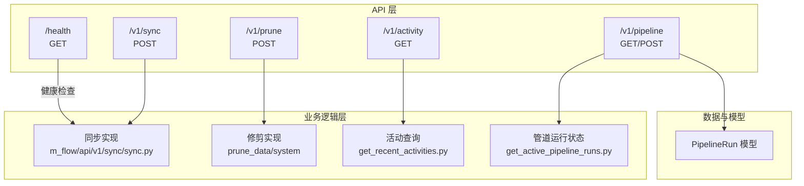
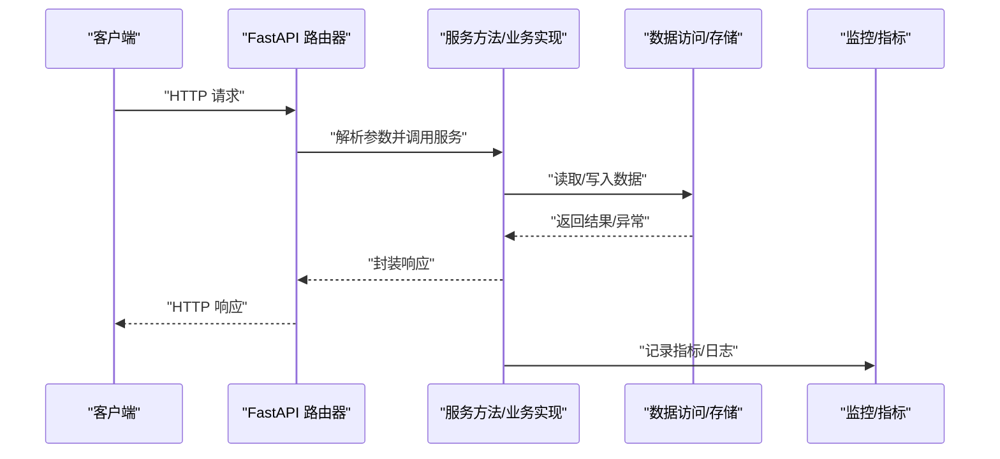
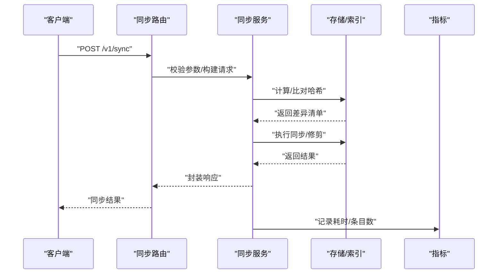
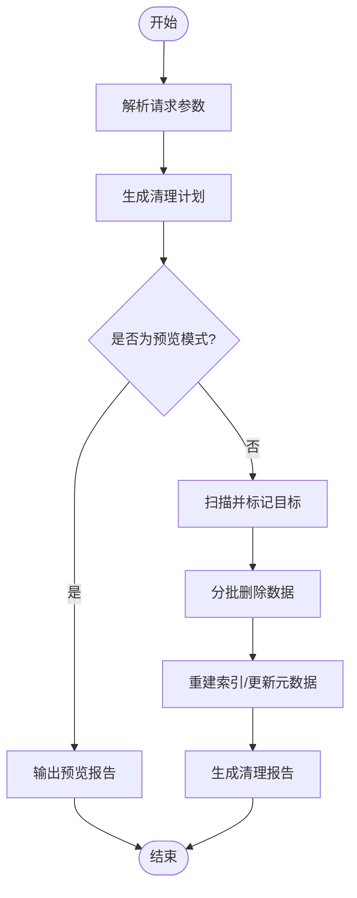
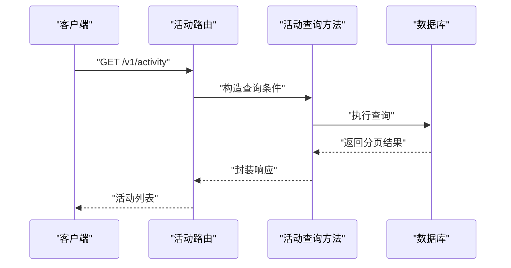
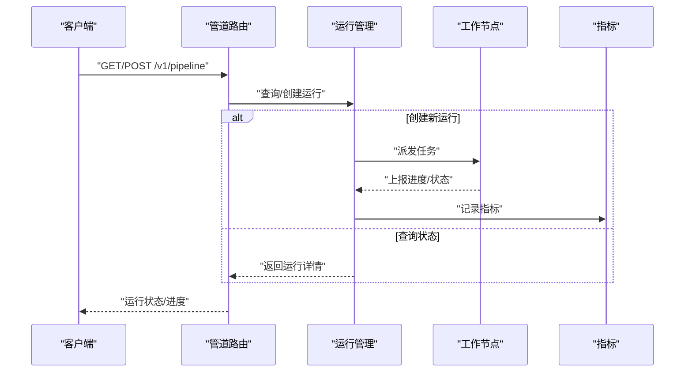
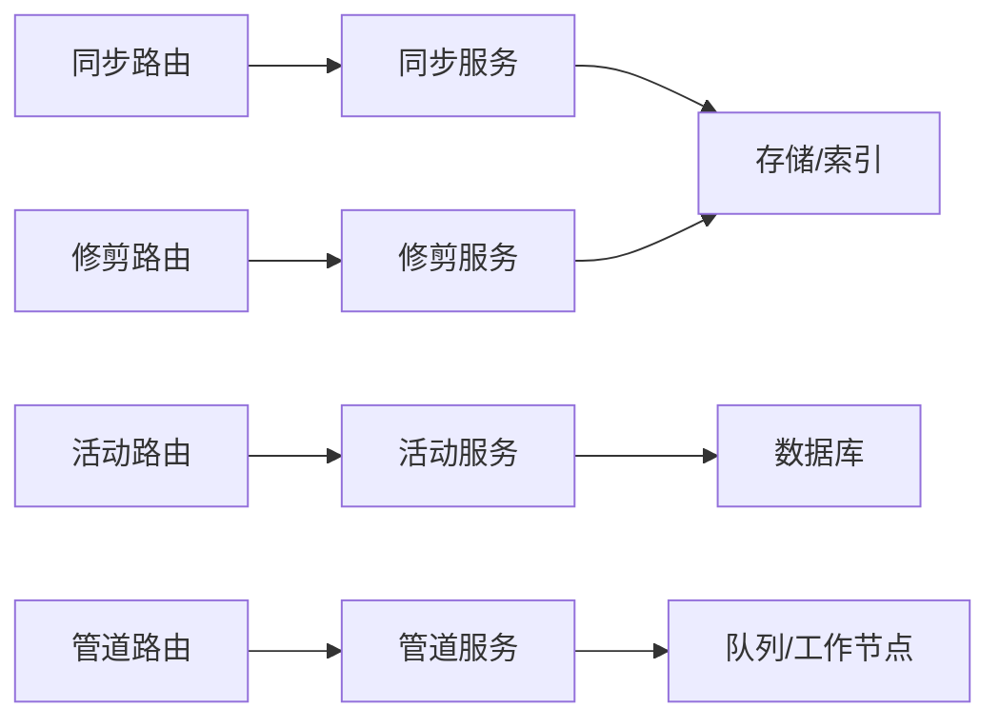

# 系统操作 API

<cite>
**本文档引用的文件**
- [m_flow/api/v1/sync/__init__.py](file://m_flow/api/v1/sync/__init__.py)
- [m_flow/api/v1/sync/routers/get_sync_router.py](file://m_flow/api/v1/sync/routers/get_sync_router.py)
- [m_flow/api/v1/prune/__init__.py](file://m_flow/api/v1/prune/__init__.py)
- [m_flow/api/v1/prune/routers/get_prune_router.py](file://m_flow/api/v1/prune/routers/get_prune_router.py)
- [m_flow/api/v1/activity/__init__.py](file://m_flow/api/v1/activity/__init__.py)
- [m_flow/api/v1/activity/routers/get_activity_router.py](file://m_flow/api/v1/activity/routers/get_activity_router.py)
- [m_flow/api/v1/pipeline/__init__.py](file://m_flow/api/v1/pipeline/__init__.py)
- [m_flow/api/v1/pipeline/routers/get_pipeline_router.py](file://m_flow/api/v1/pipeline/routers/get_pipeline_router.py)
- [m_flow/api/health.py](file://m_flow/api/health.py)
- [m_flow/data/methods/get_recent_activities.py](file://m_flow/data/methods/get_recent_activities.py)
- [m_flow/pipeline/methods/get_active_pipeline_runs.py](file://m_flow/pipeline/methods/get_active_pipeline_runs.py)
- [m_flow/pipeline/models/PipelineRun.py](file://m_flow/pipeline/models/PipelineRun.py)
- [m_flow/data/deletion/prune_data.py](file://m_flow/data/deletion/prune_data.py)
- [m_flow/data/deletion/prune_system.py](file://m_flow/data/deletion/prune_system.py)
- [m_flow/memory/episodic/episode_size_check.py](file://m_flow/memory/episodic/episode_size_check.py)
- [m_flow/memory/episodic/episode_builder/bundle_scorer.py](file://m_flow/memory/episodic/episode_builder/bundle_scorer.py)
- [m_flow/memory/episodic/orphans.py](file://m_flow/memory/episodic/orphans.py)
- [m_flow/shared/observability/metrics.py](file://m_flow/shared/observability/metrics.py)
- [m_flow/shared/logging_utils.py](file://m_flow/shared/logging_utils.py)
- [m_flow/api/v1/sync/sync.py](file://m_flow/api/v1/sync/sync.py)
</cite>

## 目录
1. [简介](#简介)
2. [项目结构](#项目结构)
3. [核心组件](#核心组件)
4. [架构总览](#架构总览)
5. [详细组件分析](#详细组件分析)
6. [依赖分析](#依赖分析)
7. [性能考虑](#性能考虑)
8. [故障排除指南](#故障排除指南)
9. [结论](#结论)
10. [附录](#附录)

## 简介
本文件面向系统管理员与运维工程师，系统性梳理 M-flow 的系统维护与后台任务相关 API，包括：
- 同步操作：POST /v1/sync
- 数据修剪：POST /v1/prune
- 活动跟踪：GET /v1/activity
- 管道管理：GET/POST /v1/pipeline

重点覆盖同步策略、修剪规则、活动日志格式、管道执行状态，以及后台任务监控、错误重试与进度报告机制，并提供系统健康检查、性能指标与故障排除建议。

## 项目结构
系统维护相关的 API 路由通过各模块的路由器工厂函数统一注册到主应用中。核心模块与文件如下：
- 同步模块：m_flow/api/v1/sync
- 修剪模块：m_flow/api/v1/prune
- 活动模块：m_flow/api/v1/activity
- 管道模块：m_flow/api/v1/pipeline
- 健康检查：m_flow/api/health.py
- 活动数据访问：m_flow/data/methods/get_recent_activities.py
- 管道运行状态：m_flow/pipeline/methods/get_active_pipeline_runs.py
- 修剪实现：m_flow/data/deletion/prune_data.py、m_flow/data/deletion/prune_system.py
- 同步实现：m_flow/api/v1/sync/sync.py

**图表来源**
- [m_flow/api/v1/sync/routers/get_sync_router.py:1-200](file://m_flow/api/v1/sync/routers/get_sync_router.py#L1-L200)
- [m_flow/api/v1/prune/routers/get_prune_router.py:1-350](file://m_flow/api/v1/prune/routers/get_prune_router.py#L1-L350)
- [m_flow/api/v1/activity/routers/get_activity_router.py:1-200](file://m_flow/api/v1/activity/routers/get_activity_router.py#L1-L200)
- [m_flow/api/v1/pipeline/routers/get_pipeline_router.py:1-200](file://m_flow/api/v1/pipeline/routers/get_pipeline_router.py#L1-L200)
- [m_flow/api/health.py:1-200](file://m_flow/api/health.py#L1-L200)

**章节来源**
- [m_flow/api/v1/sync/__init__.py:1-35](file://m_flow/api/v1/sync/__init__.py#L1-L35)
- [m_flow/api/v1/prune/__init__.py:1-26](file://m_flow/api/v1/prune/__init__.py#L1-L26)
- [m_flow/api/v1/activity/__init__.py:1-6](file://m_flow/api/v1/activity/__init__.py#L1-L6)
- [m_flow/api/v1/pipeline/__init__.py:1-6](file://m_flow/api/v1/pipeline/__init__.py#L1-L6)

## 核心组件
- 同步接口（POST /v1/sync）
  - 提供本地文件与系统数据的哈希校验、差异检测与同步能力
  - 支持缺失哈希检查、数据集修剪请求等
- 修剪接口（POST /v1/prune）
  - 提供全量或按条件的数据清理能力，支持不可逆的破坏性操作
- 活动接口（GET /v1/activity）
  - 返回近期系统活动记录，便于审计与问题定位
- 管道接口（GET/POST /v1/pipeline）
  - 查询与控制数据处理流水线的运行状态与进度

**章节来源**
- [m_flow/api/v1/sync/__init__.py:1-35](file://m_flow/api/v1/sync/__init__.py#L1-L35)
- [m_flow/api/v1/prune/__init__.py:1-26](file://m_flow/api/v1/prune/__init__.py#L1-L26)
- [m_flow/api/v1/activity/__init__.py:1-6](file://m_flow/api/v1/activity/__init__.py#L1-L6)
- [m_flow/api/v1/pipeline/__init__.py:1-6](file://m_flow/api/v1/pipeline/__init__.py#L1-L6)

## 架构总览
系统维护 API 的调用链路遵循“路由 -> 服务方法 -> 数据访问/业务实现”的分层设计。健康检查与性能指标通过独立模块提供。

**图表来源**
- [m_flow/api/v1/sync/routers/get_sync_router.py:1-200](file://m_flow/api/v1/sync/routers/get_sync_router.py#L1-L200)
- [m_flow/api/v1/prune/routers/get_prune_router.py:1-350](file://m_flow/api/v1/prune/routers/get_prune_router.py#L1-L350)
- [m_flow/api/v1/activity/routers/get_activity_router.py:1-200](file://m_flow/api/v1/activity/routers/get_activity_router.py#L1-L200)
- [m_flow/api/v1/pipeline/routers/get_pipeline_router.py:1-200](file://m_flow/api/v1/pipeline/routers/get_pipeline_router.py#L1-L200)
- [m_flow/api/health.py:1-200](file://m_flow/api/health.py#L1-L200)

## 详细组件分析

### 同步操作（POST /v1/sync）
- 功能概述
  - 对齐本地文件与系统索引，检测哈希差异，识别缺失项并触发修剪
  - 支持按数据集维度进行同步与清理
- 关键流程
  - 参数校验与权限检查
  - 计算/比对文件哈希，生成差异清单
  - 触发数据层同步与索引更新
  - 返回同步结果与建议的后续操作
- 错误处理
  - 文件不存在、哈希不匹配、数据库连接失败等场景均需明确返回码与错误信息
- 性能要点
  - 大批量文件时采用分批处理与并发优化
  - 避免重复计算哈希，利用缓存与增量比较

**图表来源**
- [m_flow/api/v1/sync/routers/get_sync_router.py:1-200](file://m_flow/api/v1/sync/routers/get_sync_router.py#L1-L200)
- [m_flow/api/v1/sync/sync.py:1-200](file://m_flow/api/v1/sync/sync.py#L1-L200)

**章节来源**
- [m_flow/api/v1/sync/__init__.py:1-35](file://m_flow/api/v1/sync/__init__.py#L1-L35)
- [m_flow/api/v1/sync/routers/get_sync_router.py:1-200](file://m_flow/api/v1/sync/routers/get_sync_router.py#L1-L200)
- [m_flow/api/v1/sync/sync.py:1-200](file://m_flow/api/v1/sync/sync.py#L1-L200)

### 数据修剪（POST /v1/prune）
- 功能概述
  - 清理过期或无效数据，释放存储空间；支持全量清理与按条件筛选
- 规则与策略
  - 可配置保留周期、大小阈值、标签过滤等
  - 优先删除孤立/孤儿数据，再进行批量清理
- 安全与审计
  - 该操作不可逆，需在生产环境谨慎使用
  - 建议先执行 dry-run 或预览模式
- 执行流程
  - 解析请求参数，构建清理计划
  - 并发扫描与标记待删对象
  - 分批删除并回写索引
  - 记录清理统计与告警

**图表来源**
- [m_flow/api/v1/prune/routers/get_prune_router.py:1-350](file://m_flow/api/v1/prune/routers/get_prune_router.py#L1-L350)
- [m_flow/data/deletion/prune_data.py:1-200](file://m_flow/data/deletion/prune_data.py#L1-L200)
- [m_flow/data/deletion/prune_system.py:1-200](file://m_flow/data/deletion/prune_system.py#L1-L200)

**章节来源**
- [m_flow/api/v1/prune/__init__.py:1-26](file://m_flow/api/v1/prune/__init__.py#L1-L26)
- [m_flow/api/v1/prune/routers/get_prune_router.py:1-350](file://m_flow/api/v1/prune/routers/get_prune_router.py#L1-L350)
- [m_flow/data/deletion/prune_data.py:1-200](file://m_flow/data/deletion/prune_data.py#L1-L200)
- [m_flow/data/deletion/prune_system.py:1-200](file://m_flow/data/deletion/prune_system.py#L1-L200)

### 活动跟踪（GET /v1/activity）
- 功能概述
  - 获取系统近期活动日志，用于审计、排障与行为分析
- 日志字段与格式
  - 时间戳、用户/租户标识、操作类型、资源标识、结果状态、耗时等
  - 支持分页、时间范围过滤与排序
- 性能与可用性
  - 使用游标/分页避免大结果集
  - 对热点表建立合适索引以提升查询性能

**图表来源**
- [m_flow/api/v1/activity/routers/get_activity_router.py:1-200](file://m_flow/api/v1/activity/routers/get_activity_router.py#L1-L200)
- [m_flow/data/methods/get_recent_activities.py:1-200](file://m_flow/data/methods/get_recent_activities.py#L1-L200)

**章节来源**
- [m_flow/api/v1/activity/__init__.py:1-6](file://m_flow/api/v1/activity/__init__.py#L1-L6)
- [m_flow/api/v1/activity/routers/get_activity_router.py:1-200](file://m_flow/api/v1/activity/routers/get_activity_router.py#L1-L200)
- [m_flow/data/methods/get_recent_activities.py:1-200](file://m_flow/data/methods/get_recent_activities.py#L1-L200)

### 管道管理（GET/POST /v1/pipeline）
- 功能概述
  - 查询当前活跃的管道运行实例及其状态
  - 触发新的管道执行或取消正在进行的任务
- 运行状态与进度
  - 状态枚举：初始化、运行中、完成、失败、取消
  - 进度百分比、已处理条目数、剩余估计时间
- 错误重试与恢复
  - 支持失败自动重试与手动重试
  - 重试间隔与上限可配置
- 并发与隔离
  - 不同数据集的管道可并行运行
  - 通过队列与锁保障一致性

**图表来源**
- [m_flow/api/v1/pipeline/routers/get_pipeline_router.py:1-200](file://m_flow/api/v1/pipeline/routers/get_pipeline_router.py#L1-L200)
- [m_flow/pipeline/methods/get_active_pipeline_runs.py:1-200](file://m_flow/pipeline/methods/get_active_pipeline_runs.py#L1-L200)
- [m_flow/pipeline/models/PipelineRun.py:1-200](file://m_flow/pipeline/models/PipelineRun.py#L1-L200)

**章节来源**
- [m_flow/api/v1/pipeline/__init__.py:1-6](file://m_flow/api/v1/pipeline/__init__.py#L1-L6)
- [m_flow/api/v1/pipeline/routers/get_pipeline_router.py:1-200](file://m_flow/api/v1/pipeline/routers/get_pipeline_router.py#L1-L200)
- [m_flow/pipeline/methods/get_active_pipeline_runs.py:1-200](file://m_flow/pipeline/methods/get_active_pipeline_runs.py#L1-L200)
- [m_flow/pipeline/models/PipelineRun.py:1-200](file://m_flow/pipeline/models/PipelineRun.py#L1-L200)

## 依赖分析
- 模块内聚与耦合
  - 各 API 模块通过路由器工厂函数解耦，便于独立演进
  - 业务实现与数据访问分离，降低跨模块耦合
- 外部依赖
  - 存储后端（图/向量/关系型数据库）与缓存系统
  - 指标与日志采集组件
- 循环依赖
  - 通过“服务 -> 数据访问 -> 实体模型”的单向依赖避免循环

**图表来源**
- [m_flow/api/v1/sync/routers/get_sync_router.py:1-200](file://m_flow/api/v1/sync/routers/get_sync_router.py#L1-L200)
- [m_flow/api/v1/prune/routers/get_prune_router.py:1-350](file://m_flow/api/v1/prune/routers/get_prune_router.py#L1-L350)
- [m_flow/api/v1/activity/routers/get_activity_router.py:1-200](file://m_flow/api/v1/activity/routers/get_activity_router.py#L1-L200)
- [m_flow/api/v1/pipeline/routers/get_pipeline_router.py:1-200](file://m_flow/api/v1/pipeline/routers/get_pipeline_router.py#L1-L200)

**章节来源**
- [m_flow/api/v1/sync/routers/get_sync_router.py:1-200](file://m_flow/api/v1/sync/routers/get_sync_router.py#L1-L200)
- [m_flow/api/v1/prune/routers/get_prune_router.py:1-350](file://m_flow/api/v1/prune/routers/get_prune_router.py#L1-L350)
- [m_flow/api/v1/activity/routers/get_activity_router.py:1-200](file://m_flow/api/v1/activity/routers/get_activity_router.py#L1-L200)
- [m_flow/api/v1/pipeline/routers/get_pipeline_router.py:1-200](file://m_flow/api/v1/pipeline/routers/get_pipeline_router.py#L1-L200)

## 性能考虑
- 批处理与并发
  - 同步与修剪采用分批处理，避免一次性加载过多数据
  - 管道执行支持并行任务与限流，防止资源争用
- 缓存与索引
  - 利用缓存减少重复计算（如哈希）
  - 为高频查询字段建立索引，缩短活动查询延迟
- 指标与可观测性
  - 通过指标模块记录关键性能指标（吞吐、延迟、错误率）
  - 结合日志工具进行问题定位与容量规划

**章节来源**
- [m_flow/shared/observability/metrics.py:1-200](file://m_flow/shared/observability/metrics.py#L1-L200)
- [m_flow/shared/logging_utils.py:1-200](file://m_flow/shared/logging_utils.py#L1-L200)

## 故障排除指南
- 常见问题与处理
  - 同步失败：检查文件权限、网络连通性与存储配额
  - 修剪异常：确认目标数据是否被其他进程占用，必要时暂停相关管道
  - 活动查询缓慢：优化查询条件、增加索引或调整分页大小
  - 管道卡住：查看运行状态与重试次数，必要时手动取消并重启
- 健康检查
  - 使用 /health 接口快速判断服务可用性与依赖组件状态
- 审计与回滚
  - 保留修剪前的备份快照，以便出现问题时回滚
  - 活动日志可用于追踪问题根因与影响范围

**章节来源**
- [m_flow/api/health.py:1-200](file://m_flow/api/health.py#L1-L200)
- [m_flow/api/v1/activity/routers/get_activity_router.py:1-200](file://m_flow/api/v1/activity/routers/get_activity_router.py#L1-L200)

## 结论
本文档从架构与实现两个层面梳理了系统维护 API 的关键能力与最佳实践。通过规范化的同步策略、可控的修剪规则、完善的活动日志与管道状态管理，结合健康检查与性能指标，可有效支撑生产环境的稳定运行与高效维护。

## 附录
- 同步策略要点
  - 增量同步优先，避免全量重算
  - 差异检测后分批执行，确保幂等性
- 修剪规则建议
  - 设定合理的保留周期与阈值
  - 先孤儿清理，再批量删除
- 管道执行建议
  - 明确失败重试策略与上限
  - 监控进度与资源使用，及时扩容或降载