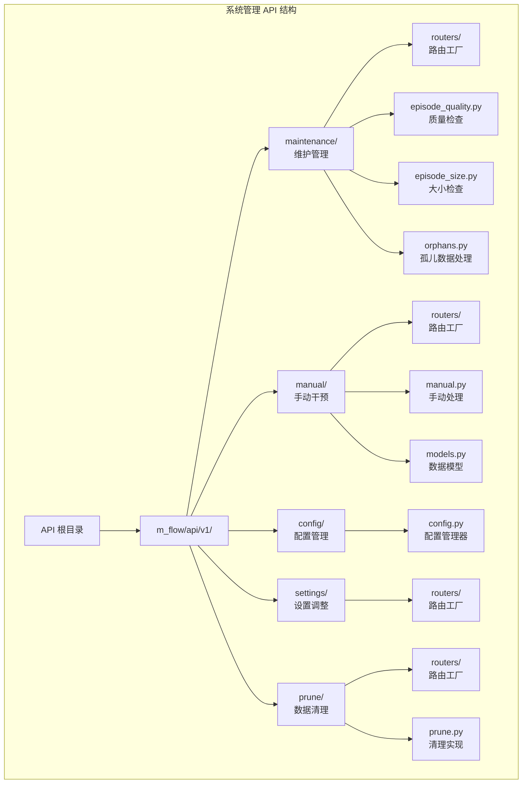
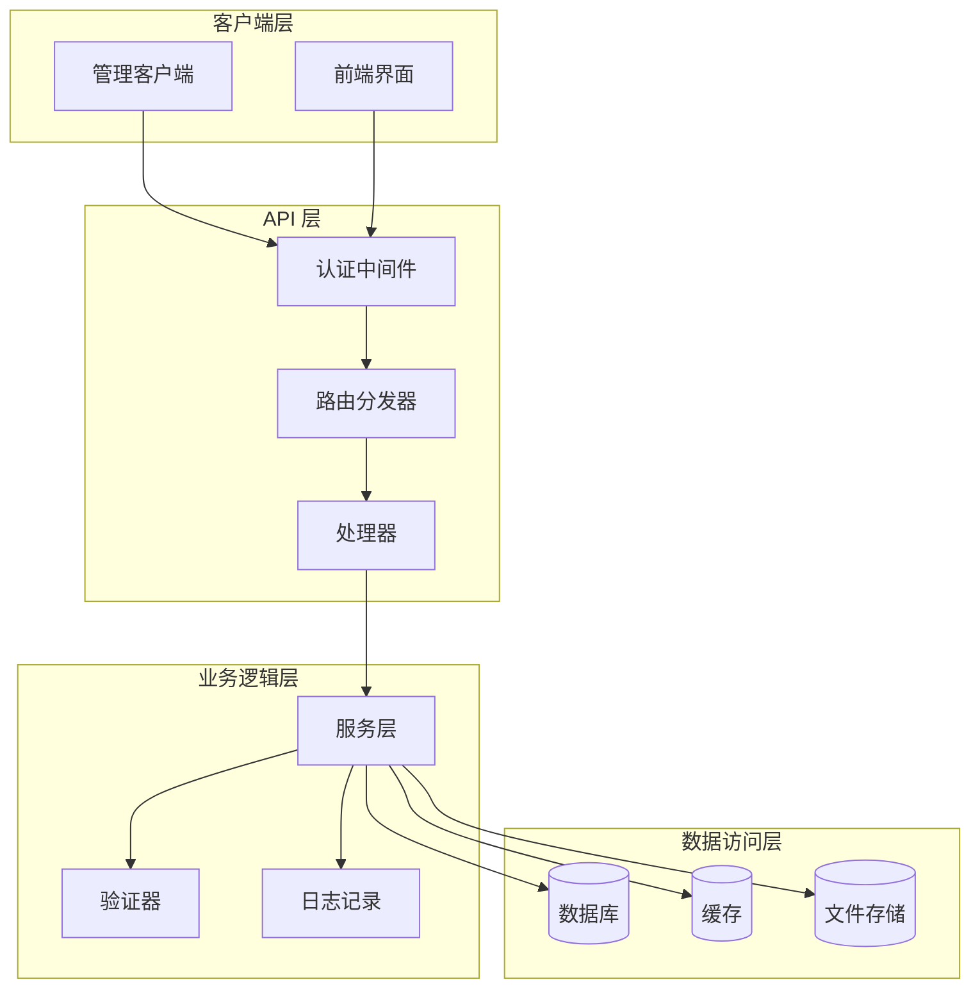
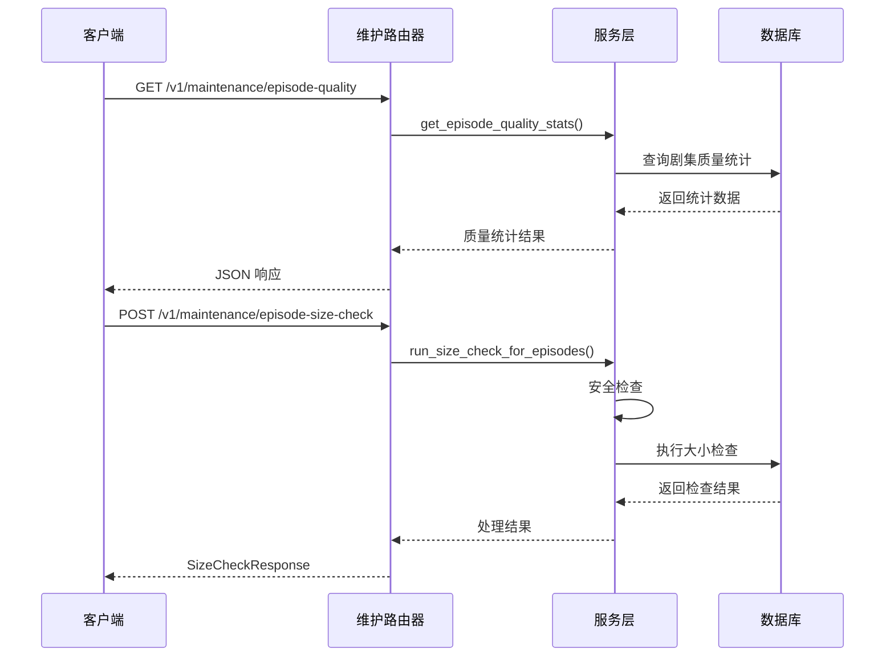
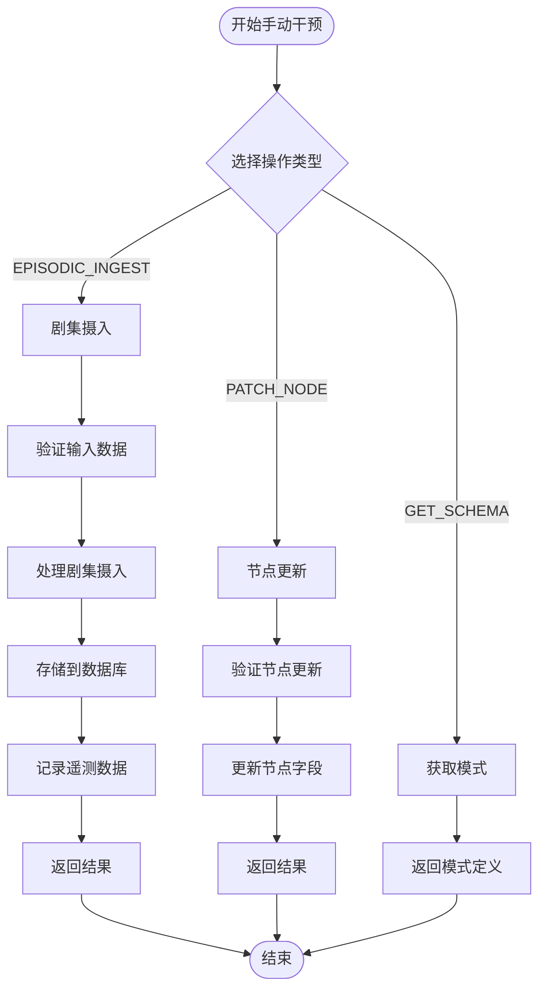
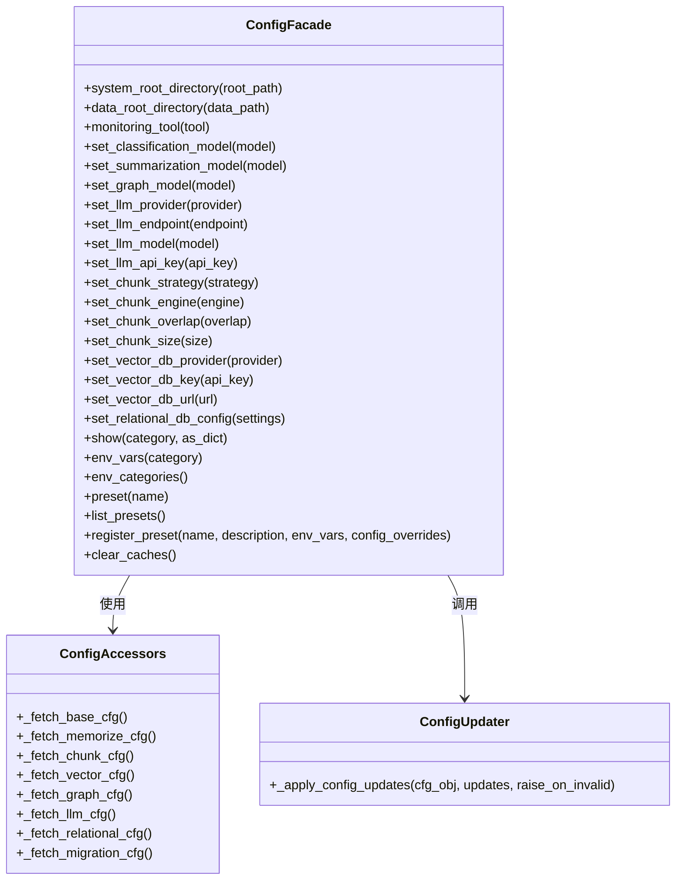
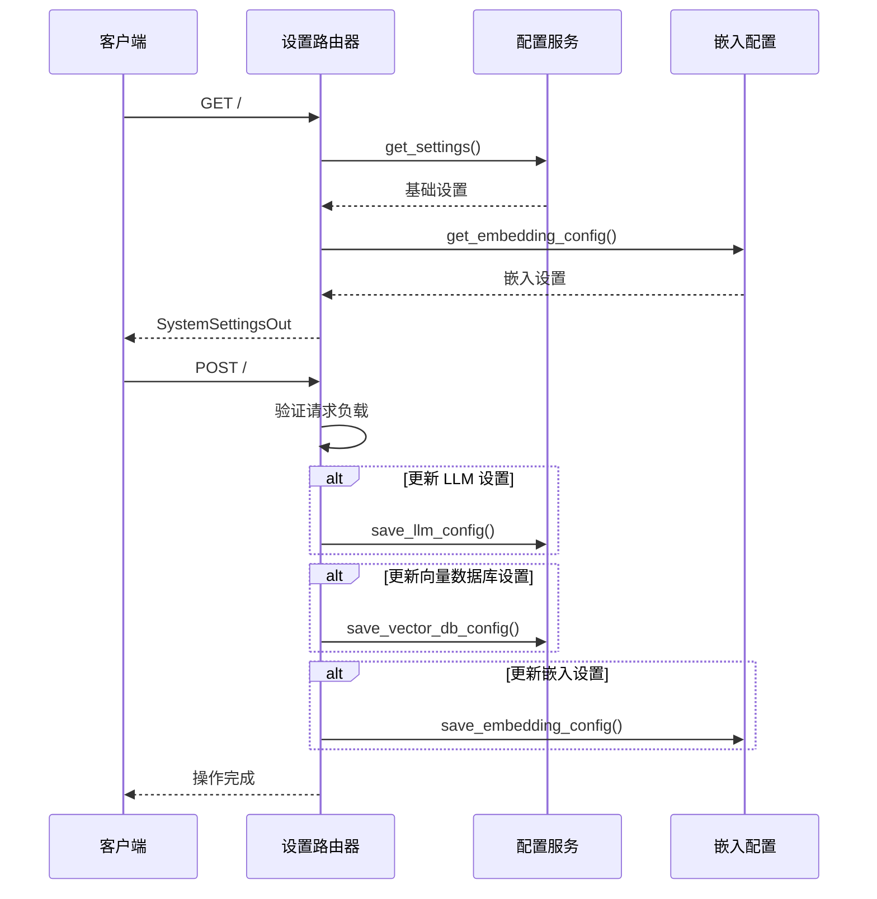
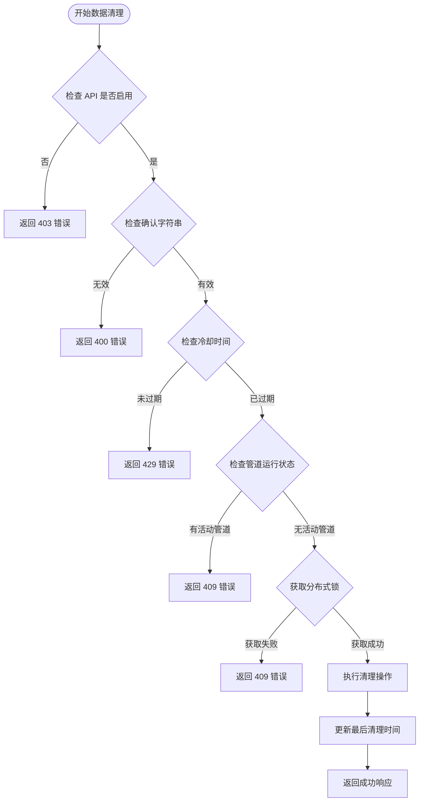

# 系统管理 API

<cite>
**本文档引用的文件**
- [get_maintenance_router.py](file://m_flow/api/v1/maintenance/routers/get_maintenance_router.py)
- [episode_quality.py](file://m_flow/api/v1/maintenance/episode_quality.py)
- [episode_size.py](file://m_flow/api/v1/maintenance/episode_size.py)
- [orphans.py](file://m_flow/api/v1/maintenance/orphans.py)
- [get_manual_router.py](file://m_flow/api/v1/manual/routers/get_manual_router.py)
- [manual.py](file://m_flow/api/v1/manual/manual.py)
- [models.py](file://m_flow/api/v1/manual/models.py)
- [config.py](file://m_flow/api/v1/config/config.py)
- [get_settings_router.py](file://m_flow/api/v1/settings/routers/get_settings_router.py)
- [health.py](file://m_flow/api/health.py)
- [get_prune_router.py](file://m_flow/api/v1/prune/routers/get_prune_router.py)
- [prune.py](file://m_flow/api/v1/prune/prune.py)
</cite>

## 目录
1. [简介](#简介)
2. [项目结构](#项目结构)
3. [核心组件](#核心组件)
4. [架构概览](#架构概览)
5. [详细组件分析](#详细组件分析)
6. [依赖关系分析](#依赖关系分析)
7. [性能考虑](#性能考虑)
8. [故障排除指南](#故障排除指南)
9. [结论](#结论)

## 简介

系统管理 API 是 M-flow 框架的核心管理接口集合，为系统管理员提供了全面的运维管理能力。该 API 包含系统维护、手动干预、配置管理、设置调整等功能模块，支持数据库维护、缓存清理、资源监控等关键运维操作。

本系统采用分层架构设计，通过 FastAPI 提供 RESTful 接口，结合安全认证机制和管道运行状态检查，确保运维操作的安全性和可靠性。所有管理接口均经过严格的权限验证和安全防护，防止误操作对生产环境造成影响。

## 项目结构

系统管理 API 的组织结构遵循功能模块化原则，每个管理功能都有独立的路由模块和相关组件：



**图表来源**
- [get_maintenance_router.py:1-216](file://m_flow/api/v1/maintenance/routers/get_maintenance_router.py#L1-L216)
- [get_manual_router.py:1-260](file://m_flow/api/v1/manual/routers/get_manual_router.py#L1-L260)
- [config.py:1-575](file://m_flow/api/v1/config/config.py#L1-L575)
- [get_settings_router.py:1-202](file://m_flow/api/v1/settings/routers/get_settings_router.py#L1-L202)
- [get_prune_router.py:1-600](file://m_flow/api/v1/prune/routers/get_prune_router.py#L1-L600)

**章节来源**
- [get_maintenance_router.py:1-216](file://m_flow/api/v1/maintenance/routers/get_maintenance_router.py#L1-L216)
- [get_manual_router.py:1-260](file://m_flow/api/v1/manual/routers/get_manual_router.py#L1-L260)
- [config.py:1-575](file://m_flow/api/v1/config/config.py#L1-L575)
- [get_settings_router.py:1-202](file://m_flow/api/v1/settings/routers/get_settings_router.py#L1-L202)
- [get_prune_router.py:1-600](file://m_flow/api/v1/prune/routers/get_prune_router.py#L1-L600)

## 核心组件

系统管理 API 由五个核心组件构成，每个组件都提供特定的管理功能：

### 维护管理组件
负责系统数据质量和完整性检查，包括剧集质量统计、大小检查和孤儿数据处理。

### 手动干预组件  
允许管理员绕过 LLM 处理流程，直接进行剧集记忆摄入和节点更新操作。

### 配置管理组件
提供统一的运行时配置接口，支持 LLM、向量数据库、图数据库等子系统的动态配置。

### 设置调整组件
管理系统的整体配置信息，包括 LLM 提供商设置、向量数据库连接和嵌入配置。

### 数据清理组件
提供安全的数据清理功能，支持选择性或完全的数据删除操作。

**章节来源**
- [get_maintenance_router.py:120-216](file://m_flow/api/v1/maintenance/routers/get_maintenance_router.py#L120-L216)
- [get_manual_router.py:80-260](file://m_flow/api/v1/manual/routers/get_manual_router.py#L80-L260)
- [config.py:106-575](file://m_flow/api/v1/config/config.py#L106-L575)
- [get_settings_router.py:123-202](file://m_flow/api/v1/settings/routers/get_settings_router.py#L123-L202)
- [get_prune_router.py:314-600](file://m_flow/api/v1/prune/routers/get_prune_router.py#L314-L600)

## 架构概览

系统管理 API 采用分层架构设计，确保各组件之间的松耦合和高内聚：



**图表来源**
- [health.py:341-385](file://m_flow/api/health.py#L341-L385)
- [get_maintenance_router.py:119-216](file://m_flow/api/v1/maintenance/routers/get_maintenance_router.py#L119-L216)
- [get_manual_router.py:80-260](file://m_flow/api/v1/manual/routers/get_manual_router.py#L80-L260)

系统采用异步处理模式，支持并发请求处理和非阻塞操作。所有管理操作都经过严格的权限验证和安全检查，确保系统安全。

**章节来源**
- [health.py:1-402](file://m_flow/api/health.py#L1-L402)
- [get_maintenance_router.py:44-73](file://m_flow/api/v1/maintenance/routers/get_maintenance_router.py#L44-L73)

## 详细组件分析

### 维护管理 API 分析

维护管理 API 提供了完整的系统数据质量管理功能，包括质量统计、大小检查和孤儿数据处理。

#### 核心功能接口



**图表来源**
- [get_maintenance_router.py:123-214](file://m_flow/api/v1/maintenance/routers/get_maintenance_router.py#L123-L214)

#### 安全检查机制

维护管理 API 实现了多层次的安全检查机制：

1. **管道运行状态检查**：确保在执行维护操作时没有活跃的管道运行
2. **用户权限验证**：基于认证用户的权限进行访问控制
3. **数据集访问控制**：根据用户权限限制对特定数据集的操作

**章节来源**
- [get_maintenance_router.py:44-73](file://m_flow/api/v1/maintenance/routers/get_maintenance_router.py#L44-L73)
- [get_maintenance_router.py:123-172](file://m_flow/api/v1/maintenance/routers/get_maintenance_router.py#L123-L172)

### 手动干预 API 分析

手动干预 API 允许管理员绕过标准的 LLM 处理流程，直接进行数据操作：

#### 主要接口功能



**图表来源**
- [get_manual_router.py:95-251](file://m_flow/api/v1/manual/routers/get_manual_router.py#L95-L251)

#### 数据验证和安全措施

手动干预 API 实现了严格的数据验证和安全控制：

1. **输入数据验证**：使用 Pydantic 模型进行数据结构验证
2. **权限控制**：确保只有授权用户可以执行手动操作
3. **遥测记录**：记录所有手动干预操作用于审计
4. **错误处理**：提供详细的错误信息和状态码

**章节来源**
- [get_manual_router.py:95-251](file://m_flow/api/v1/manual/routers/get_manual_router.py#L95-L251)
- [models.py](file://m_flow/api/v1/manual/models.py)

### 配置管理 API 分析

配置管理 API 提供了统一的运行时配置接口，支持多种系统组件的动态配置：

#### 配置管理架构



**图表来源**
- [config.py:106-575](file://m_flow/api/v1/config/config.py#L106-L575)

#### 配置发现和环境变量管理

配置管理 API 支持配置发现和环境变量管理功能：

1. **配置显示**：支持按类别显示当前配置状态
2. **环境变量查询**：提供所有支持的环境变量及其默认值
3. **配置预设**：支持预定义的配置组合方案
4. **缓存管理**：提供配置缓存清理功能

**章节来源**
- [config.py:316-575](file://m_flow/api/v1/config/config.py#L316-L575)

### 设置调整 API 分析

设置调整 API 提供了系统配置的读取和修改功能：

#### 设置管理流程



**图表来源**
- [get_settings_router.py:133-201](file://m_flow/api/v1/settings/routers/get_settings_router.py#L133-L201)

#### 类型安全的配置更新

设置调整 API 实现了类型安全的配置更新机制：

1. **请求模型验证**：使用 Pydantic 模型验证请求负载
2. **部分更新支持**：只更新提供的配置部分
3. **类型约束**：通过枚举类型限制有效的配置值
4. **安全响应**：敏感信息（如 API 密钥）不返回给客户端

**章节来源**
- [get_settings_router.py:133-201](file://m_flow/api/v1/settings/routers/get_settings_router.py#L133-L201)

### 数据清理 API 分析

数据清理 API 提供了安全的数据删除功能，支持选择性或完全的数据清理：

#### 清理操作安全机制



**图表来源**
- [get_prune_router.py:333-598](file://m_flow/api/v1/prune/routers/get_prune_router.py#L333-L598)

#### 安全防护措施

数据清理 API 实现了多重安全防护：

1. **环境变量控制**：通过环境变量启用/禁用清理功能
2. **超级用户权限**：仅允许超级用户执行清理操作
3. **管道状态检查**：确保清理操作不会干扰活跃的管道
4. **分布式锁机制**：防止多个清理操作同时执行
5. **冷却时间限制**：避免频繁的清理操作
6. **确认字符串验证**：防止意外触发清理操作

**章节来源**
- [get_prune_router.py:143-307](file://m_flow/api/v1/prune/routers/get_prune_router.py#L143-L307)
- [prune.py:46-86](file://m_flow/api/v1/prune/prune.py#L46-L86)

## 依赖关系分析

系统管理 API 的组件之间存在复杂的依赖关系，需要通过适当的架构设计来管理这些关系：

```mermaid
graph TB
    subgraph authDeps["认证依赖"]
        Auth[认证模块] --> Maintenance[维护管理]
        Auth --> Manual[手动干预]
        Auth --> Settings[设置调整]
        Auth --> Prune[数据清理]
    end
    subgraph configDeps["配置依赖"]
        Config[配置模块] --> Maintenance
        Config --> Settings
        Config --> Prune
    end
    subgraph dbDeps["数据库依赖"]
        DB[((数据库层)] --> Maintenance
        DB --> Manual
        DB --> Prune
    end
    subgraph cacheDeps["缓存依赖"]
        Cache[((缓存层)] --> Config
        Cache --> Prune
    end
    subgraph externalDeps["外部服务依赖"]
        LLM[LLM 服务] --> Maintenance
        LLM --> Manual
        VectorDB[向量数据库] --> Maintenance
        GraphDB[图数据库] --> Maintenance
    end
```

**图表来源**
- [get_maintenance_router.py:32-36](file://m_flow/api/v1/maintenance/routers/get_maintenance_router.py#L32-L36)
- [get_manual_router.py:30-34](file://m_flow/api/v1/manual/routers/get_manual_router.py#L30-L34)
- [get_settings_router.py:111-115](file://m_flow/api/v1/settings/routers/get_settings_router.py#L111-L115)

系统采用了延迟导入策略来避免循环依赖问题，所有外部依赖都在函数内部导入，确保模块加载的灵活性。

**章节来源**
- [get_maintenance_router.py:15-19](file://m_flow/api/v1/maintenance/routers/get_maintenance_router.py#L15-L19)
- [get_manual_router.py:17-22](file://m_flow/api/v1/manual/routers/get_manual_router.py#L17-L22)
- [config.py:23-69](file://m_flow/api/v1/config/config.py#L23-L69)

## 性能考虑

系统管理 API 在设计时充分考虑了性能优化和资源管理：

### 异步处理模式
- 所有 API 操作都采用异步处理，提高并发性能
- 使用 asyncio.gather 并行执行多个后台任务
- 避免阻塞操作，确保响应时间

### 缓存策略
- 配置信息使用 LRU 缓存减少重复计算
- 环境变量注册表缓存提高查询效率
- 分布式锁避免不必要的竞争条件

### 资源管理
- 连接池管理数据库连接
- 适当的超时设置防止资源泄露
- 及时释放锁和连接资源

## 故障排除指南

### 常见问题诊断

#### 认证和权限问题
- 确认用户具有超级用户权限
- 验证认证令牌的有效性
- 检查用户是否处于激活状态

#### 管道冲突问题
- 使用 `/v1/maintenance/episode-quality` 检查是否有活跃管道
- 等待管道完成后重试操作
- 检查管道运行状态和错误日志

#### 资源锁定问题
- 检查分布式锁状态
- 确认没有其他清理操作正在进行
- 验证 Redis 连接配置

#### 配置错误问题
- 使用 `GET /v1/config/show` 检查当前配置
- 验证环境变量设置
- 检查配置文件格式

**章节来源**
- [get_maintenance_router.py:57-73](file://m_flow/api/v1/maintenance/routers/get_maintenance_router.py#L57-L73)
- [get_prune_router.py:175-199](file://m_flow/api/v1/prune/routers/get_prune_router.py#L175-L199)

### 日志和监控

系统提供了全面的日志记录和监控功能：

1. **操作日志**：记录所有管理操作的详细信息
2. **性能指标**：监控 API 响应时间和资源使用情况
3. **错误报告**：捕获和报告系统异常
4. **安全审计**：跟踪所有权限相关的操作

**章节来源**
- [health.py:341-385](file://m_flow/api/health.py#L341-L385)

## 结论

系统管理 API 提供了全面而强大的运维管理功能，通过模块化的架构设计和严格的安全控制，确保了系统管理操作的安全性和可靠性。该 API 的主要优势包括：

1. **功能完整性**：涵盖了系统管理的所有关键领域
2. **安全性强**：多层安全检查和权限控制
3. **易用性强**：清晰的 API 设计和详细的文档
4. **可扩展性好**：模块化设计便于功能扩展
5. **性能优异**：异步处理和缓存优化

通过合理使用这些管理接口，系统管理员可以有效地维护和优化 M-flow 系统，确保其稳定可靠地运行。