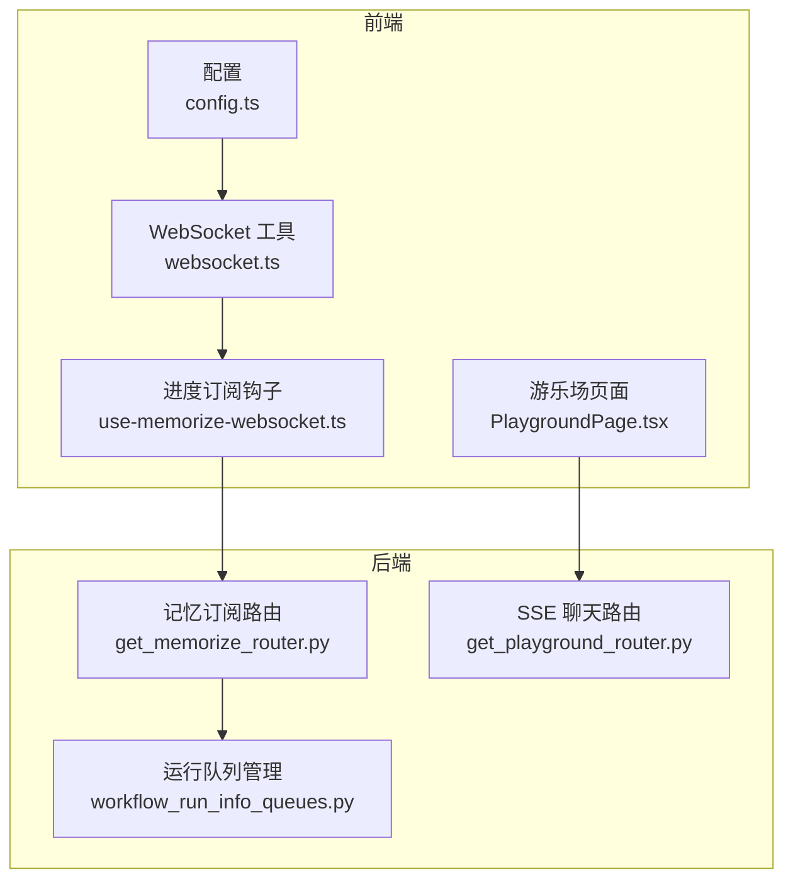
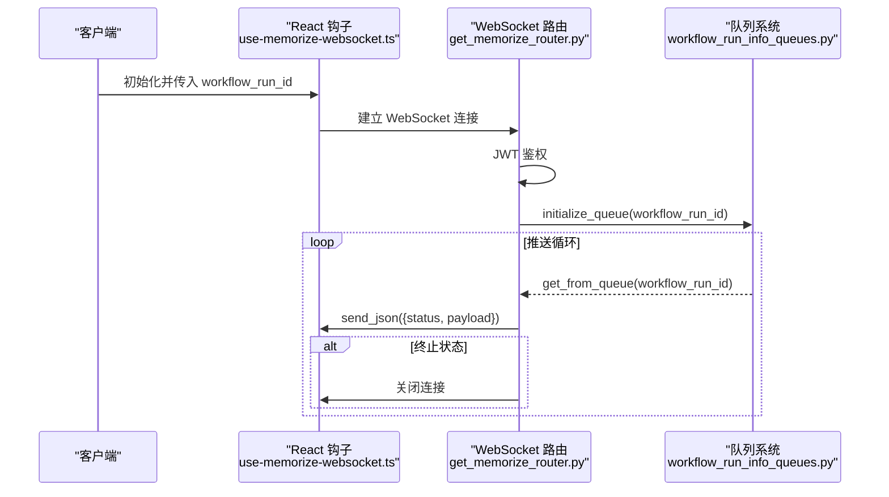
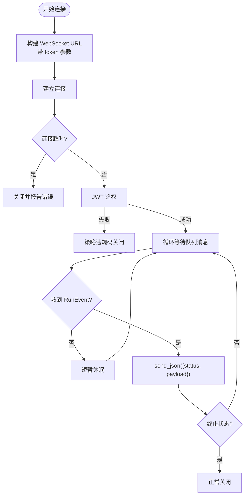
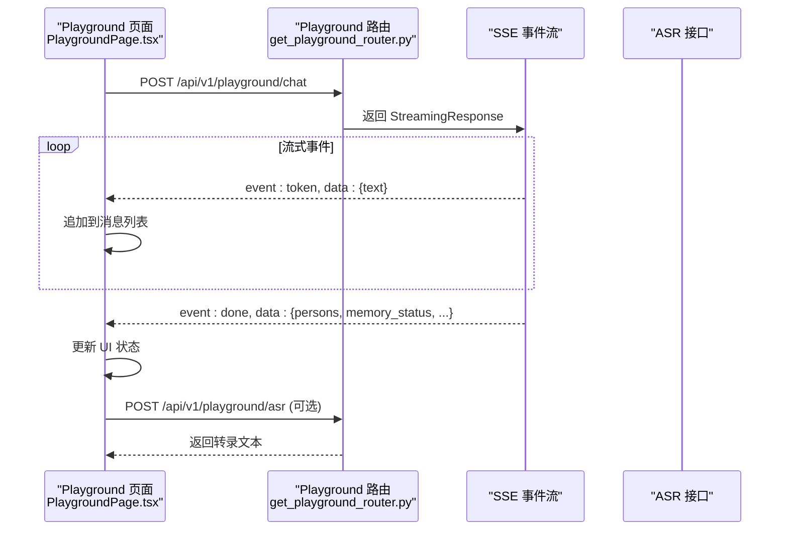
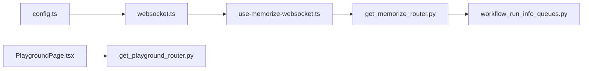

# WebSocket 实时通信

<cite>
**本文档引用的文件**
- [websocket.ts](file://m_flow-frontend/src/lib/api/websocket.ts)
- [use-memorize-websocket.ts](file://m_flow-frontend/src/hooks/use-memorize-websocket.ts)
- [get_memorize_router.py](file://m_flow/m_flow/api/v1/memorize/routers/get_memorize_router.py)
- [workflow_run_info_queues.py](file://m_flow/m_flow/pipeline/queues/workflow_run_info_queues.py)
- [config.ts](file://m_flow-frontend/src/lib/config.ts)
- [index.ts](file://m_flow-frontend/src/types/index.ts)
- [get_playground_router.py](file://m_flow/m_flow/api/v1/playground/routers/get_playground_router.py)
- [PlaygroundPage.tsx](file://m_flow-frontend/src/components/playground/PlaygroundPage.tsx)
</cite>

## 目录
1. [简介](#简介)
2. [项目结构](#项目结构)
3. [核心组件](#核心组件)
4. [架构总览](#架构总览)
5. [详细组件分析](#详细组件分析)
6. [依赖关系分析](#依赖关系分析)
7. [性能考虑](#性能考虑)
8. [故障排除指南](#故障排除指南)
9. [结论](#结论)
10. [附录](#附录)

## 简介
本文件系统性梳理 M-flow 的 WebSocket 实时通信能力，覆盖以下主题：
- 实时会话建立与管理：握手、心跳、断线重连策略
- 消息格式与协议规范：请求/响应模式、事件类型与数据结构
- 游乐场（Playground）实时交互示例：实时对话与状态同步
- 消息路由与分发：单播、多播、广播模式
- 错误处理与异常恢复
- 客户端集成示例：浏览器与移动端
- 性能优化与并发连接管理

## 项目结构
M-flow 的 WebSocket 能力由前端钩子与后端 FastAPI WebSocket 路由共同实现，并通过内存队列进行状态推送。前端配置负责构建 WebSocket URL 并提供连接状态与错误码常量；后端路由负责鉴权、状态入队与消息推送。



**图表来源**
- [config.ts:19-24](file://m_flow-frontend/src/lib/config.ts#L19-L24)
- [websocket.ts:19-32](file://m_flow-frontend/src/lib/api/websocket.ts#L19-L32)
- [use-memorize-websocket.ts:72-213](file://m_flow-frontend/src/hooks/use-memorize-websocket.ts#L72-L213)
- [get_memorize_router.py:260-337](file://m_flow/m_flow/api/v1/memorize/routers/get_memorize_router.py#L260-L337)
- [workflow_run_info_queues.py:19-66](file://m_flow/m_flow/pipeline/queues/workflow_run_info_queues.py#L19-L66)
- [get_playground_router.py:325-404](file://m_flow/m_flow/api/v1/playground/routers/get_playground_router.py#L325-L404)

**章节来源**
- [config.ts:19-24](file://m_flow-frontend/src/lib/config.ts#L19-L24)
- [websocket.ts:19-32](file://m_flow-frontend/src/lib/api/websocket.ts#L19-L32)
- [use-memorize-websocket.ts:72-213](file://m_flow-frontend/src/hooks/use-memorize-websocket.ts#L72-L213)
- [get_memorize_router.py:260-337](file://m_flow/m_flow/api/v1/memorize/routers/get_memorize_router.py#L260-L337)
- [workflow_run_info_queues.py:19-66](file://m_flow/m_flow/pipeline/queues/workflow_run_info_queues.py#L19-L66)
- [get_playground_router.py:325-404](file://m_flow/m_flow/api/v1/playground/routers/get_playground_router.py#L325-L404)

## 核心组件
- 前端 WebSocket 工具与配置
  - 构建 WebSocket 基础 URL 与记忆订阅 URL
  - 连接状态枚举与标准关闭码常量
- 记忆订阅 WebSocket 钩子
  - 连接超时、指数退避重连、认证失败处理
  - 自动断开于完成/失败状态
- 后端记忆订阅路由
  - JWT 鉴权、队列初始化与推送、终端状态自动关闭
- 内存队列系统
  - 为每个工作流运行实例维护异步队列，支持非阻塞读取
- 游乐场 SSE 聊天
  - 服务端事件流（SSE）用于实时对话与状态同步

**章节来源**
- [websocket.ts:19-65](file://m_flow-frontend/src/lib/api/websocket.ts#L19-L65)
- [use-memorize-websocket.ts:72-247](file://m_flow-frontend/src/hooks/use-memorize-websocket.ts#L72-L247)
- [get_memorize_router.py:260-337](file://m_flow/m_flow/api/v1/memorize/routers/get_memorize_router.py#L260-L337)
- [workflow_run_info_queues.py:19-66](file://m_flow/m_flow/pipeline/queues/workflow_run_info_queues.py#L19-L66)
- [get_playground_router.py:325-404](file://m_flow/m_flow/api/v1/playground/routers/get_playground_router.py#L325-L404)

## 架构总览
M-flow 的实时通信采用“前端 WebSocket 订阅 + 后端队列推送”的模式。前端通过钩子建立连接并接收状态更新；后端在处理流程中将 RunEvent 推送至队列，WebSocket 路由从队列拉取并发送给客户端。游乐场使用 SSE 提供流式对话体验。



**图表来源**
- [use-memorize-websocket.ts:125-213](file://m_flow-frontend/src/hooks/use-memorize-websocket.ts#L125-L213)
- [get_memorize_router.py:260-337](file://m_flow/m_flow/api/v1/memorize/routers/get_memorize_router.py#L260-L337)
- [workflow_run_info_queues.py:48-66](file://m_flow/m_flow/pipeline/queues/workflow_run_info_queues.py#L48-L66)

## 详细组件分析

### WebSocket 连接与会话管理
- 握手与鉴权
  - 前端使用查询参数 token 或 Cookie 中的访问令牌
  - 后端使用 JWT 策略解析并校验令牌，失败则以策略违规码关闭连接
- 心跳检测
  - 未实现专用心跳帧；通过连接存活与消息推送维持会话
- 断线重连策略
  - 默认最大重连次数与连接超时
  - 指数退避延迟，上限保护
  - 正常关闭不重连；认证失败不再重连



**图表来源**
- [websocket.ts:28-31](file://m_flow-frontend/src/lib/api/websocket.ts#L28-L31)
- [get_memorize_router.py:264-290](file://m_flow/m_flow/api/v1/memorize/routers/get_memorize_router.py#L264-L290)
- [use-memorize-websocket.ts:140-212](file://m_flow-frontend/src/hooks/use-memorize-websocket.ts#L140-L212)

**章节来源**
- [websocket.ts:28-31](file://m_flow-frontend/src/lib/api/websocket.ts#L28-L31)
- [get_memorize_router.py:264-290](file://m_flow/m_flow/api/v1/memorize/routers/get_memorize_router.py#L264-L290)
- [use-memorize-websocket.ts:140-212](file://m_flow-frontend/src/hooks/use-memorize-websocket.ts#L140-L212)

### 消息格式与协议规范
- 记忆订阅消息体
  - 字段：workflow_run_id、status、payload
  - payload 为格式化后的知识图谱数据
- 状态枚举
  - RunStarted、RunYield、RunCompleted、RunAlreadyCompleted、RunFailed
- SSE 聊天事件
  - token：增量文本片段
  - done：最终聚合数据（人物、记忆状态、共指解析等）

```mermaid
classDiagram
class WebSocketProgress {
+string workflow_run_id
+RunStatus status
+unknown payload
}
class RunStatus {
<<enum>>
"RunStarted"
"RunYield"
"RunCompleted"
"RunAlreadyCompleted"
"RunFailed"
}
WebSocketProgress --> RunStatus : "包含"
```

**图表来源**
- [index.ts:667-671](file://m_flow-frontend/src/types/index.ts#L667-L671)
- [get_memorize_router.py:308-315](file://m_flow/m_flow/api/v1/memorize/routers/get_memorize_router.py#L308-L315)

**章节来源**
- [index.ts:633-671](file://m_flow-frontend/src/types/index.ts#L633-L671)
- [get_memorize_router.py:308-315](file://m_flow/m_flow/api/v1/memorize/routers/get_memorize_router.py#L308-L315)

### 游乐场实时交互示例
- 实时对话
  - 使用 SSE 流式接收 token 事件，拼接增量文本
  - 结束时接收 done 事件，更新人物、记忆状态与共指信息
- 状态同步
  - 通过轮询接口获取人脸识别状态、视频流地址
  - 支持手动触发短期到长期记忆的刷新



**图表来源**
- [PlaygroundPage.tsx:157-282](file://m_flow-frontend/src/components/playground/PlaygroundPage.tsx#L157-L282)
- [get_playground_router.py:325-404](file://m_flow/m_flow/api/v1/playground/routers/get_playground_router.py#L325-L404)

**章节来源**
- [PlaygroundPage.tsx:157-282](file://m_flow-frontend/src/components/playground/PlaygroundPage.tsx#L157-L282)
- [get_playground_router.py:325-404](file://m_flow/m_flow/api/v1/playground/routers/get_playground_router.py#L325-L404)

### 消息路由与分发机制
- 单播
  - 记忆订阅路由按 workflow_run_id 建立独立连接，仅向订阅者推送对应状态
- 多播
  - 后端队列系统为每个 workflow_run_id 维护一个队列，多个消费者可并行处理（当前 WebSocket 为单消费者）
- 广播
  - 未实现全局广播；如需可扩展为多队列或多路推送

**章节来源**
- [get_memorize_router.py:296-337](file://m_flow/m_flow/api/v1/memorize/routers/get_memorize_router.py#L296-L337)
- [workflow_run_info_queues.py:19-66](file://m_flow/m_flow/pipeline/queues/workflow_run_info_queues.py#L19-L66)

### 错误处理与异常恢复
- 前端
  - 连接超时、网络错误、解析异常均记录并进入错误状态
  - 认证失败直接停止重连
- 后端
  - 鉴权失败以策略违规码关闭
  - 终止状态（完成/已完成/失败）主动关闭连接
  - WebSocketDisconnect 异常安全退出循环

**章节来源**
- [use-memorize-websocket.ts:174-212](file://m_flow-frontend/src/hooks/use-memorize-websocket.ts#L174-L212)
- [get_memorize_router.py:287-335](file://m_flow/m_flow/api/v1/memorize/routers/get_memorize_router.py#L287-L335)

### 客户端集成示例
- 浏览器
  - 使用 localStorage 中的令牌作为查询参数附加到 URL
  - 使用 React 钩子管理连接生命周期与状态
- 移动应用
  - 原理一致：在应用层获取令牌并构造 URL，使用原生 WebSocket 库建立连接
  - 注意：若使用 HTTP 代理或反向代理，请确保 WebSocket 协议升级与路径转发正确

**章节来源**
- [websocket.ts:28-31](file://m_flow-frontend/src/lib/api/websocket.ts#L28-L31)
- [config.ts:19-24](file://m_flow-frontend/src/lib/config.ts#L19-L24)

## 依赖关系分析
- 前端依赖
  - 配置模块决定 WS_BASE_URL，工具模块生成订阅 URL，钩子封装连接逻辑
- 后端依赖
  - WebSocket 路由依赖鉴权策略、数据库适配器、队列系统与知识图谱格式化函数
- 数据流
  - 处理流程将 RunEvent 推入队列，WebSocket 路由从队列取出并发送



**图表来源**
- [config.ts:19-24](file://m_flow-frontend/src/lib/config.ts#L19-L24)
- [websocket.ts:19-32](file://m_flow-frontend/src/lib/api/websocket.ts#L19-L32)
- [use-memorize-websocket.ts:72-213](file://m_flow-frontend/src/hooks/use-memorize-websocket.ts#L72-L213)
- [get_memorize_router.py:260-337](file://m_flow/m_flow/api/v1/memorize/routers/get_memorize_router.py#L260-L337)
- [workflow_run_info_queues.py:19-66](file://m_flow/m_flow/pipeline/queues/workflow_run_info_queues.py#L19-L66)
- [PlaygroundPage.tsx:157-282](file://m_flow-frontend/src/components/playground/PlaygroundPage.tsx#L157-L282)
- [get_playground_router.py:325-404](file://m_flow/m_flow/api/v1/playground/routers/get_playground_router.py#L325-L404)

**章节来源**
- [config.ts:19-24](file://m_flow-frontend/src/lib/config.ts#L19-L24)
- [websocket.ts:19-32](file://m_flow-frontend/src/lib/api/websocket.ts#L19-L32)
- [use-memorize-websocket.ts:72-213](file://m_flow-frontend/src/hooks/use-memorize-websocket.ts#L72-L213)
- [get_memorize_router.py:260-337](file://m_flow/m_flow/api/v1/memorize/routers/get_memorize_router.py#L260-L337)
- [workflow_run_info_queues.py:19-66](file://m_flow/m_flow/pipeline/queues/workflow_run_info_queues.py#L19-L66)
- [PlaygroundPage.tsx:157-282](file://m_flow-frontend/src/components/playground/PlaygroundPage.tsx#L157-L282)
- [get_playground_router.py:325-404](file://m_flow/m_flow/api/v1/playground/routers/get_playground_router.py#L325-L404)

## 性能考虑
- 队列轮询
  - 当前实现使用短暂休眠轮询队列，建议在高并发场景下评估队列容量与推送频率
- 连接管理
  - 指数退避重连避免风暴；建议限制最大并发连接数并结合服务端限流
- 消息体积
  - payload 包含格式化后的知识图谱数据，建议对大对象进行分片或压缩
- 前端渲染
  - 对频繁更新的消息进行去抖/节流，减少 UI 重绘压力

[本节为通用指导，无需具体文件分析]

## 故障排除指南
- 常见错误码
  - 1008：策略违规（认证失败）
  - 1000：正常关闭（完成/失败）
  - 1005：无状态关闭（客户端主动）
- 前端排查
  - 检查 token 是否存在且有效
  - 观察连接状态是否停留在“连接中”或“错误”
  - 查看控制台日志中的解析异常
- 后端排查
  - 鉴权失败会立即关闭连接
  - 终止状态后队列被清理，确认是否重复订阅

**章节来源**
- [websocket.ts:49-65](file://m_flow-frontend/src/lib/api/websocket.ts#L49-L65)
- [use-memorize-websocket.ts:174-212](file://m_flow-frontend/src/hooks/use-memorize-websocket.ts#L174-L212)
- [get_memorize_router.py:287-335](file://m_flow/m_flow/api/v1/memorize/routers/get_memorize_router.py#L287-L335)

## 结论
M-flow 的 WebSocket 实时通信以简洁可靠为核心目标：前端通过钩子实现稳健的连接与重连，后端基于队列系统实现低耦合的状态推送。游乐场通过 SSE 提供流畅的对话体验。整体设计易于扩展与维护，适合在生产环境中稳定运行。

[本节为总结，无需具体文件分析]

## 附录

### API 与数据模型速查
- 记忆订阅 WebSocket
  - URL：WS_BASE_URL + /api/v1/memorize/subscribe/{workflow_run_id}?token=...
  - 请求：无（握手即订阅）
  - 响应：JSON 对象（status、payload），事件结束后关闭
- SSE 聊天
  - URL：/api/v1/playground/chat
  - 事件：token（增量文本）、done（最终聚合数据）

**章节来源**
- [websocket.ts:28-31](file://m_flow-frontend/src/lib/api/websocket.ts#L28-L31)
- [get_memorize_router.py:308-315](file://m_flow/m_flow/api/v1/memorize/routers/get_memorize_router.py#L308-L315)
- [get_playground_router.py:325-404](file://m_flow/m_flow/api/v1/playground/routers/get_playground_router.py#L325-L404)