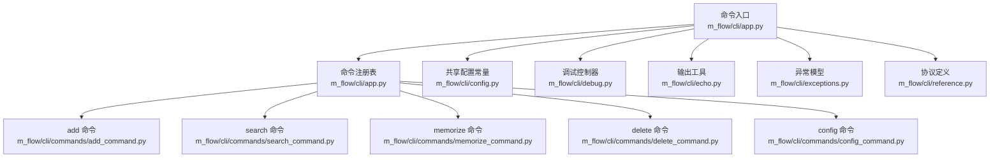
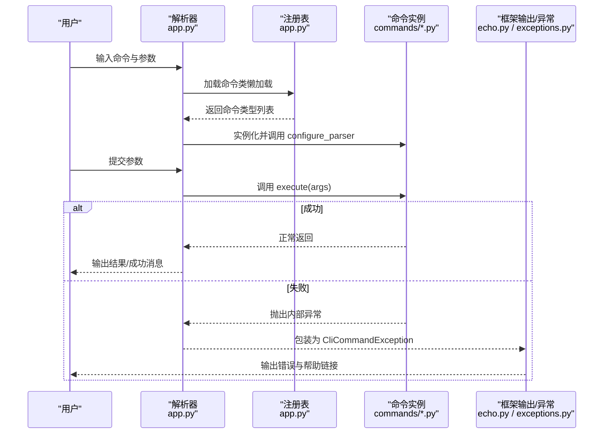
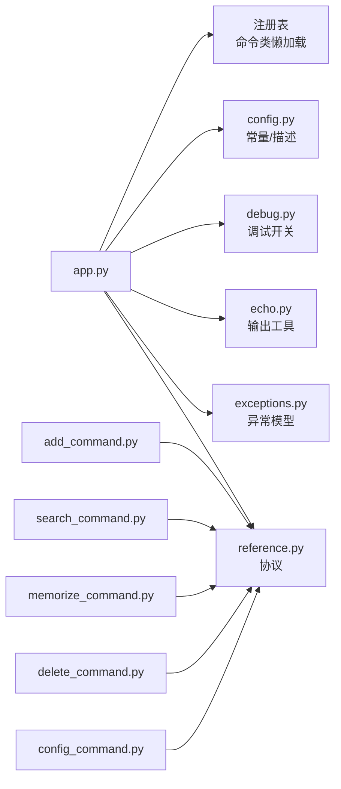

# 命令行工具

<cite>
**本文引用的文件**
- [m_flow/cli/app.py](file://m_flow/cli/app.py)
- [m_flow/cli/config.py](file://m_flow/cli/config.py)
- [m_flow/cli/debug.py](file://m_flow/cli/debug.py)
- [m_flow/cli/echo.py](file://m_flow/cli/echo.py)
- [m_flow/cli/reference.py](file://m_flow/cli/reference.py)
- [m_flow/cli/exceptions.py](file://m_flow/cli/exceptions.py)
- [m_flow/cli/commands/add_command.py](file://m_flow/cli/commands/add_command.py)
- [m_flow/cli/commands/search_command.py](file://m_flow/cli/commands/search_command.py)
- [m_flow/cli/commands/memorize_command.py](file://m_flow/cli/commands/memorize_command.py)
- [m_flow/cli/commands/delete_command.py](file://m_flow/cli/commands/delete_command.py)
- [m_flow/cli/commands/config_command.py](file://m_flow/cli/commands/config_command.py)
</cite>

## 目录
1. [简介](#简介)
2. [项目结构](#项目结构)
3. [核心组件](#核心组件)
4. [架构总览](#架构总览)
5. [详细组件分析](#详细组件分析)
6. [依赖分析](#依赖分析)
7. [性能考虑](#性能考虑)
8. [故障排除指南](#故障排除指南)
9. [结论](#结论)
10. [附录](#附录)

## 简介
本文件为 M-flow 命令行工具的完整参考文档，覆盖以下内容：
- 所有 CLI 子命令及其选项：数据管理（add、delete、memorize、search）、配置管理（config）
- 顶层选项：版本信息、调试模式、启动 Web UI
- 输出格式与日志级别控制
- 环境变量与配置文件位置说明
- 常见使用场景与命令组合示例
- 故障排除与常见问题

## 项目结构
M-flow CLI 的入口与命令注册集中在应用层，各子命令实现于独立模块中，并通过统一协议进行发现与执行。

图表来源
- [m_flow/cli/app.py:71-90](file://m_flow/cli/app.py#L71-L90)
- [m_flow/cli/commands/add_command.py:43-49](file://m_flow/cli/commands/add_command.py#L43-L49)
- [m_flow/cli/commands/search_command.py:70-76](file://m_flow/cli/commands/search_command.py#L70-L76)
- [m_flow/cli/commands/memorize_command.py:12-15](file://m_flow/cli/commands/memorize_command.py#L12-L15)
- [m_flow/cli/commands/delete_command.py:33-39](file://m_flow/cli/commands/delete_command.py#L33-L39)
- [m_flow/cli/commands/config_command.py:54-60](file://m_flow/cli/commands/config_command.py#L54-L60)

章节来源
- [m_flow/cli/app.py:120-144](file://m_flow/cli/app.py#L120-L144)
- [m_flow/cli/config.py:14-60](file://m_flow/cli/config.py#L14-L60)

## 核心组件
- 命令入口与解析器构建：负责顶层参数、子命令注册、Rich 帮助格式化、UI 启动流程与错误处理。
- 命令协议：统一的命令接口，确保各子命令具备一致的元数据与生命周期方法。
- 配置常量：集中管理命令描述、可选值集合（召回模式、分块器、输出格式）。
- 调试与输出：全局调试开关与语义化输出函数，用于帮助信息、警告、错误与成功提示。
- 异常模型：区分用户可见错误与内部错误，便于在框架层统一处理并返回合适的退出码。

章节来源
- [m_flow/cli/app.py:231-270](file://m_flow/cli/app.py#L231-L270)
- [m_flow/cli/reference.py:17-49](file://m_flow/cli/reference.py#L17-L49)
- [m_flow/cli/config.py:22-60](file://m_flow/cli/config.py#L22-L60)
- [m_flow/cli/debug.py:16-46](file://m_flow/cli/debug.py#L16-L46)
- [m_flow/cli/echo.py:23-69](file://m_flow/cli/echo.py#L23-L69)
- [m_flow/cli/exceptions.py:19-60](file://m_flow/cli/exceptions.py#L19-L60)

## 架构总览
M-flow CLI 采用“协议 + 注册表 + 懒加载”的架构：
- 协议层：SupportsCliCommand 定义命令必须实现的方法与元数据。
- 发现层：命令注册表在运行时动态导入并实例化具体命令类。
- 执行层：解析器生成后，按命令字符串映射到具体实现并执行。

图表来源
- [m_flow/cli/app.py:80-90](file://m_flow/cli/app.py#L80-L90)
- [m_flow/cli/app.py:130-141](file://m_flow/cli/app.py#L130-L141)
- [m_flow/cli/app.py:250-268](file://m_flow/cli/app.py#L250-L268)
- [m_flow/cli/exceptions.py:19-51](file://m_flow/cli/exceptions.py#L19-L51)

## 详细组件分析

### 顶层命令与选项
- 版本：显示当前版本号。
- 调试：启用详细堆栈跟踪与诊断输出。
- 启动 UI：一键启动前端、后端与 MCP 服务，并在中断时清理进程。

章节来源
- [m_flow/cli/app.py:121-127](file://m_flow/cli/app.py#L121-L127)
- [m_flow/cli/app.py:38-50](file://m_flow/cli/app.py#L38-L50)
- [m_flow/cli/app.py:152-223](file://m_flow/cli/app.py#L152-L223)

### 数据管理命令

#### add 命令
- 功能：将多种输入源（文本、本地文件、URL、S3）添加到指定数据集，供后续处理。
- 语法
  - mflow add DATA [DATA ...] [--dataset-name DATASET_NAME | -d DATASET_NAME]
- 参数
  - DATA：一个或多个数据项（文本、文件路径、文件/HTTP/S3 URL）
  - --dataset-name, -d：目标数据集名称（默认：main_dataset）
- 行为
  - 将输入标准化为单个字符串或列表，异步调用底层添加接口，完成后输出成功信息。
- 示例
  - 添加单个文本片段到默认数据集
  - 添加多个文件路径到自定义数据集
- 注意
  - 添加后需执行 memorize 以构建知识图谱

章节来源
- [m_flow/cli/commands/add_command.py:51-57](file://m_flow/cli/commands/add_command.py#L51-L57)
- [m_flow/cli/commands/add_command.py:65-75](file://m_flow/cli/commands/add_command.py#L65-L75)
- [m_flow/cli/commands/add_command.py:77-92](file://m_flow/cli/commands/add_command.py#L77-L92)

#### search 命令
- 功能：对知识图谱进行检索，支持多种召回模式与输出格式。
- 语法
  - mflow search QUERY_TEXT [--query-type QUERY_TYPE | -t {TRIPLET_COMPLESSION,CYPHER,EPISODIC,PROCEDURAL,CHUNKS_LEXICAL}] [--datasets DATASET [DATASET ...]] [--top-k N | -k N] [--system-prompt PROMPT_FILE] [--output-format OUTPUT_FORMAT | -f {json,pretty,simple}]
- 参数
  - QUERY_TEXT：查询语句或关键词
  - --query-type, -t：召回模式（默认：TRIPLET_COMPLETION）
  - --datasets, -d：限定数据集集合
  - --top-k, -k：返回条数上限（默认：10）
  - --system-prompt：LLM 模式下的系统提示词文件路径
  - --output-format, -f：输出格式（默认：pretty）
- 召回模式
  - TRIPLET_COMPLETION：基于图上下文的自然语言问答
  - EPISODIC：事件记忆检索
  - PROCEDURAL：步骤式指令检索
  - CYPHER：原生图数据库查询
  - CHUNKS_LEXICAL：基于分词的精确匹配
- 输出格式
  - json：结构化 JSON
  - pretty：人类可读的分段展示
  - simple：简洁编号列表
- 示例
  - 使用默认模式检索并以人类可读格式输出
  - 指定 top-k 与数据集过滤
  - 使用自定义系统提示词文件

章节来源
- [m_flow/cli/commands/search_command.py:78-114](file://m_flow/cli/commands/search_command.py#L78-L114)
- [m_flow/cli/commands/search_command.py:116-136](file://m_flow/cli/commands/search_command.py#L116-L136)
- [m_flow/cli/commands/search_command.py:138-176](file://m_flow/cli/commands/search_command.py#L138-L176)
- [m_flow/cli/config.py:34-40](file://m_flow/cli/config.py#L34-L40)
- [m_flow/cli/config.py:56-60](file://m_flow/cli/config.py#L56-L60)

#### memorize 命令
- 功能：将已添加的数据转化为结构化的知识图谱（事件、方面、实体等层次）。
- 语法
  - mflow memorize [--datasets DATASET [DATASET ...]] [--chunk-size N] [--chunker {TextChunker,LangchainChunker,CsvChunker} | -c CHUNKER] [--background | -b] [--verbose | -v] [--content-type {text,dialog} | -t TYPE]
- 参数
  - --datasets, -d：要处理的一个或多个数据集（不指定则处理全部）
  - --chunk-size：每块最大 token 数（未指定时由 LLM 推断）
  - --chunker, -c：分块策略（默认：TextChunker；若不可用则回退）
  - --background, -b：后台运行并立即返回（推荐大体量数据）
  - --verbose, -v：显示详细进度
  - --content-type, -t：内容类型（text 或 dialog，默认 text）
- 行为
  - 根据参数选择分块器与内容类型，异步执行记忆化流程；后台模式下返回后继续处理。
- 示例
  - 对全部数据进行记忆化
  - 指定分块器与后台运行

章节来源
- [m_flow/cli/commands/memorize_command.py:34-65](file://m_flow/cli/commands/memorize_command.py#L34-L65)
- [m_flow/cli/commands/memorize_command.py:86-129](file://m_flow/cli/commands/memorize_command.py#L86-L129)
- [m_flow/cli/config.py:46-50](file://m_flow/cli/config.py#L46-L50)

#### delete 命令
- 功能：删除数据集、用户数据或全库清理。
- 语法
  - mflow delete (--dataset-name DATASET_NAME | --user-id USER_ID | --all) [--force | -f]
- 参数
  - --dataset-name, -d：要删除的数据集
  - --user-id, -u：删除该用户的全部数据
  - --all：清空整个知识库
  - --force, -f：跳过确认提示
- 行为
  - 在非强制模式下先预览删除规模，再进行确认；执行后输出成功信息。
- 示例
  - 删除指定数据集
  - 清空全库（谨慎）

章节来源
- [m_flow/cli/commands/delete_command.py:41-46](file://m_flow/cli/commands/delete_command.py#L41-L46)
- [m_flow/cli/commands/delete_command.py:98-136](file://m_flow/cli/commands/delete_command.py#L98-L136)

### 配置管理命令（config）
- 功能：查看、修改、重置 M-flow 设置。
- 语法
  - mflow config get [KEY]
  - mflow config set KEY VALUE
  - mflow config unset KEY [--force | -f]
  - mflow config list
  - mflow config reset [--force | -f]
- 支持的键（部分）
  - llm_provider、llm_model、llm_api_key、llm_endpoint
  - graph_database_provider、vector_db_provider、vector_db_url、vector_db_key
  - chunk_size、chunk_overlap
- 行为
  - get：获取单个或全部配置
  - set：设置配置（自动尝试 JSON 解析）
  - unset：恢复默认值（需确认）
  - list：列出可用键
  - reset：恢复全部默认值（当前提示为占位）
- 示例
  - 查看当前配置
  - 设置向量数据库提供商
  - 将某个键重置为默认值

章节来源
- [m_flow/cli/commands/config_command.py:62-86](file://m_flow/cli/commands/config_command.py#L62-L86)
- [m_flow/cli/commands/config_command.py:108-132](file://m_flow/cli/commands/config_command.py#L108-L132)
- [m_flow/cli/commands/config_command.py:134-143](file://m_flow/cli/commands/config_command.py#L134-L143)
- [m_flow/cli/commands/config_command.py:145-167](file://m_flow/cli/commands/config_command.py#L145-L167)
- [m_flow/cli/commands/config_command.py:169-179](file://m_flow/cli/commands/config_command.py#L169-L179)
- [m_flow/cli/commands/config_command.py:181-190](file://m_flow/cli/commands/config_command.py#L181-L190)
- [m_flow/cli/config.py:20-32](file://m_flow/cli/config.py#L20-L32)

### 调试工具与输出
- 调试模式
  - 通过 --debug 开启，启用详细诊断输出并在失败时显示完整堆栈。
- 输出样式
  - note/warning/error/success：分别对应提示、警告、错误与成功信息
  - 支持富文本帮助格式（当 rich-argparse 可用时）
- 日志级别
  - CLI 层未内置多级日志；调试模式为全局开关，用于增强可观测性

章节来源
- [m_flow/cli/app.py:38-50](file://m_flow/cli/app.py#L38-L50)
- [m_flow/cli/debug.py:16-46](file://m_flow/cli/debug.py#L16-L46)
- [m_flow/cli/echo.py:37-69](file://m_flow/cli/echo.py#L37-L69)
- [m_flow/cli/app.py:107-118](file://m_flow/cli/app.py#L107-L118)

### 环境变量与配置文件
- 环境变量
  - CLI 层未直接暴露专用环境变量键；配置主要通过 config 子命令管理。
- 配置文件
  - CLI 层未显式声明固定配置文件路径；配置持久化由上层配置模块负责。
- 建议
  - 使用 config 子命令进行设置与持久化
  - 如需自动化，可在脚本中先执行 config set 再执行业务命令

章节来源
- [m_flow/cli/commands/config_command.py:108-132](file://m_flow/cli/commands/config_command.py#L108-L132)

### 常见使用场景与命令组合
- 批量数据处理
  - 先 add 多个文件路径，再 memorize 并指定 --background 进行后台处理
- 自动化脚本集成
  - 使用 --output-format json 获取结构化输出，便于下游解析
  - 使用 --force 避免交互确认
- 查询优化
  - 指定 --datasets 与 --top-k 控制范围与数量
  - 使用 --system-prompt 指定领域提示词

章节来源
- [m_flow/cli/commands/add_command.py:77-92](file://m_flow/cli/commands/add_command.py#L77-L92)
- [m_flow/cli/commands/memorize_command.py:86-129](file://m_flow/cli/commands/memorize_command.py#L86-L129)
- [m_flow/cli/commands/search_command.py:116-176](file://m_flow/cli/commands/search_command.py#L116-L176)

## 依赖分析
- 组件耦合
  - app.py 通过注册表懒加载命令类，降低启动时的包导入成本
  - 各命令均遵循 SupportsCliCommand 协议，保持接口一致性
- 外部依赖
  - rich-argparse：可选富文本帮助格式
  - asyncio：异步执行底层操作
- 循环依赖
  - 命令模块延迟导入 m_flow 主包，避免循环依赖

图表来源
- [m_flow/cli/app.py:80-90](file://m_flow/cli/app.py#L80-L90)
- [m_flow/cli/reference.py:17-49](file://m_flow/cli/reference.py#L17-L49)
- [m_flow/cli/config.py:14-60](file://m_flow/cli/config.py#L14-L60)
- [m_flow/cli/debug.py:16-46](file://m_flow/cli/debug.py#L16-L46)
- [m_flow/cli/echo.py:23-69](file://m_flow/cli/echo.py#L23-L69)
- [m_flow/cli/exceptions.py:19-60](file://m_flow/cli/exceptions.py#L19-L60)

## 性能考虑
- 后台运行：memorize 的 --background 适合大规模数据，避免阻塞终端
- 分块策略：根据内容类型与体量选择合适的 chunker 与 chunk-size
- 结果限制：search 的 --top-k 可减少输出与处理开销
- 富文本格式：rich-argparse 仅用于帮助输出，不影响核心性能

## 故障排除指南
- 命令未知或参数错误
  - 使用 --help 查看帮助；检查子命令是否正确拼写
- 搜索无结果
  - 调整召回模式或增加 --top-k；确认数据集过滤是否过于严格
- 记忆化失败
  - 检查分块器可用性；尝试更换 chunker；开启 --verbose 获取更多上下文
- 删除风险
  - 使用 --force 前务必确认；建议先预览删除规模
- 调试与日志
  - 使用 --debug 获取完整堆栈；结合 note/warning/error 输出定位问题

章节来源
- [m_flow/cli/app.py:244-268](file://m_flow/cli/app.py#L244-L268)
- [m_flow/cli/exceptions.py:19-51](file://m_flow/cli/exceptions.py#L19-L51)
- [m_flow/cli/commands/delete_command.py:107-131](file://m_flow/cli/commands/delete_command.py#L107-L131)

## 结论
M-flow CLI 提供了从数据添加、记忆化到检索与配置管理的完整命令行工作流。通过统一协议与懒加载机制，CLI 保持良好的扩展性与可维护性。建议在生产环境中配合后台运行、结构化输出与配置管理命令，以获得稳定且可重复的体验。

## 附录

### 命令与选项速查
- mflow add
  - 位置参数：DATA（可多个）
  - 选项：--dataset-name/-d
- mflow search
  - 位置参数：QUERY_TEXT
  - 选项：--query-type/-t、--datasets/-d、--top-k/-k、--system-prompt、--output-format/-f
- mflow memorize
  - 选项：--datasets/-d、--chunk-size、--chunker/-c、--background/-b、--verbose/-v、--content-type/-t
- mflow delete
  - 互斥选项：--dataset-name/-d、--user-id/-u、--all；--force/-f
- mflow config
  - 子命令：get、set、unset、list、reset；--force/-f

章节来源
- [m_flow/cli/commands/add_command.py:51-57](file://m_flow/cli/commands/add_command.py#L51-L57)
- [m_flow/cli/commands/search_command.py:78-114](file://m_flow/cli/commands/search_command.py#L78-L114)
- [m_flow/cli/commands/memorize_command.py:34-65](file://m_flow/cli/commands/memorize_command.py#L34-L65)
- [m_flow/cli/commands/delete_command.py:41-46](file://m_flow/cli/commands/delete_command.py#L41-L46)
- [m_flow/cli/commands/config_command.py:62-86](file://m_flow/cli/commands/config_command.py#L62-L86)