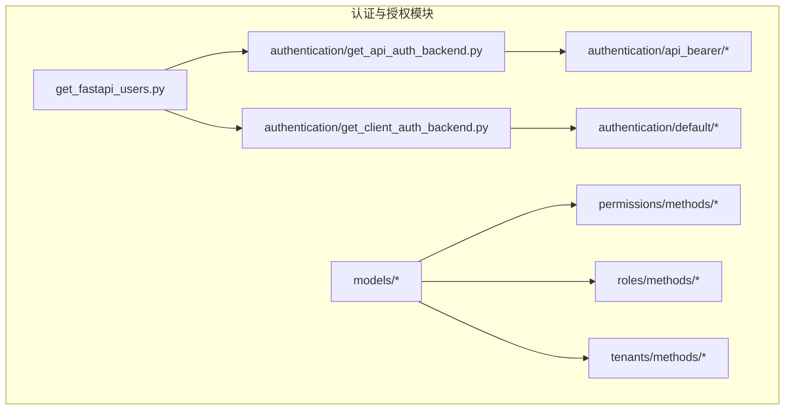
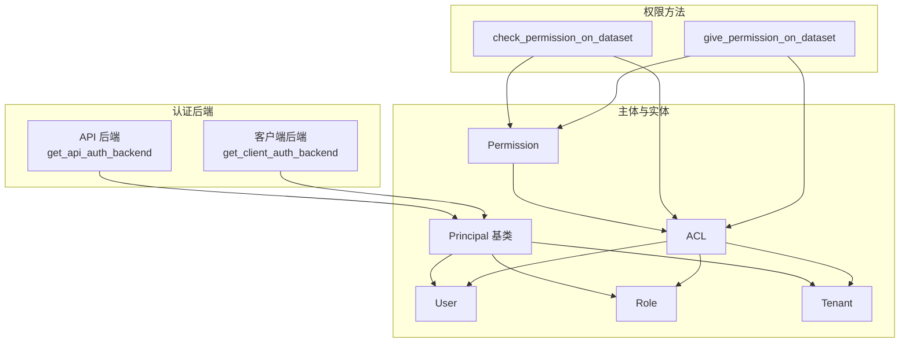
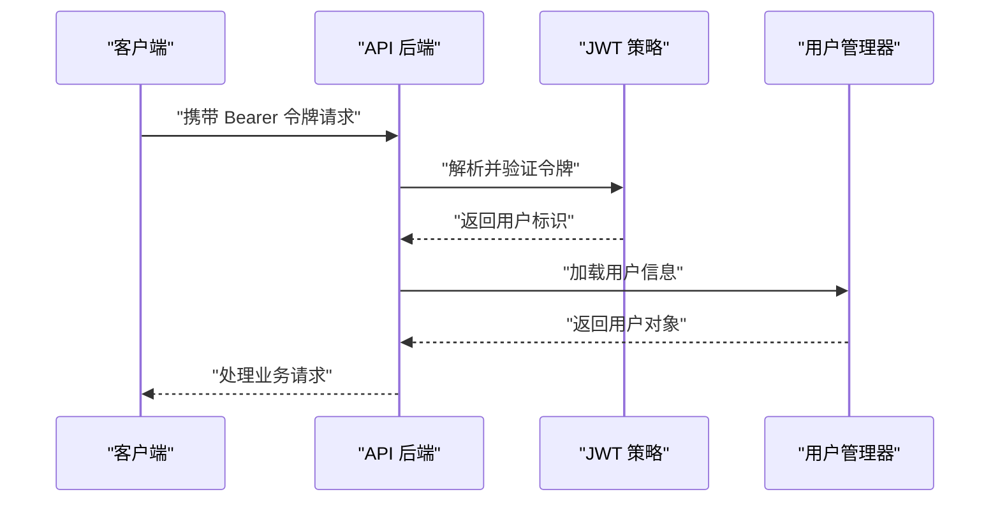
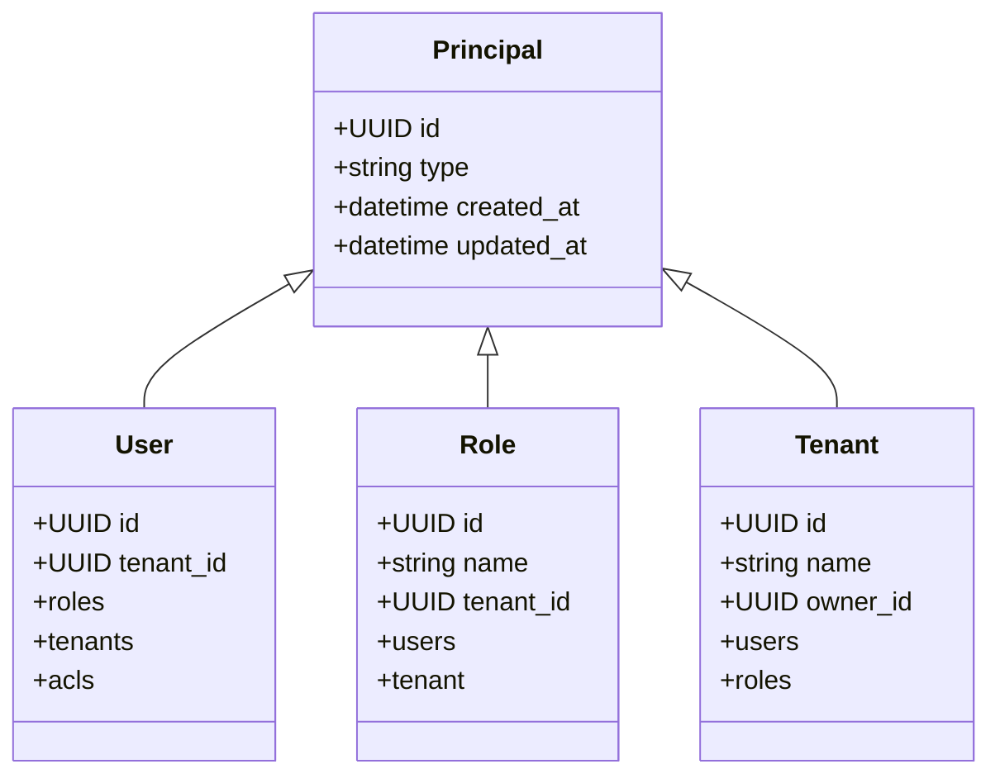
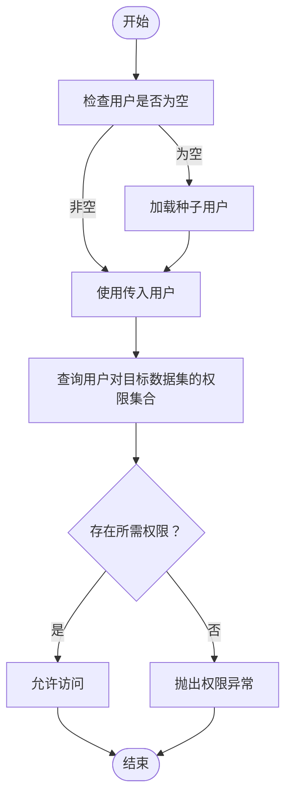
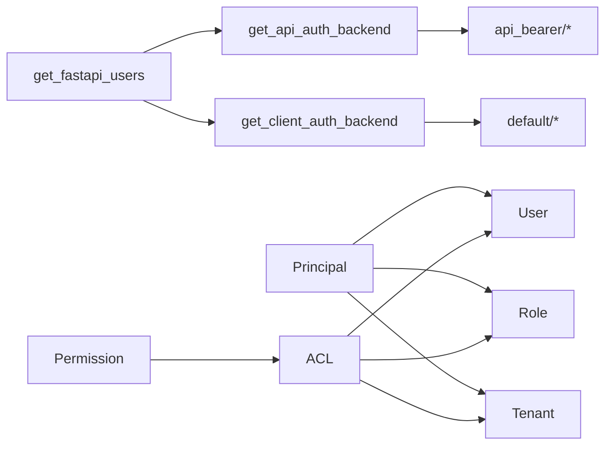

# 认证与授权

<cite>
**本文引用的文件**
- [m_flow/auth/__init__.py](file://m_flow/auth/__init__.py)
- [m_flow/auth/get_fastapi_users.py](file://m_flow/auth/get_fastapi_users.py)
- [m_flow/auth/authentication/get_api_auth_backend.py](file://m_flow/auth/authentication/get_api_auth_backend.py)
- [m_flow/auth/authentication/get_client_auth_backend.py](file://m_flow/auth/authentication/get_client_auth_backend.py)
- [m_flow/auth/authentication/api_bearer/__init__.py](file://m_flow/auth/authentication/api_bearer/__init__.py)
- [m_flow/auth/authentication/default/__init__.py](file://m_flow/auth/authentication/default/__init__.py)
- [m_flow/auth/models/Principal.py](file://m_flow/auth/models/Principal.py)
- [m_flow/auth/models/User.py](file://m_flow/auth/models/User.py)
- [m_flow/auth/models/Role.py](file://m_flow/auth/models/Role.py)
- [m_flow/auth/models/Tenant.py](file://m_flow/auth/models/Tenant.py)
- [m_flow/auth/models/Permission.py](file://m_flow/auth/models/Permission.py)
- [m_flow/auth/models/ACL.py](file://m_flow/auth/models/ACL.py)
- [m_flow/auth/permissions/methods/check_permission_on_dataset.py](file://m_flow/auth/permissions/methods/check_permission_on_dataset.py)
- [m_flow/auth/permissions/methods/give_permission_on_dataset.py](file://m_flow/auth/permissions/methods/give_permission_on_dataset.py)
- [m_flow/auth/permissions/methods/__init__.py](file://m_flow/auth/permissions/methods/__init__.py)
- [m_flow/auth/roles/methods/__init__.py](file://m_flow/auth/roles/methods/__init__.py)
- [m_flow/auth/tenants/methods/create_tenant.py](file://m_flow/auth/tenants/methods/create_tenant.py)
- [examples/python/permissions_example.py](file://examples/python/permissions_example.py)
</cite>

## 目录
1. [简介](#简介)
2. [项目结构](#项目结构)
3. [核心组件](#核心组件)
4. [架构总览](#架构总览)
5. [详细组件分析](#详细组件分析)
6. [依赖分析](#依赖分析)
7. [性能考虑](#性能考虑)
8. [故障排查指南](#故障排查指南)
9. [结论](#结论)
10. [附录](#附录)

## 简介
本文件系统性阐述 M-flow 的认证与授权体系，覆盖以下要点：
- 用户认证机制：API Bearer Token 与默认 JWT 策略的使用方式与差异
- 权限模型：用户、角色、权限、租户及其相互关系
- 权限分配与管理流程：从授予到验证，含数据集级访问控制与多租户支持
- ACL 配置与权限继承规则
- 安全最佳实践：密码策略、会话管理、令牌刷新等
- 应用集成示例：通过示例脚本展示如何在应用中启用与使用认证授权能力

## 项目结构
认证与授权相关代码主要集中在 m_flow/auth 目录，围绕 FastAPI Users 框架构建，采用基于 JWT 的认证后端，结合 RBAC 与 ACL 实现细粒度的数据集级访问控制，并通过多租户模型实现组织隔离。

图表来源
- [m_flow/auth/get_fastapi_users.py:1-48](file://m_flow/auth/get_fastapi_users.py#L1-L48)
- [m_flow/auth/authentication/get_api_auth_backend.py:1-46](file://m_flow/auth/authentication/get_api_auth_backend.py#L1-L46)
- [m_flow/auth/authentication/get_client_auth_backend.py:1-48](file://m_flow/auth/authentication/get_client_auth_backend.py#L1-L48)
- [m_flow/auth/authentication/api_bearer/__init__.py:1-3](file://m_flow/auth/authentication/api_bearer/__init__.py#L1-L3)
- [m_flow/auth/authentication/default/__init__.py:1-3](file://m_flow/auth/authentication/default/__init__.py#L1-L3)

章节来源
- [m_flow/auth/__init__.py:1-6](file://m_flow/auth/__init__.py#L1-L6)
- [m_flow/auth/get_fastapi_users.py:1-48](file://m_flow/auth/get_fastapi_users.py#L1-L48)

## 核心组件
- FastAPI Users 工厂：统一装配认证后端与用户管理器，确保单例行为
- 认证后端：API Bearer 与默认 Cookie 两种传输方式，分别对应不同场景的 JWT 策略
- 安全主体基类：Principal 提供多态身份标识，派生出 User、Role、Tenant
- 权限与 ACL：Permission 表示权限名称，ACL 将主体、权限与数据集三者关联
- 权限方法：提供权限检查、授予、默认权限注入、主体与数据集查询等工具
- 角色与租户：角色用于 RBAC，租户用于多租户隔离与上下文切换

章节来源
- [m_flow/auth/get_fastapi_users.py:22-48](file://m_flow/auth/get_fastapi_users.py#L22-L48)
- [m_flow/auth/models/Principal.py:20-36](file://m_flow/auth/models/Principal.py#L20-L36)
- [m_flow/auth/models/User.py:25-64](file://m_flow/auth/models/User.py#L25-L64)
- [m_flow/auth/models/Role.py:18-48](file://m_flow/auth/models/Role.py#L18-L48)
- [m_flow/auth/models/Tenant.py:24-74](file://m_flow/auth/models/Tenant.py#L24-L74)
- [m_flow/auth/models/Permission.py:20-31](file://m_flow/auth/models/Permission.py#L20-L31)
- [m_flow/auth/models/ACL.py:21-38](file://m_flow/auth/models/ACL.py#L21-L38)

## 架构总览
下图展示了认证后端、主体模型、权限与 ACL 的整体交互关系，以及权限检查与授予的关键调用链。

图表来源
- [m_flow/auth/authentication/get_api_auth_backend.py:22-46](file://m_flow/auth/authentication/get_api_auth_backend.py#L22-L46)
- [m_flow/auth/authentication/get_client_auth_backend.py:22-48](file://m_flow/auth/authentication/get_client_auth_backend.py#L22-L48)
- [m_flow/auth/models/Principal.py:20-36](file://m_flow/auth/models/Principal.py#L20-L36)
- [m_flow/auth/models/User.py:25-64](file://m_flow/auth/models/User.py#L25-L64)
- [m_flow/auth/models/Role.py:18-48](file://m_flow/auth/models/Role.py#L18-L48)
- [m_flow/auth/models/Tenant.py:24-74](file://m_flow/auth/models/Tenant.py#L24-L74)
- [m_flow/auth/models/Permission.py:20-31](file://m_flow/auth/models/Permission.py#L20-L31)
- [m_flow/auth/models/ACL.py:21-38](file://m_flow/auth/models/ACL.py#L21-L38)
- [m_flow/auth/permissions/methods/check_permission_on_dataset.py:20-47](file://m_flow/auth/permissions/methods/check_permission_on_dataset.py#L20-L47)
- [m_flow/auth/permissions/methods/give_permission_on_dataset.py:39-93](file://m_flow/auth/permissions/methods/give_permission_on_dataset.py#L39-L93)

## 详细组件分析

### 认证后端与策略
- API Bearer 后端：面向服务间或 CLI 使用，令牌有效期较长；通过环境变量校验确保生产安全
- 默认 Cookie 后端：面向 Web 客户端，令牌有效期较短；同样进行启动时的安全检查
- 策略差异：两者共享 JWT Secret，但生命周期不同，以适配不同场景的会话需求

图表来源
- [m_flow/auth/authentication/get_api_auth_backend.py:22-46](file://m_flow/auth/authentication/get_api_auth_backend.py#L22-L46)
- [m_flow/auth/authentication/api_bearer/__init__.py:1-3](file://m_flow/auth/authentication/api_bearer/__init__.py#L1-L3)

章节来源
- [m_flow/auth/authentication/get_api_auth_backend.py:1-46](file://m_flow/auth/authentication/get_api_auth_backend.py#L1-L46)
- [m_flow/auth/authentication/get_client_auth_backend.py:1-48](file://m_flow/auth/authentication/get_client_auth_backend.py#L1-L48)

### 主体模型与关系
- Principal：多态基类，定义 type 字段与通用时间戳
- User：继承 Principal，关联租户、角色与 ACL；支持 FastAPI Users 的读写模式
- Role：继承 Principal，属于租户域内的命名角色，可被用户持有
- Tenant：继承 Principal，代表组织单元，拥有用户与角色集合

图表来源
- [m_flow/auth/models/Principal.py:20-36](file://m_flow/auth/models/Principal.py#L20-L36)
- [m_flow/auth/models/User.py:25-64](file://m_flow/auth/models/User.py#L25-L64)
- [m_flow/auth/models/Role.py:18-48](file://m_flow/auth/models/Role.py#L18-L48)
- [m_flow/auth/models/Tenant.py:24-74](file://m_flow/auth/models/Tenant.py#L24-L74)

章节来源
- [m_flow/auth/models/Principal.py:1-36](file://m_flow/auth/models/Principal.py#L1-L36)
- [m_flow/auth/models/User.py:1-87](file://m_flow/auth/models/User.py#L1-L87)
- [m_flow/auth/models/Role.py:1-48](file://m_flow/auth/models/Role.py#L1-L48)
- [m_flow/auth/models/Tenant.py:1-74](file://m_flow/auth/models/Tenant.py#L1-L74)

### 权限与 ACL
- Permission：权限名唯一，记录创建与更新时间
- ACL：连接主体（User/Role）、权限与数据集，形成数据集级访问控制点
- 授权流程：通过 give_permission_on_dataset 创建或复用权限，并在 ACL 中建立三元关系
- 校验流程：check_permission_on_dataset 基于用户与数据集查询有效权限集合，拒绝则抛出异常

图表来源
- [m_flow/auth/permissions/methods/check_permission_on_dataset.py:20-47](file://m_flow/auth/permissions/methods/check_permission_on_dataset.py#L20-L47)

章节来源
- [m_flow/auth/models/Permission.py:1-31](file://m_flow/auth/models/Permission.py#L1-L31)
- [m_flow/auth/models/ACL.py:1-38](file://m_flow/auth/models/ACL.py#L1-L38)
- [m_flow/auth/permissions/methods/give_permission_on_dataset.py:1-93](file://m_flow/auth/permissions/methods/give_permission_on_dataset.py#L1-L93)
- [m_flow/auth/permissions/methods/check_permission_on_dataset.py:1-47](file://m_flow/auth/permissions/methods/check_permission_on_dataset.py#L1-L47)

### 多租户与角色
- 租户创建：create_tenant 负责创建租户并绑定所有者，可选设置为用户的当前租户，同时建立用户-租户关联
- 角色管理：提供创建角色与添加用户到角色的方法，配合租户实现 RBAC
- 数据集级权限与租户边界：角色授权需在租户上下文中进行，跨租户数据集无法直接通过角色授权生效

章节来源
- [m_flow/auth/tenants/methods/create_tenant.py:21-67](file://m_flow/auth/tenants/methods/create_tenant.py#L21-L67)
- [m_flow/auth/roles/methods/__init__.py:1-14](file://m_flow/auth/roles/methods/__init__.py#L1-L14)

### 权限分配与管理流程
- 授权入口：authorized_give_permission_on_datasets（由 permissions/methods/__init__.py 导出）
- 授权实现：give_permission_on_dataset
  - 参数校验：权限类型必须在允许集合内
  - 并发安全：通过数据库事务与 SAVEPOINT 保证幂等与一致性
  - 冲突处理：重复授权不报错，IntegrityError 视作已存在
- 校验入口：check_permission_on_dataset
  - 若未提供用户，默认使用种子用户
  - 基于用户、权限类型与数据集集合进行匹配，失败即拒绝

章节来源
- [m_flow/auth/permissions/methods/give_permission_on_dataset.py:39-93](file://m_flow/auth/permissions/methods/give_permission_on_dataset.py#L39-L93)
- [m_flow/auth/permissions/methods/check_permission_on_dataset.py:20-47](file://m_flow/auth/permissions/methods/check_permission_on_dataset.py#L20-L47)
- [m_flow/auth/permissions/methods/__init__.py:1-36](file://m_flow/auth/permissions/methods/__init__.py#L1-L36)

### 示例：在应用中集成认证与授权
示例脚本演示了从启用访问控制、创建用户与数据集、构建知识图谱，到执行读写权限验证与跨用户/跨租户授权的完整流程。该脚本可作为集成参考，展示如何在真实业务中落地权限控制。

章节来源
- [examples/python/permissions_example.py:1-183](file://examples/python/permissions_example.py#L1-L183)

## 依赖分析
- 组件耦合
  - FastAPI Users 工厂集中装配 API 与客户端后端，降低上层调用复杂度
  - 主体模型通过 Principal 多态聚合，User/Role/Tenant 共享统一的身份标识与时间戳
  - ACL 将主体、权限与数据集解耦，便于扩展新的主体类型与权限维度
- 外部依赖
  - FastAPI Users：提供认证后端、用户管理器与传输层抽象
  - SQLAlchemy：ORM 映射与并发控制（SAVEPOINT、IntegrityError）
  - tenacity：重试策略用于授权过程中的偶发冲突

图表来源
- [m_flow/auth/get_fastapi_users.py:22-48](file://m_flow/auth/get_fastapi_users.py#L22-L48)
- [m_flow/auth/authentication/get_api_auth_backend.py:22-46](file://m_flow/auth/authentication/get_api_auth_backend.py#L22-L46)
- [m_flow/auth/authentication/get_client_auth_backend.py:22-48](file://m_flow/auth/authentication/get_client_auth_backend.py#L22-L48)
- [m_flow/auth/models/Principal.py:20-36](file://m_flow/auth/models/Principal.py#L20-L36)
- [m_flow/auth/models/User.py:25-64](file://m_flow/auth/models/User.py#L25-L64)
- [m_flow/auth/models/Role.py:18-48](file://m_flow/auth/models/Role.py#L18-L48)
- [m_flow/auth/models/Tenant.py:24-74](file://m_flow/auth/models/Tenant.py#L24-L74)
- [m_flow/auth/models/Permission.py:20-31](file://m_flow/auth/models/Permission.py#L20-L31)
- [m_flow/auth/models/ACL.py:21-38](file://m_flow/auth/models/ACL.py#L21-L38)

## 性能考虑
- 单例缓存：FastAPI Users 工厂与认证后端均使用缓存，避免重复初始化
- 并发安全：授权流程使用数据库事务与 SAVEPOINT，减少锁竞争与死锁风险
- 重试策略：对偶发冲突采用指数退避重试，提升可靠性
- 查询优化：权限与 ACL 关系表建议在主体、权限与数据集字段上建立索引，以加速校验路径

## 故障排查指南
- 启动时报错提示 JWT Secret 未配置
  - 现象：生产环境启动即抛出运行时错误
  - 处理：设置环境变量，确保密钥安全且与后端策略一致
- 授权失败或重复授权报错
  - 现象：IntegrityError 或幂等性异常
  - 处理：确认权限类型是否在允许集合内；幂等场景可忽略重复授权
- 权限校验拒绝
  - 现象：访问被拒绝
  - 处理：确认用户是否持有目标数据集的有效权限；检查是否处于正确的租户上下文

章节来源
- [m_flow/auth/authentication/get_api_auth_backend.py:33-35](file://m_flow/auth/authentication/get_api_auth_backend.py#L33-L35)
- [m_flow/auth/authentication/get_client_auth_backend.py:33-35](file://m_flow/auth/authentication/get_client_auth_backend.py#L33-L35)
- [m_flow/auth/permissions/methods/give_permission_on_dataset.py:90-92](file://m_flow/auth/permissions/methods/give_permission_on_dataset.py#L90-L92)

## 结论
M-flow 的认证与授权体系以 FastAPI Users 为基础，结合 RBAC 与 ACL 实现灵活的多租户数据集级访问控制。通过明确的主体模型、权限模型与后端策略，系统在安全性与可扩展性之间取得平衡。建议在生产环境中严格管理密钥与租户边界，遵循幂等与重试的最佳实践，确保授权流程稳定可靠。

## 附录
- 快速集成步骤
  - 在应用启动时调用认证工厂，注册 API 与客户端后端
  - 在业务层使用权限方法进行授权与校验
  - 通过示例脚本理解端到端流程并迁移至实际场景