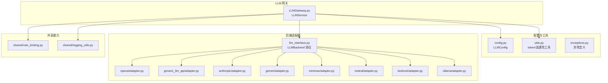
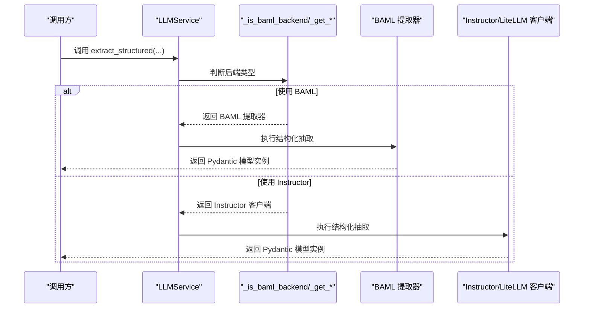
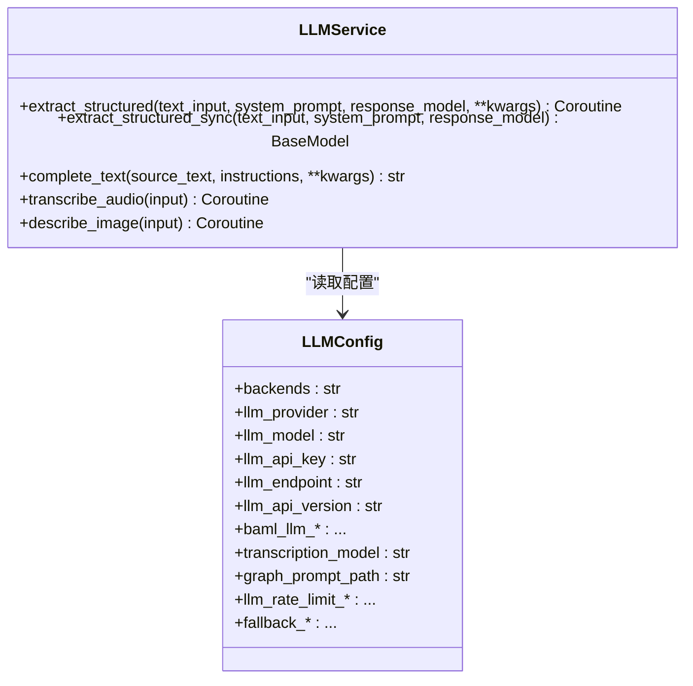
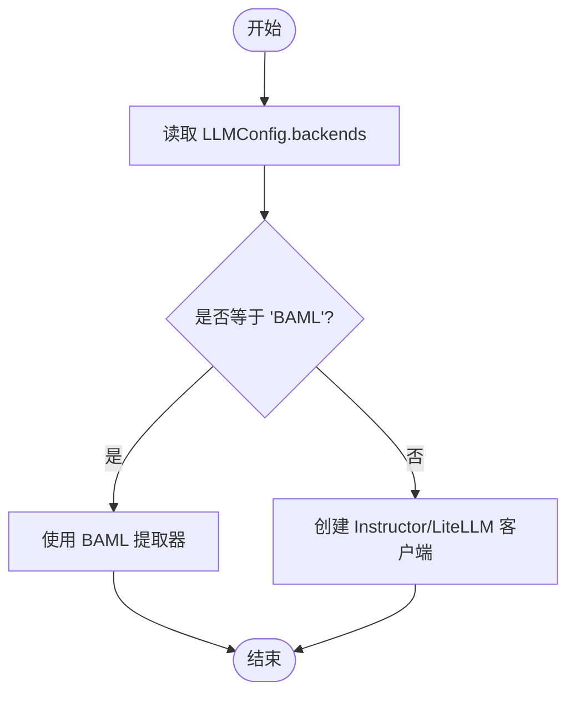
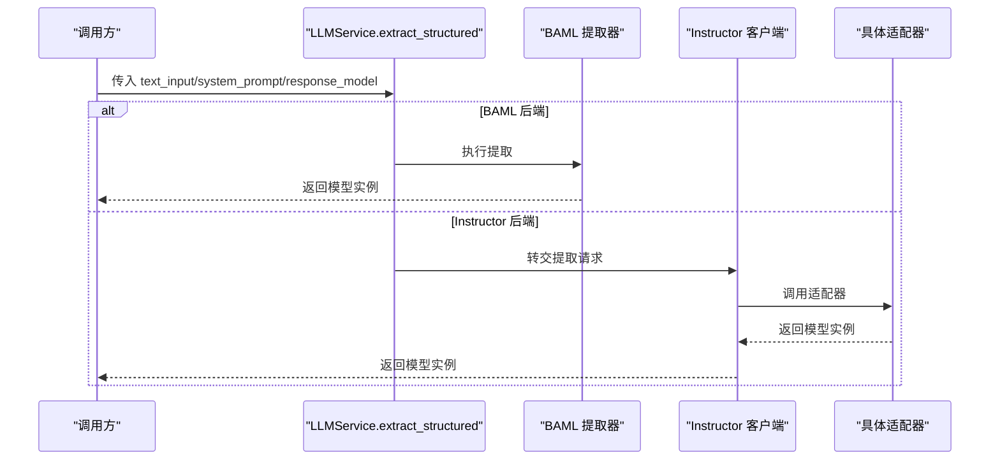
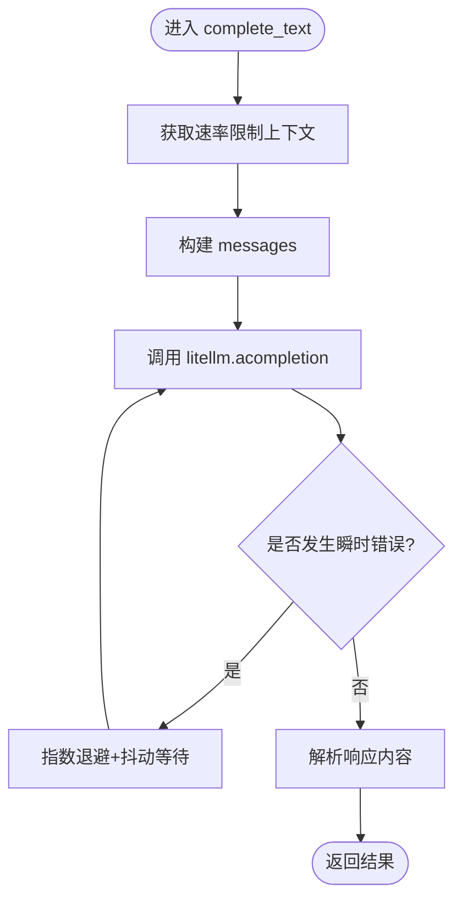
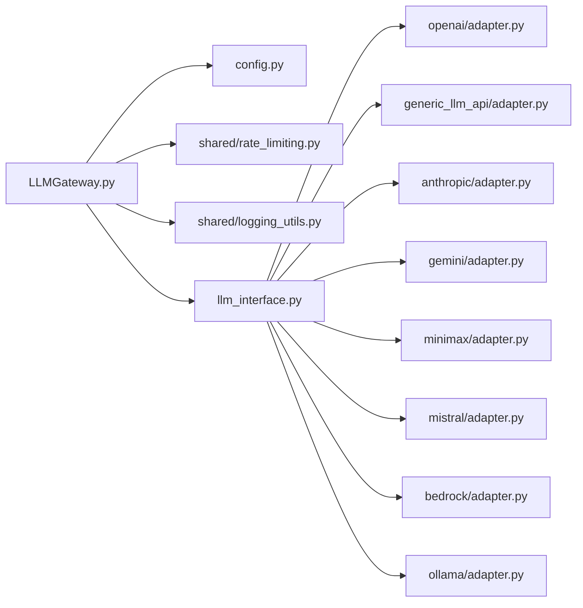

# LLM 网关

<cite>
**本文引用的文件**   
- [LLMGateway.py](file://m_flow/llm/LLMGateway.py)
- [__init__.py](file://m_flow/llm/__init__.py)
- [config.py](file://m_flow/llm/config.py)
- [utils.py](file://m_flow/llm/utils.py)
- [exceptions.py](file://m_flow/llm/exceptions.py)
- [get_llm_client.py](file://m_flow/llm/backends/litellm_instructor/llm/get_llm_client.py)
- [llm_interface.py](file://m_flow/llm/backends/litellm_instructor/llm/llm_interface.py)
- [openai/adapter.py](file://m_flow/llm/backends/litellm_instructor/llm/openai/adapter.py)
- [generic_llm_api/adapter.py](file://m_flow/llm/backends/litellm_instructor/llm/generic_llm_api/adapter.py)
- [anthropic/adapter.py](file://m_flow/llm/backends/litellm_instructor/llm/anthropic/adapter.py)
- [gemini/adapter.py](file://m_flow/llm/backends/litellm_instructor/llm/gemini/adapter.py)
- [minimax/adapter.py](file://m_flow/llm/backends/litellm_instructor/llm/minimax/adapter.py)
- [mistral/adapter.py](file://m_flow/llm/backends/litellm_instructor/llm/mistral/adapter.py)
- [bedrock/adapter.py](file://m_flow/llm/backends/litellm_instructor/llm/bedrock/adapter.py)
- [ollama/adapter.py](file://m_flow/llm/backends/litellm_instructor/llm/ollama/adapter.py)
- [rate_limiting.py](file://m_flow/shared/rate_limiting.py)
- [logging_utils.py](file://m_flow/shared/logging_utils.py)
- [pipeline.py](file://m_flow/pipeline/operations/pipeline.py)
</cite>

## 目录
1. [简介](#简介)
2. [项目结构](#项目结构)
3. [核心组件](#核心组件)
4. [架构总览](#架构总览)
5. [详细组件分析](#详细组件分析)
6. [依赖分析](#依赖分析)
7. [性能考虑](#性能考虑)
8. [故障排查指南](#故障排查指南)
9. [结论](#结论)
10. [附录](#附录)

## 简介
本文件系统性阐述 M-Flow 的 LLM 网关设计与实现，重点覆盖以下方面：
- 统一抽象 LLMService，屏蔽 BAML 与 LiteLLM/Instructor 后端差异
- 结构化抽取、文本补全、音频转录、图像描述等核心能力
- 后端动态切换策略（BAML vs LiteLLM/Instructor）
- 重试机制与指数退避算法
- 并发控制与速率限制集成
- LLM 配置最佳实践与性能优化建议
- 错误处理与故障转移
- 与管道系统的集成模式

## 项目结构
LLM 子系统采用“网关 + 后端适配器”的分层组织：
- 网关层：LLMGateway.py 定义统一入口，负责后端解析与调用
- 配置层：config.py 提供环境变量驱动的配置模型与校验
- 工具层：utils.py 提供令牌预算、连通性探测等辅助能力
- 异常层：exceptions.py 定义 LLM 相关异常类型
- 后端层：backends/litellm_instructor/llm 下按供应商划分适配器
- 共享层：shared/rate_limiting.py、shared/logging_utils.py 提供速率限制与日志

图表来源
- [LLMGateway.py:1-168](file://m_flow/llm/LLMGateway.py#L1-L168)
- [config.py:1-209](file://m_flow/llm/config.py#L1-L209)
- [utils.py:1-126](file://m_flow/llm/utils.py#L1-L126)
- [llm_interface.py](file://m_flow/llm/backends/litellm_instructor/llm/llm_interface.py)
- [openai/adapter.py](file://m_flow/llm/backends/litellm_instructor/llm/openai/adapter.py)
- [generic_llm_api/adapter.py](file://m_flow/llm/backends/litellm_instructor/llm/generic_llm_api/adapter.py)
- [anthropic/adapter.py](file://m_flow/llm/backends/litellm_instructor/llm/anthropic/adapter.py)
- [gemini/adapter.py](file://m_flow/llm/backends/litellm_instructor/llm/gemini/adapter.py)
- [minimax/adapter.py](file://m_flow/llm/backends/litellm_instructor/llm/minimax/adapter.py)
- [mistral/adapter.py](file://m_flow/llm/backends/litellm_instructor/llm/mistral/adapter.py)
- [bedrock/adapter.py](file://m_flow/llm/backends/litellm_instructor/llm/bedrock/adapter.py)
- [ollama/adapter.py](file://m_flow/llm/backends/litellm_instructor/llm/ollama/adapter.py)
- [rate_limiting.py](file://m_flow/shared/rate_limiting.py)
- [logging_utils.py](file://m_flow/shared/logging_utils.py)

章节来源
- [LLMGateway.py:1-168](file://m_flow/llm/LLMGateway.py#L1-L168)
- [config.py:1-209](file://m_flow/llm/config.py#L1-L209)
- [utils.py:1-126](file://m_flow/llm/utils.py#L1-L126)

## 核心组件
- LLMService：静态方法的统一入口，封装结构化抽取、同步结构化抽取、文本补全、音频转录、图像描述等调用；在运行时根据配置动态选择后端
- LLMConfig：集中式配置模型，支持主 LLM、BAML、音频模型、提示模板路径、速率限制、回退配置等
- 后端适配器：以 LLMBackend 协议为契约，面向不同供应商（OpenAI、Anthropic、Gemini、Minimax、Mistral、Bedrock、Ollama）与通用 API 适配器
- 工具函数：最大分块令牌数计算、连通性探测、模型令牌上限查询
- 异常体系：内容政策过滤、API 密钥缺失、不支持的提供商、系统提示路径缺失等

章节来源
- [LLMGateway.py:60-168](file://m_flow/llm/LLMGateway.py#L60-L168)
- [config.py:38-209](file://m_flow/llm/config.py#L38-L209)
- [utils.py:27-126](file://m_flow/llm/utils.py#L27-L126)
- [exceptions.py:12-65](file://m_flow/llm/exceptions.py#L12-L65)

## 架构总览
LLM 网关通过“懒加载 + 运行时解析”在调用点决定后端：
- 当配置的 backends 为 BAML 时，使用 BAML 提取器
- 否则使用 Instructor/LiteLLM 客户端，该客户端由工厂函数按配置动态创建

图表来源
- [LLMGateway.py:60-100](file://m_flow/llm/LLMGateway.py#L60-L100)
- [config.py:46-47](file://m_flow/llm/config.py#L46-L47)

## 详细组件分析

### LLMService 设计与职责
- 统一入口：所有 LLM 调用经由 LLMService 的静态方法，隐藏后端差异
- 功能覆盖：
  - 结构化抽取（异步/同步）
  - 文本补全（带指数退避重试）
  - 音频转录
  - 图像描述
- 后端解析：
  - 基于配置 backends 字段判断
  - BAML 模式下直接调用 BAML 提取器
  - 非 BAML 模式下通过工厂创建 Instructor/LiteLLM 客户端

图表来源
- [LLMGateway.py:60-168](file://m_flow/llm/LLMGateway.py#L60-L168)
- [config.py:38-92](file://m_flow/llm/config.py#L38-L92)

章节来源
- [LLMGateway.py:60-168](file://m_flow/llm/LLMGateway.py#L60-L168)

### 后端切换机制与动态选择策略
- 切换依据：配置项 backends（默认 "instructor"），当其值为 "BAML" 时启用 BAML 提取器
- BAML 初始化：当 backends 为 "BAML" 且安装可用时，初始化 ClientRegistry 并注册 LLM 客户端
- 非 BAML：通过工厂函数 create_llm_backend 创建适配器实例，适配器遵循 LLMBackend 协议

图表来源
- [LLMGateway.py:35-53](file://m_flow/llm/LLMGateway.py#L35-L53)
- [config.py:46-47](file://m_flow/llm/config.py#L46-L47)
- [config.py:129-151](file://m_flow/llm/config.py#L129-L151)

章节来源
- [LLMGateway.py:35-53](file://m_flow/llm/LLMGateway.py#L35-L53)
- [config.py:46-47](file://m_flow/llm/config.py#L46-L47)
- [config.py:129-151](file://m_flow/llm/config.py#L129-L151)

### 结构化抽取实现
- 异步结构化抽取：extract_structured 将输入文本与系统提示合并，调用后端提取器，返回 Pydantic 模型实例的协程
- 同步结构化抽取：extract_structured_sync 仅对 Instructor 客户端开放
- 后端适配器：各供应商适配器均实现相同接口，确保调用一致性

图表来源
- [LLMGateway.py:68-100](file://m_flow/llm/LLMGateway.py#L68-L100)

章节来源
- [LLMGateway.py:68-100](file://m_flow/llm/LLMGateway.py#L68-L100)

### 文本补全与重试机制
- 文本补全：complete_text 通过 litellm.acompletion 发起补全请求
- 重试策略：基于 tenacity 的指数退避与抖动，最大重试时长受限，针对特定异常类型不重试
- 速率限制：在请求上下文中集成共享速率限制器

图表来源
- [LLMGateway.py:113-167](file://m_flow/llm/LLMGateway.py#L113-L167)
- [rate_limiting.py](file://m_flow/shared/rate_limiting.py)

章节来源
- [LLMGateway.py:113-167](file://m_flow/llm/LLMGateway.py#L113-L167)

### 音频转录与图像描述
- 音频转录：transcribe_audio 通过 Instructor 客户端执行
- 图像描述：describe_image 通过 Instructor 客户端执行
- 两者均走统一的 Instructor/LiteLLM 客户端路径

章节来源
- [LLMGateway.py:103-110](file://m_flow/llm/LLMGateway.py#L103-L110)

### 令牌预算与连通性探测
- 最大分块令牌数：结合嵌入模型上限与 LLM 上下文窗口的一半，取较小值作为安全上限
- 模型令牌上限查询：从 LiteLLM 内置 registry 查询模型的最大令牌数
- 连通性探测：结构化抽取连通性探测与嵌入连通性探测，用于启动前健康检查

章节来源
- [utils.py:27-83](file://m_flow/llm/utils.py#L27-L83)
- [utils.py:90-126](file://m_flow/llm/utils.py#L90-L126)

### 后端适配器与协议
- LLMBackend 协议：定义统一的 extract_structured 接口，确保各供应商适配器可互换
- 适配器族谱：OpenAI、通用 API、Anthropic、Gemini、Minimax、Mistral、Bedrock、Ollama 等
- 通用 API 适配器：支持自定义供应商 Endpoint 与模型，便于快速接入新提供商

章节来源
- [llm_interface.py](file://m_flow/llm/backends/litellm_instructor/llm/llm_interface.py)
- [openai/adapter.py](file://m_flow/llm/backends/litellm_instructor/llm/openai/adapter.py)
- [generic_llm_api/adapter.py](file://m_flow/llm/backends/litellm_instructor/llm/generic_llm_api/adapter.py)
- [anthropic/adapter.py](file://m_flow/llm/backends/litellm_instructor/llm/anthropic/adapter.py)
- [gemini/adapter.py](file://m_flow/llm/backends/litellm_instructor/llm/gemini/adapter.py)
- [minimax/adapter.py](file://m_flow/llm/backends/litellm_instructor/llm/minimax/adapter.py)
- [mistral/adapter.py](file://m_flow/llm/backends/litellm_instructor/llm/mistral/adapter.py)
- [bedrock/adapter.py](file://m_flow/llm/backends/litellm_instructor/llm/bedrock/adapter.py)
- [ollama/adapter.py](file://m_flow/llm/backends/litellm_instructor/llm/ollama/adapter.py)

### 与管道系统的集成模式
- 管道层：pipeline/operations/pipeline.py 中的执行流程可调用 LLMService
- 并发与速率限制：在 LLMService.complete_text 中已集成共享速率限制上下文管理器
- 日志与可观测性：通过 shared/logging_utils 获取日志器，便于追踪与审计

章节来源
- [pipeline.py](file://m_flow/pipeline/operations/pipeline.py)
- [logging_utils.py](file://m_flow/shared/logging_utils.py)

## 依赖分析
- 组件耦合
  - LLMService 对配置模块与共享速率限制有直接依赖
  - 后端适配器通过 LLMBackend 协议解耦，降低耦合度
- 外部依赖
  - litellm：统一模型调用与路由
  - instructor：结构化输出约束与重试
  - tenacity：重试与指数退避
  - pydantic：结构化输出模型验证

图表来源
- [LLMGateway.py:14-22](file://m_flow/llm/LLMGateway.py#L14-L22)
- [config.py:15-18](file://m_flow/llm/config.py#L15-L18)
- [llm_interface.py](file://m_flow/llm/backends/litellm_instructor/llm/llm_interface.py)

章节来源
- [LLMGateway.py:14-22](file://m_flow/llm/LLMGateway.py#L14-L22)
- [config.py:15-18](file://m_flow/llm/config.py#L15-L18)

## 性能考虑
- 令牌预算
  - 使用 get_max_chunk_tokens 在嵌入与 LLM 之间建立平衡，避免超限
  - 可通过 get_model_max_completion_tokens 查询模型上限，作为兜底策略
- 速率限制
  - 通过共享速率限制上下文管理器在网关层统一控制并发与频率
- 重试与退避
  - 指数退避+抖动减少雪崩效应，设置最大重试时长避免无限等待
- 模型选择
  - 针对知识图谱注入等任务推荐低温度与高上下文模型
- 缓存与预热
  - 建议在启动阶段进行连通性探测，提前暴露配置问题

章节来源
- [utils.py:27-83](file://m_flow/llm/utils.py#L27-L83)
- [LLMGateway.py:113-167](file://m_flow/llm/LLMGateway.py#L113-L167)
- [config.py:57-59](file://m_flow/llm/config.py#L57-L59)

## 故障排查指南
- 内容政策过滤
  - 触发条件：供应商返回内容策略违规相关错误
  - 处理建议：调整提示词或内容，必要时切换供应商
- API 密钥缺失
  - 触发条件：配置中缺少必需的 API Key
  - 处理建议：检查环境变量与 .env 文件，确认密钥有效
- 不支持的提供商
  - 触发条件：配置的提供商不在支持列表
  - 处理建议：更换为受支持的提供商或使用通用 API 适配器
- 系统提示路径缺失
  - 触发条件：需要系统提示但未指定路径
  - 处理建议：提供有效的提示模板路径
- 连通性探测失败
  - 使用 test_llm_connection 与 test_embedding_connection 快速定位网络、认证或速率限制问题

章节来源
- [exceptions.py:12-65](file://m_flow/llm/exceptions.py#L12-L65)
- [utils.py:90-126](file://m_flow/llm/utils.py#L90-L126)

## 结论
LLM 网关通过清晰的抽象与协议化适配器，实现了对多提供商的统一管理，并在网关层内置了重试、速率限制与日志等横切能力。配合配置模型与工具函数，能够高效支撑结构化抽取、文本补全、音频转录与图像描述等核心场景，并与管道系统无缝集成。

## 附录
- 配置要点
  - backends：选择 "BAML" 或 "instructor"
  - llm_provider/model/key/endpoint/version：主 LLM 配置
  - baml_llm_*：BAML 模式下的替代配置
  - llm_rate_limit_*：开启并配置速率限制
  - fallback_*：备用密钥/端点/模型
- 最佳实践
  - 在生产环境启用速率限制与重试
  - 使用连通性探测在部署阶段发现配置问题
  - 针对不同任务选择合适的模型与温度
  - 优先使用结构化输出以提升稳定性