# LLM 集成

<cite>
**本文引用的文件**
- [LLMGateway.py](file://m_flow/llm/LLMGateway.py)
- [config.py](file://m_flow/llm/config.py)
- [utils.py](file://m_flow/llm/utils.py)
- [tokenizer/__init__.py](file://m_flow/llm/tokenizer/__init__.py)
- [tokenizer/tokenizer_interface.py](file://m_flow/llm/tokenizer/tokenizer_interface.py)
- [litellm_instructor/get_llm_client.py](file://m_flow/llm/backends/litellm_instructor/llm/get_llm_client.py)
- [rate_limiting.py](file://m_flow/shared/rate_limiting.py)
- [llm_concurrency.py](file://m_flow/shared/llm_concurrency.py)
- [prompts/render_prompt.py](file://m_flow/llm/prompts/render_prompt.py)
- [prompts/read_query_prompt.py](file://m_flow/llm/prompts/read_query_prompt.py)
- [save_llm_config.py](file://m_flow/config/settings/save_llm_config.py)
</cite>

## 目录
1. [简介](#简介)
2. [项目结构](#项目结构)
3. [核心组件](#核心组件)
4. [架构总览](#架构总览)
5. [详细组件分析](#详细组件分析)
6. [依赖分析](#依赖分析)
7. [性能考虑](#性能考虑)
8. [故障排查指南](#故障排查指南)
9. [结论](#结论)
10. [附录](#附录)

## 简介
本文件面向 M-flow 的 LLM 集成，系统性阐述以下主题：
- LLM 网关设计与实现：统一接入多种 LLM 提供商（OpenAI、Anthropic、Gemini、Mistral、Bedrock、Ollama、自定义等），支持结构化抽取、纯文本补全、音频转写与图像描述。
- 提示词管理：基于 Jinja2 的模板渲染与文件读取，支持参数化与版本化提示词。
- 令牌化器：抽象接口与多后端实现（如 tiktoken、SentencePiece 等），统一编码/解码能力。
- 模型路由策略：通过配置驱动的后端选择、可选的回退配置与连接探测。
- 成本控制：令牌上限估算、连接性探测、速率限制与并发控制。
- 最佳实践：模型选择、参数调优、监控与运维建议。
- 自定义提供商集成：适配器工厂模式与扩展点。
- 并发与限流：全局信号量与异步限流器。
- 性能优化与排障：令牌预算、上下文窗口、重试与日志。

## 项目结构
围绕 LLM 的关键目录与文件如下：
- LLM 网关与配置：m_flow/llm/LLMGateway.py、m_flow/llm/config.py、m_flow/llm/utils.py
- 后端适配器工厂：m_flow/llm/backends/litellm_instructor/llm/get_llm_client.py
- 令牌化器：m_flow/llm/tokenizer/{__init__.py, tokenizer_interface.py}
- 提示词：m_flow/llm/prompts/{render_prompt.py, read_query_prompt.py}
- 全局限流与并发：m_flow/shared/rate_limiting.py、m_flow/shared/llm_concurrency.py
- 运行时配置持久化：m_flow/config/settings/save_llm_config.py

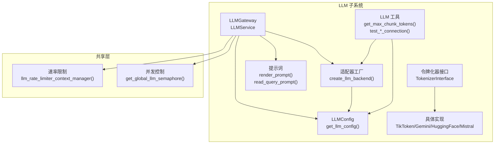

图表来源
- [LLMGateway.py:1-168](file://m_flow/llm/LLMGateway.py#L1-L168)
- [config.py:1-209](file://m_flow/llm/config.py#L1-L209)
- [utils.py:1-126](file://m_flow/llm/utils.py#L1-L126)
- [tokenizer/__init__.py:1-23](file://m_flow/llm/tokenizer/__init__.py#L1-L23)
- [tokenizer/tokenizer_interface.py:1-87](file://m_flow/llm/tokenizer/tokenizer_interface.py#L1-L87)
- [litellm_instructor/get_llm_client.py:1-166](file://m_flow/llm/backends/litellm_instructor/llm/get_llm_client.py#L1-L166)
- [rate_limiting.py:1-59](file://m_flow/shared/rate_limiting.py#L1-L59)
- [llm_concurrency.py:1-46](file://m_flow/shared/llm_concurrency.py#L1-L46)
- [prompts/render_prompt.py:1-41](file://m_flow/llm/prompts/render_prompt.py#L1-L41)
- [prompts/read_query_prompt.py:1-44](file://m_flow/llm/prompts/read_query_prompt.py#L1-L44)

章节来源
- [LLMGateway.py:1-168](file://m_flow/llm/LLMGateway.py#L1-L168)
- [config.py:1-209](file://m_flow/llm/config.py#L1-L209)
- [utils.py:1-126](file://m_flow/llm/utils.py#L1-L126)
- [tokenizer/__init__.py:1-23](file://m_flow/llm/tokenizer/__init__.py#L1-L23)
- [tokenizer/tokenizer_interface.py:1-87](file://m_flow/llm/tokenizer/tokenizer_interface.py#L1-L87)
- [litellm_instructor/get_llm_client.py:1-166](file://m_flow/llm/backends/litellm_instructor/llm/get_llm_client.py#L1-L166)
- [rate_limiting.py:1-59](file://m_flow/shared/rate_limiting.py#L1-L59)
- [llm_concurrency.py:1-46](file://m_flow/shared/llm_concurrency.py#L1-L46)
- [prompts/render_prompt.py:1-41](file://m_flow/llm/prompts/render_prompt.py#L1-L41)
- [prompts/read_query_prompt.py:1-44](file://m_flow/llm/prompts/read_query_prompt.py#L1-L44)

## 核心组件
- LLM 网关（LLMService）：统一入口，支持结构化抽取、纯文本补全、音频转写、图像描述；内置指数退避重试与速率限制。
- 配置中心（LLMConfig）：集中管理提供商、模型、端点、密钥、温度、流式输出、最大补全令牌数、速率限制、回退配置、BAML 注册表等。
- 适配器工厂（create_llm_backend）：根据配置动态选择后端（OpenAI、Anthropic、Gemini、Mistral、Bedrock、Ollama、自定义等），并注入 Instructor 模式与回退参数。
- 令牌化器接口：定义统一的分词、计数与反向映射协议，便于替换不同后端。
- 提示词系统：文件读取与 Jinja2 渲染，支持参数化与版本化提示词。
- 速率限制与并发控制：异步限流器与全局信号量，分别用于请求频率与并发度控制。
- 工具函数：令牌预算推导、连接性探测（LLM 与向量引擎）。

章节来源
- [LLMGateway.py:60-168](file://m_flow/llm/LLMGateway.py#L60-L168)
- [config.py:38-209](file://m_flow/llm/config.py#L38-L209)
- [litellm_instructor/get_llm_client.py:27-166](file://m_flow/llm/backends/litellm_instructor/llm/get_llm_client.py#L27-L166)
- [tokenizer/tokenizer_interface.py:21-87](file://m_flow/llm/tokenizer/tokenizer_interface.py#L21-L87)
- [prompts/render_prompt.py:16-41](file://m_flow/llm/prompts/render_prompt.py#L16-L41)
- [prompts/read_query_prompt.py:18-44](file://m_flow/llm/prompts/read_query_prompt.py#L18-L44)
- [rate_limiting.py:21-59](file://m_flow/shared/rate_limiting.py#L21-L59)
- [llm_concurrency.py:15-46](file://m_flow/shared/llm_concurrency.py#L15-L46)
- [utils.py:27-126](file://m_flow/llm/utils.py#L27-L126)

## 架构总览
下图展示 LLM 调用从应用到网关、再到适配器与外部服务的整体流程，并标注关键控制点（速率限制、并发、重试）。

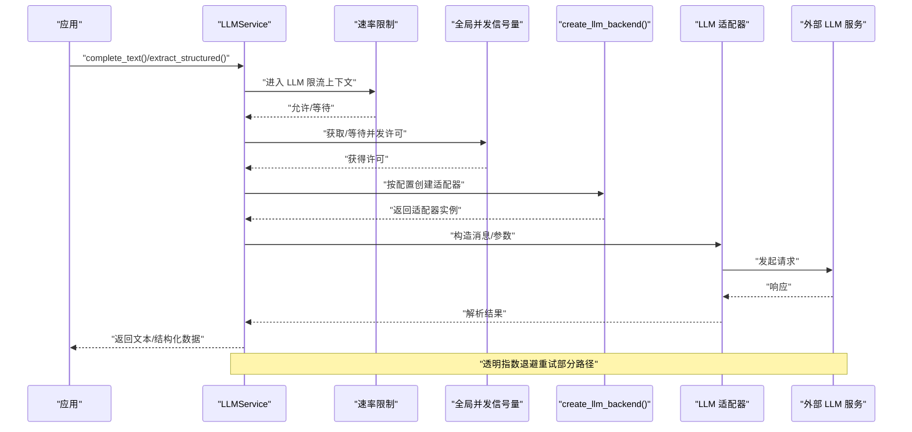

图表来源
- [LLMGateway.py:113-168](file://m_flow/llm/LLMGateway.py#L113-L168)
- [rate_limiting.py:51-59](file://m_flow/shared/rate_limiting.py#L51-L59)
- [llm_concurrency.py:15-29](file://m_flow/shared/llm_concurrency.py#L15-L29)
- [litellm_instructor/get_llm_client.py:27-166](file://m_flow/llm/backends/litellm_instructor/llm/get_llm_client.py#L27-L166)

## 详细组件分析

### LLM 网关与服务
- 统一入口：提供结构化抽取、同步/异步文本补全、音频转写、图像描述等方法。
- 后端选择：根据配置决定使用 BAML 或 Instructor/LiteLLM 客户端。
- 重试策略：对特定异常类型进行指数退避重试，避免瞬时错误导致失败。
- 速率限制：在每次调用前进入异步限流上下文，受配置开关与参数控制。
- 日志记录：记录请求/响应的关键指标，便于审计与排障。

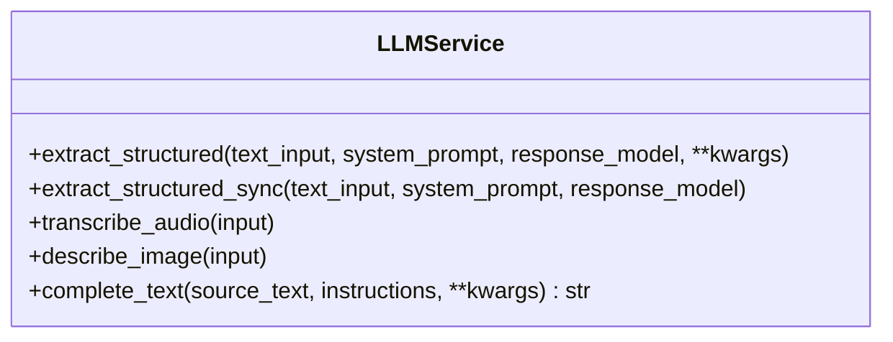

图表来源
- [LLMGateway.py:60-168](file://m_flow/llm/LLMGateway.py#L60-L168)

章节来源
- [LLMGateway.py:60-168](file://m_flow/llm/LLMGateway.py#L60-L168)

### 配置中心（LLMConfig）
- 字段覆盖：提供商、模型、端点、密钥、版本、温度、流式输出、最大补全令牌数。
- 结构化输出：后端选择（instructor/BAML）、Instructor 模式。
- 速率限制：LLM 与嵌入独立开关与配额。
- 回退配置：备用密钥、端点、模型。
- BAML 注册表：当启用 BAML 时，动态注册并设置主客户端。
- 环境校验：自动去除引号、Ollama 环境变量组一致性检查。
- 单例访问：LRU 缓存的配置获取函数。

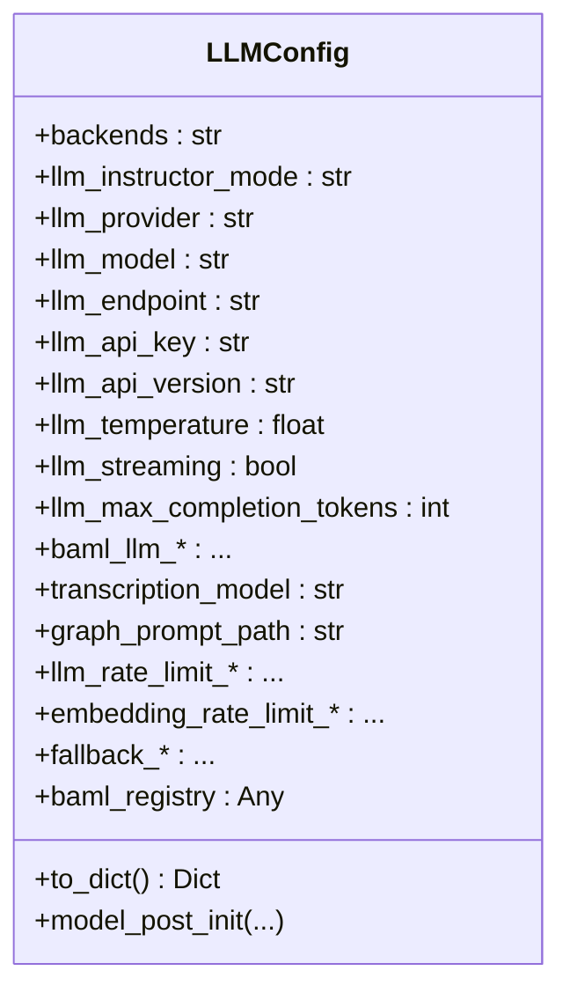

图表来源
- [config.py:38-209](file://m_flow/llm/config.py#L38-L209)

章节来源
- [config.py:38-209](file://m_flow/llm/config.py#L38-L209)

### 适配器工厂与模型路由
- 支持提供商：OpenAI、Ollama、Anthropic、自定义、Gemini、Mistral、Bedrock、Minimax。
- 参数注入：模型名、最大补全令牌、Instructor 模式、流式输出、回退配置、端点/密钥/版本等。
- 异常处理：缺失 API Key 与未知提供商的错误类型化抛出。
- 动态选择：依据配置字段即时创建对应适配器实例。

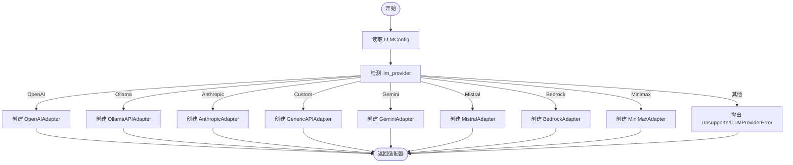

图表来源
- [litellm_instructor/get_llm_client.py:27-166](file://m_flow/llm/backends/litellm_instructor/llm/get_llm_client.py#L27-L166)

章节来源
- [litellm_instructor/get_llm_client.py:27-166](file://m_flow/llm/backends/litellm_instructor/llm/get_llm_client.py#L27-L166)

### 令牌化器抽象与实现
- 接口契约：分词、计数、单 token 解码三项能力，采用结构化协议以支持结构子类型。
- 导出清单：统一从模块入口导出各后端实现与接口，便于上层按需导入。
- 应用场景：为提示词拼接、上下文裁剪、令牌预算计算提供基础能力。

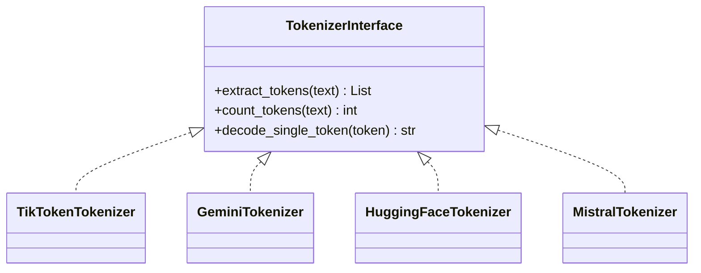

图表来源
- [tokenizer/tokenizer_interface.py:21-87](file://m_flow/llm/tokenizer/tokenizer_interface.py#L21-L87)
- [tokenizer/__init__.py:10-22](file://m_flow/llm/tokenizer/__init__.py#L10-L22)

章节来源
- [tokenizer/tokenizer_interface.py:21-87](file://m_flow/llm/tokenizer/tokenizer_interface.py#L21-L87)
- [tokenizer/__init__.py:10-22](file://m_flow/llm/tokenizer/__init__.py#L10-L22)

### 提示词管理系统
- 文件读取：从默认或指定目录读取提示词文件内容，带错误处理与日志。
- 模板渲染：使用 Jinja2 环境加载模板，传入上下文变量进行渲染。
- 版本化与参数化：通过文件命名与上下文字典实现版本与参数化，便于迭代与复用。

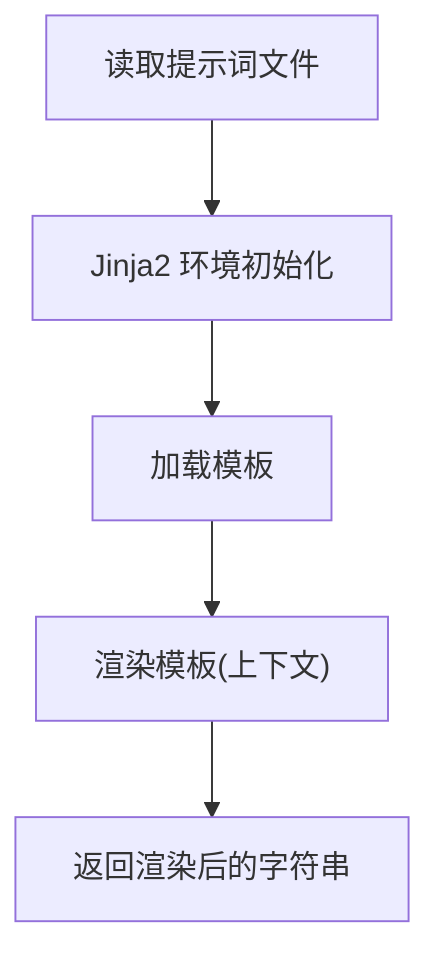

图表来源
- [prompts/read_query_prompt.py:18-44](file://m_flow/llm/prompts/read_query_prompt.py#L18-L44)
- [prompts/render_prompt.py:16-41](file://m_flow/llm/prompts/render_prompt.py#L16-L41)

章节来源
- [prompts/read_query_prompt.py:18-44](file://m_flow/llm/prompts/read_query_prompt.py#L18-L44)
- [prompts/render_prompt.py:16-41](file://m_flow/llm/prompts/render_prompt.py#L16-L41)

### 令牌预算与连接性探测
- 令牌预算：取“嵌入模型最大补全令牌”与“LLM 上下文一半”的较小值，确保分块安全。
- 模型令牌上限：查询 LiteLLM 内置模型成本表，未知模型回退至配置值。
- 连接性探测：结构化抽取连通测试与嵌入引擎单字向量化测试，失败即记录并抛出。

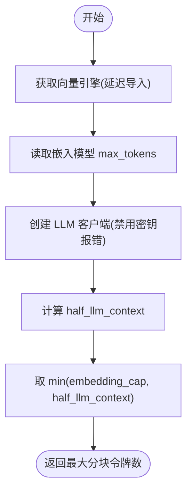

图表来源
- [utils.py:27-82](file://m_flow/llm/utils.py#L27-L82)

章节来源
- [utils.py:27-126](file://m_flow/llm/utils.py#L27-L126)

### 速率限制与并发控制
- 速率限制：基于异步限流器，按配置开关与配额控制 LLM/嵌入请求频率。
- 并发控制：全局信号量统一限制并发 LLM 调用数量，受环境变量控制。
- 使用方式：网关在每次调用前进入限流上下文，并竞争信号量。

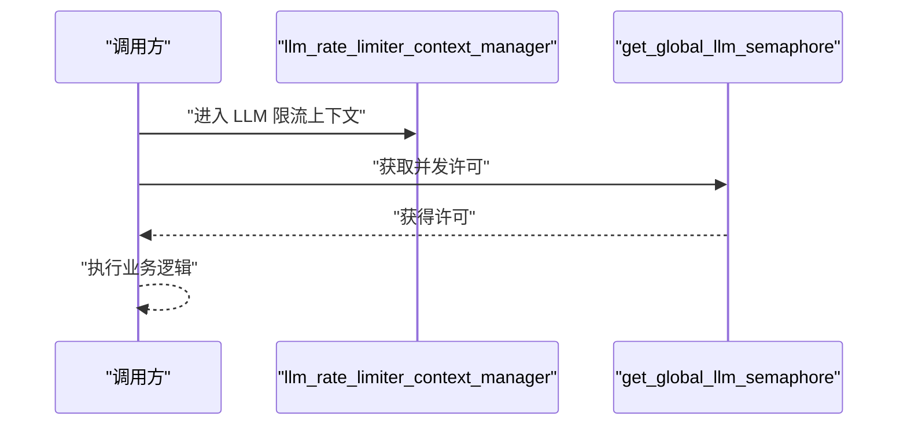

图表来源
- [rate_limiting.py:51-59](file://m_flow/shared/rate_limiting.py#L51-L59)
- [llm_concurrency.py:15-29](file://m_flow/shared/llm_concurrency.py#L15-L29)
- [LLMGateway.py:143-143](file://m_flow/llm/LLMGateway.py#L143-L143)

章节来源
- [rate_limiting.py:21-59](file://m_flow/shared/rate_limiting.py#L21-L59)
- [llm_concurrency.py:15-46](file://m_flow/shared/llm_concurrency.py#L15-L46)
- [LLMGateway.py:143-143](file://m_flow/llm/LLMGateway.py#L143-L143)

### 运行时配置持久化
- 数据传输对象：封装 provider/model/api_key 更新请求。
- 写入策略：仅在提供真实非掩码密钥时更新；持久化到 .env 文件，失败不中断内存配置。

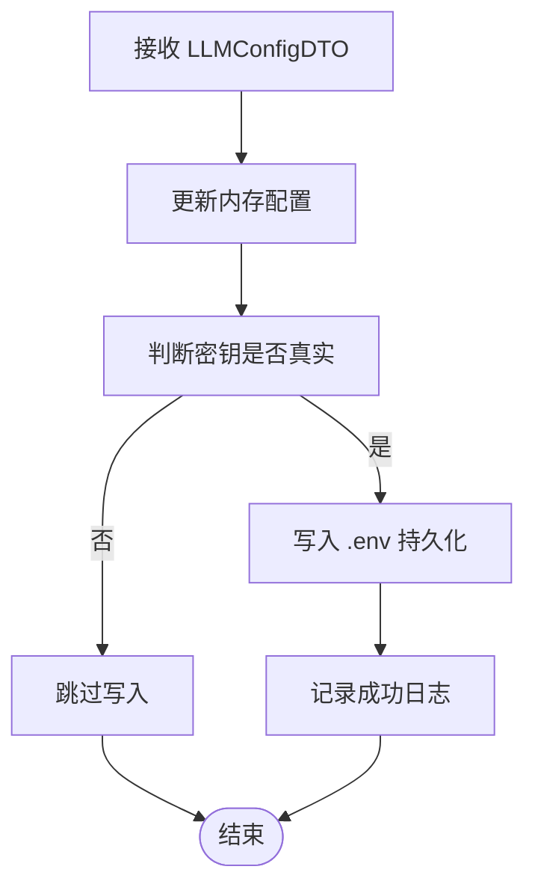

图表来源
- [save_llm_config.py:30-68](file://m_flow/config/settings/save_llm_config.py#L30-L68)

章节来源
- [save_llm_config.py:30-68](file://m_flow/config/settings/save_llm_config.py#L30-L68)

## 依赖分析
- LLM 网关依赖配置中心与共享限流/并发模块，调用适配器工厂创建具体适配器。
- 适配器工厂依赖配置中心与模型令牌上限工具，按提供商分支创建实例。
- 令牌化器模块通过统一入口导出接口与实现，供上层按需使用。
- 提示词模块依赖根路径解析与 Jinja2 环境。
- 工具模块延迟导入向量引擎，避免循环依赖。

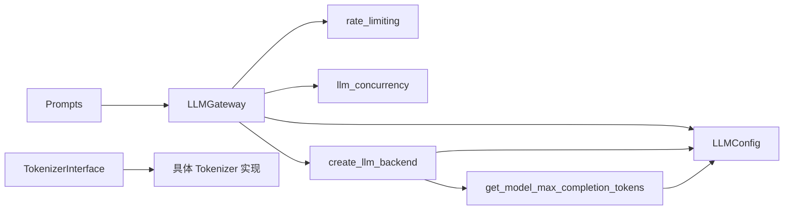

图表来源
- [LLMGateway.py:136-164](file://m_flow/llm/LLMGateway.py#L136-L164)
- [litellm_instructor/get_llm_client.py:49-57](file://m_flow/llm/backends/litellm_instructor/llm/get_llm_client.py#L49-L57)
- [utils.py:46-54](file://m_flow/llm/utils.py#L46-L54)
- [tokenizer/__init__.py:10-22](file://m_flow/llm/tokenizer/__init__.py#L10-L22)
- [prompts/render_prompt.py:32-40](file://m_flow/llm/prompts/render_prompt.py#L32-L40)

章节来源
- [LLMGateway.py:136-164](file://m_flow/llm/LLMGateway.py#L136-L164)
- [litellm_instructor/get_llm_client.py:49-57](file://m_flow/llm/backends/litellm_instructor/llm/get_llm_client.py#L49-L57)
- [utils.py:46-54](file://m_flow/llm/utils.py#L46-L54)
- [tokenizer/__init__.py:10-22](file://m_flow/llm/tokenizer/__init__.py#L10-L22)
- [prompts/render_prompt.py:32-40](file://m_flow/llm/prompts/render_prompt.py#L32-L40)

## 性能考虑
- 令牌预算：优先使用已知模型上限，否则回退配置值；分块大小不超过半上下文窗口，预留生成空间。
- 上下文窗口：通过 LiteLLM 模型成本表查询，未知模型采用保守估计。
- 重试与退避：对瞬时错误进行指数退避重试，降低抖动影响。
- 速率限制：按请求/秒配额限制，避免触发外部限流。
- 并发控制：统一信号量限制全局并发，避免资源争抢。
- 流式输出：在满足需求的前提下开启流式以改善延迟体验。
- 模型选择：根据任务类型与成本目标选择合适模型，结合温度与最大补全令牌数调参。

## 故障排查指南
- 连接性问题
  - 使用 LLM 连通性探测与嵌入连通性探测定位网络、鉴权与速率限制问题。
  - 关注日志中的请求/响应长度与模型标识，辅助定位异常。
- API Key 与提供商
  - 若缺少必要密钥，适配器工厂会抛出相应异常；确认环境变量与配置项。
  - 对于未知提供商，检查配置字段与枚举值。
- 令牌预算与分块
  - 当出现截断或上下文不足，检查令牌预算计算与分块策略。
- 限流与并发
  - 若出现频繁等待，适当提高速率限制配额或并发上限；同时关注外部服务配额。
- BAML 集成
  - 选择 BAML 时需安装相应依赖；确认注册表初始化与主客户端设置。

章节来源
- [utils.py:90-126](file://m_flow/llm/utils.py#L90-L126)
- [litellm_instructor/get_llm_client.py:59-61](file://m_flow/llm/backends/litellm_instructor/llm/get_llm_client.py#L59-L61)
- [LLMGateway.py:113-125](file://m_flow/llm/LLMGateway.py#L113-L125)

## 结论
M-flow 的 LLM 集成通过“网关 + 配置 + 工厂 + 抽象接口”的分层设计，实现了对多提供商的统一接入与灵活切换。配合令牌预算、速率限制、并发控制与提示词系统，能够在保证稳定性的同时兼顾性能与成本控制。建议在生产环境中结合监控与日志持续优化模型与参数，并通过回退配置与连通性探测提升可用性。

## 附录
- 最佳实践清单
  - 明确任务类型与成本目标，选择合适模型与参数。
  - 启用速率限制与并发控制，避免外部限流与资源耗尽。
  - 使用令牌预算与分块策略，确保上下文完整与性能稳定。
  - 建立连通性探测与告警，快速发现并定位问题。
  - 通过提示词模板与参数化实现版本化管理与复用。
  - 在需要时启用 BAML 注册表，统一结构化抽取与推理。