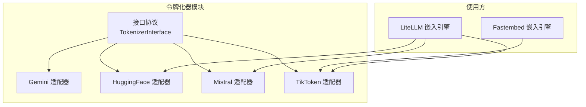
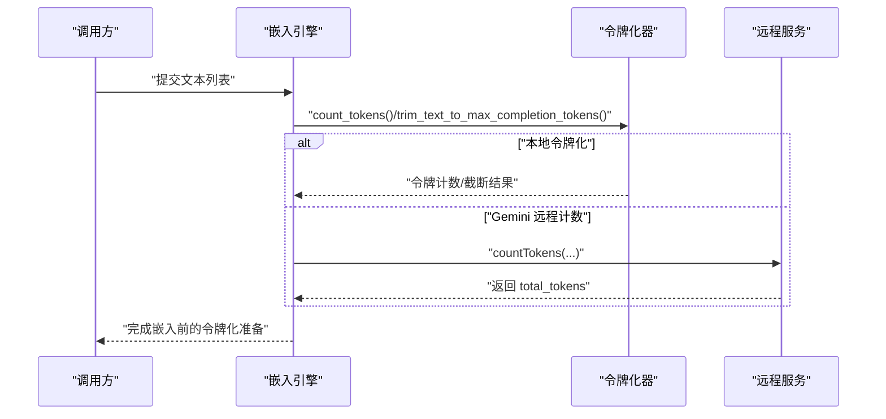
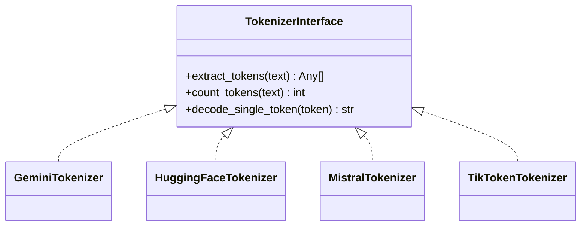
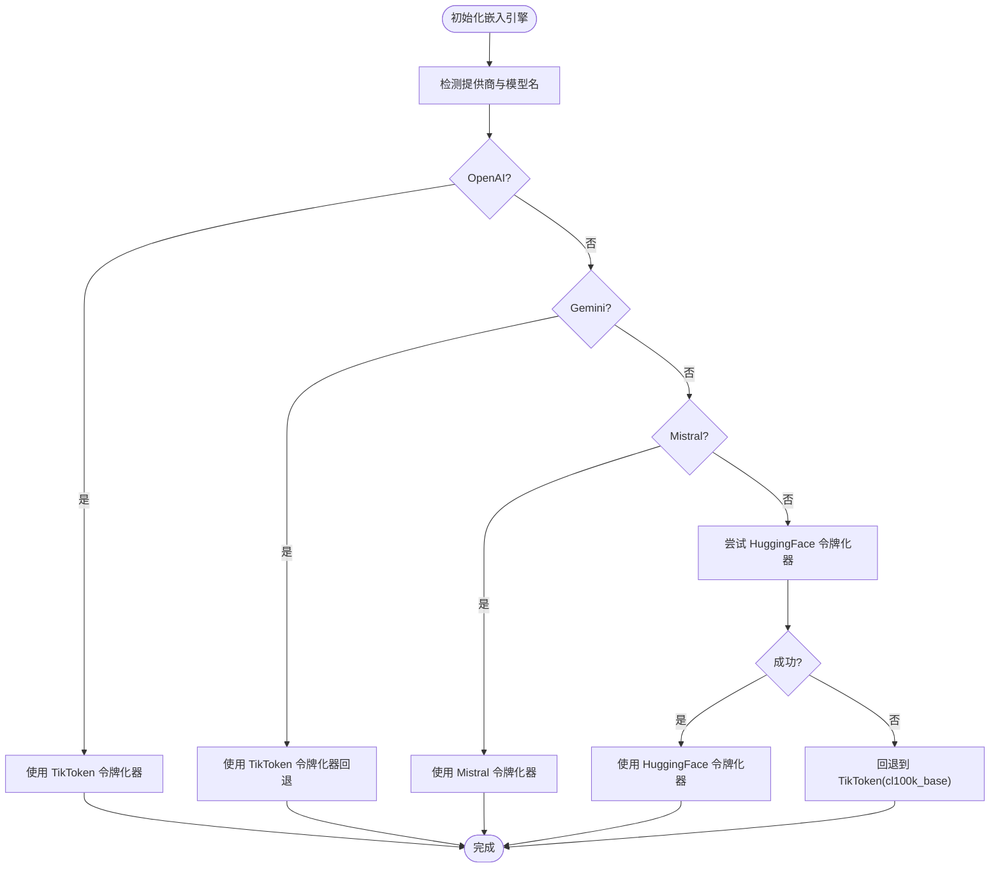
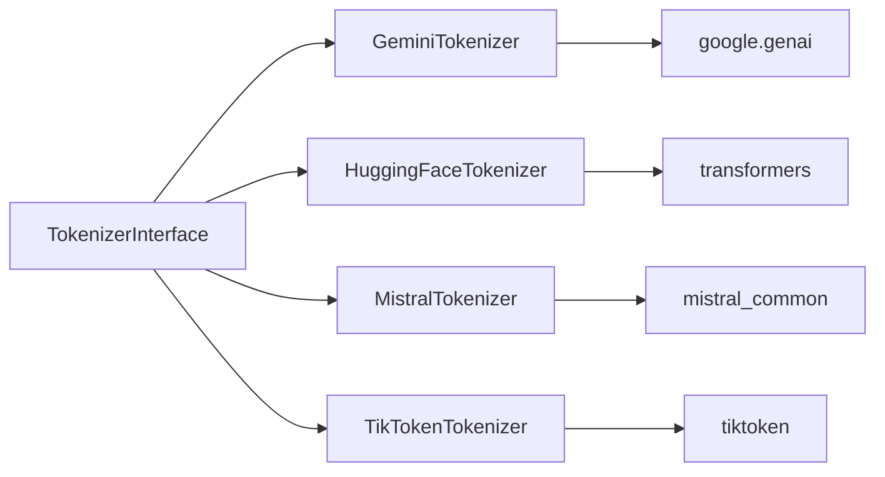

# 令牌化器系统

<cite>
**本文引用的文件**
- [m_flow/llm/tokenizer/__init__.py](file://m_flow/llm/tokenizer/__init__.py)
- [m_flow/llm/tokenizer/tokenizer_interface.py](file://m_flow/llm/tokenizer/tokenizer_interface.py)
- [m_flow/llm/tokenizer/Gemini/adapter.py](file://m_flow/llm/tokenizer/Gemini/adapter.py)
- [m_flow/llm/tokenizer/HuggingFace/adapter.py](file://m_flow/llm/tokenizer/HuggingFace/adapter.py)
- [m_flow/llm/tokenizer/Mistral/adapter.py](file://m_flow/llm/tokenizer/Mistral/adapter.py)
- [m_flow/llm/tokenizer/TikToken/adapter.py](file://m_flow/llm/tokenizer/TikToken/adapter.py)
- [m_flow/adapters/vector/embeddings/FastembedEmbeddingEngine.py](file://m_flow/adapters/vector/embeddings/FastembedEmbeddingEngine.py)
- [m_flow/adapters/vector/embeddings/LiteLLMEmbeddingEngine.py](file://m_flow/adapters/vector/embeddings/LiteLLMEmbeddingEngine.py)
</cite>

## 目录
1. [引言](#引言)
2. [项目结构](#项目结构)
3. [核心组件](#核心组件)
4. [架构总览](#架构总览)
5. [详细组件分析](#详细组件分析)
6. [依赖分析](#依赖分析)
7. [性能考虑](#性能考虑)
8. [故障排除指南](#故障排除指南)
9. [结论](#结论)
10. [附录](#附录)

## 引言
本文件系统性阐述 m_flow 项目的令牌化器体系：从统一抽象接口设计到多种后端实现（Gemini、HuggingFace、Mistral、TikToken），再到与嵌入引擎、上下文窗口限制、内存管理及错误处理的协同工作方式。文档旨在帮助开发者在不改变上层调用逻辑的前提下，灵活切换或扩展令牌化后端，并在高吞吐场景中获得稳定、可预测的性能表现。

## 项目结构
令牌化器模块位于 m_flow/llm/tokenizer 下，采用“接口 + 多后端适配”的分层组织方式：
- 接口层：定义统一协议，屏蔽具体后端差异
- 后端适配层：为各模型族提供本地或网络化的实现
- 使用层：嵌入引擎等上游模块按需选择并注入合适的令牌化器

图表来源
- [m_flow/llm/tokenizer/__init__.py:10-22](file://m_flow/llm/tokenizer/__init__.py#L10-L22)
- [m_flow/llm/tokenizer/tokenizer_interface.py:22-86](file://m_flow/llm/tokenizer/tokenizer_interface.py#L22-L86)
- [m_flow/llm/tokenizer/Gemini/adapter.py:17-93](file://m_flow/llm/tokenizer/Gemini/adapter.py#L17-L93)
- [m_flow/llm/tokenizer/HuggingFace/adapter.py:14-60](file://m_flow/llm/tokenizer/HuggingFace/adapter.py#L14-L60)
- [m_flow/llm/tokenizer/Mistral/adapter.py:16-107](file://m_flow/llm/tokenizer/Mistral/adapter.py#L16-L107)
- [m_flow/llm/tokenizer/TikToken/adapter.py:16-80](file://m_flow/llm/tokenizer/TikToken/adapter.py#L16-L80)
- [m_flow/adapters/vector/embeddings/FastembedEmbeddingEngine.py:26-127](file://m_flow/adapters/vector/embeddings/FastembedEmbeddingEngine.py#L26-L127)
- [m_flow/adapters/vector/embeddings/LiteLLMEmbeddingEngine.py:27-177](file://m_flow/adapters/vector/embeddings/LiteLLMEmbeddingEngine.py#L27-L177)

章节来源
- [m_flow/llm/tokenizer/__init__.py:10-22](file://m_flow/llm/tokenizer/__init__.py#L10-L22)
- [m_flow/llm/tokenizer/tokenizer_interface.py:22-86](file://m_flow/llm/tokenizer/tokenizer_interface.py#L22-L86)

## 核心组件
- 统一接口协议：通过结构化协议定义三类能力，确保后端可替换性
  - 提取令牌序列
  - 计算令牌数量
  - 单令牌反向映射（部分后端不支持）
- 具体实现：
  - Gemini：远程计数，不支持提取与单令牌解码
  - HuggingFace：本地分词，不支持单令牌解码
  - Mistral：本地分词，不支持单令牌解码
  - TikToken：本地分词与解码，提供文本截断工具

章节来源
- [m_flow/llm/tokenizer/tokenizer_interface.py:22-86](file://m_flow/llm/tokenizer/tokenizer_interface.py#L22-L86)
- [m_flow/llm/tokenizer/Gemini/adapter.py:17-93](file://m_flow/llm/tokenizer/Gemini/adapter.py#L17-L93)
- [m_flow/llm/tokenizer/HuggingFace/adapter.py:14-60](file://m_flow/llm/tokenizer/HuggingFace/adapter.py#L14-L60)
- [m_flow/llm/tokenizer/Mistral/adapter.py:16-107](file://m_flow/llm/tokenizer/Mistral/adapter.py#L16-L107)
- [m_flow/llm/tokenizer/TikToken/adapter.py:16-80](file://m_flow/llm/tokenizer/TikToken/adapter.py#L16-L80)

## 架构总览
令牌化器作为嵌入流水线的预处理环节，负责：
- 文本分词与计数，用于上下文窗口控制
- 在需要时进行文本截断，避免超出最大生成长度
- 为下游模块提供一致的令牌化语义

图表来源
- [m_flow/adapters/vector/embeddings/FastembedEmbeddingEngine.py:88-127](file://m_flow/adapters/vector/embeddings/FastembedEmbeddingEngine.py#L88-L127)
- [m_flow/adapters/vector/embeddings/LiteLLMEmbeddingEngine.py:85-177](file://m_flow/adapters/vector/embeddings/LiteLLMEmbeddingEngine.py#L85-L177)
- [m_flow/llm/tokenizer/Gemini/adapter.py:71-93](file://m_flow/llm/tokenizer/Gemini/adapter.py#L71-L93)
- [m_flow/llm/tokenizer/TikToken/adapter.py:49-80](file://m_flow/llm/tokenizer/TikToken/adapter.py#L49-L80)

## 详细组件分析

### 接口协议设计
- 设计要点
  - 使用结构化协议而非强制继承，提升可组合性
  - 明确三类能力边界：分词、计数、单令牌解码
  - 通过运行时检查保证类型安全
- 复杂度与性能
  - 计数与分词均为 O(n) 级别（n 为字符数），受底层库影响
  - 单令牌解码仅在支持的后端可用，否则抛出异常

图表来源
- [m_flow/llm/tokenizer/tokenizer_interface.py:22-86](file://m_flow/llm/tokenizer/tokenizer_interface.py#L22-L86)
- [m_flow/llm/tokenizer/Gemini/adapter.py:17-93](file://m_flow/llm/tokenizer/Gemini/adapter.py#L17-L93)
- [m_flow/llm/tokenizer/HuggingFace/adapter.py:14-60](file://m_flow/llm/tokenizer/HuggingFace/adapter.py#L14-L60)
- [m_flow/llm/tokenizer/Mistral/adapter.py:16-107](file://m_flow/llm/tokenizer/Mistral/adapter.py#L16-L107)
- [m_flow/llm/tokenizer/TikToken/adapter.py:16-80](file://m_flow/llm/tokenizer/TikToken/adapter.py#L16-L80)

章节来源
- [m_flow/llm/tokenizer/tokenizer_interface.py:22-86](file://m_flow/llm/tokenizer/tokenizer_interface.py#L22-L86)

### Gemini 适配器
- 能力与限制
  - 仅支持远程计数；不支持提取令牌与单令牌解码
  - 每次计数触发同步网络请求，不适合高频估算
- 使用建议
  - 优先选择本地令牌化器；仅在确需与官方模型完全一致的计数时使用
  - 对需要计数的批量操作，考虑异步执行或缓存结果

章节来源
- [m_flow/llm/tokenizer/Gemini/adapter.py:17-93](file://m_flow/llm/tokenizer/Gemini/adapter.py#L17-L93)

### HuggingFace 适配器
- 能力与限制
  - 本地分词；不支持单令牌解码
  - 适合通用模型族，但对特定模型的特殊令牌处理取决于 AutoTokenizer 的实现
- 使用建议
  - 与 LiteLLM 嵌入引擎配合时，作为默认回退方案
  - 若模型有定制分词器，需确保模型标识正确

章节来源
- [m_flow/llm/tokenizer/HuggingFace/adapter.py:14-60](file://m_flow/llm/tokenizer/HuggingFace/adapter.py#L14-L60)

### Mistral 适配器
- 能力与限制
  - 本地分词；模拟单轮对话编码，使计数与模型预期一致
  - 不支持单令牌解码
- 使用建议
  - 适用于 Mistral 系列模型的本地化令牌化需求
  - 与其他后端相比，具备更贴近模型 API 的编码行为

章节来源
- [m_flow/llm/tokenizer/Mistral/adapter.py:16-107](file://m_flow/llm/tokenizer/Mistral/adapter.py#L16-L107)

### TikToken 适配器
- 能力与限制
  - 本地分词与解码；提供单令牌解码与列表解码
  - 提供文本截断工具，按最大生成长度进行裁剪
- 使用建议
  - 作为 OpenAI 模型的首选本地令牌化器
  - 在上下文窗口受限场景中，结合截断策略与重试/拆分机制使用

章节来源
- [m_flow/llm/tokenizer/TikToken/adapter.py:16-80](file://m_flow/llm/tokenizer/TikToken/adapter.py#L16-L80)

### 嵌入引擎中的令牌化集成
- Fastembed 嵌入引擎
  - 使用 TikToken 令牌化器进行输入预处理与长度估算
- LiteLLM 嵌入引擎
  - 根据提供商与模型名动态选择令牌化器
  - 支持 OpenAI、Gemini、Mistral、HuggingFace 等多后端
  - 遇到未知模型时回退至 cl100k_base 或 HuggingFace

图表来源
- [m_flow/adapters/vector/embeddings/LiteLLMEmbeddingEngine.py:151-177](file://m_flow/adapters/vector/embeddings/LiteLLMEmbeddingEngine.py#L151-L177)
- [m_flow/adapters/vector/embeddings/FastembedEmbeddingEngine.py:122-127](file://m_flow/adapters/vector/embeddings/FastembedEmbeddingEngine.py#L122-L127)

章节来源
- [m_flow/adapters/vector/embeddings/FastembedEmbeddingEngine.py:122-127](file://m_flow/adapters/vector/embeddings/FastembedEmbeddingEngine.py#L122-L127)
- [m_flow/adapters/vector/embeddings/LiteLLMEmbeddingEngine.py:151-177](file://m_flow/adapters/vector/embeddings/LiteLLMEmbeddingEngine.py#L151-L177)

## 依赖分析
- 模块内聚与耦合
  - 令牌化器均依赖统一接口协议，彼此独立，便于替换
  - 各后端实现仅依赖自身所需外部库，降低全局依赖
- 外部依赖
  - Gemini：Google GenAI 客户端（远程计数）
  - HuggingFace：transformers.AutoTokenizer（本地分词）
  - Mistral：mistral_common（本地分词）
  - TikToken：tiktoken（本地分词与解码）

图表来源
- [m_flow/llm/tokenizer/tokenizer_interface.py:22-86](file://m_flow/llm/tokenizer/tokenizer_interface.py#L22-L86)
- [m_flow/llm/tokenizer/Gemini/adapter.py:43-49](file://m_flow/llm/tokenizer/Gemini/adapter.py#L43-L49)
- [m_flow/llm/tokenizer/HuggingFace/adapter.py:38-41](file://m_flow/llm/tokenizer/HuggingFace/adapter.py#L38-L41)
- [m_flow/llm/tokenizer/Mistral/adapter.py:43-47](file://m_flow/llm/tokenizer/Mistral/adapter.py#L43-L47)
- [m_flow/llm/tokenizer/TikToken/adapter.py](file://m_flow/llm/tokenizer/TikToken/adapter.py#L11)

章节来源
- [m_flow/llm/tokenizer/Gemini/adapter.py:43-49](file://m_flow/llm/tokenizer/Gemini/adapter.py#L43-L49)
- [m_flow/llm/tokenizer/HuggingFace/adapter.py:38-41](file://m_flow/llm/tokenizer/HuggingFace/adapter.py#L38-L41)
- [m_flow/llm/tokenizer/Mistral/adapter.py:43-47](file://m_flow/llm/tokenizer/Mistral/adapter.py#L43-L47)
- [m_flow/llm/tokenizer/TikToken/adapter.py](file://m_flow/llm/tokenizer/TikToken/adapter.py#L11)

## 性能考虑
- 本地 vs 远程
  - 本地令牌化器（HuggingFace、Mistral、TikToken）延迟低、吞吐高
  - Gemini 远程计数每次调用带来网络开销，不适合高频估算
- 计数与截断
  - 在嵌入前先做计数与截断，可显著减少后续失败重试成本
  - 对超长文本采用分片池化策略，平衡精度与性能
- 批处理与并发
  - 嵌入引擎内部已内置批处理与速率限制，令牌化阶段应尽量减少额外 IO
- 内存管理
  - 令牌化器对象通常持有底层模型句柄，建议复用实例以避免重复加载
  - 对于大批次文本，注意分批处理，避免峰值内存过高

## 故障排除指南
- 常见问题与对策
  - 单令牌解码不可用：HuggingFace 与 Mistral 后端明确不支持，需改用列表解码或切换到 TikToken
  - Gemini 计数报错：检查 API 密钥与网络连通性；必要时降级为本地令牌化器
  - LiteLLM 令牌化选择失败：当模型不在 tiktoken 注册表时自动回退到 cl100k_base；若仍失败则回退到 HuggingFace
- 错误处理流程
  - 嵌入引擎捕获上下文窗口超限等异常，触发拆分与池化策略
  - 令牌化阶段如遇异常，应尽早失败并记录上下文信息，便于定位

章节来源
- [m_flow/llm/tokenizer/HuggingFace/adapter.py:51-60](file://m_flow/llm/tokenizer/HuggingFace/adapter.py#L51-L60)
- [m_flow/llm/tokenizer/Mistral/adapter.py:95-107](file://m_flow/llm/tokenizer/Mistral/adapter.py#L95-L107)
- [m_flow/llm/tokenizer/Gemini/adapter.py:55-65](file://m_flow/llm/tokenizer/Gemini/adapter.py#L55-L65)
- [m_flow/adapters/vector/embeddings/LiteLLMEmbeddingEngine.py:156-177](file://m_flow/adapters/vector/embeddings/LiteLLMEmbeddingEngine.py#L156-L177)

## 结论
该令牌化器系统通过统一协议实现了对多后端的透明接入，既满足了不同 LLM 模型族的分词与计数需求，又在性能与稳定性之间取得平衡。结合嵌入引擎的上下文窗口控制与错误恢复策略，可在复杂生产环境中可靠地完成大规模文本处理任务。

## 附录
- 特殊令牌与填充规则
  - 各后端对特殊令牌（如开始/结束、角色标记）的处理方式不同，应根据具体后端文档确认
  - TikToken 支持单令牌解码，适合细粒度调试；其他后端建议通过列表解码进行验证
- 测试与验证方法
  - 单元测试：针对每种令牌化器的计数、分词与解码功能编写最小可验证用例
  - 集成测试：在嵌入引擎中验证令牌化器选择逻辑与回退路径
  - 压力测试：模拟高并发与超长文本，观察内存占用与吞吐变化