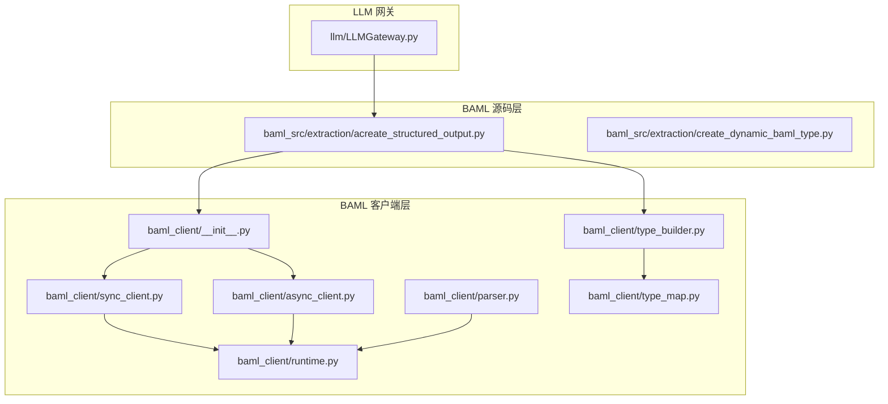
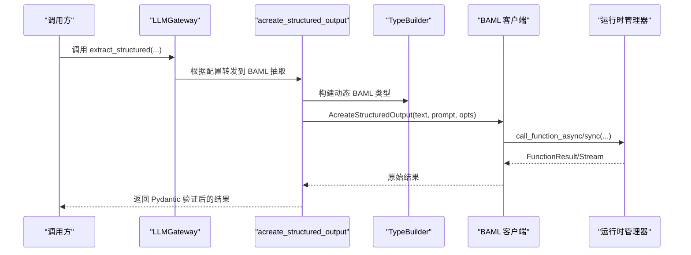
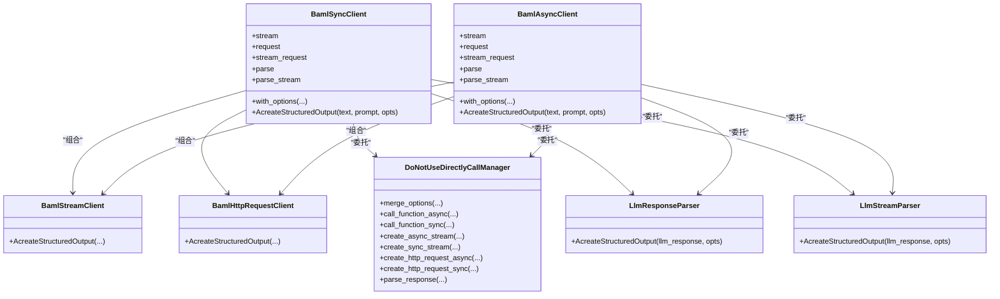
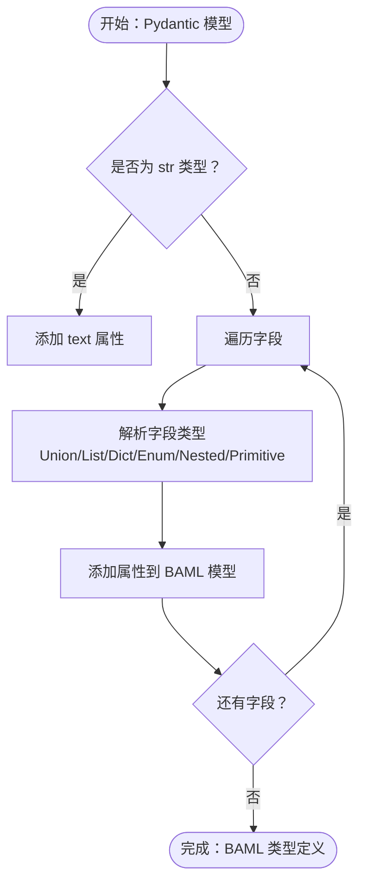
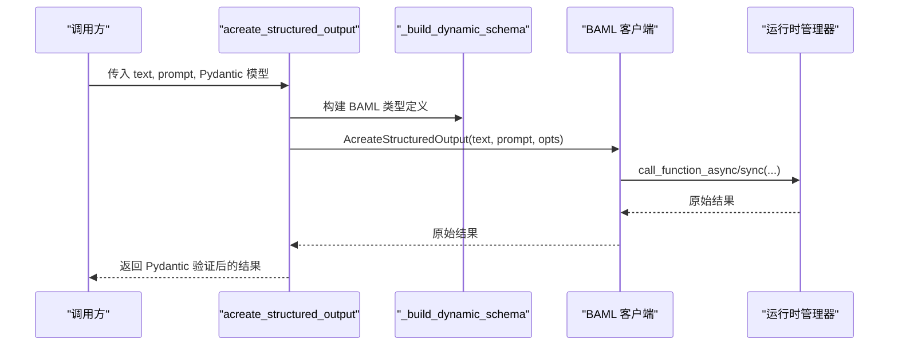
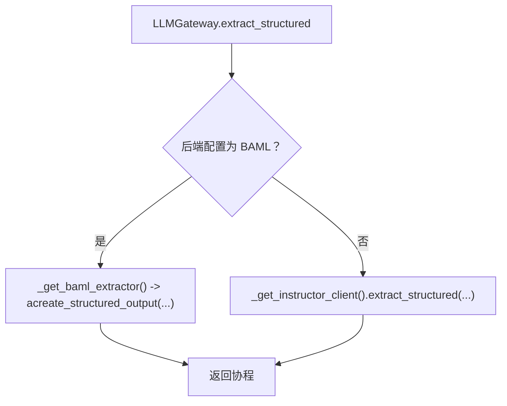
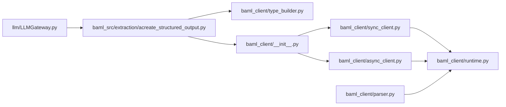

# BAML 后端

<cite>
**本文引用的文件**
- [m_flow/llm/backends/baml/baml_client/__init__.py](file://m_flow/llm/backends/baml/baml_client/__init__.py)
- [m_flow/llm/backends/baml/baml_client/sync_client.py](file://m_flow/llm/backends/baml/baml_client/sync_client.py)
- [m_flow/llm/backends/baml/baml_client/async_client.py](file://m_flow/llm/backends/baml/baml_client/async_client.py)
- [m_flow/llm/backends/baml/baml_client/runtime.py](file://m_flow/llm/backends/baml/baml_client/runtime.py)
- [m_flow/llm/backends/baml/baml_client/parser.py](file://m_flow/llm/backends/baml/baml_client/parser.py)
- [m_flow/llm/backends/baml/baml_client/type_builder.py](file://m_flow/llm/backends/baml/baml_client/type_builder.py)
- [m_flow/llm/backends/baml/baml_client/type_map.py](file://m_flow/llm/backends/baml/baml_client/type_map.py)
- [m_flow/llm/backends/baml/baml_src/extraction/acreate_structured_output.py](file://m_flow/llm/backends/baml/baml_src/extraction/acreate_structured_output.py)
- [m_flow/llm/backends/baml/baml_src/extraction/create_dynamic_baml_type.py](file://m_flow/llm/backends/baml/baml_src/extraction/create_dynamic_baml_type.py)
- [m_flow/llm/LLMGateway.py](file://m_flow/llm/LLMGateway.py)
</cite>

## 目录
1. [简介](#简介)
2. [项目结构](#项目结构)
3. [核心组件](#核心组件)
4. [架构总览](#架构总览)
5. [详细组件分析](#详细组件分析)
6. [依赖分析](#依赖分析)
7. [性能考虑](#性能考虑)
8. [故障排除指南](#故障排除指南)
9. [结论](#结论)
10. [附录：BAML 模式与使用示例](#附录baml-模式与使用示例)

## 简介
本文件系统性梳理 m_flow 中基于 BAML（Better Abstract Markup Language）的后端实现，重点覆盖以下方面：
- 结构化输出提取在系统中的定位与工作流
- BAML 类型系统与动态类型生成机制
- BAML 客户端（同步/异步）的实现差异与职责边界
- 运行时类型构建与解析链路
- 与 LLM 提供商的集成方式与性能优化策略
- 调试与故障排除方法

## 项目结构
BAML 后端位于 m_flow/llm/backends/baml 目录下，分为两部分：
- baml_client：由 BAML CLI 生成的运行时客户端与运行时封装，负责函数调用、流式处理、HTTP 请求构建、响应解析等
- baml_src：业务侧的结构化抽取入口与动态类型生成工具，负责将 Pydantic 模型转换为 BAML 类型定义，并通过 BAML 客户端完成抽取

**图表来源**
- [m_flow/llm/backends/baml/baml_client/__init__.py:1-58](file://m_flow/llm/backends/baml/baml_client/__init__.py#L1-L58)
- [m_flow/llm/backends/baml/baml_client/sync_client.py:1-192](file://m_flow/llm/backends/baml/baml_client/sync_client.py#L1-L192)
- [m_flow/llm/backends/baml/baml_client/async_client.py:1-173](file://m_flow/llm/backends/baml/baml_client/async_client.py#L1-L173)
- [m_flow/llm/backends/baml/baml_client/runtime.py:1-327](file://m_flow/llm/backends/baml/baml_client/runtime.py#L1-L327)
- [m_flow/llm/backends/baml/baml_client/parser.py:1-51](file://m_flow/llm/backends/baml/baml_client/parser.py#L1-L51)
- [m_flow/llm/backends/baml/baml_client/type_builder.py:1-100](file://m_flow/llm/backends/baml/baml_client/type_builder.py#L1-L100)
- [m_flow/llm/backends/baml/baml_client/type_map.py:1-21](file://m_flow/llm/backends/baml/baml_client/type_map.py#L1-L21)
- [m_flow/llm/backends/baml/baml_src/extraction/acreate_structured_output.py:1-165](file://m_flow/llm/backends/baml/baml_src/extraction/acreate_structured_output.py#L1-L165)
- [m_flow/llm/backends/baml/baml_src/extraction/create_dynamic_baml_type.py:1-212](file://m_flow/llm/backends/baml/baml_src/extraction/create_dynamic_baml_type.py#L1-L212)
- [m_flow/llm/LLMGateway.py:1-168](file://m_flow/llm/LLMGateway.py#L1-L168)

**章节来源**
- [m_flow/llm/backends/baml/baml_client/__init__.py:1-58](file://m_flow/llm/backends/baml/baml_client/__init__.py#L1-L58)
- [m_flow/llm/backends/baml/baml_src/extraction/acreate_structured_output.py:1-165](file://m_flow/llm/backends/baml/baml_src/extraction/acreate_structured_output.py#L1-L165)

## 核心组件
- BAML 客户端（同步/异步）
  - BamlSyncClient/BamlAsyncClient：封装函数调用、流式调用、HTTP 请求构建、解析器代理
  - BamlStreamClient/BamlHttpRequestClient：分别对应同步/异步流与请求构建
- 运行时管理器
  - DoNotUseDirectlyCallManager：合并/解析调用选项，桥接运行时执行与上下文
- 解析器
  - LlmResponseParser/LlmStreamParser：对 LLM 原始响应进行结构化解析
- 动态类型构建
  - TypeBuilder/ResponseModelBuilder：声明 BAML 类型定义；支持属性增删、重置
  - create_dynamic_baml_type：从 Pydantic 模型递归生成 BAML 类型定义
- 网关适配
  - LLMGateway：根据配置选择 BAML 或 Instructor 后端，统一对外接口

**章节来源**
- [m_flow/llm/backends/baml/baml_client/sync_client.py:22-192](file://m_flow/llm/backends/baml/baml_client/sync_client.py#L22-L192)
- [m_flow/llm/backends/baml/baml_client/async_client.py:15-173](file://m_flow/llm/backends/baml/baml_client/async_client.py#L15-L173)
- [m_flow/llm/backends/baml/baml_client/runtime.py:62-327](file://m_flow/llm/backends/baml/baml_client/runtime.py#L62-L327)
- [m_flow/llm/backends/baml/baml_client/parser.py:19-51](file://m_flow/llm/backends/baml/baml_client/parser.py#L19-L51)
- [m_flow/llm/backends/baml/baml_client/type_builder.py:22-100](file://m_flow/llm/backends/baml/baml_client/type_builder.py#L22-L100)
- [m_flow/llm/backends/baml/baml_src/extraction/create_dynamic_baml_type.py:177-212](file://m_flow/llm/backends/baml/baml_src/extraction/create_dynamic_baml_type.py#L177-L212)
- [m_flow/llm/LLMGateway.py:35-87](file://m_flow/llm/LLMGateway.py#L35-L87)

## 架构总览
BAML 后端采用“源码层抽取 + 客户端层执行”的分层设计：
- 源码层负责将用户提供的 Pydantic 模型转换为 BAML 类型定义，并通过 BAML 客户端发起结构化抽取
- 客户端层负责与运行时交互，支持同步/异步调用、流式处理、HTTP 请求构建与响应解析
- 网关层根据配置动态路由到 BAML 或 Instructor 后端

**图表来源**
- [m_flow/llm/LLMGateway.py:68-87](file://m_flow/llm/LLMGateway.py#L68-L87)
- [m_flow/llm/backends/baml/baml_src/extraction/acreate_structured_output.py:96-139](file://m_flow/llm/backends/baml/baml_src/extraction/acreate_structured_output.py#L96-L139)
- [m_flow/llm/backends/baml/baml_client/async_client.py:74-96](file://m_flow/llm/backends/baml/baml_client/async_client.py#L74-L96)
- [m_flow/llm/backends/baml/baml_client/runtime.py:116-167](file://m_flow/llm/backends/baml/baml_client/runtime.py#L116-L167)

## 详细组件分析

### 组件一：BAML 客户端（同步/异步）
- 职责
  - 将高层调用封装为 BAML 函数调用
  - 支持 on_tick 回调驱动的流式处理
  - 提供 HTTP 请求构建能力（请求/流式两种模式）
  - 通过解析器将原始响应转为强类型对象
- 差异点
  - 异步客户端在存在 on_tick 时自动走流式路径以获取最终结果
  - 同步客户端不支持 on_tick 流式（会抛出异常）

**图表来源**
- [m_flow/llm/backends/baml/baml_client/sync_client.py:22-192](file://m_flow/llm/backends/baml/baml_client/sync_client.py#L22-L192)
- [m_flow/llm/backends/baml/baml_client/async_client.py:15-173](file://m_flow/llm/backends/baml/baml_client/async_client.py#L15-L173)
- [m_flow/llm/backends/baml/baml_client/runtime.py:62-327](file://m_flow/llm/backends/baml/baml_client/runtime.py#L62-L327)
- [m_flow/llm/backends/baml/baml_client/parser.py:19-51](file://m_flow/llm/backends/baml/baml_client/parser.py#L19-L51)

**章节来源**
- [m_flow/llm/backends/baml/baml_client/sync_client.py:94-116](file://m_flow/llm/backends/baml/baml_client/sync_client.py#L94-L116)
- [m_flow/llm/backends/baml/baml_client/async_client.py:74-96](file://m_flow/llm/backends/baml/baml_client/async_client.py#L74-L96)

### 组件二：运行时类型构建与解析
- 类型构建
  - TypeBuilder 声明类名集合（如 ResponseModel），并暴露 Builder 接口
  - create_dynamic_baml_type 从 Pydantic 模型字段出发，递归处理联合类型、列表、字典、枚举、嵌套模型等
- 解析
  - DoNotUseDirectlyCallManager.parse_response 将 LLM 原始文本解析为强类型对象，支持“请求/流式”两种模式
  - LlmResponseParser/LlmStreamParser 作为便捷入口

**图表来源**
- [m_flow/llm/backends/baml/baml_src/extraction/create_dynamic_baml_type.py:177-212](file://m_flow/llm/backends/baml/baml_src/extraction/create_dynamic_baml_type.py#L177-L212)
- [m_flow/llm/backends/baml/baml_client/type_builder.py:57-89](file://m_flow/llm/backends/baml/baml_client/type_builder.py#L57-L89)

**章节来源**
- [m_flow/llm/backends/baml/baml_client/type_builder.py:22-89](file://m_flow/llm/backends/baml/baml_client/type_builder.py#L22-L89)
- [m_flow/llm/backends/baml/baml_src/extraction/create_dynamic_baml_type.py:38-124](file://m_flow/llm/backends/baml/baml_src/extraction/create_dynamic_baml_type.py#L38-L124)

### 组件三：结构化输出抽取工作流
- 入口
  - acreate_structured_output：接收输入文本、系统提示、目标 Pydantic 模型
- 类型生成
  - _build_dynamic_schema：构造 TypeBuilder 并填充 BAML 类型定义
- 调用执行
  - 在速率限制上下文中调用 BAML 客户端 AcreateStructuredOutput
- 结果转换
  - _extract_response_value：字符串模型返回 text 字段；复杂模型通过 Pydantic 验证

**图表来源**
- [m_flow/llm/backends/baml/baml_src/extraction/acreate_structured_output.py:96-139](file://m_flow/llm/backends/baml/baml_src/extraction/acreate_structured_output.py#L96-L139)
- [m_flow/llm/backends/baml/baml_client/async_client.py:89-96](file://m_flow/llm/backends/baml/baml_client/async_client.py#L89-L96)
- [m_flow/llm/backends/baml/baml_client/runtime.py:116-167](file://m_flow/llm/backends/baml/baml_client/runtime.py#L116-L167)

**章节来源**
- [m_flow/llm/backends/baml/baml_src/extraction/acreate_structured_output.py:96-139](file://m_flow/llm/backends/baml/baml_src/extraction/acreate_structured_output.py#L96-L139)

### 组件四：与 LLM 提供商的集成与网关适配
- LLMGateway 根据配置决定后端
  - 当 backends 为 BAML 时，调用 BAML 抽取入口
  - 否则使用 Instructor 客户端
- BAML 注册表
  - 通过 baml_opts 的 client_registry 注入 LLM 注册表，确保运行时正确路由到提供商

**图表来源**
- [m_flow/llm/LLMGateway.py:68-87](file://m_flow/llm/LLMGateway.py#L68-L87)

**章节来源**
- [m_flow/llm/LLMGateway.py:35-53](file://m_flow/llm/LLMGateway.py#L35-L53)

## 依赖分析
- 内部耦合
  - 源码层抽取依赖客户端层的运行时管理器与解析器
  - 客户端层通过 DoNotUseDirectlyCallManager 与运行时解耦
- 外部依赖
  - baml-py：运行时、类型构建、流式与 HTTP 请求构建
  - pydantic：动态类型生成与结果验证
  - tenacity：重试策略
  - litellm：当非 BAML 后端时的替代实现

**图表来源**
- [m_flow/llm/backends/baml/baml_src/extraction/acreate_structured_output.py:1-165](file://m_flow/llm/backends/baml/baml_src/extraction/acreate_structured_output.py#L1-L165)
- [m_flow/llm/backends/baml/baml_client/__init__.py:1-58](file://m_flow/llm/backends/baml/baml_client/__init__.py#L1-L58)
- [m_flow/llm/backends/baml/baml_client/sync_client.py:1-192](file://m_flow/llm/backends/baml/baml_client/sync_client.py#L1-L192)
- [m_flow/llm/backends/baml/baml_client/async_client.py:1-173](file://m_flow/llm/backends/baml/baml_client/async_client.py#L1-L173)
- [m_flow/llm/backends/baml/baml_client/runtime.py:1-327](file://m_flow/llm/backends/baml/baml_client/runtime.py#L1-L327)
- [m_flow/llm/LLMGateway.py:1-168](file://m_flow/llm/LLMGateway.py#L1-L168)

**章节来源**
- [m_flow/llm/backends/baml/baml_client/type_map.py:17-21](file://m_flow/llm/backends/baml/baml_client/type_map.py#L17-L21)

## 性能考虑
- 速率限制
  - 在抽取调用前后使用速率限制上下文，避免突发请求导致限流或失败
- 重试策略
  - 使用指数退避+抖动的重试装饰器，提升瞬时错误下的成功率
- 流式回调
  - on_tick 可用于监控与可观测性，但同步流不支持该回调，需使用异步流
- HTTP 请求构建
  - 对于高延迟场景，可优先使用 HTTP 请求构建以绕过直接调用开销

**章节来源**
- [m_flow/llm/backends/baml/baml_src/extraction/acreate_structured_output.py:38-46](file://m_flow/llm/backends/baml/baml_src/extraction/acreate_structured_output.py#L38-L46)
- [m_flow/llm/backends/baml/baml_client/runtime.py:198-228](file://m_flow/llm/backends/baml/baml_client/runtime.py#L198-L228)

## 故障排除指南
- 版本不匹配
  - 若导入 baml_py 失败或版本不兼容，按提示升级 baml-py 到指定版本
- 同步流 on_tick 不支持
  - 同步流创建时若传入 on_tick，将抛出异常；请改用异步流
- 无法解析响应
  - 检查 BAML 类型定义与 Pydantic 模型是否一致；必要时使用 disassemble 辅助诊断
- LLM 后端切换
  - 确认 LLM 配置中 backends 设置为 BAML，否则将走 Instructor 后端

**章节来源**
- [m_flow/llm/backends/baml/baml_client/__init__.py:15-30](file://m_flow/llm/backends/baml/baml_client/__init__.py#L15-L30)
- [m_flow/llm/backends/baml/baml_client/runtime.py:205-207](file://m_flow/llm/backends/baml/baml_client/runtime.py#L205-L207)
- [m_flow/llm/backends/baml/baml_client/runtime.py:306-327](file://m_flow/llm/backends/baml/baml_client/runtime.py#L306-L327)
- [m_flow/llm/LLMGateway.py:35-36](file://m_flow/llm/LLMGateway.py#L35-L36)

## 结论
本后端通过“源码层动态类型生成 + 客户端层统一执行”的架构，实现了从 Pydantic 模型到 LLM 结构化输出的无缝衔接。同步/异步客户端在能力上互补：前者简洁稳定，后者支持流式与回调；运行时管理器屏蔽了上下文与环境变量差异，使调用过程高度一致。结合速率限制与重试策略，可在生产环境中获得稳健的吞吐与可靠性。

## 附录：BAML 模式与使用示例
- 模式定义与使用
  - 动态类型生成：从 Pydantic 模型字段出发，递归处理联合、列表、字典、枚举与嵌套模型
  - 类型注册：通过 TypeBuilder 声明类名集合，再由 create_dynamic_baml_type 填充属性
  - 结果解析：将 BAML 原始结果转换为强类型对象，字符串模型返回 text 字段，复杂模型经 Pydantic 验证
- 示例参考路径
  - 动态类型生成工具：[create_dynamic_baml_type.py:177-212](file://m_flow/llm/backends/baml/baml_src/extraction/create_dynamic_baml_type.py#L177-L212)
  - 抽取入口与重试策略：[acreate_structured_output.py:96-139](file://m_flow/llm/backends/baml/baml_src/extraction/acreate_structured_output.py#L96-L139)
  - 客户端与运行时：[sync_client.py:94-116](file://m_flow/llm/backends/baml/baml_client/sync_client.py#L94-L116)、[async_client.py:74-96](file://m_flow/llm/backends/baml/baml_client/async_client.py#L74-L96)、[runtime.py:116-167](file://m_flow/llm/backends/baml/baml_client/runtime.py#L116-L167)

**章节来源**
- [m_flow/llm/backends/baml/baml_src/extraction/create_dynamic_baml_type.py:177-212](file://m_flow/llm/backends/baml/baml_src/extraction/create_dynamic_baml_type.py#L177-L212)
- [m_flow/llm/backends/baml/baml_src/extraction/acreate_structured_output.py:96-139](file://m_flow/llm/backends/baml/baml_src/extraction/acreate_structured_output.py#L96-L139)
- [m_flow/llm/backends/baml/baml_client/sync_client.py:94-116](file://m_flow/llm/backends/baml/baml_client/sync_client.py#L94-L116)
- [m_flow/llm/backends/baml/baml_client/async_client.py:74-96](file://m_flow/llm/backends/baml/baml_client/async_client.py#L74-L96)
- [m_flow/llm/backends/baml/baml_client/runtime.py:116-167](file://m_flow/llm/backends/baml/baml_client/runtime.py#L116-L167)