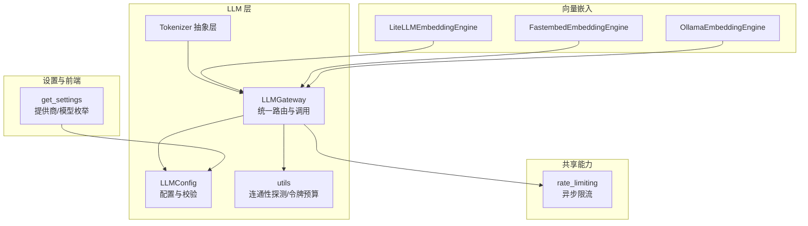
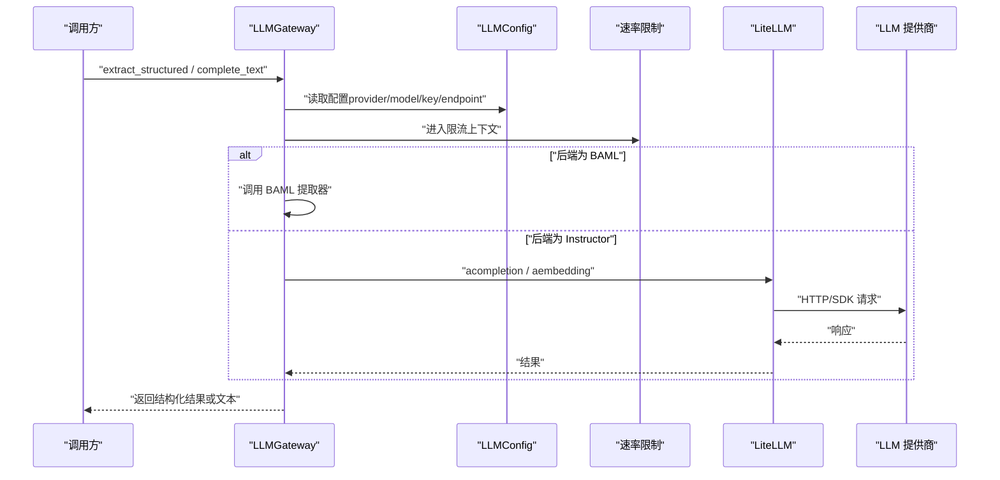
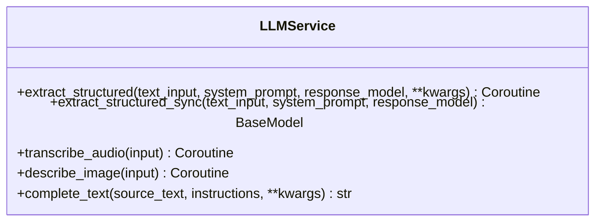
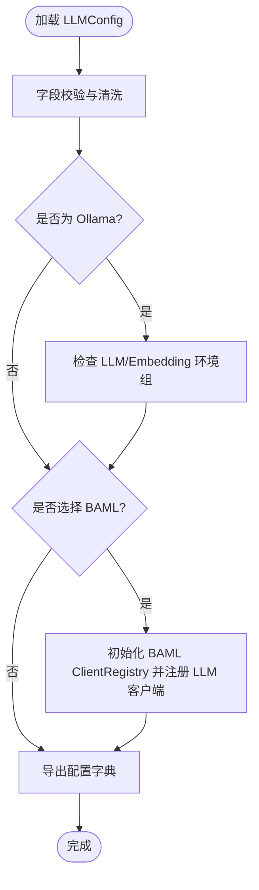
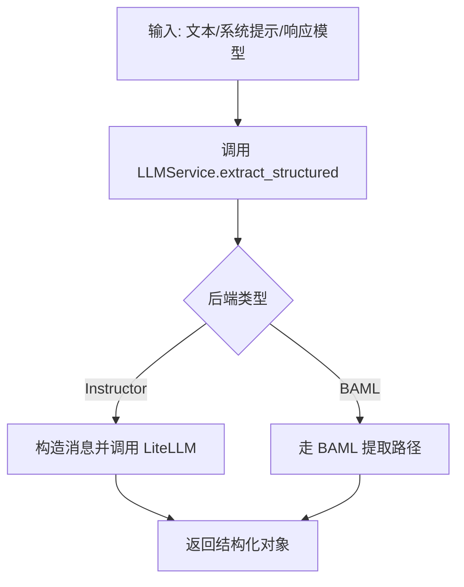
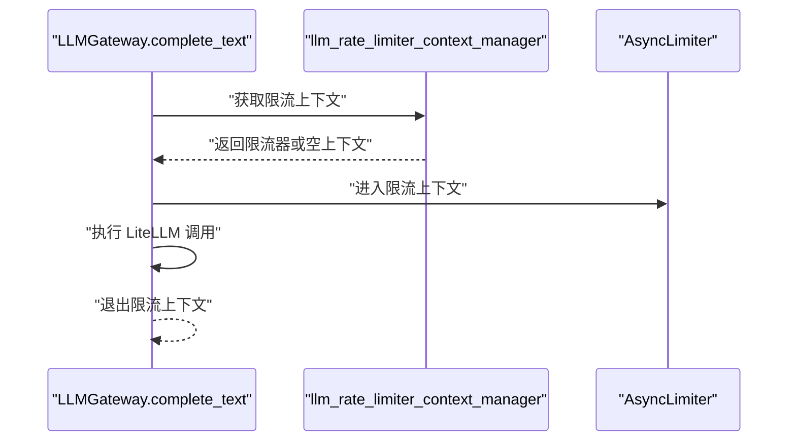
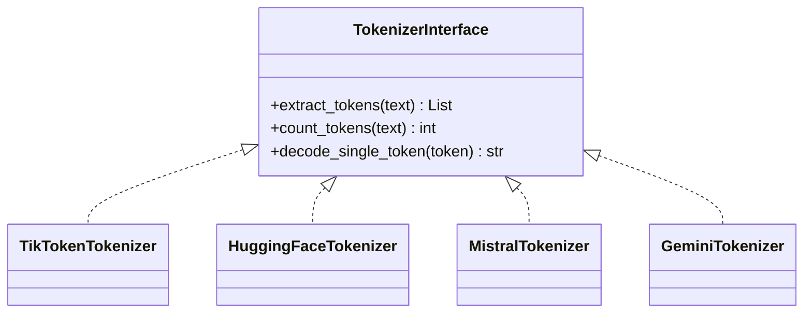
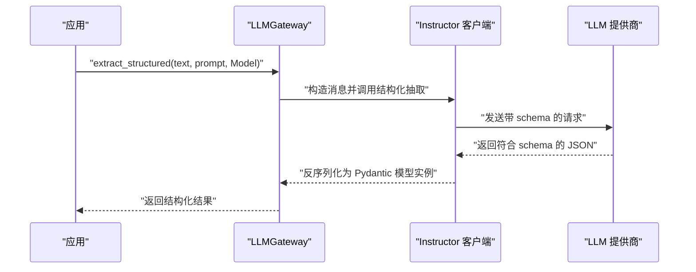
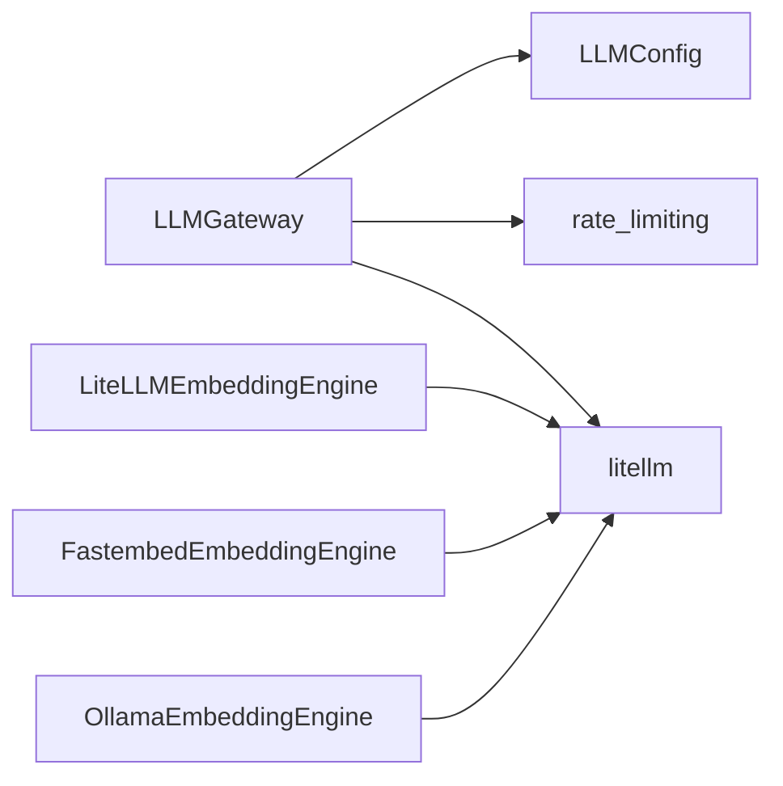

# LiteLLM/Instructor 后端

<cite>
**本文引用的文件**
- [m_flow/llm/LLMGateway.py](file://m_flow/llm/LLMGateway.py)
- [m_flow/llm/config.py](file://m_flow/llm/config.py)
- [m_flow/llm/utils.py](file://m_flow/llm/utils.py)
- [m_flow/llm/backends/__init__.py](file://m_flow/llm/backends/__init__.py)
- [m_flow/llm/tokenizer/__init__.py](file://m_flow/llm/tokenizer/__init__.py)
- [m_flow/llm/tokenizer/tokenizer_interface.py](file://m_flow/llm/tokenizer/tokenizer_interface.py)
- [m_flow/config/settings/get_settings.py](file://m_flow/config/settings/get_settings.py)
- [m_flow/shared/rate_limiting.py](file://m_flow/shared/rate_limiting.py)
- [m_flow/adapters/vector/embeddings/LiteLLMEmbeddingEngine.py](file://m_flow/adapters/vector/embeddings/LiteLLMEmbeddingEngine.py)
- [m_flow/adapters/vector/embeddings/FastembedEmbeddingEngine.py](file://m_flow/adapters/vector/embeddings/FastembedEmbeddingEngine.py)
- [m_flow/adapters/vector/embeddings/OllamaEmbeddingEngine.py](file://m_flow/adapters/vector/embeddings/OllamaEmbeddingEngine.py)
</cite>

## 目录
1. [简介](#简介)
2. [项目结构](#项目结构)
3. [核心组件](#核心组件)
4. [架构总览](#架构总览)
5. [组件详解](#组件详解)
6. [依赖关系分析](#依赖关系分析)
7. [性能考量](#性能考量)
8. [故障排查指南](#故障排查指南)
9. [结论](#结论)
10. [附录：配置与最佳实践](#附录配置与最佳实践)

## 简介
本文件面向后端开发者与运维工程师，系统性阐述 M-flow 中基于 LiteLLM 的统一 LLM 接口设计与实现，重点覆盖以下方面：
- 统一 LLM 路由与后端切换（Instructor 与 BAML）的机制
- 各大 LLM 提供商适配（OpenAI、Anthropic、Gemini、Mistral、Ollama 等）
- 请求路由、速率限制与并发控制策略
- 错误处理与重试机制
- 与 Instructor 库的集成方式及结构化输出处理流程
- 配置项与最佳实践

## 项目结构
围绕 LLM 的核心模块分布如下：
- 统一入口与路由：m_flow/llm/LLMGateway.py
- 配置模型与环境变量解析：m_flow/llm/config.py
- 连通性探测与令牌预算工具：m_flow/llm/utils.py
- 结构化输出框架说明：m_flow/llm/backends/__init__.py
- 分词器抽象与多后端实现：m_flow/llm/tokenizer/*
- 设置页面与提供商枚举：m_flow/config/settings/get_settings.py
- 速率限制上下文管理：m_flow/shared/rate_limiting.py
- 向量嵌入引擎（使用 LiteLLM 作为统一适配层）：m_flow/adapters/vector/embeddings/*

**图表来源**
- [m_flow/llm/LLMGateway.py:1-168](file://m_flow/llm/LLMGateway.py#L1-L168)
- [m_flow/llm/config.py:1-209](file://m_flow/llm/config.py#L1-L209)
- [m_flow/llm/utils.py:1-126](file://m_flow/llm/utils.py#L1-L126)
- [m_flow/llm/tokenizer/__init__.py:1-23](file://m_flow/llm/tokenizer/__init__.py#L1-L23)
- [m_flow/config/settings/get_settings.py:1-151](file://m_flow/config/settings/get_settings.py#L1-L151)
- [m_flow/shared/rate_limiting.py:1-59](file://m_flow/shared/rate_limiting.py#L1-L59)
- [m_flow/adapters/vector/embeddings/LiteLLMEmbeddingEngine.py:1-150](file://m_flow/adapters/vector/embeddings/LiteLLMEmbeddingEngine.py#L1-L150)
- [m_flow/adapters/vector/embeddings/FastembedEmbeddingEngine.py:1-120](file://m_flow/adapters/vector/embeddings/FastembedEmbeddingEngine.py#L1-L120)
- [m_flow/adapters/vector/embeddings/OllamaEmbeddingEngine.py:1-120](file://m_flow/adapters/vector/embeddings/OllamaEmbeddingEngine.py#L1-L120)

**章节来源**
- [m_flow/llm/LLMGateway.py:1-168](file://m_flow/llm/LLMGateway.py#L1-L168)
- [m_flow/llm/config.py:1-209](file://m_flow/llm/config.py#L1-L209)
- [m_flow/llm/utils.py:1-126](file://m_flow/llm/utils.py#L1-L126)
- [m_flow/llm/backends/__init__.py:1-10](file://m_flow/llm/backends/__init__.py#L1-L10)
- [m_flow/llm/tokenizer/__init__.py:1-23](file://m_flow/llm/tokenizer/__init__.py#L1-L23)
- [m_flow/llm/tokenizer/tokenizer_interface.py:1-87](file://m_flow/llm/tokenizer/tokenizer_interface.py#L1-L87)
- [m_flow/config/settings/get_settings.py:1-151](file://m_flow/config/settings/get_settings.py#L1-L151)
- [m_flow/shared/rate_limiting.py:1-59](file://m_flow/shared/rate_limiting.py#L1-L59)
- [m_flow/adapters/vector/embeddings/LiteLLMEmbeddingEngine.py:1-150](file://m_flow/adapters/vector/embeddings/LiteLLMEmbeddingEngine.py#L1-L150)
- [m_flow/adapters/vector/embeddings/FastembedEmbeddingEngine.py:1-120](file://m_flow/adapters/vector/embeddings/FastembedEmbeddingEngine.py#L1-L120)
- [m_flow/adapters/vector/embeddings/OllamaEmbeddingEngine.py:1-120](file://m_flow/adapters/vector/embeddings/OllamaEmbeddingEngine.py#L1-L120)

## 核心组件
- 统一 LLM 服务（LLMGateway）
  - 提供结构化抽取、同步/异步文本补全、音频转录、图像描述等统一接口
  - 基于配置动态选择后端（Instructor 或 BAML）
  - 内置指数退避重试与日志记录
- LLM 配置（LLMConfig）
  - 支持多种提供商与模型，含温度、流式、最大补全长度等参数
  - 支持主 LLM 与 BAML 双栈配置
  - 提供 Ollama 环境一致性校验与 BAML 注册初始化
- 工具函数（utils）
  - 计算最大分块令牌数、查询模型令牌上限
  - LLM/嵌入连通性探测
- 速率限制（rate_limiting）
  - 异步限流器封装，支持按需启用/禁用
- 分词器抽象（tokenizer）
  - 定义统一协议，屏蔽不同后端差异
- 设置页面（get_settings）
  - 汇总可用提供商与模型列表，供前端展示

**章节来源**
- [m_flow/llm/LLMGateway.py:60-168](file://m_flow/llm/LLMGateway.py#L60-L168)
- [m_flow/llm/config.py:38-209](file://m_flow/llm/config.py#L38-L209)
- [m_flow/llm/utils.py:27-126](file://m_flow/llm/utils.py#L27-L126)
- [m_flow/shared/rate_limiting.py:21-59](file://m_flow/shared/rate_limiting.py#L21-L59)
- [m_flow/llm/tokenizer/tokenizer_interface.py:22-87](file://m_flow/llm/tokenizer/tokenizer_interface.py#L22-L87)
- [m_flow/config/settings/get_settings.py:27-151](file://m_flow/config/settings/get_settings.py#L27-L151)

## 架构总览
下图展示了从调用方到具体 LLM 提供商的完整链路，以及与 Instructor、BAML、LiteLLM 的交互关系。

**图表来源**
- [m_flow/llm/LLMGateway.py:60-168](file://m_flow/llm/LLMGateway.py#L60-L168)
- [m_flow/llm/config.py:38-93](file://m_flow/llm/config.py#L38-L93)
- [m_flow/shared/rate_limiting.py:51-59](file://m_flow/shared/rate_limiting.py#L51-L59)

## 组件详解

### 统一 LLM 服务（LLMGateway）
- 职责
  - 将结构化抽取、纯文本补全、音频转录、图像描述等统一到一个入口
  - 根据配置在 Instructor 与 BAML 之间动态切换
  - 对文本补全进行指数退避重试，过滤非瞬时异常
- 关键点
  - 文本补全在进入 LLM 前后记录日志，便于可观测性
  - 通过上下文管理器应用速率限制
  - 结构化抽取支持异步与同步两种模式（Instructor）

**图表来源**
- [m_flow/llm/LLMGateway.py:60-168](file://m_flow/llm/LLMGateway.py#L60-L168)

**章节来源**
- [m_flow/llm/LLMGateway.py:35-168](file://m_flow/llm/LLMGateway.py#L35-L168)

### LLM 配置（LLMConfig）
- 能力
  - 主要字段：提供商、模型、端点、API Key、版本、温度、流式、最大补全长度
  - BAML 双栈配置：独立的 provider/model/key/version/temperature
  - 速率限制开关与配额：LLM 与嵌入分别可独立开启
  - 兼容性校验：Ollama 环境变量组一致性检查；BAML 缺失时报错提示安装
  - 序列化导出：to_dict 用于 UI 展示
- 设计要点
  - 使用 Pydantic 校验与环境变量前缀 MFLOW_
  - 去除引号的通用清洗逻辑
  - LRU 缓存单例访问

**图表来源**
- [m_flow/llm/config.py:99-151](file://m_flow/llm/config.py#L99-L151)

**章节来源**
- [m_flow/llm/config.py:38-209](file://m_flow/llm/config.py#L38-L209)

### 工具函数（utils）
- 最大分块令牌数：综合嵌入模型上限与 LLM 上下文的一半，确保安全分片
- 模型令牌上限查询：基于 LiteLLM 内置 registry
- 连通性探测：结构化抽取与嵌入引擎的最小化请求，用于启动自检

**图表来源**
- [m_flow/llm/utils.py:90-108](file://m_flow/llm/utils.py#L90-L108)
- [m_flow/llm/LLMGateway.py:68-87](file://m_flow/llm/LLMGateway.py#L68-L87)

**章节来源**
- [m_flow/llm/utils.py:27-126](file://m_flow/llm/utils.py#L27-L126)

### 速率限制与并发控制
- 实现
  - 基于 aiolimiter.AsyncLimiter 的异步限流器
  - 通过上下文管理器按配置启用/禁用
  - LLM 与嵌入分别独立限流
- 使用
  - 在 LLMGateway 的文本补全路径中进入限流上下文
  - 可在其他调用点复用

**图表来源**
- [m_flow/shared/rate_limiting.py:51-59](file://m_flow/shared/rate_limiting.py#L51-L59)
- [m_flow/llm/LLMGateway.py:143-143](file://m_flow/llm/LLMGateway.py#L143-L143)

**章节来源**
- [m_flow/shared/rate_limiting.py:1-59](file://m_flow/shared/rate_limiting.py#L1-L59)
- [m_flow/llm/LLMGateway.py:136-167](file://m_flow/llm/LLMGateway.py#L136-L167)

### 分词器抽象与多后端
- 抽象层
  - 通过 Protocol 定义 tokenise、count、decode 三类能力
  - 支持结构化子类型，无需继承具体类
- 多后端实现
  - TikToken、HuggingFace、Mistral、Gemini 等
  - 通过 __all__ 导出，便于统一导入

**图表来源**
- [m_flow/llm/tokenizer/tokenizer_interface.py:22-87](file://m_flow/llm/tokenizer/tokenizer_interface.py#L22-L87)
- [m_flow/llm/tokenizer/__init__.py:10-22](file://m_flow/llm/tokenizer/__init__.py#L10-L22)

**章节来源**
- [m_flow/llm/tokenizer/tokenizer_interface.py:1-87](file://m_flow/llm/tokenizer/tokenizer_interface.py#L1-L87)
- [m_flow/llm/tokenizer/__init__.py:1-23](file://m_flow/llm/tokenizer/__init__.py#L1-L23)

### 设置页面与提供商枚举
- 提供商枚举：openai、anthropic、gemini、mistral、ollama、bedrock、minimax、custom
- 模型目录：简化示例，前端允许手动输入
- 敏感信息掩码：UI 展示时对密钥进行遮蔽

**章节来源**
- [m_flow/config/settings/get_settings.py:27-151](file://m_flow/config/settings/get_settings.py#L27-L151)

### 与 Instructor 的集成方式与结构化输出
- 集成思路
  - LLMGateway 在“后端为 Instructor”时，通过内部客户端发起请求
  - 结构化输出由响应模型驱动，Instructor 负责约束与反序列化
- 流程示意

**图表来源**
- [m_flow/llm/LLMGateway.py:68-100](file://m_flow/llm/LLMGateway.py#L68-L100)

**章节来源**
- [m_flow/llm/LLMGateway.py:39-100](file://m_flow/llm/LLMGateway.py#L39-L100)

### 各大 LLM 提供商适配（OpenAI、Anthropic、Gemini、Mistral、Ollama 等）
- 统一适配层
  - LiteLLM 作为统一适配层，屏蔽各提供商差异
  - 通过 LLMConfig 的 provider/model/endpoint/api_key 等字段自动路由
- 典型适配点
  - 文本补全：acompletion
  - 嵌入：aembedding（在向量适配器中广泛使用）
- 特殊场景
  - Ollama：需要同时满足 LLM 与 Embedding 的环境变量组
  - BAML：当后端选择为 BAML 时，通过 ClientRegistry 注册并设置主客户端

**章节来源**
- [m_flow/llm/config.py:111-151](file://m_flow/llm/config.py#L111-L151)
- [m_flow/adapters/vector/embeddings/LiteLLMEmbeddingEngine.py:1-150](file://m_flow/adapters/vector/embeddings/LiteLLMEmbeddingEngine.py#L1-L150)
- [m_flow/adapters/vector/embeddings/FastembedEmbeddingEngine.py:1-120](file://m_flow/adapters/vector/embeddings/FastembedEmbeddingEngine.py#L1-L120)
- [m_flow/adapters/vector/embeddings/OllamaEmbeddingEngine.py:1-120](file://m_flow/adapters/vector/embeddings/OllamaEmbeddingEngine.py#L1-L120)

## 依赖关系分析
- 组件耦合
  - LLMGateway 依赖 LLMConfig、速率限制、日志工具
  - 向量嵌入引擎同样依赖 LiteLLM，形成统一的外部服务适配层
- 外部依赖
  - LiteLLM：统一 LLM/Embedding 调用
  - aiolimiter：异步限流
  - tenacity：重试策略
  - pydantic / pydantic-settings：配置模型与校验

**图表来源**
- [m_flow/llm/LLMGateway.py:14-22](file://m_flow/llm/LLMGateway.py#L14-L22)
- [m_flow/shared/rate_limiting.py:14-14](file://m_flow/shared/rate_limiting.py#L14-L14)
- [m_flow/adapters/vector/embeddings/LiteLLMEmbeddingEngine.py:14-14](file://m_flow/adapters/vector/embeddings/LiteLLMEmbeddingEngine.py#L14-L14)

**章节来源**
- [m_flow/llm/LLMGateway.py:14-22](file://m_flow/llm/LLMGateway.py#L14-L22)
- [m_flow/shared/rate_limiting.py:14-14](file://m_flow/shared/rate_limiting.py#L14-L14)
- [m_flow/adapters/vector/embeddings/LiteLLMEmbeddingEngine.py:14-14](file://m_flow/adapters/vector/embeddings/LiteLLMEmbeddingEngine.py#L14-L14)

## 性能考量
- 令牌预算与分片
  - 采用“嵌入上限”与“LLM 上下文一半”的较小值，避免越界
  - 查询 LiteLLM 内置 registry 获取模型上限，未知模型回退安全默认
- 速率限制
  - LLM 与嵌入独立限流，避免相互影响
  - 可按需开启/关闭，兼顾开发与生产场景
- 重试策略
  - 文本补全对瞬时网络/服务端错误进行指数退避重试
  - 显式排除认证失败、参数错误等非瞬时异常

**章节来源**
- [m_flow/llm/utils.py:27-83](file://m_flow/llm/utils.py#L27-L83)
- [m_flow/shared/rate_limiting.py:23-59](file://m_flow/shared/rate_limiting.py#L23-L59)
- [m_flow/llm/LLMGateway.py:113-125](file://m_flow/llm/LLMGateway.py#L113-L125)

## 故障排查指南
- 连通性问题
  - 使用连通性探测：结构化抽取与嵌入引擎的最小化请求
  - 若失败，检查 API Key、Endpoint、模型名与网络可达性
- 速率限制
  - 观察限流开关与配额设置；必要时提高请求配额或降低并发
- 重试与超时
  - 文本补全已内置指数退避；若仍失败，确认异常类型是否被排除
- Ollama 环境
  - 确保 LLM 与 Embedding 环境变量组完整且一致

**章节来源**
- [m_flow/llm/utils.py:90-126](file://m_flow/llm/utils.py#L90-L126)
- [m_flow/shared/rate_limiting.py:51-59](file://m_flow/shared/rate_limiting.py#L51-L59)
- [m_flow/llm/config.py:111-127](file://m_flow/llm/config.py#L111-L127)
- [m_flow/llm/LLMGateway.py:113-125](file://m_flow/llm/LLMGateway.py#L113-L125)

## 结论
本方案以 LiteLLM 为统一适配层，结合 Instructor 的结构化输出能力与 BAML 的编译式提取，实现了跨提供商的统一 LLM 接口。通过配置驱动的后端切换、细粒度的速率限制与稳健的重试策略，既保证了易用性，也兼顾了生产级的稳定性与可观测性。

## 附录：配置与最佳实践
- 配置要点
  - 选择后端：backends（推荐 instructor），必要时切换至 baml
  - 指定提供商与模型：llm_provider / llm_model
  - 凭据与端点：llm_api_key / llm_endpoint / llm_api_version
  - 温度与补全长度：llm_temperature / llm_max_completion_tokens
  - 速率限制：llm_rate_limit_enabled / llm_rate_limit_requests / llm_rate_limit_interval
  - BAML：baml_llm_* 与 baml_registry 初始化
  - Ollama：确保 LLM 与 Embedding 环境组完整
- 最佳实践
  - 开发阶段启用较低温度与较短补全长度，提升迭代效率
  - 生产环境开启速率限制与重试，避免抖动放大
  - 使用连通性探测在启动时验证配置正确性
  - 对关键流程增加日志与指标埋点，便于定位问题

**章节来源**
- [m_flow/llm/config.py:46-93](file://m_flow/llm/config.py#L46-L93)
- [m_flow/llm/config.py:111-151](file://m_flow/llm/config.py#L111-L151)
- [m_flow/llm/utils.py:90-126](file://m_flow/llm/utils.py#L90-L126)
- [m_flow/llm/LLMGateway.py:113-125](file://m_flow/llm/LLMGateway.py#L113-L125)
- [m_flow/shared/rate_limiting.py:51-59](file://m_flow/shared/rate_limiting.py#L51-L59)