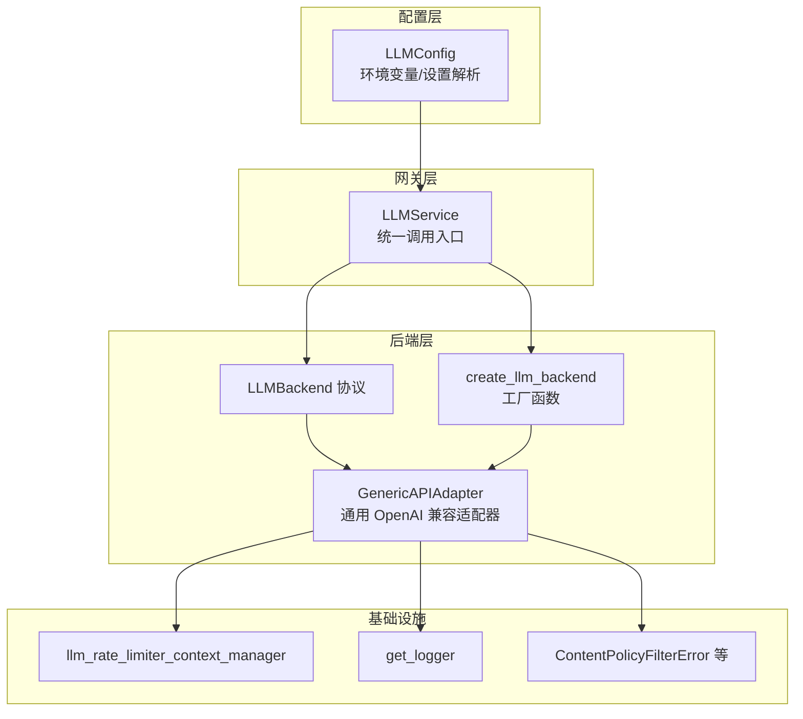
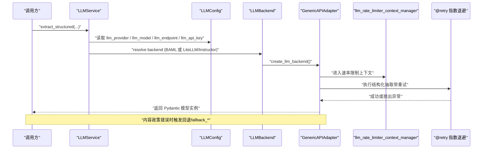
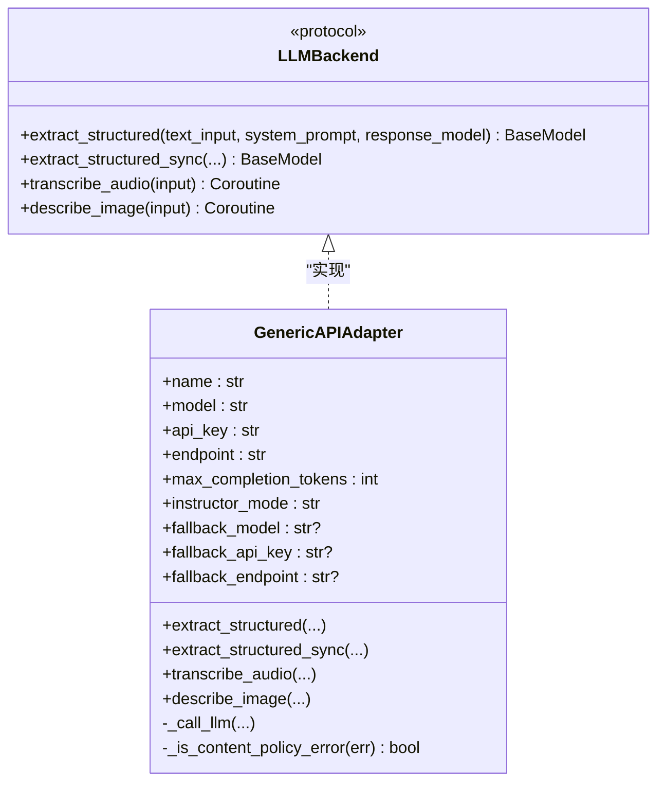
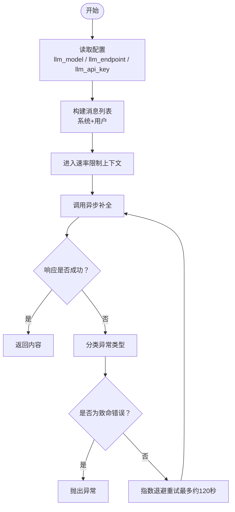
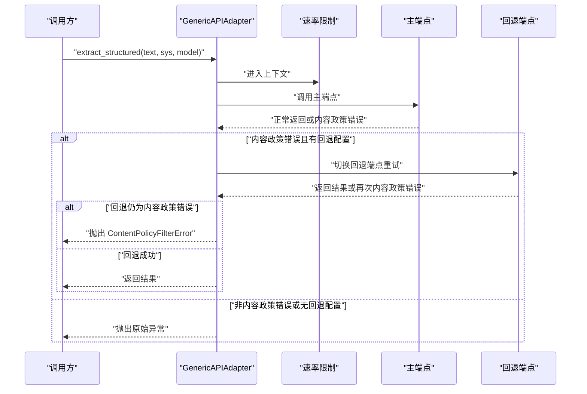
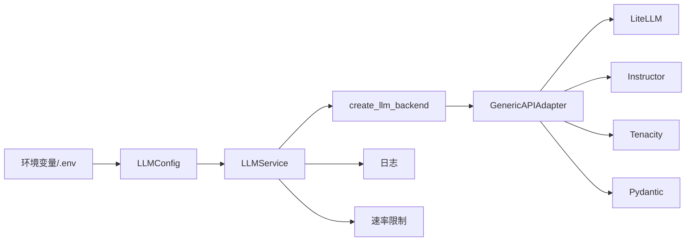

# 具体提供商适配器

<cite>
**本文引用的文件**
- [m_flow/llm/__init__.py](file://m_flow/llm/__init__.py)
- [m_flow/llm/config.py](file://m_flow/llm/config.py)
- [m_flow/llm/LLMGateway.py](file://m_flow/llm/LLMGateway.py)
- [m_flow/llm/utils.py](file://m_flow/llm/utils.py)
- [m_flow/llm/backends/litellm_instructor/llm/generic_llm_api/adapter.py](file://m_flow/llm/backends/litellm_instructor/llm/generic_llm_api/adapter.py)
- [m_flow/llm/backends/litellm_instructor/llm/llm_interface.py](file://m_flow/llm/backends/litellm_instructor/llm/llm_interface.py)
- [m_flow/llm/backends/litellm_instructor/llm/get_llm_client.py](file://m_flow/llm/backends/litellm_instructor/llm/get_llm_client.py)
- [m_flow/llm/exceptions.py](file://m_flow/llm/exceptions.py)
- [m_flow/shared/rate_limiting.py](file://m_flow/shared/rate_limiting.py)
- [m_flow/shared/logging_utils.py](file://m_flow/shared/logging_utils.py)
- [m_flow/config/settings/get_current_settings.py](file://m_flow/config/settings/get_current_settings.py)
- [m_flow/config/env_compat.py](file://m_flow/config/env_compat.py)
- [docs/CUSTOM_LLM_PROVIDERS.md](file://docs/CUSTOM_LLM_PROVIDERS.md)
</cite>

## 目录
1. [引言](#引言)
2. [项目结构](#项目结构)
3. [核心组件](#核心组件)
4. [架构总览](#架构总览)
5. [详细组件分析](#详细组件分析)
6. [依赖关系分析](#依赖关系分析)
7. [性能考量](#性能考量)
8. [故障排查指南](#故障排查指南)
9. [结论](#结论)
10. [附录](#附录)

## 引言
本文件系统性梳理并说明 M-Flow 中 LLM 提供商适配器的设计与实现，覆盖以下方面：
- 通用 LLM API 适配器（OpenAI 兼容）的设计与实现
- 配置参数、认证方式、API 端点与速率限制
- 支持自定义/第三方 LLM 提供商的机制与工厂模式
- 运行时提供商切换与回退策略
- 错误处理与异常恢复（含内容政策错误）
- 性能对比与选择建议

## 项目结构
围绕 LLM 的关键模块组织如下：
- 配置层：集中管理 LLM 提供商、模型、端点、密钥、温度、流式、最大补全长度等
- 网关层：统一入口，按配置在 BAML 与 LiteLLM/Instructor 后端之间动态选择
- 后端层：LiteLLM/Instructor 实现，包含通用 OpenAI 兼容适配器与协议接口
- 工具与基础设施：速率限制、日志、异常类型

**图表来源**
- [m_flow/llm/config.py:38-209](file://m_flow/llm/config.py#L38-L209)
- [m_flow/llm/LLMGateway.py:60-168](file://m_flow/llm/LLMGateway.py#L60-L168)
- [m_flow/llm/backends/litellm_instructor/llm/llm_interface.py](file://m_flow/llm/backends/litellm_instructor/llm/llm_interface.py)
- [m_flow/llm/backends/litellm_instructor/llm/generic_llm_api/adapter.py:44-161](file://m_flow/llm/backends/litellm_instructor/llm/generic_llm_api/adapter.py#L44-L161)
- [m_flow/llm/backends/litellm_instructor/llm/get_llm_client.py](file://m_flow/llm/backends/litellm_instructor/llm/get_llm_client.py)
- [m_flow/shared/rate_limiting.py](file://m_flow/shared/rate_limiting.py)
- [m_flow/shared/logging_utils.py](file://m_flow/shared/logging_utils.py)
- [m_flow/llm/exceptions.py](file://m_flow/llm/exceptions.py)

**章节来源**
- [m_flow/llm/__init__.py:1-15](file://m_flow/llm/__init__.py#L1-L15)
- [m_flow/llm/config.py:38-209](file://m_flow/llm/config.py#L38-L209)
- [m_flow/llm/LLMGateway.py:60-168](file://m_flow/llm/LLMGateway.py#L60-L168)

## 核心组件
- LLMConfig：集中管理 LLM 提供商、模型、端点、密钥、温度、流式、最大补全长度、BAML 设置、音频转录模型、提示模板路径、速率限制、回退模型与端点等；支持从环境变量与 .env 文件加载，并对引号进行清理；针对 Ollama 提供环境变量组一致性校验；当启用 BAML 后端时初始化 BAML 客户端注册表。
- LLMService：统一入口，负责结构化抽取、同步结构化抽取、音频转录、图像描述、文本补全等；在 BAML 与 LiteLLM/Instructor 间动态选择；对文本补全调用进行指数退避重试（除特定错误类型外）。
- GenericAPIAdapter：通用 OpenAI 兼容适配器，支持结构化输出、可选回退模型、内容政策错误自动回退、速率限制与日志记录。
- LLMBackend 协议：定义后端统一接口，确保不同提供商适配器的一致行为契约。
- create_llm_backend 工厂：根据配置动态创建适配器实例（含“custom”提供商走通用适配器）。

**章节来源**
- [m_flow/llm/config.py:38-209](file://m_flow/llm/config.py#L38-L209)
- [m_flow/llm/LLMGateway.py:60-168](file://m_flow/llm/LLMGateway.py#L60-L168)
- [m_flow/llm/backends/litellm_instructor/llm/generic_llm_api/adapter.py:44-161](file://m_flow/llm/backends/litellm_instructor/llm/generic_llm_api/adapter.py#L44-L161)
- [m_flow/llm/backends/litellm_instructor/llm/llm_interface.py](file://m_flow/llm/backends/litellm_instructor/llm/llm_interface.py)
- [m_flow/llm/backends/litellm_instructor/llm/get_llm_client.py](file://m_flow/llm/backends/litellm_instructor/llm/get_llm_client.py)

## 架构总览
下图展示 LLM 调用在配置、网关与后端之间的交互流程，以及错误重试与回退策略：

**图表来源**
- [m_flow/llm/LLMGateway.py:60-168](file://m_flow/llm/LLMGateway.py#L60-L168)
- [m_flow/llm/backends/litellm_instructor/llm/generic_llm_api/adapter.py:119-161](file://m_flow/llm/backends/litellm_instructor/llm/generic_llm_api/adapter.py#L119-L161)
- [m_flow/shared/rate_limiting.py](file://m_flow/shared/rate_limiting.py)

## 详细组件分析

### 通用 LLM API 适配器（OpenAI 兼容）
- 设计要点
  - 基于 LiteLLM 的异步客户端封装，通过 Instructor 提供结构化输出能力
  - 支持内容政策错误自动回退到备用模型/端点/密钥
  - 统一消息格式（用户+系统），支持最大补全长度与 Instructor 模式
  - 速率限制与日志记录集成
- 关键行为
  - 结构化抽取：在主端点失败且为内容政策相关错误时，自动切换至回退端点并重试
  - 文本补全：对瞬时错误进行指数退避重试，避免认证、请求格式、模型不存在等错误被重试
  - 错误分类：识别 OpenAI 内容过滤、LiteLLM 内容策略、Instructor 重试异常等
- 配置参数
  - endpoint：LLM 端点
  - api_key：访问密钥
  - model：模型名称
  - name：适配器名称
  - max_completion_tokens：最大补全 token 数
  - instructor_mode：Instructor 模式（默认 JSON 模式）
  - fallback_model/fallback_api_key/fallback_endpoint：回退配置（三者缺一不可）

**图表来源**
- [m_flow/llm/backends/litellm_instructor/llm/llm_interface.py](file://m_flow/llm/backends/litellm_instructor/llm/llm_interface.py)
- [m_flow/llm/backends/litellm_instructor/llm/generic_llm_api/adapter.py:44-161](file://m_flow/llm/backends/litellm_instructor/llm/generic_llm_api/adapter.py#L44-L161)

**章节来源**
- [m_flow/llm/backends/litellm_instructor/llm/generic_llm_api/adapter.py:44-161](file://m_flow/llm/backends/litellm_instructor/llm/generic_llm_api/adapter.py#L44-L161)

### 文本补全流程（指数退避重试）

**图表来源**
- [m_flow/llm/LLMGateway.py:126-167](file://m_flow/llm/LLMGateway.py#L126-L167)

**章节来源**
- [m_flow/llm/LLMGateway.py:126-167](file://m_flow/llm/LLMGateway.py#L126-L167)

### 结构化抽取与内容政策错误回退

**图表来源**
- [m_flow/llm/backends/litellm_instructor/llm/generic_llm_api/adapter.py:119-161](file://m_flow/llm/backends/litellm_instructor/llm/generic_llm_api/adapter.py#L119-L161)
- [m_flow/llm/exceptions.py](file://m_flow/llm/exceptions.py)

**章节来源**
- [m_flow/llm/backends/litellm_instructor/llm/generic_llm_api/adapter.py:119-161](file://m_flow/llm/backends/litellm_instructor/llm/generic_llm_api/adapter.py#L119-L161)
- [m_flow/llm/exceptions.py](file://m_flow/llm/exceptions.py)

### 配置与运行时选择策略
- 配置项概览
  - 主要 LLM：provider、model、endpoint、api_key、api_version、temperature、streaming、max_completion_tokens
  - BAML：provider/model/endpoint/api_key/temperature/api_version，以及运行时注册表
  - 音频转录：transcription_model
  - 提示模板：graph_prompt_path
  - 速率限制：llm_rate_limit_enabled、requests、interval；embedding_rate_limit_enabled、requests、interval
  - 回退 LLM：fallback_api_key、fallback_endpoint、fallback_model
  - Instructor 模式：llm_instructor_mode
- 运行时选择
  - LLMService 根据配置决定使用 BAML 或 LiteLLM/Instructor 后端
  - create_llm_backend 在 provider 为 custom 时创建 GenericAPIAdapter，其余情况由后端内部解析
  - Ollama 提供商需满足环境变量组一致性校验

**章节来源**
- [m_flow/llm/config.py:38-209](file://m_flow/llm/config.py#L38-L209)
- [m_flow/llm/LLMGateway.py:35-53](file://m_flow/llm/LLMGateway.py#L35-L53)
- [m_flow/llm/backends/litellm_instructor/llm/get_llm_client.py](file://m_flow/llm/backends/litellm_instructor/llm/get_llm_client.py)

### 自定义/第三方提供商支持
- 通过“custom”提供商与通用适配器实现 OpenAI 兼容端点接入
- 适配器支持指定 endpoint、api_key、model、instructor_mode、fallback_* 等参数
- 单元测试验证了工厂创建 GenericAPIAdapter 的行为与回退逻辑

**章节来源**
- [m_flow/llm/backends/litellm_instructor/llm/generic_llm_api/adapter.py:44-161](file://m_flow/llm/backends/litellm_instructor/llm/generic_llm_api/adapter.py#L44-L161)
- [m_flow/llm/backends/litellm_instructor/llm/get_llm_client.py](file://m_flow/llm/backends/litellm_instructor/llm/get_llm_client.py)
- [m_flow/llm/tests/unit/infrastructure/llm/test_generic_api_adapter.py:367-402](file://m_flow/llm/tests/unit/infrastructure/llm/test_generic_api_adapter.py#L367-L402)

## 依赖关系分析
- 配置层依赖环境兼容与设置加载模块，支持从 .env 与环境变量注入
- 网关层依赖配置与共享基础设施（日志、速率限制）
- 适配器层依赖 LiteLLM、Instructor、Tenacity、Pydantic，并通过协议约束后端实现
- 工厂函数负责根据配置创建适配器实例

**图表来源**
- [m_flow/llm/config.py:38-209](file://m_flow/llm/config.py#L38-L209)
- [m_flow/llm/LLMGateway.py:60-168](file://m_flow/llm/LLMGateway.py#L60-L168)
- [m_flow/llm/backends/litellm_instructor/llm/generic_llm_api/adapter.py:44-161](file://m_flow/llm/backends/litellm_instructor/llm/generic_llm_api/adapter.py#L44-L161)

**章节来源**
- [m_flow/llm/config.py:38-209](file://m_flow/llm/config.py#L38-L209)
- [m_flow/llm/LLMGateway.py:60-168](file://m_flow/llm/LLMGateway.py#L60-L168)
- [m_flow/llm/backends/litellm_instructor/llm/generic_llm_api/adapter.py:44-161](file://m_flow/llm/backends/litellm_instructor/llm/generic_llm_api/adapter.py#L44-L161)

## 性能考量
- 速率限制：统一的 LLM 速率限制上下文管理，避免突发流量导致限流或失败
- 指数退避重试：对瞬时网络/服务错误采用指数退避，上限约 120 秒，减少无效重试
- Instructor 模式：JSON 模式通常更稳定，工具调用模式适合复杂多步骤任务
- 最大补全长度：合理设置以平衡成本与质量
- 回退策略：在内容政策错误场景下自动切换回退端点，提升成功率

[本节为通用指导，无需列出具体文件来源]

## 故障排查指南
- 认证错误：检查 api_key 是否正确、endpoint 是否匹配提供商要求
- 请求格式错误：确认 messages 格式与模型支持的消息结构
- 模型不存在：核对 llm_model 名称与提供商端点
- 内容政策错误：若未配置回退端点/模型/密钥，将抛出 ContentPolicyFilterError；请配置 fallback_* 并确保三者齐全
- Ollama 环境变量：provider 为 ollama 时需满足 LLM 与 embedding 环境变量组一致性
- 日志定位：开启 DEBUG 级别日志以获取请求/响应详情

**章节来源**
- [m_flow/llm/LLMGateway.py:113-125](file://m_flow/llm/LLMGateway.py#L113-L125)
- [m_flow/llm/backends/litellm_instructor/llm/generic_llm_api/adapter.py:119-161](file://m_flow/llm/backends/litellm_instructor/llm/generic_llm_api/adapter.py#L119-L161)
- [m_flow/llm/config.py:111-127](file://m_flow/llm/config.py#L111-L127)
- [m_flow/llm/exceptions.py](file://m_flow/llm/exceptions.py)

## 结论
本设计通过统一配置与网关层，实现了对多种 LLM 提供商的抽象与切换；通用适配器以 OpenAI 兼容端点为核心，结合内容政策错误回退与指数退避重试，提升了鲁棒性与可用性；工厂模式与协议约束保证了扩展性与一致性。对于自定义/第三方提供商，仅需遵循 OpenAI 兼容规范即可快速接入。

[本节为总结性内容，无需列出具体文件来源]

## 附录

### 配置参数速查与最佳实践
- 主要 LLM 参数
  - provider：提供商标识（如 openai、anthropic、gemini、mistral、ollama、custom 等）
  - model：模型名称
  - endpoint：API 端点
  - api_key：访问密钥
  - temperature：采样温度
  - streaming：是否流式
  - max_completion_tokens：最大补全 token 数
- BAML 参数：provider/model/endpoint/api_key/temperature/api_version
- 速率限制：llm_rate_limit_enabled、requests、interval
- 回退 LLM：fallback_api_key、fallback_endpoint、fallback_model
- 最佳实践
  - 为高风险输入配置回退端点，避免内容政策错误导致失败
  - 使用 JSON 模式作为默认 Instructor 模式，必要时再切换工具调用模式
  - 合理设置 max_completion_tokens 与温度，权衡质量与成本
  - 对第三方自定义提供商，优先采用 OpenAI 兼容端点

**章节来源**
- [m_flow/llm/config.py:38-209](file://m_flow/llm/config.py#L38-L209)
- [m_flow/llm/backends/litellm_instructor/llm/generic_llm_api/adapter.py:56-82](file://m_flow/llm/backends/litellm_instructor/llm/generic_llm_api/adapter.py#L56-L82)

### 自定义提供商接入指南
- 通过“custom”提供商与通用适配器接入任意 OpenAI 兼容端点
- 若需第三方提供商（如 Anthropic、Gemini、Mistral），可在后端层扩展适配器并实现 LLMBackend 协议
- 参考文档：[自定义 LLM 提供商指南](file://docs/CUSTOM_LLM_PROVIDERS.md)

**章节来源**
- [m_flow/llm/backends/litellm_instructor/llm/generic_llm_api/adapter.py:44-161](file://m_flow/llm/backends/litellm_instructor/llm/generic_llm_api/adapter.py#L44-L161)
- [docs/CUSTOM_LLM_PROVIDERS.md](file://docs/CUSTOM_LLM_PROVIDERS.md)