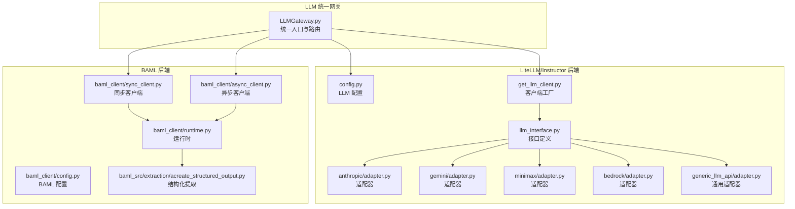
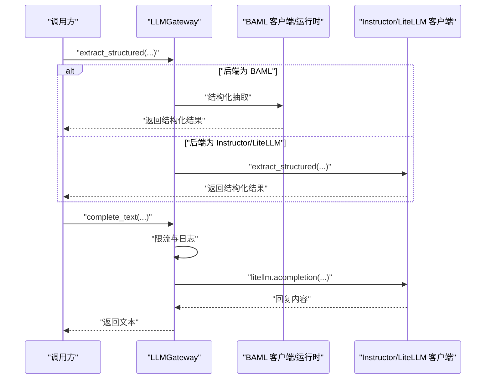
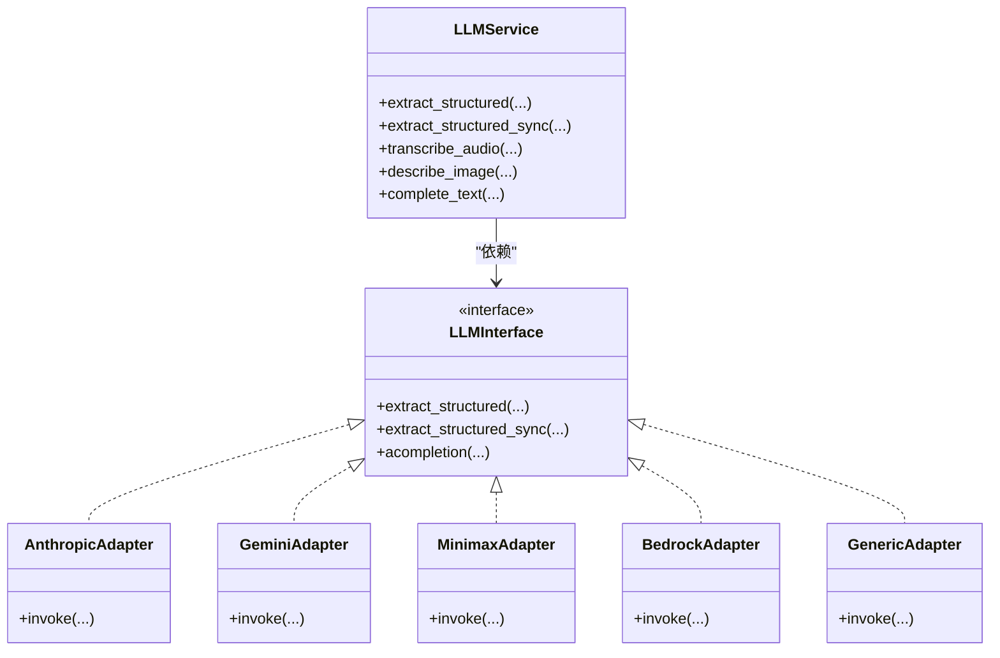
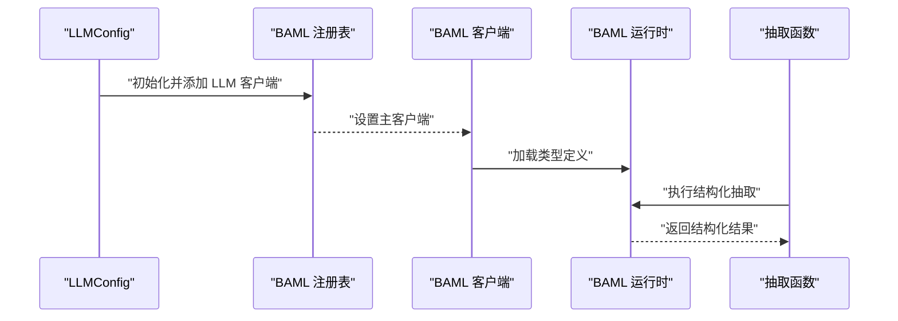
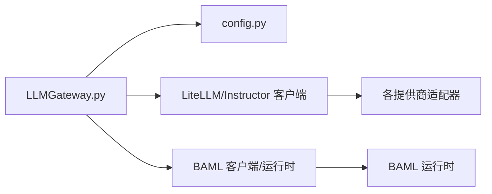

# 后端提供商

<cite>
**本文引用的文件**
- [m_flow/llm/backends/__init__.py](file://m_flow/llm/backends/__init__.py)
- [m_flow/llm/LLMGateway.py](file://m_flow/llm/LLMGateway.py)
- [m_flow/llm/config.py](file://m_flow/llm/config.py)
- [m_flow/llm/backends/litellm_instructor/llm/get_llm_client.py](file://m_flow/llm/backends/litellm_instructor/llm/get_llm_client.py)
- [m_flow/llm/backends/litellm_instructor/llm/llm_interface.py](file://m_flow/llm/backends/litellm_instructor/llm/llm_interface.py)
- [m_flow/llm/backends/litellm_instructor/llm/anthropic/adapter.py](file://m_flow/llm/backends/litellm_instructor/llm/anthropic/adapter.py)
- [m_flow/llm/backends/litellm_instructor/llm/gemini/adapter.py](file://m_flow/llm/backends/litellm_instructor/llm/gemini/adapter.py)
- [m_flow/llm/backends/litellm_instructor/llm/minimax/adapter.py](file://m_flow/llm/backends/litellm_instructor/llm/minimax/adapter.py)
- [m_flow/llm/backends/litellm_instructor/llm/bedrock/adapter.py](file://m_flow/llm/backends/litellm_instructor/llm/bedrock/adapter.py)
- [m_flow/llm/backends/litellm_instructor/llm/generic_llm_api/adapter.py](file://m_flow/llm/backends/litellm_instructor/llm/generic_llm_api/adapter.py)
- [m_flow/llm/backends/baml/baml_client/async_client.py](file://m_flow/llm/backends/baml/baml_client/async_client.py)
- [m_flow/llm/backends/baml/baml_client/sync_client.py](file://m_flow/llm/backends/baml/baml_client/sync_client.py)
- [m_flow/llm/backends/baml/baml_client/runtime.py](file://m_flow/llm/backends/baml/baml_client/runtime.py)
- [m_flow/llm/backends/baml/baml_src/extraction/acreate_structured_output.py](file://m_flow/llm/backends/baml/baml_src/extraction/acreate_structured_output.py)
- [m_flow/shared/rate_limiting.py](file://m_flow/shared/rate_limiting.py)
- [m_flow/shared/logging_utils.py](file://m_flow/shared/logging_utils.py)
- [m_flow/config/settings/get_current_settings.py](file://m_flow/config/settings/get_current_settings.py)
- [m_flow/config/env_compat.py](file://m_flow/config/env_compat.py)
- [docs/CUSTOM_LLM_PROVIDERS.md](file://docs/CUSTOM_LLM_PROVIDERS.md)
- [examples/test_llm_router.py](file://examples/test_llm_router.py)
- [m_flow/tests/unit/infrastructure/vector/embeddings/test_embedding_config_custom_provider.py](file://m_flow/tests/unit/infrastructure/vector/embeddings/test_embedding_config_custom_provider.py)
</cite>

## 目录
1. [简介](#简介)
2. [项目结构](#项目结构)
3. [核心组件](#核心组件)
4. [架构总览](#架构总览)
5. [详细组件分析](#详细组件分析)
6. [依赖分析](#依赖分析)
7. [性能考虑](#性能考虑)
8. [故障排查指南](#故障排查指南)
9. [结论](#结论)
10. [附录](#附录)

## 简介
本文件系统性梳理后端提供商在 M-Flow 中的实现与使用，重点覆盖以下方面：
- LiteLLM/Instructor 后端：模型适配、请求路由与响应处理
- BAML 后端：结构化输出提取的架构与运行机制
- 多 LLM 提供商适配器：OpenAI、Anthropic、Gemini、Mistral、Ollama、Bedrock 等
- 后端切换与运行时选择策略
- 负载均衡与故障转移（基于 LiteLLM 的能力）
- 性能监控与指标采集建议
- 扩展开发指南与测试策略

## 项目结构
后端相关代码主要位于 m_flow/llm 目录下，分为两大部分：
- LiteLLM/Instructor 后端：通过统一入口创建客户端并执行结构化抽取与文本补全等任务
- BAML 后端：通过 BAML 客户端与运行时生成结构化输出

图表来源
- [m_flow/llm/LLMGateway.py:1-168](file://m_flow/llm/LLMGateway.py#L1-L168)
- [m_flow/llm/config.py:1-209](file://m_flow/llm/config.py#L1-L209)
- [m_flow/llm/backends/litellm_instructor/llm/get_llm_client.py](file://m_flow/llm/backends/litellm_instructor/llm/get_llm_client.py)
- [m_flow/llm/backends/litellm_instructor/llm/llm_interface.py](file://m_flow/llm/backends/litellm_instructor/llm/llm_interface.py)
- [m_flow/llm/backends/litellm_instructor/llm/anthropic/adapter.py](file://m_flow/llm/backends/litellm_instructor/llm/anthropic/adapter.py)
- [m_flow/llm/backends/litellm_instructor/llm/gemini/adapter.py](file://m_flow/llm/backends/litellm_instructor/llm/gemini/adapter.py)
- [m_flow/llm/backends/litellm_instructor/llm/minimax/adapter.py](file://m_flow/llm/backends/litellm_instructor/llm/minimax/adapter.py)
- [m_flow/llm/backends/litellm_instructor/llm/bedrock/adapter.py](file://m_flow/llm/backends/litellm_instructor/llm/bedrock/adapter.py)
- [m_flow/llm/backends/litellm_instructor/llm/generic_llm_api/adapter.py](file://m_flow/llm/backends/litellm_instructor/llm/generic_llm_api/adapter.py)
- [m_flow/llm/backends/baml/baml_client/config.py](file://m_flow/llm/backends/baml/baml_client/config.py)
- [m_flow/llm/backends/baml/baml_client/runtime.py](file://m_flow/llm/backends/baml/baml_client/runtime.py)
- [m_flow/llm/backends/baml/baml_client/sync_client.py](file://m_flow/llm/backends/baml/baml_client/sync_client.py)
- [m_flow/llm/backends/baml/baml_client/async_client.py](file://m_flow/llm/backends/baml/baml_client/async_client.py)
- [m_flow/llm/backends/baml/baml_src/extraction/acreate_structured_output.py](file://m_flow/llm/backends/baml/baml_src/extraction/acreate_structured_output.py)

章节来源
- [m_flow/llm/LLMGateway.py:1-168](file://m_flow/llm/LLMGateway.py#L1-L168)
- [m_flow/llm/config.py:1-209](file://m_flow/llm/config.py#L1-L209)

## 核心组件
- LLM 统一网关（LLMGateway）：负责根据配置在 BAML 与 LiteLLM/Instructor 之间进行后端切换，并提供结构化抽取、音频转录、图像描述与纯文本补全等统一 API。
- LiteLLM/Instructor 客户端工厂：按配置动态创建对应提供商的客户端实例，支持多种适配器（如 Anthropic、Gemini、Minimax、Bedrock、Generic API）。
- BAML 客户端与运行时：在启用 BAML 后端时，初始化 BAML 注册表与 LLM 客户端，运行时生成结构化类型并执行抽取。
- 配置系统（LLMConfig）：集中管理主 LLM、BAML LLM、速率限制、回退 LLM、提示模板等参数。

章节来源
- [m_flow/llm/LLMGateway.py:60-168](file://m_flow/llm/LLMGateway.py#L60-L168)
- [m_flow/llm/config.py:38-209](file://m_flow/llm/config.py#L38-L209)

## 架构总览
后端切换与调用流程如下：

图表来源
- [m_flow/llm/LLMGateway.py:60-168](file://m_flow/llm/LLMGateway.py#L60-L168)

## 详细组件分析

### LiteLLM/Instructor 后端
- 客户端工厂与接口
  - 工厂方法按配置创建具体提供商客户端，接口定义统一的结构化抽取与文本补全签名。
  - 支持多种适配器，覆盖主流 LLM 提供商与平台（如 Anthropic、Gemini、Minimax、Bedrock、Generic API）。
- 请求路由与响应处理
  - 文本补全通过 litellm.acompletion 发起，自动应用指数退避重试策略（对非终端错误重试），并在调用前后记录日志与限流。
  - 结构化抽取通过 Instructor/LiteLLM 客户端完成，支持同步与异步两种模式。
- 模型适配
  - 通过适配器封装不同提供商的差异，统一输入输出格式；通用 API 适配器用于兼容非标准接口。
  - Ollama 等特殊提供商的环境变量一致性校验由配置模块保障。

图表来源
- [m_flow/llm/LLMGateway.py:60-168](file://m_flow/llm/LLMGateway.py#L60-L168)
- [m_flow/llm/backends/litellm_instructor/llm/llm_interface.py](file://m_flow/llm/backends/litellm_instructor/llm/llm_interface.py)
- [m_flow/llm/backends/litellm_instructor/llm/anthropic/adapter.py](file://m_flow/llm/backends/litellm_instructor/llm/anthropic/adapter.py)
- [m_flow/llm/backends/litellm_instructor/llm/gemini/adapter.py](file://m_flow/llm/backends/litellm_instructor/llm/gemini/adapter.py)
- [m_flow/llm/backends/litellm_instructor/llm/minimax/adapter.py](file://m_flow/llm/backends/litellm_instructor/llm/minimax/adapter.py)
- [m_flow/llm/backends/litellm_instructor/llm/bedrock/adapter.py](file://m_flow/llm/backends/litellm_instructor/llm/bedrock/adapter.py)
- [m_flow/llm/backends/litellm_instructor/llm/generic_llm_api/adapter.py](file://m_flow/llm/backends/litellm_instructor/llm/generic_llm_api/adapter.py)

章节来源
- [m_flow/llm/LLMGateway.py:35-168](file://m_flow/llm/LLMGateway.py#L35-L168)
- [m_flow/llm/backends/litellm_instructor/llm/get_llm_client.py](file://m_flow/llm/backends/litellm_instructor/llm/get_llm_client.py)
- [m_flow/llm/backends/litellm_instructor/llm/llm_interface.py](file://m_flow/llm/backends/litellm_instructor/llm/llm_interface.py)
- [m_flow/llm/config.py:111-127](file://m_flow/llm/config.py#L111-L127)

### BAML 后端
- 运行时与注册表
  - 当后端选择为 BAML 时，配置模块初始化 BAML 注册表并添加 LLM 客户端，设置主客户端。
  - BAML 客户端提供同步与异步两类实现，分别用于不同场景下的结构化抽取。
- 结构化输出提取
  - 运行时根据 BAML 类型定义生成结构化类型，并通过抽取函数执行抽取逻辑。
  - 抽取函数接收文本输入、系统提示与响应模型，返回结构化结果。

图表来源
- [m_flow/llm/config.py:129-151](file://m_flow/llm/config.py#L129-L151)
- [m_flow/llm/backends/baml/baml_client/sync_client.py](file://m_flow/llm/backends/baml/baml_client/sync_client.py)
- [m_flow/llm/backends/baml/baml_client/async_client.py](file://m_flow/llm/backends/baml/baml_client/async_client.py)
- [m_flow/llm/backends/baml/baml_client/runtime.py](file://m_flow/llm/backends/baml/baml_client/runtime.py)
- [m_flow/llm/backends/baml/baml_src/extraction/acreate_structured_output.py](file://m_flow/llm/backends/baml/baml_src/extraction/acreate_structured_output.py)

章节来源
- [m_flow/llm/config.py:129-151](file://m_flow/llm/config.py#L129-L151)
- [m_flow/llm/backends/baml/baml_client/sync_client.py](file://m_flow/llm/backends/baml/baml_client/sync_client.py)
- [m_flow/llm/backends/baml/baml_client/async_client.py](file://m_flow/llm/backends/baml/baml_client/async_client.py)
- [m_flow/llm/backends/baml/baml_client/runtime.py](file://m_flow/llm/backends/baml/baml_client/runtime.py)
- [m_flow/llm/backends/baml/baml_src/extraction/acreate_structured_output.py](file://m_flow/llm/backends/baml/baml_src/extraction/acreate_structured_output.py)

### 多 LLM 提供商适配器
- OpenAI：通过通用 API 适配器或直接使用 LiteLLM 接口
- Anthropic：专用适配器封装 Claude 系列模型
- Gemini：专用适配器封装 Google Gemini 模型
- Mistral：可通过通用 API 适配器或 LiteLLM 接口
- Ollama：配置模块提供环境变量一致性校验
- Bedrock：AWS Bedrock 专用适配器
- 其他：Generic API 适配器用于兼容非标准接口

章节来源
- [m_flow/llm/backends/litellm_instructor/llm/anthropic/adapter.py](file://m_flow/llm/backends/litellm_instructor/llm/anthropic/adapter.py)
- [m_flow/llm/backends/litellm_instructor/llm/gemini/adapter.py](file://m_flow/llm/backends/litellm_instructor/llm/gemini/adapter.py)
- [m_flow/llm/backends/litellm_instructor/llm/minimax/adapter.py](file://m_flow/llm/backends/litellm_instructor/llm/minimax/adapter.py)
- [m_flow/llm/backends/litellm_instructor/llm/bedrock/adapter.py](file://m_flow/llm/backends/litellm_instructor/llm/bedrock/adapter.py)
- [m_flow/llm/backends/litellm_instructor/llm/generic_llm_api/adapter.py](file://m_flow/llm/backends/litellm_instructor/llm/generic_llm_api/adapter.py)
- [m_flow/llm/config.py:111-127](file://m_flow/llm/config.py#L111-L127)

### 后端切换与运行时选择策略
- 切换依据：从共享 LLM 配置中读取后端标识，决定走 BAML 或 LiteLLM/Instructor 路径。
- 运行时解析：在每次调用前进行后端判断，避免全局状态耦合。
- 配置优先级：主 LLM 参数与 BAML LLM 参数可独立配置，互不影响。

章节来源
- [m_flow/llm/LLMGateway.py:35-53](file://m_flow/llm/LLMGateway.py#L35-L53)
- [m_flow/llm/config.py:46-67](file://m_flow/llm/config.py#L46-L67)

### 负载均衡与故障转移
- 基于 LiteLLM 的能力：通过其内置的路由与重试机制实现多后端间的负载均衡与故障转移。
- 重试策略：对瞬时错误采用指数退避重试，避免对下游造成冲击。
- 回退 LLM：配置中提供回退 API Key、Endpoint 与 Model，作为兜底方案。

章节来源
- [m_flow/llm/LLMGateway.py:113-125](file://m_flow/llm/LLMGateway.py#L113-L125)
- [m_flow/llm/config.py:85-88](file://m_flow/llm/config.py#L85-L88)

### 性能监控与指标采集
- 日志：在文本补全前后记录请求与响应的关键信息，便于追踪与审计。
- 速率限制：提供 LLM 与嵌入的速率限制配置，避免触发上游限流。
- 指标建议：结合日志与速率限制，可统计请求延迟、成功率、重试次数与错误分布，形成基础指标。

章节来源
- [m_flow/llm/LLMGateway.py:137-167](file://m_flow/llm/LLMGateway.py#L137-L167)
- [m_flow/shared/rate_limiting.py](file://m_flow/shared/rate_limiting.py)
- [m_flow/shared/logging_utils.py](file://m_flow/shared/logging_utils.py)

### 扩展开发指南
- 新增提供商适配器：参考现有适配器（如 Anthropic/Gemini/Minimax/Bedrock/Generic），实现统一接口并接入客户端工厂。
- 自定义 BAML 类型：在 BAML 源码中新增类型定义与抽取函数，确保运行时可正确加载。
- 配置扩展：在 LLMConfig 中增加必要的环境变量与默认值，必要时添加校验逻辑。
- 参考文档：查看自定义 LLM 提供商开发指南以获得更详细的步骤与最佳实践。

章节来源
- [docs/CUSTOM_LLM_PROVIDERS.md](file://docs/CUSTOM_LLM_PROVIDERS.md)
- [m_flow/llm/backends/litellm_instructor/llm/llm_interface.py](file://m_flow/llm/backends/litellm_instructor/llm/llm_interface.py)
- [m_flow/llm/config.py:129-151](file://m_flow/llm/config.py#L129-L151)

### 测试策略与质量保证
- 单元测试：针对配置校验与环境变量一致性进行断言，确保 Ollama 等特殊提供商的环境变量完整。
- 集成测试：通过示例脚本验证 LLM 路由与后端切换行为，确保结构化抽取与文本补全正常工作。
- 质量保证：结合日志与速率限制，持续监控请求成功率与延迟，及时发现异常。

章节来源
- [m_flow/tests/unit/infrastructure/vector/embeddings/test_embedding_config_custom_provider.py](file://m_flow/tests/unit/infrastructure/vector/embeddings/test_embedding_config_custom_provider.py)
- [examples/test_llm_router.py](file://examples/test_llm_router.py)

## 依赖分析
- 组件内聚与耦合
  - LLMGateway 对配置与客户端工厂存在依赖，但通过延迟导入与运行时解析降低耦合度。
  - BAML 后端与配置模块存在初始化依赖，确保在启用 BAML 时正确建立注册表与客户端。
- 外部依赖
  - LiteLLM：提供统一补全接口与重试机制
  - BAML：提供结构化类型生成与抽取运行时
  - Pydantic：用于配置模型与校验
  - tenacity：用于重试策略

图表来源
- [m_flow/llm/LLMGateway.py:1-168](file://m_flow/llm/LLMGateway.py#L1-L168)
- [m_flow/llm/config.py:1-209](file://m_flow/llm/config.py#L1-L209)

章节来源
- [m_flow/llm/LLMGateway.py:1-168](file://m_flow/llm/LLMGateway.py#L1-L168)
- [m_flow/llm/config.py:1-209](file://m_flow/llm/config.py#L1-L209)

## 性能考虑
- 重试与退避：对瞬时错误采用指数退避重试，减少抖动与拥塞。
- 速率限制：开启 LLM 与嵌入的速率限制，避免触发上游限流。
- 日志采样：在高并发场景下注意日志级别与字段，避免成为性能瓶颈。
- 异步优先：文本补全与结构化抽取尽量使用异步接口，提升吞吐。

## 故障排查指南
- 后端切换无效
  - 检查后端配置项是否正确设置，确认运行时解析逻辑生效。
- BAML 未安装或初始化失败
  - 确认已安装 BAML 依赖，检查配置模块中的注册表初始化逻辑。
- Ollama 环境变量不一致
  - 使用配置模块提供的校验逻辑，确保 LLM 与嵌入相关变量成组设置。
- 重试过多导致延迟
  - 检查重试策略与错误分类，确认是否为瞬时错误；适当调整退避参数。
- 速率限制触发
  - 查看速率限制配置，评估请求频率与窗口大小，必要时扩容或降频。

章节来源
- [m_flow/llm/LLMGateway.py:113-125](file://m_flow/llm/LLMGateway.py#L113-L125)
- [m_flow/llm/config.py:111-127](file://m_flow/llm/config.py#L111-L127)
- [m_flow/config/env_compat.py](file://m_flow/config/env_compat.py)
- [m_flow/config/settings/get_current_settings.py](file://m_flow/config/settings/get_current_settings.py)

## 结论
本文件系统性阐述了 M-Flow 后端提供商的实现与使用，涵盖 LiteLLM/Instructor 与 BAML 两大后端路径、多提供商适配器、后端切换策略、负载均衡与故障转移、性能监控与扩展开发指南。通过统一网关与配置中心，系统实现了灵活、可扩展且可观测的 LLM 能力接入。

## 附录
- 相关文件索引
  - [m_flow/llm/backends/__init__.py](file://m_flow/llm/backends/__init__.py)
  - [m_flow/llm/LLMGateway.py](file://m_flow/llm/LLMGateway.py)
  - [m_flow/llm/config.py](file://m_flow/llm/config.py)
  - [m_flow/llm/backends/litellm_instructor/llm/get_llm_client.py](file://m_flow/llm/backends/litellm_instructor/llm/get_llm_client.py)
  - [m_flow/llm/backends/litellm_instructor/llm/llm_interface.py](file://m_flow/llm/backends/litellm_instructor/llm/llm_interface.py)
  - [m_flow/llm/backends/litellm_instructor/llm/anthropic/adapter.py](file://m_flow/llm/backends/litellm_instructor/llm/anthropic/adapter.py)
  - [m_flow/llm/backends/litellm_instructor/llm/gemini/adapter.py](file://m_flow/llm/backends/litellm_instructor/llm/gemini/adapter.py)
  - [m_flow/llm/backends/litellm_instructor/llm/minimax/adapter.py](file://m_flow/llm/backends/litellm_instructor/llm/minimax/adapter.py)
  - [m_flow/llm/backends/litellm_instructor/llm/bedrock/adapter.py](file://m_flow/llm/backends/litellm_instructor/llm/bedrock/adapter.py)
  - [m_flow/llm/backends/litellm_instructor/llm/generic_llm_api/adapter.py](file://m_flow/llm/backends/litellm_instructor/llm/generic_llm_api/adapter.py)
  - [m_flow/llm/backends/baml/baml_client/async_client.py](file://m_flow/llm/backends/baml/baml_client/async_client.py)
  - [m_flow/llm/backends/baml/baml_client/sync_client.py](file://m_flow/llm/backends/baml/baml_client/sync_client.py)
  - [m_flow/llm/backends/baml/baml_client/runtime.py](file://m_flow/llm/backends/baml/baml_client/runtime.py)
  - [m_flow/llm/backends/baml/baml_src/extraction/acreate_structured_output.py](file://m_flow/llm/backends/baml/baml_src/extraction/acreate_structured_output.py)
  - [m_flow/shared/rate_limiting.py](file://m_flow/shared/rate_limiting.py)
  - [m_flow/shared/logging_utils.py](file://m_flow/shared/logging_utils.py)
  - [m_flow/config/settings/get_current_settings.py](file://m_flow/config/settings/get_current_settings.py)
  - [m_flow/config/env_compat.py](file://m_flow/config/env_compat.py)
  - [docs/CUSTOM_LLM_PROVIDERS.md](file://docs/CUSTOM_LLM_PROVIDERS.md)
  - [examples/test_llm_router.py](file://examples/test_llm_router.py)
  - [m_flow/tests/unit/infrastructure/vector/embeddings/test_embedding_config_custom_provider.py](file://m_flow/tests/unit/infrastructure/vector/embeddings/test_embedding_config_custom_provider.py)