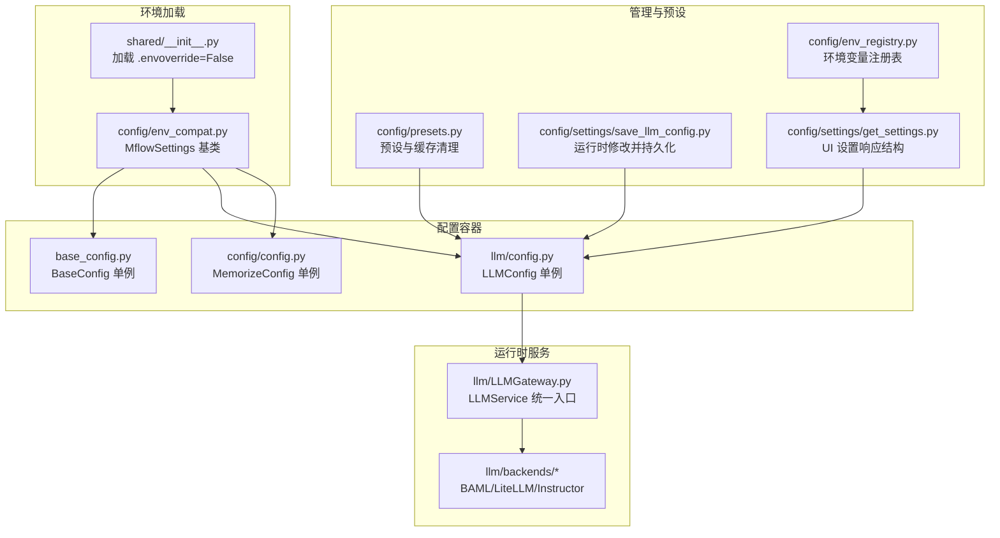
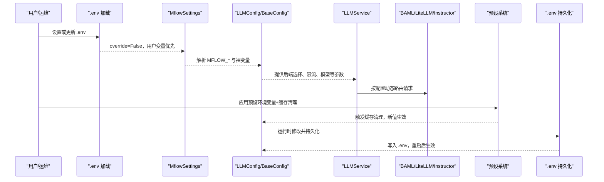
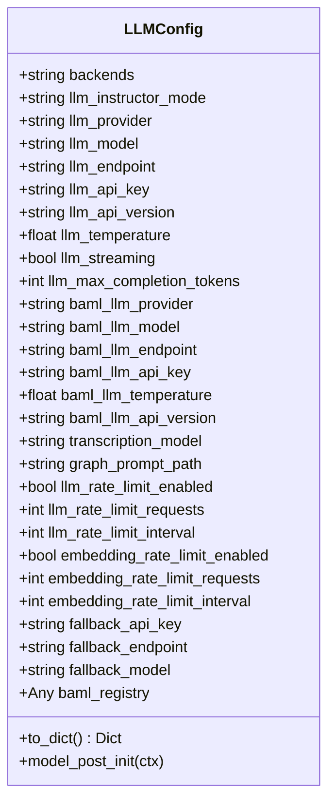
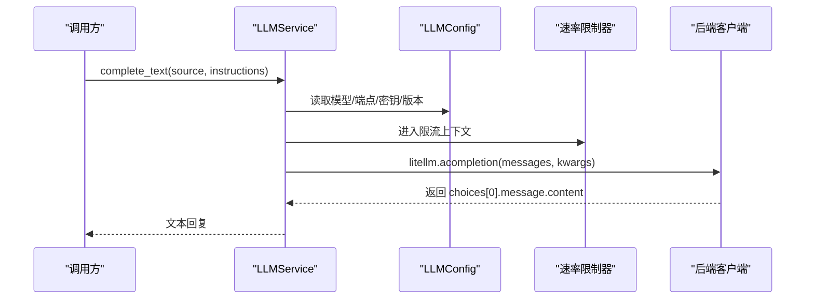
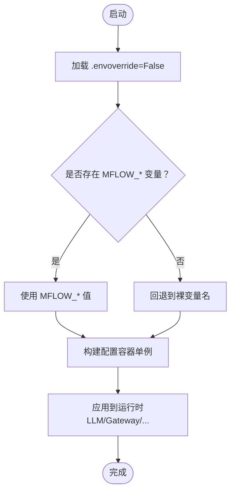
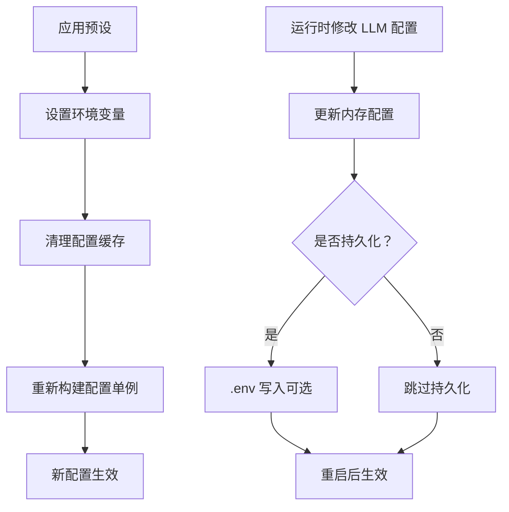
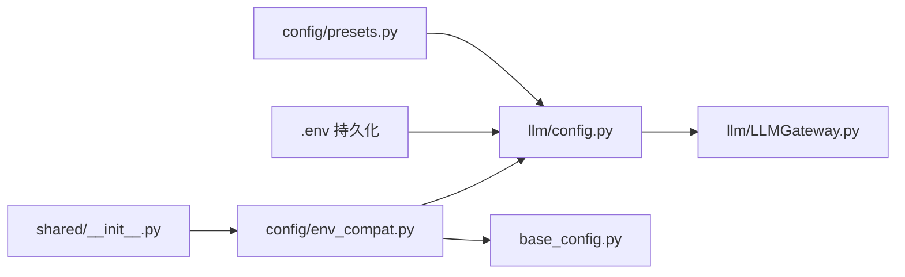

# 后端配置管理

<cite>
**本文引用的文件**
- [m_flow/llm/config.py](file://m_flow/llm/config.py)
- [m_flow/config/config.py](file://m_flow/config/config.py)
- [m_flow/base_config.py](file://m_flow/base_config.py)
- [m_flow/config/env_compat.py](file://m_flow/config/env_compat.py)
- [m_flow/config/settings/get_settings.py](file://m_flow/config/settings/get_settings.py)
- [m_flow/config/settings/save_llm_config.py](file://m_flow/config/settings/save_llm_config.py)
- [m_flow/config/presets.py](file://m_flow/config/presets.py)
- [m_flow/llm/LLMGateway.py](file://m_flow/llm/LLMGateway.py)
- [m_flow/shared/__init__.py](file://m_flow/shared/__init__.py)
- [m_flow/config/env_registry.py](file://m_flow/config/env_registry.py)
- [m_flow/adapters/cache/config.py](file://m_flow/adapters/cache/config.py)
- [m_flow/coreference/configs/config.yaml](file://m_flow/coreference/configs/config.yaml)
- [m_flow/llm/backends/litellm_instructor/__init__.py](file://m_flow/llm/backends/litellm_instructor/__init__.py)
- [m_flow/llm/backends/__init__.py](file://m_flow/llm/backends/__init__.py)
</cite>

## 目录
1. [简介](#简介)
2. [项目结构](#项目结构)
3. [核心组件](#核心组件)
4. [架构总览](#架构总览)
5. [详细组件分析](#详细组件分析)
6. [依赖分析](#依赖分析)
7. [性能考虑](#性能考虑)
8. [故障排查指南](#故障排查指南)
9. [结论](#结论)
10. [附录](#附录)

## 简介
本文件系统性梳理 M-Flow 后端配置管理体系，涵盖全局配置、LLM 提供商配置与运行时配置；解释配置加载与验证机制、优先级与覆盖规则；阐述 LLM Gateway 的设计与实现（后端选择策略、重试与限流）；介绍配置热更新与动态调整；给出配置文件格式与参数说明、常见场景模板、验证与错误处理机制，以及优化与性能调优建议。

## 项目结构
配置体系围绕“环境变量兼容层 + 单例配置容器 + 运行时网关 + 预设与持久化”的模式组织，关键模块如下：
- 环境变量兼容层：统一读取 MFLOW_ 前缀变量，并回退到裸变量名，确保向后兼容
- 全局基础配置：路径、可观测性等根级配置
- LLM 配置：提供商、模型、端点、密钥、温度、流式、速率限制、回退模型等
- 结构化输出框架：BAML 与 LiteLLM/Instructor 双后端
- LLM Gateway：统一入口，按配置动态选择后端，封装重试与限流
- 预设与持久化：一键切换场景、运行时修改并持久化到 .env
- 环境变量注册表：集中导出当前生效的环境变量快照

**图表来源**
- [m_flow/shared/__init__.py:22-41](file://m_flow/shared/__init__.py#L22-L41)
- [m_flow/config/env_compat.py:21-46](file://m_flow/config/env_compat.py#L21-L46)
- [m_flow/base_config.py:47-121](file://m_flow/base_config.py#L47-L121)
- [m_flow/llm/config.py:38-209](file://m_flow/llm/config.py#L38-L209)
- [m_flow/config/config.py:21-83](file://m_flow/config/config.py#L21-L83)
- [m_flow/llm/LLMGateway.py:60-168](file://m_flow/llm/LLMGateway.py#L60-L168)
- [m_flow/config/presets.py:58-102](file://m_flow/config/presets.py#L58-L102)
- [m_flow/config/settings/save_llm_config.py:30-68](file://m_flow/config/settings/save_llm_config.py#L30-L68)
- [m_flow/config/settings/get_settings.py:123-151](file://m_flow/config/settings/get_settings.py#L123-L151)
- [m_flow/config/env_registry.py:303-352](file://m_flow/config/env_registry.py#L303-L352)

**章节来源**
- [m_flow/shared/__init__.py:22-41](file://m_flow/shared/__init__.py#L22-L41)
- [m_flow/config/env_compat.py:21-46](file://m_flow/config/env_compat.py#L21-L46)
- [m_flow/base_config.py:47-121](file://m_flow/base_config.py#L47-L121)
- [m_flow/llm/config.py:38-209](file://m_flow/llm/config.py#L38-L209)
- [m_flow/config/config.py:21-83](file://m_flow/config/config.py#L21-L83)
- [m_flow/llm/LLMGateway.py:60-168](file://m_flow/llm/LLMGateway.py#L60-L168)
- [m_flow/config/presets.py:58-102](file://m_flow/config/presets.py#L58-L102)
- [m_flow/config/settings/save_llm_config.py:30-68](file://m_flow/config/settings/save_llm_config.py#L30-L68)
- [m_flow/config/settings/get_settings.py:123-151](file://m_flow/config/settings/get_settings.py#L123-L151)
- [m_flow/config/env_registry.py:303-352](file://m_flow/config/env_registry.py#L303-L352)

## 核心组件
- 环境变量兼容层（MflowSettings）
  - 默认前缀为 MFLOW_，同时回退到裸变量名，确保旧部署可用
  - 支持从 .env 文件加载，且 override=False，用户环境变量优先
- 全局基础配置（BaseConfig）
  - 定义数据、系统、缓存、日志根目录，支持 S3 自动推断缓存路径
  - 自动启用 Langfuse 观测性（当凭据存在时）
- LLM 配置（LLMConfig）
  - 提供商、模型、端点、密钥、版本、温度、流式、最大补全 token 数
  - 结构化输出框架（backends）、BAML 注册表初始化
  - 速率限制（LLM 与嵌入）、回退模型
  - Ollama 环境组一致性校验、字段去引号处理
- LLM Gateway（LLMService）
  - 动态后端解析：BAML 或 LiteLLM/Instructor
  - 统一结构化抽取、音频转写、图像描述、文本补全
  - 补全接口自动重试与速率限制
- 预设与持久化（presets、save_llm_config）
  - 场景化一键切换（快速开始、生产、本地 LLM、企业文档）
  - 运行时修改 LLM 配置并可选持久化至 .env
- 环境变量注册表（env_registry）
  - 导出带分类、类型、敏感度标记的当前环境变量快照

**章节来源**
- [m_flow/config/env_compat.py:21-46](file://m_flow/config/env_compat.py#L21-L46)
- [m_flow/base_config.py:47-121](file://m_flow/base_config.py#L47-L121)
- [m_flow/llm/config.py:38-209](file://m_flow/llm/config.py#L38-L209)
- [m_flow/llm/LLMGateway.py:60-168](file://m_flow/llm/LLMGateway.py#L60-L168)
- [m_flow/config/presets.py:58-102](file://m_flow/config/presets.py#L58-L102)
- [m_flow/config/settings/save_llm_config.py:30-68](file://m_flow/config/settings/save_llm_config.py#L30-L68)
- [m_flow/config/env_registry.py:303-352](file://m_flow/config/env_registry.py#L303-L352)

## 架构总览
下图展示配置加载、验证、运行时选择与持久化的整体流程。

**图表来源**
- [m_flow/shared/__init__.py:22-41](file://m_flow/shared/__init__.py#L22-L41)
- [m_flow/config/env_compat.py:36-46](file://m_flow/config/env_compat.py#L36-L46)
- [m_flow/llm/config.py:99-151](file://m_flow/llm/config.py#L99-L151)
- [m_flow/llm/LLMGateway.py:126-168](file://m_flow/llm/LLMGateway.py#L126-L168)
- [m_flow/config/presets.py:136-160](file://m_flow/config/presets.py#L136-L160)
- [m_flow/config/settings/save_llm_config.py:30-68](file://m_flow/config/settings/save_llm_config.py#L30-L68)

## 详细组件分析

### LLM 配置容器与验证
- 字段覆盖范围
  - 结构化输出框架：backends、llm_instructor_mode
  - 主 LLM：provider、model、endpoint、api_key、api_version、temperature、streaming、max_completion_tokens
  - BAML：baml_llm_* 对应项
  - 音频：transcription_model
  - 提示词：graph_prompt_path
  - 速率限制：LLM 与嵌入分别独立开关与配额
  - 回退：fallback_api_key、fallback_endpoint、fallback_model
- 校验与清理
  - 字段去引号：对常见字符串字段去除首尾引号（解决 .env 引号残留）
  - Ollama 环境组一致性：要求 LLM 与 Embedding 组内变量成组出现
  - BAML 初始化：安装检测与注册表构建
- 序列化与访问
  - to_dict 输出标准化字典，便于 UI 展示与持久化
  - 单例缓存：LRU 缓存提升访问性能

**图表来源**
- [m_flow/llm/config.py:38-181](file://m_flow/llm/config.py#L38-L181)

**章节来源**
- [m_flow/llm/config.py:38-209](file://m_flow/llm/config.py#L38-L209)

### LLM Gateway 设计与实现
- 后端选择策略
  - 通过配置 backends 判断是否使用 BAML
  - 动态导入对应提取器或 Instructor 客户端
- 统一 API
  - extract_structured / extract_structured_sync：结构化抽取（异步/同步）
  - transcribe_audio / describe_image：多媒体处理
  - complete_text：原始文本补全（带指数退避重试与速率限制）
- 重试与限流
  - 补全接口采用指数退避抖动与延迟停止
  - 重试排除认证、请求错误等不可重试异常
  - 速率限制由上下文管理器统一注入

**图表来源**
- [m_flow/llm/LLMGateway.py:126-168](file://m_flow/llm/LLMGateway.py#L126-L168)
- [m_flow/llm/config.py:130-151](file://m_flow/llm/config.py#L130-L151)

**章节来源**
- [m_flow/llm/LLMGateway.py:60-168](file://m_flow/llm/LLMGateway.py#L60-L168)

### 配置加载与优先级
- 环境加载顺序
  - shared/__init__.py 在模块导入时执行 dotenv 加载，override=False
  - 用户显式设置的环境变量优先于 .env 文件中的同名变量
- 变量前缀与回退
  - 默认读取 MFLOW_* 前缀变量
  - 若未设置，则回退到裸变量名（如 LLM_API_KEY），保障兼容性
- 配置单例与缓存
  - 所有配置容器均使用 LRU 缓存单例，首次访问构建，后续复用
  - 修改环境变量后需清理缓存以使新值生效

**图表来源**
- [m_flow/shared/__init__.py:22-41](file://m_flow/shared/__init__.py#L22-L41)
- [m_flow/config/env_compat.py:36-46](file://m_flow/config/env_compat.py#L36-L46)

**章节来源**
- [m_flow/shared/__init__.py:22-41](file://m_flow/shared/__init__.py#L22-L41)
- [m_flow/config/env_compat.py:21-46](file://m_flow/config/env_compat.py#L21-L46)

### 配置热更新与动态调整
- 预设系统
  - 一键应用一组环境变量与可选配置覆盖
  - 应用后自动清理相关配置缓存，确保新值立即生效
- 运行时修改并持久化
  - 通过 DTO 更新 LLM 配置，仅在提供真实密钥时写入
  - 可选持久化到 .env，重启后生效
- 缓存清理清单
  - 包含 LLM、基础、记忆化、向量、图、关系、迁移、缓存、分块、S3、指称消解等多类配置函数

**图表来源**
- [m_flow/config/presets.py:136-160](file://m_flow/config/presets.py#L136-L160)
- [m_flow/config/presets.py:58-102](file://m_flow/config/presets.py#L58-L102)
- [m_flow/config/settings/save_llm_config.py:30-68](file://m_flow/config/settings/save_llm_config.py#L30-L68)

**章节来源**
- [m_flow/config/presets.py:58-102](file://m_flow/config/presets.py#L58-L102)
- [m_flow/config/presets.py:136-160](file://m_flow/config/presets.py#L136-L160)
- [m_flow/config/settings/save_llm_config.py:30-68](file://m_flow/config/settings/save_llm_config.py#L30-L68)

### 配置文件格式与参数说明
- .env 文件
  - 通过 dotenv 加载，override=False，用户变量优先
  - 支持 MFLOW_ 前缀与裸变量名两种形式
- LLM 配置字段（节选）
  - 结构化输出：backends、llm_instructor_mode
  - 主 LLM：llm_provider、llm_model、llm_endpoint、llm_api_key、llm_api_version、llm_temperature、llm_streaming、llm_max_completion_tokens
  - BAML：baml_llm_provider、baml_llm_model、baml_llm_endpoint、baml_llm_api_key、baml_llm_temperature、baml_llm_api_version
  - 音频：transcription_model
  - 提示词：graph_prompt_path
  - 速率限制：llm_rate_limit_enabled、llm_rate_limit_requests、llm_rate_limit_interval；embedding_rate_limit_enabled、embedding_rate_limit_requests、embedding_rate_limit_interval
  - 回退：fallback_api_key、fallback_endpoint、fallback_model
- BaseConfig 字段（节选）
  - data_root_directory、system_root_directory、cache_root_directory、logs_root_directory
  - 监控：langfuse_public_key、langfuse_secret_key、langfuse_host
  - 默认用户：default_user_email、default_user_password、auto_create_default_user
- 环境变量注册表
  - 导出当前值、默认值、类型、分类、是否敏感、是否显式设置

**章节来源**
- [m_flow/llm/config.py:38-181](file://m_flow/llm/config.py#L38-L181)
- [m_flow/base_config.py:47-115](file://m_flow/base_config.py#L47-L115)
- [m_flow/config/env_registry.py:303-352](file://m_flow/config/env_registry.py#L303-L352)

### 常见配置场景与模板
- 快速开始（quick_start）
  - 开启内容路由、关闭自动剧集大小检查、并发限制较低
- 生产（production）
  - 开启内容路由、自动剧集大小检查、启用面定点、较高并发限制
- 本地 LLM（local_llm）
  - 本地 Ollama 端点与模型，无需真实 API Key
- 企业文档（enterprise_doc）
  - 面向大文档处理的优化参数组合

**章节来源**
- [m_flow/config/presets.py:259-304](file://m_flow/config/presets.py#L259-L304)

### 配置验证与错误处理
- LLM 配置校验
  - 字段去引号：自动去除多余引号
  - Ollama 环境组一致性：要求 LLM 与 Embedding 组变量成组设置
  - BAML 安装检测：选择 BAML 但未安装时报错
- Gateway 错误处理
  - 补全接口对认证、请求错误等不进行重试，其他瞬时错误指数退避重试
  - 速率限制统一注入，避免突发流量
- 环境加载与回退
  - .env 加载失败时静默忽略（若未安装 dotenv）

**章节来源**
- [m_flow/llm/config.py:99-151](file://m_flow/llm/config.py#L99-L151)
- [m_flow/llm/LLMGateway.py:113-125](file://m_flow/llm/LLMGateway.py#L113-L125)
- [m_flow/shared/__init__.py:30-37](file://m_flow/shared/__init__.py#L30-L37)

## 依赖分析
- 组件耦合
  - LLMService 依赖 LLMConfig 获取运行时参数
  - 预设系统通过清理缓存强制新值生效
  - 运行时修改通过单例直接变更并在需要时持久化
- 外部依赖
  - BAML：可选安装，未安装时禁用
  - dotenv：用于 .env 加载，未安装时不影响运行
- 循环依赖规避
  - 预设系统与运行时修改均采用延迟导入，避免循环

**图表来源**
- [m_flow/llm/LLMGateway.py:24-25](file://m_flow/llm/LLMGateway.py#L24-L25)
- [m_flow/config/presets.py:76-83](file://m_flow/config/presets.py#L76-L83)
- [m_flow/config/settings/save_llm_config.py:53-60](file://m_flow/config/settings/save_llm_config.py#L53-L60)
- [m_flow/shared/__init__.py:30-37](file://m_flow/shared/__init__.py#L30-L37)
- [m_flow/config/env_compat.py:30-34](file://m_flow/config/env_compat.py#L30-L34)

**章节来源**
- [m_flow/llm/LLMGateway.py:24-25](file://m_flow/llm/LLMGateway.py#L24-L25)
- [m_flow/config/presets.py:76-83](file://m_flow/config/presets.py#L76-L83)
- [m_flow/config/settings/save_llm_config.py:53-60](file://m_flow/config/settings/save_llm_config.py#L53-L60)
- [m_flow/shared/__init__.py:30-37](file://m_flow/shared/__init__.py#L30-L37)
- [m_flow/config/env_compat.py:30-34](file://m_flow/config/env_compat.py#L30-L34)

## 性能考虑
- 单例缓存
  - LLMConfig、BaseConfig、MemorizeConfig 等均使用 LRU 缓存，减少重复解析成本
- 速率限制
  - LLM 与嵌入分别独立限流，避免单一瓶颈
- 后端选择
  - BAML 与 LiteLLM/Instructor 双后端按需切换，结合模型与端点参数优化吞吐
- I/O 与路径
  - BaseConfig 自动规范化绝对路径，避免相对路径导致的重复开销
- 观测性
  - Langfuse 自动启用，便于定位性能瓶颈与异常

[本节为通用指导，不涉及具体文件分析]

## 故障排查指南
- 环境变量未生效
  - 检查是否在导入 m_flow 前设置了用户变量（override=False 会优先用户变量）
  - 确认变量名是否使用 MFLOW_ 前缀或裸变量名
- BAML 相关问题
  - 选择 BAML 但未安装扩展包时会报导入错误，按提示安装相应依赖
- Ollama 配置不一致
  - LLM 与 Embedding 组变量需成组设置，否则抛出参数不完整错误
- .env 写入失败
  - 运行时修改 LLM 配置的持久化过程失败会被记录警告，但内存配置已更新
- 缓存命中导致配置未更新
  - 修改环境变量后需调用缓存清理函数，或重启进程

**章节来源**
- [m_flow/shared/__init__.py:30-37](file://m_flow/shared/__init__.py#L30-L37)
- [m_flow/llm/config.py:134-136](file://m_flow/llm/config.py#L134-L136)
- [m_flow/llm/config.py:193-198](file://m_flow/llm/config.py#L193-L198)
- [m_flow/config/settings/save_llm_config.py:61-64](file://m_flow/config/settings/save_llm_config.py#L61-L64)
- [m_flow/config/presets.py:75-83](file://m_flow/config/presets.py#L75-L83)

## 结论
M-Flow 的配置体系以环境变量兼容层为基础，通过单例配置容器与 LLM Gateway 实现灵活、可扩展的运行时控制。预设系统与运行时持久化机制提供了便捷的场景切换与热更新能力。严格的校验与错误处理保障了配置的正确性与系统的稳定性。结合速率限制、重试与可观测性，可在不同规模与环境下获得可靠的性能表现。

[本节为总结性内容，不涉及具体文件分析]

## 附录

### 配置文件与参数参考
- LLM 配置字段参考
  - 结构化输出：backends、llm_instructor_mode
  - 主 LLM：llm_provider、llm_model、llm_endpoint、llm_api_key、llm_api_version、llm_temperature、llm_streaming、llm_max_completion_tokens
  - BAML：baml_llm_provider、baml_llm_model、baml_llm_endpoint、baml_llm_api_key、baml_llm_temperature、baml_llm_api_version
  - 音频：transcription_model
  - 提示词：graph_prompt_path
  - 速率限制：llm_rate_limit_enabled、llm_rate_limit_requests、llm_rate_limit_interval；embedding_rate_limit_enabled、embedding_rate_limit_requests、embedding_rate_limit_interval
  - 回退：fallback_api_key、fallback_endpoint、fallback_model
- BaseConfig 字段参考
  - data_root_directory、system_root_directory、cache_root_directory、logs_root_directory
  - 监控：langfuse_public_key、langfuse_secret_key、langfuse_host
  - 默认用户：default_user_email、default_user_password、auto_create_default_user

**章节来源**
- [m_flow/llm/config.py:38-181](file://m_flow/llm/config.py#L38-L181)
- [m_flow/base_config.py:47-115](file://m_flow/base_config.py#L47-L115)

### 示例与模板
- 快速开始预设
  - 开启内容路由、关闭自动剧集大小检查、较低并发限制
- 生产预设
  - 开启内容路由、自动剧集大小检查、启用面定点、较高并发限制
- 本地 LLM 预设
  - 本地 Ollama 端点与模型，无需真实 API Key
- 企业文档预设
  - 面向大文档处理的优化参数组合

**章节来源**
- [m_flow/config/presets.py:259-304](file://m_flow/config/presets.py#L259-L304)

### 其他配置示例
- 指称消解模型配置（YAML）
  - 模型：预训练模型、BiLSTM、CRF、Dropout、标签集合
  - 数据：训练/验证/测试文件、最大长度
  - 训练：轮数、批大小、学习率、权重衰减、warmup、梯度裁剪、早停、保存策略、评估频率
  - 推理：ONNX、推理批大小、线程数

**章节来源**
- [m_flow/coreference/configs/config.yaml:1-66](file://m_flow/coreference/configs/config.yaml#L1-L66)