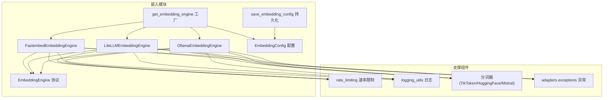
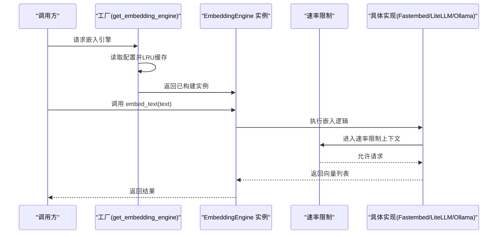
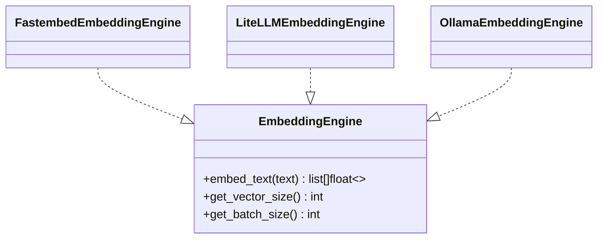
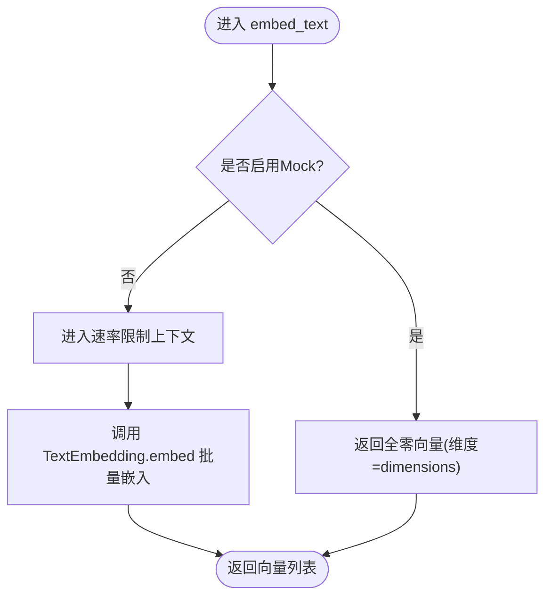
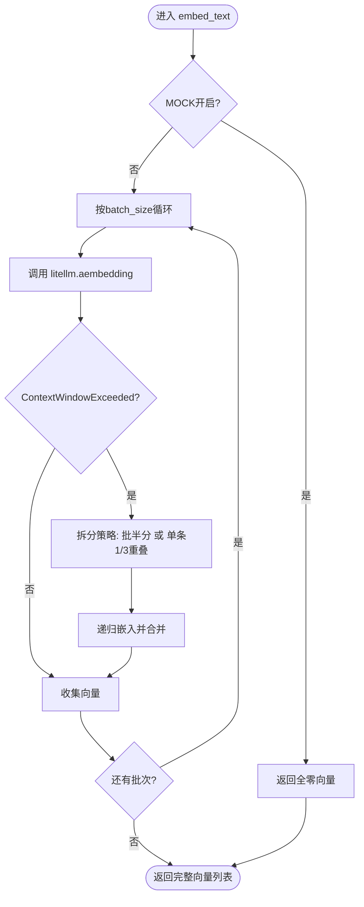
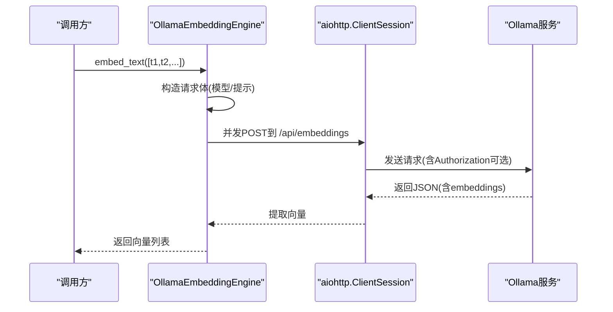
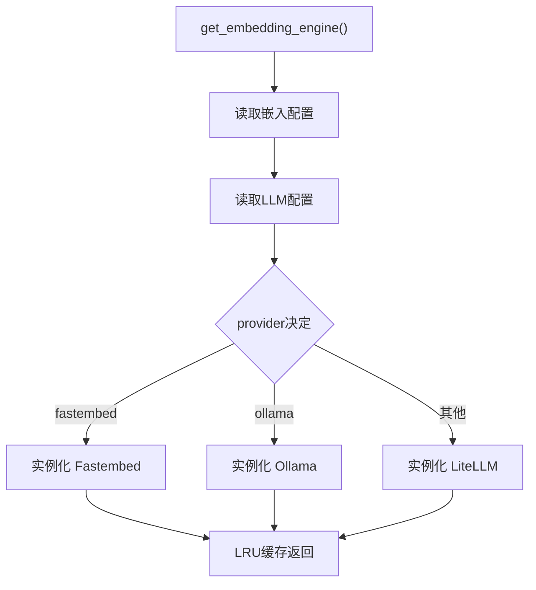
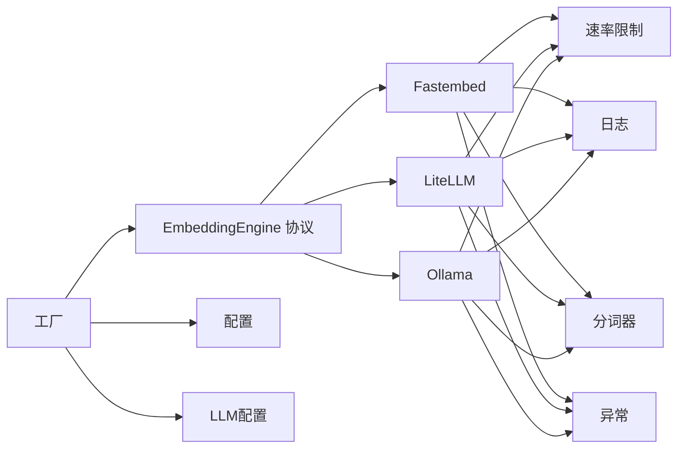

# 嵌入引擎

<cite>
**本文引用的文件**
- [EmbeddingEngine.py](file://m_flow/adapters/vector/embeddings/EmbeddingEngine.py)
- [FastembedEmbeddingEngine.py](file://m_flow/adapters/vector/embeddings/FastembedEmbeddingEngine.py)
- [LiteLLMEmbeddingEngine.py](file://m_flow/adapters/vector/embeddings/LiteLLMEmbeddingEngine.py)
- [OllamaEmbeddingEngine.py](file://m_flow/adapters/vector/embeddings/OllamaEmbeddingEngine.py)
- [get_embedding_engine.py](file://m_flow/adapters/vector/embeddings/get_embedding_engine.py)
- [config.py](file://m_flow/adapters/vector/embeddings/config.py)
- [save_embedding_config.py](file://m_flow/config/settings/save_embedding_config.py)
- [__init__.py](file://m_flow/adapters/vector/embeddings/__init__.py)
- [rate_limiting.py](file://m_flow/shared/rate_limiting.py)
- [logging_utils.py](file://m_flow/shared/logging_utils.py)
- [TikToken.py](file://m_flow/llm/tokenizer/TikToken.py)
- [HuggingFace.py](file://m_flow/llm/tokenizer/HuggingFace.py)
- [Mistral.py](file://m_flow/llm/tokenizer/Mistral.py)
- [exceptions.py](file://m_flow/adapters/exceptions/exceptions.py)
- [test_embedding_config_custom_provider.py](file://m_flow/tests/unit/infrastructure/vector/embeddings/test_embedding_config_custom_provider.py)
- [mock_embedding_engine.py](file://m_flow/tests/unit/infrastructure/mock_embedding_engine.py)
</cite>

## 目录
1. [简介](#简介)
2. [项目结构](#项目结构)
3. [核心组件](#核心组件)
4. [架构总览](#架构总览)
5. [详细组件分析](#详细组件分析)
6. [依赖关系分析](#依赖关系分析)
7. [性能与优化](#性能与优化)
8. [故障排查指南](#故障排查指南)
9. [结论](#结论)
10. [附录：扩展与自定义指南](#附录扩展与自定义指南)

## 简介
本文件系统性阐述嵌入引擎的设计与实现，覆盖统一接口协议、抽象层、多后端适配（Fastembed、LiteLLM、Ollama）、向量生成与批处理、配置与动态切换、质量评估与模型选择、监控与调试、缓存与内存管理，以及扩展开发与自定义模型集成方法。目标是帮助开发者在不改变上层调用方式的前提下，灵活切换与扩展嵌入能力。

## 项目结构
嵌入引擎位于向量适配器的嵌入模块中，采用“协议 + 工厂 + 多实现”的分层设计：
- 协议层：统一接口定义，屏蔽具体实现差异
- 实现层：Fastembed（本地ONNX）、LiteLLM（OpenAI/Azure等兼容）、Ollama（本地/远程服务）
- 工厂层：根据配置动态构建与缓存实例
- 配置层：运行时可更新的嵌入配置与持久化
- 支撑层：速率限制、日志、分词器、异常

图表来源
- [get_embedding_engine.py:16-99](file://m_flow/adapters/vector/embeddings/get_embedding_engine.py#L16-L99)
- [config.py:16-68](file://m_flow/adapters/vector/embeddings/config.py#L16-L68)
- [FastembedEmbeddingEngine.py:35-127](file://m_flow/adapters/vector/embeddings/FastembedEmbeddingEngine.py#L35-L127)
- [LiteLLMEmbeddingEngine.py:37-177](file://m_flow/adapters/vector/embeddings/LiteLLMEmbeddingEngine.py#L37-L177)
- [OllamaEmbeddingEngine.py:38-150](file://m_flow/adapters/vector/embeddings/OllamaEmbeddingEngine.py#L38-L150)

章节来源
- [__init__.py:1-2](file://m_flow/adapters/vector/embeddings/__init__.py#L1-L2)
- [config.py:16-68](file://m_flow/adapters/vector/embeddings/config.py#L16-L68)
- [get_embedding_engine.py:16-99](file://m_flow/adapters/vector/embeddings/get_embedding_engine.py#L16-L99)

## 核心组件
- 统一接口协议：定义三类方法，确保所有实现具备一致的调用契约
  - 文本嵌入：将字符串列表转换为浮点向量列表
  - 获取向量维度：返回固定输出维度
  - 获取批大小建议：返回单次调用的最佳批次规模
- 三个后端实现：
  - Fastembed：本地ONNX推理，零外部API调用，带重试与Mock模式
  - LiteLLM：OpenAI/Azure等兼容提供商，支持上下文溢出拆分与合并
  - Ollama：通过HTTP调用本地或远程Ollama服务，带重试与安全TLS
- 工厂与配置：
  - 工厂函数按配置选择实现并LRU缓存实例
  - 配置支持运行时更新与.env持久化
- 速率限制与日志：
  - 统一使用速率限制上下文管理器
  - 使用统一日志工具输出错误与调试信息
- 分词器适配：
  - 根据提供商自动选择TikToken、Mistral或HuggingFace分词器

章节来源
- [EmbeddingEngine.py:14-63](file://m_flow/adapters/vector/embeddings/EmbeddingEngine.py#L14-L63)
- [FastembedEmbeddingEngine.py:35-127](file://m_flow/adapters/vector/embeddings/FastembedEmbeddingEngine.py#L35-L127)
- [LiteLLMEmbeddingEngine.py:37-177](file://m_flow/adapters/vector/embeddings/LiteLLMEmbeddingEngine.py#L37-L177)
- [OllamaEmbeddingEngine.py:38-150](file://m_flow/adapters/vector/embeddings/OllamaEmbeddingEngine.py#L38-L150)
- [get_embedding_engine.py:16-99](file://m_flow/adapters/vector/embeddings/get_embedding_engine.py#L16-L99)
- [config.py:16-68](file://m_flow/adapters/vector/embeddings/config.py#L16-L68)
- [save_embedding_config.py:33-81](file://m_flow/config/settings/save_embedding_config.py#L33-L81)

## 架构总览
嵌入引擎遵循“协议驱动 + 工厂选择 + 速率限制 + 日志记录”的架构，确保：
- 上层仅依赖协议，无需感知具体实现
- 工厂负责实例化与复用，避免重复连接
- 后端各自处理超长文本、重试、Mock等细节
- 配置可热更新并持久化

图表来源
- [get_embedding_engine.py:16-99](file://m_flow/adapters/vector/embeddings/get_embedding_engine.py#L16-L99)
- [EmbeddingEngine.py:24-43](file://m_flow/adapters/vector/embeddings/EmbeddingEngine.py#L24-L43)
- [rate_limiting.py](file://m_flow/shared/rate_limiting.py)

## 详细组件分析

### 协议层：EmbeddingEngine
- 设计要点
  - 使用运行时协议，无需显式继承
  - 明确三类方法职责：嵌入、维度查询、批大小建议
  - 方法均为占位实现，强制由具体实现提供
- 适用场景
  - 作为类型约束，保证工厂与上层调用的一致性
  - 便于测试替身与Mock注入

图表来源
- [EmbeddingEngine.py:14-63](file://m_flow/adapters/vector/embeddings/EmbeddingEngine.py#L14-L63)
- [FastembedEmbeddingEngine.py:35-51](file://m_flow/adapters/vector/embeddings/FastembedEmbeddingEngine.py#L35-L51)
- [LiteLLMEmbeddingEngine.py:37-56](file://m_flow/adapters/vector/embeddings/LiteLLMEmbeddingEngine.py#L37-L56)
- [OllamaEmbeddingEngine.py:38-55](file://m_flow/adapters/vector/embeddings/OllamaEmbeddingEngine.py#L38-L55)

章节来源
- [EmbeddingEngine.py:14-63](file://m_flow/adapters/vector/embeddings/EmbeddingEngine.py#L14-L63)

### 实现一：FastembedEmbeddingEngine（本地ONNX）
- 特性
  - 本地推理，无需网络调用
  - 内置重试（指数退避+抖动），排除特定异常类型
  - 支持MOCK_EMBEDDING环境变量，用于测试
  - 使用TikToken分词器进行预处理
- 错误处理
  - 将底层异常包装为EmbeddingException
  - 记录失败日志并保留堆栈
- 性能
  - 使用TextEmbedding.embed，批量输入
  - 受限于本地硬件与模型大小

图表来源
- [FastembedEmbeddingEngine.py:88-110](file://m_flow/adapters/vector/embeddings/FastembedEmbeddingEngine.py#L88-L110)

章节来源
- [FastembedEmbeddingEngine.py:35-127](file://m_flow/adapters/vector/embeddings/FastembedEmbeddingEngine.py#L35-L127)
- [TikToken.py](file://m_flow/llm/tokenizer/TikToken.py)

### 实现二：LiteLLMEmbeddingEngine（OpenAI/Azure等兼容）
- 特性
  - 支持OpenAI/Azure等多家提供商
  - 自动选择分词器（TikToken/Gemini/Mistral/HuggingFace）
  - 上下文窗口溢出时自动拆分与拼接
  - 内置重试与Mock模式
- 上下文溢出处理流程
  - 批量溢出：递归对半拆分
  - 单条溢出：按1/3重叠切分，向量平均池化
- 错误处理
  - 区分上下文溢出与认证/参数错误
  - 记录错误并抛出EmbeddingException

图表来源
- [LiteLLMEmbeddingEngine.py:85-143](file://m_flow/adapters/vector/embeddings/LiteLLMEmbeddingEngine.py#L85-L143)

章节来源
- [LiteLLMEmbeddingEngine.py:37-177](file://m_flow/adapters/vector/embeddings/LiteLLMEmbeddingEngine.py#L37-L177)
- [HuggingFace.py](file://m_flow/llm/tokenizer/HuggingFace.py)
- [Mistral.py](file://m_flow/llm/tokenizer/Mistral.py)
- [TikToken.py](file://m_flow/llm/tokenizer/TikToken.py)

### 实现三：OllamaEmbeddingEngine（本地/远程服务）
- 特性
  - 通过HTTP POST调用Ollama服务
  - 默认端点与模型可配置
  - 支持MOCK_EMBEDDING与LLM_API_KEY鉴权头
  - 安全TLS连接与统一速率限制
- 并发策略
  - 对每个文本发起独立协程，使用gather并发执行
- 错误处理
  - 统一重试策略与异常分类
  - 解析响应中的embeddings字段

图表来源
- [OllamaEmbeddingEngine.py:82-142](file://m_flow/adapters/vector/embeddings/OllamaEmbeddingEngine.py#L82-L142)
- [logging_utils.py](file://m_flow/shared/logging_utils.py)
- [utils.py](file://m_flow/shared/utils.py)

章节来源
- [OllamaEmbeddingEngine.py:38-150](file://m_flow/adapters/vector/embeddings/OllamaEmbeddingEngine.py#L38-L150)

### 工厂与配置：get_embedding_engine 与 EmbeddingConfig
- 工厂职责
  - 读取嵌入配置与LLM配置
  - 基于provider选择具体实现
  - 使用LRU缓存实例，避免重复初始化
- 支持的provider
  - fastembed：本地ONNX
  - ollama：本地/远程Ollama
  - 其他：LiteLLM兼容提供商（如openai/azure等）
- 配置项
  - provider/model/dimensions/endpoint/api_key/api_version
  - max_completion_tokens/batch_size/huggingface_tokenizer
- 运行时更新与持久化
  - save_embedding_config支持非空密钥写入与.env文件持久化
  - 掩码占位符避免意外覆盖密钥

图表来源
- [get_embedding_engine.py:16-99](file://m_flow/adapters/vector/embeddings/get_embedding_engine.py#L16-L99)
- [config.py:16-68](file://m_flow/adapters/vector/embeddings/config.py#L16-L68)
- [save_embedding_config.py:33-81](file://m_flow/config/settings/save_embedding_config.py#L33-L81)

章节来源
- [get_embedding_engine.py:16-99](file://m_flow/adapters/vector/embeddings/get_embedding_engine.py#L16-L99)
- [config.py:16-68](file://m_flow/adapters/vector/embeddings/config.py#L16-L68)
- [save_embedding_config.py:33-81](file://m_flow/config/settings/save_embedding_config.py#L33-L81)

## 依赖关系分析
- 协议与实现
  - 三个实现均实现EmbeddingEngine协议，满足上层调用契约
- 工具与支撑
  - 速率限制：统一在各实现内部使用共享上下文管理器
  - 日志：各实现使用统一日志工具输出错误与调试信息
  - 分词器：根据provider自动选择TikToken/Mistral/HuggingFace
  - 异常：统一包装为EmbeddingException，便于上层捕获
- 工厂与配置
  - 工厂依赖配置模块与LLM配置模块
  - 配置支持运行时更新与.env持久化

图表来源
- [EmbeddingEngine.py:14-63](file://m_flow/adapters/vector/embeddings/EmbeddingEngine.py#L14-L63)
- [get_embedding_engine.py:16-99](file://m_flow/adapters/vector/embeddings/get_embedding_engine.py#L16-L99)
- [config.py:16-68](file://m_flow/adapters/vector/embeddings/config.py#L16-L68)
- [rate_limiting.py](file://m_flow/shared/rate_limiting.py)
- [logging_utils.py](file://m_flow/shared/logging_utils.py)

章节来源
- [EmbeddingEngine.py:14-63](file://m_flow/adapters/vector/embeddings/EmbeddingEngine.py#L14-L63)
- [get_embedding_engine.py:16-99](file://m_flow/adapters/vector/embeddings/get_embedding_engine.py#L16-L99)
- [config.py:16-68](file://m_flow/adapters/vector/embeddings/config.py#L16-L68)

## 性能与优化
- 批处理策略
  - 各实现提供get_batch_size建议，工厂据此分批调用
  - LiteLLM在上下文溢出时采用递归拆分，避免单次超限
- 并发与I/O
  - Ollama使用aiohttp并发POST，提升吞吐
  - Fastembed使用TextEmbedding.embed批量处理
- 速率限制
  - 统一使用共享速率限制上下文管理器，避免突发请求
- Mock与测试
  - MOCK_EMBEDDING环境变量可在测试中快速返回零向量，加速验证
- 缓存与复用
  - 工厂LRU缓存嵌入引擎实例，减少初始化成本

章节来源
- [FastembedEmbeddingEngine.py:88-110](file://m_flow/adapters/vector/embeddings/FastembedEmbeddingEngine.py#L88-L110)
- [LiteLLMEmbeddingEngine.py:85-143](file://m_flow/adapters/vector/embeddings/LiteLLMEmbeddingEngine.py#L85-L143)
- [OllamaEmbeddingEngine.py:82-89](file://m_flow/adapters/vector/embeddings/OllamaEmbeddingEngine.py#L82-L89)
- [get_embedding_engine.py:41-49](file://m_flow/adapters/vector/embeddings/get_embedding_engine.py#L41-L49)
- [rate_limiting.py](file://m_flow/shared/rate_limiting.py)

## 故障排查指南
- 常见问题定位
  - 上下文窗口溢出：LiteLLM会自动拆分；若仍失败，检查max_completion_tokens与模型限制
  - 认证/参数错误：确认api_key、endpoint、api_version正确
  - 网络/服务不可达：Ollama默认端点为本地11434；确认服务状态与防火墙
  - Mock模式：MOCK_EMBEDDING开启时返回零向量，影响测试结果
- 日志与异常
  - 各实现均记录错误日志；异常统一包装为EmbeddingException
  - 可通过日志级别与上下文定位问题
- 配置校验
  - 使用保存配置接口更新后，确认.env文件已写入
  - 非空且非掩码的api_key才会被写入

章节来源
- [LiteLLMEmbeddingEngine.py:111-116](file://m_flow/adapters/vector/embeddings/LiteLLMEmbeddingEngine.py#L111-L116)
- [OllamaEmbeddingEngine.py:114-142](file://m_flow/adapters/vector/embeddings/OllamaEmbeddingEngine.py#L114-L142)
- [exceptions.py](file://m_flow/adapters/exceptions/exceptions.py)
- [save_embedding_config.py:33-81](file://m_flow/config/settings/save_embedding_config.py#L33-L81)

## 结论
该嵌入引擎以协议驱动实现解耦，通过工厂与配置实现动态切换与持久化，结合速率限制、日志与Mock等支撑能力，形成稳定高效的嵌入基础设施。三种实现覆盖本地推理、云端兼容与本地服务三种典型场景，满足不同部署与性能需求。

## 附录：扩展与自定义指南
- 新增后端步骤
  - 实现EmbeddingEngine协议（embed_text、get_vector_size、get_batch_size）
  - 在工厂中添加provider分支，导入并实例化新实现
  - 如需分词器，参考现有实现选择或扩展
- 配置与持久化
  - 在配置类中新增字段并在to_dict中导出
  - 在保存配置接口中处理新字段的写入与.env持久化
- 测试与验证
  - 使用MOCK_EMBEDDING进行单元测试
  - 参考测试用例与Mock嵌入引擎验证行为一致性
- 监控与调试
  - 使用统一日志工具输出关键路径
  - 结合速率限制与异常包装，完善可观测性

章节来源
- [EmbeddingEngine.py:14-63](file://m_flow/adapters/vector/embeddings/EmbeddingEngine.py#L14-L63)
- [get_embedding_engine.py:41-99](file://m_flow/adapters/vector/embeddings/get_embedding_engine.py#L41-L99)
- [config.py:48-62](file://m_flow/adapters/vector/embeddings/config.py#L48-L62)
- [save_embedding_config.py:33-81](file://m_flow/config/settings/save_embedding_config.py#L33-L81)
- [mock_embedding_engine.py](file://m_flow/tests/unit/infrastructure/mock_embedding_engine.py)
- [test_embedding_config_custom_provider.py](file://m_flow/tests/unit/infrastructure/vector/embeddings/test_embedding_config_custom_provider.py)