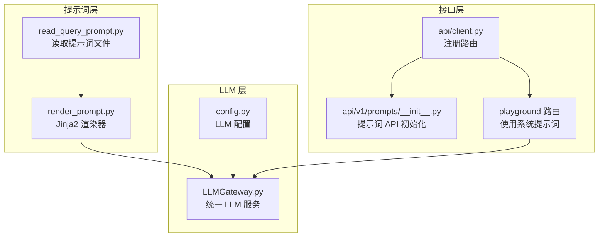
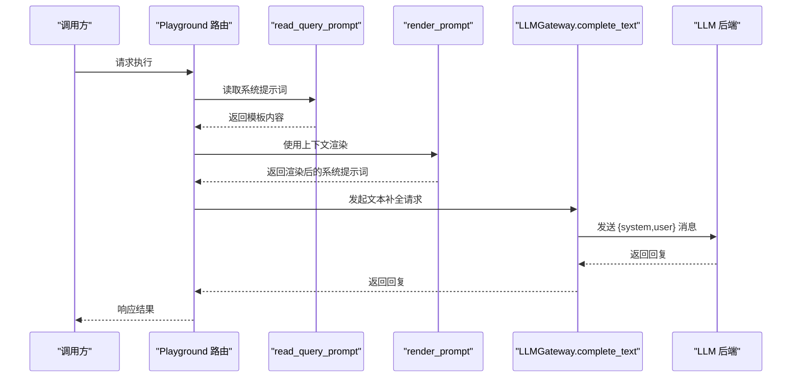
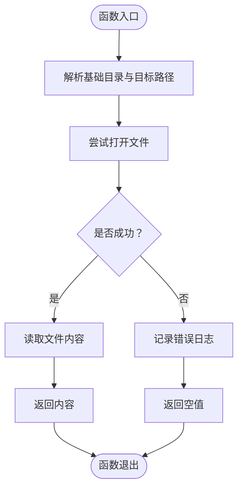
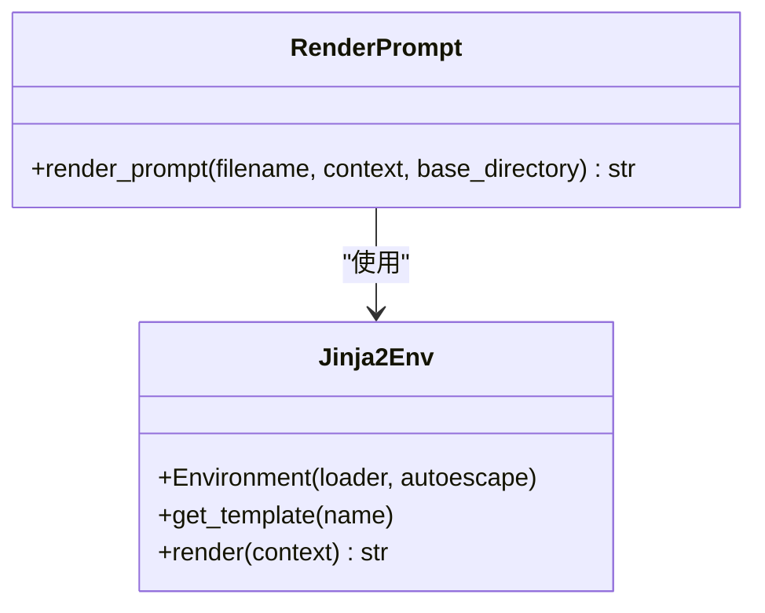
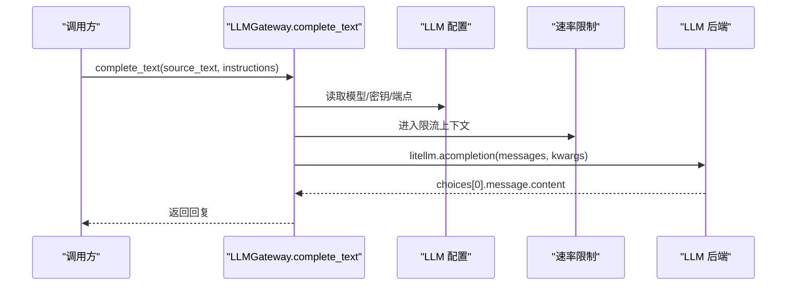
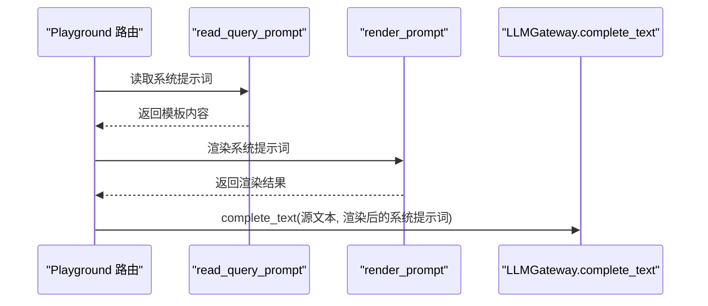
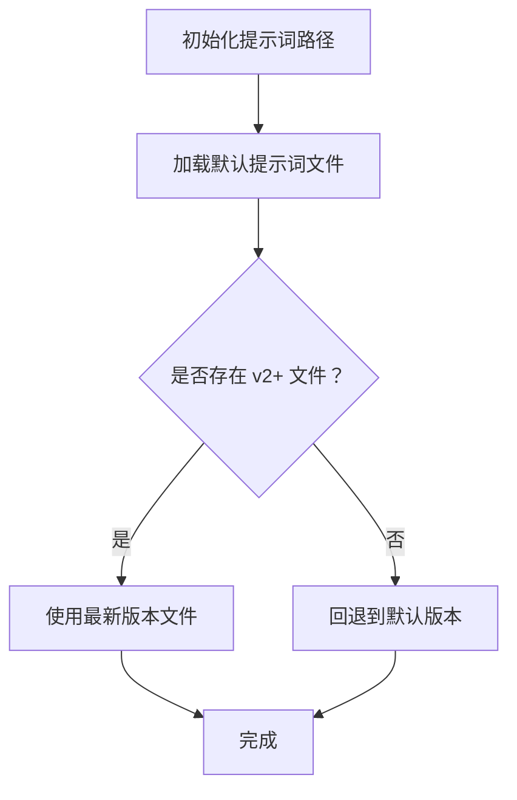
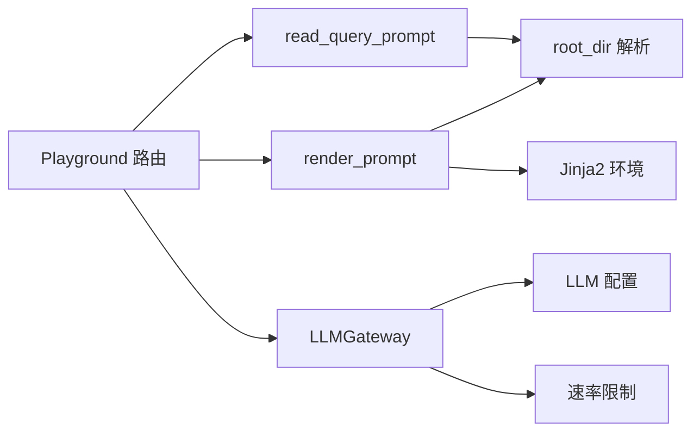

# 提示词管理

<cite>
**本文引用的文件**
- [m_flow/llm/prompts/__init__.py](file://m_flow/llm/prompts/__init__.py)
- [m_flow/llm/prompts/read_query_prompt.py](file://m_flow/llm/prompts/read_query_prompt.py)
- [m_flow/llm/prompts/render_prompt.py](file://m_flow/llm/prompts/render_prompt.py)
- [m_flow/llm/LLMGateway.py](file://m_flow/llm/LLMGateway.py)
- [m_flow/llm/config.py](file://m_flow/llm/config.py)
- [m_flow/api/client.py](file://m_flow/api/client.py)
- [m_flow/api/v1/prompts/__init__.py](file://m_flow/api/v1/prompts/__init__.py)
- [m_flow/api/v1/playground/routers/get_playground_router.py](file://m_flow/api/v1/playground/routers/get_playground_router.py)
- [m_flow/examples/episodic_stage5_smoke_test.py](file://m_flow/examples/episodic_stage5_smoke_test.py)
</cite>

## 目录
1. [简介](#简介)
2. [项目结构](#项目结构)
3. [核心组件](#核心组件)
4. [架构总览](#架构总览)
5. [详细组件分析](#详细组件分析)
6. [依赖分析](#依赖分析)
7. [性能考量](#性能考量)
8. [故障排查指南](#故障排查指南)
9. [结论](#结论)
10. [附录](#附录)

## 简介
本文件为提示词管理系统的技术文档，聚焦以下目标：
- 提示词模板的设计与组织结构
- 系统提示词与用户提示词的分离机制
- 提示词渲染引擎（基于 Jinja2）的实现与参数化替换
- 默认提示词的管理策略与版本控制机制
- 提示词的加载、缓存与热更新机制
- 国际化支持与多语言管理
- 提示词优化最佳实践（模板设计原则与性能考虑）
- 提示词与 LLM 模型的适配关系
- 提示词调试与测试方法

## 项目结构
提示词管理相关代码主要分布在如下模块：
- 渲染与读取：m_flow/llm/prompts
- LLM 调用网关：m_flow/llm/LLMGateway.py
- LLM 配置：m_flow/llm/config.py
- API 入口与路由：m_flow/api
- 示例与测试：m_flow/examples

**图表来源**
- [m_flow/llm/prompts/read_query_prompt.py:1-44](file://m_flow/llm/prompts/read_query_prompt.py#L1-L44)
- [m_flow/llm/prompts/render_prompt.py:1-41](file://m_flow/llm/prompts/render_prompt.py#L1-L41)
- [m_flow/llm/LLMGateway.py:1-168](file://m_flow/llm/LLMGateway.py#L1-L168)
- [m_flow/llm/config.py:1-209](file://m_flow/llm/config.py#L1-L209)
- [m_flow/api/client.py:276-316](file://m_flow/api/client.py#L276-L316)
- [m_flow/api/v1/prompts/__init__.py:1-10](file://m_flow/api/v1/prompts/__init__.py#L1-L10)
- [m_flow/api/v1/playground/routers/get_playground_router.py:236-246](file://m_flow/api/v1/playground/routers/get_playground_router.py#L236-L246)

**章节来源**
- [m_flow/llm/prompts/__init__.py:1-13](file://m_flow/llm/prompts/__init__.py#L1-L13)
- [m_flow/llm/prompts/read_query_prompt.py:1-44](file://m_flow/llm/prompts/read_query_prompt.py#L1-L44)
- [m_flow/llm/prompts/render_prompt.py:1-41](file://m_flow/llm/prompts/render_prompt.py#L1-L41)
- [m_flow/llm/LLMGateway.py:1-168](file://m_flow/llm/LLMGateway.py#L1-L168)
- [m_flow/llm/config.py:1-209](file://m_flow/llm/config.py#L1-L209)
- [m_flow/api/client.py:276-316](file://m_flow/api/client.py#L276-L316)
- [m_flow/api/v1/prompts/__init__.py:1-10](file://m_flow/api/v1/prompts/__init__.py#L1-L10)

## 核心组件
- 提示词读取器：从指定目录读取提示词文件内容，提供错误日志与空值返回。
- 提示词渲染器：基于 Jinja2 的模板渲染器，支持上下文变量注入与自动转义。
- LLM 统一网关：封装结构化抽取与文本补全调用，按配置选择后端（LiteLLM/Instructor 或 BAML），内置重试与限流。
- LLM 配置：集中管理模型、API 密钥、端点、温度、令牌上限等参数，支持环境变量与 .env 加载。
- API 路由：注册提示词 CRUD 路由；Playground 使用系统提示词构建消息。

**章节来源**
- [m_flow/llm/prompts/read_query_prompt.py:18-44](file://m_flow/llm/prompts/read_query_prompt.py#L18-L44)
- [m_flow/llm/prompts/render_prompt.py:16-41](file://m_flow/llm/prompts/render_prompt.py#L16-L41)
- [m_flow/llm/LLMGateway.py:60-168](file://m_flow/llm/LLMGateway.py#L60-L168)
- [m_flow/llm/config.py:38-209](file://m_flow/llm/config.py#L38-L209)
- [m_flow/api/v1/prompts/__init__.py:1-10](file://m_flow/api/v1/prompts/__init__.py#L1-L10)
- [m_flow/api/v1/playground/routers/get_playground_router.py:236-246](file://m_flow/api/v1/playground/routers/get_playground_router.py#L236-L246)

## 架构总览
提示词在系统中的流转路径如下：
- 业务层通过 API 或内部逻辑请求提示词
- 读取器负责从文件系统加载模板内容
- 渲染器以 Jinja2 引擎进行参数化替换
- LLM 网关根据配置构造消息（系统提示词 + 用户输入），并调用 LLM 后端
- 结构化输出通过统一的提取接口完成

**图表来源**
- [m_flow/api/v1/playground/routers/get_playground_router.py:236-246](file://m_flow/api/v1/playground/routers/get_playground_router.py#L236-L246)
- [m_flow/llm/prompts/read_query_prompt.py:18-44](file://m_flow/llm/prompts/read_query_prompt.py#L18-L44)
- [m_flow/llm/prompts/render_prompt.py:16-41](file://m_flow/llm/prompts/render_prompt.py#L16-L41)
- [m_flow/llm/LLMGateway.py:126-168](file://m_flow/llm/LLMGateway.py#L126-L168)

## 详细组件分析

### 组件A：提示词读取器（read_query_prompt）
职责与行为
- 从默认或自定义目录读取指定文件名的提示词内容
- 处理文件不存在与读取异常，记录错误日志并返回空值
- 与根目录解析工具配合，确保路径安全

复杂度与性能
- 时间复杂度：O(1) 文件读取开销，受磁盘 I/O 影响
- 空间复杂度：O(n) 文本内容大小
- 建议：对频繁访问的提示词进行上层缓存

错误处理
- 文件未找到：记录错误并返回空值
- 其他异常：记录错误并返回空值

**图表来源**
- [m_flow/llm/prompts/read_query_prompt.py:18-44](file://m_flow/llm/prompts/read_query_prompt.py#L18-L44)

**章节来源**
- [m_flow/llm/prompts/read_query_prompt.py:1-44](file://m_flow/llm/prompts/read_query_prompt.py#L1-L44)

### 组件B：提示词渲染器（render_prompt）
职责与行为
- 基于 Jinja2 FileSystemLoader 加载模板
- 支持传入上下文字典进行参数化替换
- 自动转义 HTML/XML/TXT，降低注入风险
- 默认模板目录为相对路径 ./llm/prompts，可通过参数覆盖

复杂度与性能
- 时间复杂度：与模板大小和变量数量线性相关
- 空间复杂度：与渲染结果大小线性相关
- 建议：对常用模板进行上层缓存；避免在上下文中传递超大对象

**图表来源**
- [m_flow/llm/prompts/render_prompt.py:16-41](file://m_flow/llm/prompts/render_prompt.py#L16-L41)

**章节来源**
- [m_flow/llm/prompts/render_prompt.py:1-41](file://m_flow/llm/prompts/render_prompt.py#L1-L41)

### 组件C：LLM 统一网关（LLMGateway）
职责与行为
- 结构化抽取：根据后端选择调用 BAML 或 LiteLLM/Instructor
- 文本补全：构造 system/user 消息，支持重试与速率限制
- 后端选择：运行时根据配置决定使用 BAML 还是 Instructor/LiteLLM
- 错误处理：对特定异常类型不重试，其余指数退避重试

关键流程（文本补全）
- 构造 messages：system（提示词）、user（源文本）
- 获取配置：模型、密钥、端点、版本等
- 限流：进入 LLM 速率限制上下文
- 调用后端：异步 completion
- 记录日志：请求与响应长度

**图表来源**
- [m_flow/llm/LLMGateway.py:126-168](file://m_flow/llm/LLMGateway.py#L126-L168)
- [m_flow/llm/config.py:205-209](file://m_flow/llm/config.py#L205-L209)

**章节来源**
- [m_flow/llm/LLMGateway.py:1-168](file://m_flow/llm/LLMGateway.py#L1-L168)
- [m_flow/llm/config.py:1-209](file://m_flow/llm/config.py#L1-L209)

### 组件D：提示词与系统提示词的分离机制
- 系统提示词：通常由渲染器读取并注入到 messages 的 system 角色
- 用户提示词：作为 user 角色内容传入
- Playground 路由中直接拼接 system/content 并发送给 LLM

**图表来源**
- [m_flow/api/v1/playground/routers/get_playground_router.py:236-246](file://m_flow/api/v1/playground/routers/get_playground_router.py#L236-L246)
- [m_flow/llm/prompts/read_query_prompt.py:18-44](file://m_flow/llm/prompts/read_query_prompt.py#L18-L44)
- [m_flow/llm/prompts/render_prompt.py:16-41](file://m_flow/llm/prompts/render_prompt.py#L16-L41)
- [m_flow/llm/LLMGateway.py:126-168](file://m_flow/llm/LLMGateway.py#L126-L168)

**章节来源**
- [m_flow/api/v1/playground/routers/get_playground_router.py:236-246](file://m_flow/api/v1/playground/routers/get_playground_router.py#L236-L246)

### 组件E：默认提示词的管理策略与版本控制
- 默认提示词文件位于提示词目录（默认 ./llm/prompts），可通过配置项指定路径
- 版本控制示例：测试用例演示了 v2 提示词文件的存在与内容校验，体现版本演进与命名规范

**图表来源**
- [m_flow/examples/episodic_stage5_smoke_test.py:79-91](file://m_flow/examples/episodic_stage5_smoke_test.py#L79-L91)

**章节来源**
- [m_flow/examples/episodic_stage5_smoke_test.py:79-91](file://m_flow/examples/episodic_stage5_smoke_test.py#L79-L91)

### 组件F：提示词的加载、缓存与热更新机制
- 加载：读取器按需从文件系统读取；渲染器按需构建 Jinja2 环境
- 缓存：建议在应用层对热点提示词进行缓存（如内存缓存或进程内缓存）
- 热更新：当前实现未见自动热重载逻辑，建议通过重启服务或引入文件监控触发缓存刷新

**章节来源**
- [m_flow/llm/prompts/read_query_prompt.py:18-44](file://m_flow/llm/prompts/read_query_prompt.py#L18-L44)
- [m_flow/llm/prompts/render_prompt.py:16-41](file://m_flow/llm/prompts/render_prompt.py#L16-L41)

### 组件G：国际化支持与多语言管理
- 当前实现未发现专门的多语言资源文件或语言切换逻辑
- 建议：为不同语言维护独立的提示词目录或文件命名规范，并在读取器中按语言参数选择对应文件

**章节来源**
- [m_flow/llm/prompts/read_query_prompt.py:1-44](file://m_flow/llm/prompts/read_query_prompt.py#L1-L44)
- [m_flow/llm/prompts/render_prompt.py:1-41](file://m_flow/llm/prompts/render_prompt.py#L1-L41)

### 组件H：提示词与 LLM 模型的适配关系
- LLM 配置集中管理模型、端点、密钥、温度等参数
- 网关根据配置动态构造请求，适配不同提供商与模型
- 不同任务可选用不同提示词文件，通过配置项指定

**章节来源**
- [m_flow/llm/config.py:38-209](file://m_flow/llm/config.py#L38-L209)
- [m_flow/llm/LLMGateway.py:126-168](file://m_flow/llm/LLMGateway.py#L126-L168)

### 组件I：提示词调试与测试
- 单元测试：示例测试验证 v2 提示词文件存在与关键片段
- Playground：通过路由直接使用系统提示词进行交互式调试
- 日志：读取器与网关均包含日志记录，便于定位问题

**章节来源**
- [m_flow/examples/episodic_stage5_smoke_test.py:79-91](file://m_flow/examples/episodic_stage5_smoke_test.py#L79-L91)
- [m_flow/api/v1/playground/routers/get_playground_router.py:236-246](file://m_flow/api/v1/playground/routers/get_playground_router.py#L236-L246)
- [m_flow/llm/prompts/read_query_prompt.py:18-44](file://m_flow/llm/prompts/read_query_prompt.py#L18-L44)
- [m_flow/llm/LLMGateway.py:140-141](file://m_flow/llm/LLMGateway.py#L140-L141)

## 依赖分析
- 组件耦合
  - 渲染器依赖 Jinja2 与根目录解析工具
  - 读取器依赖根目录解析与日志工具
  - 网关依赖 LLM 配置与速率限制
  - API 路由依赖提示词读取与渲染
- 外部依赖
  - Jinja2（模板渲染）
  - litellm（LLM 调用）
  - tenacity（重试）
  - pydantic/pydantic-settings（配置）

**图表来源**
- [m_flow/llm/prompts/read_query_prompt.py:11-12](file://m_flow/llm/prompts/read_query_prompt.py#L11-L12)
- [m_flow/llm/prompts/render_prompt.py:9-11](file://m_flow/llm/prompts/render_prompt.py#L9-L11)
- [m_flow/llm/LLMGateway.py:137-138](file://m_flow/llm/LLMGateway.py#L137-L138)
- [m_flow/api/v1/playground/routers/get_playground_router.py:236-246](file://m_flow/api/v1/playground/routers/get_playground_router.py#L236-L246)

**章节来源**
- [m_flow/llm/prompts/read_query_prompt.py:1-44](file://m_flow/llm/prompts/read_query_prompt.py#L1-L44)
- [m_flow/llm/prompts/render_prompt.py:1-41](file://m_flow/llm/prompts/render_prompt.py#L1-L41)
- [m_flow/llm/LLMGateway.py:1-168](file://m_flow/llm/LLMGateway.py#L1-L168)
- [m_flow/api/v1/playground/routers/get_playground_router.py:236-246](file://m_flow/api/v1/playground/routers/get_playground_router.py#L236-L246)

## 性能考量
- 渲染性能
  - 控制模板复杂度与变量数量
  - 对热点模板进行上层缓存
- I/O 性能
  - 减少文件系统访问次数，合并读取
  - 在进程内缓存已读取的提示词内容
- LLM 调用性能
  - 合理设置温度与最大令牌数
  - 使用速率限制避免被限流
  - 对瞬时错误采用指数退避重试

[本节为通用指导，无需具体文件分析]

## 故障排查指南
- 提示词文件缺失
  - 现象：读取器返回空值并记录错误日志
  - 排查：确认文件路径与名称正确，检查权限
- 渲染失败
  - 现象：Jinja2 抛出异常
  - 排查：检查上下文键名与模板语法一致性
- LLM 调用失败
  - 现象：特定异常不重试，其他异常指数退避
  - 排查：检查密钥、端点、模型名称与网络连通性
- 日志定位
  - 关注网关的日志输出，记录请求与响应长度

**章节来源**
- [m_flow/llm/prompts/read_query_prompt.py:35-43](file://m_flow/llm/prompts/read_query_prompt.py#L35-L43)
- [m_flow/llm/LLMGateway.py:113-125](file://m_flow/llm/LLMGateway.py#L113-L125)
- [m_flow/llm/LLMGateway.py:140-141](file://m_flow/llm/LLMGateway.py#L140-L141)

## 结论
本系统通过“读取器 + 渲染器 + 网关”的分层设计实现了提示词的灵活管理与高效调用。系统具备明确的系统提示词与用户提示词分离机制，支持参数化渲染与多后端适配。建议在生产环境中引入提示词缓存与热更新策略，并建立完善的版本控制与多语言资源管理方案，以进一步提升稳定性与可维护性。

[本节为总结，无需具体文件分析]

## 附录

### API 定义（概念性）
- 提示词 CRUD 路由：提供提示词模板的增删改查能力
- Playground 接口：使用系统提示词进行交互式调试

**章节来源**
- [m_flow/api/v1/prompts/__init__.py:1-10](file://m_flow/api/v1/prompts/__init__.py#L1-L10)
- [m_flow/api/client.py:276-316](file://m_flow/api/client.py#L276-L316)