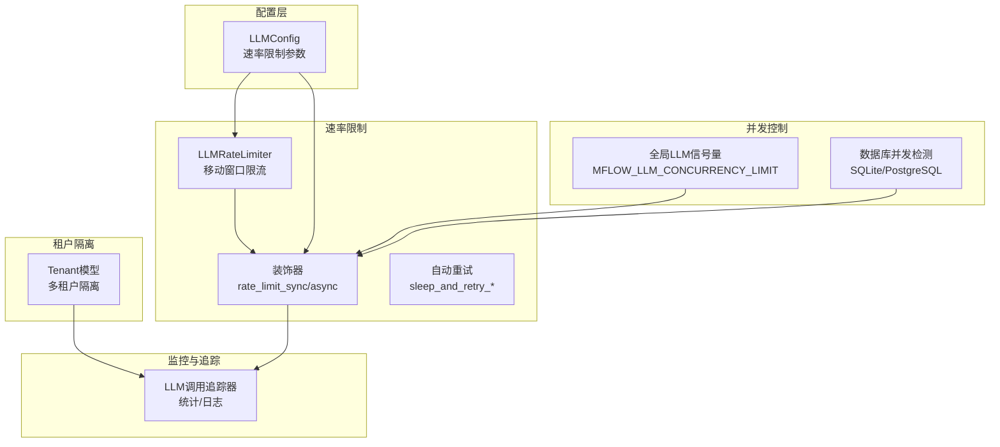
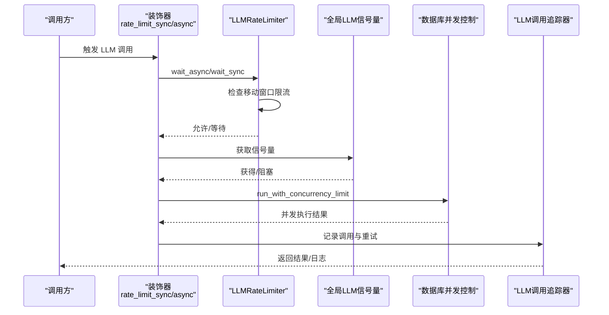
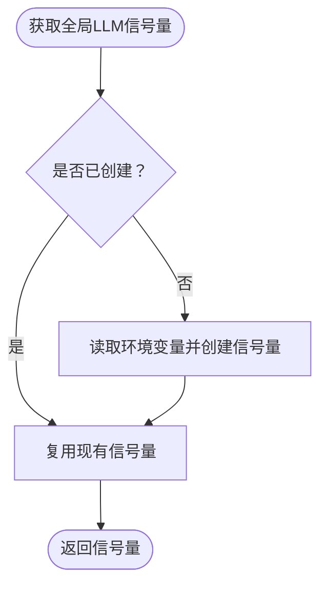
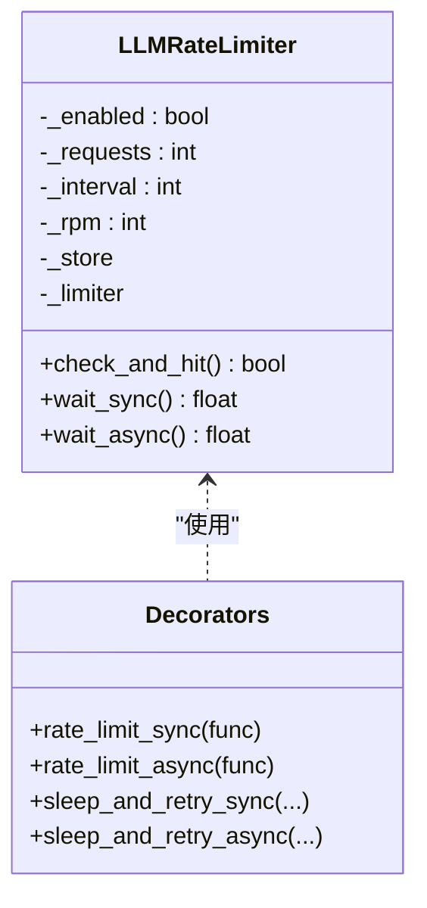
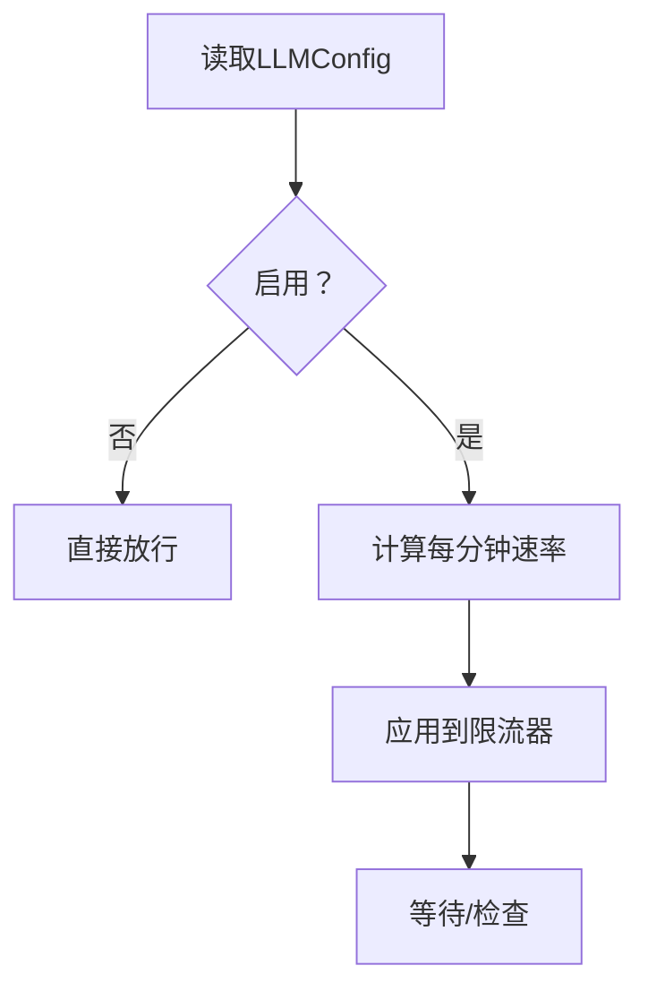
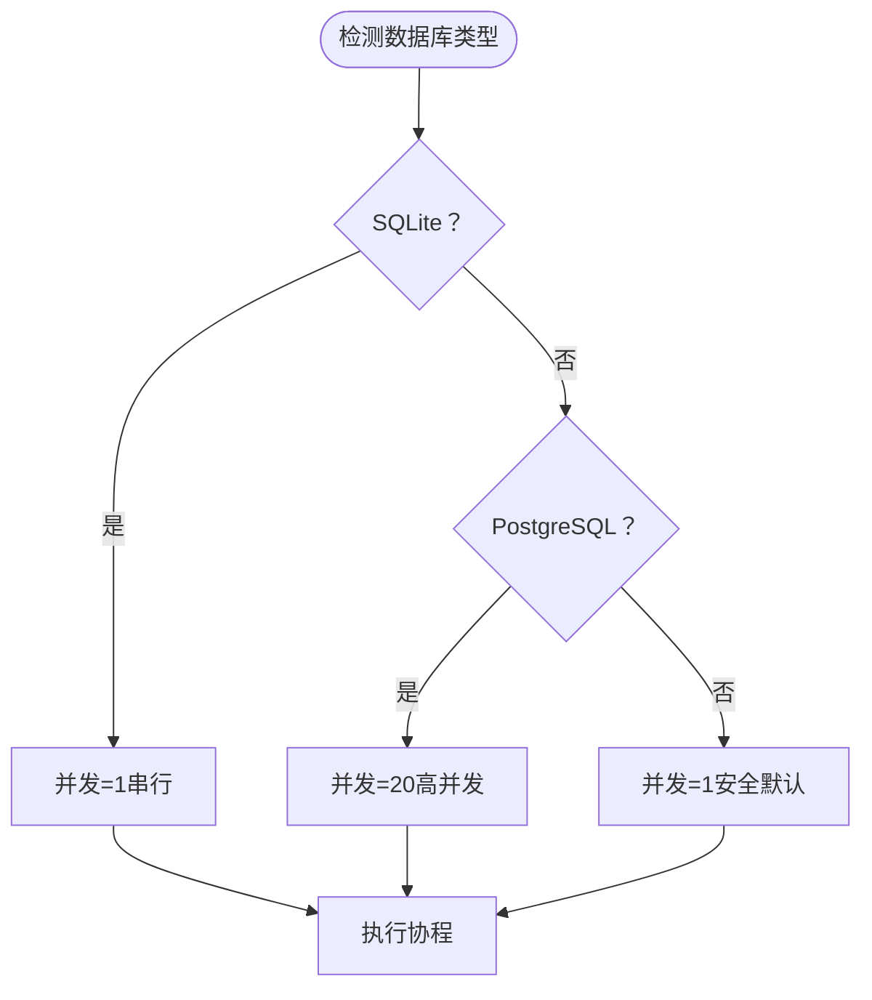
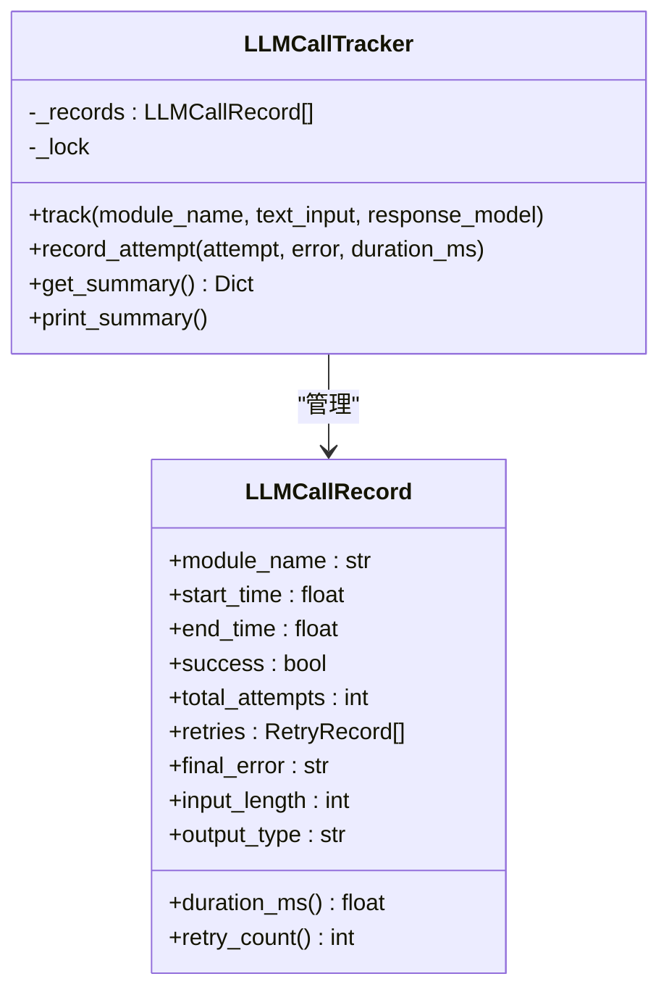
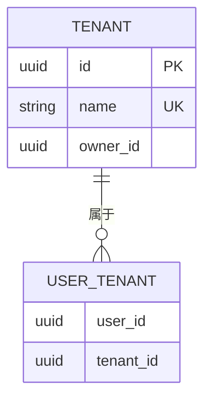
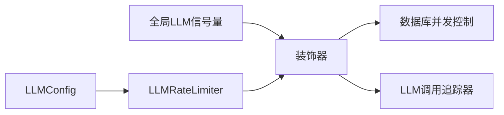

# 速率限制控制

<cite>
**本文档引用的文件**
- [m_flow/shared/rate_limiting.py](file://m_flow/shared/rate_limiting.py)
- [m_flow/shared/llm_concurrency.py](file://m_flow/shared/llm_concurrency.py)
- [m_flow/llm/config.py](file://m_flow/llm/config.py)
- [m_flow/llm/backends/litellm_instructor/llm/rate_limiter.py](file://m_flow/llm/backends/litellm_instructor/llm/rate_limiter.py)
- [m_flow/pipeline/operations/db_concurrency.py](file://m_flow/pipeline/operations/db_concurrency.py)
- [m_flow/tests/unit/infrastructure/databases/test_rate_limiter.py](file://m_flow/tests/unit/infrastructure/databases/test_rate_limiter.py)
- [m_flow/tests/unit/infrastructure/test_rate_limiting_realistic.py](file://m_flow/tests/unit/infrastructure/test_rate_limiting_realistic.py)
- [m_flow/tests/unit/infrastructure/test_rate_limiting_retry.py](file://m_flow/tests/unit/infrastructure/test_rate_limiting_retry.py)
- [m_flow/memory/episodic/llm_call_tracker.py](file://m_flow/memory/episodic/llm_call_tracker.py)
- [m_flow/auth/models/Tenant.py](file://m_flow/auth/models/Tenant.py)
- [m_flow/auth/tenants/methods/create_tenant.py](file://m_flow/auth/tenants/methods/create_tenant.py)
</cite>

## 目录
1. [简介](#简介)
2. [项目结构](#项目结构)
3. [核心组件](#核心组件)
4. [架构总览](#架构总览)
5. [详细组件分析](#详细组件分析)
6. [依赖关系分析](#依赖关系分析)
7. [性能考量](#性能考量)
8. [故障排查指南](#故障排查指南)
9. [结论](#结论)
10. [附录](#附录)

## 简介
本文件系统化梳理并深入解析 m_flow 项目中的速率限制控制系统，覆盖以下关键主题：
- 并发控制机制：全局并发限制与 per-tenant 限制的协同设计
- 速率限制算法：基于移动窗口的令牌桶式策略与指数退避重试
- LLM 请求的排队与调度：同步/异步装饰器与等待逻辑
- 配置参数与动态调整：环境变量与运行时配置
- 异常降级与熔断：错误识别、自动重试与退避策略
- 性能监控与指标：调用追踪、统计汇总与日志输出
- 成本控制关联：请求配额与时间窗口的权衡
- 测试与验证：单元测试、真实场景模拟与重试行为验证
- 故障排查与优化：常见问题定位与调优建议

## 项目结构
围绕速率限制控制的关键模块分布如下：
- 全局并发控制：通过信号量统一管理 LLM 调用并发
- LLM 速率限制：基于 limits 库的移动窗口限流与自动重试
- 配置中心：LLMConfig 提供速率限制开关与参数
- 数据库并发：根据数据库类型自动选择串行或并行执行
- 调用追踪：LLM 调用统计、重试原因与耗时分析
- 租户模型：多租户隔离与资源边界

**图表来源**
- [m_flow/llm/config.py:75-84](file://m_flow/llm/config.py#L75-L84)
- [m_flow/shared/llm_concurrency.py:15-29](file://m_flow/shared/llm_concurrency.py#L15-L29)
- [m_flow/llm/backends/litellm_instructor/llm/rate_limiter.py:55-134](file://m_flow/llm/backends/litellm_instructor/llm/rate_limiter.py#L55-L134)
- [m_flow/pipeline/operations/db_concurrency.py:48-119](file://m_flow/pipeline/operations/db_concurrency.py#L48-L119)
- [m_flow/memory/episodic/llm_call_tracker.py:97-132](file://m_flow/memory/episodic/llm_call_tracker.py#L97-L132)
- [m_flow/auth/models/Tenant.py:24-74](file://m_flow/auth/models/Tenant.py#L24-L74)

**章节来源**
- [m_flow/shared/rate_limiting.py:1-59](file://m_flow/shared/rate_limiting.py#L1-L59)
- [m_flow/shared/llm_concurrency.py:1-46](file://m_flow/shared/llm_concurrency.py#L1-L46)
- [m_flow/llm/config.py:75-84](file://m_flow/llm/config.py#L75-L84)
- [m_flow/llm/backends/litellm_instructor/llm/rate_limiter.py:55-134](file://m_flow/llm/backends/litellm_instructor/llm/rate_limiter.py#L55-L134)
- [m_flow/pipeline/operations/db_concurrency.py:1-200](file://m_flow/pipeline/operations/db_concurrency.py#L1-L200)
- [m_flow/memory/episodic/llm_call_tracker.py:97-132](file://m_flow/memory/episodic/llm_call_tracker.py#L97-L132)
- [m_flow/auth/models/Tenant.py:24-74](file://m_flow/auth/models/Tenant.py#L24-L74)

## 核心组件
- 全局 LLM 并发控制：通过环境变量 MFLOW_LLM_CONCURRENCY_LIMIT 控制全局并发上限，默认 20；提供获取与重置接口，避免嵌套信号量竞争。
- LLM 速率限制器：基于 limits 的移动窗口限流，支持启用/禁用、请求数与时间窗口配置；提供同步/异步等待与自动重试装饰器。
- 配置中心：LLMConfig 暴露 llm_rate_limit_enabled、llm_rate_limit_requests、llm_rate_limit_interval 等参数，并提供序列化导出。
- 数据库并发：根据数据库类型自动选择并发策略；SQLite 强制串行以避免锁冲突，PostgreSQL 默认高并发。
- 调用追踪：LLMCallTracker 记录每次调用的尝试次数、重试原因、耗时与最终状态，支持按模块统计与日志输出。

**章节来源**
- [m_flow/shared/llm_concurrency.py:15-46](file://m_flow/shared/llm_concurrency.py#L15-L46)
- [m_flow/llm/backends/litellm_instructor/llm/rate_limiter.py:55-134](file://m_flow/llm/backends/litellm_instructor/llm/rate_limiter.py#L55-L134)
- [m_flow/llm/config.py:75-84](file://m_flow/llm/config.py#L75-L84)
- [m_flow/pipeline/operations/db_concurrency.py:48-119](file://m_flow/pipeline/operations/db_concurrency.py#L48-L119)
- [m_flow/memory/episodic/llm_call_tracker.py:97-132](file://m_flow/memory/episodic/llm_call_tracker.py#L97-L132)

## 架构总览
速率限制控制在系统中的交互流程如下：

**图表来源**
- [m_flow/llm/backends/litellm_instructor/llm/rate_limiter.py:154-179](file://m_flow/llm/backends/litellm_instructor/llm/rate_limiter.py#L154-L179)
- [m_flow/shared/llm_concurrency.py:15-29](file://m_flow/shared/llm_concurrency.py#L15-L29)
- [m_flow/pipeline/operations/db_concurrency.py:122-176](file://m_flow/pipeline/operations/db_concurrency.py#L122-L176)
- [m_flow/memory/episodic/llm_call_tracker.py:140-201](file://m_flow/memory/episodic/llm_call_tracker.py#L140-L201)

## 详细组件分析

### 全局并发控制（全局 LLM 信号量）
- 设计目标：为所有 LLM 调用提供统一的并发上限，避免资源争抢与嵌套信号量问题。
- 关键点：
  - 通过环境变量 MFLOW_LLM_CONCURRENCY_LIMIT 设置并发上限，默认 20。
  - 单例信号量，首次使用时创建，后续复用；测试场景可重置。
  - 与数据库并发控制配合，确保在不同存储后端下稳定运行。

**图表来源**
- [m_flow/shared/llm_concurrency.py:15-29](file://m_flow/shared/llm_concurrency.py#L15-L29)

**章节来源**
- [m_flow/shared/llm_concurrency.py:15-46](file://m_flow/shared/llm_concurrency.py#L15-L46)

### LLM 速率限制器（移动窗口限流 + 自动重试）
- 限流算法：采用移动窗口策略，将请求限制转换为每分钟速率，结合内存存储进行计数。
- 功能特性：
  - 启用/禁用：由 LLMConfig 控制，禁用时直接放行。
  - 等待策略：同步/异步等待直到允许请求；默认轮询间隔 0.5 秒。
  - 自动重试：对“速率限制”相关错误进行指数退避重试，支持最大重试次数与抖动。
  - 错误识别：内置关键词集合用于识别速率限制类错误消息。

**图表来源**
- [m_flow/llm/backends/litellm_instructor/llm/rate_limiter.py:55-134](file://m_flow/llm/backends/litellm_instructor/llm/rate_limiter.py#L55-L134)
- [m_flow/llm/backends/litellm_instructor/llm/rate_limiter.py:154-179](file://m_flow/llm/backends/litellm_instructor/llm/rate_limiter.py#L154-L179)
- [m_flow/llm/backends/litellm_instructor/llm/rate_limiter.py:182-245](file://m_flow/llm/backends/litellm_instructor/llm/rate_limiter.py#L182-L245)

**章节来源**
- [m_flow/llm/backends/litellm_instructor/llm/rate_limiter.py:55-134](file://m_flow/llm/backends/litellm_instructor/llm/rate_limiter.py#L55-L134)
- [m_flow/llm/backends/litellm_instructor/llm/rate_limiter.py:154-179](file://m_flow/llm/backends/litellm_instructor/llm/rate_limiter.py#L154-L179)
- [m_flow/llm/backends/litellm_instructor/llm/rate_limiter.py:182-245](file://m_flow/llm/backends/litellm_instructor/llm/rate_limiter.py#L182-L245)

### 配置参数与动态调整
- LLM 速率限制配置项：
  - llm_rate_limit_enabled：是否启用速率限制
  - llm_rate_limit_requests：时间窗口内的最大请求数
  - llm_rate_limit_interval：速率限制的时间窗口（秒）
- 动态调整：
  - 通过 LLMConfig 的缓存实例获取当前配置，支持运行时更新（需重启或刷新缓存）。
  - 速率限制器从配置加载参数并在初始化时生效。

**图表来源**
- [m_flow/llm/config.py:75-84](file://m_flow/llm/config.py#L75-L84)
- [m_flow/llm/backends/litellm_instructor/llm/rate_limiter.py:70-85](file://m_flow/llm/backends/litellm_instructor/llm/rate_limiter.py#L70-L85)

**章节来源**
- [m_flow/llm/config.py:75-84](file://m_flow/llm/config.py#L75-L84)
- [m_flow/llm/backends/litellm_instructor/llm/rate_limiter.py:70-85](file://m_flow/llm/backends/litellm_instructor/llm/rate_limiter.py#L70-L85)

### 数据库并发控制（per-tenant 与存储后端）
- 自动检测数据库类型并设置并发上限：
  - SQLite：强制串行执行，避免“database is locked”错误
  - PostgreSQL：默认高并发（如 20），可由环境变量覆盖
- 运行时并发控制：
  - 支持传入并发限制或使用自动检测值
  - 对于小于等于并发上限的情况全并行，否则使用信号量限流

**图表来源**
- [m_flow/pipeline/operations/db_concurrency.py:31-119](file://m_flow/pipeline/operations/db_concurrency.py#L31-L119)

**章节来源**
- [m_flow/pipeline/operations/db_concurrency.py:1-200](file://m_flow/pipeline/operations/db_concurrency.py#L1-L200)

### LLM 调用追踪与统计
- 统计维度：模块名、成功/失败、重试次数、总耗时、输入长度、输出类型
- 重试记录：每次尝试的错误类型、消息、耗时与时间戳
- 日志输出：成功/失败/重试均输出结构化日志，便于审计与监控

**图表来源**
- [m_flow/memory/episodic/llm_call_tracker.py:97-132](file://m_flow/memory/episodic/llm_call_tracker.py#L97-L132)
- [m_flow/memory/episodic/llm_call_tracker.py:140-201](file://m_flow/memory/episodic/llm_call_tracker.py#L140-L201)
- [m_flow/memory/episodic/llm_call_tracker.py:239-287](file://m_flow/memory/episodic/llm_call_tracker.py#L239-L287)

**章节来源**
- [m_flow/memory/episodic/llm_call_tracker.py:97-132](file://m_flow/memory/episodic/llm_call_tracker.py#L97-L132)
- [m_flow/memory/episodic/llm_call_tracker.py:239-287](file://m_flow/memory/episodic/llm_call_tracker.py#L239-L287)

### 租户隔离与 per-tenant 限制
- 租户模型：Tenant 提供组织级数据与用户隔离，支持角色与用户关系管理
- per-tenant 限制：可通过租户维度在网关或路由层引入独立的速率限制策略（例如基于租户标识的键控限流），当前仓库未提供现成实现，但具备扩展基础

**图表来源**
- [m_flow/auth/models/Tenant.py:46-74](file://m_flow/auth/models/Tenant.py#L46-L74)

**章节来源**
- [m_flow/auth/models/Tenant.py:24-74](file://m_flow/auth/models/Tenant.py#L24-L74)
- [m_flow/auth/tenants/methods/create_tenant.py:21-67](file://m_flow/auth/tenants/methods/create_tenant.py#L21-L67)

## 依赖关系分析
- 配置依赖：LLMRateLimiter 依赖 LLMConfig 获取速率限制参数
- 并发依赖：全局信号量与数据库并发控制共同作用于 LLM 调用
- 跟踪依赖：LLM 调用追踪器贯穿整个调用链，提供可观测性

**图表来源**
- [m_flow/llm/config.py:205-209](file://m_flow/llm/config.py#L205-L209)
- [m_flow/llm/backends/litellm_instructor/llm/rate_limiter.py:24-25](file://m_flow/llm/backends/litellm_instructor/llm/rate_limiter.py#L24-L25)
- [m_flow/shared/llm_concurrency.py:15-29](file://m_flow/shared/llm_concurrency.py#L15-L29)
- [m_flow/pipeline/operations/db_concurrency.py:122-176](file://m_flow/pipeline/operations/db_concurrency.py#L122-L176)
- [m_flow/memory/episodic/llm_call_tracker.py:140-201](file://m_flow/memory/episodic/llm_call_tracker.py#L140-L201)

**章节来源**
- [m_flow/llm/config.py:205-209](file://m_flow/llm/config.py#L205-L209)
- [m_flow/llm/backends/litellm_instructor/llm/rate_limiter.py:24-25](file://m_flow/llm/backends/litellm_instructor/llm/rate_limiter.py#L24-L25)
- [m_flow/shared/llm_concurrency.py:15-29](file://m_flow/shared/llm_concurrency.py#L15-L29)
- [m_flow/pipeline/operations/db_concurrency.py:122-176](file://m_flow/pipeline/operations/db_concurrency.py#L122-L176)
- [m_flow/memory/episodic/llm_call_tracker.py:140-201](file://m_flow/memory/episodic/llm_call_tracker.py#L140-L201)

## 性能考量
- 限流粒度：移动窗口策略在时间窗口内平滑分配请求，适合突发流量场景
- 重试退避：指数退避+抖动降低集中重试概率，缓解上游压力
- 并发上限：全局信号量与数据库并发控制共同保障系统稳定性
- 监控开销：调用追踪器记录详细统计，建议在生产中按需采样或聚合上报

## 故障排查指南
- 速率限制错误识别：确认错误消息是否包含预定义关键词集合
- 重试行为验证：使用测试用例验证同步/异步重试装饰器的行为与退避时间
- 限流器行为验证：通过单元测试模拟不同窗口大小与请求节奏，观察通过/限制比例
- 数据库并发问题：若出现 SQLite “database is locked”，优先检查并发设置与串行执行策略

**章节来源**
- [m_flow/llm/backends/litellm_instructor/llm/rate_limiter.py:136-152](file://m_flow/llm/backends/litellm_instructor/llm/rate_limiter.py#L136-L152)
- [m_flow/tests/unit/infrastructure/test_rate_limiting_retry.py:133-217](file://m_flow/tests/unit/infrastructure/test_rate_limiting_retry.py#L133-L217)
- [m_flow/tests/unit/infrastructure/databases/test_rate_limiter.py:101-147](file://m_flow/tests/unit/infrastructure/databases/test_rate_limiter.py#L101-L147)
- [m_flow/tests/unit/infrastructure/test_rate_limiting_realistic.py:47-94](file://m_flow/tests/unit/infrastructure/test_rate_limiting_realistic.py#L47-L94)

## 结论
本系统通过“全局并发信号量 + 移动窗口限流 + 自动重试”的组合，实现了对 LLM 请求的稳健控制。配置中心提供灵活的参数化能力，数据库并发控制适配不同存储后端，调用追踪器提供了完整的可观测性。对于 per-tenant 限制，可在现有租户模型基础上扩展键控限流策略，进一步细化资源边界与成本控制。

## 附录

### 配置参数一览
- 全局并发上限：MFLOW_LLM_CONCURRENCY_LIMIT（默认 20）
- LLM 速率限制：
  - llm_rate_limit_enabled：启用/禁用
  - llm_rate_limit_requests：时间窗口内最大请求数
  - llm_rate_limit_interval：速率限制时间窗口（秒）

**章节来源**
- [m_flow/shared/llm_concurrency.py:19-20](file://m_flow/shared/llm_concurrency.py#L19-L20)
- [m_flow/llm/config.py:75-84](file://m_flow/llm/config.py#L75-L84)

### 测试与验证策略
- 单元测试：验证限流器初始化、行为与边界条件
- 真实场景模拟：模拟不同窗口与请求节奏，观察通过/限制比例
- 重试行为：验证同步/异步装饰器在速率限制错误下的重试次数与时延

**章节来源**
- [m_flow/tests/unit/infrastructure/databases/test_rate_limiter.py:1-147](file://m_flow/tests/unit/infrastructure/databases/test_rate_limiter.py#L1-L147)
- [m_flow/tests/unit/infrastructure/test_rate_limiting_realistic.py:47-94](file://m_flow/tests/unit/infrastructure/test_rate_limiting_realistic.py#L47-L94)
- [m_flow/tests/unit/infrastructure/test_rate_limiting_retry.py:133-217](file://m_flow/tests/unit/infrastructure/test_rate_limiting_retry.py#L133-L217)