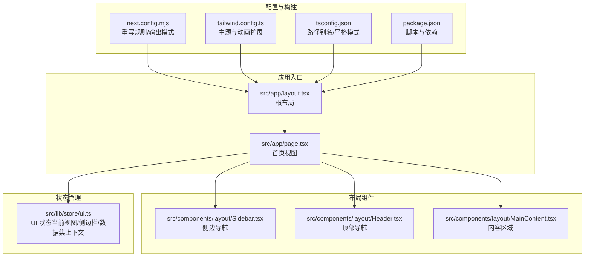
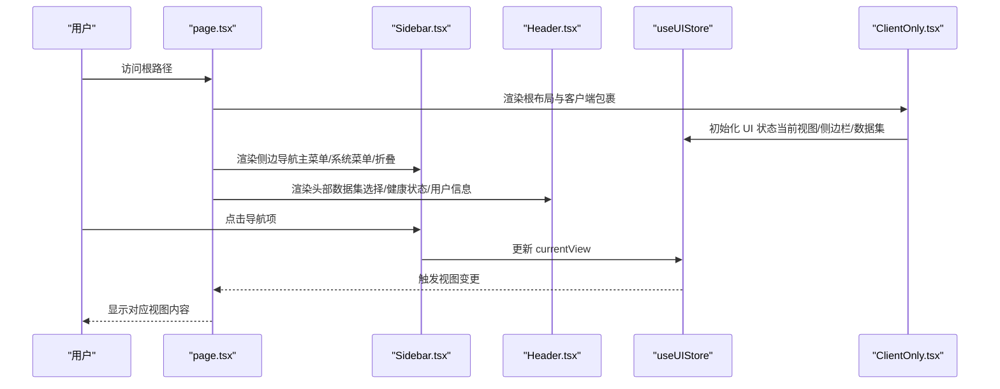
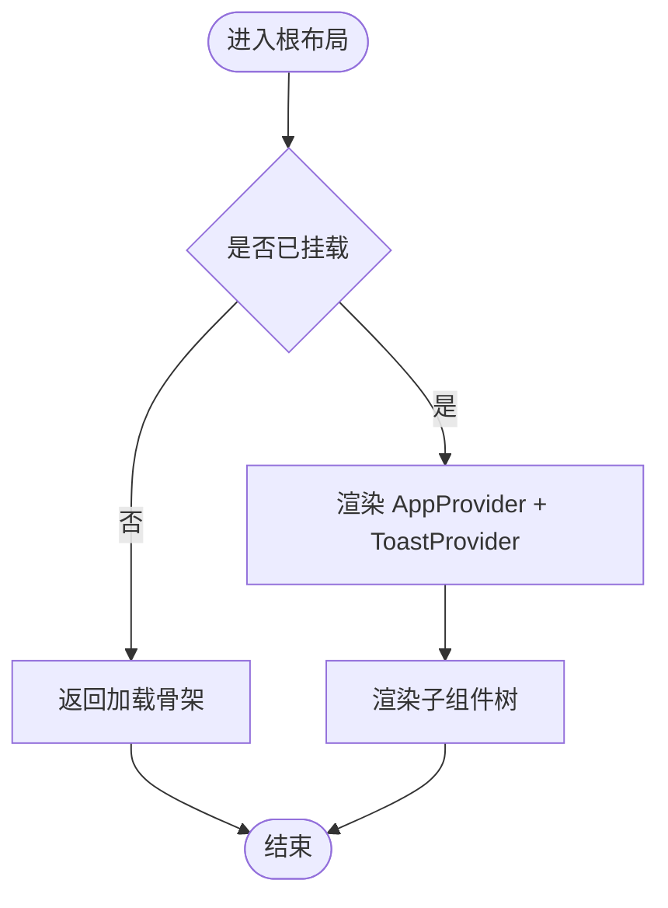
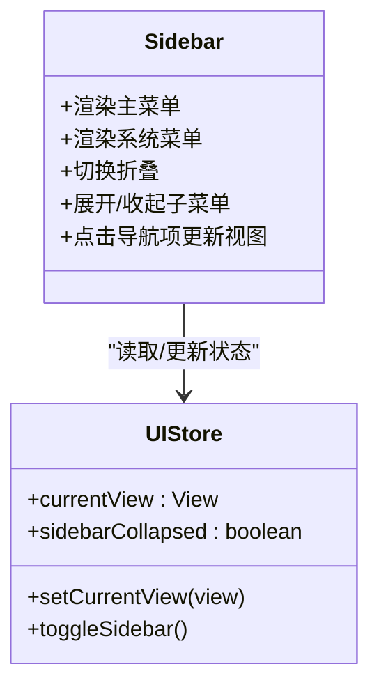
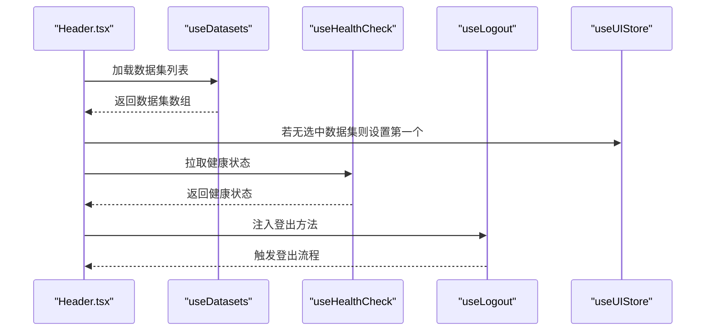
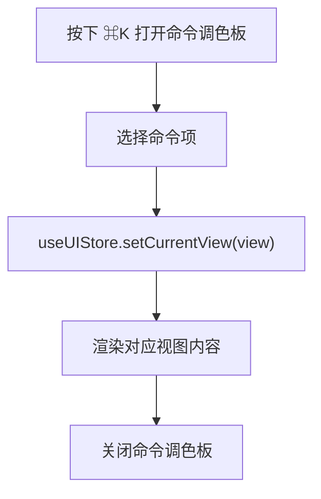
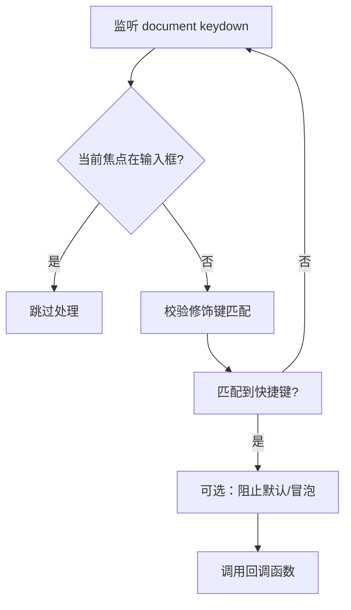
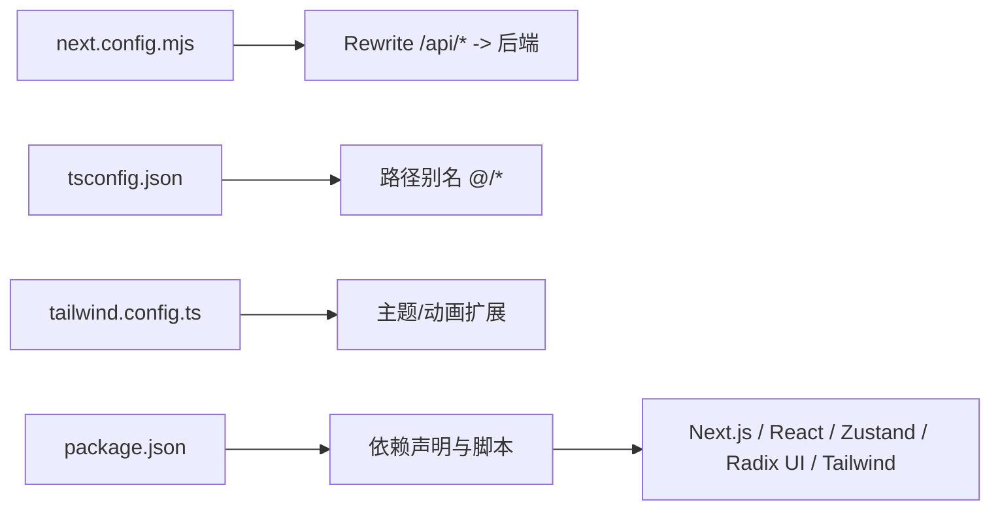

# Next.js 应用架构

<cite>
**本文档引用的文件**
- [package.json](file://m_flow-frontend/package.json)
- [next.config.mjs](file://m_flow-frontend/next.config.mjs)
- [layout.tsx](file://m_flow-frontend/src/app/layout.tsx)
- [page.tsx](file://m_flow-frontend/src/app/page.tsx)
- [tailwind.config.ts](file://m_flow-frontend/tailwind.config.ts)
- [tsconfig.json](file://m_flow-frontend/tsconfig.json)
- [ClientOnly.tsx](file://m_flow-frontend/src/components/providers/ClientOnly.tsx)
- [Sidebar.tsx](file://m_flow-frontend/src/components/layout/Sidebar.tsx)
- [Header.tsx](file://m_flow-frontend/src/components/layout/Header.tsx)
- [index.ts](file://m_flow-frontend/src/components/layout/index.ts)
- [ui.ts](file://m_flow-frontend/src/lib/store/ui.ts)
- [index.ts](file://m_flow-frontend/src/lib/store/index.ts)
- [use-keyboard.ts](file://m_flow-frontend/src/hooks/use-keyboard.ts)
</cite>

## 目录
1. [简介](#简介)
2. [项目结构](#项目结构)
3. [核心组件](#核心组件)
4. [架构总览](#架构总览)
5. [详细组件分析](#详细组件分析)
6. [依赖关系分析](#依赖关系分析)
7. [性能考虑](#性能考虑)
8. [故障排除指南](#故障排除指南)
9. [结论](#结论)

## 简介
本文件面向 Next.js 14 应用（m_flow-frontend）的前端架构，系统性阐述基于 App Router 的页面路由、布局系统与中间件配置；解析 app 目录下的路由组织、组件共享与数据获取策略；总结布局组件设计模式（主布局、侧边栏、头部导航与内容区域）；记录构建配置、环境变量处理与性能优化设置；并提供应用启动流程与生命周期管理说明。该应用采用 TypeScript、TailwindCSS、Zustand 状态管理与 Radix UI 组件库，结合自研 hooks 实现键盘快捷键与客户端水合控制。

## 项目结构
前端工程位于 m_flow-frontend 目录，采用 Next.js 14 App Router 结构，核心目录与职责如下：
- src/app：App Router 根目录，包含全局样式、根布局与入口页面
- src/components：可复用 UI 组件，按功能域分层（layout、admin、auth、dashboard、memorize、retrieve 等）
- src/hooks：自定义 hooks（如键盘事件、API 调用等）
- src/lib：工具与状态管理（store、api、utils、config）
- 配置文件：next.config.mjs、tailwind.config.ts、tsconfig.json、package.json

图表来源
- [layout.tsx:1-23](file://m_flow-frontend/src/app/layout.tsx#L1-L23)
- [page.tsx:1-210](file://m_flow-frontend/src/app/page.tsx#L1-L210)
- [Sidebar.tsx:1-360](file://m_flow-frontend/src/components/layout/Sidebar.tsx#L1-L360)
- [Header.tsx:1-207](file://m_flow-frontend/src/components/layout/Header.tsx#L1-L207)
- [ui.ts:1-115](file://m_flow-frontend/src/lib/store/ui.ts#L1-L115)
- [next.config.mjs:1-29](file://m_flow-frontend/next.config.mjs#L1-L29)
- [tailwind.config.ts:1-127](file://m_flow-frontend/tailwind.config.ts#L1-L127)
- [tsconfig.json:1-40](file://m_flow-frontend/tsconfig.json#L1-L40)
- [package.json:1-65](file://m_flow-frontend/package.json#L1-L65)

章节来源
- [layout.tsx:1-23](file://m_flow-frontend/src/app/layout.tsx#L1-L23)
- [page.tsx:1-210](file://m_flow-frontend/src/app/page.tsx#L1-L210)
- [next.config.mjs:1-29](file://m_flow-frontend/next.config.mjs#L1-L29)
- [tailwind.config.ts:1-127](file://m_flow-frontend/tailwind.config.ts#L1-L127)
- [tsconfig.json:1-40](file://m_flow-frontend/tsconfig.json#L1-L40)
- [package.json:1-65](file://m_flow-frontend/package.json#L1-L65)

## 核心组件
- 根布局与水合控制：RootLayout 提供 html/lang 属性与全局样式，ClientOnly 在客户端挂载后才渲染应用主体与全局提示，避免首屏水合不一致。
- 页面视图：Home 页面整合侧边栏、头部、内容区，并通过命令调色板与全局快捷键提升可用性。
- 布局组件：Sidebar 提供主菜单与系统菜单、折叠切换、子菜单展开；Header 提供数据集选择、健康状态、用户信息与登出。
- 状态管理：useUIStore 统一管理当前视图、侧边栏状态、搜索关键词与数据集上下文。
- 键盘交互：useKeyboard/useKeyboardShortcuts 提供全局快捷键、箭头导航与输入框忽略逻辑。

章节来源
- [layout.tsx:1-23](file://m_flow-frontend/src/app/layout.tsx#L1-L23)
- [ClientOnly.tsx:1-31](file://m_flow-frontend/src/components/providers/ClientOnly.tsx#L1-L31)
- [page.tsx:1-210](file://m_flow-frontend/src/app/page.tsx#L1-L210)
- [Sidebar.tsx:1-360](file://m_flow-frontend/src/components/layout/Sidebar.tsx#L1-L360)
- [Header.tsx:1-207](file://m_flow-frontend/src/components/layout/Header.tsx#L1-L207)
- [ui.ts:1-115](file://m_flow-frontend/src/lib/store/ui.ts#L1-L115)
- [use-keyboard.ts:1-349](file://m_flow-frontend/src/hooks/use-keyboard.ts#L1-L349)

## 架构总览
Next.js 14 App Router 架构要点：
- 路由组织：以 src/app 为根，page.tsx 作为默认入口，通过布局树组织页面层级。
- 中间件：仓库未发现独立中间件文件，但通过 next.config.mjs 的 rewrites 将 /api/* 请求代理到后端服务，实现请求拦截与转发。
- 数据流：页面通过 hooks 与 store 获取/更新状态，组件间通过 props 传递与 Zustand 全局状态协作。
- 客户端水合：ClientOnly 包裹应用主体，确保仅在客户端挂载后渲染，避免 SSR 初次渲染差异。

图表来源
- [page.tsx:1-210](file://m_flow-frontend/src/app/page.tsx#L1-L210)
- [Sidebar.tsx:1-360](file://m_flow-frontend/src/components/layout/Sidebar.tsx#L1-L360)
- [Header.tsx:1-207](file://m_flow-frontend/src/components/layout/Header.tsx#L1-L207)
- [ui.ts:1-115](file://m_flow-frontend/src/lib/store/ui.ts#L1-L115)
- [ClientOnly.tsx:1-31](file://m_flow-frontend/src/components/providers/ClientOnly.tsx#L1-L31)

## 详细组件分析

### 根布局与客户端水合
- RootLayout 设置站点元数据与全局样式，使用 ClientOnly 包裹 children，避免 hydration 不一致。
- ClientOnly 在挂载后渲染 AppProvider 与 ToastProvider，确保客户端特性（如状态管理、通知）正常工作。

图表来源
- [layout.tsx:1-23](file://m_flow-frontend/src/app/layout.tsx#L1-L23)
- [ClientOnly.tsx:1-31](file://m_flow-frontend/src/components/providers/ClientOnly.tsx#L1-L31)

章节来源
- [layout.tsx:1-23](file://m_flow-frontend/src/app/layout.tsx#L1-L23)
- [ClientOnly.tsx:1-31](file://m_flow-frontend/src/components/providers/ClientOnly.tsx#L1-L31)

### 侧边栏导航（Sidebar）
- 功能：主菜单（导入数据、搜索、知识图谱、导出等）、系统菜单（用户/数据集、维护、文档）、折叠切换、子菜单展开。
- 状态：useUIStore.currentView 决定高亮；expandedItems 控制子菜单展开；sidebarCollapsed 控制宽度。
- 交互：点击外部链接在新标签页打开；点击菜单项更新 currentView；折叠按钮切换侧边栏宽度。

图表来源
- [Sidebar.tsx:1-360](file://m_flow-frontend/src/components/layout/Sidebar.tsx#L1-L360)
- [ui.ts:1-115](file://m_flow-frontend/src/lib/store/ui.ts#L1-L115)

章节来源
- [Sidebar.tsx:1-360](file://m_flow-frontend/src/components/layout/Sidebar.tsx#L1-L360)
- [ui.ts:1-115](file://m_flow-frontend/src/lib/store/ui.ts#L1-L115)

### 头部导航（Header）
- 功能：数据集下拉选择、健康状态指示、文档链接、用户信息与登出。
- 数据：从 useDatasets/useHealthCheck/useLogout 获取数据与操作；自动选择首个数据集。
- 布局：根据侧边栏折叠状态调整左侧定位。

图表来源
- [Header.tsx:1-207](file://m_flow-frontend/src/components/layout/Header.tsx#L1-L207)
- [ui.ts:1-115](file://m_flow-frontend/src/lib/store/ui.ts#L1-L115)

章节来源
- [Header.tsx:1-207](file://m_flow-frontend/src/components/layout/Header.tsx#L1-L207)
- [ui.ts:1-115](file://m_flow-frontend/src/lib/store/ui.ts#L1-L115)

### 页面视图与命令调色板
- Home 页面整合 Sidebar、Header、MainContent，并提供命令调色板与全局快捷键。
- 命令列表覆盖“设置、仪表盘、导入数据、检索、游乐场、监控审计、知识图谱、导出、用户管理、权限、审计”等视图。
- 快捷键：⌘K 打开命令调色板；⌘D 导航至仪表盘；⌘S Episodic 搜索；⌘G 知识图谱；⌘P 游乐场等。

图表来源
- [page.tsx:1-210](file://m_flow-frontend/src/app/page.tsx#L1-L210)
- [ui.ts:1-115](file://m_flow-frontend/src/lib/store/ui.ts#L1-L115)

章节来源
- [page.tsx:1-210](file://m_flow-frontend/src/app/page.tsx#L1-L210)
- [use-keyboard.ts:1-349](file://m_flow-frontend/src/hooks/use-keyboard.ts#L1-L349)
- [ui.ts:1-115](file://m_flow-frontend/src/lib/store/ui.ts#L1-L115)

### 键盘快捷键系统
- 支持单键、组合键、修饰键（ctrl/alt/shift/meta/cmd），可配置阻止默认行为与冒泡。
- 提供 useKeyboardShortcuts 用于全局快捷键注册，useArrowNavigation 支持方向键与 Home/End 导航。
- 默认忽略输入框焦点时的键盘事件，避免干扰用户输入。

图表来源
- [use-keyboard.ts:1-349](file://m_flow-frontend/src/hooks/use-keyboard.ts#L1-L349)

章节来源
- [use-keyboard.ts:1-349](file://m_flow-frontend/src/hooks/use-keyboard.ts#L1-L349)

## 依赖关系分析
- 构建与运行：Next.js 14、TypeScript、React 18、TailwindCSS、Vitest/Playwright 测试栈。
- UI 组件：Radix UI（对话框、下拉菜单、开关、标签页、工具提示等）与 Lucide React 图标。
- 状态管理：Zustand 管理 UI 状态（视图、侧边栏、数据集上下文）。
- 查询与缓存：@tanstack/react-query 用于数据获取与缓存（通过 hooks 使用）。
- 工具类：clsx、tailwind-merge、framer-motion、zod 等。

图表来源
- [next.config.mjs:1-29](file://m_flow-frontend/next.config.mjs#L1-L29)
- [tsconfig.json:1-40](file://m_flow-frontend/tsconfig.json#L1-L40)
- [tailwind.config.ts:1-127](file://m_flow-frontend/tailwind.config.ts#L1-L127)
- [package.json:1-65](file://m_flow-frontend/package.json#L1-L65)

章节来源
- [package.json:1-65](file://m_flow-frontend/package.json#L1-L65)
- [next.config.mjs:1-29](file://m_flow-frontend/next.config.mjs#L1-L29)
- [tsconfig.json:1-40](file://m_flow-frontend/tsconfig.json#L1-L40)
- [tailwind.config.ts:1-127](file://m_flow-frontend/tailwind.config.ts#L1-L127)

## 性能考虑
- 构建输出：使用 standalone 输出模式，便于容器化部署与最小化运行时依赖。
- 严格模式：启用 reactStrictMode 与严格 TypeScript 编译选项，减少运行时错误与提升类型安全。
- 样式与动画：Tailwind 主题扩展与有限动画，避免过度重绘；ClientOnly 避免不必要的 SSR 渲染。
- 依赖体积：按需引入 Radix UI 组件与图标，减少打包体积。
- 数据获取：通过 react-query hooks 管理缓存与并发，避免重复请求。

章节来源
- [next.config.mjs:1-29](file://m_flow-frontend/next.config.mjs#L1-L29)
- [tsconfig.json:1-40](file://m_flow-frontend/tsconfig.json#L1-L40)
- [tailwind.config.ts:1-127](file://m_flow-frontend/tailwind.config.ts#L1-L127)
- [package.json:1-65](file://m_flow-frontend/package.json#L1-L65)

## 故障排除指南
- 代理 API 请求失败：检查 MFLOW_BACKEND_URL 环境变量与 next.config.mjs 的 rewrites 配置，确认后端服务地址可达。
- 水合警告或闪烁：确认 ClientOnly 包裹了需要客户端特性的组件树，避免在 SSR 阶段访问浏览器 API。
- 键盘快捷键无效：检查 useKeyboard/useKeyboardShortcuts 的 target、ignoreInputs、enabled 等参数，确保未在输入框焦点时触发。
- 样式未生效：确认 Tailwind content 路径包含 src/components 与 src/app，并重新构建。
- TypeScript 路径别名：确保 tsconfig.json 中 baseUrl 与 paths 正确，且 Next 插件启用。

章节来源
- [next.config.mjs:1-29](file://m_flow-frontend/next.config.mjs#L1-L29)
- [ClientOnly.tsx:1-31](file://m_flow-frontend/src/components/providers/ClientOnly.tsx#L1-L31)
- [use-keyboard.ts:1-349](file://m_flow-frontend/src/hooks/use-keyboard.ts#L1-L349)
- [tailwind.config.ts:1-127](file://m_flow-frontend/tailwind.config.ts#L1-L127)
- [tsconfig.json:1-40](file://m_flow-frontend/tsconfig.json#L1-L40)

## 结论
本应用以 Next.js 14 App Router 为基础，结合自定义布局组件、Zustand 状态管理与 Radix UI 组件库，构建了模块化、可扩展的前端架构。通过 ClientOnly 控制水合、useKeyboard 提升交互体验、next.config.mjs 的重写代理后端 API，形成清晰的前后端分离与数据流。配合 Tailwind 主题与严格的 TS 配置，整体具备良好的开发体验与运行性能。后续可在中间件、国际化与静态生成方面进一步完善，以满足更复杂的业务场景。