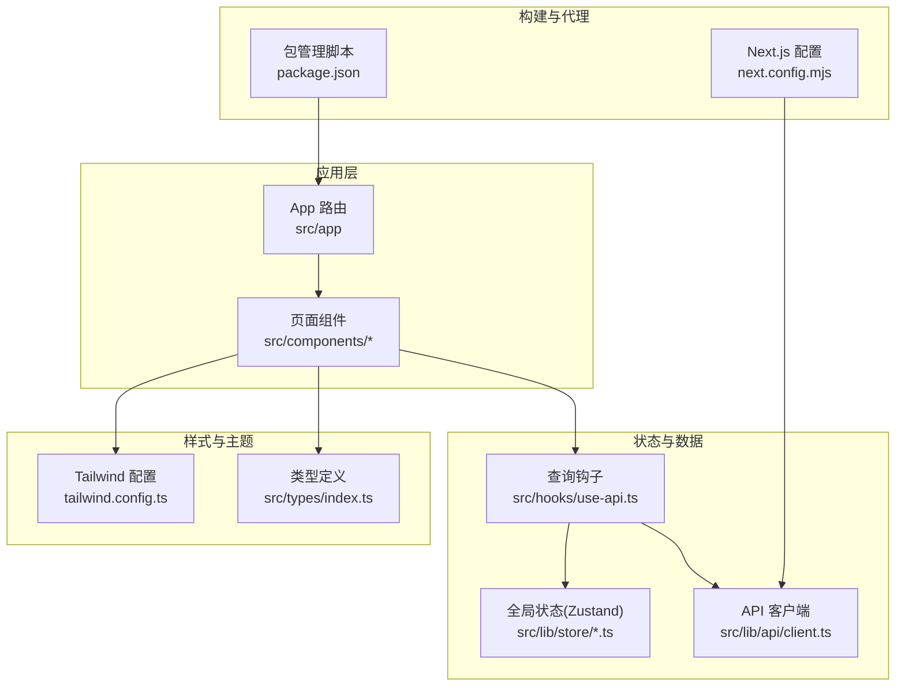
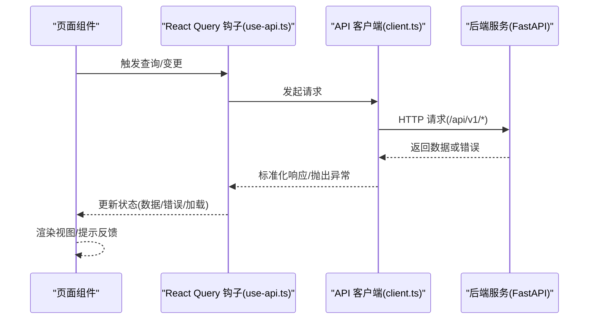
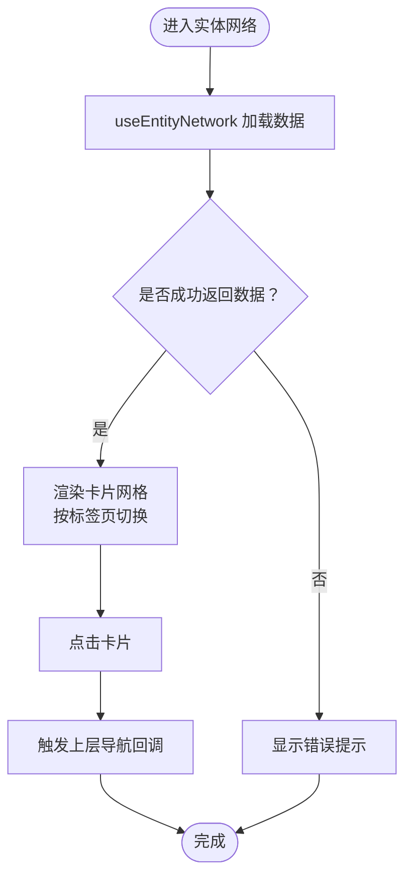
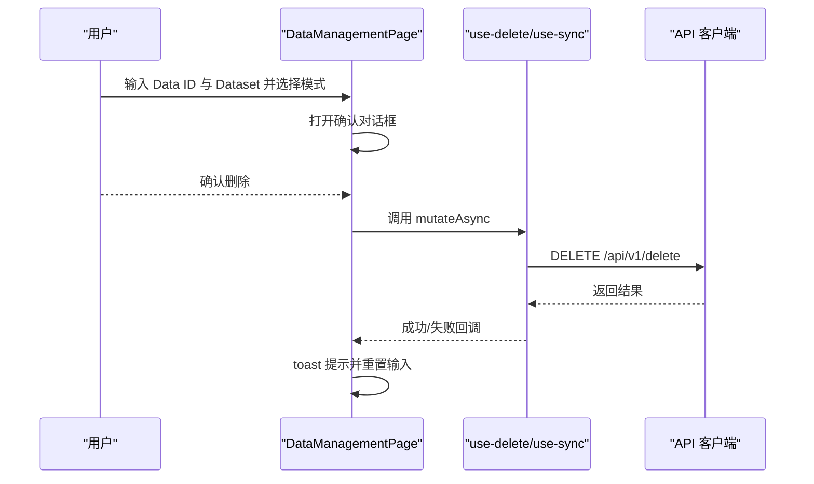
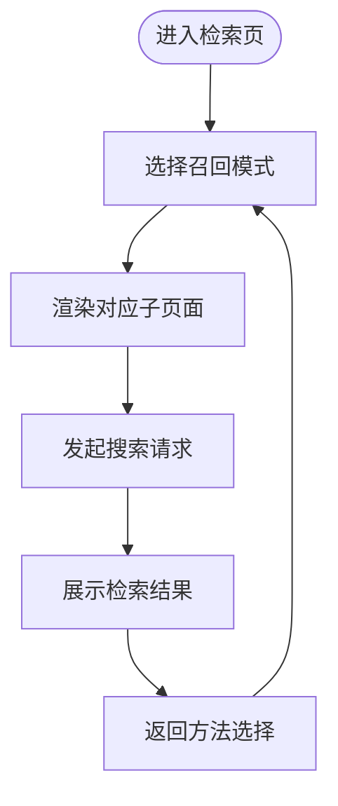
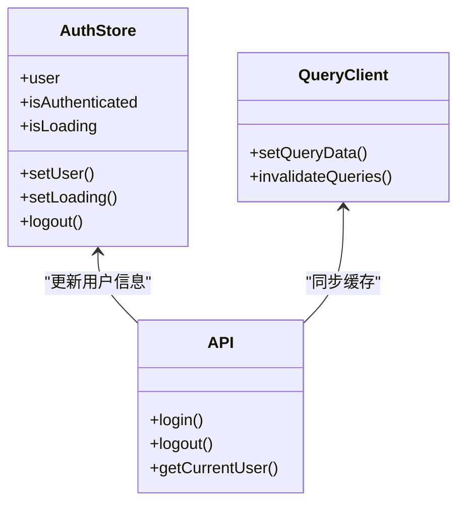
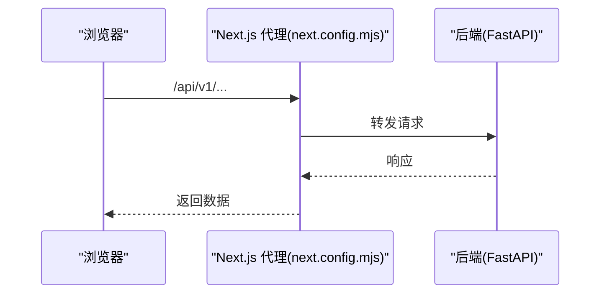
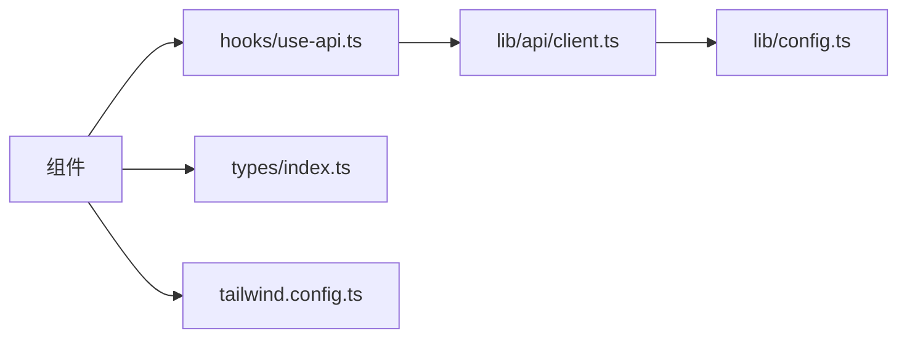

# 前端界面开发

<cite>
**本文档引用的文件**
- [package.json](file://m_flow-frontend/package.json)
- [next.config.mjs](file://m_flow-frontend/next.config.mjs)
- [tailwind.config.ts](file://m_flow-frontend/tailwind.config.ts)
- [EntityNetwork.tsx](file://m_flow-frontend/src/components/graph/EntityNetwork.tsx)
- [DataManagementPage.tsx](file://m_flow-frontend/src/components/data/DataManagementPage.tsx)
- [RetrievePage.tsx](file://m_flow-frontend/src/components/retrieve/RetrievePage.tsx)
- [use-api.ts](file://m_flow-frontend/src/hooks/use-api.ts)
- [auth.ts](file://m_flow-frontend/src/lib/store/auth.ts)
- [client.ts](file://m_flow-frontend/src/lib/api/client.ts)
- [config.ts](file://m_flow-frontend/src/lib/config.ts)
- [index.ts](file://m_flow-frontend/src/types/index.ts)
</cite>

## 目录
1. [简介](#简介)
2. [项目结构](#项目结构)
3. [核心组件](#核心组件)
4. [架构总览](#架构总览)
5. [详细组件分析](#详细组件分析)
6. [依赖关系分析](#依赖关系分析)
7. [性能考虑](#性能考虑)
8. [故障排除指南](#故障排除指南)
9. [结论](#结论)
10. [附录](#附录)

## 简介
本指南面向 M-flow 前端界面开发，基于 Next.js 应用，围绕知识图谱可视化、数据管理与检索结果展示三大核心场景，系统阐述页面路由、组件结构、状态管理、样式系统、用户交互、组件复用、前后端集成、测试与调试以及部署与性能优化等主题。文档以仓库现有代码为依据，确保内容可追溯、可落地。

## 项目结构
M-flow 前端位于 m_flow-frontend 目录，采用 Next.js App Router 结构，核心组织方式如下：
- 源码入口：src/app（页面与布局）
- 组件库：src/components（按功能域拆分，如 graph、data、retrieve、auth 等）
- 钩子与状态：src/hooks（React Query 查询与业务钩子）、src/lib/store（Zustand 全局状态）
- API 客户端：src/lib/api（统一请求封装与错误处理）
- 类型定义：src/types（前后端一致的数据契约）
- 样式与主题：src/styles、tailwind.config.ts
- 构建与运行：next.config.mjs、package.json

图表来源
- [next.config.mjs:1-29](file://m_flow-frontend/next.config.mjs#L1-L29)
- [package.json:1-65](file://m_flow-frontend/package.json#L1-L65)
- [tailwind.config.ts:1-127](file://m_flow-frontend/tailwind.config.ts#L1-L127)

章节来源
- [next.config.mjs:1-29](file://m_flow-frontend/next.config.mjs#L1-L29)
- [package.json:1-65](file://m_flow-frontend/package.json#L1-L65)

## 核心组件
本节聚焦三大核心组件域及其职责：
- 知识图谱可视化：EntityNetwork（实体网络卡片布局）、HierarchicalGraph（层级图）、GraphViewSelector（视图切换）等
- 数据管理界面：DataManagementPage（删除文档、同步数据、监控状态）
- 检索结果展示：RetrievePage（方法选择网格）、Episodic/Triplet/Procedural/Cypher/Lexical 页面

这些组件通过 React Query 钩子与 API 客户端交互，使用 Zustand 管理认证与 UI 状态，并以 Tailwind 实现主题化样式。

章节来源
- [EntityNetwork.tsx:1-274](file://m_flow-frontend/src/components/graph/EntityNetwork.tsx#L1-L274)
- [DataManagementPage.tsx:1-221](file://m_flow-frontend/src/components/data/DataManagementPage.tsx#L1-L221)
- [RetrievePage.tsx:1-110](file://m_flow-frontend/src/components/retrieve/RetrievePage.tsx#L1-L110)

## 架构总览
前端整体架构遵循“页面组件 → 钩子 → API 客户端 → 后端服务”的调用链路，配合 React Query 缓存与 Zustand 全局状态，形成清晰的分层：

图表来源
- [use-api.ts:1-900](file://m_flow-frontend/src/hooks/use-api.ts#L1-L900)
- [client.ts:1-1616](file://m_flow-frontend/src/lib/api/client.ts#L1-L1616)

章节来源
- [use-api.ts:1-900](file://m_flow-frontend/src/hooks/use-api.ts#L1-L900)
- [client.ts:1-1616](file://m_flow-frontend/src/lib/api/client.ts#L1-L1616)

## 详细组件分析

### 知识图谱可视化：实体网络(EntityNetwork)
- 设计模式：卡片式布局替代力导图，提升在大量连接节点下的可读性；使用动画库实现平滑切换与入场效果。
- 数据流：通过 useEntityNetwork 获取实体连接的 Episodes、Facets 与 Same Entities，支持按标签页切换展示。
- 交互：点击卡片触发上层导航回调（跳转到具体 Episode 或 Facet），支持无连接时的空态提示。
- 错误与加载：统一的加载与错误占位，错误信息来源于底层 API 客户端标准化异常。

图表来源
- [EntityNetwork.tsx:22-229](file://m_flow-frontend/src/components/graph/EntityNetwork.tsx#L22-L229)
- [use-api.ts:589-595](file://m_flow-frontend/src/hooks/use-api.ts#L589-L595)

章节来源
- [EntityNetwork.tsx:1-274](file://m_flow-frontend/src/components/graph/EntityNetwork.tsx#L1-L274)
- [use-api.ts:589-595](file://m_flow-frontend/src/hooks/use-api.ts#L589-L595)

### 数据管理界面：数据删除与同步(DataManagementPage)
- 功能要点：删除文档（软/硬两种模式）、批量数据同步、实时同步状态与各数据集状态展示。
- 交互设计：使用确认对话框防止误操作；根据输入状态动态启用/禁用按钮；使用 toast 提示操作结果。
- 状态管理：React Query 缓存多处数据（数据集列表、同步状态、各数据集状态），并设置合理的刷新间隔与过期时间。
- 错误处理：统一通过 toast 展示错误信息，避免阻断用户流程。

图表来源
- [DataManagementPage.tsx:19-64](file://m_flow-frontend/src/components/data/DataManagementPage.tsx#L19-L64)
- [use-api.ts:764-774](file://m_flow-frontend/src/hooks/use-api.ts#L764-L774)

章节来源
- [DataManagementPage.tsx:1-221](file://m_flow-frontend/src/components/data/DataManagementPage.tsx#L1-L221)
- [use-api.ts:764-774](file://m_flow-frontend/src/hooks/use-api.ts#L764-L774)

### 检索结果展示：检索方法选择(RetrievePage)
- 设计模式：方法网格选择 + 子页面按需渲染，降低初始负载；推荐标识帮助用户快速决策。
- 数据流：根据所选召回模式渲染对应页面（Episodic/Triplet/Procedural/Cypher/Lexical），每个页面内部再组织查询参数与结果展示。
- 用户体验：提供简明的“方法选择指南”，帮助用户理解不同模式适用场景。

图表来源
- [RetrievePage.tsx:34-109](file://m_flow-frontend/src/components/retrieve/RetrievePage.tsx#L34-L109)

章节来源
- [RetrievePage.tsx:1-110](file://m_flow-frontend/src/components/retrieve/RetrievePage.tsx#L1-L110)

### 状态管理策略
- 全局状态（Zustand）：用于认证用户信息与登录态持久化，结合本地存储实现跨会话保持。
- 组件状态：页面内局部状态（如标签页、输入框值）通过 useState 管理，保证最小作用域与可维护性。
- React Query 缓存：集中管理后端数据缓存键、过期时间与刷新策略，避免重复请求与状态不一致。

图表来源
- [auth.ts:1-32](file://m_flow-frontend/src/lib/store/auth.ts#L1-L32)
- [use-api.ts:178-220](file://m_flow-frontend/src/hooks/use-api.ts#L178-L220)

章节来源
- [auth.ts:1-32](file://m_flow-frontend/src/lib/store/auth.ts#L1-L32)
- [use-api.ts:178-220](file://m_flow-frontend/src/hooks/use-api.ts#L178-L220)

### 样式系统与主题定制
- 主题色板：基于 x.ai 高端灰系，扩展 Tailwind colors，提供文本、背景、边框、强调色等变量，适配深色界面。
- 字体与动效：自定义 sans/mono 字体族与淡入/滑入等基础动画，统一视觉节奏。
- 使用方式：组件中通过 CSS 变量与 Tailwind 工具类组合，确保一致性与可维护性。

章节来源
- [tailwind.config.ts:1-127](file://m_flow-frontend/tailwind.config.ts#L1-L127)

### 前后端集成与 API 客户端
- Next.js 代理：开发环境将 /api/* 代理至后端地址，简化跨域与部署差异。
- 统一客户端：MflowApiClient 封装请求、鉴权头、错误解析与 401 自动登出逻辑，屏蔽细节。
- 类型安全：所有请求/响应通过 src/types/index.ts 中的接口定义，确保前后端契约一致。

图表来源
- [next.config.mjs:16-25](file://m_flow-frontend/next.config.mjs#L16-L25)
- [client.ts:158-209](file://m_flow-frontend/src/lib/api/client.ts#L158-L209)

章节来源
- [next.config.mjs:1-29](file://m_flow-frontend/next.config.mjs#L1-L29)
- [client.ts:158-209](file://m_flow-frontend/src/lib/api/client.ts#L158-L209)

### 用户交互设计
- 表单处理：使用受控组件与状态驱动，结合确认对话框与 toast 提示，确保用户意图明确。
- 进度反馈：通过加载图标、状态徽标与进度百分比，让用户感知后台任务状态。
- 错误处理：统一 ServiceFault 异常，兼容多种后端错误格式，向用户呈现可读信息。

章节来源
- [DataManagementPage.tsx:31-64](file://m_flow-frontend/src/components/data/DataManagementPage.tsx#L31-L64)
- [client.ts:80-133](file://m_flow-frontend/src/lib/api/client.ts#L80-L133)

### 组件开发最佳实践
- TypeScript 类型：严格使用 src/types/index.ts 中的接口，避免运行时类型错误。
- 组件复用：将通用 UI（如按钮、对话框、骨架屏）抽象为独立模块，减少重复代码。
- 状态与缓存：优先使用 React Query 管理远端状态，Zustand 仅用于轻量全局 UI 状态与认证。

章节来源
- [index.ts:1-800](file://m_flow-frontend/src/types/index.ts#L1-L800)
- [use-api.ts:27-52](file://m_flow-frontend/src/hooks/use-api.ts#L27-L52)

## 依赖关系分析
- 外部依赖：Next.js、React、@tanstack/react-query、zustand、lucide-react、framer-motion、tailwindcss 等。
- 内部依赖：组件依赖 hooks/use-api.ts 提供的查询/变更钩子；hooks/use-api.ts 依赖 src/lib/api/client.ts；API 客户端依赖 src/lib/config.ts 提供的环境配置。

图表来源
- [use-api.ts:1-900](file://m_flow-frontend/src/hooks/use-api.ts#L1-L900)
- [client.ts:1-1616](file://m_flow-frontend/src/lib/api/client.ts#L1-L1616)
- [config.ts:1-77](file://m_flow-frontend/src/lib/config.ts#L1-L77)
- [index.ts:1-800](file://m_flow-frontend/src/types/index.ts#L1-L800)

章节来源
- [use-api.ts:1-900](file://m_flow-frontend/src/hooks/use-api.ts#L1-L900)
- [client.ts:1-1616](file://m_flow-frontend/src/lib/api/client.ts#L1-L1616)
- [config.ts:1-77](file://m_flow-frontend/src/lib/config.ts#L1-L77)
- [index.ts:1-800](file://m_flow-frontend/src/types/index.ts#L1-L800)

## 性能考虑
- 缓存策略：合理设置 staleTime 与 refetchInterval，避免过度请求；对高频状态（如活动流）采用短周期轮询。
- 图形渲染：实体网络采用卡片网格而非力导图，降低大规模节点渲染成本；动画过渡使用轻量库，避免阻塞主线程。
- 资源加载：利用 Next.js 静态资源与按需加载，减少首屏体积；Tailwind 按需扫描路径，避免未使用样式打包。
- 网络优化：统一代理与鉴权头，减少跨域与重复握手；对大响应进行分块或延迟解析。

## 故障排除指南
- 登录态失效：当后端返回 401 时，自动清除本地 token 并重置认证状态，随后跳转首页。
- 请求错误：ServiceFault 统一解析后端错误，兼容多种格式；toast 展示错误摘要，便于定位问题。
- 缓存不一致：通过 invalidateQueries 强制刷新相关缓存键，确保 UI 与后端状态一致。

章节来源
- [client.ts:178-203](file://m_flow-frontend/src/lib/api/client.ts#L178-L203)
- [client.ts:80-133](file://m_flow-frontend/src/lib/api/client.ts#L80-L133)
- [use-api.ts:183-218](file://m_flow-frontend/src/hooks/use-api.ts#L183-L218)

## 结论
本指南梳理了 M-flow 前端在 Next.js 生态下的架构与实现要点，围绕知识图谱可视化、数据管理与检索展示三大场景，给出了状态管理、样式系统、用户交互、类型安全与前后端集成等方面的实践建议。通过 React Query 与 Zustand 的分层协作、Tailwind 的主题化体系以及统一 API 客户端，前端具备良好的可维护性与扩展性。

## 附录
- 开发与测试
  - 单元测试：Vitest 配置与脚本，覆盖核心钩子与工具函数。
  - E2E 测试：Playwright 配置与健康检查用例。
  - 代码质量：ESLint 与 TypeScript 配置，确保风格与类型安全。
- 部署与运行
  - Next.js 输出模式为 standalone，便于容器化部署。
  - 通过环境变量控制 API 地址、WebSocket 地址与默认登录行为。

章节来源
- [package.json:5-14](file://m_flow-frontend/package.json#L5-L14)
- [next.config.mjs:11-25](file://m_flow-frontend/next.config.mjs#L11-L25)
- [config.ts:19-77](file://m_flow-frontend/src/lib/config.ts#L19-L77)