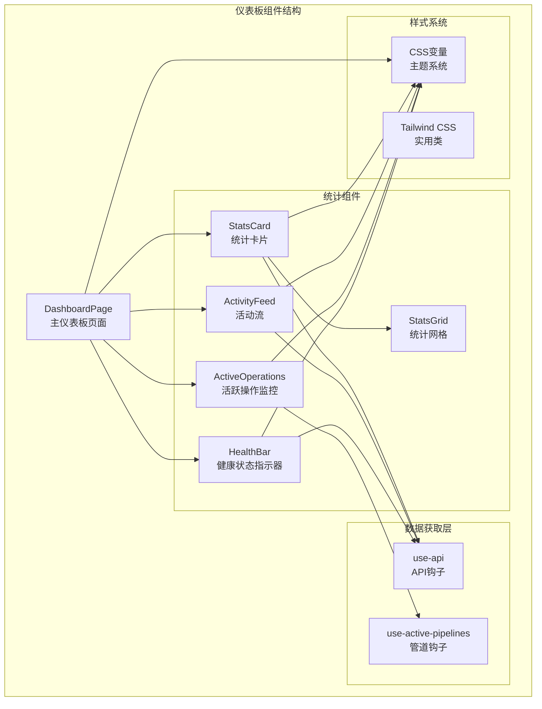
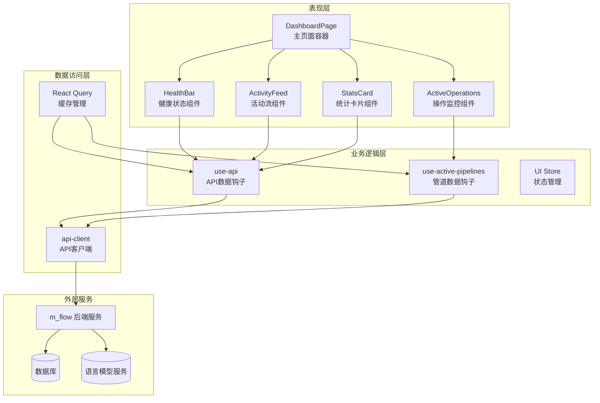
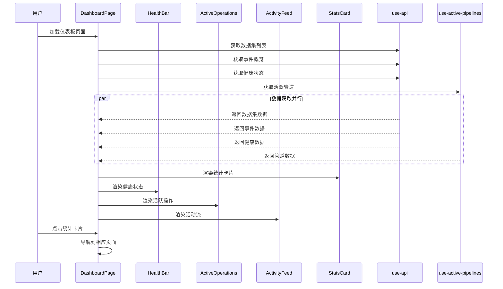
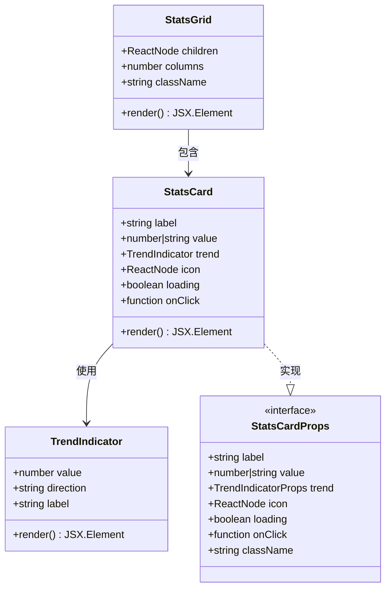
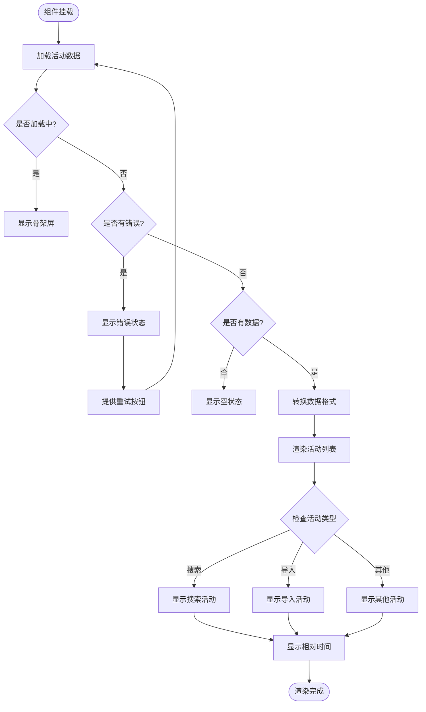
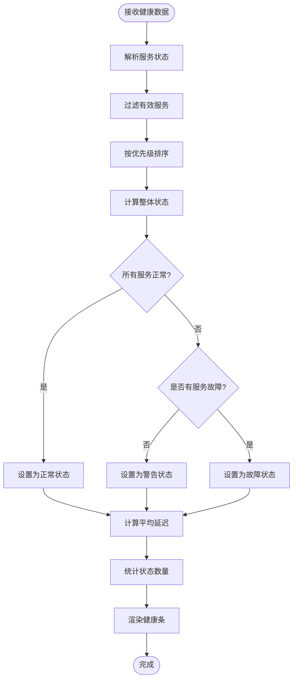
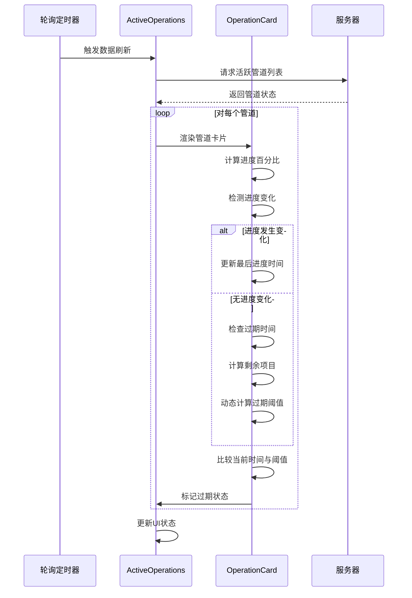
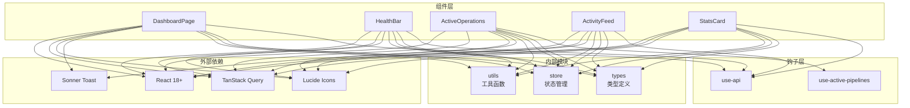

# 仪表板统计组件

<cite>
**本文档引用的文件**
- [DashboardPage.tsx](file://m_flow-frontend/src/components/dashboard/DashboardPage.tsx)
- [StatsCard.tsx](file://m_flow-frontend/src/components/dashboard/StatsCard.tsx)
- [ActivityFeed.tsx](file://m_flow-frontend/src/components/dashboard/ActivityFeed.tsx)
- [HealthBar.tsx](file://m_flow-frontend/src/components/dashboard/HealthBar.tsx)
- [ActiveOperations.tsx](file://m_flow-frontend/src/components/dashboard/ActiveOperations.tsx)
- [use-api.ts](file://m_flow-frontend/src/hooks/use-api.ts)
- [use-active-pipelines.ts](file://m_flow-frontend/src/hooks/use-active-pipelines.ts)
</cite>

## 目录
1. [简介](#简介)
2. [项目结构](#项目结构)
3. [核心组件](#核心组件)
4. [架构概览](#架构概览)
5. [详细组件分析](#详细组件分析)
6. [依赖关系分析](#依赖关系分析)
7. [性能考虑](#性能考虑)
8. [故障排除指南](#故障排除指南)
9. [结论](#结论)

## 简介

仪表板统计组件是 m_flow 系统前端的核心界面模块，负责展示系统的整体运行状态、关键指标统计、活动流信息和实时操作监控。该组件采用现代化的 React 架构设计，结合 TanStack Query 实现高效的数据管理和实时更新功能。

系统通过四个主要统计卡片展示核心指标：数据集数量、事件总数、实体面数和实体引用数。每个卡片都支持趋势显示、数值格式化和点击交互功能。活动流组件提供最近系统活动的时间线视图，支持多种事件类型的区分和实时更新。

健康状态指示器采用紧凑的胶囊式设计，实时显示各个服务组件的连接状态和延迟信息。活跃操作监控界面则提供了管道运行状态的可视化管理，包括进度跟踪、状态更新和异常处理机制。

## 项目结构

仪表板统计组件位于前端项目的 dashboard 目录中，采用模块化的组件设计：

**图表来源**
- [DashboardPage.tsx:158-362](file://m_flow-frontend/src/components/dashboard/DashboardPage.tsx#L158-L362)
- [StatsCard.tsx:92-189](file://m_flow-frontend/src/components/dashboard/StatsCard.tsx#L92-L189)
- [ActivityFeed.tsx:268-311](file://m_flow-frontend/src/components/dashboard/ActivityFeed.tsx#L268-L311)
- [HealthBar.tsx:96-229](file://m_flow-frontend/src/components/dashboard/HealthBar.tsx#L96-L229)
- [ActiveOperations.tsx:226-294](file://m_flow-frontend/src/components/dashboard/ActiveOperations.tsx#L226-L294)

**章节来源**
- [DashboardPage.tsx:18-36](file://m_flow-frontend/src/components/dashboard/DashboardPage.tsx#L18-L36)

## 核心组件

### 统计卡片系统

统计卡片组件是仪表板的核心数据展示单元，支持多种配置选项和交互功能：

- **关键指标展示**：支持数值显示、标签标识和图标集成
- **趋势指示器**：提供上升、下降和中性状态的可视化反馈
- **数值格式化**：自动处理大数字的本地化格式化显示
- **加载骨架屏**：提供平滑的加载体验和用户体验一致性

统计网格组件支持响应式布局，根据屏幕尺寸自动调整列数配置。

**章节来源**
- [StatsCard.tsx:24-159](file://m_flow-frontend/src/components/dashboard/StatsCard.tsx#L24-L159)
- [StatsCard.tsx:164-189](file://m_flow-frontend/src/components/dashboard/StatsCard.tsx#L164-L189)

### 活动流组件

活动流组件提供系统活动的实时时间线展示，支持多种事件类型和状态指示：

- **事件类型区分**：通过不同图标和颜色编码识别各类系统活动
- **时间线渲染**：支持相对时间格式化和本地化时间显示
- **实时更新机制**：基于轮询的自动刷新和错误恢复机制
- **状态可视化**：通过颜色编码和图标显示活动状态（成功、错误、待处理）

**章节来源**
- [ActivityFeed.tsx:35-311](file://m_flow-frontend/src/components/dashboard/ActivityFeed.tsx#L35-L311)

### 健康状态指示器

健康状态指示器采用紧凑的胶囊式设计，提供系统服务状态的实时监控：

- **状态颜色编码**：绿色表示正常，黄色表示警告，红色表示故障
- **阈值设置**：基于服务优先级和服务状态计算整体健康评分
- **延迟监控**：显示各服务的平均响应延迟和性能指标
- **手动刷新**：支持用户触发的手动状态刷新功能

**章节来源**
- [HealthBar.tsx:25-229](file://m_flow-frontend/src/components/dashboard/HealthBar.tsx#L25-L229)

### 活跃操作监控

活跃操作监控界面提供管道运行状态的可视化管理：

- **进度跟踪**：实时显示处理进度百分比和剩余项目数量
- **状态更新**：动态检测和标记过期或停滞的操作
- **异常处理**：提供操作终止确认和错误状态提示
- **时间显示**：显示操作开始时间和相对时间信息

**章节来源**
- [ActiveOperations.tsx:67-294](file://m_flow-frontend/src/components/dashboard/ActiveOperations.tsx#L67-L294)

## 架构概览

仪表板统计组件采用分层架构设计，实现了清晰的关注点分离：

**图表来源**
- [DashboardPage.tsx:158-362](file://m_flow-frontend/src/components/dashboard/DashboardPage.tsx#L158-L362)
- [use-api.ts:27-53](file://m_flow-frontend/src/hooks/use-api.ts#L27-L53)
- [use-active-pipelines.ts:33-43](file://m_flow-frontend/src/hooks/use-active-pipelines.ts#L33-L43)

## 详细组件分析

### DashboardPage 主组件

DashboardPage 是仪表板的主容器组件，负责协调各个子组件的渲染和数据管理：

**图表来源**
- [DashboardPage.tsx:158-362](file://m_flow-frontend/src/components/dashboard/DashboardPage.tsx#L158-L362)

**章节来源**
- [DashboardPage.tsx:158-362](file://m_flow-frontend/src/components/dashboard/DashboardPage.tsx#L158-L362)

### StatsCard 组件分析

StatsCard 组件实现了灵活的统计数据显示模式：

**图表来源**
- [StatsCard.tsx:24-159](file://m_flow-frontend/src/components/dashboard/StatsCard.tsx#L24-L159)
- [StatsCard.tsx:164-189](file://m_flow-frontend/src/components/dashboard/StatsCard.tsx#L164-L189)

**章节来源**
- [StatsCard.tsx:92-159](file://m_flow-frontend/src/components/dashboard/StatsCard.tsx#L92-L159)

### ActivityFeed 组件流程

活动流组件的渲染流程体现了复杂的状态管理和错误处理：

**图表来源**
- [ActivityFeed.tsx:268-311](file://m_flow-frontend/src/components/dashboard/ActivityFeed.tsx#L268-L311)

**章节来源**
- [ActivityFeed.tsx:268-311](file://m_flow-frontend/src/components/dashboard/ActivityFeed.tsx#L268-L311)

### HealthBar 组件算法

健康状态指示器的计算逻辑体现了多维度状态评估：

**图表来源**
- [HealthBar.tsx:96-229](file://m_flow-frontend/src/components/dashboard/HealthBar.tsx#L96-L229)

**章节来源**
- [HealthBar.tsx:96-229](file://m_flow-frontend/src/components/dashboard/HealthBar.tsx#L96-L229)

### ActiveOperations 组件监控

活跃操作监控的过期检测机制确保了系统的可靠性：

**图表来源**
- [ActiveOperations.tsx:226-294](file://m_flow-frontend/src/components/dashboard/ActiveOperations.tsx#L226-L294)

**章节来源**
- [ActiveOperations.tsx:226-294](file://m_flow-frontend/src/components/dashboard/ActiveOperations.tsx#L226-L294)

## 依赖关系分析

仪表板统计组件的依赖关系体现了清晰的模块化设计：

**图表来源**
- [DashboardPage.tsx:18-36](file://m_flow-frontend/src/components/dashboard/DashboardPage.tsx#L18-L36)
- [StatsCard.tsx:17-18](file://m_flow-frontend/src/components/dashboard/StatsCard.tsx#L17-L18)
- [ActivityFeed.tsx:17-29](file://m_flow-frontend/src/components/dashboard/ActivityFeed.tsx#L17-L29)
- [HealthBar.tsx:17-19](file://m_flow-frontend/src/components/dashboard/HealthBar.tsx#L17-L19)
- [ActiveOperations.tsx:10-19](file://m_flow-frontend/src/components/dashboard/ActiveOperations.tsx#L10-L19)

**章节来源**
- [use-api.ts:3-6](file://m_flow-frontend/src/hooks/use-api.ts#L3-L6)
- [use-active-pipelines.ts:7-9](file://m_flow-frontend/src/hooks/use-active-pipelines.ts#L7-L9)

## 性能考虑

仪表板统计组件在设计时充分考虑了性能优化：

### 缓存策略
- **智能缓存失效**：使用合理的 staleTime 配置避免过度请求
- **查询键隔离**：为不同数据源提供独立的缓存键
- **条件查询启用**：根据用户状态动态启用或禁用查询

### 数据刷新策略
- **差异化刷新间隔**：根据数据重要性设置不同的刷新频率
- **轮询优化**：活跃管道使用高频轮询，静态数据使用低频轮询
- **错误重试退避**：实现指数退避的错误重试机制

### 内存管理
- **引用优化**：使用 useRef 和 useMemo 避免不必要的重渲染
- **状态稳定化**：通过 useRef 稳定新用户状态判断
- **资源清理**：组件卸载时自动清理定时器和订阅

## 故障排除指南

### 常见问题诊断

**健康状态显示异常**
- 检查后端健康检查接口的可达性
- 验证服务配置和网络连接
- 查看浏览器开发者工具的网络请求

**统计数据不更新**
- 确认数据获取钩子的 refetchInterval 设置
- 检查 React Query 缓存状态
- 验证 API 响应格式和数据完整性

**活动流显示空白**
- 检查活动数据 API 的可用性
- 验证活动类型映射配置
- 确认错误处理逻辑的执行

**活跃操作监控无响应**
- 检查管道状态 API 的数据格式
- 验证过期检测算法的参数设置
- 确认用户权限和操作权限

**章节来源**
- [ActivityFeed.tsx:244-262](file://m_flow-frontend/src/components/dashboard/ActivityFeed.tsx#L244-L262)
- [HealthBar.tsx:145-152](file://m_flow-frontend/src/components/dashboard/HealthBar.tsx#L145-L152)
- [ActiveOperations.tsx:259-265](file://m_flow-frontend/src/components/dashboard/ActiveOperations.tsx#L259-L265)

## 结论

仪表板统计组件展现了现代前端开发的最佳实践，通过模块化设计、清晰的架构分离和完善的性能优化，为用户提供了一个功能丰富且响应迅速的系统监控界面。

组件设计的关键优势包括：
- **模块化架构**：清晰的组件职责分离和依赖管理
- **实时数据更新**：基于轮询和缓存的高效数据同步机制
- **用户体验优化**：骨架屏、状态管理和错误处理的完整覆盖
- **可扩展性**：灵活的配置选项和插件化的组件设计

未来可以考虑的改进方向：
- 增加 WebSocket 支持实现实时推送
- 扩展主题定制能力
- 添加更多交互式图表和可视化元素
- 优化移动端特定的交互体验