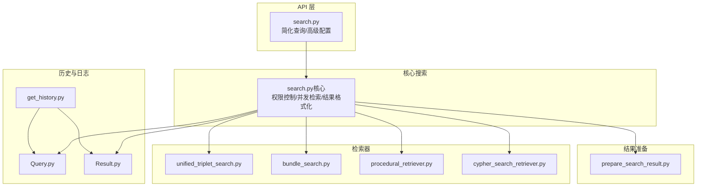
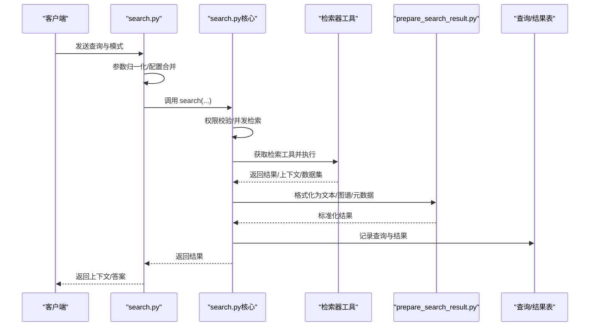
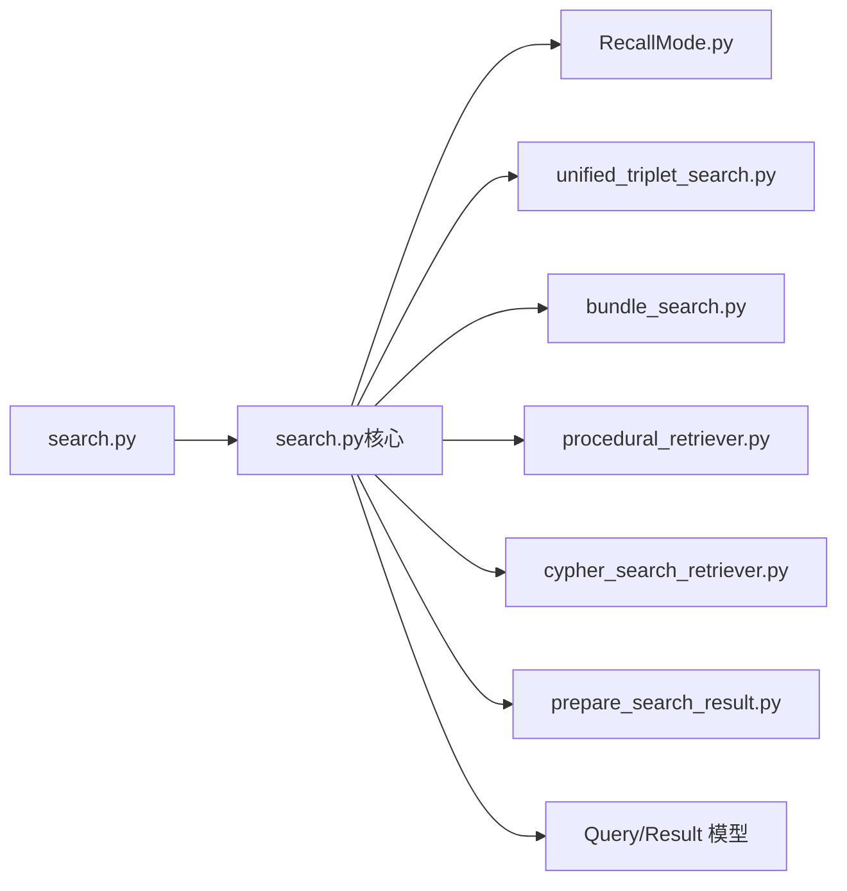

# 搜索结果组件

<cite>
**本文引用的文件**
- [search.py](file://m_flow/api/v1/search/search.py)
- [search.py（核心）](file://m_flow/search/methods/search.py)
- [RecallMode.py](file://m_flow/search/types/RecallMode.py)
- [Result.py](file://m_flow/search/models/Result.py)
- [Query.py](file://m_flow/search/models/Query.py)
- [prepare_search_result.py](file://m_flow/search/utils/prepare_search_result.py)
- [get_history.py](file://m_flow/search/operations/get_history.py)
- [cypher_search_retriever.py](file://m_flow/retrieval/cypher_search_retriever.py)
- [unified_triplet_search.py](file://m_flow/retrieval/unified_triplet_search.py)
- [bundle_search.py](file://m_flow/retrieval/episodic/bundle_search.py)
- [procedural_query_builder.py](file://m_flow/retrieval/orchestrators/procedural_retriever.py)
- [triplet_output_assembler.py](file://m_flow/retrieval/utils/triplet_output_assembler.py)
- [procedural_card_formatter.py](file://m_flow/retrieval/formatters/procedural_card_formatter.py)
</cite>

## 目录
1. [简介](#简介)
2. [项目结构](#项目结构)
3. [核心组件](#核心组件)
4. [架构总览](#架构总览)
5. [详细组件分析](#详细组件分析)
6. [依赖关系分析](#依赖关系分析)
7. [性能考虑](#性能考虑)
8. [故障排查指南](#故障排查指南)
9. [结论](#结论)
10. [附录](#附录)

## 简介
本文件面向“搜索结果展示组件”的设计与实现，系统性梳理从查询输入、过滤条件、检索模式切换到结果渲染、排序分页、详情展开、历史与常用查询管理，以及性能优化（缓存与懒加载）等完整链路。文档以后端搜索模块为核心，结合检索器与结果格式化工具，给出可落地的前端适配建议与交互规范。

## 项目结构
搜索能力由后端统一入口协调多类检索器与结果格式化工具完成，前端通过 API 调用获取结构化结果并进行渲染。关键路径如下：
- API 层：对外提供简化查询接口与高级配置接口
- 核心搜索：按权限模式执行多数据集并发检索，聚合上下文或生成答案
- 检索器：按检索模式选择对应工具（三元组、事件、程序化、Cypher、文本块）
- 结果准备：将原始结果转换为前端友好的文本、图谱与元数据
- 历史与日志：持久化查询与结果，支持历史回溯与审计

图表来源
- [search.py:135-301](file://m_flow/api/v1/search/search.py#L135-L301)
- [search.py（核心）:55-211](file://m_flow/search/methods/search.py#L55-L211)
- [prepare_search_result.py:19-76](file://m_flow/search/utils/prepare_search_result.py#L19-L76)
- [Query.py:18-28](file://m_flow/search/models/Query.py#L18-L28)
- [Result.py:18-28](file://m_flow/search/models/Result.py#L18-L28)
- [get_history.py:18-57](file://m_flow/search/operations/get_history.py#L18-L57)

章节来源
- [search.py:135-301](file://m_flow/api/v1/search/search.py#L135-L301)
- [search.py（核心）:55-211](file://m_flow/search/methods/search.py#L55-L211)

## 核心组件
- 查询入口与配置
  - 简化查询接口：提供模式映射与默认参数，快速返回上下文或答案
  - 高级配置接口：集中合并直接参数与配置对象，确保优先级与兼容性
- 权限与并发
  - 后端访问控制开关决定是否按数据集授权检索
  - 多数据集并发检索，按需合并上下文或逐数据集返回
- 检索模式
  - 三元组+LLM 完成：生成自然语言答案，适合复杂问答与洞察
  - 事件检索（Episodic）：基于片段/面/实体的记忆检索，适合事件驱动场景
  - 程序化检索（Procedural）：步骤化流程检索，适合操作指南与工作流
  - Cypher 直接查询：面向高级用户，支持图数据库原生查询
  - 文本块检索（Lexical）：关键词/停用词感知的精确匹配
- 结果准备与输出
  - 统一将结果转换为文本、图谱与元数据，支持仅上下文或完整答案
  - 支持组合上下文（跨数据集）后再生成答案
- 历史与日志
  - 记录查询与结果，支持历史回放与审计

章节来源
- [search.py:135-301](file://m_flow/api/v1/search/search.py#L135-L301)
- [search.py（核心）:55-211](file://m_flow/search/methods/search.py#L55-L211)
- [RecallMode.py:10-28](file://m_flow/search/types/RecallMode.py#L10-L28)
- [prepare_search_result.py:19-76](file://m_flow/search/utils/prepare_search_result.py#L19-L76)
- [Query.py:18-28](file://m_flow/search/models/Query.py#L18-L28)
- [Result.py:18-28](file://m_flow/search/models/Result.py#L18-L28)
- [get_history.py:18-57](file://m_flow/search/operations/get_history.py#L18-L57)

## 架构总览
下图展示一次典型搜索请求在后端的调用链与数据流：

图表来源
- [search.py:135-301](file://m_flow/api/v1/search/search.py#L135-L301)
- [search.py（核心）:55-211](file://m_flow/search/methods/search.py#L55-L211)
- [prepare_search_result.py:19-76](file://m_flow/search/utils/prepare_search_result.py#L19-L76)
- [Query.py:18-28](file://m_flow/search/models/Query.py#L18-L28)
- [Result.py:18-28](file://m_flow/search/models/Result.py#L18-L28)

## 详细组件分析

### 查询面板与输入处理
- 输入字段
  - 查询文本：必填，作为检索键
  - 数据集过滤：名称或 UUID 列表，支持空值表示全量
  - 检索模式：episodic/triplet/chunks/procedural/cypher
  - 结果数量：top_k 控制返回条数
  - 高级参数：系统提示、会话 ID、宽搜 top_k、距离惩罚、显示模式等
- 参数归一化与优先级
  - 名称/UUID 自动归一化
  - 配置对象与直接参数合并，直接参数优先
- 用户上下文
  - 解析当前用户，设置会话上下文变量，用于权限与租户隔离

章节来源
- [search.py:106-133](file://m_flow/api/v1/search/search.py#L106-L133)
- [search.py:229-250](file://m_flow/api/v1/search/search.py#L229-L250)
- [search.py:252-258](file://m_flow/api/v1/search/search.py#L252-L258)

### 过滤条件与权限控制
- 数据集过滤
  - 支持按名称或 UUID 过滤；名称需解析为 UUID 并校验读权限
- 权限模式
  - 启用后端访问控制时，按用户授权数据集并发检索
  - 关闭时，走无权限控制的单次检索封装
- 元数据保留
  - 返回时附带数据集 ID、名称、租户 ID 等信息（启用权限模式）

章节来源
- [search.py（核心）:293-324](file://m_flow/search/methods/search.py#L293-L324)
- [search.py（核心）:330-335](file://m_flow/search/methods/search.py#L330-L335)
- [search.py（核心）:262-290](file://m_flow/search/methods/search.py#L262-L290)

### 检索模式与结果差异
- 三元组+LLM 完成（推荐）
  - 特点：先向量化召回，再用图三元组重排，最后由 LLM 生成自然语言答案
  - 输出：answer + context + 图谱（可选）
- 事件检索（Episodic）
  - 特点：基于片段/面/实体的记忆图谱检索，强调事件上下文
  - 输出：上下文文本列表，可转为图谱视图
- 程序化检索（Procedural）
  - 特点：面向步骤化流程，适合操作指南与工作流
  - 输出：结构化流程卡片（经格式化器处理）
- Cypher 直接查询
  - 特点：原生图查询，适合高级用户
  - 输出：查询结果（通常为边/节点集合）
- 文本块检索（Lexical）
  - 特点：关键词/停用词感知的精确匹配
  - 输出：文本块列表

章节来源
- [RecallMode.py:10-28](file://m_flow/search/types/RecallMode.py#L10-L28)
- [unified_triplet_search.py](file://m_flow/retrieval/unified_triplet_search.py)
- [bundle_search.py](file://m_flow/retrieval/episodic/bundle_search.py)
- [procedural_query_builder.py](file://m_flow/retrieval/orchestrators/procedural_retriever.py)
- [procedural_card_formatter.py](file://m_flow/retrieval/formatters/procedural_card_formatter.py)
- [cypher_search_retriever.py](file://m_flow/retrieval/cypher_search_retriever.py)

### 结果渲染与元数据
- 文本与图谱
  - 上下文为字符串/字符串列表时，直接使用
  - 上下文为边集合时，转换为图谱并解析为文本
  - 结果为边集合时，生成结果图谱
- 元数据
  - 数据集名称、ID、租户 ID（权限模式下）
  - 可选图谱结构（graphs 字段）
- 三元组模式特例
  - 返回 answer + context + datasets 列表

章节来源
- [prepare_search_result.py:19-76](file://m_flow/search/utils/prepare_search_result.py#L19-L76)

### 排序与分页（含无限滚动）
- 排序
  - 由各检索器内部完成候选评分与重排，统一返回 top_k
- 分页
  - 当前实现以 top_k 控制一次性返回数量；未见显式分页游标参数
  - 建议前端采用“加载更多”或“无限滚动”策略时，结合会话 ID 或时间戳做去重与续载
- 会话与连续性
  - 支持 session_id，便于对话式检索的上下文延续

章节来源
- [search.py（核心）:62-71](file://m_flow/search/methods/search.py#L62-L71)
- [search.py（核心）:169-171](file://m_flow/search/methods/search.py#L169-L171)

### 详情展开与内容预览
- 展开/收起
  - 建议前端对每条结果提供“展开/收起”按钮，避免长上下文阻塞
- 内容预览
  - 对于图谱视图，提供缩略图与关键节点/关系预览
  - 对于文本上下文，提供首段摘要与关键词高亮
- 交互建议
  - 点击结果项触发详情面板，面板内支持复制、导出、跳转至图谱视图

（本节为概念性建议，不直接分析具体文件）

### 搜索历史与常用查询
- 历史记录
  - 查询与系统回答分别存储在 queries 与 results 表中
  - 提供历史合并查询接口，按时间线返回用户与系统消息
- 常用查询
  - 建议前端维护本地常用查询列表，支持收藏、分类与快捷触发
- 审计与回放
  - 历史接口可用于回放对话与审计

章节来源
- [Query.py:18-28](file://m_flow/search/models/Query.py#L18-L28)
- [Result.py:18-28](file://m_flow/search/models/Result.py#L18-L28)
- [get_history.py:18-57](file://m_flow/search/operations/get_history.py#L18-L57)

### 性能优化（缓存与懒加载）
- 结果缓存
  - 使用 session_id 作为缓存键，避免重复检索相同问题
  - 建议在网关或服务层增加短期缓存（如 Redis），命中则直接返回
- 懒加载
  - 详情面板按需加载图谱与全文，避免初始渲染阻塞
- 并发与限流
  - 多数据集并发检索已内置；建议配合速率限制与超时控制
- 日志与观测
  - 搜索执行阶段发送遥测事件，便于性能监控与问题定位

章节来源
- [search.py（核心）:213-222](file://m_flow/search/methods/search.py#L213-L222)
- [search.py（核心）:481-510](file://m_flow/search/methods/search.py#L481-L510)

## 依赖关系分析
- 模块耦合
  - API 层仅负责参数与配置，核心搜索负责权限与并发
  - 检索器通过工具工厂按模式注入，解耦不同检索策略
  - 结果准备模块独立于检索器，统一输出格式
- 外部依赖
  - 图数据库提供者（Graph Provider）
  - 向量/图数据库适配器
  - LLM 服务（三元组模式）
- 循环依赖
  - 未发现循环导入；检索器与核心搜索通过异步工具调用解耦

图表来源
- [search.py:135-301](file://m_flow/api/v1/search/search.py#L135-L301)
- [search.py（核心）:55-211](file://m_flow/search/methods/search.py#L55-L211)
- [RecallMode.py:10-28](file://m_flow/search/types/RecallMode.py#L10-L28)
- [prepare_search_result.py:19-76](file://m_flow/search/utils/prepare_search_result.py#L19-L76)
- [Query.py:18-28](file://m_flow/search/models/Query.py#L18-L28)
- [Result.py:18-28](file://m_flow/search/models/Result.py#L18-L28)

## 性能考虑
- 检索策略
  - 三元组模式成本较高，建议合理设置 top_k 与宽搜阈值
  - 事件与程序化检索可结合本地缓存与索引优化
- I/O 与并发
  - 多数据集并发检索提升吞吐；注意数据库连接池与超时设置
- 前端体验
  - 无限滚动与骨架屏结合，减少长列表渲染压力
  - 图谱渲染采用虚拟化或分批加载

（本节为通用指导，不直接分析具体文件）

## 故障排查指南
- 空知识图谱告警
  - 若数据项存在但图为空，会记录警告，提示先执行记忆化
- 权限不足
  - 未授权数据集将被过滤；确认用户对目标数据集有读权限
- 结果为空
  - 检查检索模式与关键词；适当放宽过滤条件或调整 top_k
- 历史无法加载
  - 确认用户 ID 正确且历史表存在；检查数据库连接

章节来源
- [search.py（核心）:604-615](file://m_flow/search/methods/search.py#L604-L615)
- [get_history.py:18-57](file://m_flow/search/operations/get_history.py#L18-L57)

## 结论
该搜索结果组件以统一入口协调多模式检索，具备完善的权限控制、并发检索与结果格式化能力。前端可据此实现多样化的结果展示与交互，包括事件、程序化与三元组模式的差异化呈现，并通过缓存与懒加载提升性能与体验。

## 附录
- 检索模式对照
  - 三元组+LLM：适合复杂问答与洞察
  - 事件检索：适合事件驱动与上下文回忆
  - 程序化检索：适合步骤化流程与工作流
  - Cypher：适合高级用户与原生图查询
  - 文本块：适合关键词精确匹配

（本节为概念性总结，不直接分析具体文件）