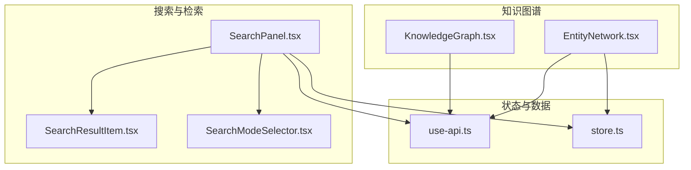
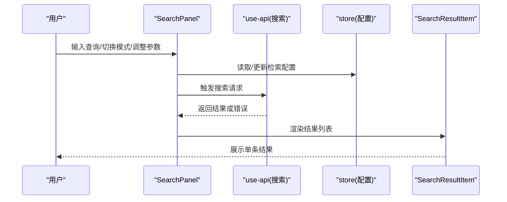
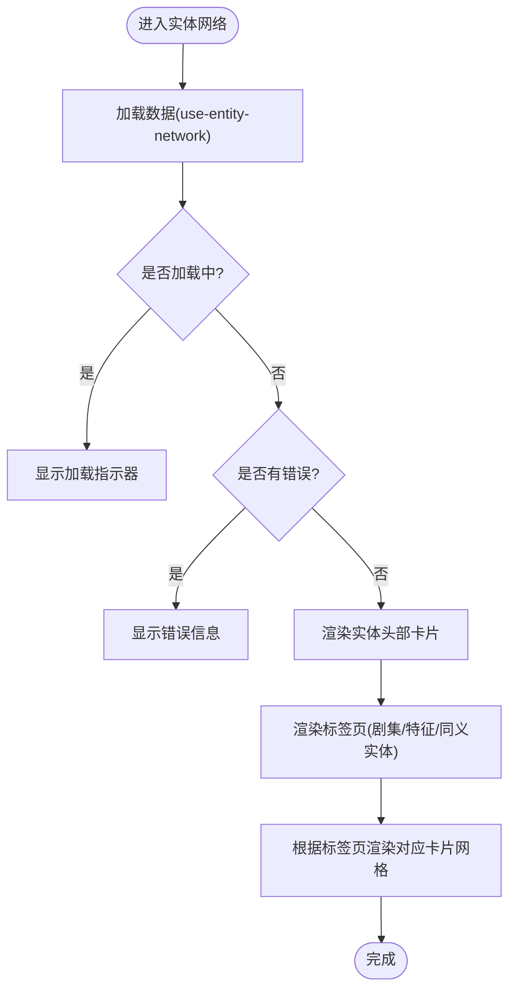
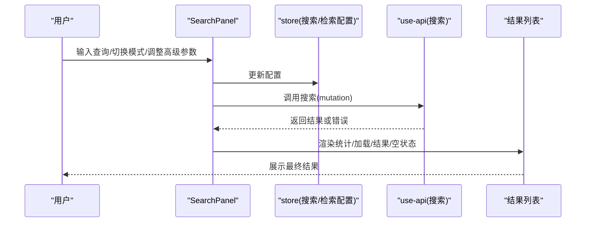
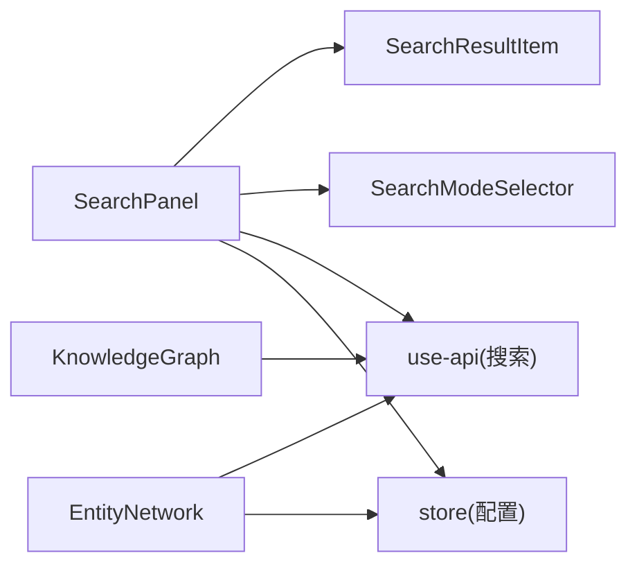

# 数据展示组件

<cite>
**本文引用的文件**
- [EntityNetwork.tsx](file://m_flow-frontend/src/components/graph/EntityNetwork.tsx)
- [SearchPanel.tsx](file://m_flow-frontend/src/components/search/SearchPanel.tsx)
- [SearchResultItem.tsx](file://m_flow-frontend/src/components/search/SearchResultItem.tsx)
- [SearchModeSelector.tsx](file://m_flow-frontend/src/components/search/SearchModeSelector.tsx)
- [use-api.ts](file://m_flow-frontend/src/hooks/use-api.ts)
- [store.ts](file://m_flow-frontend/src/lib/store/index.ts)
- [Skeleton.tsx](file://m_flow-frontend/src/components/common/Skeleton.tsx)
- [KnowledgeGraph.tsx](file://m_flow-frontend/src/KnowledgeGraph.tsx)
</cite>

## 目录
1. [简介](#简介)
2. [项目结构](#项目结构)
3. [核心组件](#核心组件)
4. [架构总览](#架构总览)
5. [详细组件分析](#详细组件分析)
6. [依赖关系分析](#依赖关系分析)
7. [性能考虑](#性能考虑)
8. [故障排查指南](#故障排查指南)
9. [结论](#结论)
10. [附录](#附录)

## 简介
本文件聚焦于数据展示类组件，涵盖以下主题：
- 知识图谱可视化：实体网络卡片布局与交互、图视图选择器与控制组件
- 检索结果展示：搜索面板、结果项渲染、模式切换与高级参数
- 数据表格组件：排序、筛选、分页与导出（概念性说明）
- 图表组件：折线图、柱状图、饼图的配置思路（概念性说明）
- 数据加载状态：骨架屏、进度条、空状态
- 响应式设计：移动端适配与触摸交互
- 数据格式化与本地化：概念性说明

## 项目结构
前端采用按功能域划分的目录结构，数据展示相关组件主要分布在 graph 与 search 两个模块中，并通过 hooks 与 store 实现数据获取与状态管理。

**图表来源**
- [SearchPanel.tsx:1-592](file://m_flow-frontend/src/components/search/SearchPanel.tsx#L1-L592)
- [SearchResultItem.tsx](file://m_flow-frontend/src/components/search/SearchResultItem.tsx)
- [SearchModeSelector.tsx](file://m_flow-frontend/src/components/search/SearchModeSelector.tsx)
- [EntityNetwork.tsx:1-274](file://m_flow-frontend/src/components/graph/EntityNetwork.tsx#L1-L274)
- [use-api.ts](file://m_flow-frontend/src/hooks/use-api.ts)
- [store.ts](file://m_flow-frontend/src/lib/store/index.ts)
- [KnowledgeGraph.tsx](file://m_flow-frontend/src/KnowledgeGraph.tsx)

**章节来源**
- [SearchPanel.tsx:1-592](file://m_flow-frontend/src/components/search/SearchPanel.tsx#L1-L592)
- [EntityNetwork.tsx:1-274](file://m_flow-frontend/src/components/graph/EntityNetwork.tsx#L1-L274)

## 核心组件
- 实体网络卡片展示组件：以卡片网格呈现“剧集”“特征”“同义实体”，支持标签页切换与动画过渡
- 搜索面板：统一入口，支持多种检索模式、高级参数配置、结果列表渲染与统计信息
- 结果项组件：封装单条检索结果的展示与交互
- 知识图谱组件：作为图视图的承载容器，配合视图选择器与控制组件使用

**章节来源**
- [EntityNetwork.tsx:17-229](file://m_flow-frontend/src/components/graph/EntityNetwork.tsx#L17-L229)
- [SearchPanel.tsx:36-579](file://m_flow-frontend/src/components/search/SearchPanel.tsx#L36-L579)
- [SearchResultItem.tsx](file://m_flow-frontend/src/components/search/SearchResultItem.tsx)
- [KnowledgeGraph.tsx](file://m_flow-frontend/src/KnowledgeGraph.tsx)

## 架构总览
下图展示了从用户输入到数据渲染的关键调用链路，以及与状态存储和 API Hook 的交互。

**图表来源**
- [SearchPanel.tsx:73-119](file://m_flow-frontend/src/components/search/SearchPanel.tsx#L73-L119)
- [use-api.ts](file://m_flow-frontend/src/hooks/use-api.ts)
- [store.ts](file://m_flow-frontend/src/lib/store/index.ts)
- [SearchResultItem.tsx](file://m_flow-frontend/src/components/search/SearchResultItem.tsx)

## 详细组件分析

### 实体网络组件（EntityNetwork）
- 组件职责
  - 展示与指定实体关联的“剧集”“特征”“同义实体”
  - 使用卡片网格布局，支持标签页切换与动画过渡
  - 提供回调以联动上层视图（如进入剧集/特征详情）
- 数据流
  - 通过 use-entity-network Hook 获取数据
  - 加载态显示旋转指示器；错误态显示错误图标与消息
  - 支持空状态提示
- 布局与交互
  - 头部卡片显示实体名称、类型与数量统计
  - 三段式标签页：剧集、特征、同义实体
  - 卡片采用逐项入场动画，增强可读性
- 可扩展点
  - 可增加更多连接类型或自定义卡片样式
  - 可引入分页或虚拟滚动以提升大数据量下的性能

**图表来源**
- [EntityNetwork.tsx:22-228](file://m_flow-frontend/src/components/graph/EntityNetwork.tsx#L22-L228)

**章节来源**
- [EntityNetwork.tsx:1-274](file://m_flow-frontend/src/components/graph/EntityNetwork.tsx#L1-L274)

### 搜索面板（SearchPanel）
- 组件职责
  - 提供统一的查询入口与检索模式选择
  - 高级参数面板：Top-K、数据集过滤、合并多数据集结果、混合检索、时间奖励、适应性权重、显示模式、每剧集最大特征数、每特征最大要点数、节点名过滤、共指消解、边缺失代价、跳步代价、关键词匹配奖励、直达剧集惩罚、系统提示、宽搜索 Top-K、三元组距离惩罚、详细输出等
  - 结果区：统计信息、加载指示、结果列表、空状态
- 关键流程
  - 用户输入查询并触发搜索
  - 将当前检索配置与高级参数打包发送至后端
  - 接收结果后渲染统计与列表
  - 错误时显示错误状态
- 交互细节
  - 支持键盘回车快速搜索
  - 高级面板展开/收起使用动画
  - 结果列表使用逐项入场动画

**图表来源**
- [SearchPanel.tsx:36-579](file://m_flow-frontend/src/components/search/SearchPanel.tsx#L36-L579)
- [use-api.ts](file://m_flow-frontend/src/hooks/use-api.ts)
- [store.ts](file://m_flow-frontend/src/lib/store/index.ts)

**章节来源**
- [SearchPanel.tsx:1-592](file://m_flow-frontend/src/components/search/SearchPanel.tsx#L1-L592)

### 检索结果项（SearchResultItem）
- 组件职责
  - 渲染单条检索结果，承载上下文、评分、来源等信息
  - 与上层 SearchPanel 协作，支持点击查看详情或进一步操作
- 设计建议
  - 可扩展为不同模式下的差异化渲染（摘要/详情）
  - 可加入收藏、复制、导出等操作按钮

**章节来源**
- [SearchResultItem.tsx](file://m_flow-frontend/src/components/search/SearchResultItem.tsx)

### 搜索模式选择器（SearchModeSelector）
- 组件职责
  - 提供检索模式切换（如 EPISODIC、PROCEDURAL、TRIPLET_COMPLETION、CHUNKS_LEXICAL、CYPHER）
  - 与 SearchPanel 共享状态，驱动高级参数面板的显隐与可用选项
- 设计建议
  - 可结合图标与简短说明提升易用性
  - 可在模式切换时重置不兼容的高级参数

**章节来源**
- [SearchModeSelector.tsx](file://m_flow-frontend/src/components/search/SearchModeSelector.tsx)

### 知识图谱容器（KnowledgeGraph）
- 组件职责
  - 作为图视图的承载容器，配合图视图选择器与控制组件使用
  - 可集成 D3.js 或其他可视化库进行图布局与交互
- 设计建议
  - 抽象出图配置接口，便于切换不同布局算法
  - 提供缩放、平移、节点高亮、批量选择等交互能力

**章节来源**
- [KnowledgeGraph.tsx](file://m_flow-frontend/src/KnowledgeGraph.tsx)

## 依赖关系分析
- 组件间耦合
  - SearchPanel 与 SearchResultItem 强耦合：前者负责数据与状态，后者负责单项渲染
  - SearchPanel 与 SearchModeSelector 松耦合：通过共享配置状态进行协作
  - EntityNetwork 与 use-api 存在直接依赖：通过 Hook 获取数据
- 外部依赖
  - 动画：Framer Motion
  - 图标：Lucide
  - 状态：自研 store（配置与检索参数）

**图表来源**
- [SearchPanel.tsx:1-592](file://m_flow-frontend/src/components/search/SearchPanel.tsx#L1-L592)
- [SearchResultItem.tsx](file://m_flow-frontend/src/components/search/SearchResultItem.tsx)
- [SearchModeSelector.tsx](file://m_flow-frontend/src/components/search/SearchModeSelector.tsx)
- [EntityNetwork.tsx:1-274](file://m_flow-frontend/src/components/graph/EntityNetwork.tsx#L1-L274)
- [use-api.ts](file://m_flow-frontend/src/hooks/use-api.ts)
- [store.ts](file://m_flow-frontend/src/lib/store/index.ts)
- [KnowledgeGraph.tsx](file://m_flow-frontend/src/KnowledgeGraph.tsx)

**章节来源**
- [SearchPanel.tsx:1-592](file://m_flow-frontend/src/components/search/SearchPanel.tsx#L1-L592)
- [EntityNetwork.tsx:1-274](file://m_flow-frontend/src/components/graph/EntityNetwork.tsx#L1-L274)

## 性能考虑
- 列表渲染优化
  - 使用逐项入场动画时注意延迟设置，避免大量节点同时渲染造成卡顿
  - 对长列表可考虑虚拟滚动或分页
- 请求与缓存
  - 合理设置请求去抖与防抖，避免频繁重复请求
  - 对检索结果进行本地缓存，减少重复请求
- 图视图优化
  - 对大规模图数据采用采样或层级抽稀策略
  - 使用 Canvas/WebGL 进行大规模节点绘制（如后续接入 D3.js）
- 响应式与触摸
  - 移动端优先使用触摸友好的尺寸与间距
  - 在小屏设备上将网格布局降级为列表

## 故障排查指南
- 搜索失败
  - 现象：结果显示“搜索失败”，并带有错误图标
  - 排查：检查网络请求状态码与后端日志；确认检索参数合法性
- 空结果
  - 现象：无结果或“未找到”
  - 排查：确认查询词是否过短；尝试放宽高级参数（如 Top-K、宽搜索 K、关键词匹配奖励）
- 加载缓慢
  - 现象：长时间显示加载指示器
  - 排查：检查检索模式与参数组合；适当降低 Top-K 或启用混合检索的适应性权重
- 图视图卡顿
  - 现象：节点过多导致渲染卡顿
  - 排查：减少一次性渲染节点数量；启用抽稀或采样；优化布局算法

**章节来源**
- [SearchPanel.tsx:532-576](file://m_flow-frontend/src/components/search/SearchPanel.tsx#L532-L576)
- [EntityNetwork.tsx:46-58](file://m_flow-frontend/src/components/graph/EntityNetwork.tsx#L46-L58)

## 结论
本项目的数据展示组件围绕“搜索—结果—图视图”的主路径构建，具备清晰的职责划分与良好的可扩展性。实体网络采用卡片网格布局，强调可读性与交互体验；搜索面板提供丰富的检索参数与可视化反馈。未来可在图视图中引入 D3.js 与更完善的交互能力，并在表格与图表组件中补充排序、筛选、分页与导出功能，以满足更复杂的业务场景。

## 附录

### 数据加载状态处理清单
- 骨架屏：用于占位与引导，提升感知速度
  - 示例组件：Skeleton
- 进度条：长任务或后台处理时显示
- 空状态：无结果或无数据时的友好提示

**章节来源**
- [Skeleton.tsx](file://m_flow-frontend/src/components/common/Skeleton.tsx)

### 响应式设计与触摸交互
- 断点与布局
  - 使用 Tailwind 响应式断点，确保在移动端与平板上的可读性
- 触摸交互
  - 采用较大的点击目标尺寸，避免误触
  - 在滑动场景中提供惯性滚动与阻尼效果

### 数据格式化与本地化
- 数字与日期
  - 使用浏览器 Intl API 或第三方库进行本地化格式化
- 文本截断与省略
  - 对超长文本采用省略号与悬浮提示
- 多语言
  - 通过配置表与翻译键值对实现文案本地化