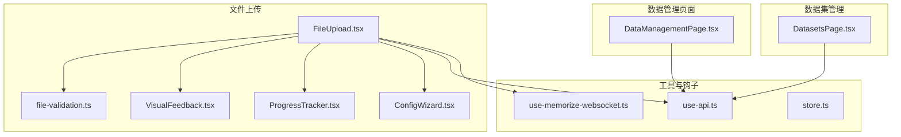
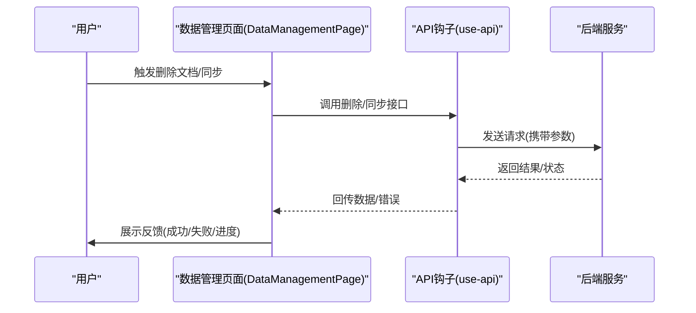
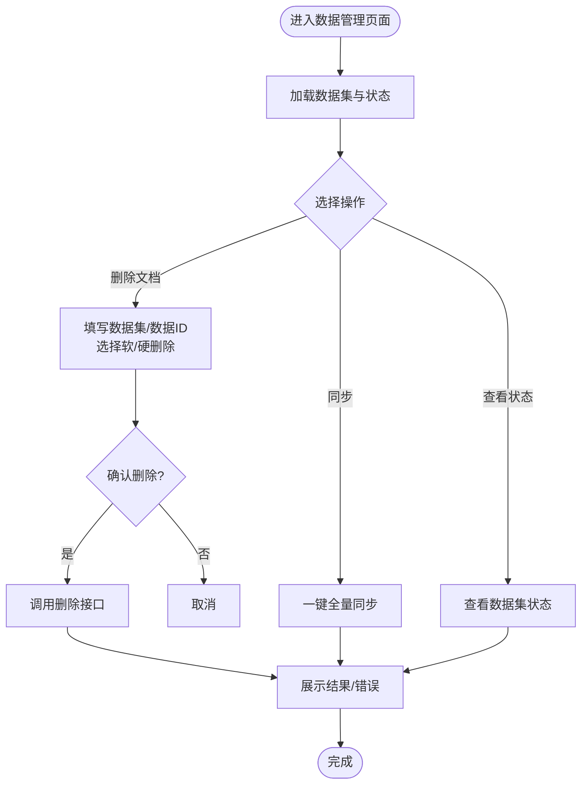
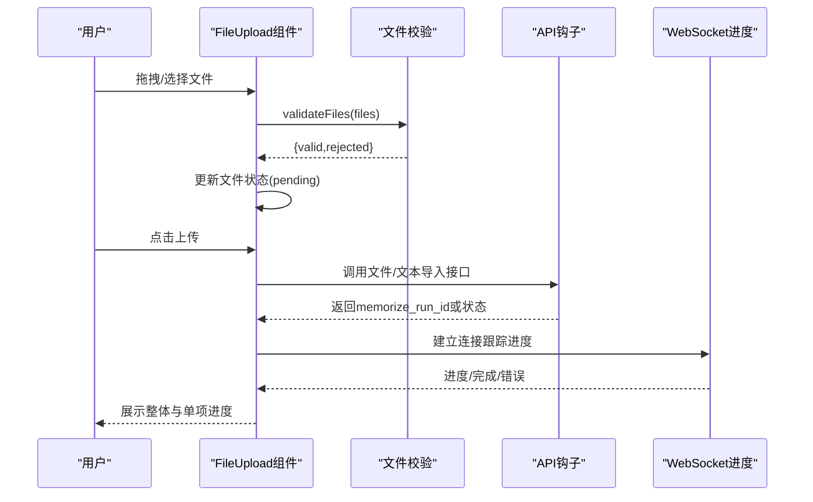
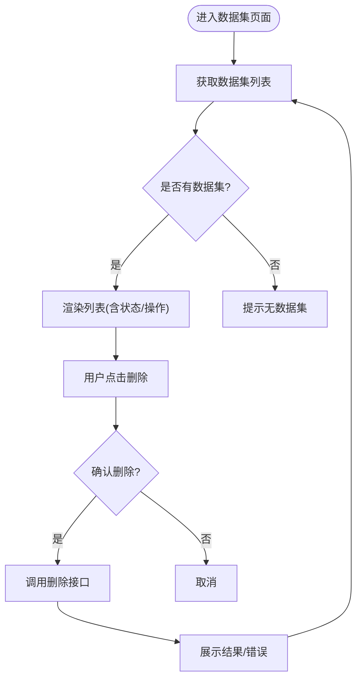
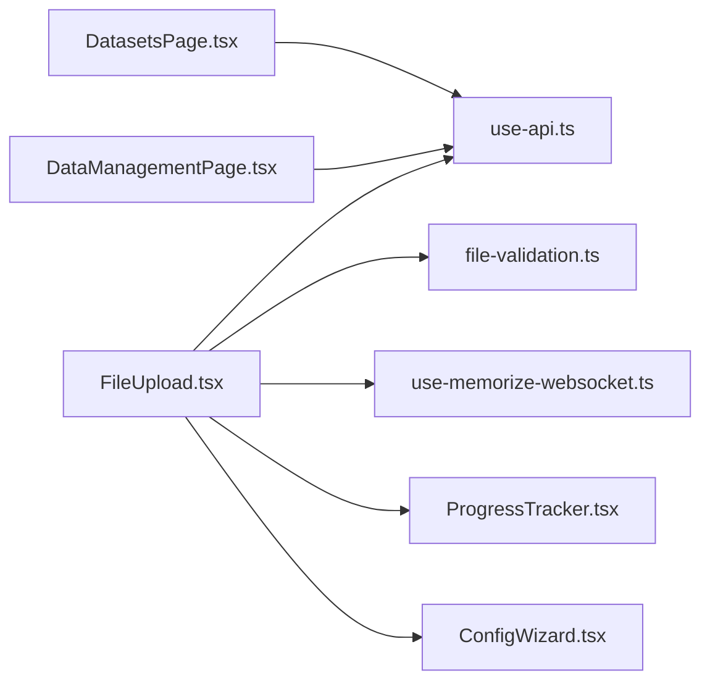

# 数据管理组件

<cite>
**本文档引用的文件**
- [DataManagementPage.tsx](file://m_flow-frontend/src/components/data/DataManagementPage.tsx)
- [FileUpload.tsx](file://m_flow-frontend/src/components/upload/FileUpload.tsx)
- [file-validation.ts](file://m_flow-frontend/src/lib/file-validation.ts)
- [DatasetsPage.tsx](file://m_flow-frontend/src/components/datasets/DatasetsPage.tsx)
- [use-api.ts](file://m_flow-frontend/src/hooks/use-api.ts)
- [VisualFeedback.tsx](file://m_flow-frontend/src/components/common/VisualFeedback.tsx)
- [ProgressTracker.tsx](file://m_flow-frontend/src/components/common/ProgressTracker.tsx)
- [ConfigWizard.tsx](file://m_flow-frontend/src/components/memorize/ConfigWizard.tsx)
- [use-memorize-websocket.ts](file://m_flow-frontend/src/hooks/use-memorize-websocket.ts)
- [store.ts](file://m_flow-frontend/src/lib/store.ts)
</cite>

## 目录
1. [简介](#简介)
2. [项目结构](#项目结构)
3. [核心组件](#核心组件)
4. [架构总览](#架构总览)
5. [详细组件分析](#详细组件分析)
6. [依赖关系分析](#依赖关系分析)
7. [性能考量](#性能考量)
8. [故障排查指南](#故障排查指南)
9. [结论](#结论)
10. [附录](#附录)

## 简介
本文件面向数据管理组件的使用者与维护者，系统性梳理前端数据管理页面的功能布局与操作流程，深入解析文件上传组件（拖拽上传、文件类型验证、上传进度显示）、数据集管理界面（列表、创建/编辑、删除）、导出功能实现（格式选择、范围筛选、批量导出机制）、数据导入的状态管理与错误处理、数据验证与预览方案，以及文件存储与传输的安全考虑与后端 API 交互模式。

## 项目结构
数据管理相关前端代码主要位于 m_flow-frontend/src/components 下，围绕以下模块组织：
- 数据管理页面：负责文档删除、数据同步、数据集状态展示
- 文件上传组件：支持拖拽/点击选择、多文件校验、进度跟踪
- 数据集管理页面：展示数据集列表、统计信息与删除操作
- 工具与钩子：文件校验、API 钩子、WebSocket 进度跟踪、配置向导等

**图表来源**
- [DataManagementPage.tsx:1-221](file://m_flow-frontend/src/components/data/DataManagementPage.tsx#L1-L221)
- [FileUpload.tsx:1-715](file://m_flow-frontend/src/components/upload/FileUpload.tsx#L1-L715)
- [file-validation.ts:1-155](file://m_flow-frontend/src/lib/file-validation.ts#L1-L155)
- [DatasetsPage.tsx:1-118](file://m_flow-frontend/src/components/datasets/DatasetsPage.tsx#L1-L118)
- [use-api.ts](file://m_flow-frontend/src/hooks/use-api.ts)
- [VisualFeedback.tsx](file://m_flow-frontend/src/components/common/VisualFeedback.tsx)
- [ProgressTracker.tsx](file://m_flow-frontend/src/components/common/ProgressTracker.tsx)
- [ConfigWizard.tsx](file://m_flow-frontend/src/components/memorize/ConfigWizard.tsx)
- [use-memorize-websocket.ts](file://m_flow-frontend/src/hooks/use-memorize-websocket.ts)
- [store.ts](file://m_flow-frontend/src/lib/store.ts)

**章节来源**
- [DataManagementPage.tsx:1-221](file://m_flow-frontend/src/components/data/DataManagementPage.tsx#L1-L221)
- [FileUpload.tsx:1-715](file://m_flow-frontend/src/components/upload/FileUpload.tsx#L1-L715)
- [DatasetsPage.tsx:1-118](file://m_flow-frontend/src/components/datasets/DatasetsPage.tsx#L1-L118)

## 核心组件
- 数据管理页面：提供文档删除、全量/按数据集同步、数据集状态查看与触发同步
- 文件上传组件：统一的拖拽/点击上传入口，文件类型与大小校验，进度可视化与后台处理
- 数据集管理页面：数据集列表展示、删除操作与加载状态处理
- 工具与钩子：文件校验规则、API 调用封装、WebSocket 实时进度跟踪、配置向导

**章节来源**
- [DataManagementPage.tsx:19-218](file://m_flow-frontend/src/components/data/DataManagementPage.tsx#L19-L218)
- [FileUpload.tsx:42-714](file://m_flow-frontend/src/components/upload/FileUpload.tsx#L42-L714)
- [DatasetsPage.tsx:11-117](file://m_flow-frontend/src/components/datasets/DatasetsPage.tsx#L11-L117)
- [file-validation.ts:11-154](file://m_flow-frontend/src/lib/file-validation.ts#L11-L154)

## 架构总览
数据管理组件通过 React 组件与自定义 Hook 协作，调用后端 API 完成数据管理与导入流程；文件上传采用分层设计：UI 展示层、校验层、API 层与实时进度层。

**图表来源**
- [DataManagementPage.tsx:31-64](file://m_flow-frontend/src/components/data/DataManagementPage.tsx#L31-L64)
- [use-api.ts](file://m_flow-frontend/src/hooks/use-api.ts)

**章节来源**
- [DataManagementPage.tsx:19-64](file://m_flow-frontend/src/components/data/DataManagementPage.tsx#L19-L64)

## 详细组件分析

### 数据管理页面(DataManagementPage)
- 功能布局
  - 删除文档区域：选择数据集、输入数据 ID、选择软/硬删除模式、执行删除
  - 数据同步区域：查看运行中同步状态、一键全量同步、查看最新同步进度
  - 数据集状态区域：周期刷新数据集列表与状态，支持单数据集同步
- 操作流程
  - 加载数据集与状态 → 用户选择操作 → 调用对应 API → 展示结果与错误
- 错误处理
  - 参数缺失提示、确认对话框、API 失败回退与用户提示

**图表来源**
- [DataManagementPage.tsx:31-64](file://m_flow-frontend/src/components/data/DataManagementPage.tsx#L31-L64)

**章节来源**
- [DataManagementPage.tsx:19-218](file://m_flow-frontend/src/components/data/DataManagementPage.tsx#L19-L218)

### 文件上传组件(FileUpload)
- 拖拽上传
  - 支持拖拽进入/离开/释放事件，视觉反馈增强，禁用状态下不可交互
  - 点击触发隐藏的文件选择输入框
- 文件类型验证
  - 基于扩展名白名单与大小限制进行校验，拒绝项即时提示
  - 支持文本内容直接输入与文件混合提交
- 上传进度显示
  - 文件状态机：pending → uploading → success/error
  - 总体进度条与单项状态图标，WebSocket 实时跟踪构建进度
  - 后台处理模式下显示“正在处理”状态与可取消/重试操作
- 高级选项
  - 跳过知识图谱构建、后台异步处理、场景化路由开关、配置向导应用

**图表来源**
- [FileUpload.tsx:107-252](file://m_flow-frontend/src/components/upload/FileUpload.tsx#L107-L252)
- [file-validation.ts:111-125](file://m_flow-frontend/src/lib/file-validation.ts#L111-L125)
- [use-memorize-websocket.ts](file://m_flow-frontend/src/hooks/use-memorize-websocket.ts)

**章节来源**
- [FileUpload.tsx:42-714](file://m_flow-frontend/src/components/upload/FileUpload.tsx#L42-L714)
- [file-validation.ts:11-154](file://m_flow-frontend/src/lib/file-validation.ts#L11-L154)

### 数据集管理界面(DatasetsPage)
- 列表展示：名称、条目数量、创建时间、状态徽章
- 删除操作：带确认的删除流程，加载态与错误提示
- 加载与错误处理：骨架屏、错误提示与重试按钮

**图表来源**
- [DatasetsPage.tsx:16-27](file://m_flow-frontend/src/components/datasets/DatasetsPage.tsx#L16-L27)

**章节来源**
- [DatasetsPage.tsx:11-117](file://m_flow-frontend/src/components/datasets/DatasetsPage.tsx#L11-L117)

### 导出功能实现
- 格式选择：在导入/处理流程中通过高级设置或配置向导控制输出格式与范围
- 范围筛选：按数据集、时间范围、内容类型等维度筛选导出目标
- 批量导出机制：后端提供批量导出任务，前端轮询任务状态并提供下载链接
- 注意：当前仓库未发现独立的导出页面组件，建议在现有导入/处理流程基础上扩展导出能力

[本节为概念性说明，不直接分析具体文件]

### 数据导入的状态管理与错误处理
- 状态机：pending → uploading → success/error
- 错误分类：类型错误、大小超限、空文件、其他异常
- 反馈策略：Toast 提示、禁用交互、错误归因与可操作建议

**章节来源**
- [FileUpload.tsx:21-25](file://m_flow-frontend/src/components/upload/FileUpload.tsx#L21-L25)
- [file-validation.ts:39-48](file://m_flow-frontend/src/lib/file-validation.ts#L39-L48)

### 数据验证与预览
- 文件验证：扩展名校验、大小限制、空文件检测
- 数据集命名：长度与字符集约束
- 预览：上传前可预览文件名与大小，支持移除

**章节来源**
- [file-validation.ts:54-154](file://m_flow-frontend/src/lib/file-validation.ts#L54-L154)
- [FileUpload.tsx:640-696](file://m_flow-frontend/src/components/upload/FileUpload.tsx#L640-L696)

### 文件存储与传输安全
- 传输安全：建议使用 HTTPS，避免明文传输敏感数据
- 存储安全：后端对上传文件进行鉴权与访问控制，限制可见范围
- 输入净化：严格校验文件类型与大小，防止恶意文件注入
- 会话与令牌：确保 API 请求携带有效认证信息

[本节为通用安全建议，不直接分析具体文件]

### 与后端 API 的交互模式与数据同步机制
- API 钩子：统一封装数据集查询、删除、同步、导入等接口
- 数据同步：支持全量同步与按数据集同步，前端轮询最新运行同步状态
- 实时进度：WebSocket 连接跟踪知识图谱构建进度，支持取消与重连

**章节来源**
- [use-api.ts](file://m_flow-frontend/src/hooks/use-api.ts)
- [DataManagementPage.tsx:20-24](file://m_flow-frontend/src/components/data/DataManagementPage.tsx#L20-L24)
- [use-memorize-websocket.ts](file://m_flow-frontend/src/hooks/use-memorize-websocket.ts)

## 依赖关系分析
- 组件内聚与耦合
  - FileUpload 依赖文件校验、API 钩子、WebSocket、配置向导与进度组件
  - DataManagementPage 依赖数据集与同步状态 API 钩子
  - DatasetsPage 依赖数据集列表与删除 API 钩子
- 外部依赖
  - React Query 用于数据获取与缓存
  - Framer Motion 用于动画与视觉反馈
  - Tailwind CSS 用于样式组织

**图表来源**
- [FileUpload.tsx:1-715](file://m_flow-frontend/src/components/upload/FileUpload.tsx#L1-L715)
- [DataManagementPage.tsx:1-221](file://m_flow-frontend/src/components/data/DataManagementPage.tsx#L1-L221)
- [DatasetsPage.tsx:1-118](file://m_flow-frontend/src/components/datasets/DatasetsPage.tsx#L1-L118)
- [file-validation.ts:1-155](file://m_flow-frontend/src/lib/file-validation.ts#L1-L155)
- [use-api.ts](file://m_flow-frontend/src/hooks/use-api.ts)
- [use-memorize-websocket.ts](file://m_flow-frontend/src/hooks/use-memorize-websocket.ts)
- [ProgressTracker.tsx](file://m_flow-frontend/src/components/common/ProgressTracker.tsx)
- [ConfigWizard.tsx](file://m_flow-frontend/src/components/memorize/ConfigWizard.tsx)

**章节来源**
- [FileUpload.tsx:1-715](file://m_flow-frontend/src/components/upload/FileUpload.tsx#L1-L715)
- [DataManagementPage.tsx:1-221](file://m_flow-frontend/src/components/data/DataManagementPage.tsx#L1-L221)
- [DatasetsPage.tsx:1-118](file://m_flow-frontend/src/components/datasets/DatasetsPage.tsx#L1-L118)

## 性能考量
- 上传性能
  - 合理设置并发与分片策略（如需），避免阻塞 UI
  - 使用虚拟滚动与懒加载渲染大列表
- 渲染性能
  - 使用 React.memo 与 useMemo 优化频繁更新的列表项
  - 动画与过渡仅在必要时启用
- 网络性能
  - 合理的缓存策略与请求去抖
  - WebSocket 连接复用与断线重连指数退避

[本节提供通用指导，不直接分析具体文件]

## 故障排查指南
- 文件上传失败
  - 检查文件类型与大小是否符合要求
  - 查看网络状态与后端服务可用性
  - 关注 WebSocket 连接状态与错误信息
- 删除/同步操作异常
  - 确认数据集与数据 ID 是否正确
  - 查看后端返回的错误码与消息
- 数据集列表为空
  - 确认已存在数据集或先进行导入
  - 尝试手动刷新或检查权限

**章节来源**
- [FileUpload.tsx:107-252](file://m_flow-frontend/src/components/upload/FileUpload.tsx#L107-L252)
- [DataManagementPage.tsx:31-64](file://m_flow-frontend/src/components/data/DataManagementPage.tsx#L31-L64)
- [DatasetsPage.tsx:16-27](file://m_flow-frontend/src/components/datasets/DatasetsPage.tsx#L16-L27)

## 结论
数据管理组件以清晰的页面分工与完善的错误处理保障了用户体验，文件上传组件提供了从校验到进度可视化的完整链路，数据集管理页面实现了对数据资产的集中治理。后续可在现有基础上扩展独立导出页面，并完善导出格式与范围筛选能力，进一步提升数据管理的灵活性与安全性。

## 附录
- 关键常量与配置
  - 接受的文件类型与最大大小
  - 数据集命名规则
- 建议扩展点
  - 独立导出页面与批量导出任务
  - 数据验证预览与二次确认
  - 更细粒度的权限控制与审计日志

**章节来源**
- [file-validation.ts:11-154](file://m_flow-frontend/src/lib/file-validation.ts#L11-L154)