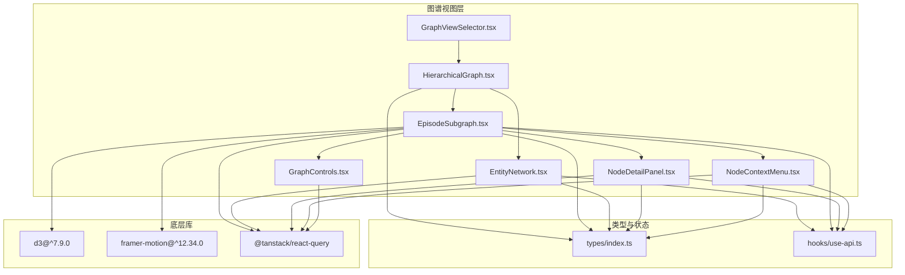
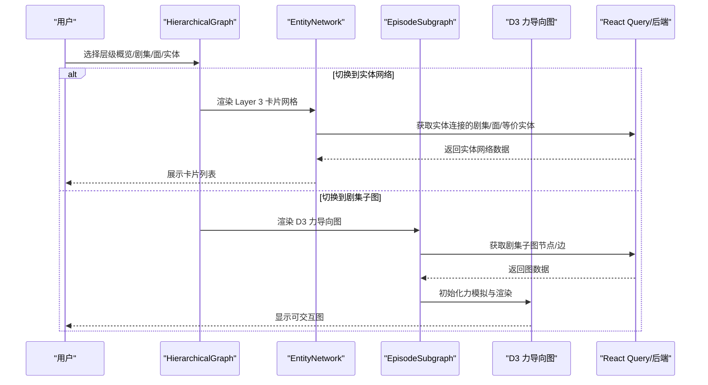
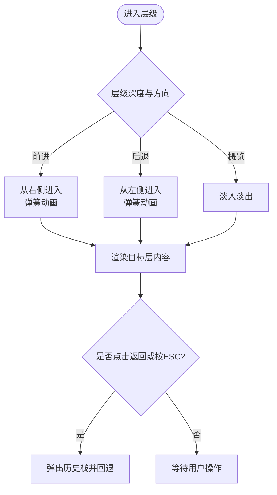
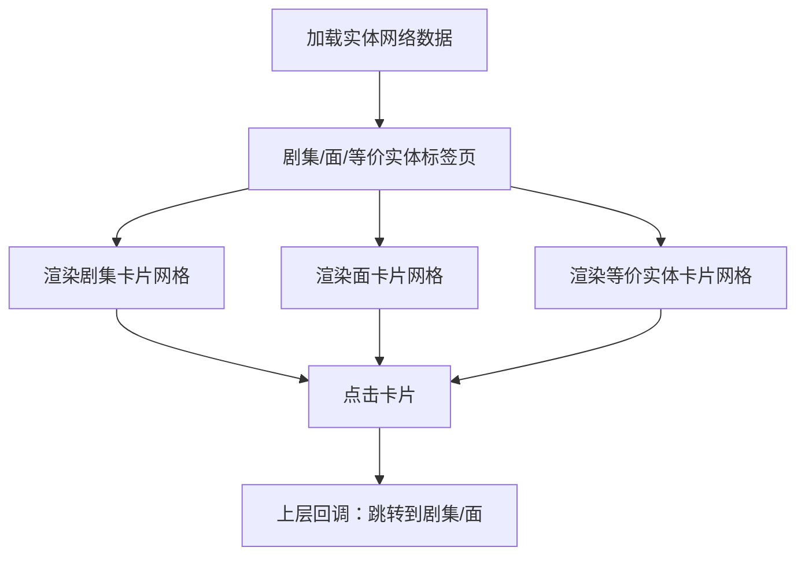
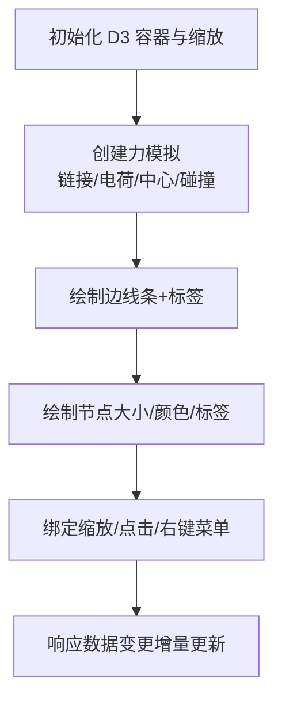
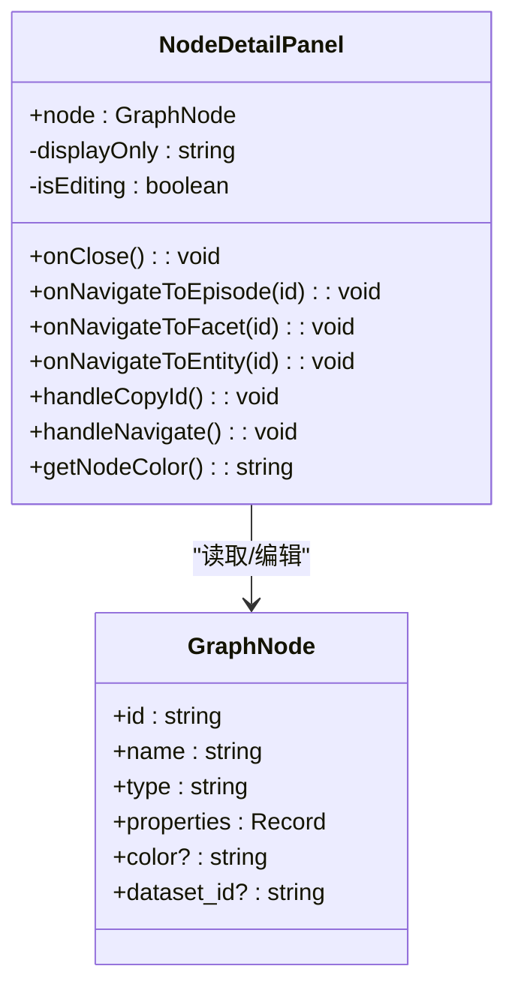
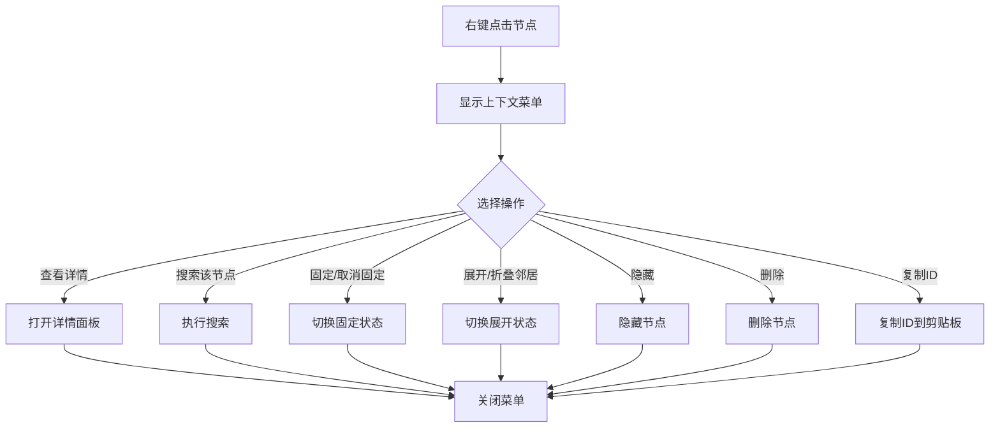
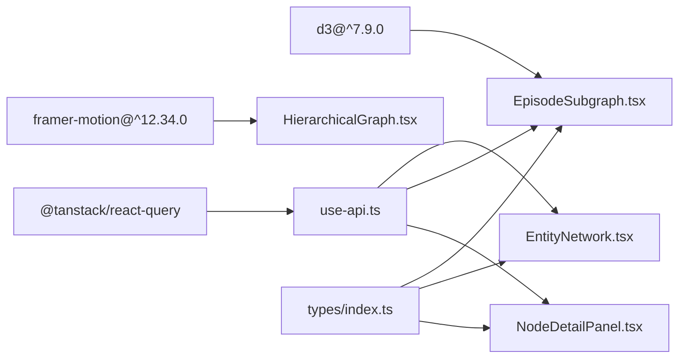

# 知识图谱可视化

<cite>
**本文引用的文件**
- [EntityNetwork.tsx](file://m_flow-frontend/src/components/graph/EntityNetwork.tsx)
- [HierarchicalGraph.tsx](file://m_flow-frontend/src/components/graph/HierarchicalGraph.tsx)
- [NodeDetailPanel.tsx](file://m_flow-frontend/src/components/graph/NodeDetailPanel.tsx)
- [NodeContextMenu.tsx](file://m_flow-frontend/src/components/graph/NodeContextMenu.tsx)
- [GraphControls.tsx](file://m_flow-frontend/src/components/graph/GraphControls.tsx)
- [GraphViewSelector.tsx](file://m_flow-frontend/src/components/graph/GraphViewSelector.tsx)
- [EpisodeSubgraph.tsx](file://m_flow-frontend/src/components/graph/EpisodeSubgraph.tsx)
- [KnowledgeGraph.tsx](file://m_flow-frontend/src/components/KnowledgeGraph.tsx)
- [types/index.ts](file://m_flow-frontend/src/types/index.ts)
- [use-api.ts](file://m_flow-frontend/src/hooks/use-api.ts)
- [package.json](file://m_flow-frontend/package.json)
</cite>

## 目录
1. [简介](#简介)
2. [项目结构](#项目结构)
3. [核心组件](#核心组件)
4. [架构总览](#架构总览)
5. [详细组件分析](#详细组件分析)
6. [依赖分析](#依赖分析)
7. [性能考虑](#性能考虑)
8. [故障排查指南](#故障排查指南)
9. [结论](#结论)
10. [附录](#附录)

## 简介
本文件系统性梳理并解读知识图谱可视化组件的前端实现，重点覆盖以下方面：
- D3.js 集成与力导向布局、节点与边渲染机制
- 实体网络图（Layer 3）：节点大小映射、颜色编码、标签显示策略
- 层次化图（层级导航）：层级布局算法与折叠展开交互
- 节点详情面板：信息聚合、属性展示与关联关系导航
- 上下文菜单：右键菜单、快捷操作与批量选择能力
- 图缩放、平移与聚焦交互
- 性能优化策略：虚拟化渲染与增量更新

## 项目结构
前端采用 Next.js + TypeScript 构建，图谱相关组件集中在 m_flow-frontend/src/components/graph 下，并通过 hooks/use-api.ts 统一管理数据获取与缓存。



**图表来源**
- [GraphViewSelector.tsx:1-19](file://m_flow-frontend/src/components/graph/GraphViewSelector.tsx#L1-L19)
- [HierarchicalGraph.tsx:1-716](file://m_flow-frontend/src/components/graph/HierarchicalGraph.tsx#L1-L716)
- [EntityNetwork.tsx:1-274](file://m_flow-frontend/src/components/graph/EntityNetwork.tsx#L1-L274)
- [EpisodeSubgraph.tsx:278-324](file://m_flow-frontend/src/components/graph/EpisodeSubgraph.tsx#L278-L324)
- [NodeDetailPanel.tsx:1-351](file://m_flow-frontend/src/components/graph/NodeDetailPanel.tsx#L1-L351)
- [NodeContextMenu.tsx:1-155](file://m_flow-frontend/src/components/graph/NodeContextMenu.tsx#L1-L155)
- [GraphControls.tsx:1-162](file://m_flow-frontend/src/components/graph/GraphControls.tsx#L1-L162)
- [types/index.ts:186-224](file://m_flow-frontend/src/types/index.ts#L186-L224)
- [use-api.ts:539-595](file://m_flow-frontend/src/hooks/use-api.ts#L539-L595)
- [package.json:32-32](file://m_flow-frontend/package.json#L32-L32)

**章节来源**
- [GraphViewSelector.tsx:1-19](file://m_flow-frontend/src/components/graph/GraphViewSelector.tsx#L1-L19)
- [package.json:32-32](file://m_flow-frontend/package.json#L32-L32)

## 核心组件
- 层次化图导航器：负责多层（概览/剧集/面/实体/程序）的渐进式展开与返回，提供面包屑导航与动画过渡。
- 实体网络图（Layer 3）：以卡片网格展示与某实体直接相连的剧集、面与等价实体，避免大规模力导渲染。
- 剧集子图：基于 D3 的力导向图，支持链接距离、电荷强度等参数调节，以及标签悬停显示。
- 节点详情面板：集中展示节点属性、摘要、内容与编辑入口，支持跳转到关联层级。
- 右键上下文菜单：提供固定/展开/隐藏/删除/复制 ID/搜索等快捷操作。
- 图控件：切换布局（力导/层次/圆形）、调节力导参数、缩放、适配视图、刷新与导出。

**章节来源**
- [HierarchicalGraph.tsx:258-716](file://m_flow-frontend/src/components/graph/HierarchicalGraph.tsx#L258-L716)
- [EntityNetwork.tsx:22-229](file://m_flow-frontend/src/components/graph/EntityNetwork.tsx#L22-L229)
- [EpisodeSubgraph.tsx:278-324](file://m_flow-frontend/src/components/graph/EpisodeSubgraph.ts#L278-L324)
- [NodeDetailPanel.tsx:23-351](file://m_flow-frontend/src/components/graph/NodeDetailPanel.tsx#L23-L351)
- [NodeContextMenu.tsx:35-155](file://m_flow-frontend/src/components/graph/NodeContextMenu.tsx#L35-L155)
- [GraphControls.tsx:51-162](file://m_flow-frontend/src/components/graph/GraphControls.tsx#L51-L162)

## 架构总览
整体采用“分层导航 + 子图渲染”的混合架构：
- 层级导航（HierarchicalGraph）负责宏观浏览与层级切换，使用 Framer Motion 提供流畅的进入/退出动画。
- 子图渲染（EpisodeSubgraph）在具体层级内使用 D3 力导向布局，结合 React Query 缓存与增量更新。
- 数据模型统一由 types/index.ts 定义，API 访问通过 hooks/use-api.ts 封装。



**图表来源**
- [HierarchicalGraph.tsx:566-691](file://m_flow-frontend/src/components/graph/HierarchicalGraph.tsx#L566-L691)
- [EntityNetwork.tsx:22-229](file://m_flow-frontend/src/components/graph/EntityNetwork.tsx#L22-L229)
- [EpisodeSubgraph.tsx:278-324](file://m_flow-frontend/src/components/graph/EpisodeSubgraph.tsx#L278-L324)
- [use-api.ts:589-595](file://m_flow-frontend/src/hooks/use-api.ts#L589-L595)

## 详细组件分析

### 层次化图导航（HierarchicalGraph）
- 导航状态管理：维护当前层级与历史栈，支持前进/后退与键盘 ESC 返回。
- 动画与过渡：根据层级深度与方向选择不同的进入/退出变体，提供弹簧/淡入等动画。
- 程序记忆开关：实验性开关，支持一键移除程序数据。
- 事件处理：封装面包屑导航、层级切换回调与返回逻辑。



**图表来源**
- [HierarchicalGraph.tsx:467-474](file://m_flow-frontend/src/components/graph/HierarchicalGraph.tsx#L467-L474)
- [HierarchicalGraph.tsx:390-401](file://m_flow-frontend/src/components/graph/HierarchicalGraph.tsx#L390-L401)

**章节来源**
- [HierarchicalGraph.tsx:258-716](file://m_flow-frontend/src/components/graph/HierarchicalGraph.tsx#L258-L716)

### 实体网络图（Layer 3：EntityNetwork）
- 数据来源：通过 useEntityNetwork 获取实体连接的剧集、面与等价实体。
- 呈现方式：卡片网格布局，支持标签页切换（剧集/面/等价实体），使用 Framer Motion 进行淡入/滑动过渡。
- 交互：点击卡片触发上层回调（跳转到剧集或面）。



**图表来源**
- [EntityNetwork.tsx:22-229](file://m_flow-frontend/src/components/graph/EntityNetwork.tsx#L22-L229)
- [use-api.ts:589-595](file://m_flow-frontend/src/hooks/use-api.ts#L589-L595)

**章节来源**
- [EntityNetwork.tsx:22-229](file://m_flow-frontend/src/components/graph/EntityNetwork.tsx#L22-L229)
- [use-api.ts:589-595](file://m_flow-frontend/src/hooks/use-api.ts#L589-L595)

### 剧集子图（EpisodeSubgraph）与 D3 力导向布局
- 力模拟配置：链接力、电荷力、中心力、碰撞半径；衰减与速度阻尼参数优化稳定度。
- 边渲染：线条样式与透明度，标签默认隐藏，悬停显示。
- 交互：缩放/平移、节点点击/右键菜单、详情面板联动。
- 数据过滤：按视图层级过滤节点与边，减少渲染开销。



**图表来源**
- [EpisodeSubgraph.tsx:278-324](file://m_flow-frontend/src/components/graph/EpisodeSubgraph.tsx#L278-L324)
- [KnowledgeGraph.tsx:92-390](file://m_flow-frontend/src/components/KnowledgeGraph.tsx#L92-L390)

**章节来源**
- [EpisodeSubgraph.tsx:278-324](file://m_flow-frontend/src/components/graph/EpisodeSubgraph.tsx#L278-L324)
- [KnowledgeGraph.tsx:92-390](file://m_flow-frontend/src/components/KnowledgeGraph.tsx#L92-L390)

### 节点详情面板（NodeDetailPanel）
- 信息聚合：名称、摘要/描述、属性、ID、数据集标识。
- 类型颜色：按节点类型映射颜色，便于快速识别。
- 操作入口：导航到关联层级、复制 ID、编辑显示名（PATCH 请求）。
- 时间字段格式化：对时间戳属性进行本地化格式化展示。



**图表来源**
- [NodeDetailPanel.tsx:23-351](file://m_flow-frontend/src/components/graph/NodeDetailPanel.tsx#L23-L351)
- [types/index.ts:186-200](file://m_flow-frontend/src/types/index.ts#L186-L200)

**章节来源**
- [NodeDetailPanel.tsx:23-351](file://m_flow-frontend/src/components/graph/NodeDetailPanel.tsx#L23-L351)
- [types/index.ts:186-200](file://m_flow-frontend/src/types/index.ts#L186-L200)

### 右键上下文菜单（NodeContextMenu）
- 快捷操作：查看详情、搜索该节点、固定/取消固定位置、展开/折叠邻居、隐藏、删除、复制 ID。
- 状态感知：根据节点 pinned/expanded 状态动态显示菜单项。
- 事件传播：点击菜单项后自动关闭菜单。



**图表来源**
- [NodeContextMenu.tsx:35-155](file://m_flow-frontend/src/components/graph/NodeContextMenu.tsx#L35-L155)

**章节来源**
- [NodeContextMenu.tsx:35-155](file://m_flow-frontend/src/components/graph/NodeContextMenu.tsx#L35-L155)

### 图控件（GraphControls）
- 布局切换：力导/层次/圆形三类布局（当前主要使用力导）。
- 力导参数：链接距离、电荷强度（负值表示斥力）。
- 视图控制：缩放、适配视图、刷新数据、导出 PNG/SVG/JSON、统计信息展示。

```mermaid
classDiagram
class GraphControls {
+layout : LayoutType
+linkDistance : number
+chargeStrength : number
+nodeCount : number
+edgeCount : number
+onLayoutChange(layout) : void
+onLinkDistanceChange(distance) : void
+onChargeStrengthChange(strength) : void
+onZoomIn() : void
+onZoomOut() : void
+onFitView() : void
+onRefresh() : void
+onExport(format) : void
}
class LayoutType {
<<enum>>
"force"
"hierarchical"
"circular"
}
```

**图表来源**
- [GraphControls.tsx:27-162](file://m_flow-frontend/src/components/graph/GraphControls.tsx#L27-L162)

**章节来源**
- [GraphControls.tsx:27-162](file://m_flow-frontend/src/components/graph/GraphControls.tsx#L27-L162)

## 依赖分析
- D3.js：用于力导向图的节点/边渲染与交互（版本 7.9.0）。
- Framer Motion：为层级切换与面板显示提供流畅动画。
- React Query：统一的数据获取、缓存与失效策略，支持多层级数据隔离。
- 类型系统：GraphNode/GraphEdge/GraphData 等类型定义确保前后端一致的数据契约。



**图表来源**
- [package.json:32-32](file://m_flow-frontend/package.json#L32-L32)
- [use-api.ts:539-595](file://m_flow-frontend/src/hooks/use-api.ts#L539-L595)
- [types/index.ts:186-224](file://m_flow-frontend/src/types/index.ts#L186-L224)

**章节来源**
- [package.json:32-32](file://m_flow-frontend/package.json#L32-L32)
- [use-api.ts:539-595](file://m_flow-frontend/src/hooks/use-api.ts#L539-L595)
- [types/index.ts:186-224](file://m_flow-frontend/src/types/index.ts#L186-L224)

## 性能考虑
- 虚拟化渲染
  - 实体网络图采用卡片网格布局，避免大规模 DOM 节点，适合中等规模连接集合。
  - 剧集子图使用 D3 渲染，建议在节点数量较大时启用节点/边过滤与标签延迟显示。
- 增量更新
  - React Query 的查询键包含 datasetId，确保多数据集场景下的缓存隔离与精准失效。
  - D3 场景中优先更新数据而非重建整个图，减少重排与重绘。
- 力导向参数优化
  - 合理设置链接距离与电荷强度，避免过度抖动；限制最大作用距离与碰撞半径。
- 交互节流
  - 缩放/拖拽事件可配合节流/防抖，降低高频事件对主线程的压力。
- 数据预处理
  - 在渲染前过滤无关节点/边，减少不必要的绘制单元。

[本节为通用指导，无需特定文件引用]

## 故障排查指南
- 加载失败
  - 实体网络图在错误时显示错误提示与消息；检查 useEntityNetwork 查询与后端接口可用性。
- 动画异常
  - 层级切换动画依赖 LayoutGroup 与变体配置，确认层级状态与方向计算正确。
- D3 图不显示
  - 检查容器尺寸变化与缩放绑定；确认数据已过滤且非空。
- 右键菜单不消失
  - 确认菜单项点击后调用 onClose 关闭；Overlay 点击区域需覆盖全屏。
- 编辑保存失败
  - NodeDetailPanel 的 PATCH 请求需携带节点类型与 display_only 字段；查看 toast 错误提示。

**章节来源**
- [EntityNetwork.tsx:46-58](file://m_flow-frontend/src/components/graph/EntityNetwork.tsx#L46-L58)
- [HierarchicalGraph.tsx:477-486](file://m_flow-frontend/src/components/graph/HierarchicalGraph.tsx#L477-L486)
- [EpisodeSubgraph.tsx:278-324](file://m_flow-frontend/src/components/graph/EpisodeSubgraph.tsx#L278-L324)
- [NodeContextMenu.tsx:104-155](file://m_flow-frontend/src/components/graph/NodeContextMenu.tsx#L104-L155)
- [NodeDetailPanel.tsx:299-311](file://m_flow-frontend/src/components/graph/NodeDetailPanel.tsx#L299-L311)

## 结论
该知识图谱可视化方案通过“层级导航 + 子图渲染”的组合，兼顾了可探索性与性能表现。D3 力导向图提供了丰富的交互能力，而实体网络图则在大规模连接场景下提供了更稳定的浏览体验。配合 React Query 的缓存与增量更新策略，整体具备良好的扩展性与维护性。

[本节为总结，无需特定文件引用]

## 附录

### 数据模型与类型
- GraphNode：节点基础结构，包含 id、name、type、properties、坐标与数据集标识。
- GraphEdge：边结构，包含 source/target 与关系标签。
- GraphData：节点与边集合。
- EntityNetworkNode：实体网络返回的连接节点结构。
- NavigationState：层级导航状态，包含当前层级与上下文信息。

**章节来源**
- [types/index.ts:186-224](file://m_flow-frontend/src/types/index.ts#L186-L224)
- [types/index.ts:250-271](file://m_flow-frontend/src/types/index.ts#L250-L271)
- [types/index.ts:274-292](file://m_flow-frontend/src/types/index.ts#L274-L292)