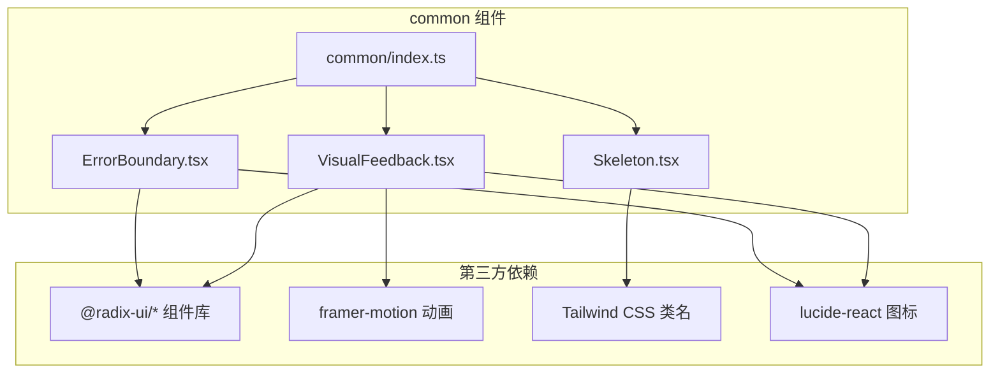
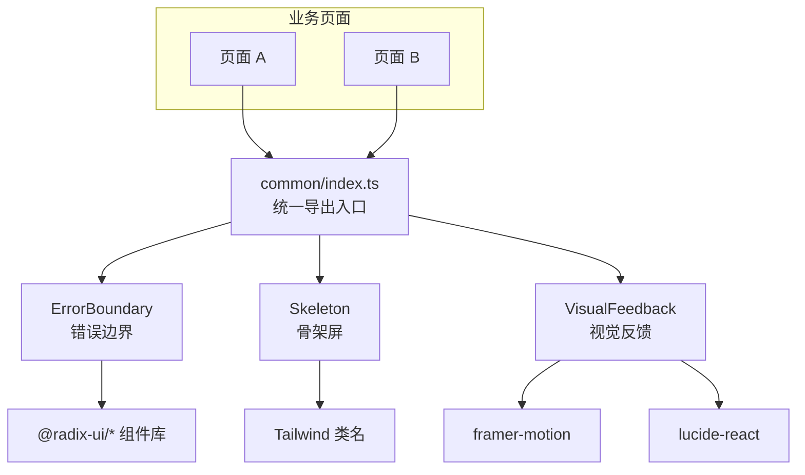
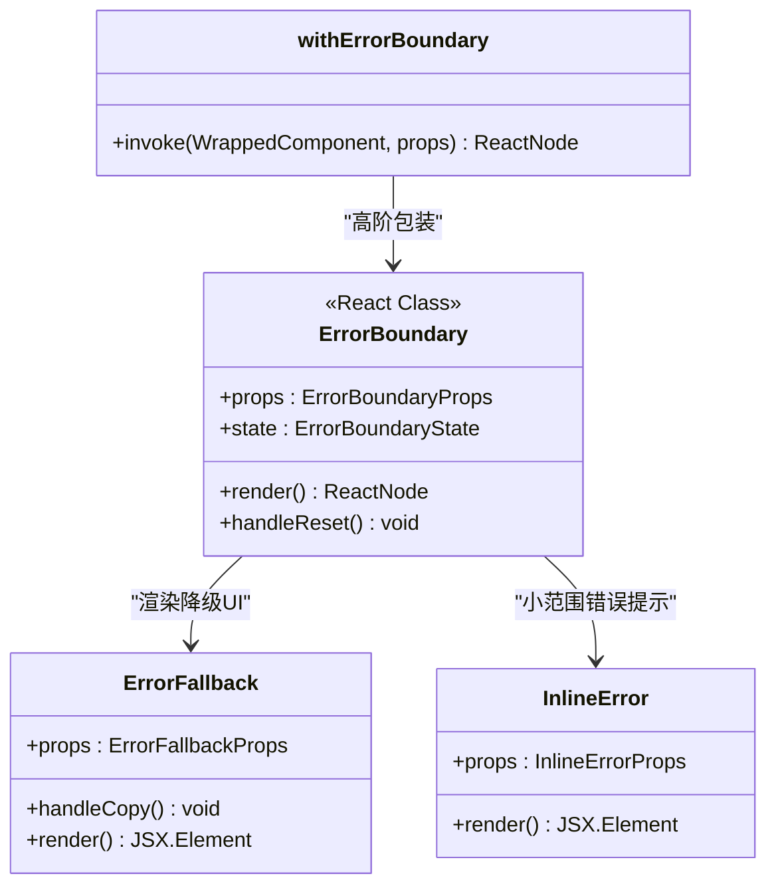
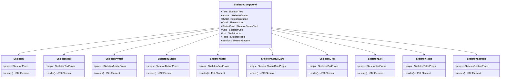
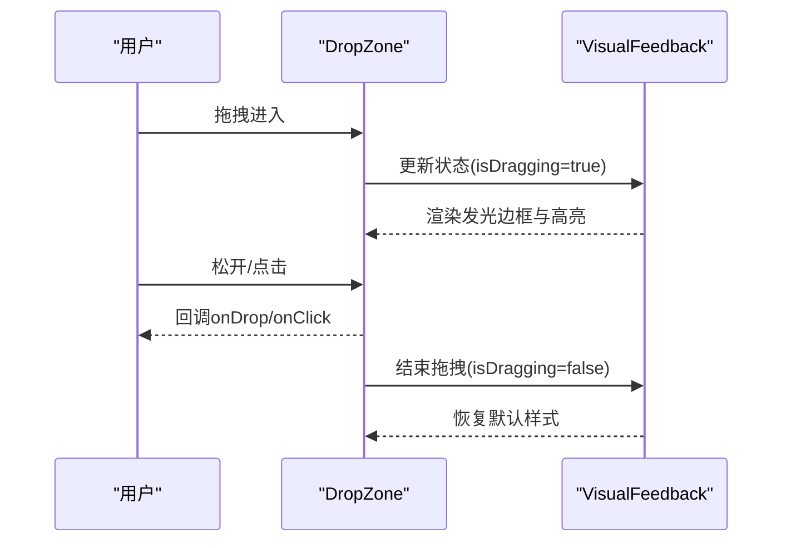
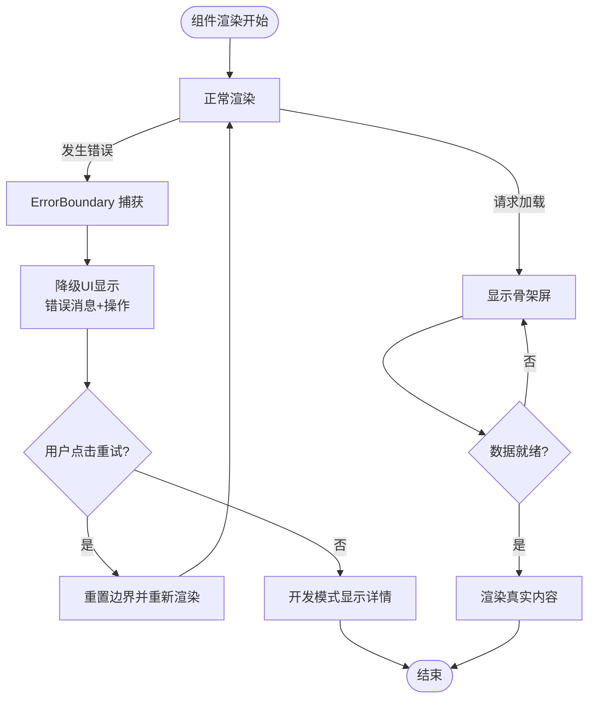
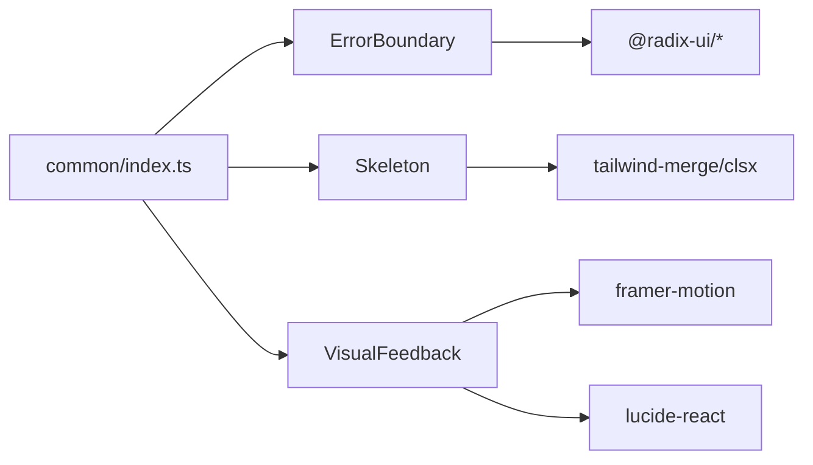

# 通用UI组件

<cite>
**本文引用的文件**
- [ErrorBoundary.tsx](file://m_flow-frontend/src/components/common/ErrorBoundary.tsx)
- [Skeleton.tsx](file://m_flow-frontend/src/components/common/Skeleton.tsx)
- [VisualFeedback.tsx](file://m_flow-frontend/src/components/common/VisualFeedback.tsx)
- [common/index.ts](file://m_flow-frontend/src/components/common/index.ts)
- [package.json](file://m_flow-frontend/package.json)
</cite>

## 目录
1. [简介](#简介)
2. [项目结构](#项目结构)
3. [核心组件](#核心组件)
4. [架构总览](#架构总览)
5. [详细组件分析](#详细组件分析)
6. [依赖分析](#依赖分析)
7. [性能考虑](#性能考虑)
8. [故障排查指南](#故障排查指南)
9. [结论](#结论)
10. [附录](#附录)

## 简介
本文件系统性梳理前端通用UI组件库，重点覆盖以下能力：
- 错误边界：错误捕获、降级显示与用户反馈
- 骨架屏：加载态模拟与动画效果
- 视觉反馈：成功/警告/错误状态的统一处理
- 主题定制与样式扩展：基于Tailwind变量与类名组合
- 无障碍支持与键盘导航：语义化标签与可访问性属性
- 性能优化与最佳实践：按需渲染、动画节流与资源复用

## 项目结构
通用UI组件位于 m_flow-frontend 的 common 目录中，采用“复合导出”策略，便于在各页面按需引入。

**图表来源**
- [common/index.ts:1-105](file://m_flow-frontend/src/components/common/index.ts#L1-L105)
- [package.json:16-42](file://m_flow-frontend/package.json#L16-L42)

**章节来源**
- [common/index.ts:1-105](file://m_flow-frontend/src/components/common/index.ts#L1-L105)
- [package.json:16-42](file://m_flow-frontend/package.json#L16-L42)

## 核心组件
- 错误边界（ErrorBoundary）：提供组件树级错误捕获、自定义降级UI、复制错误信息、开发模式详情展示与重试机制。
- 骨架屏（Skeleton）：提供文本、头像、按钮、卡片、网格、列表、表格、区域等多形态骨架屏，支持动画开关与无障碍属性。
- 视觉反馈（VisualFeedback）：提供文件类型图标映射、进度条动画、成功/错误/警告动画、拖拽区反馈、加载点与脉冲环等。

**章节来源**
- [ErrorBoundary.tsx:1-344](file://m_flow-frontend/src/components/common/ErrorBoundary.tsx#L1-L344)
- [Skeleton.tsx:1-503](file://m_flow-frontend/src/components/common/Skeleton.tsx#L1-L503)
- [VisualFeedback.tsx:1-536](file://m_flow-frontend/src/components/common/VisualFeedback.tsx#L1-L536)

## 架构总览
通用UI组件通过 barrel 导出统一入口，供业务页面按需引入；组件间解耦，依赖第三方 UI 原子能力（如 Radix UI）与动画库（Framer Motion），并通过 Tailwind 类名实现主题化与响应式布局。

**图表来源**
- [common/index.ts:1-105](file://m_flow-frontend/src/components/common/index.ts#L1-L105)
- [package.json:16-42](file://m_flow-frontend/package.json#L16-L42)

## 详细组件分析

### 错误边界（ErrorBoundary）
- 设计目标：在组件树内捕获JavaScript异常，避免整页崩溃，提供可恢复的降级界面与开发者调试信息。
- 关键特性：
  - 自定义降级UI（ErrorFallback）：包含标题、错误消息、操作按钮（重试/复制）、可选详情展开（堆栈信息）。
  - 内联错误（InlineError）：用于小面积错误提示，带重试回调。
  - 高阶包装（withErrorBoundary）：为任意组件自动包裹错误边界，自动注入组件名。
  - 生命周期钩子：getDerivedStateFromError 更新状态；componentDidCatch 记录日志并触发可选回调。
- 可访问性：使用 role="alert" 与 aria-* 属性提升屏幕阅读器体验。
- 开发者友好：默认仅在开发环境展示详细堆栈；生产环境隐藏细节，避免泄露敏感信息。

**图表来源**
- [ErrorBoundary.tsx:29-344](file://m_flow-frontend/src/components/common/ErrorBoundary.tsx#L29-L344)

**章节来源**
- [ErrorBoundary.tsx:1-344](file://m_flow-frontend/src/components/common/ErrorBoundary.tsx#L1-L344)

### 骨架屏（Skeleton）
- 设计目标：在数据加载期间提供占位元素，改善感知性能与页面稳定性。
- 复合组件（SkeletonCompound）：以对象形式聚合基础骨架与变体，便于链式调用（如 Skeleton.Text、Skeleton.Card）。
- 支持的骨架类型：
  - 基础：Skeleton（可配置宽高、圆角、动画）
  - 文本：SkeletonText（行数、行高、间距、末行宽度）
  - 头像：SkeletonAvatar（尺寸、形状）
  - 按钮：SkeletonButton（尺寸、宽度）
  - 卡片：SkeletonCard（头像、行数、操作按钮）
  - 状态卡片：SkeletonStatusCard（设置页常用）
  - 网格：SkeletonGrid（数量、列数、卡片变体）
  - 列表：SkeletonList（数量、头像）
  - 表格：SkeletonTable（行列、是否含表头）
  - 区域：SkeletonSection（设置页分段加载）
- 可访问性：所有骨架组件均设置 role="status" 与 aria-label，确保读屏器正确识别加载状态。

**图表来源**
- [Skeleton.tsx:28-503](file://m_flow-frontend/src/components/common/Skeleton.tsx#L28-L503)

**章节来源**
- [Skeleton.tsx:1-503](file://m_flow-frontend/src/components/common/Skeleton.tsx#L1-L503)

### 视觉反馈（VisualFeedback）
- 文件类型图标映射（FileTypeIcon）：根据扩展名匹配对应图标与颜色，统一文件类型视觉表达。
- 进度条动画（AnimatedProgress）：支持确定/不确定两种模式，带尺寸与状态变体，配合标签显示百分比或“处理中”文案。
- 成功/错误/警告动画（SuccessAnimation、ErrorAnimation、WarningBanner）：通过 Framer Motion 提供动效反馈，增强用户确认与问题提示。
- 拖拽区反馈（DropZone）：拖拽时边框发光、内容上移、状态高亮，支持键盘激活（Enter/Space），并可禁用交互以防止重复提交。
- 加载点与脉冲环（LoadingDots、PulseRing）：轻量动画，适合细粒度加载指示。

**图表来源**
- [VisualFeedback.tsx:356-459](file://m_flow-frontend/src/components/common/VisualFeedback.tsx#L356-L459)

**章节来源**
- [VisualFeedback.tsx:1-536](file://m_flow-frontend/src/components/common/VisualFeedback.tsx#L1-L536)

### 概念性总览
以下流程图展示“从错误到反馈”的典型用户旅程，体现错误边界与视觉反馈的协同作用。

[此图为概念性流程，不直接映射具体源码文件，故无图表来源]

## 依赖分析
- 第三方库依赖：
  - @radix-ui/*：提供语义化与可访问性基础组件（如对话框、下拉菜单、标签页等），在错误边界与视觉反馈中被广泛使用。
  - framer-motion：提供流畅动画与过渡，用于进度条、成功/错误/警告动画、拖拽反馈等。
  - lucide-react：提供一致的图标集，统一视觉语言。
  - tailwind-merge/class-variance-authority/clsx：用于安全合并类名，减少样式冲突。
- 组件间关系：
  - common/index.ts 作为统一出口，集中导出各组件类型与实现，降低页面导入复杂度。
  - 错误边界与骨架屏为通用基础设施，视觉反馈组件在业务场景中与之协作。

**图表来源**
- [common/index.ts:1-105](file://m_flow-frontend/src/components/common/index.ts#L1-L105)
- [package.json:16-42](file://m_flow-frontend/package.json#L16-L42)

**章节来源**
- [common/index.ts:1-105](file://m_flow-frontend/src/components/common/index.ts#L1-L105)
- [package.json:16-42](file://m_flow-frontend/package.json#L16-L42)

## 性能考虑
- 骨架屏优先：在数据获取阶段先渲染骨架屏，避免白屏与布局抖动，显著提升感知性能。
- 动画节流：进度条与反馈动画采用确定时长与缓动，避免频繁重绘；拖拽区动画仅在交互时启用。
- 资源复用：图标与动画通过共享库实现，减少重复打包体积。
- 懒加载与动态导入：对重型模块采用动态导入与骨架屏占位，缩短首屏时间。
- 可访问性与SEO：骨架屏与错误提示均设置 role 与 aria-* 属性，提升可访问性与搜索引擎友好度。

[本节为通用指导，无需章节来源]

## 故障排查指南
- 错误边界无法捕获错误
  - 检查是否在组件树根部包裹 ErrorBoundary 或使用 withErrorBoundary 高阶函数。
  - 确认错误边界 props 中的 onError 回调是否正确注册。
- 降级UI不显示
  - 确认子组件是否抛出异常；开发模式下可开启 showDetails 查看堆栈。
  - 检查自定义 fallback 是否返回有效 JSX。
- 骨架屏闪烁或布局错乱
  - 确保骨架屏与真实内容的尺寸一致（宽高、行距、圆角）。
  - 在切换真实内容时，使用统一的容器包裹，避免相邻元素抖动。
- 视觉反馈动画卡顿
  - 减少同时运行的动画数量；对不确定进度条使用更短的动画周期。
  - 使用 transform/opacity 等硬件加速友好的属性进行动画。
- 无障碍问题
  - 确保所有交互元素具备可访问名称与角色；骨架屏应设置 role="status" 与 aria-label。

**章节来源**
- [ErrorBoundary.tsx:254-307](file://m_flow-frontend/src/components/common/ErrorBoundary.tsx#L254-L307)
- [Skeleton.tsx:57-73](file://m_flow-frontend/src/components/common/Skeleton.tsx#L57-L73)
- [VisualFeedback.tsx:134-155](file://m_flow-frontend/src/components/common/VisualFeedback.tsx#L134-L155)

## 结论
本通用UI组件库围绕“稳定、可访问、高性能”三大目标构建：错误边界保障应用韧性，骨架屏提升感知性能，视觉反馈强化用户心智模型。通过 barrel 导出与第三方原子组件库的结合，既保证了组件的一致性，又提供了灵活的扩展空间。建议在业务页面中优先采用复合导出入口，按需引入组件，并遵循可访问性与性能最佳实践。

[本节为总结性内容，无需章节来源]

## 附录

### 主题定制与样式扩展
- 基于 Tailwind 变量：组件内部广泛使用 CSS 变量（如 --text-primary、--bg-elevated、--border-subtle），可在全局样式中调整主题色板。
- 类名组合：通过 cn 工具合并类名，支持传入额外 className 实现局部覆盖。
- 圆角与尺寸：骨架屏与按钮等组件提供 rounded 与 size 参数，便于快速适配设计系统。

**章节来源**
- [Skeleton.tsx:48-73](file://m_flow-frontend/src/components/common/Skeleton.tsx#L48-L73)
- [VisualFeedback.tsx:107-118](file://m_flow-frontend/src/components/common/VisualFeedback.tsx#L107-L118)

### 无障碍与键盘导航
- 语义化标签：骨架屏设置 role="status"，错误提示设置 role="alert"，拖拽区设置 role="button" 并支持键盘激活（Enter/Space）。
- 屏幕阅读器友好：错误详情与进度标签提供清晰文本描述，避免纯图标传达关键信息。
- 焦点管理：交互元素具备明确的焦点可见性，避免视觉焦点缺失。

**章节来源**
- [Skeleton.tsx:69-71](file://m_flow-frontend/src/components/common/Skeleton.tsx#L69-L71)
- [ErrorBoundary.tsx:104-105](file://m_flow-frontend/src/components/common/ErrorBoundary.tsx#L104-L105)
- [VisualFeedback.tsx:402-411](file://m_flow-frontend/src/components/common/VisualFeedback.tsx#L402-L411)