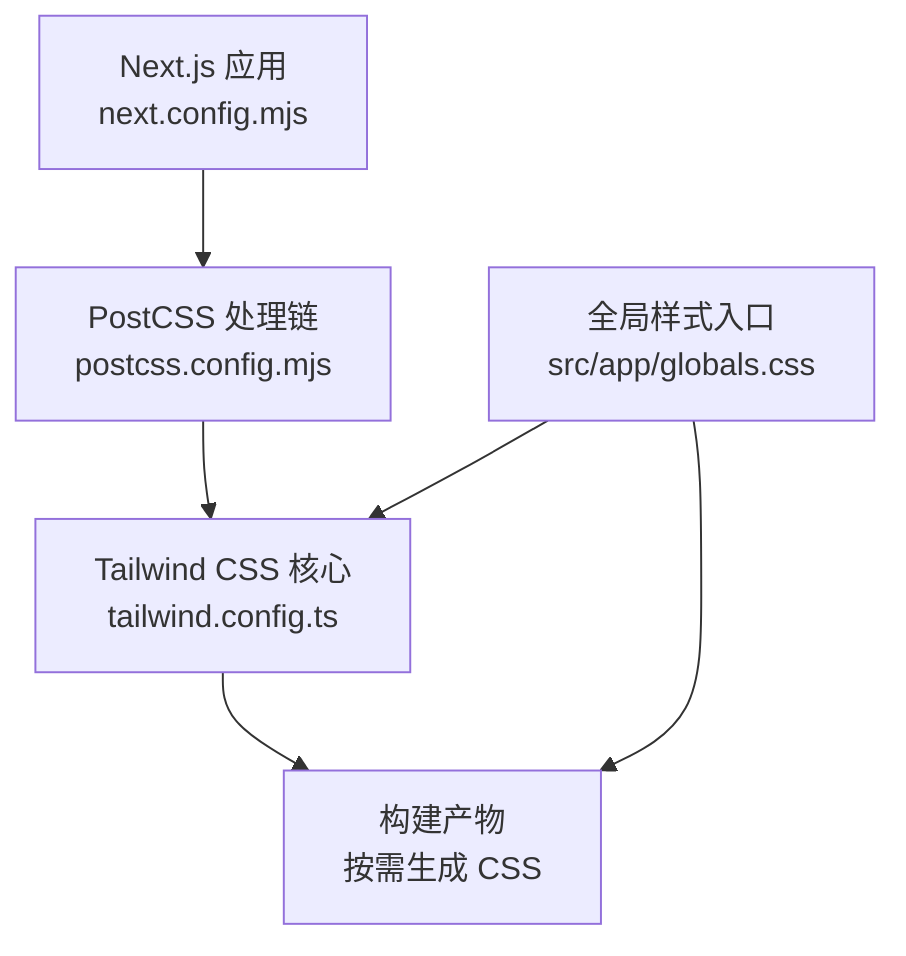
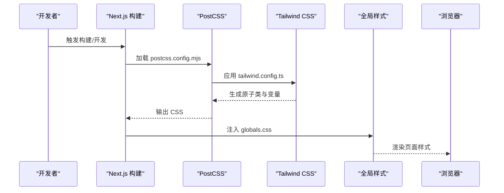
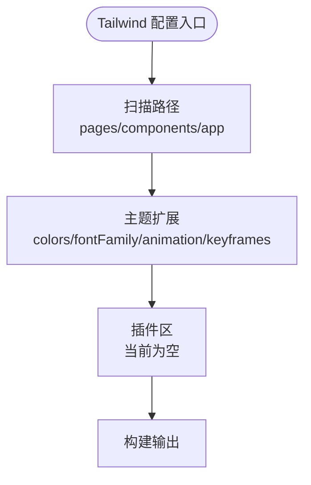
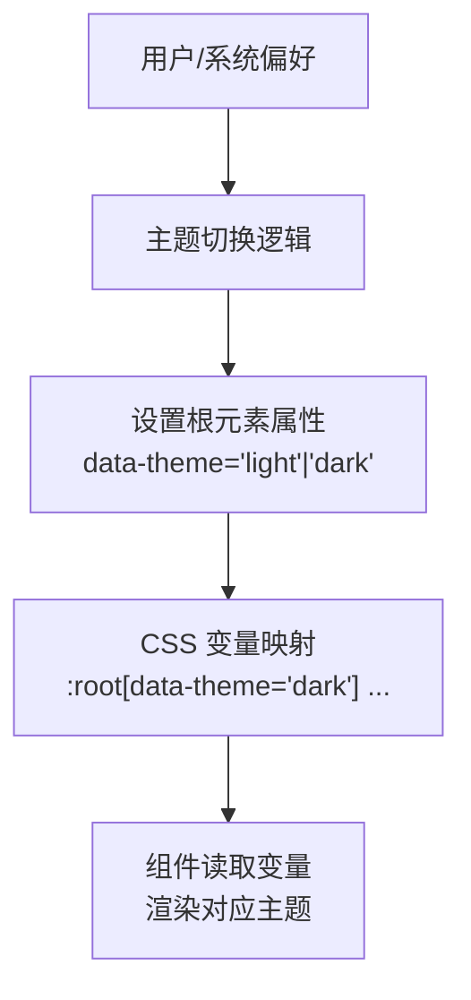
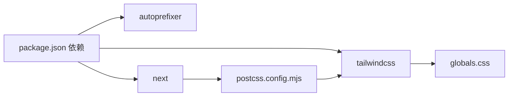

# 样式与主题

<cite>
**本文引用的文件**
- [tailwind.config.ts](file://m_flow-frontend/tailwind.config.ts)
- [postcss.config.mjs](file://m_flow-frontend/postcss.config.mjs)
- [next.config.mjs](file://m_flow-frontend/next.config.mjs)
- [package.json](file://m_flow-frontend/package.json)
- [globals.css](file://m_flow-frontend/src/app/globals.css)
</cite>

## 目录
1. [简介](#简介)
2. [项目结构](#项目结构)
3. [核心组件](#核心组件)
4. [架构总览](#架构总览)
5. [详细组件分析](#详细组件分析)
6. [依赖关系分析](#依赖关系分析)
7. [性能考虑](#性能考虑)
8. [故障排查指南](#故障排查指南)
9. [结论](#结论)
10. [附录](#附录)

## 简介
本文件系统化梳理前端样式与主题体系，围绕 Tailwind CSS 配置与使用、品牌色彩与字体体系、主题定制（含深色模式思路）、样式组织策略（全局/组件/条件样式）、CSS-in-JS 与内联样式最佳实践、响应式设计（移动端优先与渐进增强）、样式性能优化（作用域与提取）以及浏览器兼容与可访问性样式进行说明。内容基于仓库中实际存在的配置与样式文件进行归纳总结，并提供可视化图示帮助理解。

## 项目结构
前端位于 m_flow-frontend 目录，采用 Next.js 14 应用，样式体系以 Tailwind CSS 为核心，配合 PostCSS 自动前缀与 Next 构建流程。全局样式通过 globals.css 引入并统一注入基础、组件与工具类；Tailwind 配置集中于 tailwind.config.ts，PostCSS 配置位于 postcss.config.mjs。



图表来源
- [next.config.mjs:1-29](file://m_flow-frontend/next.config.mjs#L1-L29)
- [postcss.config.mjs:1-10](file://m_flow-frontend/postcss.config.mjs#L1-L10)
- [tailwind.config.ts:1-127](file://m_flow-frontend/tailwind.config.ts#L1-L127)
- [globals.css:1-296](file://m_flow-frontend/src/app/globals.css#L1-L296)

章节来源
- [next.config.mjs:1-29](file://m_flow-frontend/next.config.mjs#L1-L29)
- [postcss.config.mjs:1-10](file://m_flow-frontend/postcss.config.mjs#L1-L10)
- [tailwind.config.ts:1-127](file://m_flow-frontend/tailwind.config.ts#L1-L127)
- [globals.css:1-296](file://m_flow-frontend/src/app/globals.css#L1-L296)

## 核心组件
- Tailwind 配置：定义内容扫描路径、扩展颜色系统（品牌灰阶与降饱和覆盖）、字体族、动画与关键帧。
- PostCSS 配置：启用 tailwindcss 与 autoprefixer 插件，确保 CSS 兼容性与自动前缀。
- 全局样式：通过 CSS 变量定义背景、边框、文本、语义色与间距等设计令牌；提供按钮、输入、卡片等基础组件样式与动画。
- Next.js 集成：在开发与构建阶段自动代理 /api 请求至后端，保证样式与路由一致的开发体验。

章节来源
- [tailwind.config.ts:1-127](file://m_flow-frontend/tailwind.config.ts#L1-L127)
- [postcss.config.mjs:1-10](file://m_flow-frontend/postcss.config.mjs#L1-L10)
- [globals.css:1-296](file://m_flow-frontend/src/app/globals.css#L1-L296)
- [next.config.mjs:16-25](file://m_flow-frontend/next.config.mjs#L16-L25)

## 架构总览
下图展示从源码到最终渲染的关键路径：Next.js 调用 PostCSS → Tailwind 解析与生成 → 注入全局样式 → 组件消费原子类与变量。



图表来源
- [next.config.mjs:16-25](file://m_flow-frontend/next.config.mjs#L16-L25)
- [postcss.config.mjs:1-10](file://m_flow-frontend/postcss.config.mjs#L1-L10)
- [tailwind.config.ts:1-127](file://m_flow-frontend/tailwind.config.ts#L1-L127)
- [globals.css:1-296](file://m_flow-frontend/src/app/globals.css#L1-L296)

## 详细组件分析

### Tailwind 配置与品牌色彩系统
- 内容扫描范围：pages、components、app 目录，确保按需生成所需样式。
- 品牌灰阶与语义色：定义 x.ai 风格高对比度灰阶（xai-black 至 xai-white），并提供强调色、成功、警告、错误等语义色。
- 降饱和覆盖：对常用颜色（blue、amber、emerald、green、purple、red、cyan、rose、yellow、orange）进行“奢华灰”风格降饱和处理，保持品牌一致性。
- 字体系统：sans 与 mono 字体族，优先本地字体并回退系统字体。
- 动画与关键帧：提供淡入、上滑、慢速脉冲等动画，便于组件过渡与加载反馈。



图表来源
- [tailwind.config.ts:3-127](file://m_flow-frontend/tailwind.config.ts#L3-L127)

章节来源
- [tailwind.config.ts:3-127](file://m_flow-frontend/tailwind.config.ts#L3-L127)

### 全局样式与设计令牌
- CSS 变量：在 :root 定义背景、边框、文本、强调色与语义色、间距、圆角、过渡时长等设计令牌，形成统一的主题基线。
- 基础排版：为显示、标题、正文、小字、微注等提供类名，确保文字层级清晰。
- 动画：定义淡入、上滑、进度条、脉冲等关键帧，并提供对应动画类。
- 组件样式：按钮（主/次/幽灵）、输入框、卡片、分隔线等基础组件样式，统一交互与视觉。
- 工具类：行数省略等实用类，提升布局灵活性。
- 通知覆盖：针对 toast 组件覆写背景、边框与字体，确保与整体风格一致。

```mermaid
classDiagram
class 设计令牌 {
"+背景 : --bg-base/surface/elevated/hover"
"+边框 : --border-subtle/default"
"+文本 : --text-primary/secondary/tertiary/muted"
"+强调/语义 : --accent/accent-dim/accent-subtle<br/>--success/error/warning"
"+间距 : --space-xs/sm/md/lg/xl/2xl/3xl"
"+圆角 : --radius-sm/md/lg"
"+过渡 : --duration"
}
class 排版类 {
".text-display/.text-title/.text-heading/.text-body/.text-small/.text-tiny"
}
class 动画类 {
".animate-in/.animate-progress-indeterminate/.animate-progress-subtle/.animate-pulse-subtle"
}
class 组件样式 {
".btn/.btn-primary/.btn-secondary/.btn-ghost"
".input-field"
".card/.card-hover"
".divider"
}
设计令牌 --> 排版类 : "提供变量"
设计令牌 --> 组件样式 : "提供变量"
动画类 --> 组件样式 : "组合使用"
```

图表来源
- [globals.css:12-55](file://m_flow-frontend/src/app/globals.css#L12-L55)
- [globals.css:96-133](file://m_flow-frontend/src/app/globals.css#L96-L133)
- [globals.css:139-179](file://m_flow-frontend/src/app/globals.css#L139-L179)
- [globals.css:186-260](file://m_flow-frontend/src/app/globals.css#L186-L260)

章节来源
- [globals.css:12-55](file://m_flow-frontend/src/app/globals.css#L12-L55)
- [globals.css:96-133](file://m_flow-frontend/src/app/globals.css#L96-L133)
- [globals.css:139-179](file://m_flow-frontend/src/app/globals.css#L139-L179)
- [globals.css:186-260](file://m_flow-frontend/src/app/globals.css#L186-L260)
- [globals.css:289-296](file://m_flow-frontend/src/app/globals.css#L289-L296)

### 主题定制与深色模式
- 当前状态：Tailwind 配置与全局样式未显式声明深色模式开关或媒体查询。
- 实现建议（概念性说明）：
  - 在 HTML 上通过 data-theme 或 class 切换明/暗模式。
  - 使用 CSS 变量在不同模式下重映射颜色值。
  - 在 Tailwind 中通过 dark: 前缀或自定义策略为特定组件提供暗色变体。
  - 结合系统偏好与用户设置，动态更新根元素属性。



（该图为概念性示意，不直接对应具体文件）

### 响应式设计与断点
- 断点策略：Tailwind 默认断点适用于移动端优先；可在组件中使用 sm:/md:/lg:/xl:/2xl: 前缀控制不同尺寸下的布局与排版。
- 渐进增强：先保证小屏可用，再逐步在大屏上增强细节与密度；结合全局排版类与原子类实现层次递进。

章节来源
- [tailwind.config.ts:4-8](file://m_flow-frontend/tailwind.config.ts#L4-L8)

### 样式组织策略
- 全局样式：集中于 globals.css，负责设计令牌、基础排版、动画与通用组件样式。
- 组件样式：通过原子类与组件类组合，避免重复定义；必要时在组件内部使用 className 组合。
- 条件样式：利用 Tailwind 前缀（hover/focus/active/disabled/响应式）与 CSS 变量实现状态与尺寸变化。

章节来源
- [globals.css:1-296](file://m_flow-frontend/src/app/globals.css#L1-L296)
- [tailwind.config.ts:9-127](file://m_flow-frontend/tailwind.config.ts#L9-L127)

### CSS-in-JS 与内联样式最佳实践
- 依赖现状：项目未引入 Styled Components；主要依赖为原子类与 CSS 变量。
- 最佳实践（概念性说明）：
  - 优先使用 Tailwind 原子类与 CSS 变量，减少运行时开销。
  - 对极少数需要动态样式的场景，谨慎使用内联样式或轻量 CSS-in-JS，避免与全局样式冲突。
  - 通过 clsx/tw-merge 合并与去重类名，降低冲突风险。

章节来源
- [package.json:30-42](file://m_flow-frontend/package.json#L30-L42)

### 浏览器兼容性与可访问性
- 兼容性：PostCSS 自动前缀确保主流浏览器支持；Tailwind 默认输出现代 CSS。
- 可访问性：使用语义化标签、足够的对比度（品牌灰阶已强调高对比）、键盘导航友好（按钮与表单控件具备焦点态）；为交互元素提供明确的 hover/focus 状态。

章节来源
- [postcss.config.mjs:1-10](file://m_flow-frontend/postcss.config.mjs#L1-L10)
- [globals.css:198-245](file://m_flow-frontend/src/app/globals.css#L198-L245)

## 依赖关系分析
- 构建链路：Next.js -> PostCSS -> Tailwind -> 全局样式 -> 浏览器渲染。
- 关键依赖：tailwindcss、autoprefixer、next。
- 开发代理：/api/* 请求被重写到后端地址，保障样式与接口一致的开发体验。



图表来源
- [package.json:16-63](file://m_flow-frontend/package.json#L16-L63)
- [postcss.config.mjs:1-10](file://m_flow-frontend/postcss.config.mjs#L1-L10)
- [globals.css:1-5](file://m_flow-frontend/src/app/globals.css#L1-L5)

章节来源
- [package.json:16-63](file://m_flow-frontend/package.json#L16-L63)
- [postcss.config.mjs:1-10](file://m_flow-frontend/postcss.config.mjs#L1-L10)
- [next.config.mjs:16-25](file://m_flow-frontend/next.config.mjs#L16-L25)

## 性能考虑
- 按需生成：Tailwind content 扫描限制在 pages/components/app，避免生成冗余样式。
- 作用域与变量：CSS 变量集中管理，减少重复定义与构建体积。
- 提取与压缩：由 Next.js 与 PostCSS 负责，无需额外手动提取。
- 动画与过渡：使用轻量关键帧与短时长过渡，降低渲染压力。

章节来源
- [tailwind.config.ts:4-8](file://m_flow-frontend/tailwind.config.ts#L4-L8)
- [globals.css:12-55](file://m_flow-frontend/src/app/globals.css#L12-L55)
- [globals.css:139-179](file://m_flow-frontend/src/app/globals.css#L139-L179)

## 故障排查指南
- 样式未生效
  - 检查 tailwind.config.ts 的 content 路径是否包含目标组件/页面。
  - 确认 globals.css 是否正确引入 @tailwind 指令。
- 动画异常
  - 核对动画类与关键帧名称是否一致。
  - 检查浏览器是否支持关键帧语法。
- 深色模式无效
  - 若计划引入深色模式，需在根元素设置主题属性并在 CSS 中映射变量。
- 开发代理失败
  - 确认环境变量 MFLOW_BACKEND_URL 指向正确的后端地址。

章节来源
- [tailwind.config.ts:4-8](file://m_flow-frontend/tailwind.config.ts#L4-L8)
- [globals.css:3-5](file://m_flow-frontend/src/app/globals.css#L3-L5)
- [next.config.mjs:8](file://m_flow-frontend/next.config.mjs#L8)
- [next.config.mjs:16-25](file://m_flow-frontend/next.config.mjs#L16-L25)

## 结论
本项目以 Tailwind CSS 为核心，结合 PostCSS 自动前缀与 Next.js 构建链路，形成了简洁、高可维护性的样式体系。通过 CSS 变量统一设计令牌、提供基础组件与动画类，满足品牌风格与可用性需求。后续如需深色模式、更细粒度的主题变体或 CSS-in-JS，可在现有基础上增量扩展，同时保持与原子类与变量体系的一致性。

## 附录
- 命令参考
  - 开发：pnpm dev
  - 构建：pnpm build
  - 启动：pnpm start
  - 测试：pnpm test / pnpm test:run / pnpm test:coverage
  - E2E：pnpm test:e2e / pnpm test:e2e:ui
- 重要文件清单
  - Tailwind 配置：m_flow-frontend/tailwind.config.ts
  - PostCSS 配置：m_flow-frontend/postcss.config.mjs
  - 全局样式：m_flow-frontend/src/app/globals.css
  - Next.js 配置：m_flow-frontend/next.config.mjs
  - 依赖清单：m_flow-frontend/package.json