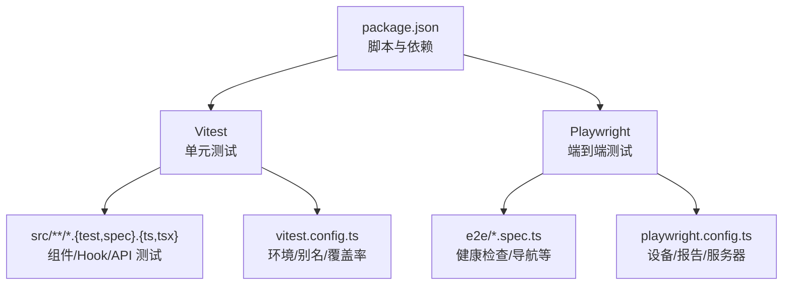
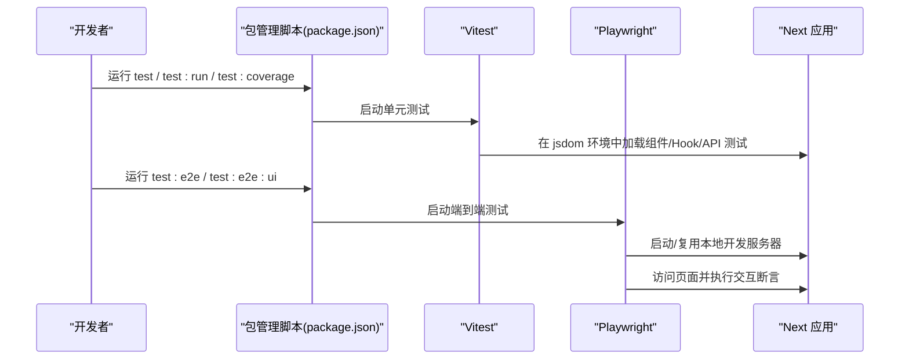
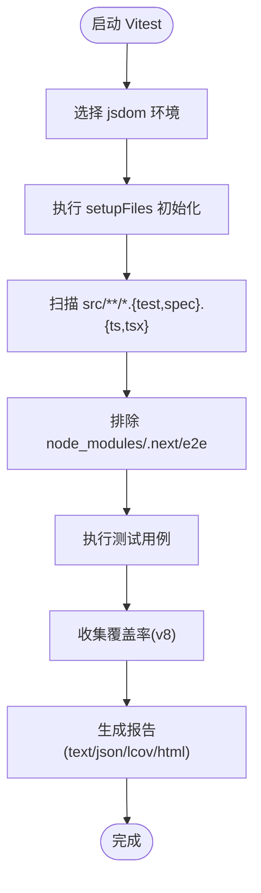
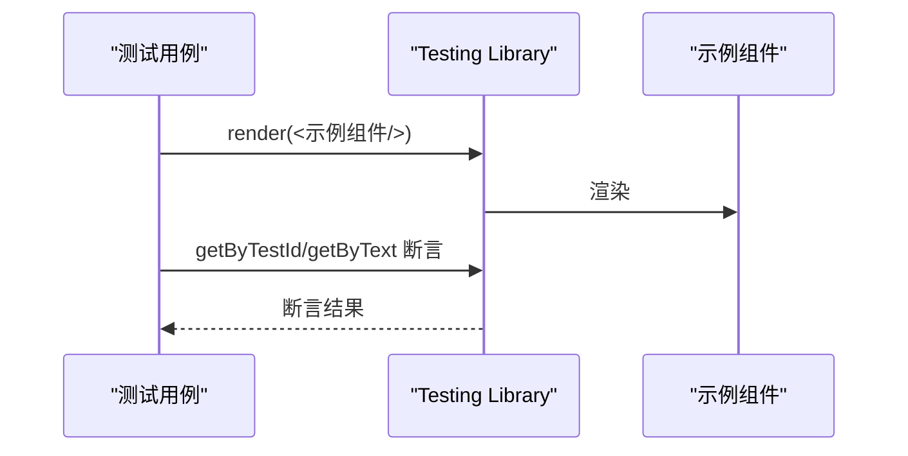
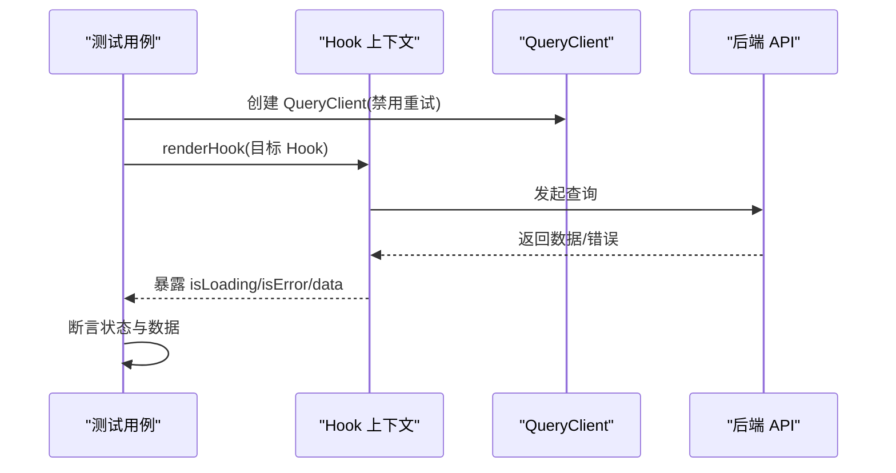
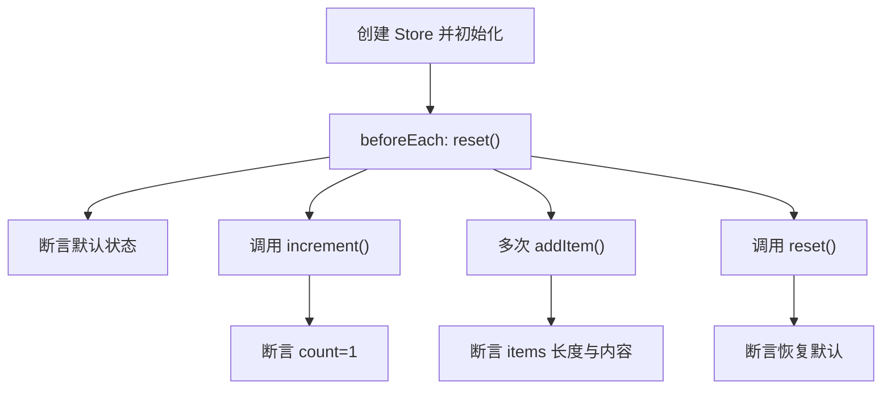
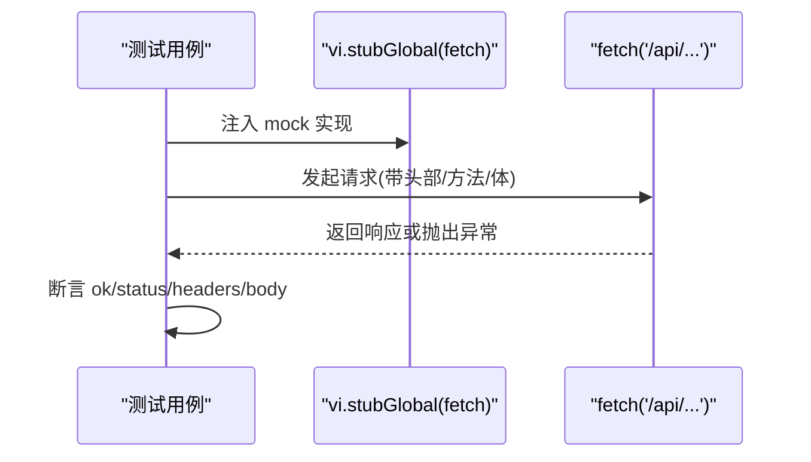
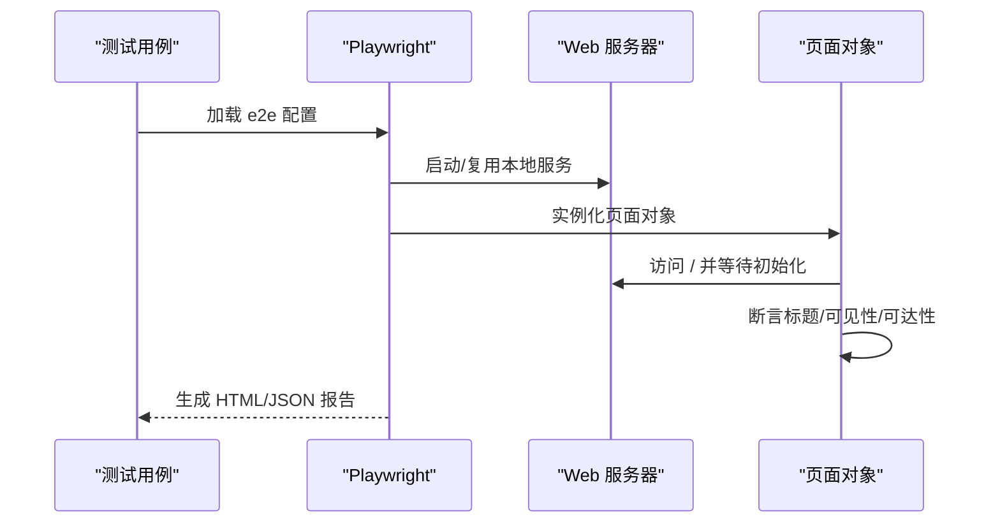
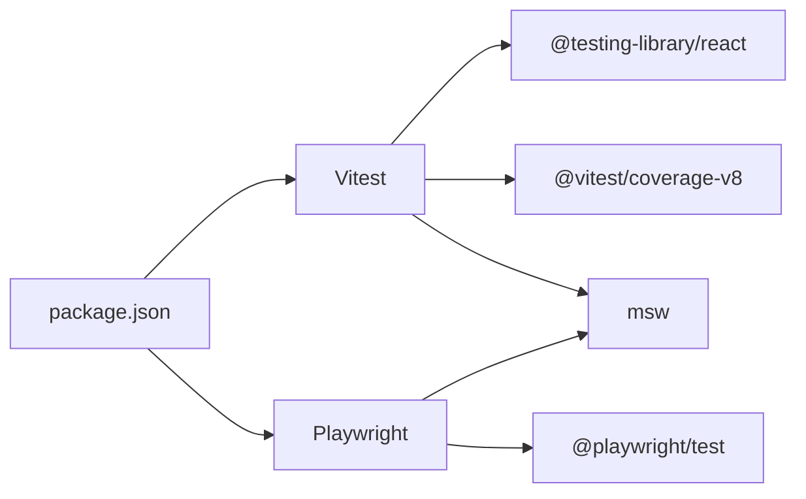

# 测试与调试

<cite>
**本文引用的文件**
- [package.json](file://m_flow-frontend/package.json)
- [vitest.config.ts](file://m_flow-frontend/vitest.config.ts)
- [playwright.config.ts](file://m_flow-frontend/playwright.config.ts)
- [e2e/health.spec.ts](file://m_flow-frontend/e2e/health.spec.ts)
- [src/test/example.test.tsx](file://m_flow-frontend/src/test/example.test.tsx)
- [src/hooks/__tests__/use-api.test.ts](file://m_flow-frontend/src/hooks/__tests__/use-api.test.ts)
- [src/lib/__tests__/client.test.ts](file://m_flow-frontend/src/lib/__tests__/client.test.ts)
- [src/lib/__tests__/store.test.ts](file://m_flow-frontend/src/lib/__tests__/store.test.ts)
</cite>

## 目录
1. [简介](#简介)
2. [项目结构](#项目结构)
3. [核心组件](#核心组件)
4. [架构总览](#架构总览)
5. [详细组件分析](#详细组件分析)
6. [依赖分析](#依赖分析)
7. [性能考虑](#性能考虑)
8. [故障排查指南](#故障排查指南)
9. [结论](#结论)
10. [附录](#附录)

## 简介
本指南面向前端团队与测试工程师，系统讲解 m_flow 前端在 Vitest 与 Playwright 下的测试与调试实践，涵盖单元测试（组件、Hook、API）、端到端测试、Mock 服务（MSW）接入、调试工具使用、覆盖率收集与报告、最佳实践以及性能与可访问性测试建议。文档以仓库中现有配置与测试用例为依据，提供可直接落地的操作步骤与可视化图示。

## 项目结构
前端测试相关的关键位置如下：
- 单元测试：位于 src/**/*.{test,spec}.{ts,tsx}，由 Vitest 驱动
- 端到端测试：位于 e2e/*.spec.ts，由 Playwright 驱动
- 测试运行脚本：package.json 中定义了 test、test:run、test:coverage、test:e2e、test:e2e:ui 等命令
- 测试配置：vitest.config.ts（Vitest）、playwright.config.ts（Playwright）

图表来源
- [package.json:1-65](file://m_flow-frontend/package.json#L1-L65)
- [vitest.config.ts:1-33](file://m_flow-frontend/vitest.config.ts#L1-L33)
- [playwright.config.ts:1-47](file://m_flow-frontend/playwright.config.ts#L1-L47)

章节来源
- [package.json:1-65](file://m_flow-frontend/package.json#L1-L65)
- [vitest.config.ts:1-33](file://m_flow-frontend/vitest.config.ts#L1-L33)
- [playwright.config.ts:1-47](file://m_flow-frontend/playwright.config.ts#L1-L47)

## 核心组件
- Vitest 单元测试
  - 环境：jsdom
  - 全局钩子：setupFiles 指向 src/test/setup.ts
  - 覆盖率：v8 提供者，输出文本、JSON、LCOV、HTML
  - 别名：@ -> src
- Playwright 端到端测试
  - 多设备：Chromium/Firefox/Safari，移动端模拟
  - 报告：HTML 与 JSON
  - Web 服务器：本地 Next 开发服务器
- 示例测试
  - 组件渲染与可达性断言
  - Hook 查询状态与变更
  - Zustand 状态管理
  - Fetch API 客户端错误与请求构建

章节来源
- [vitest.config.ts:1-33](file://m_flow-frontend/vitest.config.ts#L1-L33)
- [playwright.config.ts:1-47](file://m_flow-frontend/playwright.config.ts#L1-L47)
- [src/test/example.test.tsx:1-15](file://m_flow-frontend/src/test/example.test.tsx#L1-L15)
- [src/hooks/__tests__/use-api.test.ts:1-84](file://m_flow-frontend/src/hooks/__tests__/use-api.test.ts#L1-L84)
- [src/lib/__tests__/store.test.ts:1-70](file://m_flow-frontend/src/lib/__tests__/store.test.ts#L1-L70)
- [src/lib/__tests__/client.test.ts:1-95](file://m_flow-frontend/src/lib/__tests__/client.test.ts#L1-L95)

## 架构总览
下图展示了从命令行到测试执行器、再到被测应用的整体流程。

图表来源
- [package.json:5-14](file://m_flow-frontend/package.json#L5-L14)
- [vitest.config.ts:7-12](file://m_flow-frontend/vitest.config.ts#L7-L12)
- [playwright.config.ts:40-45](file://m_flow-frontend/playwright.config.ts#L40-L45)

## 详细组件分析

### Vitest 单元测试配置与使用
- 环境与全局设置
  - 使用 jsdom 作为 DOM 环境
  - 通过 setupFiles 引入统一初始化逻辑
- 包含/排除规则
  - 匹配 src/**/*.{test,spec}.{js,mjs,cjs,ts,mts,cts,jsx,tsx}
  - 排除 node_modules、.next、e2e
- 覆盖率
  - v8 提供者，输出格式：text、json、lcov、html
  - 输出目录：coverage
  - 排除类型声明、配置文件、测试目录与类型目录
- 别名
  - @ -> src，便于模块导入

图表来源
- [vitest.config.ts:7-26](file://m_flow-frontend/vitest.config.ts#L7-L26)

章节来源
- [vitest.config.ts:1-33](file://m_flow-frontend/vitest.config.ts#L1-L33)

### 组件测试：示例与可达性断言
- 示例组件渲染正确性
- 使用 Testing Library 断言元素存在与文本内容
- 适合验证 UI 渲染、属性传递与事件绑定

图表来源
- [src/test/example.test.tsx:8-14](file://m_flow-frontend/src/test/example.test.tsx#L8-L14)

章节来源
- [src/test/example.test.tsx:1-15](file://m_flow-frontend/src/test/example.test.tsx#L1-L15)

### Hook 测试：查询与变更状态
- 使用 @testing-library/react 的 renderHook
- 使用 QueryClientProvider 包裹，禁用重试确保可预测性
- 覆盖加载、错误、成功三种查询状态
- 覆盖变更（mutation）的成功与失败回调

图表来源
- [src/hooks/__tests__/use-api.test.ts:6-17](file://m_flow-frontend/src/hooks/__tests__/use-api.test.ts#L6-L17)
- [src/hooks/__tests__/use-api.test.ts:19-54](file://m_flow-frontend/src/hooks/__tests__/use-api.test.ts#L19-L54)
- [src/hooks/__tests__/use-api.test.ts:56-82](file://m_flow-frontend/src/hooks/__tests__/use-api.test.ts#L56-L82)

章节来源
- [src/hooks/__tests__/use-api.test.ts:1-84](file://m_flow-frontend/src/hooks/__tests__/use-api.test.ts#L1-L84)

### Zustand 状态管理测试
- 使用 create 创建测试用 Store
- 初始化后重置，保证用例隔离
- 断言初始值、更新、持久化与重置行为

图表来源
- [src/lib/__tests__/store.test.ts:20-57](file://m_flow-frontend/src/lib/__tests__/store.test.ts#L20-L57)
- [src/lib/__tests__/store.test.ts:59-68](file://m_flow-frontend/src/lib/__tests__/store.test.ts#L59-L68)

章节来源
- [src/lib/__tests__/store.test.ts:1-70](file://m_flow-frontend/src/lib/__tests__/store.test.ts#L1-L70)

### API 客户端测试：Fetch 与错误处理
- 使用 vi.stubGlobal 替换全局 fetch
- 断言 401、404、网络错误等场景
- 断言请求头（Authorization）、Content-Type 与请求体

图表来源
- [src/lib/__tests__/client.test.ts:3-10](file://m_flow-frontend/src/lib/__tests__/client.test.ts#L3-L10)
- [src/lib/__tests__/client.test.ts:12-45](file://m_flow-frontend/src/lib/__tests__/client.test.ts#L12-L45)
- [src/lib/__tests__/client.test.ts:47-93](file://m_flow-frontend/src/lib/__tests__/client.test.ts#L47-L93)

章节来源
- [src/lib/__tests__/client.test.ts:1-95](file://m_flow-frontend/src/lib/__tests__/client.test.ts#L1-L95)

### Playwright 端到端测试：环境与页面对象模式
- 测试目录：e2e
- 设备矩阵：桌面与移动端（Chromium/Firefox/Safari + Pixel 5/iPhone 12）
- 报告：HTML 与 JSON
- Web 服务器：本地开发服务器，自动复用
- 页面对象模式建议
  - 将页面交互封装为对象（如 HomePage、Navigation），暴露方法（如 goto、waitForInit、checkAccessibility）
  - 在测试中组合页面对象方法，提升可维护性
- 测试数据准备
  - 使用测试前钩子注入最小化可用数据或通过 API 初始化
  - 对于需要登录的场景，先登录再进入受保护页面

图表来源
- [playwright.config.ts:3-17](file://m_flow-frontend/playwright.config.ts#L3-L17)
- [playwright.config.ts:18-39](file://m_flow-frontend/playwright.config.ts#L18-L39)
- [playwright.config.ts:40-45](file://m_flow-frontend/playwright.config.ts#L40-L45)
- [e2e/health.spec.ts:3-18](file://m_flow-frontend/e2e/health.spec.ts#L3-L18)

章节来源
- [playwright.config.ts:1-47](file://m_flow-frontend/playwright.config.ts#L1-L47)
- [e2e/health.spec.ts:1-20](file://m_flow-frontend/e2e/health.spec.ts#L1-L20)

### Mock 服务（MSW）使用指南
- 依赖：已安装 MSW
- 建议实践
  - 在 src/test 目录下创建 mocks 目录，集中管理 handlers
  - 在 setupFiles 中初始化 worker（用于 Vitest 环境）或在 e2e 测试入口初始化（用于 Playwright）
  - 为关键路由（如 /api/v1/datasets、/api/v1/health）编写 handler，返回稳定的数据与状态码
  - 在 CI 中固定随机性，确保跨环境一致性
- 注意事项
  - 确保 worker 在测试前后正确 start/stop
  - 避免与真实后端冲突，必要时通过环境变量切换

章节来源
- [package.json:58](file://m_flow-frontend/package.json#L58)

### 调试工具使用
- 浏览器开发者工具
  - Network：查看请求/响应、状态码、Headers、Body；结合 MSW 观察拦截效果
  - Elements：检查 DOM 结构与可访问性属性
  - Console：定位错误堆栈与日志
- React DevTools
  - 分析组件树、Props、State 与 Hooks 状态
  - 结合 Testing Library 的 data-testid 快速定位节点
- 网络监控
  - 在 Vitest 中使用 MSW 拦截 fetch 请求，验证请求参数与响应
  - 在 Playwright 中通过 trace 与视频回放定位交互问题

章节来源
- [src/lib/__tests__/client.test.ts:12-45](file://m_flow-frontend/src/lib/__tests__/client.test.ts#L12-L45)
- [playwright.config.ts:13-17](file://m_flow-frontend/playwright.config.ts#L13-L17)

### 测试覆盖率收集与报告
- Vitest 覆盖率配置
  - 提供者：v8
  - 报告格式：text、json、lcov、html
  - 输出目录：coverage
  - 排除：node_modules、src/test、*.d.ts、*.config.*、src/types/*
- 生成方式
  - 命令：pnpm test:coverage
- 报告解读
  - lcov：集成到 CI 的覆盖率仪表板
  - html：本地查看未覆盖路径，指导补测

章节来源
- [vitest.config.ts:13-25](file://m_flow-frontend/vitest.config.ts#L13-L25)
- [package.json:12](file://m_flow-frontend/package.json#L12)

### 测试最佳实践
- 命名约定
  - 文件：use-xxx.test.ts、client.test.ts、store.test.ts
  - 描述：describe('模块名称') + it('应满足的条件')
- 断言策略
  - 明确单一断言点，避免“胖断言”
  - 使用语义化选择器（data-testid）与可访问性断言
- 异步测试
  - 使用 waitFor 或显式 await，确保 DOM/状态稳定
  - 对于 React Query，使用 QueryClientProvider 并禁用重试
- 可观测性
  - 在 Vitest 中打印关键上下文
  - 在 Playwright 中启用 trace 与截图（仅失败时）

章节来源
- [src/hooks/__tests__/use-api.test.ts:6-17](file://m_flow-frontend/src/hooks/__tests__/use-api.test.ts#L6-L17)
- [playwright.config.ts:15-16](file://m_flow-frontend/playwright.config.ts#L15-L16)

### 性能测试与可访问性测试
- 性能测试
  - Vitest：使用计时断言（如 performance.now）测量关键操作耗时
  - Playwright：利用性能面板与网络瀑布图定位瓶颈
- 可访问性测试
  - 使用 @axe-core/playwright 或 axe-core 在 Playwright 中进行无障碍扫描
  - 在 e2e 测试中加入 accessibility 检查步骤，如断言页面主体可见、标题存在等

章节来源
- [e2e/health.spec.ts:15-18](file://m_flow-frontend/e2e/health.spec.ts#L15-L18)

## 依赖分析
- Vitest 与 Playwright 的关系
  - 两者独立运行，分别服务于单元与端到端场景
  - 通过 package.json 脚本统一入口
- 关键依赖
  - @testing-library/react：组件与 Hook 测试
  - @vitest/coverage-v8：覆盖率
  - @playwright/test：端到端测试
  - msw：API Mock

图表来源
- [package.json:44-62](file://m_flow-frontend/package.json#L44-L62)
- [vitest.config.ts:1-3](file://m_flow-frontend/vitest.config.ts#L1-L3)
- [playwright.config.ts:1](file://m_flow-frontend/playwright.config.ts#L1)

章节来源
- [package.json:1-65](file://m_flow-frontend/package.json#L1-L65)
- [vitest.config.ts:1-33](file://m_flow-frontend/vitest.config.ts#L1-L33)
- [playwright.config.ts:1-47](file://m_flow-frontend/playwright.config.ts#L1-L47)

## 性能考虑
- 测试并发与重试
  - CI 中限制 workers 数量，减少资源竞争
  - 适当重试（CI 下 retries: 2）平衡稳定性与速度
- 覆盖率范围
  - 排除测试与类型文件，聚焦业务代码覆盖率
- 端到端测试
  - 使用 trace 与截图仅在失败时生成，降低存储压力

章节来源
- [playwright.config.ts:6-8](file://m_flow-frontend/playwright.config.ts#L6-L8)
- [playwright.config.ts:10-11](file://m_flow-frontend/playwright.config.ts#L10-L11)
- [vitest.config.ts:17-24](file://m_flow-frontend/vitest.config.ts#L17-L24)

## 故障排查指南
- Vitest
  - 环境问题：确认 jsdom 已正确安装与配置
  - 别名无效：检查 vitest.config.ts 中 @ -> src 的 alias
  - 覆盖率缺失：确认 include/exclude 规则与源码扩展名匹配
- Playwright
  - 服务器未启动：检查 webServer.command 与端口占用
  - 截图/trace 为空：确认 retries 与 workers 设置
  - 设备不兼容：调整 devices 列表或禁用特定项目
- API Mock
  - MSW 未生效：检查 worker 初始化顺序与生命周期
  - 请求未命中：核对路径匹配与方法一致

章节来源
- [vitest.config.ts:8-12](file://m_flow-frontend/vitest.config.ts#L8-L12)
- [vitest.config.ts:28-31](file://m_flow-frontend/vitest.config.ts#L28-L31)
- [playwright.config.ts:40-45](file://m_flow-frontend/playwright.config.ts#L40-L45)
- [playwright.config.ts:15-16](file://m_flow-frontend/playwright.config.ts#L15-L16)

## 结论
本指南基于仓库现有配置与测试用例，给出了 Vitest 与 Playwright 的完整落地方案，并补充了 MSW、调试工具、覆盖率与最佳实践建议。建议在现有基础上逐步完善页面对象模式、可访问性检查与性能指标，持续提升测试质量与效率。

## 附录
- 常用命令
  - pnpm test：运行 Vitest（带 jsdom）
  - pnpm test:run：运行并生成报告
  - pnpm test:coverage：生成覆盖率报告
  - pnpm test:e2e：运行端到端测试
  - pnpm test:e2e:ui：以 UI 模式运行端到端测试

章节来源
- [package.json:5-14](file://m_flow-frontend/package.json#L5-L14)