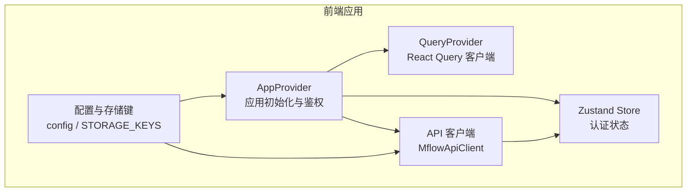
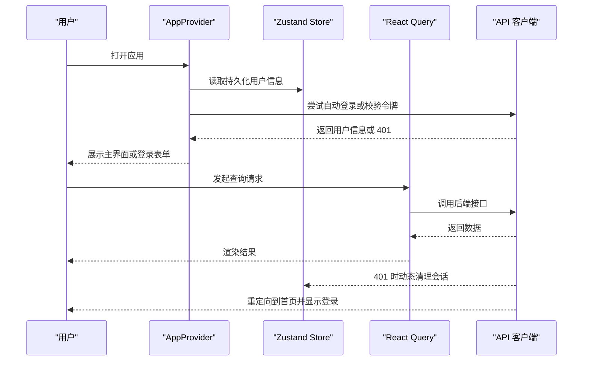
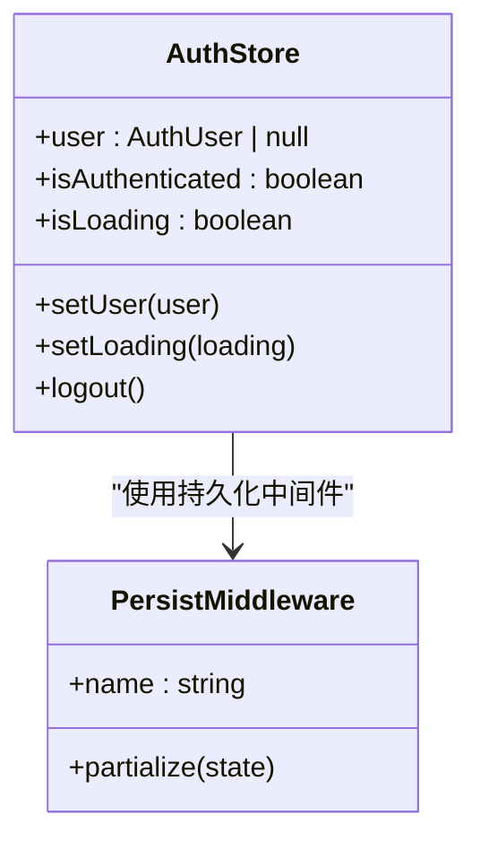
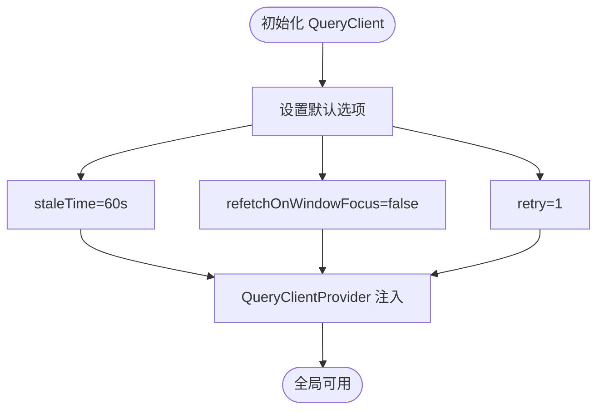
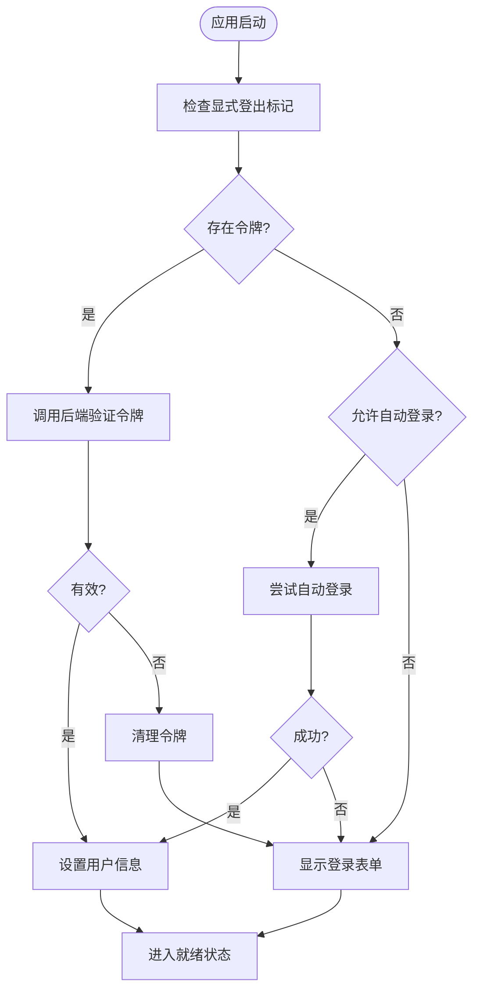
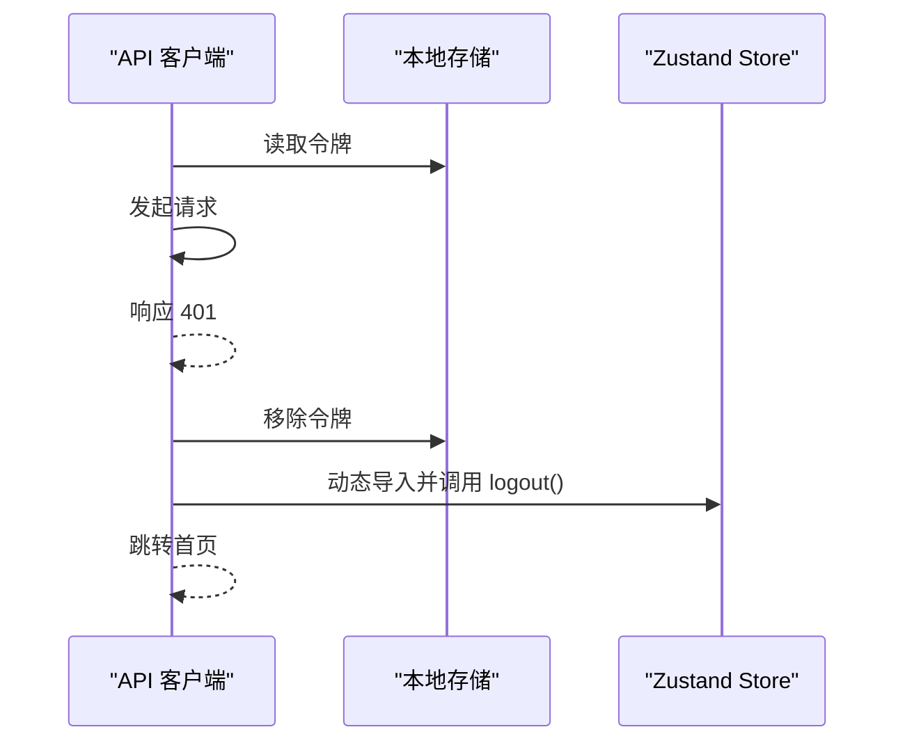
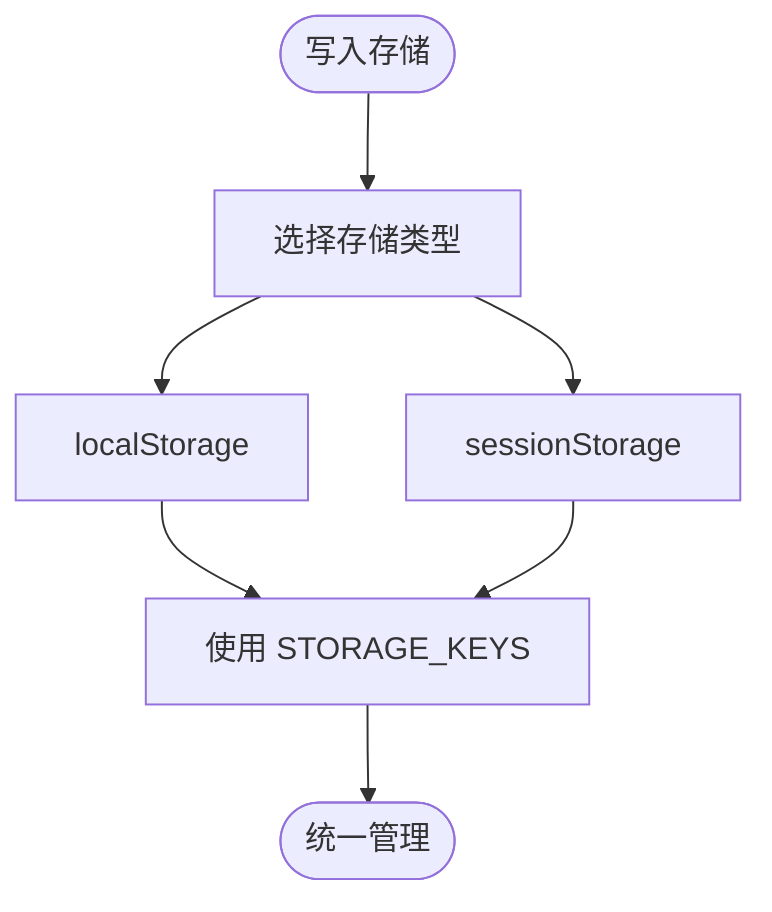
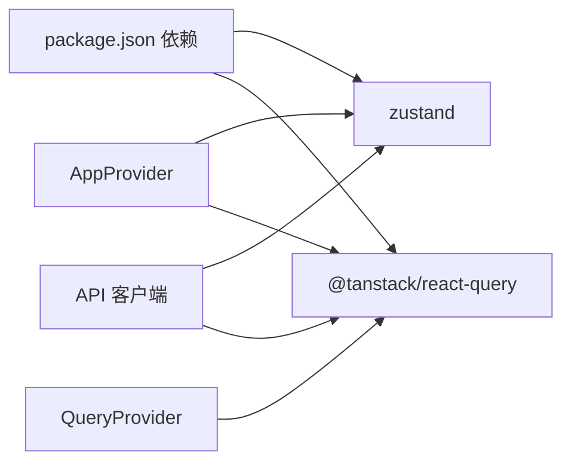

# 状态管理

<cite>
**本文引用的文件**
- [package.json](file://m_flow-frontend/package.json)
- [QueryProvider.tsx](file://m_flow-frontend/src/components/providers/QueryProvider.tsx)
- [AppProvider.tsx](file://m_flow-frontend/src/components/providers/AppProvider.tsx)
- [auth.ts](file://m_flow-frontend/src/lib/store/auth.ts)
- [client.ts](file://m_flow-frontend/src/lib/api/client.ts)
- [config.ts](file://m_flow-frontend/src/lib/config.ts)
- [store.test.ts](file://m_flow-frontend/src/lib/__tests__/store.test.ts)
</cite>

## 目录
1. [简介](#简介)
2. [项目结构](#项目结构)
3. [核心组件](#核心组件)
4. [架构总览](#架构总览)
5. [详细组件分析](#详细组件分析)
6. [依赖分析](#依赖分析)
7. [性能考虑](#性能考虑)
8. [故障排查指南](#故障排查指南)
9. [结论](#结论)
10. [附录](#附录)

## 简介
本指南聚焦于前端状态管理，围绕以下目标展开：
- 深入介绍 Zustand 状态管理库的使用，包括 Store 的设计模式、状态订阅与异步状态更新
- 详解 React Query 的集成，包括查询客户端配置、缓存策略与数据同步机制
- 明确全局状态与组件状态的划分原则，覆盖用户会话、应用配置与 UI 状态
- 记录状态持久化策略，涵盖本地存储与会话存储的使用
- 总结状态管理最佳实践，包括状态结构设计、副作用处理与性能优化
- 提供状态调试与监控工具的使用指南
- 给出状态管理与 API 集成的实现模式

## 项目结构
前端状态管理相关的关键位置如下：
- 状态持久化与全局状态：Zustand Store（认证状态）
- 查询客户端与缓存：React Query Provider
- 应用初始化与鉴权流程：AppProvider
- API 客户端与错误处理：MflowApiClient
- 配置与存储键：config 与 STORAGE_KEYS

**图表来源**
- [AppProvider.tsx:113-135](file://m_flow-frontend/src/components/providers/AppProvider.tsx#L113-L135)
- [QueryProvider.tsx:6-23](file://m_flow-frontend/src/components/providers/QueryProvider.tsx#L6-L23)
- [auth.ts:15-31](file://m_flow-frontend/src/lib/store/auth.ts#L15-L31)
- [client.ts:139-1616](file://m_flow-frontend/src/lib/api/client.ts#L139-L1616)
- [config.ts:19-77](file://m_flow-frontend/src/lib/config.ts#L19-L77)

**章节来源**
- [package.json:16-42](file://m_flow-frontend/package.json#L16-L42)
- [QueryProvider.tsx:1-23](file://m_flow-frontend/src/components/providers/QueryProvider.tsx#L1-L23)
- [AppProvider.tsx:1-135](file://m_flow-frontend/src/components/providers/AppProvider.tsx#L1-L135)
- [auth.ts:1-31](file://m_flow-frontend/src/lib/store/auth.ts#L1-L31)
- [client.ts:139-1616](file://m_flow-frontend/src/lib/api/client.ts#L139-L1616)
- [config.ts:1-77](file://m_flow-frontend/src/lib/config.ts#L1-L77)

## 核心组件
- Zustand 认证 Store：负责用户会话、登录状态与加载态的持久化存储
- React Query Provider：统一配置查询客户端默认行为（过期时间、窗口焦点重取、重试次数等）
- AppProvider：应用启动时的鉴权初始化、自动登录与登录表单展示控制
- MflowApiClient：封装后端 API 调用、鉴权令牌设置与 401 处理、错误转换
- config 与 STORAGE_KEYS：集中式配置与本地/会话存储键名管理

**章节来源**
- [auth.ts:15-31](file://m_flow-frontend/src/lib/store/auth.ts#L15-L31)
- [QueryProvider.tsx:6-23](file://m_flow-frontend/src/components/providers/QueryProvider.tsx#L6-L23)
- [AppProvider.tsx:13-135](file://m_flow-frontend/src/components/providers/AppProvider.tsx#L13-L135)
- [client.ts:139-1616](file://m_flow-frontend/src/lib/api/client.ts#L139-L1616)
- [config.ts:48-77](file://m_flow-frontend/src/lib/config.ts#L48-L77)

## 架构总览
下图展示了前端状态管理的整体交互：应用启动时通过 AppProvider 初始化鉴权；Zustand Store 持久化用户会话；React Query 负责数据获取与缓存；API 客户端在 401 时清理本地状态并触发重新登录。

**图表来源**
- [AppProvider.tsx:26-85](file://m_flow-frontend/src/components/providers/AppProvider.tsx#L26-L85)
- [auth.ts:15-31](file://m_flow-frontend/src/lib/store/auth.ts#L15-L31)
- [client.ts:178-196](file://m_flow-frontend/src/lib/api/client.ts#L178-L196)

## 详细组件分析

### Zustand 认证 Store 设计与持久化
- Store 结构：包含用户信息、是否已认证、加载状态以及设置用户、设置加载、登出等动作
- 持久化策略：使用 persist 中间件，仅持久化必要字段，并指定存储名称
- 使用方式：在组件中通过 useAuthStore 订阅状态变化，执行登录成功后的状态更新

**图表来源**
- [auth.ts:5-31](file://m_flow-frontend/src/lib/store/auth.ts#L5-L31)

**章节来源**
- [auth.ts:15-31](file://m_flow-frontend/src/lib/store/auth.ts#L15-L31)
- [store.test.ts:1-69](file://m_flow-frontend/src/lib/__tests__/store.test.ts#L1-L69)

### React Query 查询客户端配置与缓存策略
- 默认配置：staleTime 设置为 1 分钟；refetchOnWindowFocus 关闭；retry 为 1
- 作用范围：在应用根部通过 QueryClientProvider 注入，为所有查询提供一致的缓存与重试策略
- 建议：根据业务场景调整 staleTime 与重试策略，避免频繁网络请求或陈旧数据

**图表来源**
- [QueryProvider.tsx:7-18](file://m_flow-frontend/src/components/providers/QueryProvider.tsx#L7-L18)

**章节来源**
- [QueryProvider.tsx:6-23](file://m_flow-frontend/src/components/providers/QueryProvider.tsx#L6-L23)

### 应用初始化与鉴权流程
- 初始化阶段：检查显式登出标记、本地存储的令牌，尝试自动登录或回退到登录表单
- 登录成功：清除登出标记，设置用户信息
- 自动登录失败：根据配置提示用户手动登录
- 加载态：在初始化期间显示加载状态，避免 UI 闪烁

**图表来源**
- [AppProvider.tsx:26-85](file://m_flow-frontend/src/components/providers/AppProvider.tsx#L26-L85)

**章节来源**
- [AppProvider.tsx:13-135](file://m_flow-frontend/src/components/providers/AppProvider.tsx#L13-L135)
- [config.ts:29-43](file://m_flow-frontend/src/lib/config.ts#L29-L43)

### API 客户端与 401 处理
- 令牌管理：构造函数从本地存储恢复令牌；登录成功保存令牌；登出清理令牌
- 401 处理：响应 401 时清理本地令牌与 Zustand 认证状态，跳转首页
- 错误转换：统一将后端错误格式转换为可读的 ServiceFault

**图表来源**
- [client.ts:146-152](file://m_flow-frontend/src/lib/api/client.ts#L146-L152)
- [client.ts:274-301](file://m_flow-frontend/src/lib/api/client.ts#L274-L301)
- [client.ts:310-321](file://m_flow-frontend/src/lib/api/client.ts#L310-L321)
- [client.ts:178-196](file://m_flow-frontend/src/lib/api/client.ts#L178-L196)

**章节来源**
- [client.ts:139-1616](file://m_flow-frontend/src/lib/api/client.ts#L139-L1616)
- [config.ts:48-57](file://m_flow-frontend/src/lib/config.ts#L48-L57)

### 全局状态与组件状态的划分原则
- 全局状态（Zustand）：用户会话、应用配置（来自后端设置）、需要跨组件共享且需持久化的 UI 状态
- 组件状态（useState/useReducer）：仅在局部组件树内使用的临时状态，如表单输入、模态框开关
- 划分建议：
  - 用户会话：使用持久化 Store，结合 API 客户端的令牌管理
  - 应用配置：通过 API 获取并缓存，配合 React Query 的 staleTime 控制刷新
  - UI 状态：尽量局部化，避免污染全局 Store

**章节来源**
- [auth.ts:15-31](file://m_flow-frontend/src/lib/store/auth.ts#L15-L31)
- [QueryProvider.tsx:6-23](file://m_flow-frontend/src/components/providers/QueryProvider.tsx#L6-L23)
- [client.ts:943-985](file://m_flow-frontend/src/lib/api/client.ts#L943-L985)

### 状态持久化策略
- 本地存储（localStorage）：用于保存令牌与显式登出标记，确保刷新后仍保持登录状态或强制显示登录
- 会话存储（sessionStorage）：用于保存显式登出标记，避免自动登录
- 存储键统一管理：STORAGE_KEYS 集中式定义，便于维护与避免冲突

**图表来源**
- [config.ts:48-57](file://m_flow-frontend/src/lib/config.ts#L48-L57)
- [client.ts:294-298](file://m_flow-frontend/src/lib/api/client.ts#L294-L298)
- [client.ts:317-319](file://m_flow-frontend/src/lib/api/client.ts#L317-L319)

**章节来源**
- [config.ts:48-57](file://m_flow-frontend/src/lib/config.ts#L48-L57)
- [client.ts:274-321](file://m_flow-frontend/src/lib/api/client.ts#L274-L321)

### 异步状态更新与副作用处理
- 异步更新：在组件中通过 Store 动作发起异步操作（如登录），完成后更新状态
- 副作用：API 401 时的清理逻辑与路由跳转，避免循环请求
- 最佳实践：在动作内部处理错误与回滚，对外暴露简洁的调用接口

**章节来源**
- [auth.ts:15-31](file://m_flow-frontend/src/lib/store/auth.ts#L15-L31)
- [client.ts:178-196](file://m_flow-frontend/src/lib/api/client.ts#L178-L196)

### 与 API 集成的实现模式
- 统一错误处理：ServiceFault 封装多种后端错误格式，便于前端统一展示
- 请求拦截：在请求前附加 Authorization 头，响应 401 时清理本地状态
- 数据转换：对搜索等复杂返回进行标准化，保证上层组件消费的一致性

**章节来源**
- [client.ts:80-133](file://m_flow-frontend/src/lib/api/client.ts#L80-L133)
- [client.ts:158-209](file://m_flow-frontend/src/lib/api/client.ts#L158-L209)
- [client.ts:725-882](file://m_flow-frontend/src/lib/api/client.ts#L725-L882)

## 依赖分析
- Zustand：用于轻量级全局状态管理与持久化
- React Query：用于数据获取、缓存与同步
- 依赖关系：AppProvider 与 QueryProvider 在应用根部注入，Zustand Store 与 API 客户端贯穿各页面与组件

**图表来源**
- [package.json:16-42](file://m_flow-frontend/package.json#L16-L42)
- [AppProvider.tsx:113-135](file://m_flow-frontend/src/components/providers/AppProvider.tsx#L113-L135)
- [QueryProvider.tsx:6-23](file://m_flow-frontend/src/components/providers/QueryProvider.tsx#L6-L23)
- [client.ts:139-1616](file://m_flow-frontend/src/lib/api/client.ts#L139-L1616)

**章节来源**
- [package.json:16-42](file://m_flow-frontend/package.json#L16-L42)

## 性能考虑
- 缓存策略：合理设置 staleTime，避免频繁拉取；对只读数据可适当延长
- 重试策略：根据接口稳定性设置 retry 次数，防止雪崩效应
- 网络请求：统一在 API 客户端处理鉴权头与错误转换，减少重复逻辑
- 状态粒度：避免 Store 过大，按功能域拆分多个 Store，降低订阅范围

## 故障排查指南
- 登录后立即 401：检查令牌是否正确保存与发送，确认后端鉴权逻辑
- 自动登录失败：确认环境变量与默认凭据配置，查看初始化日志
- 页面空白或加载状态异常：检查 AppProvider 的初始化流程与 Zustand Store 的持久化状态
- 查询不更新：检查 staleTime 与 refetchOnWindowFocus 配置，必要时手动 invalid

**章节来源**
- [client.ts:178-196](file://m_flow-frontend/src/lib/api/client.ts#L178-L196)
- [AppProvider.tsx:26-85](file://m_flow-frontend/src/components/providers/AppProvider.tsx#L26-L85)
- [QueryProvider.tsx:6-23](file://m_flow-frontend/src/components/providers/QueryProvider.tsx#L6-L23)

## 结论
本项目采用 Zustand 管理用户会话与关键 UI 状态，结合 React Query 实现高效的数据获取与缓存，通过统一的 API 客户端与配置中心完成鉴权与错误处理。遵循“全局最小化、组件局部化”的划分原则，辅以持久化与缓存策略，可在保证开发效率的同时提升用户体验与系统稳定性。

## 附录
- 测试参考：Zustand Store 的单元测试展示了基本的状态更新与持久化行为，可作为编写自测的模板

**章节来源**
- [store.test.ts:1-69](file://m_flow-frontend/src/lib/__tests__/store.test.ts#L1-L69)