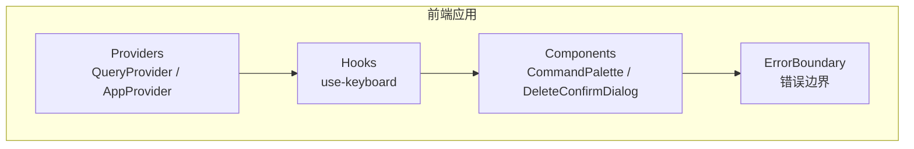
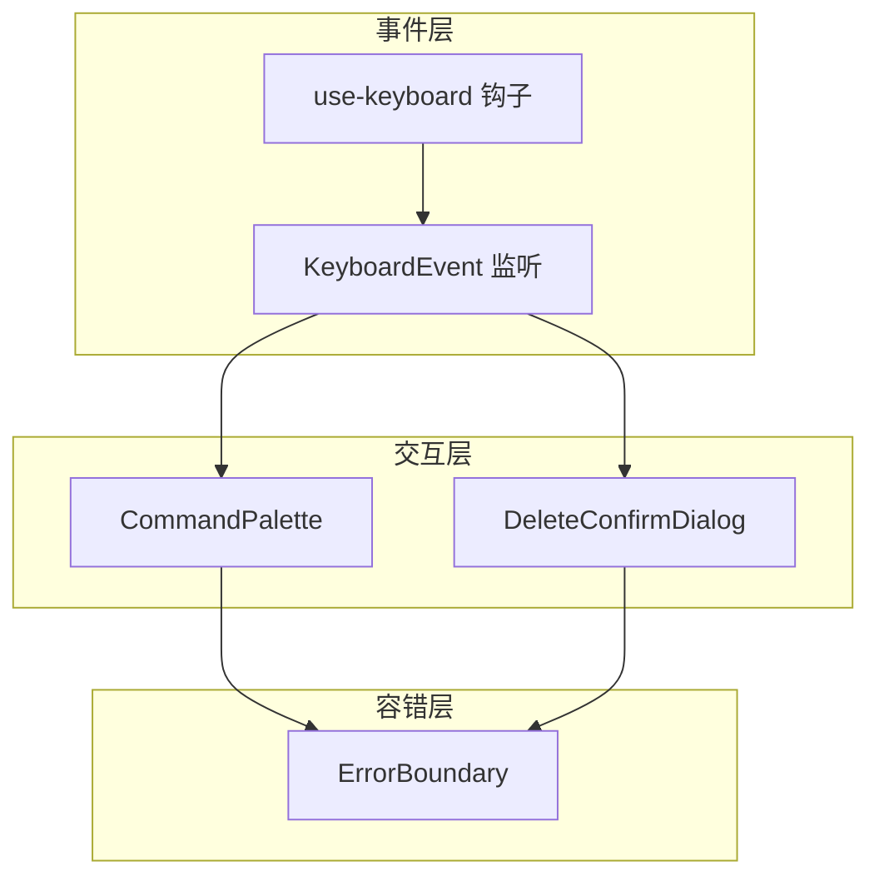
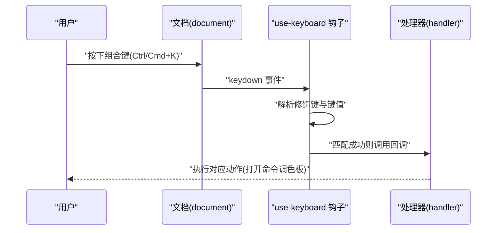
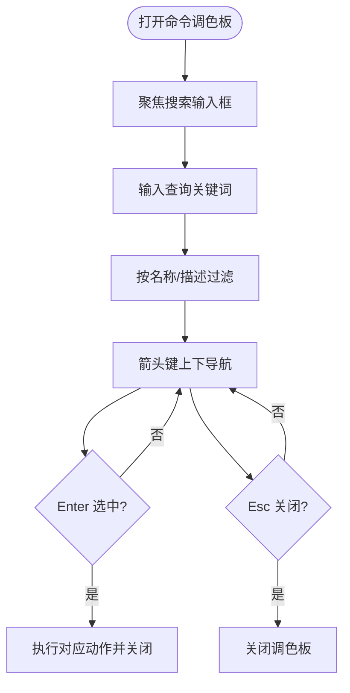
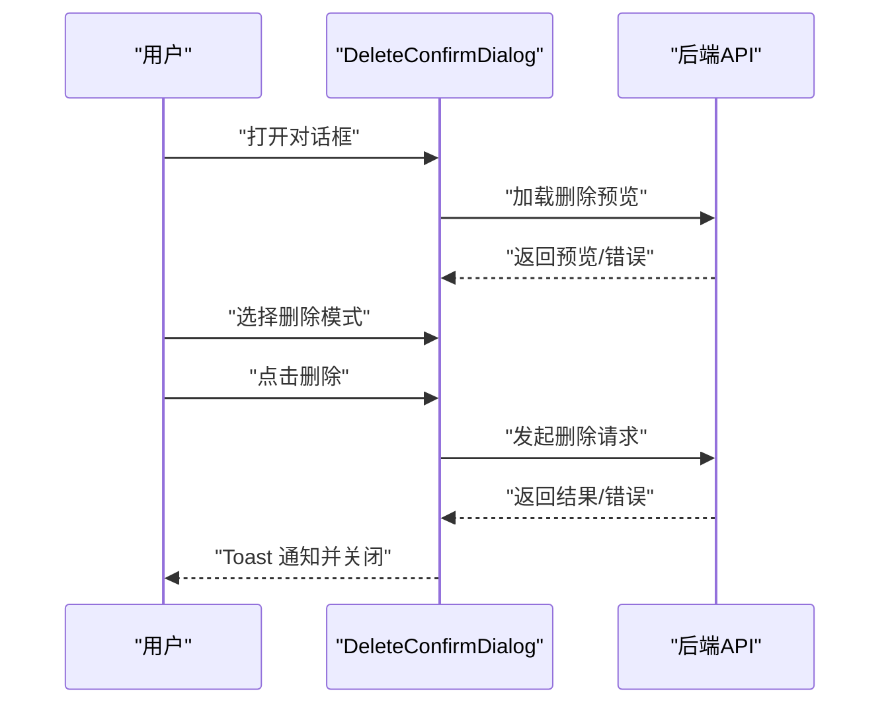
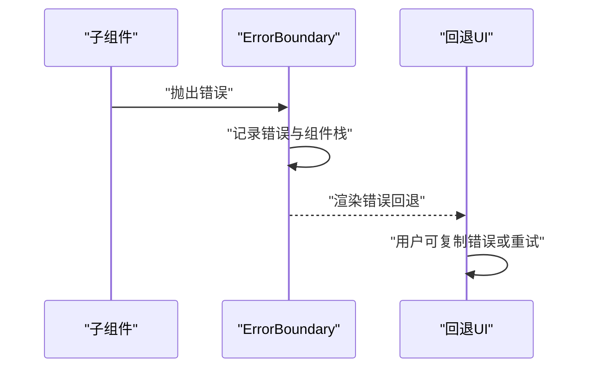
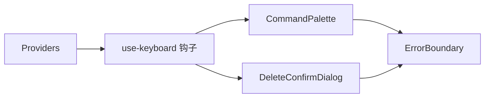

# 可访问性系统

<cite>
**本文引用的文件**
- [ErrorBoundary.tsx](file://m_flow-frontend/src/components/common/ErrorBoundary.tsx)
- [use-keyboard.ts](file://m_flow-frontend/src/hooks/use-keyboard.ts)
- [CommandPalette.tsx](file://m_flow-frontend/src/components/common/CommandPalette.tsx)
- [DeleteConfirmDialog.tsx](file://m_flow-frontend/src/components/graph/DeleteConfirmDialog.tsx)
- [index.ts（providers）](file://m_flow-frontend/src/components/providers/index.ts)
- [package.json（前端依赖）](file://m_flow-frontend/package.json)
</cite>

## 目录
1. [简介](#简介)
2. [项目结构](#项目结构)
3. [核心组件](#核心组件)
4. [架构总览](#架构总览)
5. [详细组件分析](#详细组件分析)
6. [依赖关系分析](#依赖关系分析)
7. [性能考量](#性能考量)
8. [故障排查指南](#故障排查指南)
9. [结论](#结论)
10. [附录](#附录)

## 简介
本文件系统化梳理并记录本仓库前端可访问性体系，重点覆盖以下方面：
- 键盘导航与快捷键：全局快捷键、箭头键导航、Esc 处理等
- 屏幕阅读器与 ARIA 支持：语义化标签、角色与状态管理
- 错误边界与异常处理：优雅降级、错误回退与恢复
- 组件可访问性属性配置与动态更新机制
- 测试方法与工具建议（含 Playwright）
- 无障碍最佳实践与 WCAG 2.1 指标遵循现状与改进建议
- 调试与测试实用技巧

## 项目结构
前端位于 m_flow-frontend，采用 Next.js + Radix UI + Tailwind 架构。可访问性相关能力主要分布在：
- 钩子层：use-keyboard 提供统一键盘事件处理与快捷键注册
- 组件层：CommandPalette、DeleteConfirmDialog 等展示可访问性实践
- 容错层：ErrorBoundary 提供错误边界与回退 UI
- Provider 层：QueryProvider/AppProvider 等为应用提供上下文与状态

图表来源
- [index.ts（providers）:1-3](file://m_flow-frontend/src/components/providers/index.ts#L1-L3)
- [use-keyboard.ts:1-349](file://m_flow-frontend/src/hooks/use-keyboard.ts#L1-L349)
- [CommandPalette.tsx:1-452](file://m_flow-frontend/src/components/common/CommandPalette.tsx#L1-L452)
- [DeleteConfirmDialog.tsx:1-296](file://m_flow-frontend/src/components/graph/DeleteConfirmDialog.tsx#L1-L296)
- [ErrorBoundary.tsx:1-344](file://m_flow-frontend/src/components/common/ErrorBoundary.tsx#L1-L344)

章节来源
- [package.json（前端依赖）:1-65](file://m_flow-frontend/package.json#L1-L65)

## 核心组件
- 键盘钩子 use-keyboard：统一处理全局快捷键、组合键、箭头键导航、Esc 等，支持忽略输入焦点、修饰键约束、事件类型选择与默认行为控制
- 命令调色板 CommandPalette：通过 Cmd/Ctrl+K 打开，支持模糊搜索、键盘导航、分类分组、入口快捷键提示
- 删除确认对话框 DeleteConfirmDialog：模态交互中提供键盘 Esc 关闭、加载/错误状态反馈、软硬删除模式切换
- 错误边界 ErrorBoundary：捕获子树错误，提供可恢复的回退 UI、复制错误信息、开发模式详情展开

章节来源
- [use-keyboard.ts:1-349](file://m_flow-frontend/src/hooks/use-keyboard.ts#L1-L349)
- [CommandPalette.tsx:1-452](file://m_flow-frontend/src/components/common/CommandPalette.tsx#L1-L452)
- [DeleteConfirmDialog.tsx:1-296](file://m_flow-frontend/src/components/graph/DeleteConfirmDialog.tsx#L1-L296)
- [ErrorBoundary.tsx:1-344](file://m_flow-frontend/src/components/common/ErrorBoundary.tsx#L1-L344)

## 架构总览
下图展示可访问性相关模块在运行时的交互关系与职责分工。

图表来源
- [use-keyboard.ts:133-188](file://m_flow-frontend/src/hooks/use-keyboard.ts#L133-L188)
- [CommandPalette.tsx:425-447](file://m_flow-frontend/src/components/common/CommandPalette.tsx#L425-L447)
- [DeleteConfirmDialog.tsx:103-114](file://m_flow-frontend/src/components/graph/DeleteConfirmDialog.tsx#L103-L114)
- [ErrorBoundary.tsx:241-308](file://m_flow-frontend/src/components/common/ErrorBoundary.tsx#L241-L308)

## 详细组件分析

### 键盘导航与快捷键系统
- 全局快捷键：支持组合键（如 Ctrl/Cmd+K）、修饰键约束、事件类型选择（keydown/keyUp）、默认行为与冒泡控制
- 箭头键导航：支持垂直/水平/双向导航、循环环绕、Home/End 快速定位
- 特殊键处理：Esc 关闭、Enter 选中、Tab 切换焦点
- 输入焦点忽略：可配置在输入框聚焦时不触发快捷键，避免干扰编辑
- 性能优化：使用 ref 存储回调，避免重复绑定；按键匹配逻辑解析字符串组合键

图表来源
- [use-keyboard.ts:133-188](file://m_flow-frontend/src/hooks/use-keyboard.ts#L133-L188)
- [CommandPalette.tsx:425-447](file://m_flow-frontend/src/components/common/CommandPalette.tsx#L425-L447)

章节来源
- [use-keyboard.ts:1-349](file://m_flow-frontend/src/hooks/use-keyboard.ts#L1-L349)

### 命令调色板（CommandPalette）
- 打开方式：Cmd/Ctrl+K 全局快捷键
- 导航方式：上下箭头键、Enter 选中、Esc 关闭
- 结构组织：导航项、操作项、最近项三类，分组显示
- 无障碍特性：键盘焦点管理、选中态视觉反馈、快捷键提示、SSR 安全渲染

图表来源
- [CommandPalette.tsx:243-314](file://m_flow-frontend/src/components/common/CommandPalette.tsx#L243-L314)
- [CommandPalette.tsx:425-447](file://m_flow-frontend/src/components/common/CommandPalette.tsx#L425-L447)

章节来源
- [CommandPalette.tsx:1-452](file://m_flow-frontend/src/components/common/CommandPalette.tsx#L1-L452)

### 删除确认对话框（DeleteConfirmDialog）
- 打开与关闭：Esc 键关闭、点击遮罩关闭、按钮禁用状态随请求状态变化
- 加载与错误：预览加载中、错误提示、删除结果通知
- 模式选择：针对 Episode 类型提供软/硬删除模式切换
- 可访问性要点：禁用态按钮、标题提示、状态反馈、键盘关闭

图表来源
- [DeleteConfirmDialog.tsx:38-63](file://m_flow-frontend/src/components/graph/DeleteConfirmDialog.tsx#L38-L63)
- [DeleteConfirmDialog.tsx:116-120](file://m_flow-frontend/src/components/graph/DeleteConfirmDialog.tsx#L116-L120)
- [DeleteConfirmDialog.tsx:65-101](file://m_flow-frontend/src/components/graph/DeleteConfirmDialog.tsx#L65-L101)

章节来源
- [DeleteConfirmDialog.tsx:1-296](file://m_flow-frontend/src/components/graph/DeleteConfirmDialog.tsx#L1-L296)

### 错误边界（ErrorBoundary）
- 功能：捕获子树 JavaScript 错误，记录日志，提供可恢复的回退 UI
- 回退 UI：包含错误消息、复制错误、重试按钮、可选详情展开
- 配置：自定义回退组件、错误回调、是否显示详情、组件名、样式类
- HOC 包装：withErrorBoundary 自动注入组件名并包裹目标组件

图表来源
- [ErrorBoundary.tsx:241-308](file://m_flow-frontend/src/components/common/ErrorBoundary.tsx#L241-L308)
- [ErrorBoundary.tsx:70-200](file://m_flow-frontend/src/components/common/ErrorBoundary.tsx#L70-L200)

章节来源
- [ErrorBoundary.tsx:1-344](file://m_flow-frontend/src/components/common/ErrorBoundary.tsx#L1-L344)

## 依赖关系分析
- 使用 Radix UI 组件库（如 Dialog、DropdownMenu、Tabs、Tooltip 等），这些组件原生具备可访问性语义与键盘行为
- 使用 Framer Motion 实现动画，需确保动画可被用户禁用（系统偏好设置）
- 使用 Sonner 进行 Toast 通知，注意与屏幕阅读器的交互与可读性
- 使用 TanStack React Query 管理数据流，结合错误边界进行统一异常处理

图表来源
- [use-keyboard.ts:1-349](file://m_flow-frontend/src/hooks/use-keyboard.ts#L1-L349)
- [CommandPalette.tsx:1-452](file://m_flow-frontend/src/components/common/CommandPalette.tsx#L1-L452)
- [DeleteConfirmDialog.tsx:1-296](file://m_flow-frontend/src/components/graph/DeleteConfirmDialog.tsx#L1-L296)
- [ErrorBoundary.tsx:1-344](file://m_flow-frontend/src/components/common/ErrorBoundary.tsx#L1-L344)
- [index.ts（providers）:1-3](file://m_flow-frontend/src/components/providers/index.ts#L1-L3)

章节来源
- [package.json（前端依赖）:16-43](file://m_flow-frontend/package.json#L16-L43)

## 性能考量
- 键盘钩子使用 ref 缓存回调，避免每次渲染重新绑定事件监听器
- 命令调色板使用 useMemo 优化过滤与分组计算
- 对话框使用 Portal 渲染，减少 DOM 层级对布局的影响
- 错误边界仅在发生错误时渲染，正常路径不引入额外开销

## 故障排查指南
- 键盘事件未生效
  - 检查 use-keyboard 的 enabled、ignoreInputs、modifier 参数
  - 确认目标元素是否正确传入 target
- 命令调色板无法打开
  - 确认 Cmd/Ctrl+K 是否被浏览器扩展拦截
  - 检查 useCommandPalette 返回的状态 isOpen
- 对话框无法关闭
  - 检查 Esc 监听是否被其他组件阻止
  - 确认删除请求状态（isPending）是否导致按钮禁用
- 错误边界未显示
  - 确认子组件是否抛出错误
  - 检查 onError 回调是否记录日志

章节来源
- [use-keyboard.ts:133-188](file://m_flow-frontend/src/hooks/use-keyboard.ts#L133-L188)
- [CommandPalette.tsx:425-447](file://m_flow-frontend/src/components/common/CommandPalette.tsx#L425-L447)
- [DeleteConfirmDialog.tsx:103-114](file://m_flow-frontend/src/components/graph/DeleteConfirmDialog.tsx#L103-L114)
- [ErrorBoundary.tsx:258-267](file://m_flow-frontend/src/components/common/ErrorBoundary.tsx#L258-L267)

## 结论
本项目在前端层面已建立较为完善的可访问性基础：
- 键盘导航与快捷键系统覆盖全局与局部场景
- 关键交互组件（命令调色板、对话框）具备良好的键盘与焦点管理
- 错误边界提供优雅降级与恢复能力
- 依赖 Radix UI 等原生可访问性组件，降低实现成本

后续可在以下方面持续改进：
- 引入 ARIA 角色与状态（如 role="dialog"、aria-modal、aria-expanded 等）
- 增强屏幕阅读器提示与语义化标签
- 完善颜色对比度与高对比度主题支持
- 建立可访问性测试规范与自动化流程

## 附录

### 可访问性测试方法与工具
- 人工测试
  - 键盘独行测试：验证所有交互可通过键盘完成
  - 屏幕阅读器测试：NVDA/JAWS/VoiceOver 下验证语义与顺序
  - 高对比度测试：启用系统高对比度模式验证可读性
- 自动化测试
  - Lighthouse/axe-core：静态分析与可访问性扫描
  - Playwright：端到端可访问性测试（e2e）

章节来源
- [package.json（前端依赖）:13-14](file://m_flow-frontend/package.json#L13-L14)

### WCAG 2.1 指标遵循现状与改进措施
- 现状
  - 键盘可达性：良好（命令调色板、对话框、快捷键）
  - 错误处理：良好（错误边界）
  - 组件语义：依赖 Radix UI，具备基础可访问性
- 改进措施
  - 补充 ARIA 角色与状态，明确模态与状态
  - 增强键盘焦点可见性与管理
  - 优化颜色对比度与文本缩放支持
  - 建立可访问性回归测试

### 组件可访问性属性配置与动态更新机制
- 命令调色板
  - 通过键盘事件管理选中态与焦点
  - 使用 Portal 渲染，避免焦点丢失
- 删除确认对话框
  - 通过状态控制按钮禁用与加载态
  - 提供标题提示与禁用态说明
- 错误边界
  - 通过 props 注入组件名，增强错误信息可读性
  - 支持自定义回退 UI 与错误回调

章节来源
- [CommandPalette.tsx:243-314](file://m_flow-frontend/src/components/common/CommandPalette.tsx#L243-L314)
- [DeleteConfirmDialog.tsx:116-120](file://m_flow-frontend/src/components/graph/DeleteConfirmDialog.tsx#L116-L120)
- [ErrorBoundary.tsx:294-303](file://m_flow-frontend/src/components/common/ErrorBoundary.tsx#L294-L303)

### 可访问性调试与测试实用技巧
- 使用浏览器开发者工具的“可访问性”面板检查焦点顺序与语义
- 在系统设置中启用“减少动态效果”，验证动画可禁用
- 使用 VoiceOver/NVDA 执行完整操作流程，记录卡顿与跳读问题
- 在 Playwright 中编写可访问性断言，确保关键元素存在且可交互