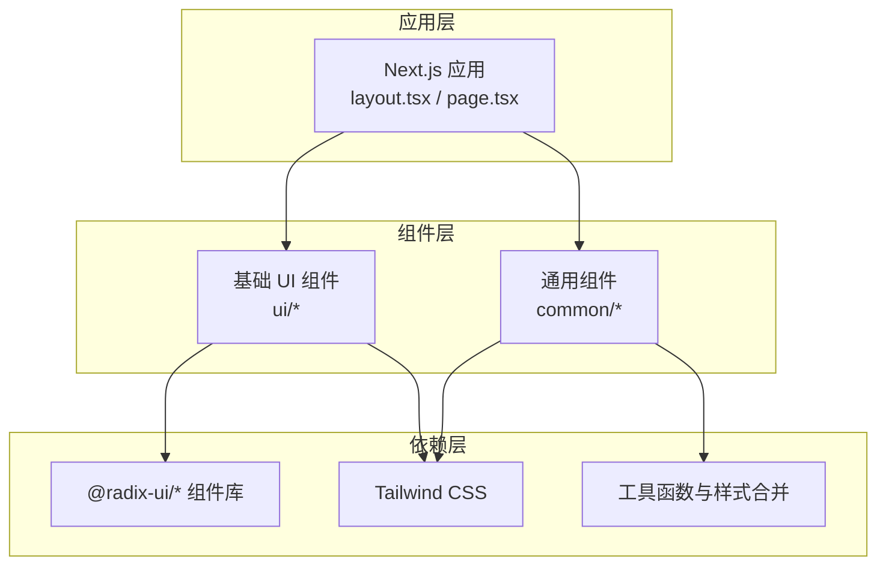
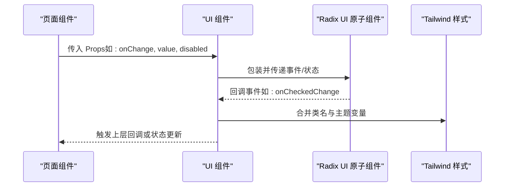
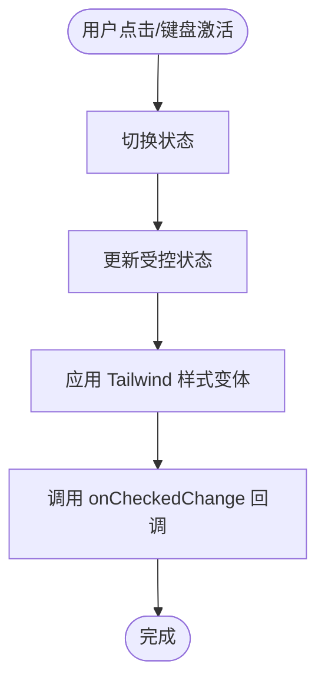
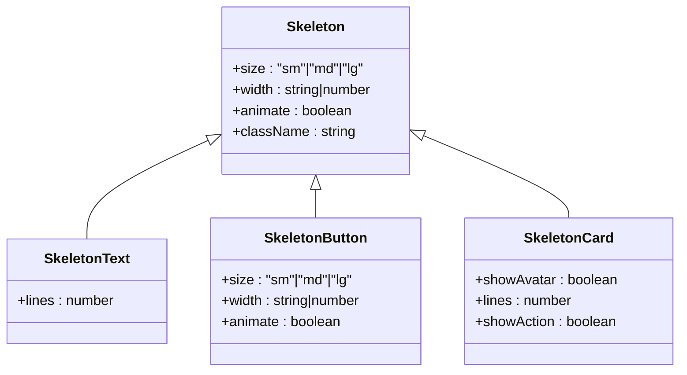
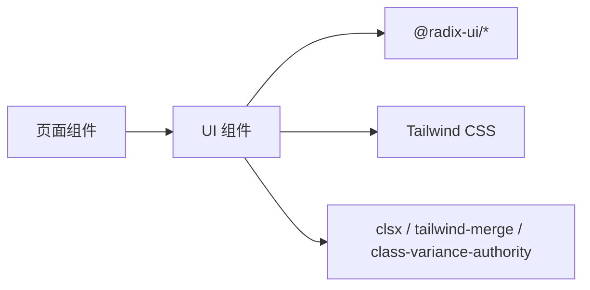

# 基础 UI 组件

<cite>
**本文引用的文件**
- [package.json](file://m_flow-frontend/package.json)
- [switch.tsx](file://m_flow-frontend/src/components/ui/switch.tsx)
- [index.ts（common 组件导出）](file://m_flow-frontend/src/components/common/index.ts)
- [Skeleton.tsx](file://m_flow-frontend/src/components/common/Skeleton.tsx)
- [CommandPalette.tsx](file://m_flow-frontend/src/components/common/CommandPalette.tsx)
- [TagInput.tsx](file://m_flow-frontend/src/components/common/TagInput.tsx)
- [layout.tsx](file://m_flow-frontend/src/app/layout.tsx)
- [page.tsx](file://m_flow-frontend/src/app/page.tsx)
- [EpisodicPage.tsx](file://m_flow-frontend/src/components/retrieve/EpisodicPage.tsx)
- [LexicalPage.tsx](file://m_flow-frontend/src/components/retrieve/LexicalPage.tsx)
- [tailwind.config.ts](file://m_flow-frontend/tailwind.config.ts)
- [globals.css](file://m_flow-frontend/src/app/globals.css)
</cite>

## 目录
1. [简介](#简介)
2. [项目结构](#项目结构)
3. [核心组件](#核心组件)
4. [架构总览](#架构总览)
5. [详细组件分析](#详细组件分析)
6. [依赖分析](#依赖分析)
7. [性能考虑](#性能考虑)
8. [故障排除指南](#故障排除指南)
9. [结论](#结论)
10. [附录](#附录)

## 简介
本文件系统化梳理前端基础 UI 组件的设计规范与实现细节，覆盖按钮、输入框、选择器、开关、卡片与标签等常用组件。文档重点说明各组件的 Props 接口、默认样式与变体选项、可访问性实现（键盘交互、焦点管理、ARIA 属性）、TypeScript 类型定义与类型安全保证，并提供最佳实践、常见用法示例、不同状态下的视觉表现与交互反馈，以及与 Tailwind CSS 的集成与自定义样式方法。

## 项目结构
前端采用 Next.js 应用，UI 组件主要位于 `m_flow-frontend/src/components/ui` 目录，同时大量通用组件集中在 `m_flow-frontend/src/components/common`。项目通过 Radix UI 提供基础无障碍交互能力，Tailwind CSS 提供原子化样式与主题变量支持。

**图表来源**
- [layout.tsx](file://m_flow-frontend/src/app/layout.tsx)
- [page.tsx](file://m_flow-frontend/src/app/page.tsx)
- [package.json](file://m_flow-frontend/package.json)

**章节来源**
- [package.json:16-43](file://m_flow-frontend/package.json#L16-L43)
- [layout.tsx](file://m_flow-frontend/src/app/layout.tsx)
- [page.tsx](file://m_flow-frontend/src/app/page.tsx)

## 核心组件
本节概述基础 UI 组件的职责与共性特征：
- 按钮：用于触发操作，强调可访问性与状态反馈
- 输入框：文本输入与校验，结合表单库实现类型安全
- 选择器：从预设集合中选择值，支持键盘导航与无障碍属性
- 开关：二元状态切换，提供视觉反馈与键盘控制
- 卡片：信息分组容器，支持骨架屏与加载态
- 标签：轻量信息标识，支持编辑与删除

组件均基于 Radix UI 构建，确保键盘可达、焦点管理与 ARIA 属性一致；样式统一由 Tailwind CSS 提供，支持主题变量与变体组合。

**章节来源**
- [package.json:18-26](file://m_flow-frontend/package.json#L18-L26)
- [index.ts（common 组件导出）:1-105](file://m_flow-frontend/src/components/common/index.ts#L1-L105)

## 架构总览
基础 UI 组件的调用链路通常为：页面组件导入 UI 组件 → 传入 Props → 组件内部组合 Radix UI 原子组件与 Tailwind 类 → 渲染并响应用户交互 → 触发回调或状态更新。

**图表来源**
- [switch.tsx:1-32](file://m_flow-frontend/src/components/ui/switch.tsx#L1-L32)
- [EpisodicPage.tsx:187-227](file://m_flow-frontend/src/components/retrieve/EpisodicPage.tsx#L187-L227)
- [LexicalPage.tsx:182-224](file://m_flow-frontend/src/components/retrieve/LexicalPage.tsx#L182-L224)

## 详细组件分析

### 开关（Switch）
- 设计要点
  - 使用 Radix UI Switch 原子组件，提供可访问的二元状态切换
  - 默认样式包含尺寸、过渡动画与状态色值，支持禁用态
  - 键盘交互：Tab 可聚焦，Space/Enter 切换状态
- Props 接口
  - 支持原生 HTML 属性透传，如 `checked`、`onCheckedChange`、`disabled`、`className`
  - 内部通过 `data-state` 属性驱动样式变体
- 默认样式与变体
  - 尺寸：紧凑型（高度与宽度固定）
  - 颜色：选中态使用品牌色，未选中态使用深色背景
  - 状态：禁用态降低不透明度，焦点态添加环形高亮
- 可访问性
  - 自动管理 `aria-checked` 与 `aria-disabled`
  - 焦点可见性：使用 `focus-visible:outline` 与 `focus-visible:ring`
- TypeScript 类型
  - 类型来自 Radix UI 官方定义，确保事件回调与状态类型安全
- 最佳实践
  - 在表单场景中配合表单库进行受控使用
  - 为每个开关提供明确的标签或提示
- 常见用法示例
  - 在检索配置页中作为“启用/禁用”开关使用
  - 在设置页中控制功能开关

**图表来源**
- [switch.tsx:1-32](file://m_flow-frontend/src/components/ui/switch.tsx#L1-L32)
- [EpisodicPage.tsx:187-227](file://m_flow-frontend/src/components/retrieve/EpisodicPage.tsx#L187-L227)
- [LexicalPage.tsx:182-224](file://m_flow-frontend/src/components/retrieve/LexicalPage.tsx#L182-L224)

**章节来源**
- [switch.tsx:1-32](file://m_flow-frontend/src/components/ui/switch.tsx#L1-L32)
- [EpisodicPage.tsx:187-227](file://m_flow-frontend/src/components/retrieve/EpisodicPage.tsx#L187-L227)
- [LexicalPage.tsx:182-224](file://m_flow-frontend/src/components/retrieve/LexicalPage.tsx#L182-L224)

### 骨架屏（Skeleton）
- 设计要点
  - 用于加载态占位，提升感知性能
  - 提供多种骨架变体：文本、头像、按钮、卡片、网格、列表、表格、复合布局
- Props 接口
  - 支持尺寸（sm/md/lg）、宽度、动画开关、额外类名
  - 文本骨架支持行数配置
  - 按钮骨架支持宽度与尺寸
- 默认样式与变体
  - 使用主题变量控制背景与边框颜色
  - 动画通过 `animate-pulse` 实现
- 可访问性
  - 骨架屏不接收交互，仅作为视觉占位
- TypeScript 类型
  - 每个变体组件均有独立 Props 接口定义
- 最佳实践
  - 在数据请求前显示骨架屏，在数据到达后切换真实内容
  - 避免骨架屏与真实内容之间出现闪烁
- 常见用法示例
  - 列表加载时显示卡片骨架
  - 表单提交时显示按钮骨架

**图表来源**
- [Skeleton.tsx:153-205](file://m_flow-frontend/src/components/common/Skeleton.tsx#L153-L205)

**章节来源**
- [Skeleton.tsx:153-205](file://m_flow-frontend/src/components/common/Skeleton.tsx#L153-L205)
- [index.ts（common 组件导出）:25-51](file://m_flow-frontend/src/components/common/index.ts#L25-L51)

### 命令面板（CommandPalette）
- 设计要点
  - 提供全局快捷命令入口，支持键盘导航与模糊匹配
- Props 接口
  - 支持打开/关闭状态、命令项列表、搜索关键词、选择回调等
- 默认样式与变体
  - 使用对话框容器与列表渲染，支持分组与快捷键提示
- 可访问性
  - 键盘导航：上下移动、回车选择、Esc 关闭
  - ARIA：角色、列表与项的语义化标记
- TypeScript 类型
  - 命令项与回调类型明确，确保类型安全
- 最佳实践
  - 将高频操作纳入命令面板，减少界面复杂度
  - 为命令项提供清晰描述与快捷键提示
- 常见用法示例
  - 页面顶部快捷入口，配合全局状态管理

**章节来源**
- [CommandPalette.tsx](file://m_flow-frontend/src/components/common/CommandPalette.tsx)
- [index.ts（common 组件导出）:53-54](file://m_flow-frontend/src/components/common/index.ts#L53-L54)
- [page.tsx:4-5](file://m_flow-frontend/src/app/page.tsx#L4-L5)

### 标签输入（TagInput）
- 设计要点
  - 支持多标签输入与删除，提供自动补全与校验
- Props 接口
  - 支持标签数组、变更回调、禁用态、输入提示等
- 默认样式与变体
  - 标签带删除按钮，输入框支持聚焦态高亮
- 可访问性
  - 键盘删除、新增标签，支持屏幕阅读器读取当前标签列表
- TypeScript 类型
  - 标签类型与回调参数类型明确
- 最佳实践
  - 限制标签数量与长度，提供重复检测
  - 为标签提供可读性良好的文案
- 常见用法示例
  - 数据集标签管理、权限角色选择

**章节来源**
- [TagInput.tsx](file://m_flow-frontend/src/components/common/TagInput.tsx)
- [index.ts（common 组件导出）:104-105](file://m_flow-frontend/src/components/common/index.ts#L104-L105)

### 其他基础组件（按钮、输入框、选择器）
- 按钮（Button）
  - 基于 Radix UI Button 或原生按钮封装，支持尺寸、状态、图标与禁用态
  - 键盘交互：Tab 聚焦、Space/Enter 触发
  - ARIA：根据用途设置 role 与 aria-disabled
- 输入框（Input）
  - 基于 Radix UI Input，支持受控/非受控、校验与错误提示
  - 键盘交互：支持全选、复制粘贴、清空
  - ARIA：结合 Label 使用，提供 aria-invalid
- 选择器（Select）
  - 基于 Radix UI Select，支持单选/多选、分组、搜索过滤
  - 键盘交互：方向键导航、Enter/Space 选择、Esc 关闭
  - ARIA：菜单角色、选项状态与选中态

上述组件均遵循一致的可访问性与样式设计原则，Props 接口与事件回调类型来自 Radix UI 官方定义，确保类型安全。

**章节来源**
- [package.json:18-26](file://m_flow-frontend/package.json#L18-L26)

## 依赖分析
- 组件依赖
  - Radix UI：提供可访问性基础能力（按钮、输入、选择、开关、滑块、标签、提示等）
  - Tailwind CSS：提供原子化样式与主题变量，支持暗色模式与响应式
  - 工具库：clsx、tailwind-merge、class-variance-authority 用于类名合并与变体管理
- 组件耦合
  - UI 组件对 Radix UI 的依赖是直接且稳定的
  - 样式层与业务层解耦，通过类名与主题变量实现定制
- 外部集成点
  - 表单库（如 react-hook-form）与校验库（如 zod）配合使用，确保输入验证与类型安全

**图表来源**
- [package.json:16-43](file://m_flow-frontend/package.json#L16-L43)

**章节来源**
- [package.json:16-43](file://m_flow-frontend/package.json#L16-L43)

## 性能考虑
- 渲染优化
  - 使用骨架屏减少首屏空白时间，提升感知性能
  - 控制列表渲染数量，必要时采用虚拟滚动
- 交互反馈
  - 按钮与开关使用过渡动画，避免突兀变化
  - 对高频交互（如输入框）进行防抖处理
- 样式优化
  - 合理使用 Tailwind 原子类，避免过度嵌套
  - 通过主题变量集中管理颜色与间距，减少重复定义

## 故障排除指南
- 可访问性问题
  - 症状：无法通过键盘操作或屏幕阅读器无法读取
  - 排查：确认是否正确设置 aria-* 属性与 role；检查焦点顺序
- 样式冲突
  - 症状：组件样式被覆盖或主题不一致
  - 排查：检查 Tailwind 配置与主题变量；避免内联样式覆盖类名
- 事件回调异常
  - 症状：受控组件状态不更新或回调未触发
  - 排查：确认受控值与回调函数绑定；检查禁用态与只读态

## 结论
本项目的基础 UI 组件以 Radix UI 为核心，结合 Tailwind CSS 实现高可访问性与一致的视觉风格。通过明确的 Props 接口、类型安全与主题变量，组件在不同状态下具备清晰的视觉反馈与交互行为。建议在实际使用中遵循可访问性最佳实践，合理运用骨架屏与过渡动画，确保用户体验的一致性与稳定性。

## 附录

### Tailwind CSS 集成与自定义样式
- 主题变量
  - 使用 CSS 变量统一管理颜色、边框与背景，便于主题切换
- 类名合并
  - 使用 clsx 与 tailwind-merge 合并类名，避免冲突
- 变体管理
  - 使用 class-variance-authority 定义组件变体（尺寸、状态），保持一致性

**章节来源**
- [tailwind.config.ts](file://m_flow-frontend/tailwind.config.ts)
- [globals.css](file://m_flow-frontend/src/app/globals.css)
- [package.json:30-42](file://m_flow-frontend/package.json#L30-L42)