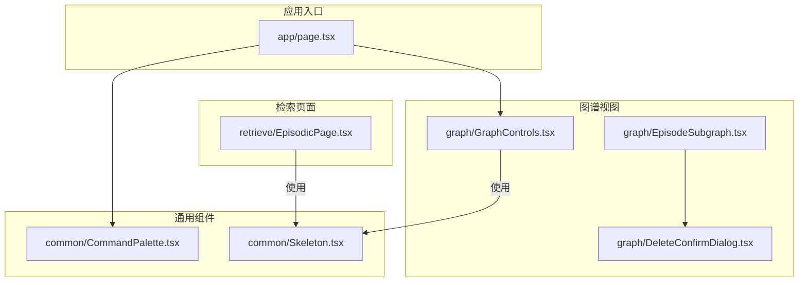
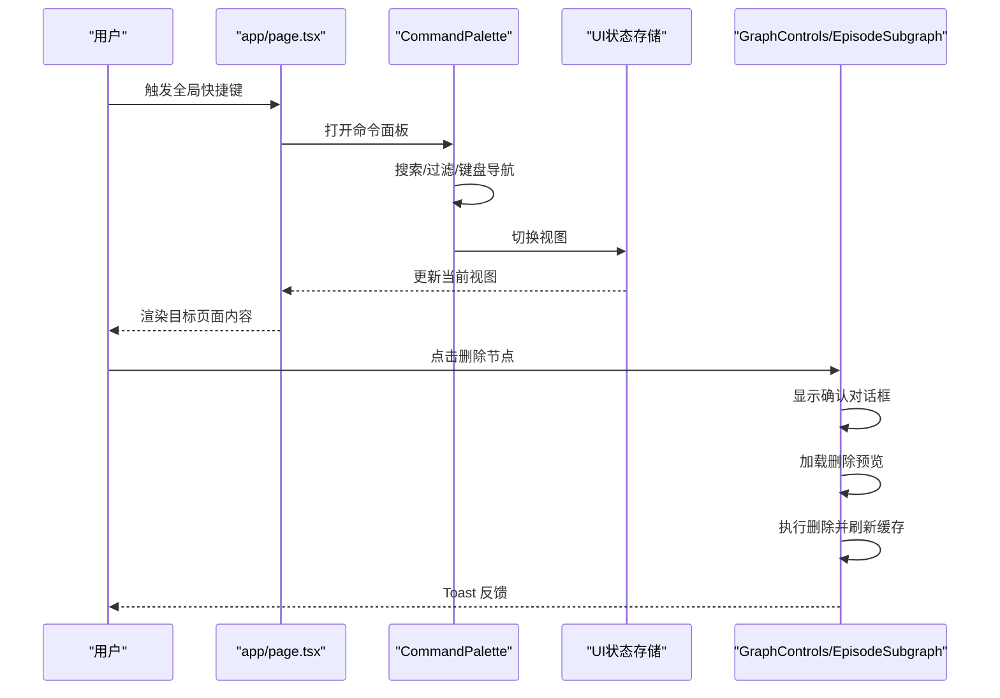
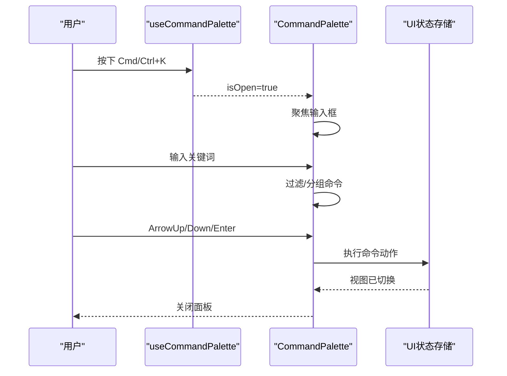
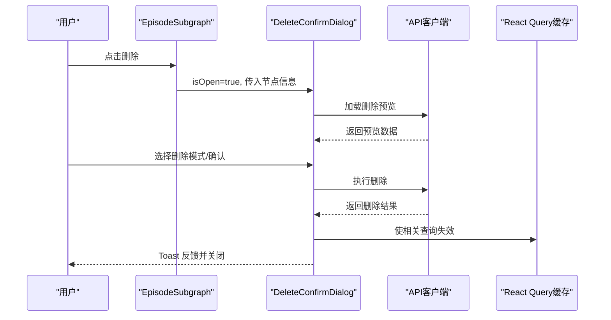
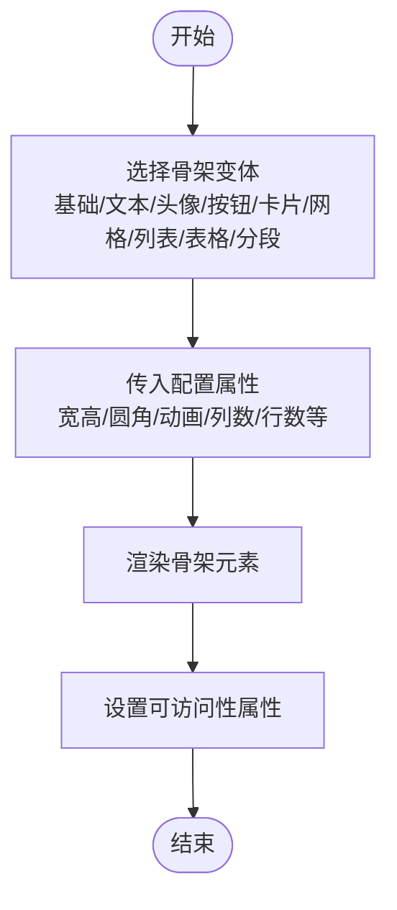
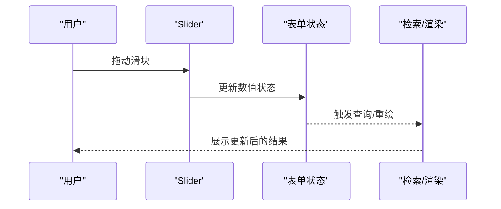
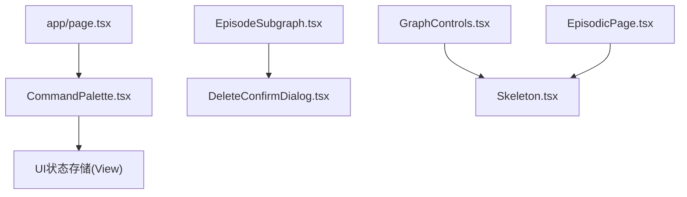

# 复合组件

<cite>
**本文引用的文件**
- [CommandPalette.tsx](file://m_flow-frontend/src/components/common/CommandPalette.tsx)
- [Skeleton.tsx](file://m_flow-frontend/src/components/common/Skeleton.tsx)
- [DeleteConfirmDialog.tsx](file://m_flow-frontend/src/components/graph/DeleteConfirmDialog.tsx)
- [GraphControls.tsx](file://m_flow-frontend/src/components/graph/GraphControls.tsx)
- [page.tsx](file://m_flow-frontend/src/app/page.tsx)
- [EpisodeSubgraph.tsx](file://m_flow-frontend/src/components/graph/EpisodeSubgraph.tsx)
- [EpisodicPage.tsx](file://m_flow-frontend/src/components/retrieve/EpisodicPage.tsx)
</cite>

## 目录
1. [简介](#简介)
2. [项目结构](#项目结构)
3. [核心组件](#核心组件)
4. [架构总览](#架构总览)
5. [详细组件分析](#详细组件分析)
6. [依赖关系分析](#依赖关系分析)
7. [性能考量](#性能考量)
8. [故障排查指南](#故障排查指南)
9. [结论](#结论)
10. [附录](#附录)

## 简介
本文件聚焦于前端复合组件的设计与实现，涵盖以下主题：
- 标签页：通过视图切换与路由状态协同，实现页面级导航与内容切换。
- 命令面板：全局快捷键触发的上下文无关命令入口，支持模糊搜索、键盘导航与分类展示。
- 确认对话框：删除操作的安全确认与预览，支持软/硬删除模式与错误处理。
- 骨架屏：多形态加载占位，提升感知性能与可访问性。
- 滑块：数值调节控件，用于检索参数或图形控制。
- Toast 提示：基于通知库的轻量反馈，贯穿删除、查询等关键流程。

文档将深入说明各组件的状态管理、事件处理、生命周期管理、组件间协作与数据流，并提供配置项、自定义能力、最佳实践、动画与过渡实现、响应式与移动端适配以及完整使用示例与集成指南。

## 项目结构
前端采用按功能域分层的组织方式，复合组件主要分布在 common、graph、ui 等目录中，配合应用入口与页面进行编排。

**图表来源**
- [page.tsx:1-220](file://m_flow-frontend/src/app/page.tsx#L1-L220)
- [CommandPalette.tsx:1-452](file://m_flow-frontend/src/components/common/CommandPalette.tsx#L1-L452)
- [Skeleton.tsx:1-503](file://m_flow-frontend/src/components/common/Skeleton.tsx#L1-L503)
- [DeleteConfirmDialog.tsx:1-296](file://m_flow-frontend/src/components/graph/DeleteConfirmDialog.tsx#L1-L296)
- [GraphControls.tsx:1-120](file://m_flow-frontend/src/components/graph/GraphControls.tsx#L1-L120)
- [EpisodeSubgraph.tsx:1-750](file://m_flow-frontend/src/components/graph/EpisodeSubgraph.tsx#L1-L750)
- [EpisodicPage.tsx:1-600](file://m_flow-frontend/src/components/retrieve/EpisodicPage.tsx#L1-L600)

**章节来源**
- [page.tsx:1-220](file://m_flow-frontend/src/app/page.tsx#L1-L220)
- [CommandPalette.tsx:1-452](file://m_flow-frontend/src/components/common/CommandPalette.tsx#L1-L452)
- [Skeleton.tsx:1-503](file://m_flow-frontend/src/components/common/Skeleton.tsx#L1-L503)
- [DeleteConfirmDialog.tsx:1-296](file://m_flow-frontend/src/components/graph/DeleteConfirmDialog.tsx#L1-L296)
- [GraphControls.tsx:1-120](file://m_flow-frontend/src/components/graph/GraphControls.tsx#L1-L120)
- [EpisodeSubgraph.tsx:1-750](file://m_flow-frontend/src/components/graph/EpisodeSubgraph.tsx#L1-L750)
- [EpisodicPage.tsx:1-600](file://m_flow-frontend/src/components/retrieve/EpisodicPage.tsx#L1-L600)

## 核心组件
本节概述四个复合组件的核心职责、状态与交互要点：
- 命令面板：全局快捷键触发，集中导航与动作入口；内置搜索与键盘导航，支持最近项记忆。
- 确认对话框：删除前预览与模式选择（软/硬），异步删除并联动缓存失效与提示。
- 骨架屏：多形态加载占位，支持文本、头像、按钮、卡片、网格、列表、表格与分段布局。
- 滑块：数值调节器，用于检索相似度阈值、时间窗口等参数；与表单联动更新状态。

**章节来源**
- [CommandPalette.tsx:1-452](file://m_flow-frontend/src/components/common/CommandPalette.tsx#L1-L452)
- [DeleteConfirmDialog.tsx:1-296](file://m_flow-frontend/src/components/graph/DeleteConfirmDialog.tsx#L1-L296)
- [Skeleton.tsx:1-503](file://m_flow-frontend/src/components/common/Skeleton.tsx#L1-L503)
- [GraphControls.tsx:1-120](file://m_flow-frontend/src/components/graph/GraphControls.tsx#L1-L120)

## 架构总览
复合组件在应用中的协作关系如下：

**图表来源**
- [page.tsx:180-210](file://m_flow-frontend/src/app/page.tsx#L180-L210)
- [CommandPalette.tsx:242-419](file://m_flow-frontend/src/components/common/CommandPalette.tsx#L242-L419)
- [DeleteConfirmDialog.tsx:22-118](file://m_flow-frontend/src/components/graph/DeleteConfirmDialog.tsx#L22-L118)
- [GraphControls.tsx:80-110](file://m_flow-frontend/src/components/graph/GraphControls.tsx#L80-L110)
- [EpisodeSubgraph.tsx:640-720](file://m_flow-frontend/src/components/graph/EpisodeSubgraph.tsx#L640-L720)

## 详细组件分析

### 命令面板（CommandPalette）
- 设计目标：提供全局、统一的命令入口，支持导航与动作两类命令，具备键盘导航与快捷键提示。
- 关键状态与生命周期
  - 打开/关闭：由外部传入 isOpen/onClose 控制；内部维护 query、selectedIndex、输入焦点。
  - 搜索与过滤：对命令集合执行模糊匹配，支持按类别分组展示。
  - 键盘导航：ArrowUp/ArrowDown/Enter/Escape 实现选择与确认/关闭。
  - SSR 安全：挂载后渲染，避免服务端直出不一致。
- 数据流
  - 命令注册：通过自定义 hook 返回命令数组，包含 id、label、description、icon、category、shortcut、action。
  - 过滤与分组：根据 query 动态生成 flatList，支持跨类别的连续索引计算。
  - 视图切换：命令 action 调用 UI 状态存储切换视图。
- 事件处理
  - 输入事件：实时更新 query。
  - 键盘事件：统一处理方向键、回车与 Esc。
  - 点击事件：点击条目触发 action 并关闭面板。
- 动画与过渡
  - 使用 Portal 渲染至 body，Backdrop 与面板使用淡入淡出与缩放过渡。
- 响应式与移动端
  - 固定居中面板，最大宽度限制；输入区与快捷键提示清晰可见；移动端建议使用手势关闭。
- 自定义能力
  - 新增命令：在命令注册处添加新条目，设置图标、描述、快捷键与动作。
  - 分类扩展：新增 category 并在分组逻辑中处理。
- 最佳实践
  - 将常用导航与高频动作纳入命令集；为命令提供简短描述与合理快捷键。
  - 保持命令 id 唯一，避免重复；动作内避免阻塞 UI。
- 使用示例
  - 在应用入口通过全局快捷键打开命令面板，并在命令中切换视图。

**图表来源**
- [CommandPalette.tsx:242-419](file://m_flow-frontend/src/components/common/CommandPalette.tsx#L242-L419)
- [CommandPalette.tsx:424-447](file://m_flow-frontend/src/components/common/CommandPalette.tsx#L424-L447)
- [page.tsx:180-210](file://m_flow-frontend/src/app/page.tsx#L180-L210)

**章节来源**
- [CommandPalette.tsx:1-452](file://m_flow-frontend/src/components/common/CommandPalette.tsx#L1-L452)
- [page.tsx:1-220](file://m_flow-frontend/src/app/page.tsx#L1-L220)

### 确认对话框（DeleteConfirmDialog）
- 设计目标：删除前的安全确认，提供删除预览与模式选择（软/硬），异步删除并刷新相关缓存。
- 关键状态与生命周期
  - 打开/关闭：由外部传入 isOpen/onClose 控制；打开时加载删除预览。
  - 预览加载：调用 API 获取删除影响范围与警告信息。
  - 删除模式：仅对特定节点类型提供软/硬删除选项。
  - 删除流程：使用变更钩子执行删除，成功后失效相关查询缓存并显示 Toast。
- 数据流
  - 预览数据：从 API 获取删除预览，包含警告、边数、邻接类型等。
  - 删除结果：成功后调用 onSuccess 回调并关闭对话框。
  - 错误处理：区分权限、未找到等错误类型，显示相应提示。
- 事件处理
  - Escape 键：在非删除中止状态下关闭对话框。
  - 单选模式：软/硬删除模式切换。
  - 确认删除：触发删除流程并禁用按钮直至完成。
- 动画与过渡
  - 使用动画库实现淡入淡出与缩放进入/退出，Backdrop 点击关闭。
- 响应式与移动端
  - 弹窗最大宽度限制，按钮区域横向排列；移动端建议竖向排列按钮。
- 自定义能力
  - 支持传入 onSuccess 回调以执行额外逻辑。
  - 可根据节点类型扩展删除模式或预览字段。
- 最佳实践
  - 在删除前尽量加载预览，减少误删风险。
  - 成功与失败均需给出明确反馈，必要时提供重试入口。
- 使用示例
  - 在图谱节点操作中触发，传入节点 ID、类型、数据集 ID，并在成功回调中刷新视图。

**图表来源**
- [DeleteConfirmDialog.tsx:22-118](file://m_flow-frontend/src/components/graph/DeleteConfirmDialog.tsx#L22-L118)
- [DeleteConfirmDialog.tsx:116-118](file://m_flow-frontend/src/components/graph/DeleteConfirmDialog.tsx#L116-L118)
- [EpisodeSubgraph.tsx:640-720](file://m_flow-frontend/src/components/graph/EpisodeSubgraph.tsx#L640-L720)

**章节来源**
- [DeleteConfirmDialog.tsx:1-296](file://m_flow-frontend/src/components/graph/DeleteConfirmDialog.tsx#L1-L296)
- [EpisodeSubgraph.tsx:640-720](file://m_flow-frontend/src/components/graph/EpisodeSubgraph.tsx#L640-L720)

### 骨架屏（Skeleton）
- 设计目标：在数据加载期间提供占位元素，改善感知性能与可访问性。
- 组件形态
  - 基础骨架：可配置宽高、圆角、是否动画。
  - 文本骨架：多行文本，支持最后一行宽度差异。
  - 头像骨架：支持尺寸与形状。
  - 按钮骨架：支持尺寸与宽度。
  - 卡片骨架：支持头像、文本行数、操作按钮。
  - 状态卡片骨架：用于设置页等场景。
  - 网格骨架：按列数与变体渲染多卡片。
  - 列表骨架：每项包含头像与两行文本及操作按钮。
  - 表格骨架：可选头部，按行列渲染占位。
  - 分段骨架：页面分段标题与网格内容。
- 复合组件
  - 通过对象聚合导出多种变体，便于按需使用。
- 响应式与可访问性
  - 使用语义化 role 与 aria-label；网格按断点自适应列数。
- 最佳实践
  - 在列表、网格、详情页等长列表场景优先使用骨架屏。
  - 合理设置动画与圆角，避免视觉突兀。
- 使用示例
  - 在检索结果加载时使用网格骨架，在设置页使用分段骨架。

**图表来源**
- [Skeleton.tsx:27-73](file://m_flow-frontend/src/components/common/Skeleton.tsx#L27-L73)
- [Skeleton.tsx:78-120](file://m_flow-frontend/src/components/common/Skeleton.tsx#L78-L120)
- [Skeleton.tsx:125-157](file://m_flow-frontend/src/components/common/Skeleton.tsx#L125-L157)
- [Skeleton.tsx:162-194](file://m_flow-frontend/src/components/common/Skeleton.tsx#L162-L194)
- [Skeleton.tsx:198-243](file://m_flow-frontend/src/components/common/Skeleton.tsx#L198-L243)
- [Skeleton.tsx:246-289](file://m_flow-frontend/src/components/common/Skeleton.tsx#L246-L289)
- [Skeleton.tsx:292-333](file://m_flow-frontend/src/components/common/Skeleton.tsx#L292-L333)
- [Skeleton.tsx:336-373](file://m_flow-frontend/src/components/common/Skeleton.tsx#L336-L373)
- [Skeleton.tsx:376-436](file://m_flow-frontend/src/components/common/Skeleton.tsx#L376-L436)
- [Skeleton.tsx:439-465](file://m_flow-frontend/src/components/common/Skeleton.tsx#L439-L465)

**章节来源**
- [Skeleton.tsx:1-503](file://m_flow-frontend/src/components/common/Skeleton.tsx#L1-L503)

### 滑块（Slider）
- 设计目标：提供连续数值调节，常用于检索相似度阈值、时间窗口等参数。
- 典型使用场景
  - 图形控制：在图谱控制面板中调节节点大小、边权重等。
  - 检索参数：在检索页面中调整阈值或窗口参数。
- 状态管理
  - 受控/非受控：通常与表单状态绑定，实时更新并驱动后续查询。
  - 副作用：参数变化后触发查询或重绘。
- 响应式与移动端
  - 滑块在小屏设备上仍可使用，注意触摸精度与可视刻度。
- 最佳实践
  - 提供清晰的数值标签与单位；限制合理范围与步进。
- 使用示例
  - 在图谱控制面板与检索页面中分别作为参数调节器使用。

**图表来源**
- [GraphControls.tsx:80-110](file://m_flow-frontend/src/components/graph/GraphControls.tsx#L80-L110)
- [EpisodicPage.tsx:200-210](file://m_flow-frontend/src/components/retrieve/EpisodicPage.tsx#L200-L210)

**章节来源**
- [GraphControls.tsx:1-120](file://m_flow-frontend/src/components/graph/GraphControls.tsx#L1-L120)
- [EpisodicPage.tsx:1-600](file://m_flow-frontend/src/components/retrieve/EpisodicPage.tsx#L1-L600)

### 标签页（Tab）
- 设计目标：在同一页面内切换不同视图或内容区域，常与视图状态存储配合使用。
- 状态管理
  - 与 UI 状态存储协同，切换当前视图以驱动页面渲染。
- 生命周期
  - 打开时初始化视图；关闭时可清理临时状态。
- 最佳实践
  - 标签页数量不宜过多；为每个标签页提供明确标题与图标。
- 使用示例
  - 在命令面板中通过导航命令切换到不同标签页视图。

**章节来源**
- [CommandPalette.tsx:60-132](file://m_flow-frontend/src/components/common/CommandPalette.tsx#L60-L132)
- [page.tsx:180-210](file://m_flow-frontend/src/app/page.tsx#L180-L210)

### Toast 提示（Toast）
- 设计目标：在关键操作完成后提供轻量反馈，如删除成功、失败提示等。
- 使用位置
  - 删除成功后显示成功消息；删除失败时显示错误消息。
- 最佳实践
  - 区分成功、警告、错误三类消息；避免过度弹窗。
- 使用示例
  - 在删除对话框的成功回调中显示 Toast。

**章节来源**
- [DeleteConfirmDialog.tsx:81-100](file://m_flow-frontend/src/components/graph/DeleteConfirmDialog.tsx#L81-L100)

## 依赖关系分析
复合组件之间的依赖关系如下：

**图表来源**
- [CommandPalette.tsx:18-161](file://m_flow-frontend/src/components/common/CommandPalette.tsx#L18-L161)
- [page.tsx:1-220](file://m_flow-frontend/src/app/page.tsx#L1-L220)
- [EpisodeSubgraph.tsx:1-750](file://m_flow-frontend/src/components/graph/EpisodeSubgraph.tsx#L1-L750)
- [DeleteConfirmDialog.tsx:1-296](file://m_flow-frontend/src/components/graph/DeleteConfirmDialog.tsx#L1-L296)
- [GraphControls.tsx:1-120](file://m_flow-frontend/src/components/graph/GraphControls.tsx#L1-L120)
- [EpisodicPage.tsx:1-600](file://m_flow-frontend/src/components/retrieve/EpisodicPage.tsx#L1-L600)
- [Skeleton.tsx:1-503](file://m_flow-frontend/src/components/common/Skeleton.tsx#L1-L503)

**章节来源**
- [CommandPalette.tsx:1-452](file://m_flow-frontend/src/components/common/CommandPalette.tsx#L1-L452)
- [DeleteConfirmDialog.tsx:1-296](file://m_flow-frontend/src/components/graph/DeleteConfirmDialog.tsx#L1-L296)
- [Skeleton.tsx:1-503](file://m_flow-frontend/src/components/common/Skeleton.tsx#L1-L503)
- [GraphControls.tsx:1-120](file://m_flow-frontend/src/components/graph/GraphControls.tsx#L1-L120)
- [EpisodeSubgraph.tsx:1-750](file://m_flow-frontend/src/components/graph/EpisodeSubgraph.tsx#L1-L750)
- [EpisodicPage.tsx:1-600](file://m_flow-frontend/src/components/retrieve/EpisodicPage.tsx#L1-L600)
- [page.tsx:1-220](file://m_flow-frontend/src/app/page.tsx#L1-L220)

## 性能考量
- 命令面板
  - 使用 useMemo 缓存过滤与分组结果，避免每次渲染都重新计算。
  - 使用 Portal 减少 DOM 层级，降低重排压力。
- 确认对话框
  - 预览加载采用异步，避免阻塞 UI；删除后批量失效相关查询缓存，减少重复请求。
- 骨架屏
  - 使用统一的动画与样式，避免过度复杂的动画导致掉帧。
- 滑块
  - 参数变更后及时更新，避免频繁重绘；在移动端注意触摸事件优化。
- 标签页
  - 与视图状态存储解耦，避免不必要的页面重建。

[本节为通用指导，无需列出具体文件来源]

## 故障排查指南
- 命令面板无响应
  - 检查全局快捷键监听是否生效；确认 isOpen/onClose 传入正确。
  - 检查命令注册是否为空或重复。
- 命令面板搜索异常
  - 检查过滤函数与 query 状态更新；确认 flatList 计算正确。
- 确认对话框无法关闭
  - 检查删除中状态与 Escape 键监听；确认按钮禁用逻辑。
- 删除预览加载失败
  - 检查节点 ID 与数据集 ID 是否有效；查看错误提示并重试。
- 骨架屏样式异常
  - 检查圆角与动画配置；确认响应式断点下的列数设置。
- 滑块数值不更新
  - 检查受控状态绑定与变更回调；确认范围与步进设置合理。

**章节来源**
- [CommandPalette.tsx:270-305](file://m_flow-frontend/src/components/common/CommandPalette.tsx#L270-L305)
- [DeleteConfirmDialog.tsx:103-114](file://m_flow-frontend/src/components/graph/DeleteConfirmDialog.tsx#L103-L114)
- [DeleteConfirmDialog.tsx:40-53](file://m_flow-frontend/src/components/graph/DeleteConfirmDialog.tsx#L40-L53)
- [Skeleton.tsx:48-73](file://m_flow-frontend/src/components/common/Skeleton.tsx#L48-L73)
- [GraphControls.tsx:80-110](file://m_flow-frontend/src/components/graph/GraphControls.tsx#L80-L110)

## 结论
复合组件通过清晰的状态管理、事件处理与生命周期控制，实现了全局命令入口、安全删除确认、高效加载占位与参数调节等核心体验。组件间通过状态存储与查询缓存协同，形成稳定的数据流与交互链路。遵循本文的最佳实践与设计模式，可在保证性能与可维护性的前提下，进一步扩展与定制复合组件。

[本节为总结性内容，无需列出具体文件来源]

## 附录
- 配置选项速览
  - 命令面板：isOpen、onClose、命令注册（id、label、description、icon、category、shortcut、action）。
  - 确认对话框：isOpen、onClose、nodeId、nodeType、nodeName、datasetId、onSuccess。
  - 骨架屏：基础（width、height、rounded、animate）、文本（lines、lineHeight、gap、lastLineWidth、animate）、头像（size、shape、animate）、按钮（size、width、animate）、卡片（showAvatar、lines、showAction、animate）、网格（count、columns、cardVariant、animate）、列表（count、showAvatar、animate）、表格（rows、columns、showHeader、animate）、分段（animate）。
  - 滑块：数值范围、步进、当前值、变更回调。
- 自定义能力
  - 命令面板：扩展命令类别与动作；增加快捷键提示。
  - 确认对话框：扩展删除模式与预览字段；自定义成功回调。
  - 骨架屏：新增变体或组合布局；调整动画与断点。
  - 滑块：扩展参数类型与联动逻辑。
- 使用示例与集成指南
  - 在应用入口通过全局快捷键打开命令面板，并在命令中切换视图。
  - 在图谱节点操作中触发确认对话框，传入节点信息并在成功回调中刷新视图。
  - 在数据加载时使用骨架屏占位，在设置页使用分段骨架。
  - 在图谱控制面板与检索页面中使用滑块调节参数。

[本节为概览性内容，无需列出具体文件来源]