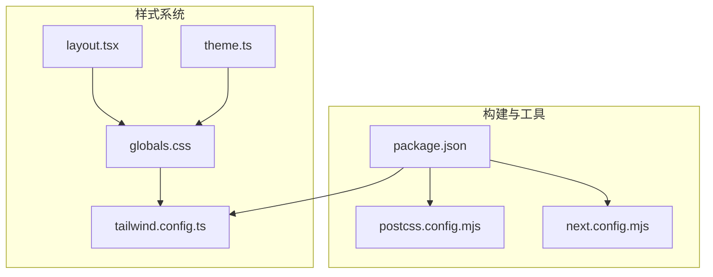
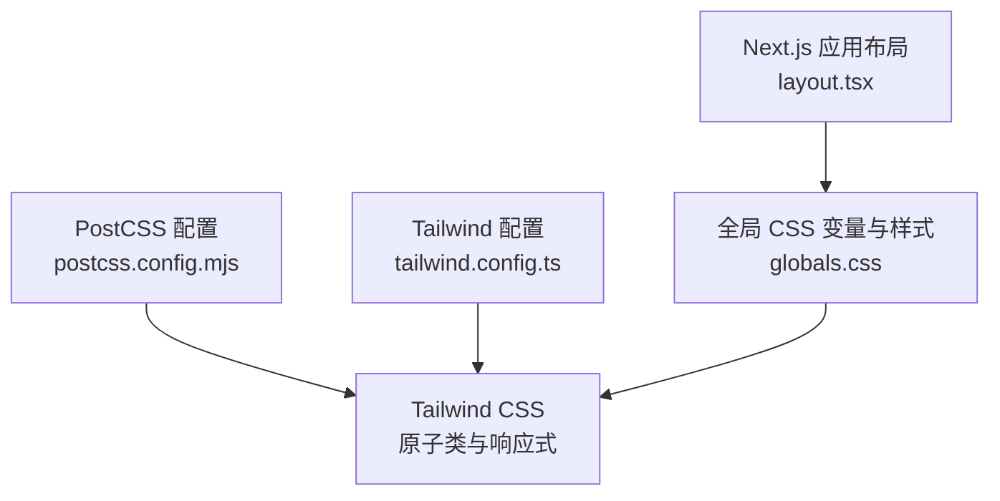
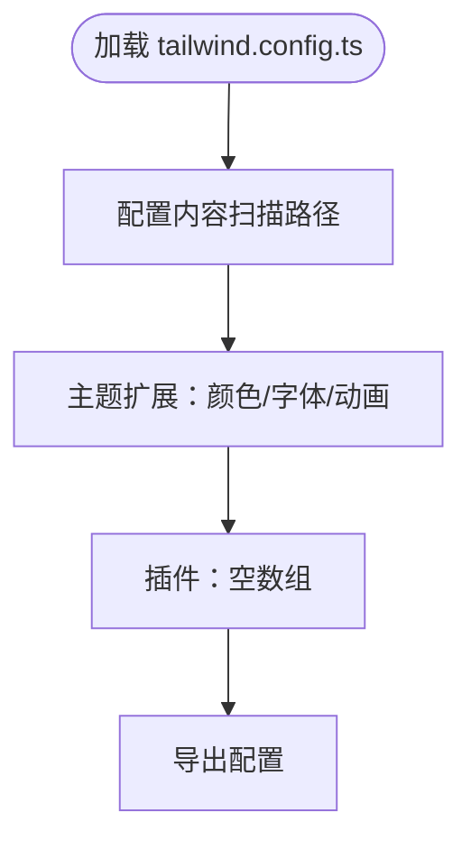
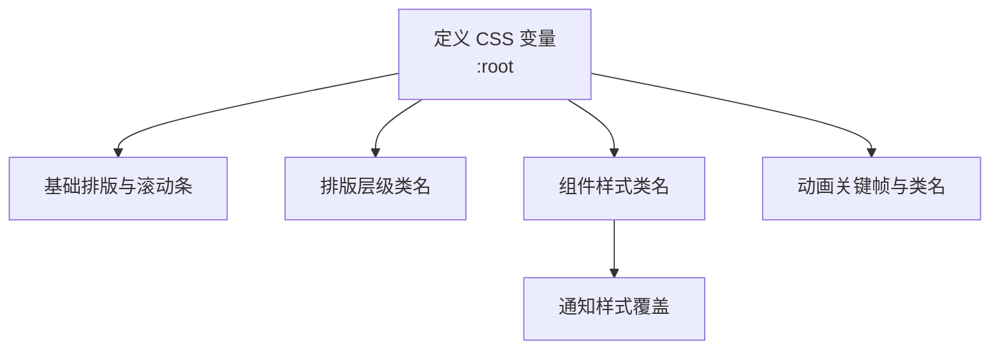
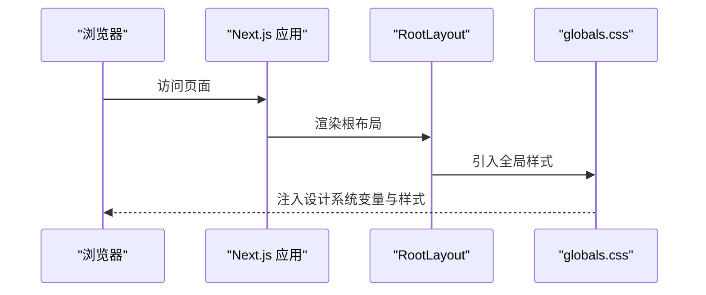
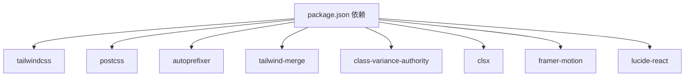

# 样式系统

<cite>
**本文档引用的文件**
- [tailwind.config.ts](file://m_flow-frontend/tailwind.config.ts)
- [postcss.config.mjs](file://m_flow-frontend/postcss.config.mjs)
- [package.json](file://m_flow-frontend/package.json)
- [next.config.mjs](file://m_flow-frontend/next.config.mjs)
- [globals.css](file://m_flow-frontend/src/app/globals.css)
- [layout.tsx](file://m_flow-frontend/src/app/layout.tsx)
- [theme.ts](file://m_flow-frontend/src/lib/utils/theme.ts)
</cite>

## 目录
1. [简介](#简介)
2. [项目结构](#项目结构)
3. [核心组件](#核心组件)
4. [架构总览](#架构总览)
5. [详细组件分析](#详细组件分析)
6. [依赖关系分析](#依赖关系分析)
7. [性能考虑](#性能考虑)
8. [故障排除指南](#故障排除指南)
9. [结论](#结论)
10. [附录](#附录)

## 简介
本文件系统性梳理 m_flow 前端的样式体系，重点覆盖 Tailwind CSS 配置与自定义样式实现、字体系统与颜色方案设计原则、间距规范、样式变量定义与使用、组件样式封装与主题切换机制、响应式设计断点配置、CSS-in-JS 使用场景与替代方案、样式调试与性能优化技巧、以及样式重构与维护最佳实践。目标是帮助开发者在保持高对比度、极简主义视觉风格的同时，高效地扩展与维护样式系统。

## 项目结构
前端样式相关的核心文件分布如下：
- 构建与工具链：PostCSS、Tailwind CSS、Next.js
- 样式入口与全局样式：globals.css
- Tailwind 配置：tailwind.config.ts
- 主题与工具：theme.ts（用于主题切换与变量管理）
- Next.js 应用布局：layout.tsx

图表来源
- [package.json:1-65](file://m_flow-frontend/package.json#L1-L65)
- [postcss.config.mjs:1-10](file://m_flow-frontend/postcss.config.mjs#L1-L10)
- [next.config.mjs:1-29](file://m_flow-frontend/next.config.mjs#L1-L29)
- [globals.css:1-296](file://m_flow-frontend/src/app/globals.css#L1-L296)
- [tailwind.config.ts:1-127](file://m_flow-frontend/tailwind.config.ts#L1-L127)
- [theme.ts](file://m_flow-frontend/src/lib/utils/theme.ts)
- [layout.tsx:1-23](file://m_flow-frontend/src/app/layout.tsx#L1-L23)

章节来源
- [package.json:1-65](file://m_flow-frontend/package.json#L1-L65)
- [postcss.config.mjs:1-10](file://m_flow-frontend/postcss.config.mjs#L1-L10)
- [next.config.mjs:1-29](file://m_flow-frontend/next.config.mjs#L1-L29)
- [globals.css:1-296](file://m_flow-frontend/src/app/globals.css#L1-L296)
- [tailwind.config.ts:1-127](file://m_flow-frontend/tailwind.config.ts#L1-L127)
- [theme.ts](file://m_flow-frontend/src/lib/utils/theme.ts)
- [layout.tsx:1-23](file://m_flow-frontend/src/app/layout.tsx#L1-L23)

## 核心组件
- Tailwind 配置与扩展
  - 内容扫描路径：pages、components、app 目录
  - 主题扩展：颜色、字体族、动画与关键帧
  - 插件：当前为空数组
- PostCSS 配置
  - 启用 tailwindcss 与 autoprefixer 插件
- 全局样式与变量
  - CSS 变量定义：背景、边框、文本、强调色、间距、圆角、过渡时长
  - 字体导入与基础排版
  - 组件化样式：按钮、输入框、卡片、分隔线等
  - 动画与过渡：淡入、滑入、进度条、脉冲等
- 主题工具
  - 提供主题切换与变量管理能力（位于 theme.ts）

章节来源
- [tailwind.config.ts:3-127](file://m_flow-frontend/tailwind.config.ts#L3-L127)
- [postcss.config.mjs:1-10](file://m_flow-frontend/postcss.config.mjs#L1-L10)
- [globals.css:12-55](file://m_flow-frontend/src/app/globals.css#L12-L55)
- [globals.css:96-296](file://m_flow-frontend/src/app/globals.css#L96-L296)
- [theme.ts](file://m_flow-frontend/src/lib/utils/theme.ts)

## 架构总览
样式系统采用“Tailwind 原子类 + 全局 CSS 变量 + 自定义组件样式”的混合架构。Tailwind 负责原子化样式与响应式断点；全局 CSS 提供设计系统变量与组件基线样式；Next.js 在应用根布局中引入全局样式并支持客户端渲染。

图表来源
- [tailwind.config.ts:1-127](file://m_flow-frontend/tailwind.config.ts#L1-L127)
- [postcss.config.mjs:1-10](file://m_flow-frontend/postcss.config.mjs#L1-L10)
- [globals.css:1-296](file://m_flow-frontend/src/app/globals.css#L1-L296)
- [layout.tsx:1-23](file://m_flow-frontend/src/app/layout.tsx#L1-L23)

## 详细组件分析

### Tailwind 配置与扩展
- 内容扫描范围：确保构建时提取到 pages、components、app 下的类名
- 主题扩展
  - 颜色：定义 x.ai 高端灰系列与对 Tailwind 颜色的去饱和覆盖
  - 字体：sans 与 mono 字体族，优先级从系统字体到备用字体
  - 动画与关键帧：淡入、滑入、慢速脉冲等
- 插件：当前未启用插件

图表来源
- [tailwind.config.ts:3-127](file://m_flow-frontend/tailwind.config.ts#L3-L127)

章节来源
- [tailwind.config.ts:3-127](file://m_flow-frontend/tailwind.config.ts#L3-L127)

### PostCSS 配置
- 启用 tailwindcss 与 autoprefixer 插件，确保生成兼容性前缀与按需输出样式

章节来源
- [postcss.config.mjs:1-10](file://m_flow-frontend/postcss.config.mjs#L1-L10)

### 全局样式与设计系统变量
- CSS 变量：背景层级、边框透明度、文本层级、强调色、间距、圆角、过渡时长
- 字体：通过 Google Fonts 引入 Inter、Cinzel、Outfit，并在基础排版中设置字号、行高、字距
- 组件样式：按钮、输入框、卡片、分隔线等，统一使用变量驱动
- 动画：淡入、滑入、进度条、脉冲等关键帧与类名
- 通知覆盖：为第三方 toast 组件覆盖样式以匹配设计系统

图表来源
- [globals.css:12-55](file://m_flow-frontend/src/app/globals.css#L12-L55)
- [globals.css:96-296](file://m_flow-frontend/src/app/globals.css#L96-L296)

章节来源
- [globals.css:1-296](file://m_flow-frontend/src/app/globals.css#L1-L296)

### 主题切换机制与变量管理
- 主题工具：提供主题切换与变量管理能力，便于在运行时调整设计系统变量
- 建议实践：将主题状态持久化至本地存储或用户偏好，结合 CSS 变量动态更新

章节来源
- [theme.ts](file://m_flow-frontend/src/lib/utils/theme.ts)

### Next.js 布局与样式注入
- 应用根布局引入全局样式并包裹客户端组件，避免水合不一致问题
- 开发代理：将 /api/* 请求转发至后端服务，便于联调

图表来源
- [layout.tsx:1-23](file://m_flow-frontend/src/app/layout.tsx#L1-L23)
- [globals.css:1-296](file://m_flow-frontend/src/app/globals.css#L1-L296)
- [next.config.mjs:16-25](file://m_flow-frontend/next.config.mjs#L16-L25)

章节来源
- [layout.tsx:1-23](file://m_flow-frontend/src/app/layout.tsx#L1-L23)
- [next.config.mjs:16-25](file://m_flow-frontend/next.config.mjs#L16-L25)

## 依赖关系分析
- 构建依赖：Tailwind CSS、Autoprefixer、PostCSS
- 运行时依赖：clsx、class-variance-authority、tailwind-merge 等用于类名合并与条件样式
- 动画与交互：framer-motion、lucide-react、@radix-ui/* 等组件库

图表来源
- [package.json:16-63](file://m_flow-frontend/package.json#L16-L63)

章节来源
- [package.json:16-63](file://m_flow-frontend/package.json#L16-L63)

## 性能考虑
- 按需生成：Tailwind 内容扫描仅在指定目录中提取类名，减少无用样式
- 变量驱动：统一使用 CSS 变量，降低重复定义与维护成本
- 类名合并：使用 tailwind-merge 与 class-variance-authority 避免冲突与冗余
- 动画优化：合理使用关键帧与过渡时长，避免过度动画影响性能
- 字体加载：通过 Google Fonts 引入必要字体，控制字体数量与权重

## 故障排除指南
- 样式未生效
  - 检查 tailwind.config.ts 的 content 路径是否包含当前组件目录
  - 确认 globals.css 已在根布局中正确引入
- 动画异常
  - 核对关键帧名称与类名是否一致
  - 检查动画时长与缓动函数是否合理
- 字体显示问题
  - 确认 Google Fonts 链接可用且网络可访问
  - 检查本地字体回退链顺序
- 主题切换无效
  - 确认主题工具已正确读取与写入主题状态
  - 检查 CSS 变量是否被覆盖或作用域错误

## 结论
该样式系统以 Tailwind 原子类为核心，结合全局 CSS 变量与组件化样式，形成高对比度、极简主义的设计语言。通过明确的内容扫描范围、变量化的颜色与间距体系、以及主题切换机制，既保证了开发效率，也便于长期维护。建议在后续迭代中持续完善主题工具、优化动画与交互体验，并加强样式冲突治理与命名约定。

## 附录

### 设计原则与规范
- 颜色方案：以 x.ai 高端灰为主，辅以去饱和的语义色（成功、错误、警告），确保高对比度与可读性
- 字体系统：sans 用于正文与界面，mono 用于代码与等宽场景；优先系统字体，保障跨平台一致性
- 间距规范：基于 4px 基础单位的递增体系，统一卡片、按钮、表单控件的留白
- 圆角与边框：最小圆角与半透明边框，营造简洁而有层次的视觉效果
- 动画策略：轻量过渡与微动效，避免干扰用户注意力

### 响应式设计与断点
- 断点配置：由 Tailwind 默认断点驱动，结合业务场景在组件层使用响应式修饰符
- 实践建议：优先使用语义化断点（sm/md/lg/xl/2xl），避免硬编码像素值

### CSS-in-JS 使用场景与替代方案
- 使用场景：动态主题、条件样式、组件内部状态驱动的样式变化
- 替代方案：Tailwind 原子类 + CSS 变量；通过 class-variance-authority 与 clsx 组合实现条件类名
- 建议：优先选择原生 CSS 与原子类，减少运行时开销

### 样式调试与性能优化技巧
- 调试：利用浏览器开发者工具检查元素类名与计算样式；确认 CSS 变量作用域
- 性能：合并类名、避免深层嵌套、减少关键路径样式体积
- 可维护性：统一命名约定、集中管理变量、模块化组件样式

### 样式重构与维护最佳实践
- 规范命名：采用 BEM 或功能导向命名，避免过深的层级
- 变量集中：将颜色、间距、字体等抽象为设计令牌，统一管理
- 组件封装：将通用样式抽取为可复用组件，减少重复定义
- 冲突解决：使用 tailwind-merge 与 class-variance-authority，明确优先级与覆盖规则