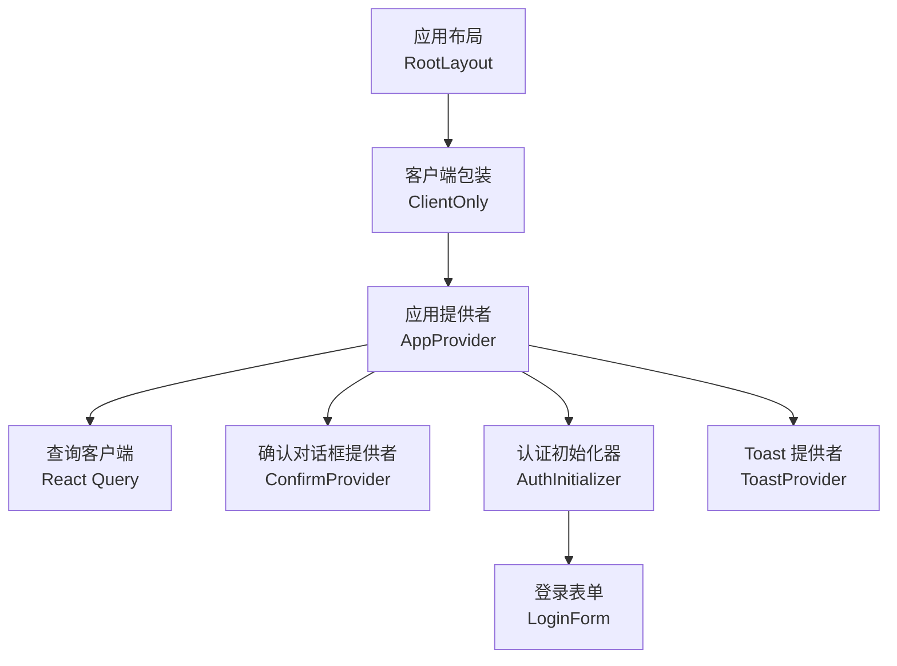
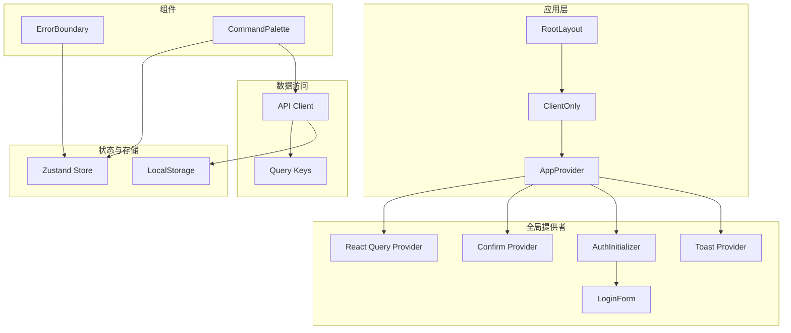
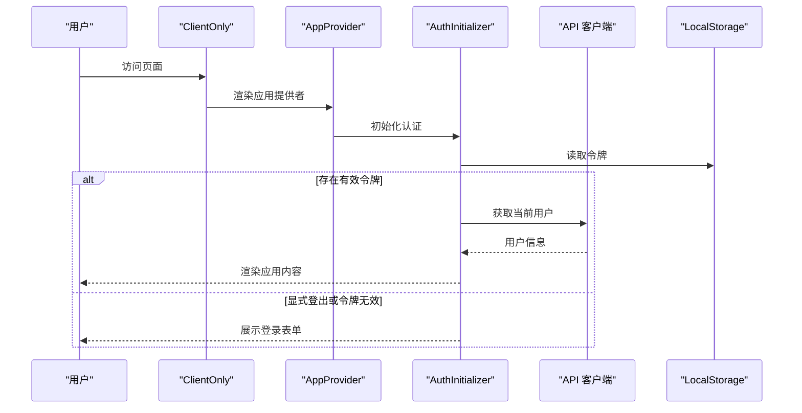
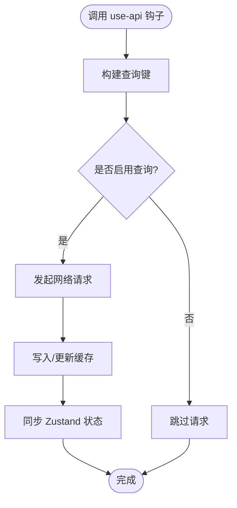
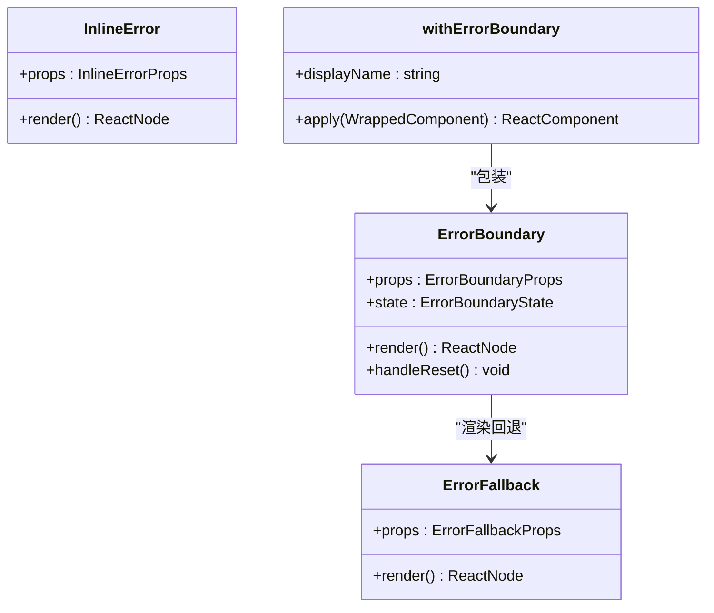
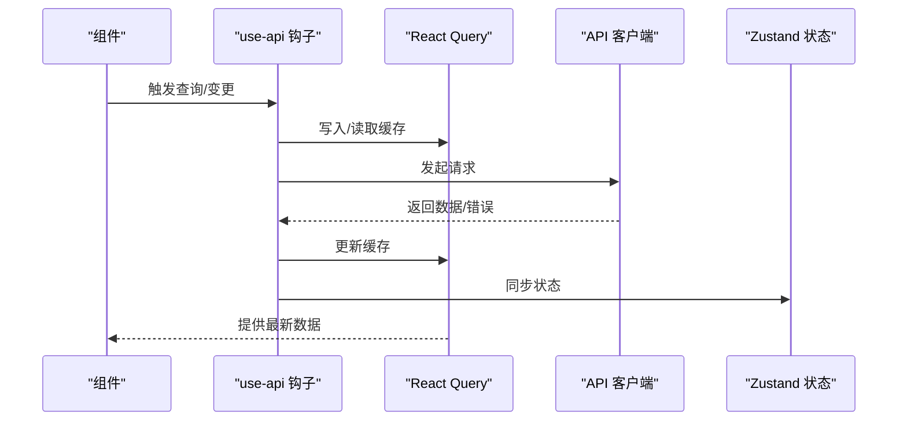
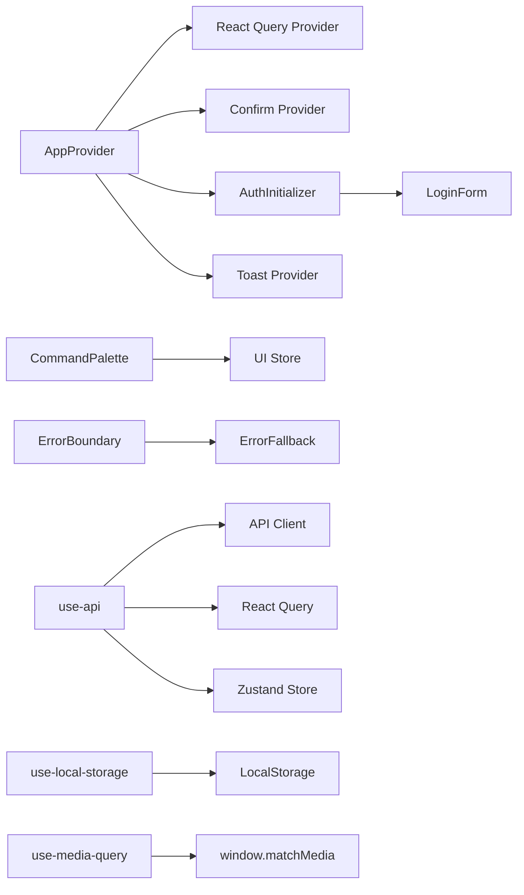

# 组件模式

<cite>
**本文引用的文件**
- [m_flow-frontend/src/app/layout.tsx](file://m_flow-frontend/src/app/layout.tsx)
- [m_flow-frontend/src/components/providers/ClientOnly.tsx](file://m_flow-frontend/src/components/providers/ClientOnly.tsx)
- [m_flow-frontend/src/components/providers/AppProvider.tsx](file://m_flow-frontend/src/components/providers/AppProvider.tsx)
- [m_flow-frontend/src/components/common/ErrorBoundary.tsx](file://m_flow-frontend/src/components/common/ErrorBoundary.tsx)
- [m_flow-frontend/src/components/common/CommandPalette.tsx](file://m_flow-frontend/src/components/common/CommandPalette.tsx)
- [m_flow-frontend/src/hooks/index.ts](file://m_flow-frontend/src/hooks/index.ts)
- [m_flow-frontend/src/hooks/use-api.ts](file://m_flow-frontend/src/hooks/use-api.ts)
- [m_flow-frontend/src/hooks/use-local-storage.ts](file://m_flow-frontend/src/hooks/use-local-storage.ts)
- [m_flow-frontend/src/hooks/use-media-query.ts](file://m_flow-frontend/src/hooks/use-media-query.ts)
- [m_flow-frontend/src/lib/store/index.ts](file://m_flow-frontend/src/lib/store/index.ts)
- [m_flow-frontend/src/lib/api/client.ts](file://m_flow-frontend/src/lib/api/client.ts)
</cite>

## 目录
1. [引言](#引言)
2. [项目结构](#项目结构)
3. [核心组件](#核心组件)
4. [架构总览](#架构总览)
5. [详细组件分析](#详细组件分析)
6. [依赖关系分析](#依赖关系分析)
7. [性能考量](#性能考量)
8. [故障排查指南](#故障排查指南)
9. [结论](#结论)
10. [附录](#附录)

## 引言
本文件系统性梳理前端组件模式与状态管理架构，围绕 Provider 模式、Hook 模式、组件组合与高阶组件、组件通信与数据流、组件复用与抽象、生命周期与性能优化、测试策略以及演进与重构指导进行深入阐述，并提供可操作的示例与最佳实践。

## 项目结构
前端位于 m_flow-frontend，采用 Next.js 应用结构，核心由以下层次构成：
- 应用布局与入口：根布局负责包裹客户端内容与全局 Provider。
- 提供者层（Provider）：统一初始化认证、查询缓存、确认对话框等全局能力。
- 组件层：通用组件（如错误边界、命令面板）、页面级组件与业务功能组件。
- 钩子层（Hooks）：封装网络请求、本地存储、媒体查询等横切关注点。
- 状态与存储：Zustand 状态管理与 React Query 缓存。
- API 客户端：统一的后端接口封装与错误处理。

图表来源
- [m_flow-frontend/src/app/layout.tsx:10-22](file://m_flow-frontend/src/app/layout.tsx#L10-L22)
- [m_flow-frontend/src/components/providers/ClientOnly.tsx:7-29](file://m_flow-frontend/src/components/providers/ClientOnly.tsx#L7-L29)
- [m_flow-frontend/src/components/providers/AppProvider.tsx:113-134](file://m_flow-frontend/src/components/providers/AppProvider.tsx#L113-L134)

章节来源
- [m_flow-frontend/src/app/layout.tsx:1-23](file://m_flow-frontend/src/app/layout.tsx#L1-L23)
- [m_flow-frontend/src/components/providers/ClientOnly.tsx:1-31](file://m_flow-frontend/src/components/providers/ClientOnly.tsx#L1-L31)
- [m_flow-frontend/src/components/providers/AppProvider.tsx:1-135](file://m_flow-frontend/src/components/providers/AppProvider.tsx#L1-L135)

## 核心组件
- Provider 模式：通过 AppProvider 统一注入 React Query、确认对话框、认证初始化器等；ClientOnly 负责服务端渲染安全与挂载时机控制。
- Hook 模式：use-api.ts 封装大量查询与变更钩子；use-local-storage.ts 提供类型安全的本地持久化；use-media-query.ts 提供响应式断点与设备信息。
- 错误边界：ErrorBoundary 类组件提供优雅降级与错误回退 UI。
- 命令面板：CommandPalette 提供全局快捷导航与动作执行。
- 存储与配置：store/index.ts 导出多类状态存储；api/client.ts 提供统一 API 客户端与错误模型。

章节来源
- [m_flow-frontend/src/components/providers/AppProvider.tsx:113-134](file://m_flow-frontend/src/components/providers/AppProvider.tsx#L113-L134)
- [m_flow-frontend/src/components/providers/ClientOnly.tsx:7-29](file://m_flow-frontend/src/components/providers/ClientOnly.tsx#L7-L29)
- [m_flow-frontend/src/hooks/use-api.ts:1-900](file://m_flow-frontend/src/hooks/use-api.ts#L1-L900)
- [m_flow-frontend/src/hooks/use-local-storage.ts:1-358](file://m_flow-frontend/src/hooks/use-local-storage.ts#L1-L358)
- [m_flow-frontend/src/hooks/use-media-query.ts:1-394](file://m_flow-frontend/src/hooks/use-media-query.ts#L1-L394)
- [m_flow-frontend/src/components/common/ErrorBoundary.tsx:1-344](file://m_flow-frontend/src/components/common/ErrorBoundary.tsx#L1-L344)
- [m_flow-frontend/src/components/common/CommandPalette.tsx:1-452](file://m_flow-frontend/src/components/common/CommandPalette.tsx#L1-L452)
- [m_flow-frontend/src/lib/store/index.ts:1-10](file://m_flow-frontend/src/lib/store/index.ts#L1-L10)
- [m_flow-frontend/src/lib/api/client.ts:1-800](file://m_flow-frontend/src/lib/api/client.ts#L1-L800)

## 架构总览
整体采用“布局 → 客户端包装 → 应用提供者”的三层结构，应用提供者内部再组织查询缓存、认证初始化、UI 提示等子提供者。组件通过 React Query 进行数据获取与缓存，通过 Zustand 管理轻量 UI 状态，通过自定义 Hook 抽象交互逻辑。

图表来源
- [m_flow-frontend/src/app/layout.tsx:10-22](file://m_flow-frontend/src/app/layout.tsx#L10-L22)
- [m_flow-frontend/src/components/providers/ClientOnly.tsx:7-29](file://m_flow-frontend/src/components/providers/ClientOnly.tsx#L7-L29)
- [m_flow-frontend/src/components/providers/AppProvider.tsx:113-134](file://m_flow-frontend/src/components/providers/AppProvider.tsx#L113-L134)
- [m_flow-frontend/src/components/common/ErrorBoundary.tsx:241-307](file://m_flow-frontend/src/components/common/ErrorBoundary.tsx#L241-L307)
- [m_flow-frontend/src/components/common/CommandPalette.tsx:243-418](file://m_flow-frontend/src/components/common/CommandPalette.tsx#L243-L418)
- [m_flow-frontend/src/hooks/use-api.ts:27-52](file://m_flow-frontend/src/hooks/use-api.ts#L27-L52)
- [m_flow-frontend/src/lib/api/client.ts:139-213](file://m_flow-frontend/src/lib/api/client.ts#L139-L213)

## 详细组件分析

### Provider 模式与状态管理架构
- ClientOnly：在服务端渲染阶段返回占位，确保客户端挂载后再渲染真实内容，避免水合不一致。
- AppProvider：集中初始化 React Query、确认对话框、认证初始化器；AuthInitializer 负责令牌校验、自动登录与登录表单展示。
- 查询客户端：默认配置包括过期时间、窗口焦点重取策略与重试次数，平衡实时性与性能。
- 认证流程：支持显式登出标记、默认用户自动登录、401 自动清理与跳转。

图表来源
- [m_flow-frontend/src/components/providers/ClientOnly.tsx:7-29](file://m_flow-frontend/src/components/providers/ClientOnly.tsx#L7-L29)
- [m_flow-frontend/src/components/providers/AppProvider.tsx:13-111](file://m_flow-frontend/src/components/providers/AppProvider.tsx#L13-L111)
- [m_flow-frontend/src/lib/api/client.ts:139-213](file://m_flow-frontend/src/lib/api/client.ts#L139-L213)

章节来源
- [m_flow-frontend/src/components/providers/ClientOnly.tsx:1-31](file://m_flow-frontend/src/components/providers/ClientOnly.tsx#L1-L31)
- [m_flow-frontend/src/components/providers/AppProvider.tsx:1-135](file://m_flow-frontend/src/components/providers/AppProvider.tsx#L1-L135)

### Hook 模式与自定义 Hook 设计原则
- use-api.ts：以“查询键 + 钩子”形式封装各类数据获取与变更操作，统一缓存隔离、失效策略与错误处理；支持查询选项（刷新间隔、启用开关、过期时间）与变更成功回调同步 Zustand 状态。
- use-local-storage.ts：提供类型安全的本地存储钩子，支持序列化/反序列化、跨标签页同步、默认值与错误处理；提供布尔/数字/字符串/数组/Set 等专用变体。
- use-media-query.ts：提供断点检测、窗口尺寸、设备信息与响应式值选择，兼顾 SSR 兼容与性能（防抖）。

图表来源
- [m_flow-frontend/src/hooks/use-api.ts:27-52](file://m_flow-frontend/src/hooks/use-api.ts#L27-L52)
- [m_flow-frontend/src/hooks/use-api.ts:146-162](file://m_flow-frontend/src/hooks/use-api.ts#L146-L162)

章节来源
- [m_flow-frontend/src/hooks/index.ts:1-10](file://m_flow-frontend/src/hooks/index.ts#L1-L10)
- [m_flow-frontend/src/hooks/use-api.ts:1-900](file://m_flow-frontend/src/hooks/use-api.ts#L1-L900)
- [m_flow-frontend/src/hooks/use-local-storage.ts:1-358](file://m_flow-frontend/src/hooks/use-local-storage.ts#L1-L358)
- [m_flow-frontend/src/hooks/use-media-query.ts:1-394](file://m_flow-frontend/src/hooks/use-media-query.ts#L1-L394)

### 组件组合模式与高阶组件
- 组合优先：通过 Provider 层组合多个上下文（查询、确认、认证、提示），减少重复包裹。
- 高阶组件：提供 withErrorBoundary，用于为任意组件添加错误边界能力，保留显示名称便于调试。
- 命令面板：CommandPalette 使用 createPortal 将弹层挂载到 body，避免层级与样式干扰，同时通过键盘快捷键与模糊搜索提升可用性。

图表来源
- [m_flow-frontend/src/components/common/ErrorBoundary.tsx:241-307](file://m_flow-frontend/src/components/common/ErrorBoundary.tsx#L241-L307)
- [m_flow-frontend/src/components/common/ErrorBoundary.tsx:314-330](file://m_flow-frontend/src/components/common/ErrorBoundary.tsx#L314-L330)

章节来源
- [m_flow-frontend/src/components/common/ErrorBoundary.tsx:1-344](file://m_flow-frontend/src/components/common/ErrorBoundary.tsx#L1-L344)
- [m_flow-frontend/src/components/common/CommandPalette.tsx:1-452](file://m_flow-frontend/src/components/common/CommandPalette.tsx#L1-L452)

### 组件间通信与数据流设计
- 查询驱动：所有数据获取通过 React Query 钩子完成，查询键保证缓存隔离与失效一致性。
- 状态同步：变更成功回调中同步更新 React Query 缓存与 Zustand 状态，确保 UI 一致性。
- 事件与通知：Toast 提供者在应用提供者内统一注入，用于全局提示。
- 错误传播：API 客户端统一抛出 ServiceFault，错误边界捕获并提供可恢复的回退 UI。

图表来源
- [m_flow-frontend/src/hooks/use-api.ts:178-220](file://m_flow-frontend/src/hooks/use-api.ts#L178-L220)
- [m_flow-frontend/src/lib/api/client.ts:139-213](file://m_flow-frontend/src/lib/api/client.ts#L139-L213)
- [m_flow-frontend/src/components/providers/AppProvider.tsx:127-132](file://m_flow-frontend/src/components/providers/AppProvider.tsx#L127-L132)

章节来源
- [m_flow-frontend/src/hooks/use-api.ts:1-900](file://m_flow-frontend/src/hooks/use-api.ts#L1-L900)
- [m_flow-frontend/src/lib/api/client.ts:1-800](file://m_flow-frontend/src/lib/api/client.ts#L1-L800)
- [m_flow-frontend/src/lib/store/index.ts:1-10](file://m_flow-frontend/src/lib/store/index.ts#L1-L10)

### 组件复用与抽象
- API 客户端抽象：MflowApiClient 统一封装请求、鉴权头、错误解析与 401 处理，避免各处重复逻辑。
- Hook 抽象：use-api.ts 将常见 CRUD 与业务操作封装为独立钩子，统一查询键命名与缓存策略。
- 本地存储抽象：use-local-storage.ts 提供类型安全与默认值，支持多种数据结构与工具函数。
- 响应式抽象：use-media-query.ts 提供断点、窗口尺寸与偏好检测，简化响应式开发。

章节来源
- [m_flow-frontend/src/lib/api/client.ts:139-213](file://m_flow-frontend/src/lib/api/client.ts#L139-L213)
- [m_flow-frontend/src/hooks/use-api.ts:27-52](file://m_flow-frontend/src/hooks/use-api.ts#L27-L52)
- [m_flow-frontend/src/hooks/use-local-storage.ts:120-190](file://m_flow-frontend/src/hooks/use-local-storage.ts#L120-L190)
- [m_flow-frontend/src/hooks/use-media-query.ts:63-95](file://m_flow-frontend/src/hooks/use-media-query.ts#L63-L95)

### 生命周期管理与性能优化
- 挂载时机：ClientOnly 在 useEffect 后才渲染真实内容，避免 SSR 与 CSR 差异导致的闪烁。
- 查询缓存：合理设置 staleTime、refetchOnWindowFocus 与 retry，平衡新鲜度与网络开销。
- 本地存储：跨标签页同步与序列化/反序列化，避免异常导致的崩溃。
- 响应式：窗口尺寸监听使用防抖，断点检测基于媒体查询，降低频繁重排风险。
- 错误边界：非关键功能（如活动流）在错误时返回空数组，避免阻塞主流程。

章节来源
- [m_flow-frontend/src/components/providers/ClientOnly.tsx:7-29](file://m_flow-frontend/src/components/providers/ClientOnly.tsx#L7-L29)
- [m_flow-frontend/src/components/providers/AppProvider.tsx:114-125](file://m_flow-frontend/src/components/providers/AppProvider.tsx#L114-L125)
- [m_flow-frontend/src/hooks/use-local-storage.ts:163-182](file://m_flow-frontend/src/hooks/use-local-storage.ts#L163-L182)
- [m_flow-frontend/src/hooks/use-media-query.ts:299-321](file://m_flow-frontend/src/hooks/use-media-query.ts#L299-L321)
- [m_flow-frontend/src/hooks/use-api.ts:517-533](file://m_flow-frontend/src/hooks/use-api.ts#L517-L533)

### 测试模式与方法
- 单元测试：Vitest 配置与 Playwright 端到端测试脚本已就绪，建议对关键 Hook 与组件进行快照与行为测试。
- 钩子测试：针对 use-api.ts 的查询键生成、use-local-storage.ts 的序列化/反序列化与 use-media-query.ts 的断点检测编写测试。
- 组件测试：对 CommandPalette 的键盘导航、过滤与 Portal 渲染进行模拟与断言。
- 状态测试：对 ErrorBoundary 的错误捕获与回退 UI 进行覆盖。

章节来源
- [m_flow-frontend/package.json:5-15](file://m_flow-frontend/package.json#L5-L15)

### 组件演进与重构指导
- 保持单一职责：Provider 负责初始化与上下文注入，Hook 负责数据与交互抽象，组件负责视图与组合。
- 渐进增强：新增功能优先通过 Hook 抽象，再在组件中组合使用，避免直接耦合。
- 可观测性：为关键 Hook 添加日志与指标，便于追踪性能与错误。
- 文档与示例：为每个 Hook 与组件提供使用说明与最小可运行示例路径，降低上手成本。

## 依赖关系分析
- Provider 依赖：AppProvider 依赖 React Query、确认对话框、认证初始化器与 Toast 提供者。
- 组件依赖：CommandPalette 依赖 UI 状态存储与图标库；ErrorBoundary 依赖错误回退 UI。
- 钩子依赖：use-api.ts 依赖 apiClient、React Query 与 Zustand；use-local-storage.ts 依赖浏览器环境；use-media-query.ts 依赖 window/mediaQuery。
- 存储与配置：store/index.ts 导出多类状态存储，供组件与钩子使用。

图表来源
- [m_flow-frontend/src/components/providers/AppProvider.tsx:113-134](file://m_flow-frontend/src/components/providers/AppProvider.tsx#L113-L134)
- [m_flow-frontend/src/components/common/CommandPalette.tsx:58-161](file://m_flow-frontend/src/components/common/CommandPalette.tsx#L58-L161)
- [m_flow-frontend/src/components/common/ErrorBoundary.tsx:241-307](file://m_flow-frontend/src/components/common/ErrorBoundary.tsx#L241-L307)
- [m_flow-frontend/src/hooks/use-api.ts:3-7](file://m_flow-frontend/src/hooks/use-api.ts#L3-L7)
- [m_flow-frontend/src/hooks/use-local-storage.ts:20-21](file://m_flow-frontend/src/hooks/use-local-storage.ts#L20-L21)
- [m_flow-frontend/src/hooks/use-media-query.ts:20-21](file://m_flow-frontend/src/hooks/use-media-query.ts#L20-L21)

章节来源
- [m_flow-frontend/src/lib/store/index.ts:1-10](file://m_flow-frontend/src/lib/store/index.ts#L1-L10)
- [m_flow-frontend/src/lib/api/client.ts:1-800](file://m_flow-frontend/src/lib/api/client.ts#L1-L800)

## 性能考量
- 查询缓存：合理设置 staleTime 与 refetchOnWindowFocus，避免过度请求；对高频更新的数据使用较短 staleTime。
- 本地存储：序列化/反序列化失败时降级为默认值，避免影响主线程；跨标签页同步仅在需要时开启。
- 响应式：窗口尺寸监听使用防抖，断点检测基于媒体查询，减少重绘与重排。
- 错误边界：非关键功能在错误时返回空结果，避免阻塞主流程与渲染。

## 故障排查指南
- 认证问题：检查 LocalStorage 中的令牌是否存在与是否过期；401 时客户端会清除令牌并触发认证初始化器重新登录。
- 查询异常：查看 React Query 缓存状态与错误信息；确认查询键是否正确隔离多数据集场景。
- 本地存储异常：确认浏览器支持与权限；检查序列化/反序列化函数与错误回调。
- 响应式异常：确认 SSR 环境下的默认值；检查媒体查询语法与断点常量。

章节来源
- [m_flow-frontend/src/lib/api/client.ts:178-203](file://m_flow-frontend/src/lib/api/client.ts#L178-L203)
- [m_flow-frontend/src/hooks/use-local-storage.ts:61-76](file://m_flow-frontend/src/hooks/use-local-storage.ts#L61-L76)
- [m_flow-frontend/src/hooks/use-media-query.ts:65-68](file://m_flow-frontend/src/hooks/use-media-query.ts#L65-L68)

## 结论
该前端架构通过 Provider 模式统一初始化与上下文注入，结合 React Query 与 Zustand 实现高效的状态与数据管理；自定义 Hook 将横切关注点抽象为可复用能力；组件通过组合与错误边界实现稳健的用户体验。遵循本文的设计原则与最佳实践，可在保证性能与可维护性的前提下快速迭代与扩展。

## 附录
- 示例与文档编写规范
  - 为每个 Hook 提供使用说明与最小可运行示例路径，避免直接粘贴代码片段。
  - 组件文档包含属性说明、使用场景、注意事项与常见问题。
  - 对关键流程绘制序列图或流程图，帮助理解数据流与控制流。
- 测试清单
  - 单元测试：覆盖 Hook 的查询键、状态同步与错误处理。
  - 组件测试：覆盖键盘交互、Portal 渲染与状态切换。
  - 端到端测试：覆盖登录、数据检索与导出等关键路径。