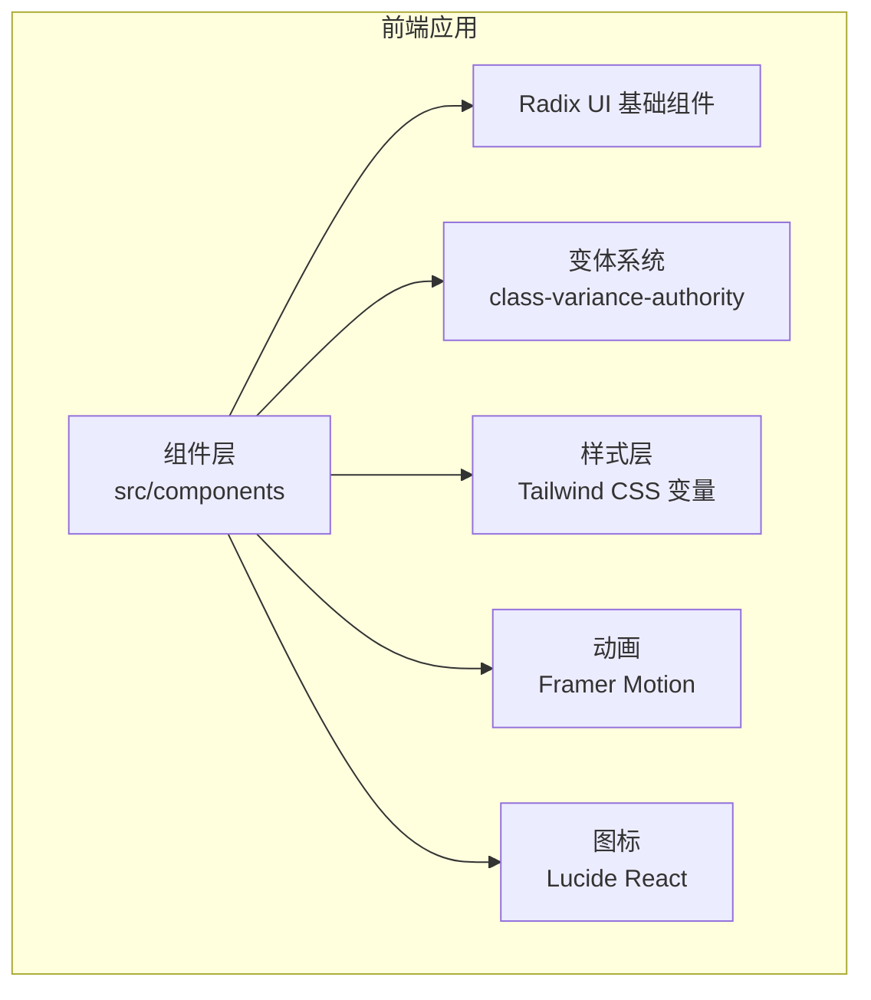
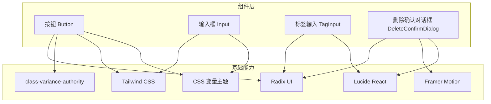
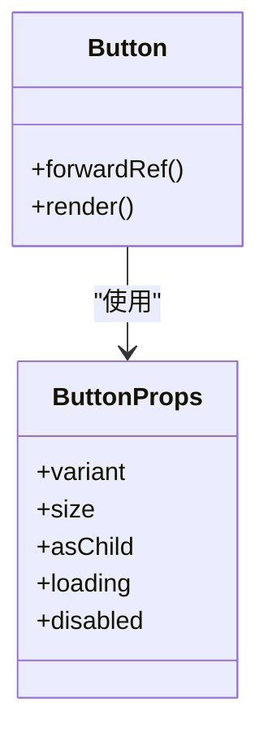
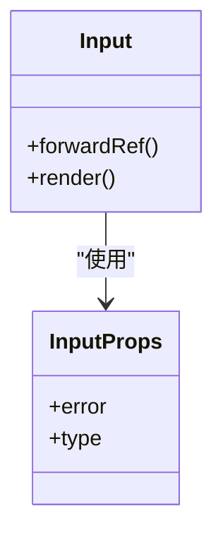
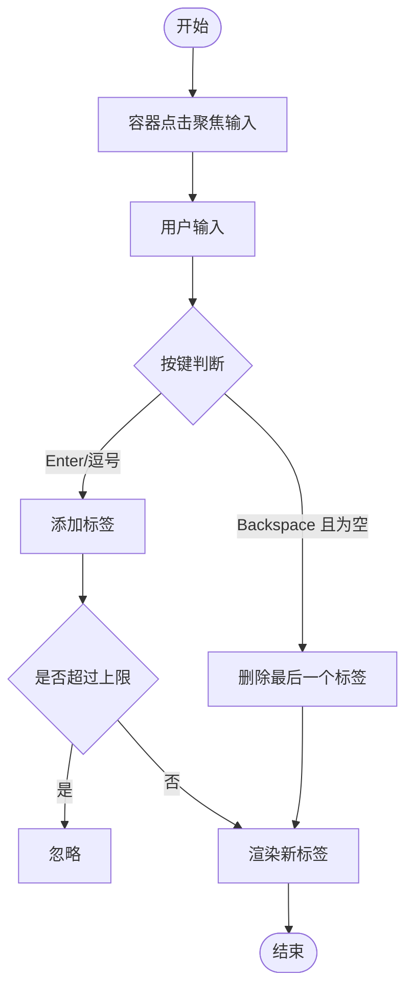
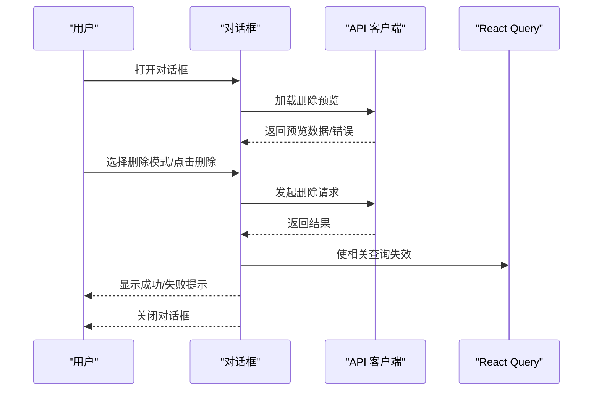
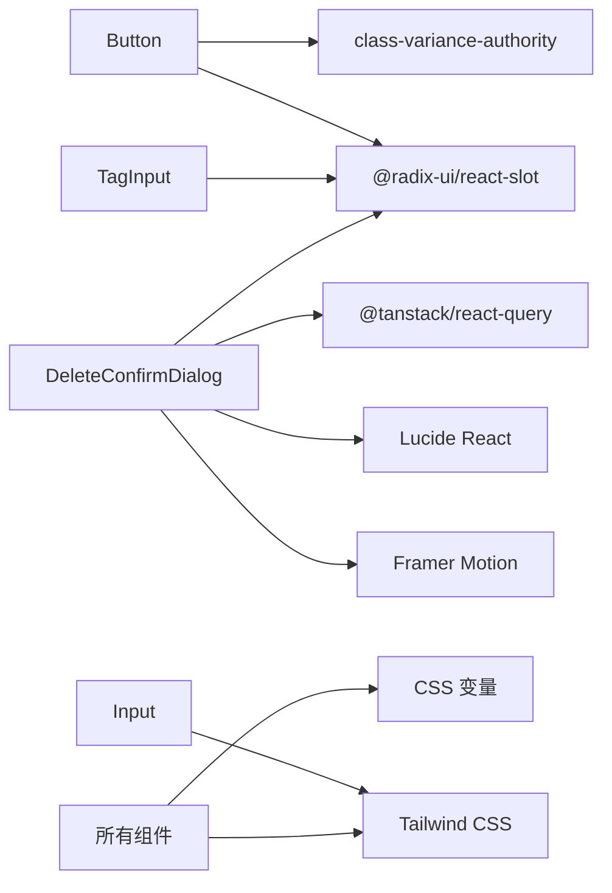

# 组件设计系统

<cite>
**本文引用的文件**
- [package.json](file://m_flow-frontend/package.json)
- [tailwind.config.ts](file://m_flow-frontend/tailwind.config.ts)
- [button.tsx](file://m_flow-frontend/src/components/ui/button.tsx)
- [input.tsx](file://m_flow-frontend/src/components/ui/input.tsx)
- [TagInput.tsx](file://m_flow-frontend/src/components/common/TagInput.tsx)
- [DeleteConfirmDialog.tsx](file://m_flow-frontend/src/components/graph/DeleteConfirmDialog.tsx)
</cite>

## 目录
1. [简介](#简介)
2. [项目结构](#项目结构)
3. [核心组件](#核心组件)
4. [架构总览](#架构总览)
5. [详细组件分析](#详细组件分析)
6. [依赖分析](#依赖分析)
7. [性能考虑](#性能考虑)
8. [故障排查指南](#故障排查指南)
9. [结论](#结论)
10. [附录](#附录)

## 简介
本文件系统化梳理了基于 Radix UI 与自定义组件的前端组件设计系统，覆盖基础组件（按钮、输入框、选择器、开关等）与复合组件（标签页、对话框、下拉菜单、滑块等），并深入说明组件的变体系统（尺寸、颜色、状态）、可访问性实现（键盘导航、屏幕阅读器支持、ARIA 属性）、样式系统（Tailwind CSS 变量与自定义样式）、组件复用最佳实践以及 TypeScript 类型定义与 Props 接口设计。

## 项目结构
前端位于 m_flow-frontend 目录，采用 Next.js 应用结构，组件主要分布在 src/components 下，样式通过 Tailwind CSS 配置与 CSS 变量实现主题化。Radix UI 提供语义化与无障碍的基础交互能力，配合 class-variance-authority 实现变体系统，使用 Framer Motion 进行轻量动画，使用 Lucide React 提供图标。

图表来源
- [package.json:16-42](file://m_flow-frontend/package.json#L16-L42)
- [tailwind.config.ts:1-127](file://m_flow-frontend/tailwind.config.ts#L1-L127)

章节来源
- [package.json:1-65](file://m_flow-frontend/package.json#L1-L65)
- [tailwind.config.ts:1-127](file://m_flow-frontend/tailwind.config.ts#L1-L127)

## 核心组件
本节聚焦基础组件与复合组件的类型定义、变体系统与可访问性要点。

- 按钮组件
  - 类型与变体：通过 VariantProps 定义 variant 与 size 变体；支持 asChild 透传为非按钮元素；支持 loading 状态禁用交互并显示加载图标。
  - 可访问性：继承原生 button 的键盘行为与焦点可见性；禁用态遵循平台默认可访问性。
  - 样式：使用 CSS 变量与 Tailwind 类组合，确保主题一致性。

- 输入框组件
  - 类型与错误态：支持 error 字段以动态切换边框与焦点环颜色，实现错误反馈。
  - 可访问性：原生 input 行为，保持默认键盘交互与屏幕阅读器识别。
  - 样式：统一圆角、内边距与文本颜色，聚焦态带强调色环。

- 标签输入组件
  - 功能：支持多标签增删、回车/逗号分隔、退格删除最后一个标签、最大数量限制。
  - 变体：提供紧凑版与完整版，满足不同布局需求。
  - 可访问性：容器可点击聚焦输入；按钮移除标签时阻止事件冒泡，避免干扰容器交互。

- 删除确认对话框（复合组件）
  - 功能：支持软/硬删除模式切换（仅对特定节点类型），异步加载删除预览，失败/成功提示，Esc 关闭。
  - 可访问性：模态遮罩、焦点管理、键盘关闭、禁用态按钮。
  - 动画：使用 Framer Motion 实现淡入淡出与缩放入场。

章节来源
- [button.tsx:1-67](file://m_flow-frontend/src/components/ui/button.tsx#L1-L67)
- [input.tsx:1-40](file://m_flow-frontend/src/components/ui/input.tsx#L1-L40)
- [TagInput.tsx:1-189](file://m_flow-frontend/src/components/common/TagInput.tsx#L1-L189)
- [DeleteConfirmDialog.tsx:1-296](file://m_flow-frontend/src/components/graph/DeleteConfirmDialog.tsx#L1-L296)

## 架构总览
组件设计系统围绕以下原则构建：
- 语义化与无障碍：以 Radix UI 为基础，确保键盘可达与屏幕阅读器友好。
- 主题化与一致性：通过 Tailwind CSS 变量与自定义颜色体系，统一视觉语言。
- 变体系统：使用 class-variance-authority 将尺寸、外观、状态映射为类名组合。
- 动画与反馈：在关键交互中引入轻量动画与状态反馈，提升可用性。
- 复用与扩展：通过 asChild、透传属性与组合模式，最大化组件复用。

图表来源
- [button.tsx:1-67](file://m_flow-frontend/src/components/ui/button.tsx#L1-L67)
- [input.tsx:1-40](file://m_flow-frontend/src/components/ui/input.tsx#L1-L40)
- [TagInput.tsx:1-189](file://m_flow-frontend/src/components/common/TagInput.tsx#L1-L189)
- [DeleteConfirmDialog.tsx:1-296](file://m_flow-frontend/src/components/graph/DeleteConfirmDialog.tsx#L1-L296)
- [tailwind.config.ts:1-127](file://m_flow-frontend/tailwind.config.ts#L1-L127)
- [package.json:16-42](file://m_flow-frontend/package.json#L16-L42)

## 详细组件分析

### 按钮组件（Button）
- 设计要点
  - 变体：default、secondary、outline、ghost、destructive、link。
  - 尺寸：default、sm、lg、icon。
  - 状态：loading 自动禁用并前置加载图标；禁用态统一透明度与指针样式。
  - 透传：asChild 支持渲染为非按钮元素（如链接或自定义容器）。
- 可访问性
  - 默认原生 button 行为，支持 Enter/Space 键激活；禁用态不可聚焦。
- 样式系统
  - 使用 CSS 变量控制背景、文本与边框色；聚焦态统一 ring 强调色。
- 类型定义
  - Props 合并 HTMLButtonElement 属性与变体系统类型，支持透传与扩展。

图表来源
- [button.tsx:41-66](file://m_flow-frontend/src/components/ui/button.tsx#L41-L66)

章节来源
- [button.tsx:1-67](file://m_flow-frontend/src/components/ui/button.tsx#L1-L67)

### 输入框组件（Input）
- 设计要点
  - 错误态：error 存在时切换边框、聚焦环与提示文字颜色。
  - 统一风格：圆角、内边距、占位符与文本颜色一致。
- 可访问性
  - 原生 input 行为，保持默认键盘交互与屏幕阅读器识别。
- 样式系统
  - 使用 CSS 变量与 Tailwind 类组合，聚焦态强调色环。

图表来源
- [input.tsx:6-39](file://m_flow-frontend/src/components/ui/input.tsx#L6-L39)

章节来源
- [input.tsx:1-40](file://m_flow-frontend/src/components/ui/input.tsx#L1-L40)

### 标签输入组件（TagInput）
- 设计要点
  - 功能：多标签增删、回车/逗号分隔、退格删除、最大数量限制。
  - 变体：完整版用于表单场景，紧凑版用于内联编辑。
  - 交互：容器点击聚焦输入；按钮移除标签时阻止事件冒泡。
- 可访问性
  - 输入框可获得焦点；按钮移除标签具备可见焦点指示。
- 样式系统
  - 使用 CSS 变量控制标签背景、边框与文本色；统一圆角与间距。

图表来源
- [TagInput.tsx:27-48](file://m_flow-frontend/src/components/common/TagInput.tsx#L27-L48)

章节来源
- [TagInput.tsx:1-189](file://m_flow-frontend/src/components/common/TagInput.tsx#L1-L189)

### 删除确认对话框（DeleteConfirmDialog）
- 设计要点
  - 功能：软/硬删除模式切换、删除预览信息、异步加载与错误处理、成功/失败提示。
  - 交互：Esc 关闭、点击遮罩关闭、禁用态按钮。
  - 动画：进入/退出使用 Framer Motion 实现淡入淡出与缩放。
- 可访问性
  - 模态对话框具备焦点陷阱与键盘关闭；禁用态按钮不可交互。
- 样式系统
  - 使用 CSS 变量与 Tailwind 类组合，强调警告与错误色阶。

图表来源
- [DeleteConfirmDialog.tsx:38-118](file://m_flow-frontend/src/components/graph/DeleteConfirmDialog.tsx#L38-L118)

章节来源
- [DeleteConfirmDialog.tsx:1-296](file://m_flow-frontend/src/components/graph/DeleteConfirmDialog.tsx#L1-L296)

## 依赖分析
- 组件依赖 Radix UI 基础组件（如 Slot）实现语义化与可组合性。
- class-variance-authority 提供变体系统，将尺寸、外观、状态映射为类名组合。
- Tailwind CSS 与 CSS 变量共同实现主题化与一致性。
- Framer Motion 用于轻量动画，Lucide React 提供图标资源。
- React Query 用于数据获取与缓存失效，提升交互反馈速度。

图表来源
- [package.json:16-42](file://m_flow-frontend/package.json#L16-L42)
- [tailwind.config.ts:1-127](file://m_flow-frontend/tailwind.config.ts#L1-L127)

章节来源
- [package.json:1-65](file://m_flow-frontend/package.json#L1-L65)
- [tailwind.config.ts:1-127](file://m_flow-frontend/tailwind.config.ts#L1-L127)

## 性能考虑
- 变体计算：class-variance-authority 在运行时组合类名，建议在稳定场景下减少不必要的 props 变更，避免重复渲染。
- 动画：Framer Motion 的入场/出场动画应按需启用，复杂场景建议使用懒加载与条件渲染。
- 查询缓存：React Query 的缓存策略与失效时机直接影响交互性能，应合理设置查询键与失效范围。
- 图标与字体：Lucide React 为按需图标，建议结合 Tree Shaking 与字体优化减少首屏体积。

## 故障排查指南
- 对话框无法关闭
  - 检查是否处于删除请求进行中；禁用态按钮会阻止关闭。
  - 确认 Esc 键盘事件监听是否被外部覆盖。
- 删除预览加载失败
  - 查看网络请求与错误提示；确认节点 ID 与数据集 ID 是否有效。
- 输入框错误态不生效
  - 确认 error 字段是否正确传递；检查 CSS 变量与 Tailwind 类组合。
- 按钮加载态无响应
  - 确认 loading 与 disabled 同时生效；检查 forwardRef 透传是否正确。

章节来源
- [DeleteConfirmDialog.tsx:103-114](file://m_flow-frontend/src/components/graph/DeleteConfirmDialog.tsx#L103-L114)
- [DeleteConfirmDialog.tsx:89-101](file://m_flow-frontend/src/components/graph/DeleteConfirmDialog.tsx#L89-L101)
- [input.tsx:20-32](file://m_flow-frontend/src/components/ui/input.tsx#L20-L32)
- [button.tsx:48-63](file://m_flow-frontend/src/components/ui/button.tsx#L48-L63)

## 结论
该组件设计系统以 Radix UI 为基础，结合 class-variance-authority 的变体系统与 Tailwind CSS 的主题化能力，实现了高可复用、可扩展且可访问的 UI 组件库。通过明确的类型定义与 Props 接口设计，组件在功能与样式上保持一致的开发体验；配合动画与反馈机制，显著提升了用户体验。建议在后续迭代中持续完善复合组件（如标签页、下拉菜单、滑块）的实现，并补充更多变体与状态组合，以覆盖更广泛的业务场景。

## 附录
- 变体系统最佳实践
  - 将尺寸、外观、状态拆分为独立变体，避免过度组合导致类名膨胀。
  - 使用 CSS 变量统一颜色与间距，便于主题切换与品牌定制。
- 可访问性清单
  - 确保键盘可达与焦点可见；为交互元素提供标题与 ARIA 属性说明。
  - 模态对话框具备焦点陷阱与 Esc 关闭；禁用态按钮不可交互。
- TypeScript 类型设计
  - Props 接口尽量合并原生 HTML 属性，保留扩展字段；使用 Partial/Required 精确表达可选性。
  - 为复合组件提供子组件接口与透传属性，增强组合能力。