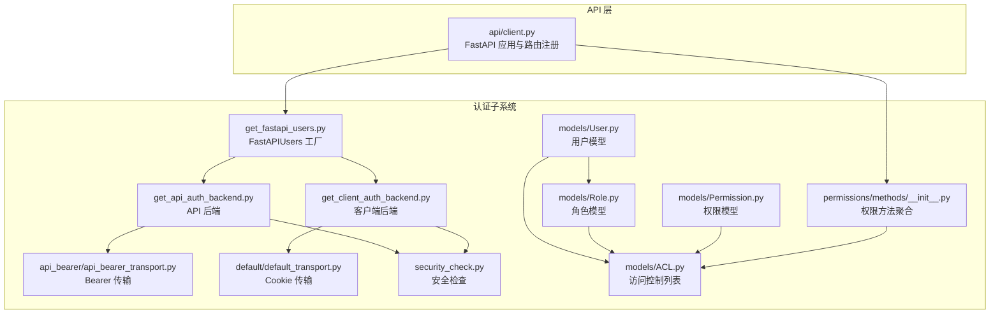
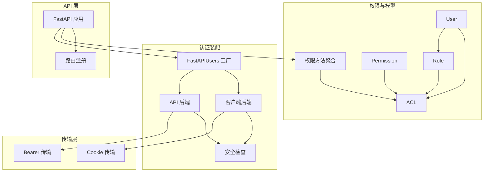
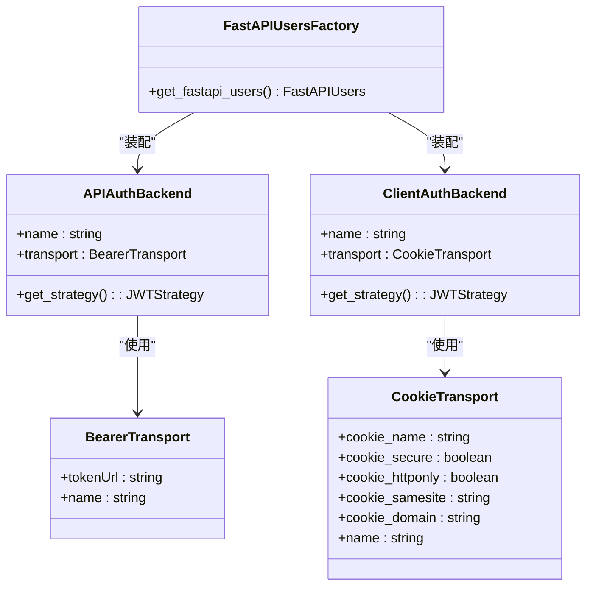
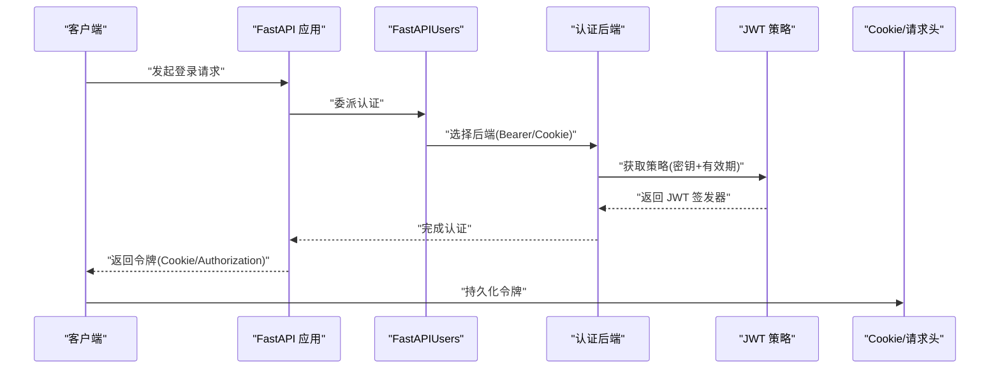
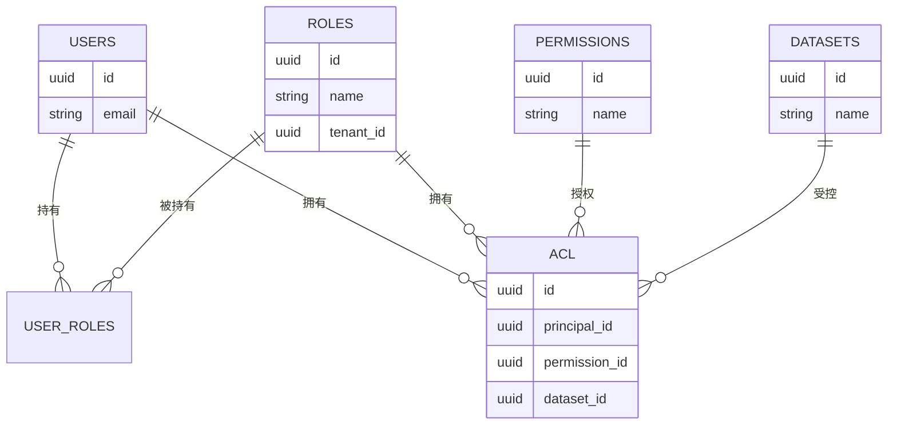
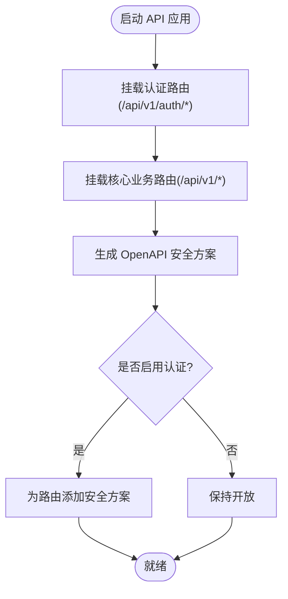
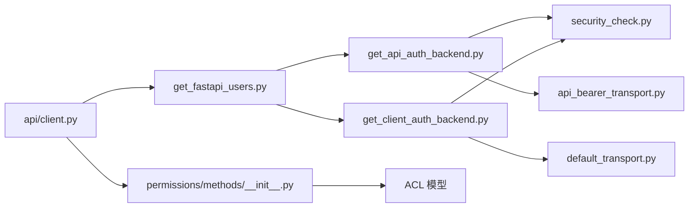

# 认证与路由

<cite>
**本文引用的文件**
- [m_flow/auth/__init__.py](file://m_flow/auth/__init__.py)
- [m_flow/auth/get_fastapi_users.py](file://m_flow/auth/get_fastapi_users.py)
- [m_flow/auth/authentication/get_api_auth_backend.py](file://m_flow/auth/authentication/get_api_auth_backend.py)
- [m_flow/auth/authentication/get_client_auth_backend.py](file://m_flow/auth/authentication/get_client_auth_backend.py)
- [m_flow/auth/authentication/api_bearer/api_bearer_transport.py](file://m_flow/auth/authentication/api_bearer/api_bearer_transport.py)
- [m_flow/auth/authentication/default/default_transport.py](file://m_flow/auth/authentication/default/default_transport.py)
- [m_flow/auth/models/User.py](file://m_flow/auth/models/User.py)
- [m_flow/auth/models/Role.py](file://m_flow/auth/models/Role.py)
- [m_flow/auth/models/Permission.py](file://m_flow/auth/models/Permission.py)
- [m_flow/auth/models/ACL.py](file://m_flow/auth/models/ACL.py)
- [m_flow/auth/security_check.py](file://m_flow/auth/security_check.py)
- [m_flow/api/client.py](file://m_flow/api/client.py)
- [m_flow/auth/permissions/methods/__init__.py](file://m_flow/auth/permissions/methods/__init__.py)
</cite>

## 目录
1. [简介](#简介)
2. [项目结构](#项目结构)
3. [核心组件](#核心组件)
4. [架构总览](#架构总览)
5. [详细组件分析](#详细组件分析)
6. [依赖分析](#依赖分析)
7. [性能考虑](#性能考虑)
8. [故障排查指南](#故障排查指南)
9. [结论](#结论)
10. [附录](#附录)

## 简介
本文件系统性梳理认证与路由体系，覆盖以下主题：
- 用户认证流程：登录表单、JWT 令牌管理、会话状态维护
- 路由守卫与权限检查：未认证重定向策略、权限校验机制
- 应用提供者架构：认证上下文、API 客户端、异常处理集成
- 路由配置：动态路由、嵌套路由、路由参数处理
- 权限控制：角色权限与数据访问控制（ACL）
- 认证状态持久化：本地存储与安全令牌管理
- 错误处理与用户体验优化

## 项目结构
认证与路由相关代码主要分布在后端 Python 包 m_flow 的以下模块：
- 认证入口与工厂：m_flow/auth/get_fastapi_users.py
- 认证后端与传输层：m_flow/auth/authentication/*
- 模型与权限：m_flow/auth/models/*
- 权限方法：m_flow/auth/permissions/methods/*
- API 服务与路由注册：m_flow/api/client.py

**图表来源**
- [m_flow/auth/get_fastapi_users.py:22-48](file://m_flow/auth/get_fastapi_users.py#L22-L48)
- [m_flow/auth/authentication/get_api_auth_backend.py:22-46](file://m_flow/auth/authentication/get_api_auth_backend.py#L22-L46)
- [m_flow/auth/authentication/get_client_auth_backend.py:22-48](file://m_flow/auth/authentication/get_client_auth_backend.py#L22-L48)
- [m_flow/auth/authentication/api_bearer/api_bearer_transport.py:11-17](file://m_flow/auth/authentication/api_bearer/api_bearer_transport.py#L11-L17)
- [m_flow/auth/authentication/default/default_transport.py:17-43](file://m_flow/auth/authentication/default/default_transport.py#L17-L43)
- [m_flow/auth/security_check.py:19-80](file://m_flow/auth/security_check.py#L19-L80)
- [m_flow/auth/models/User.py:25-64](file://m_flow/auth/models/User.py#L25-L64)
- [m_flow/auth/models/Role.py:18-48](file://m_flow/auth/models/Role.py#L18-L48)
- [m_flow/auth/models/Permission.py:20-31](file://m_flow/auth/models/Permission.py#L20-L31)
- [m_flow/auth/models/ACL.py:21-38](file://m_flow/auth/models/ACL.py#L21-L38)
- [m_flow/auth/permissions/methods/__init__.py:10-36](file://m_flow/auth/permissions/methods/__init__.py#L10-L36)
- [m_flow/api/client.py:268-337](file://m_flow/api/client.py#L268-L337)

**章节来源**
- [m_flow/auth/get_fastapi_users.py:22-48](file://m_flow/auth/get_fastapi_users.py#L22-L48)
- [m_flow/api/client.py:268-337](file://m_flow/api/client.py#L268-L337)

## 核心组件
- FastAPIUsers 工厂：集中创建认证实例，注入 API 与客户端两种后端，确保单例行为。
- 认证后端：
  - API 后端：基于 Bearer 传输，用于 API 密钥场景，令牌有效期较长。
  - 客户端后端：基于 Cookie 传输，用于 Web 客户端会话，令牌有效期较短。
- 传输层：
  - Bearer 传输：指定令牌端点与传输名称。
  - Cookie 传输：从环境变量读取 Cookie 名称，设置 HttpOnly、SameSite、域等安全属性。
- 安全检查：在非开发环境强制要求配置密钥，开发环境仅给出警告并使用默认值。
- 模型与权限：
  - 用户、角色、权限、ACL 四者构成 RBAC 与数据级访问控制基础。
- 权限方法：提供权限检查、授予、默认权限分配、数据集授权等工具函数。
- API 客户端：统一注册认证与业务路由，配置 CORS、OpenAPI 安全方案、异常处理。

**章节来源**
- [m_flow/auth/get_fastapi_users.py:22-48](file://m_flow/auth/get_fastapi_users.py#L22-L48)
- [m_flow/auth/authentication/get_api_auth_backend.py:22-46](file://m_flow/auth/authentication/get_api_auth_backend.py#L22-L46)
- [m_flow/auth/authentication/get_client_auth_backend.py:22-48](file://m_flow/auth/authentication/get_client_auth_backend.py#L22-L48)
- [m_flow/auth/authentication/api_bearer/api_bearer_transport.py:11-17](file://m_flow/auth/authentication/api_bearer/api_bearer_transport.py#L11-L17)
- [m_flow/auth/authentication/default/default_transport.py:17-43](file://m_flow/auth/authentication/default/default_transport.py#L17-L43)
- [m_flow/auth/security_check.py:19-80](file://m_flow/auth/security_check.py#L19-L80)
- [m_flow/auth/models/User.py:25-64](file://m_flow/auth/models/User.py#L25-L64)
- [m_flow/auth/models/Role.py:18-48](file://m_flow/auth/models/Role.py#L18-L48)
- [m_flow/auth/models/Permission.py:20-31](file://m_flow/auth/models/Permission.py#L20-L31)
- [m_flow/auth/models/ACL.py:21-38](file://m_flow/auth/models/ACL.py#L21-L38)
- [m_flow/auth/permissions/methods/__init__.py:10-36](file://m_flow/auth/permissions/methods/__init__.py#L10-L36)
- [m_flow/api/client.py:110-127](file://m_flow/api/client.py#L110-L127)

## 架构总览
认证与路由采用“后端工厂 + 多传输 + 模型驱动权限”的分层架构：
- 上层：FastAPIUsers 工厂负责装配认证后端与用户管理器。
- 中层：API 与客户端两种认证后端分别对接不同传输方式（Bearer 与 Cookie）。
- 下层：安全检查保障密钥配置；模型与权限方法支撑细粒度访问控制。
- API 层：统一挂载认证与业务路由，提供 OpenAPI 安全方案与异常处理。

**图表来源**
- [m_flow/auth/get_fastapi_users.py:22-48](file://m_flow/auth/get_fastapi_users.py#L22-L48)
- [m_flow/auth/authentication/get_api_auth_backend.py:22-46](file://m_flow/auth/authentication/get_api_auth_backend.py#L22-L46)
- [m_flow/auth/authentication/get_client_auth_backend.py:22-48](file://m_flow/auth/authentication/get_client_auth_backend.py#L22-L48)
- [m_flow/auth/security_check.py:19-80](file://m_flow/auth/security_check.py#L19-L80)
- [m_flow/auth/models/User.py:25-64](file://m_flow/auth/models/User.py#L25-L64)
- [m_flow/auth/models/Role.py:18-48](file://m_flow/auth/models/Role.py#L18-L48)
- [m_flow/auth/models/ACL.py:21-38](file://m_flow/auth/models/ACL.py#L21-L38)
- [m_flow/auth/permissions/methods/__init__.py:10-36](file://m_flow/auth/permissions/methods/__init__.py#L10-L36)
- [m_flow/api/client.py:268-337](file://m_flow/api/client.py#L268-L337)

## 详细组件分析

### 组件一：FastAPIUsers 工厂与认证后端
- 单例模式：通过缓存确保 FastAPIUsers 实例唯一，避免重复初始化。
- 双后端装配：同时注册 API 与客户端两种认证后端，满足多端接入需求。
- 后端配置：
  - API 后端：使用 Bearer 传输，令牌有效期较长，适合服务到服务调用。
  - 客户端后端：使用 Cookie 传输，令牌有效期较短，适合浏览器会话。

**图表来源**
- [m_flow/auth/get_fastapi_users.py:22-48](file://m_flow/auth/get_fastapi_users.py#L22-L48)
- [m_flow/auth/authentication/get_api_auth_backend.py:22-46](file://m_flow/auth/authentication/get_api_auth_backend.py#L22-L46)
- [m_flow/auth/authentication/get_client_auth_backend.py:22-48](file://m_flow/auth/authentication/get_client_auth_backend.py#L22-L48)
- [m_flow/auth/authentication/api_bearer/api_bearer_transport.py:11-17](file://m_flow/auth/authentication/api_bearer/api_bearer_transport.py#L11-L17)
- [m_flow/auth/authentication/default/default_transport.py:17-43](file://m_flow/auth/authentication/default/default_transport.py#L17-L43)

**章节来源**
- [m_flow/auth/get_fastapi_users.py:22-48](file://m_flow/auth/get_fastapi_users.py#L22-L48)
- [m_flow/auth/authentication/get_api_auth_backend.py:22-46](file://m_flow/auth/authentication/get_api_auth_backend.py#L22-L46)
- [m_flow/auth/authentication/get_client_auth_backend.py:22-48](file://m_flow/auth/authentication/get_client_auth_backend.py#L22-L48)

### 组件二：令牌生命周期与会话状态
- 令牌生成：JWT 策略由后端工厂按需创建，密钥通过安全检查函数读取或回退默认值。
- 令牌存储：
  - API：通过 Authorization Bearer 头传递，适合无状态调用。
  - 客户端：通过 HTTP Cookie 传递，支持 HttpOnly、SameSite 等安全属性。
- 会话维护：客户端后端使用较短令牌生命周期，结合 Cookie 传输实现会话状态维护。

**图表来源**
- [m_flow/auth/get_fastapi_users.py:22-48](file://m_flow/auth/get_fastapi_users.py#L22-L48)
- [m_flow/auth/authentication/get_api_auth_backend.py:22-46](file://m_flow/auth/authentication/get_api_auth_backend.py#L22-L46)
- [m_flow/auth/authentication/get_client_auth_backend.py:22-48](file://m_flow/auth/authentication/get_client_auth_backend.py#L22-L48)
- [m_flow/auth/security_check.py:19-80](file://m_flow/auth/security_check.py#L19-L80)

**章节来源**
- [m_flow/auth/authentication/api_bearer/api_bearer_transport.py:11-17](file://m_flow/auth/authentication/api_bearer/api_bearer_transport.py#L11-L17)
- [m_flow/auth/authentication/default/default_transport.py:17-43](file://m_flow/auth/authentication/default/default_transport.py#L17-L43)
- [m_flow/auth/security_check.py:19-80](file://m_flow/auth/security_check.py#L19-L80)

### 组件三：权限模型与数据访问控制
- 角色与权限：
  - 角色（Role）：租户内命名实体，可被用户持有。
  - 权限（Permission）：全局命名权限，不可重复。
- 访问控制列表（ACL）：
  - 将主体（用户/角色）与权限绑定，并限定到具体数据集。
  - 支持按用户、角色、数据集进行权限查询与授权。
- 数据访问控制：
  - 权限方法提供“在数据集上检查权限”、“授予权限”、“默认权限分配”等能力。
  - 通过 ACL 与权限方法实现细粒度的数据访问控制。

**图表来源**
- [m_flow/auth/models/User.py:25-64](file://m_flow/auth/models/User.py#L25-L64)
- [m_flow/auth/models/Role.py:18-48](file://m_flow/auth/models/Role.py#L18-L48)
- [m_flow/auth/models/Permission.py:20-31](file://m_flow/auth/models/Permission.py#L20-L31)
- [m_flow/auth/models/ACL.py:21-38](file://m_flow/auth/models/ACL.py#L21-L38)
- [m_flow/auth/permissions/methods/__init__.py:10-36](file://m_flow/auth/permissions/methods/__init__.py#L10-L36)

**章节来源**
- [m_flow/auth/models/User.py:25-64](file://m_flow/auth/models/User.py#L25-L64)
- [m_flow/auth/models/Role.py:18-48](file://m_flow/auth/models/Role.py#L18-L48)
- [m_flow/auth/models/Permission.py:20-31](file://m_flow/auth/models/Permission.py#L20-L31)
- [m_flow/auth/models/ACL.py:21-38](file://m_flow/auth/models/ACL.py#L21-L38)
- [m_flow/auth/permissions/methods/__init__.py:10-36](file://m_flow/auth/permissions/methods/__init__.py#L10-L36)

### 组件四：路由配置与守卫
- 动态与嵌套路由：API 客户端集中挂载认证与业务路由，形成清晰的前缀与标签体系。
- 路由参数处理：通过 include_router 的 prefix 与 tags 组织路由层次，便于文档生成与调试。
- 路由守卫与权限检查：
  - OpenAPI 安全方案：在启用认证时为所有路由声明 Bearer 与 Cookie 安全方案。
  - 异常处理：统一捕获验证错误与通用异常，输出结构化错误响应。
  - 认证中间件：由 FastAPIUsers 提供，结合后端与传输实现自动鉴权。

**图表来源**
- [m_flow/api/client.py:268-337](file://m_flow/api/client.py#L268-L337)
- [m_flow/api/client.py:135-161](file://m_flow/api/client.py#L135-L161)

**章节来源**
- [m_flow/api/client.py:268-337](file://m_flow/api/client.py#L268-L337)
- [m_flow/api/client.py:135-161](file://m_flow/api/client.py#L135-L161)

### 组件五：认证状态持久化与安全令牌管理
- 本地存储：
  - API：通过 Authorization 头携带 Bearer 令牌，适合无状态服务。
  - 客户端：通过 Cookie 存储令牌，结合 HttpOnly、SameSite、域等属性提升安全性。
- 安全令牌管理：
  - 密钥来源：优先从环境变量读取，非开发环境必须配置，否则抛出运行时错误。
  - 默认值回退：开发环境允许使用默认密钥并发出警告，避免阻塞本地开发。
- 会话生命周期：
  - 客户端后端令牌有效期较短，建议配合刷新策略或重新登录流程。

**章节来源**
- [m_flow/auth/authentication/api_bearer/api_bearer_transport.py:11-17](file://m_flow/auth/authentication/api_bearer/api_bearer_transport.py#L11-L17)
- [m_flow/auth/authentication/default/default_transport.py:17-43](file://m_flow/auth/authentication/default/default_transport.py#L17-L43)
- [m_flow/auth/security_check.py:19-80](file://m_flow/auth/security_check.py#L19-L80)

## 依赖分析
- 组件耦合：
  - FastAPIUsers 工厂对认证后端与用户管理器存在直接依赖。
  - 认证后端对传输层与安全检查函数存在直接依赖。
  - 权限方法聚合导出多个权限操作函数，供上层业务调用。
- 外部依赖：
  - FastAPIUsers 提供认证框架与中间件。
  - Sentry（可选）用于生产错误追踪。
- 循环依赖：
  - 当前模块间未见循环导入迹象，职责边界清晰。

**图表来源**
- [m_flow/auth/get_fastapi_users.py:22-48](file://m_flow/auth/get_fastapi_users.py#L22-L48)
- [m_flow/auth/authentication/get_api_auth_backend.py:22-46](file://m_flow/auth/authentication/get_api_auth_backend.py#L22-L46)
- [m_flow/auth/authentication/get_client_auth_backend.py:22-48](file://m_flow/auth/authentication/get_client_auth_backend.py#L22-L48)
- [m_flow/auth/security_check.py:19-80](file://m_flow/auth/security_check.py#L19-L80)
- [m_flow/auth/authentication/api_bearer/api_bearer_transport.py:11-17](file://m_flow/auth/authentication/api_bearer/api_bearer_transport.py#L11-L17)
- [m_flow/auth/authentication/default/default_transport.py:17-43](file://m_flow/auth/authentication/default/default_transport.py#L17-L43)
- [m_flow/api/client.py:268-337](file://m_flow/api/client.py#L268-L337)
- [m_flow/auth/permissions/methods/__init__.py:10-36](file://m_flow/auth/permissions/methods/__init__.py#L10-L36)
- [m_flow/auth/models/ACL.py:21-38](file://m_flow/auth/models/ACL.py#L21-L38)

**章节来源**
- [m_flow/auth/get_fastapi_users.py:22-48](file://m_flow/auth/get_fastapi_users.py#L22-L48)
- [m_flow/auth/authentication/get_api_auth_backend.py:22-46](file://m_flow/auth/authentication/get_api_auth_backend.py#L22-L46)
- [m_flow/auth/authentication/get_client_auth_backend.py:22-48](file://m_flow/auth/authentication/get_client_auth_backend.py#L22-L48)
- [m_flow/auth/security_check.py:19-80](file://m_flow/auth/security_check.py#L19-L80)
- [m_flow/api/client.py:268-337](file://m_flow/api/client.py#L268-L337)

## 性能考虑
- 令牌生命周期：客户端后端使用较短有效期，降低泄露风险；API 后端较长有效期，减少频繁刷新开销。
- 缓存与单例：FastAPIUsers 使用缓存确保单例，避免重复初始化带来的性能损耗。
- 异常处理：统一异常处理器减少异常传播成本，提高稳定性。
- CORS 配置：合理设置允许来源与凭证，避免不必要的跨域预检开销。

## 故障排查指南
- 密钥未配置（非开发环境）：
  - 现象：启动时报错，提示必须设置环境变量。
  - 处理：在非开发环境正确配置密钥；开发环境可接受默认值但会记录警告。
- 登录失败或令牌无效：
  - 现象：API 返回认证错误。
  - 处理：确认传输类型（Bearer 或 Cookie）、令牌有效期、签名密钥一致性。
- 权限不足：
  - 现象：访问资源返回 403。
  - 处理：检查 ACL 是否正确授予、用户是否属于目标角色、数据集范围是否匹配。
- OpenAPI 文档缺少安全方案：
  - 现象：Swagger/Redoc 不显示认证输入。
  - 处理：确认是否启用了认证开关，以及安全方案生成逻辑是否执行。

**章节来源**
- [m_flow/auth/security_check.py:19-80](file://m_flow/auth/security_check.py#L19-L80)
- [m_flow/api/client.py:135-161](file://m_flow/api/client.py#L135-L161)
- [m_flow/auth/permissions/methods/__init__.py:10-36](file://m_flow/auth/permissions/methods/__init__.py#L10-L36)

## 结论
该认证与路由系统以 FastAPIUsers 为核心，结合 API 与客户端双后端、Bearer 与 Cookie 两种传输方式，构建了兼顾易用性与安全性的认证基础设施。配合 RBAC 与 ACL 的权限模型，以及统一的路由注册与异常处理，能够有效支撑多端接入与细粒度权限控制。建议在生产环境中严格配置密钥与 Cookie 安全属性，并根据业务需要调整令牌有效期与刷新策略。

## 附录
- 关键路径参考：
  - [认证工厂:22-48](file://m_flow/auth/get_fastapi_users.py#L22-L48)
  - [API 后端:22-46](file://m_flow/auth/authentication/get_api_auth_backend.py#L22-L46)
  - [客户端后端:22-48](file://m_flow/auth/authentication/get_client_auth_backend.py#L22-L48)
  - [Bearer 传输:11-17](file://m_flow/auth/authentication/api_bearer/api_bearer_transport.py#L11-L17)
  - [Cookie 传输:17-43](file://m_flow/auth/authentication/default/default_transport.py#L17-L43)
  - [安全检查:19-80](file://m_flow/auth/security_check.py#L19-L80)
  - [用户模型:25-64](file://m_flow/auth/models/User.py#L25-L64)
  - [角色模型:18-48](file://m_flow/auth/models/Role.py#L18-L48)
  - [权限模型:20-31](file://m_flow/auth/models/Permission.py#L20-L31)
  - [ACL 模型:21-38](file://m_flow/auth/models/ACL.py#L21-L38)
  - [权限方法聚合:10-36](file://m_flow/auth/permissions/methods/__init__.py#L10-L36)
  - [API 客户端与路由注册:268-337](file://m_flow/api/client.py#L268-L337)