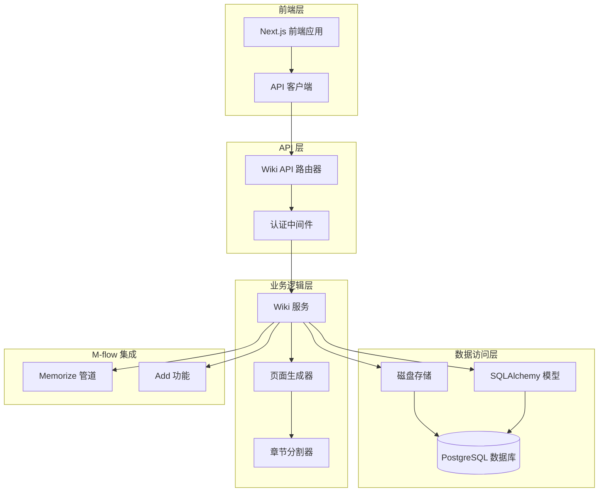
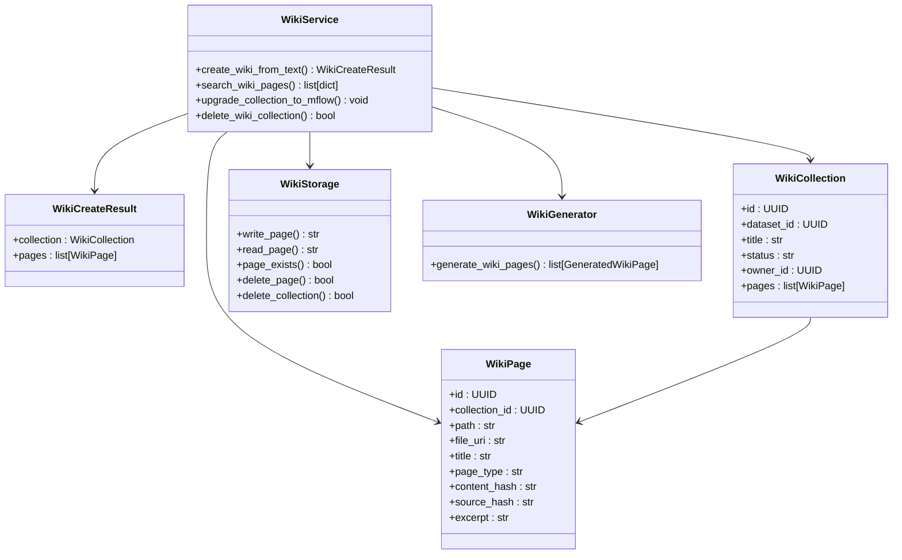
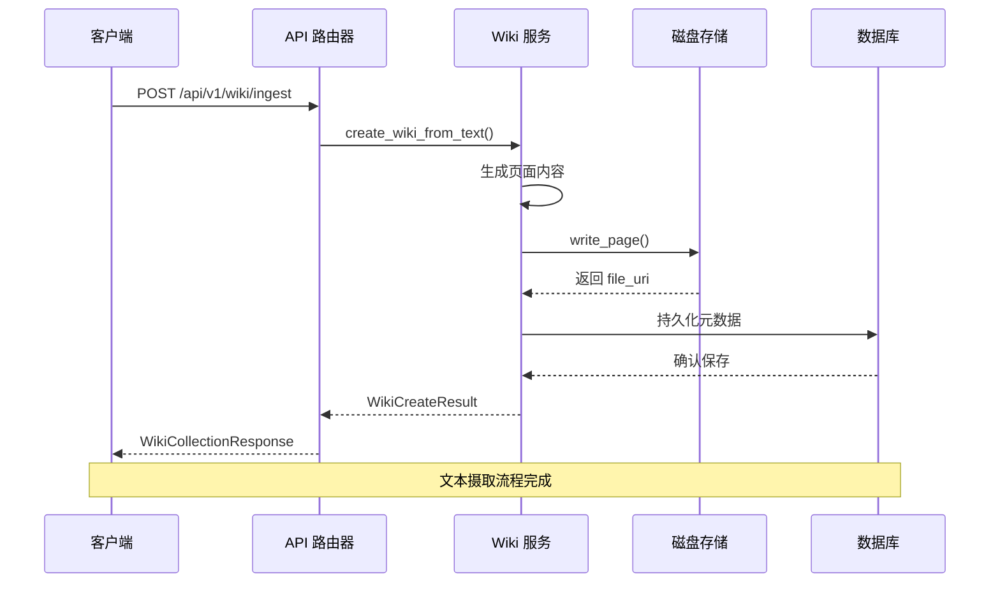
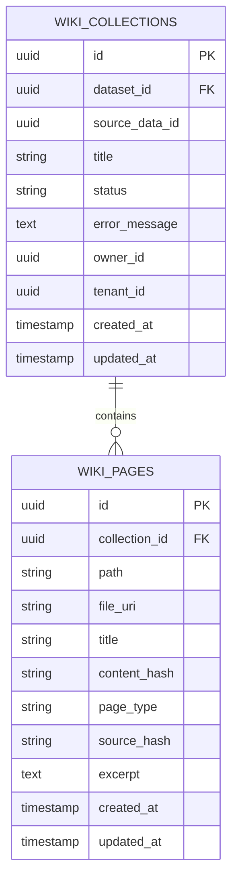
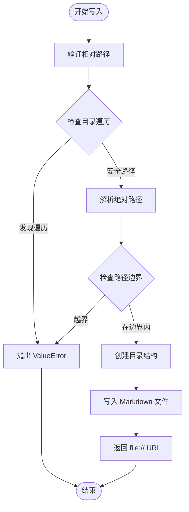
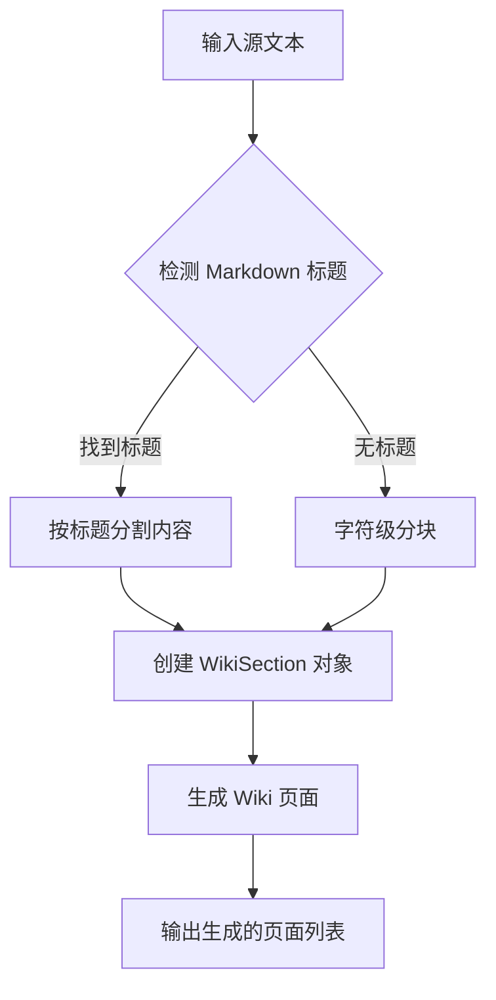
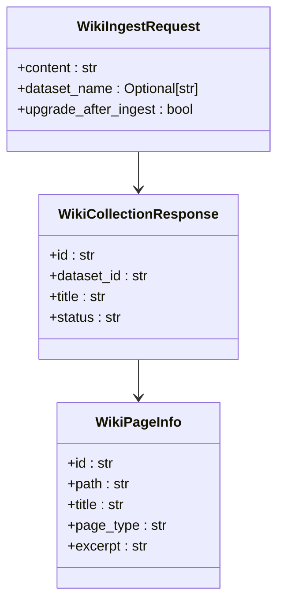
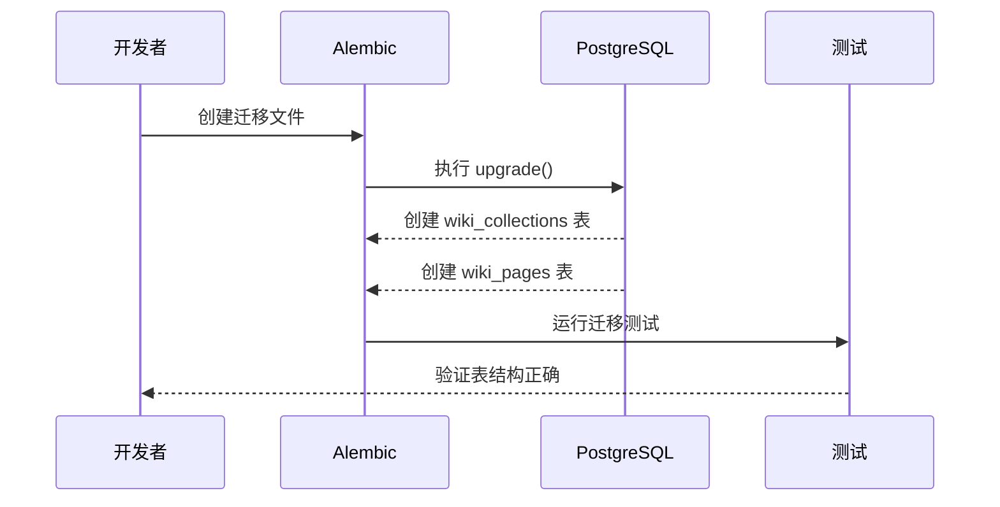
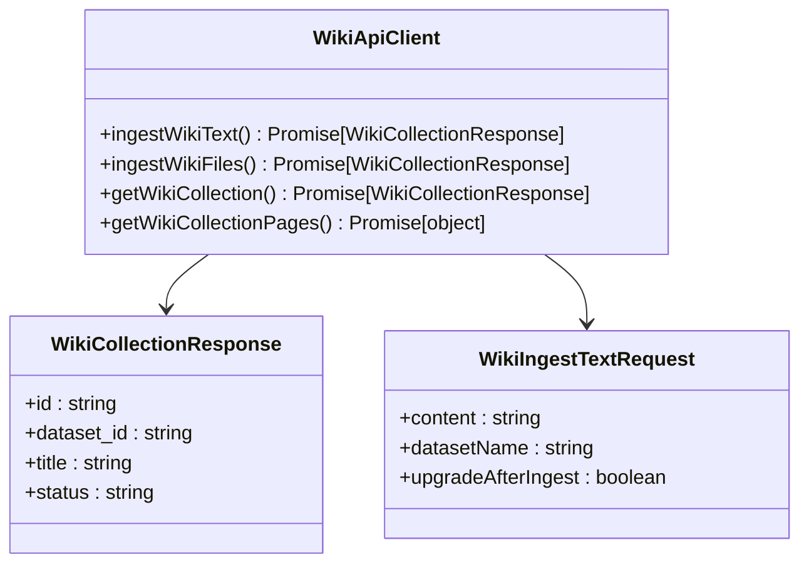
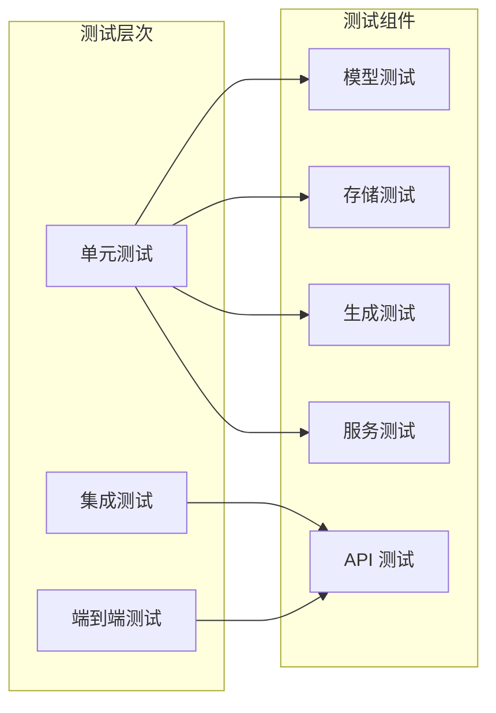

# Wiki 摄取系统实现计划

<cite>
**本文档引用的文件**
- [2026-05-15-wiki-ingest.md](file://docs/superpowers/plans/2026-05-15-wiki-ingest.md)
- [WikiCollection.py](file://m_flow/wiki/models/WikiCollection.py)
- [WikiPage.py](file://m_flow/wiki/models/WikiPage.py)
- [models/__init__.py](file://m_flow/wiki/models/__init__.py)
- [storage.py](file://m_flow/wiki/storage.py)
- [sectioning.py](file://m_flow/wiki/sectioning.py)
- [generator.py](file://m_flow/wiki/generator.py)
- [service.py](file://m_flow/wiki/service.py)
- [get_wiki_router.py](file://m_flow/api/v1/wiki/routers/get_wiki_router.py)
- [wiki/__init__.py](file://m_flow/api/v1/wiki/__init__.py)
- [20260518_add_wiki_tables.py](file://alembic/versions/20260518_add_wiki_tables.py)
- [storage.py](file://m_flow/shared/files/storage/storage.py)
- [test_storage.py](file://m_flow/tests/unit/wiki/test_storage.py)
- [test_generation.py](file://m_flow/tests/unit/wiki/test_generation.py)
- [test_migration_imports.py](file://m_flow/tests/unit/wiki/test_migration_imports.py)
- [client.ts](file://m_flow-frontend/src/lib/api/client.ts)
</cite>

## 更新摘要
**所做更改**
- 更新了 Wiki 摄取系统的完整实现状态，包含所有核心组件
- 新增了详细的 API 路由器实现分析
- 更新了数据模型和存储系统的具体实现细节
- 完善了测试策略和部署维护指南
- 增强了前端集成和迁移管理的详细说明

## 目录
1. [项目概述](#项目概述)
2. [架构设计](#架构设计)
3. [核心组件分析](#核心组件分析)
4. [数据模型设计](#数据模型设计)
5. [存储系统](#存储系统)
6. [页面生成器](#页面生成器)
7. [API 接口设计](#api-接口设计)
8. [迁移管理](#迁移管理)
9. [前端集成](#前端集成)
10. [测试策略](#测试策略)
11. [部署与维护](#部署与维护)

## 项目概述

Wiki 摄取系统是一个独立的知识管理解决方案，现已完全实现，旨在为用户提供轻量级的 Wiki 创建、存储和升级功能。该系统的核心目标是：

- **独立 Wiki 路径**：提供与现有 M-flow 系统并行的 Wiki 摄取路径
- **磁盘后端存储**：将 Markdown 页面内容存储在磁盘上，仅在数据库中存储元数据
- **轻量级搜索**：支持基于标题、路径、摘要和内容的全文搜索
- **无缝升级**：通过现有的 M-flow `memorize()` 管道升级 Wiki 集合

该系统采用 FastAPI 构建，使用 SQLAlchemy 进行数据库操作，Alembic 进行数据库迁移管理，现已实现完整的端到端功能。

**更新** 系统已完全实现，包含 API 路由器、数据库模型、服务层、存储系统等全套组件

## 架构设计

### 整体架构图

**图表来源**
- [get_wiki_router.py:40-232](file://m_flow/api/v1/wiki/routers/get_wiki_router.py#L40-L232)
- [service.py:35-209](file://m_flow/wiki/service.py#L35-L209)

### 核心设计原则

1. **分离关注点**：内容存储与元数据管理分离
2. **可扩展性**：支持未来添加 LLM 驱动的智能生成
3. **向后兼容**：不改变现有 M-flow 的 ingest、add 和 memorize 功能
4. **安全性**：严格的文件路径验证防止目录遍历攻击

**更新** 系统架构已完全实现，所有组件协同工作提供完整的 Wiki 摄取功能

## 核心组件分析

### Wiki 服务层

Wiki 服务是整个系统的核心协调器，负责管理从文本到 Wiki 页面的完整生命周期。

**图表来源**
- [service.py:20-209](file://m_flow/wiki/service.py#L20-L209)
- [WikiCollection.py:23-63](file://m_flow/wiki/models/WikiCollection.py#L23-L63)
- [WikiPage.py:23-68](file://m_flow/wiki/models/WikiPage.py#L23-L68)
- [storage.py:17-100](file://m_flow/wiki/storage.py#L17-L100)
- [generator.py:17-110](file://m_flow/wiki/generator.py#L17-L110)

**章节来源**
- [service.py:35-209](file://m_flow/wiki/service.py#L35-L209)

### API 路由器设计

API 路由器提供了完整的 Wiki 操作接口，包括文本摄取、文件上传、集合管理和页面查询等功能。

**图表来源**
- [get_wiki_router.py:54-78](file://m_flow/api/v1/wiki/routers/get_wiki_router.py#L54-L78)
- [service.py:35-107](file://m_flow/wiki/service.py#L35-L107)

**章节来源**
- [get_wiki_router.py:40-232](file://m_flow/api/v1/wiki/routers/get_wiki_router.py#L40-L232)

## 数据模型设计

### Wiki 集合模型

WikiCollection 模型代表一个 Wiki 集合，包含集合的基本信息和状态管理。

**图表来源**
- [WikiCollection.py:40-59](file://m_flow/wiki/models/WikiCollection.py#L40-L59)
- [WikiPage.py:44-64](file://m_flow/wiki/models/WikiPage.py#L44-L64)

### 字段详细说明

| 字段名 | 类型 | 约束 | 描述 |
|--------|------|------|------|
| id | UUID | 主键 | 集合唯一标识符 |
| dataset_id | UUID | 外键 | 关联到 M-flow 数据集 |
| source_data_id | UUID | 可空 | 源数据项标识符 |
| title | String(512) | 非空 | 集合显示名称 |
| status | String(32) | 非空，默认"processing" | 集合状态（processing/ready/failed/upgrading/upgraded） |
| error_message | Text | 可空 | 错误详情 |
| owner_id | UUID | 非空 | 集合所有者 |
| tenant_id | UUID | 可空 | 多租户支持 |
| created_at/updated_at | DateTime(timezone) | 时间戳 | 创建和更新时间 |

**章节来源**
- [WikiCollection.py:23-63](file://m_flow/wiki/models/WikiCollection.py#L23-L63)

### Wiki 页面模型

WikiPage 模型代表单个 Wiki 页面，采用磁盘后端存储策略。

**章节来源**
- [WikiPage.py:23-68](file://m_flow/wiki/models/WikiPage.py#L23-L68)

## 存储系统

### 磁盘存储架构

Wiki 存储系统采用安全的磁盘后端存储，确保内容与元数据分离。

**图表来源**
- [storage.py:33-68](file://m_flow/wiki/storage.py#L33-L68)

### 安全机制

系统实现了多层安全防护来防止目录遍历攻击：

1. **路径规范化**：将反斜杠转换为正斜杠
2. **绝对路径检测**：拒绝绝对路径
3. **目录遍历检测**：拒绝包含 ".." 的路径
4. **边界检查**：确保目标路径在集合根目录内

**章节来源**
- [storage.py:33-51](file://m_flow/wiki/storage.py#L33-L51)

## 页面生成器

### 内容分割策略

页面生成器采用智能的内容分割策略，优先使用 Markdown 标题进行分割。

**图表来源**
- [sectioning.py:23-57](file://m_flow/wiki/sectioning.py#L23-L57)
- [generator.py:65-110](file://m_flow/wiki/generator.py#L65-L110)

### 页面类型

系统自动生成三种类型的页面：

1. **索引页面 (index.md)**：包含所有章节链接的目录
2. **摘要页面 (summary.md)**：整篇内容的摘要
3. **章节页面 (chapters/*.md)**：每个章节对应一个独立页面

**章节来源**
- [generator.py:47-110](file://m_flow/wiki/generator.py#L47-L110)

## API 接口设计

### 端点定义

| 方法 | 端点 | 功能 | 请求体 | 响应体 |
|------|------|------|--------|--------|
| POST | /api/v1/wiki/ingest | 文本摄取 | WikiIngestRequest | WikiCollectionResponse |
| POST | /api/v1/wiki/ingest/upload | 文件上传摄取 | multipart/form-data | WikiCollectionResponse |
| GET | /api/v1/wiki/collections/{collection_id} | 获取集合详情 | - | WikiCollectionResponse |
| GET | /api/v1/wiki/collections/{collection_id}/pages | 列出页面 | - | 分页响应 |
| GET | /api/v1/wiki/pages/{page_id} | 获取页面详情 | - | 页面详情 |
| POST | /api/v1/wiki/collections/{collection_id}/upgrade | 升级到 M-flow | - | WikiCollectionResponse |

### 请求模型

**图表来源**
- [get_wiki_router.py:16-31](file://m_flow/api/v1/wiki/routers/get_wiki_router.py#L16-L31)

**章节来源**
- [get_wiki_router.py:40-232](file://m_flow/api/v1/wiki/routers/get_wiki_router.py#L40-L232)

## 迁移管理

### 数据库迁移

系统使用 Alembic 进行数据库迁移管理，创建专门的 Wiki 表结构。

**图表来源**
- [20260518_add_wiki_tables.py:25-66](file://alembic/versions/20260518_add_wiki_tables.py#L25-L66)

### 迁移验证

迁移文件包含完整的验证逻辑，确保：

1. **表存在性**：验证 `wiki_collections` 和 `wiki_pages` 表创建
2. **字段完整性**：验证关键字段如 `file_uri` 的存在
3. **内容存储策略**：确认内容字段不在数据库中存储
4. **版本链路**：验证迁移版本链路正确

**章节来源**
- [20260518_add_wiki_tables.py:1-77](file://alembic/versions/20260518_add_wiki_tables.py#L1-L77)

## 前端集成

### API 客户端

前端使用 TypeScript 编写的 API 客户端，提供完整的 Wiki 操作接口。

**图表来源**
- [client.ts:679-764](file://m_flow-frontend/src/lib/api/client.ts#L679-L764)

### 类型定义

前端定义了完整的 TypeScript 类型，确保类型安全：

- `WikiCollectionResponse`：集合响应模型
- `WikiIngestTextRequest`：文本摄取请求模型  
- `WikiIngestUploadOptions`：文件上传选项模型
- `WikiPageInfo`：页面信息模型

**章节来源**
- [client.ts:679-764](file://m_flow-frontend/src/lib/api/client.ts#L679-L764)

## 测试策略

### 单元测试覆盖

系统采用全面的单元测试策略，确保各组件的可靠性：

### 关键测试场景

1. **模型注册测试**：验证 SQLAlchemy 模型正确注册到元数据
2. **路径安全测试**：验证磁盘存储的安全性
3. **内容分割测试**：验证章节分割算法的正确性
4. **迁移验证测试**：验证数据库迁移的完整性
5. **API 功能测试**：验证所有 API 端点的功能

**章节来源**
- [test_storage.py:338-141](file://m_flow/tests/unit/wiki/test_storage.py#L338-L141)
- [test_generation.py:457-489](file://m_flow/tests/unit/wiki/test_generation.py#L457-L489)
- [test_migration_imports.py:12-33](file://m_flow/tests/unit/wiki/test_migration_imports.py#L12-L33)

## 部署与维护

### 部署要求

1. **数据库配置**：需要 PostgreSQL 数据库支持
2. **文件存储**：需要足够的磁盘空间存储 Wiki 内容
3. **内存配置**：根据预期的并发用户数配置内存
4. **网络配置**：API 服务器需要对外提供访问

### 维护策略

1. **定期备份**：定期备份数据库和磁盘内容
2. **监控告警**：设置系统监控和性能告警
3. **日志管理**：配置适当的日志级别和轮转策略
4. **安全更新**：定期更新依赖包和安全补丁

### 升级路径

系统设计支持渐进式升级：

1. **基础 Wiki 功能**：文本摄取和基本存储
2. **高级搜索功能**：增强的搜索算法和索引
3. **LLM 集成**：可插拔的 LLM 生成器
4. **协作功能**：多用户编辑和版本控制

**更新** Wiki 摄取系统已完全实现，具备完整的生产就绪功能，包括所有核心组件和完整的测试覆盖

该 Wiki 摄取系统为 M-flow 生态系统提供了强大的知识管理能力，通过模块化设计和清晰的架构分离，确保了系统的可维护性和可扩展性。系统现已实现完整的端到端功能，包括 API 接口、数据存储、页面生成和升级机制，为用户提供了完整的 Wiki 管理解决方案。