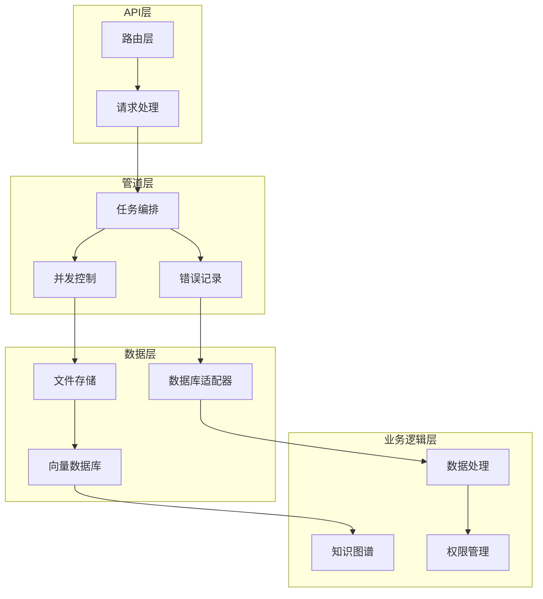
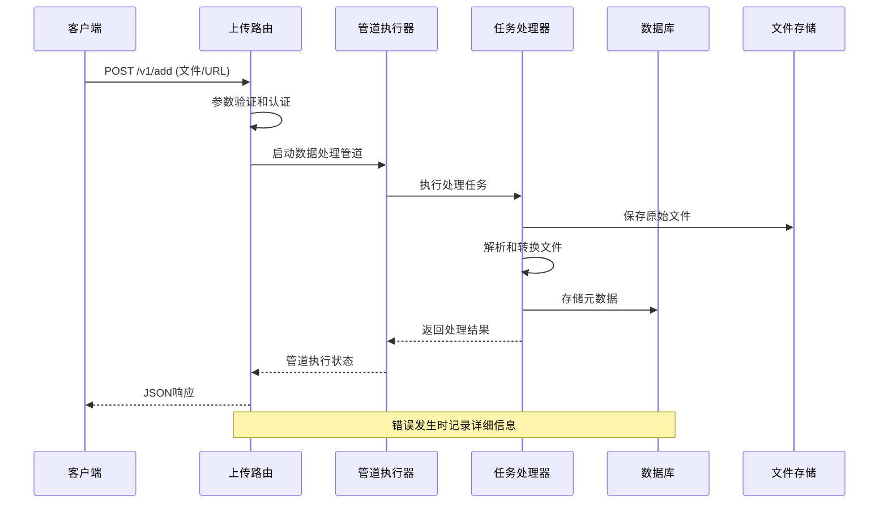
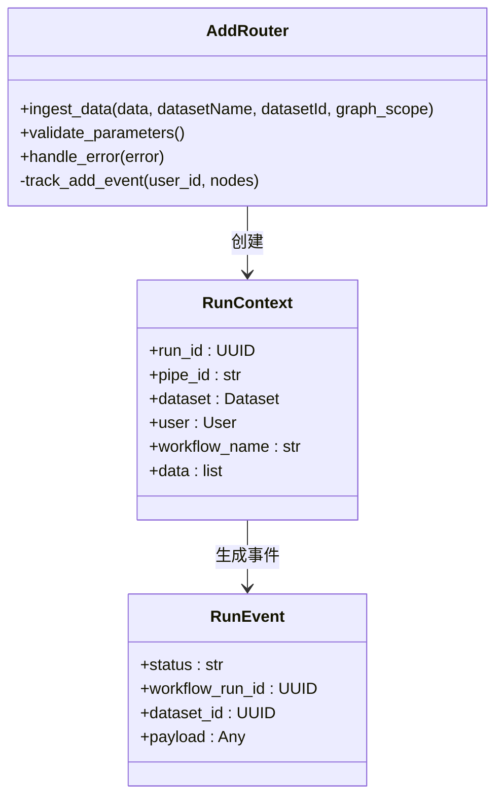
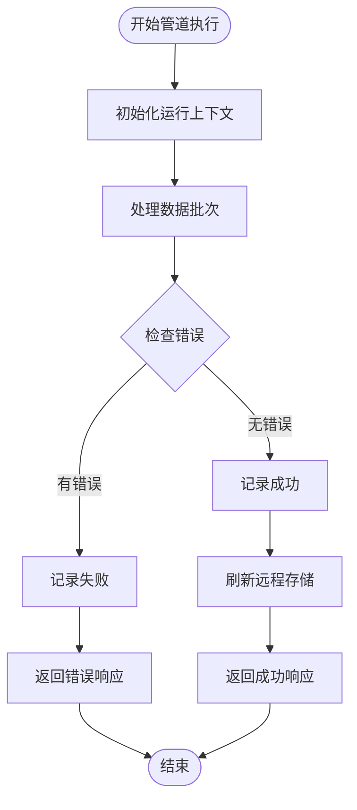
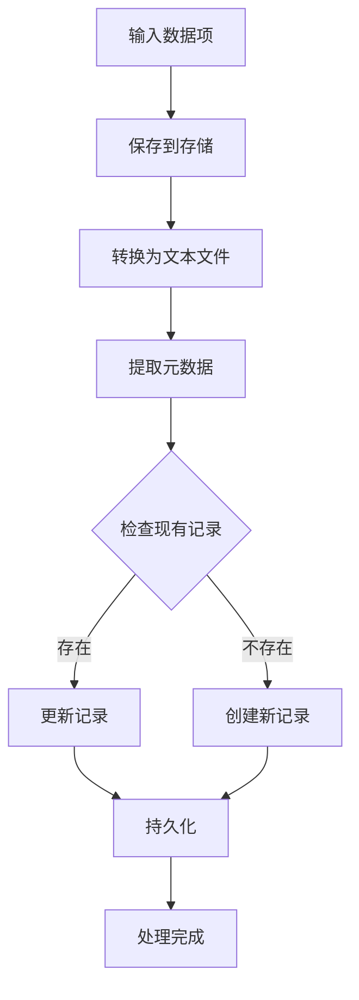
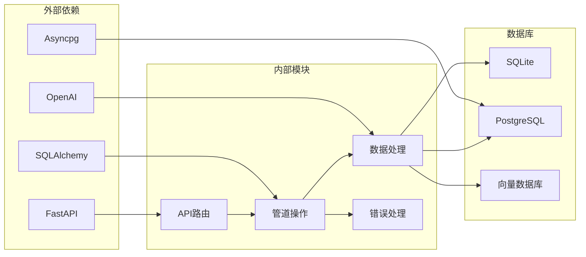
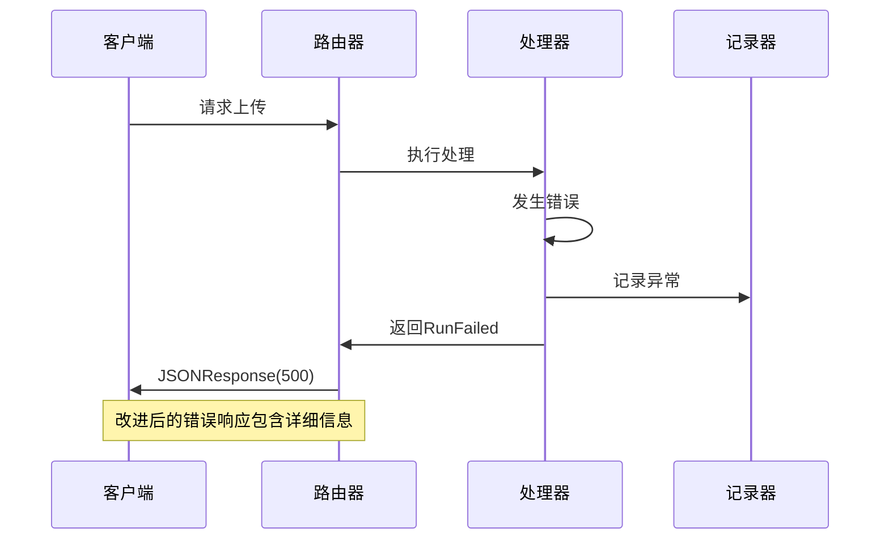

# 上传故障排除指南

<cite>
**本文档引用的文件**
- [UPLOAD_TROUBLESHOOTING.md](file://UPLOAD_TROUBLESHOOTING.md)
- [diagnose_upload.py](file://diagnose_upload.py)
- [get_add_router.py](file://m_flow/api/v1/add/routers/get_add_router.py)
- [add.py](file://m_flow/api/v1/add/add.py)
- [run_tasks.py](file://m_flow/pipeline/operations/run_tasks.py)
- [db_concurrency.py](file://m_flow/pipeline/operations/db_concurrency.py)
- [record_run_failure.py](file://m_flow/pipeline/operations/record_run_failure.py)
- [RunEvent.py](file://m_flow/pipeline/models/RunEvent.py)
- [exceptions.py](file://m_flow/exceptions/exceptions.py)
- [ingest_data.py](file://m_flow/ingestion/pipeline_tasks/ingest_data.py)
- [pipeline.py](file://m_flow/pipeline/operations/pipeline.py)
- [loaders/__init__.py](file://m_flow/shared/loaders/__init__.py)
</cite>

## 目录
1. [简介](#简介)
2. [项目结构](#项目结构)
3. [核心组件](#核心组件)
4. [架构概览](#架构概览)
5. [详细组件分析](#详细组件分析)
6. [依赖关系分析](#依赖关系分析)
7. [性能考虑](#性能考虑)
8. [故障排除指南](#故障排除指南)
9. [结论](#结论)

## 简介

本指南专门针对M-Flow平台的文件上传故障进行系统性排查和解决。该平台是一个基于知识图谱的数据处理系统，支持多种文件格式的上传、解析和知识图谱构建。

根据已知的问题现象，用户在前端上传4个文件时遇到后端返回`409 Conflict`错误，日志显示`step=Failed`的状态。本指南将提供完整的故障排除流程和解决方案。

## 项目结构

M-Flow平台采用模块化架构设计，主要分为以下几个核心层次：



**图表来源**
- [get_add_router.py:62-143](file://m_flow/api/v1/add/routers/get_add_router.py#L62-L143)
- [run_tasks.py:189-239](file://m_flow/pipeline/operations/run_tasks.py#L189-L239)

**章节来源**
- [get_add_router.py:1-143](file://m_flow/api/v1/add/routers/get_add_router.py#L1-L143)
- [run_tasks.py:1-239](file://m_flow/pipeline/operations/run_tasks.py#L1-L239)

## 核心组件

### 上传路由组件
上传功能通过FastAPI路由实现，支持文件上传、URL导入和GitHub仓库导入等多种数据源。

### 管道执行组件
负责协调整个数据处理流程，包括任务编排、并发控制和错误处理。

### 数据处理组件
处理各种文件格式的解析、转换和元数据提取。

### 错误处理组件
统一的异常管理和错误记录机制。

**章节来源**
- [add.py:147-249](file://m_flow/api/v1/add/add.py#L147-L249)
- [run_tasks.py:189-239](file://m_flow/pipeline/operations/run_tasks.py#L189-L239)

## 架构概览



**图表来源**
- [get_add_router.py:71-141](file://m_flow/api/v1/add/routers/get_add_router.py#L71-L141)
- [run_tasks.py:223-238](file://m_flow/pipeline/operations/run_tasks.py#L223-L238)

## 详细组件分析

### 上传路由组件分析

上传路由组件是整个上传流程的入口点，负责接收和验证用户请求。



**图表来源**
- [get_add_router.py:62-143](file://m_flow/api/v1/add/routers/get_add_router.py#L62-L143)
- [run_tasks.py:51-87](file://m_flow/pipeline/operations/run_tasks.py#L51-L87)

**章节来源**
- [get_add_router.py:71-141](file://m_flow/api/v1/add/routers/get_add_router.py#L71-L141)

### 管道执行组件分析

管道执行组件负责协调整个数据处理流程，包括任务编排、并发控制和错误处理。



**图表来源**
- [run_tasks.py:120-175](file://m_flow/pipeline/operations/run_tasks.py#L120-L175)
- [record_run_failure.py:18-64](file://m_flow/pipeline/operations/record_run_failure.py#L18-L64)

**章节来源**
- [run_tasks.py:189-239](file://m_flow/pipeline/operations/run_tasks.py#L189-L239)

### 数据处理组件分析

数据处理组件负责各种文件格式的解析、转换和元数据提取。



**图表来源**
- [ingest_data.py:90-207](file://m_flow/ingestion/pipeline_tasks/ingest_data.py#L90-L207)

**章节来源**
- [ingest_data.py:214-302](file://m_flow/ingestion/pipeline_tasks/ingest_data.py#L214-L302)

## 依赖关系分析



**图表来源**
- [db_concurrency.py:31-46](file://m_flow/pipeline/operations/db_concurrency.py#L31-L46)
- [exceptions.py:20-76](file://m_flow/exceptions/exceptions.py#L20-L76)

**章节来源**
- [db_concurrency.py:1-200](file://m_flow/pipeline/operations/db_concurrency.py#L1-L200)
- [exceptions.py:1-148](file://m_flow/exceptions/exceptions.py#L1-L148)

## 性能考虑

### 并发控制策略

系统根据数据库类型自动调整并发策略：

- **SQLite**: 强制串行执行（并发=1），避免数据库锁定
- **PostgreSQL**: 高并发执行（默认并发=20）
- **可配置**: 通过环境变量覆盖默认设置

### 批处理优化

- 默认批处理大小：20个数据项
- 支持增量加载，跳过已处理的文件
- 缓存机制减少重复处理

## 故障排除指南

### 常见问题诊断

#### 1. LLM API调用失败

**症状识别**:
- 错误信息包含"LLM"、"API key"、"OpenAI"、"timeout"等关键词

**解决方案**:
1. 检查.env文件中的LLM配置
2. 验证API Key的有效性
3. 测试LLM连接

**章节来源**
- [UPLOAD_TROUBLESHOOTING.md:42-60](file://UPLOAD_TROUBLESHOOTING.md#L42-L60)

#### 2. SQLite数据库锁定

**症状识别**:
- 日志包含"database is locked"、"OperationalError"

**解决方案**:
1. **临时方案**: 串行上传（一次只上传一个文件）
2. **推荐方案**: 切换到PostgreSQL
3. **代码层面**: 增加重试机制

**章节来源**
- [UPLOAD_TROUBLESHOOTING.md:61-76](file://UPLOAD_TROUBLESHOOTING.md#L61-L76)

#### 3. 文件格式问题

**症状识别**:
- 错误信息包含"parse"、"decode"、"unsupported format"

**解决方案**:
1. 检查支持的文件格式
2. 尝试上传简单的.txt文件测试
3. 检查文件是否损坏或加密

**章节来源**
- [UPLOAD_TROUBLESHOOTING.md:77-89](file://UPLOAD_TROUBLESHOOTING.md#L77-L89)

#### 4. 内存不足

**症状识别**:
- 错误信息包含"MemoryError"、"OOM"、"killed"

**解决方案**:
1. 减小批量大小（items_per_batch=5）
2. 增加系统内存或关闭其他应用

**章节来源**
- [UPLOAD_TROUBLESHOOTING.md:90-101](file://UPLOAD_TROUBLESHOOTING.md#L90-L101)

#### 5. Pipeline任务执行失败

**症状识别**:
- 错误信息包含具体的任务名称（如"ingest_data"、"resolve_data_directories"）

**解决方案**:
- 查看完整的错误堆栈，定位到具体的任务阶段

**章节来源**
- [UPLOAD_TROUBLESHOOTING.md:102-107](file://UPLOAD_TROUBLESHOOTING.md#L102-L107)

### 调试步骤

#### 步骤1: 重启后端服务
```bash
cd 
uv run python -m m_flow.api.client
```

#### 步骤2: 启用详细日志
在.env文件中添加：
```
LOG_LEVEL=DEBUG
```

#### 步骤3: 检查数据库状态
```bash
uv run python -c "
import asyncio
from m_flow.adapters.relational import get_db_adapter
from m_flow.pipeline.models import WorkflowRun

async def check():
    engine = get_db_adapter()
    async with engine.get_async_session() as session:
        from sqlalchemy import select
        stmt = select(WorkflowRun).order_by(WorkflowRun.created_at.desc()).limit(5)
        result = await session.execute(stmt)
        for run in result.scalars().all():
            print(f'Run: {run.workflow_run_id}')
            print(f'Status: {run.status}')
            print(f'Detail: {run.run_detail}')
            print('---')

asyncio.run(check())
"
```

#### 步骤4: 单文件测试
尝试只上传1个文件，确认是否是并发问题

**章节来源**
- [UPLOAD_TROUBLESHOOTING.md:108-155](file://UPLOAD_TROUBLESHOOTING.md#L108-L155)

### 快速诊断脚本

系统提供了完整的诊断工具，可以自动检测常见问题：

```python
# diagnose_upload.py
import os
from dotenv import load_dotenv

load_dotenv()

print("=== M-Flow Upload Diagnosis ===\n")

# 1. 检查LLM配置
print("1. LLM Configuration:")
print(f"   LLM_PROVIDER: {os.getenv('LLM_PROVIDER', 'NOT SET')}")
print(f"   LLM_MODEL: {os.getenv('LLM_MODEL', 'NOT SET')}")
print(f"   LLM_API_KEY: {'SET' if os.getenv('LLM_API_KEY') else 'NOT SET'}")

# 2. 检查数据库
print("\n2. Database Configuration:")
db_url = os.getenv('DATABASE_URL', 'sqlite')
print(f"   DATABASE_URL: {db_url}")
if 'sqlite' in db_url.lower():
    print("   ⚠️  使用SQLite - 并发支持有限")

# 3. 检查环境
print("\n3. Environment:")
print(f"   Python: {os.sys.version}")
print(f"   Platform: {os.sys.platform}")

# 4. 测试LLM连接
print("\n4. LLM Connection Test:")
api_key = os.getenv('LLM_API_KEY')
if api_key:
    print("   API key已设置，但未实现连接测试")
else:
    print("   ❌ LLM_API_KEY未设置 - 这会导致管道失败")

print("\n=== 诊断完成 ===")
```

**章节来源**
- [diagnose_upload.py:1-259](file://diagnose_upload.py#L1-L259)

### 错误响应改进

系统已改进错误响应机制：



**图表来源**
- [get_add_router.py:120-140](file://m_flow/api/v1/add/routers/get_add_router.py#L120-L140)

**章节来源**
- [UPLOAD_TROUBLESHOOTING.md:10-20](file://UPLOAD_TROUBLESHOOTING.md#L10-L20)

## 结论

M-Flow平台的上传故障排除需要系统性的方法：

1. **快速诊断**: 使用提供的诊断脚本自动检测配置问题
2. **分层排查**: 从API层到数据层逐层定位问题
3. **针对性解决**: 根据不同类型的错误采取相应的解决方案
4. **预防措施**: 通过配置优化避免常见问题

建议在生产环境中：
- 使用PostgreSQL替代SQLite以获得更好的并发性能
- 配置适当的批量大小和缓存策略
- 建立完善的监控和日志记录机制
- 定期进行系统健康检查

通过遵循本指南的步骤和最佳实践，应该能够有效解决大部分上传相关的问题，并提高系统的稳定性和可靠性。