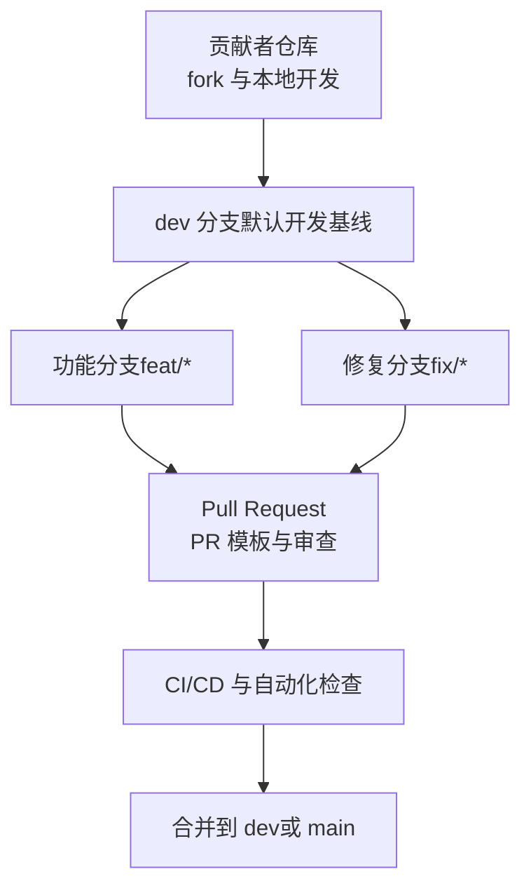
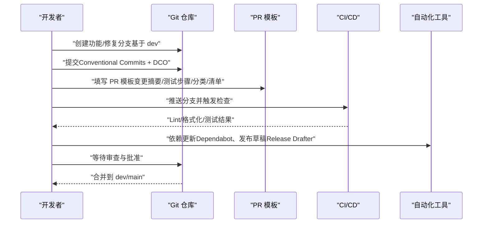
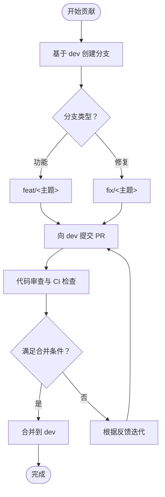
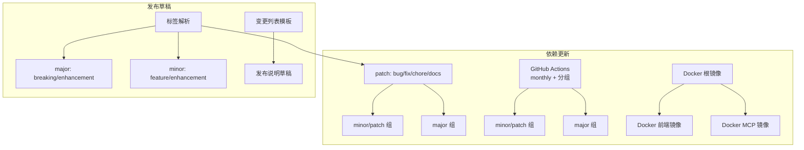

# 代码贡献规范

<cite>
**本文引用的文件**
- [CONTRIBUTING.md](file://CONTRIBUTING.md)
- [.github/pull_request_template.md](file://.github/pull_request_template.md)
- [CODE_OF_CONDUCT.md](file://CODE_OF_CONDUCT.md)
- [SECURITY.md](file://SECURITY.md)
- [pyproject.toml](file://pyproject.toml)
- [.pre-commit-config.yaml](file://.pre-commit-config.yaml)
- [Makefile](file://Makefile)
- [.github/release-drafter.yml](file://.github/release-drafter.yml)
- [.github/dependabot.yml](file://.github/dependabot.yml)
</cite>

## 目录
1. [简介](#简介)
2. [项目结构](#项目结构)
3. [核心组件](#核心组件)
4. [架构总览](#架构总览)
5. [详细组件分析](#详细组件分析)
6. [依赖分析](#依赖分析)
7. [性能考虑](#性能考虑)
8. [故障排查指南](#故障排查指南)
9. [结论](#结论)
10. [附录](#附录)

## 简介
本文件为 M-flow 的代码贡献规范，面向所有希望参与 M-flow 开发与维护的贡献者。内容覆盖分支管理策略、提交与 PR 规范、问题报告模板与标签、代码审查与合并条件、社区行为准则与安全问题上报流程，并提供实际 PR 示例与最佳实践建议，帮助贡献者高效协作。

## 项目结构
M-flow 采用多模块仓库组织方式，包含后端主工程、前端工程、MCP 服务、工作流与部署脚本等。贡献流程围绕 Git 分支与 GitHub 工作流展开，遵循统一的提交规范与代码质量工具链。

图表来源
- [CONTRIBUTING.md:42-46](file://CONTRIBUTING.md#L42-L46)
- [CONTRIBUTING.md:67-81](file://CONTRIBUTING.md#L67-L81)

章节来源
- [CONTRIBUTING.md:42-46](file://CONTRIBUTING.md#L42-L46)
- [CONTRIBUTING.md:67-81](file://CONTRIBUTING.md#L67-L81)

## 核心组件
- 分支与 PR 策略：始终从 dev 创建功能/修复分支，向 dev 提交 PR；直接向 main 提交 PR 将被拒绝。
- 提交规范：遵循 Conventional Commits；强制 DCO 签名；提交信息需遵循模板化要求。
- 代码质量：统一使用 Ruff 进行检查与格式化；预提交钩子自动执行；Makefile 提供常用命令。
- 自动化与发布：Release Drafter 基于标签自动生成变更日志；Dependabot 定期生成依赖更新 PR。
- 行为与安全：遵循 Contributor Covenant 行为准则；安全漏洞通过私有渠道上报。

章节来源
- [CONTRIBUTING.md:2](file://CONTRIBUTING.md#L2)
- [CONTRIBUTING.md:84-96](file://CONTRIBUTING.md#L84-L96)
- [CONTRIBUTING.md:69-76](file://CONTRIBUTING.md#L69-L76)
- [.github/pull_request_template.md:1-35](file://.github/pull_request_template.md#L1-L35)
- [.pre-commit-config.yaml:1-22](file://.pre-commit-config.yaml#L1-L22)
- [Makefile:30-36](file://Makefile#L30-L36)
- [.github/release-drafter.yml:1-39](file://.github/release-drafter.yml#L1-L39)
- [.github/dependabot.yml:1-90](file://.github/dependabot.yml#L1-L90)

## 架构总览
下图展示从本地开发到 PR 合入的关键流程与自动化工具交互：

图表来源
- [CONTRIBUTING.md:42-46](file://CONTRIBUTING.md#L42-L46)
- [CONTRIBUTING.md:67-81](file://CONTRIBUTING.md#L67-L81)
- [.github/pull_request_template.md:1-35](file://.github/pull_request_template.md#L1-L35)
- [.github/dependabot.yml:1-90](file://.github/dependabot.yml#L1-L90)
- [.github/release-drafter.yml:1-39](file://.github/release-drafter.yml#L1-L39)

## 详细组件分析

### 分支管理策略
- 默认基线：dev
- 功能分支：以 feat/ 前缀命名
- 修复分支：以 fix/ 前缀命名
- PR 目标：统一提交至 dev；直接向 main 提交的 PR 将被拒绝
- 合并：由维护者在确保质量与合规后合并

图表来源
- [CONTRIBUTING.md:42-46](file://CONTRIBUTING.md#L42-L46)
- [CONTRIBUTING.md:2](file://CONTRIBUTING.md#L2)

章节来源
- [CONTRIBUTING.md:2](file://CONTRIBUTING.md#L2)
- [CONTRIBUTING.md:42-46](file://CONTRIBUTING.md#L42-L46)

### 代码提交规范
- 提交信息格式：遵循 Conventional Commits，支持前缀包括 feat、fix、docs、refactor、test、chore 等
- DCO 签名：使用 -s 参数进行签名，确保开发者证书符合要求
- 提交模板：建议在提交信息中体现变更类别、动机与影响范围

章节来源
- [CONTRIBUTING.md:84-96](file://CONTRIBUTING.md#L84-L96)
- [CONTRIBUTING.md:69-76](file://CONTRIBUTING.md#L69-L76)

### Pull Request 流程与模板
- PR 模板字段
  - 变更摘要与动机
  - 本地测试步骤与结果
  - 变更分类（Bug 修复、特性、重构、CI/构建、文档、破坏性变更）
  - 质量清单（全量测试通过、新增代码有测试、提交信息符合 Conventional Commits、文档已更新、无无关改动）
  - DCO 声明
- 审查标准
  - 代码正确性与可读性
  - 测试覆盖与边界场景
  - 性能与安全性影响评估
  - 文档与注释完整性
- 合并条件
  - 通过 CI 检查
  - 至少一名维护者批准
  - 无阻塞标签（如 WIP、需要修改等）

章节来源
- [.github/pull_request_template.md:1-35](file://.github/pull_request_template.md#L1-L35)

### 问题报告规范
- Bug 报告
  - 最小可复现示例
  - 环境信息（版本、依赖、操作系统）
  - 期望行为与实际行为
  - 日志与截图（如有）
- 功能请求
  - 使用场景描述
  - 预期行为与收益
  - 可选：兼容性与迁移成本评估
- 标签使用
  - good first issue：适合新手
  - bug：缺陷
  - enhancement：功能请求
  - documentation：文档改进
  - help wanted：需要社区协助

章节来源
- [CONTRIBUTING.md:17-24](file://CONTRIBUTING.md#L17-L24)
- [CONTRIBUTING.md:97-106](file://CONTRIBUTING.md#L97-L106)

### 社区行为准则与安全上报
- 行为准则
  - 尊重包容、专业建设性、积极反馈、开放提问
  - 公开/私下骚扰、人身攻击、隐私泄露等不可接受
- 安全问题上报
  - 不要在公开 Issue 中披露漏洞
  - 优先使用 GitHub Security Advisories 或邮件联系
  - 包含漏洞描述、复现步骤、潜在影响与建议修复
  - 响应时间：48 小时内确认，5 个工作日内初审，关键问题 30 天内解决
  - 范围：后端、前端、MCP 服务器、官方镜像及受影响依赖

章节来源
- [CODE_OF_CONDUCT.md:1-55](file://CODE_OF_CONDUCT.md#L1-L55)
- [SECURITY.md:1-48](file://SECURITY.md#L1-L48)

### 实际 PR 示例与最佳实践
- 示例 PR 类型
  - 新特性：feat(api): 添加新的检索接口（含单元测试与文档）
  - 缺陷修复：fix(memory): 修复并发写入导致的数据不一致
  - 文档改进：docs: 修正安装与部署指引中的错误
  - 重构：refactor(pipeline): 优化流水线执行路径，提升可观测性
  - 测试：test: 增加边缘场景覆盖
  - 构建：chore: 更新依赖版本与 CI 步骤
- 最佳实践
  - 单一职责：每个 PR 解决一个明确问题或实现一个功能点
  - 提交粒度：按功能拆分提交，便于审查与回滚
  - 描述清晰：PR 模板逐项填写，测试步骤具体可复现
  - 及时同步：定期 rebase dev，保持基线最新
  - 避免无关改动：仅修改与主题相关的文件

章节来源
- [CONTRIBUTING.md:84-96](file://CONTRIBUTING.md#L84-L96)
- [.github/pull_request_template.md:1-35](file://.github/pull_request_template.md#L1-L35)

## 依赖分析
- 依赖更新策略
  - Python 依赖：按月分组更新 minor/patch，major 单独 PR，限制同时打开 PR 数量
  - GitHub Actions：同上策略，SHA 固定动作也纳入同一组
  - Docker：分别针对根镜像与前端/MCP 子项目设置独立更新计划
- 发布草稿
  - 基于标签自动分类：major/minor/patch；按类别生成章节标题
  - 排除 skip-changelog 标签；自动生成完整对比链接

图表来源
- [.github/dependabot.yml:1-90](file://.github/dependabot.yml#L1-L90)
- [.github/release-drafter.yml:1-39](file://.github/release-drafter.yml#L1-L39)

章节来源
- [.github/dependabot.yml:1-90](file://.github/dependabot.yml#L1-L90)
- [.github/release-drafter.yml:1-39](file://.github/release-drafter.yml#L1-L39)

## 性能考虑
- 提交前本地检查
  - 使用 Makefile 的 test/lint 目标快速验证
  - 预提交钩子自动修复常见问题（空白字符、格式、YAML、大文件、冲突标记）
- CI 优化
  - 依赖更新 PR 分组减少审查负担
  - 严格测试与覆盖率配置，避免回归
- 文档与示例
  - 使用 Makefile 的文档构建与本地服务目标，确保文档一致性

章节来源
- [Makefile:30-36](file://Makefile#L30-L36)
- [.pre-commit-config.yaml:1-22](file://.pre-commit-config.yaml#L1-L22)
- [pyproject.toml:296-323](file://pyproject.toml#L296-L323)

## 故障排查指南
- 提交失败（DCO/签名）
  - 确保使用 -s 参数提交；检查本地配置是否正确映射到提交者身份
- PR 被拒
  - 未遵循 Conventional Commits 或未填写 PR 模板关键项
  - 未通过 CI 检查（测试失败、Lint/格式化未通过）
- 依赖更新冲突
  - 查看 Dependabot 生成的 PR，确认分组策略与版本范围
- 安全问题上报
  - 通过 GitHub Security Advisories 或邮件联系，避免公开披露

章节来源
- [CONTRIBUTING.md:69-76](file://CONTRIBUTING.md#L69-L76)
- [.github/pull_request_template.md:25-34](file://.github/pull_request_template.md#L25-L34)
- [.github/dependabot.yml:1-90](file://.github/dependabot.yml#L1-L90)
- [SECURITY.md:10-48](file://SECURITY.md#L10-L48)

## 结论
本规范旨在建立清晰、高效且可持续的贡献流程。请所有贡献者在提交前阅读并遵循上述规则，共同维护 M-flow 的质量与社区氛围。对于未尽事宜，欢迎在 Issue 中讨论并更新本规范。

## 附录
- 快速参考
  - 分支：基于 dev 创建 feat/* 或 fix/*
  - 提交：遵循 Conventional Commits 并签名 DCO
  - PR：填写模板并满足质量清单
  - 审查：关注正确性、测试、性能与文档
  - 安全：私有渠道上报，避免公开披露