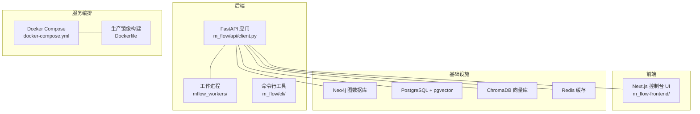
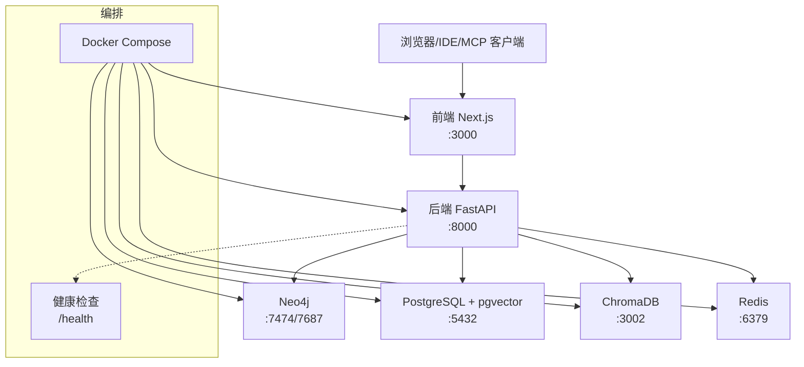
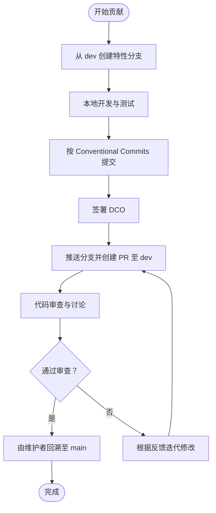
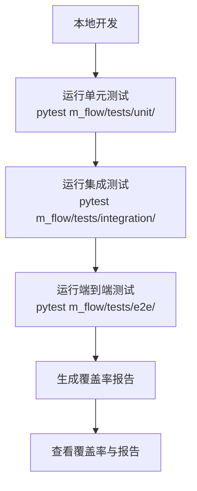
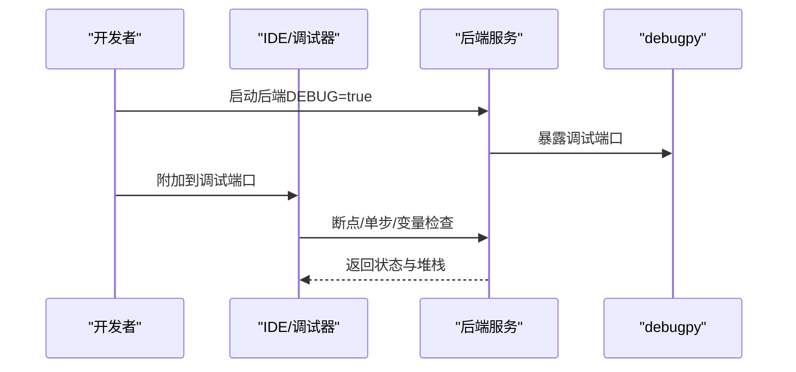
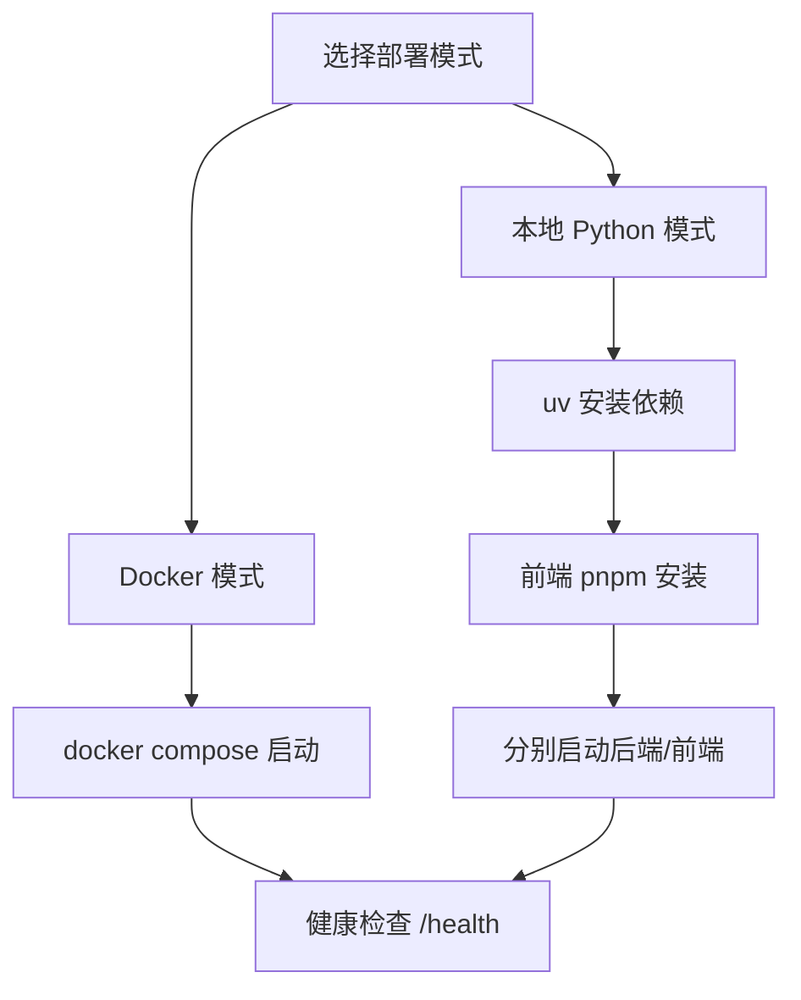
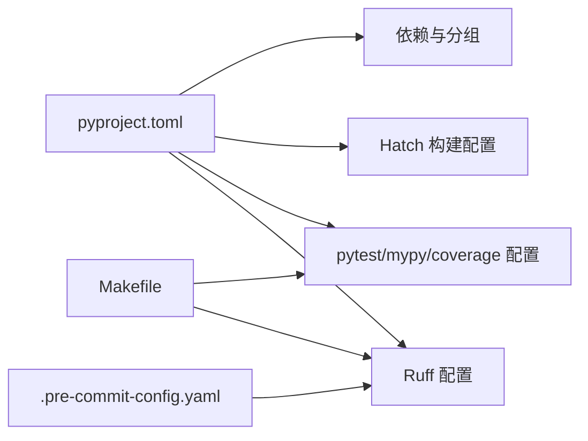

# 开发指南

<cite>
**本文引用的文件**
- [CONTRIBUTING.md](file://CONTRIBUTING.md)
- [.github/pull_request_template.md](file://.github/pull_request_template.md)
- [pyproject.toml](file://pyproject.toml)
- [Makefile](file://Makefile)
- [quickstart.sh](file://quickstart.sh)
- [quickstart.ps1](file://quickstart.ps1)
- [Dockerfile](file://Dockerfile)
- [docker-compose.yml](file://docker-compose.yml)
- [.pre-commit-config.yaml](file://.pre-commit-config.yaml)
- [.mergify.yml](file://.mergify.yml)
- [m_flow/cli/debug.py](file://m_flow/cli/debug.py)
- [SECURITY.md](file://SECURITY.md)
- [NOTICE.md](file://NOTICE.md)
</cite>

## 目录
1. [简介](#简介)
2. [项目结构](#项目结构)
3. [核心组件](#核心组件)
4. [架构总览](#架构总览)
5. [详细组件分析](#详细组件分析)
6. [依赖关系分析](#依赖关系分析)
7. [性能考虑](#性能考虑)
8. [故障排查指南](#故障排查指南)
9. [结论](#结论)
10. [附录](#附录)

## 简介
本开发指南面向贡献者与维护者，系统性阐述 M-flow 的代码贡献规范、测试策略、调试与开发工具、代码审查流程、开发环境搭建、性能分析与优化、扩展开发以及文档维护规范，并提供常见问题的解决方案与最佳实践。内容基于仓库中的贡献文档、构建与部署脚本、CI/CD 配置与示例脚本进行归纳总结。

## 项目结构
M-flow 采用多模块分层组织：后端主框架、前端控制台、MCP 服务、工作进程、适配器与数据库、测试套件、文档与示例等。开发与运行可通过 Docker Compose 快速拉起，或通过本地 Python 环境启动。

图表来源
- [docker-compose.yml:1-227](file://docker-compose.yml#L1-L227)
- [Dockerfile:1-90](file://Dockerfile#L1-L90)

章节来源
- [docker-compose.yml:1-227](file://docker-compose.yml#L1-L227)
- [Dockerfile:1-90](file://Dockerfile#L1-L90)

## 核心组件
- 贡献与分支管理：遵循从 dev 分支派生、PR 提交至 dev、主分支仅通过回溯合并的策略；使用 Conventional Commits 规范的提交信息前缀。
- 测试体系：统一使用 pytest，按单元、集成、端到端分层；支持覆盖率统计与类型检查；提供一键测试与格式化任务。
- 代码质量：Ruff 统一风格与静态检查；pre-commit 钩子在提交前自动执行格式化与基础校验；Mergify 自动化回溯与标签处理。
- 构建与发布：Hatch 构建后端包；Docker 多阶段构建生产镜像；Makefile 提供常用开发任务；快速启动脚本覆盖 Linux/macOS/Windows。
- 安全与合规：安全漏洞报告渠道与响应时间线；版权声明与第三方许可清单。

章节来源
- [CONTRIBUTING.md:1-120](file://CONTRIBUTING.md#L1-L120)
- [pyproject.toml:296-323](file://pyproject.toml#L296-L323)
- [.pre-commit-config.yaml:1-22](file://.pre-commit-config.yaml#L1-L22)
- [.mergify.yml:1-30](file://.mergify.yml#L1-L30)
- [Makefile:1-49](file://Makefile#L1-L49)
- [quickstart.sh:1-326](file://quickstart.sh#L1-L326)
- [quickstart.ps1:1-278](file://quickstart.ps1#L1-L278)

## 架构总览
下图展示后端 API、前端控制台、MCP 服务与多种数据存储之间的交互关系，以及容器编排与健康检查。

图表来源
- [docker-compose.yml:17-227](file://docker-compose.yml#L17-L227)

章节来源
- [docker-compose.yml:17-227](file://docker-compose.yml#L17-L227)

## 详细组件分析

### 贡献与分支管理
- 分支策略
  - 始终从 dev 分支创建特性分支，PR 一律提交至 dev；直接向 main 提交 PR 将被拒绝。
  - 使用 Conventional Commits 规范的提交信息前缀（feat、fix、docs、refactor、test、chore）。
- 提交与审查
  - 强制 DCO（开发者证书），提交时需包含签名。
  - PR 模板包含变更摘要、本地验证步骤、变更分类、清单与 DCO 声明。
- 自动化
  - Mergify 支持将已合并 PR 回溯至 main，并对 Dependabot PR 自动打标签。

图表来源
- [CONTRIBUTING.md:67-96](file://CONTRIBUTING.md#L67-L96)
- [.github/pull_request_template.md:1-35](file://.github/pull_request_template.md#L1-L35)
- [.mergify.yml:8-21](file://.mergify.yml#L8-L21)

章节来源
- [CONTRIBUTING.md:25-96](file://CONTRIBUTING.md#L25-L96)
- [.github/pull_request_template.md:1-35](file://.github/pull_request_template.md#L1-L35)
- [.mergify.yml:1-30](file://.mergify.yml#L1-L30)

### 测试策略
- 测试框架与分层
  - 使用 pytest，测试路径为 m_flow/tests；支持 asyncio 模式；过滤弃用警告。
  - Makefile 提供 test 目标，统一执行单元测试。
- 覆盖率与类型检查
  - 覆盖率统计源码范围与忽略规则在 pyproject.toml 中定义。
  - mypy 类型检查配置排除测试与示例目录。
- 本地运行
  - 快速启动脚本提供一键安装依赖与启动后端/前端的能力，便于端到端验证。
- 端到端与集成
  - 仓库包含 e2e 与 integration 测试目录，建议结合 Docker Compose 启动完整栈进行验证。

图表来源
- [pyproject.toml:296-323](file://pyproject.toml#L296-L323)
- [Makefile:30-31](file://Makefile#L30-L31)
- [quickstart.sh:272-307](file://quickstart.sh#L272-L307)
- [quickstart.ps1:233-261](file://quickstart.ps1#L233-L261)

章节来源
- [pyproject.toml:296-323](file://pyproject.toml#L296-L323)
- [Makefile:30-31](file://Makefile#L30-L31)
- [quickstart.sh:272-307](file://quickstart.sh#L272-L307)
- [quickstart.ps1:233-261](file://quickstart.ps1#L233-L261)

### 调试技巧与开发工具
- CLI 调试模式
  - 提供模块级开关以控制 CLI 输出的详细程度，便于定位命令行相关问题。
- IDE/编辑器与断点调试
  - Docker Compose 默认开启 debugpy 端口映射（后端与 MCP 各自独立端口），可在 IDE 中附加调试会话。
- 性能分析
  - 可结合 Python 内置 cProfile 或第三方分析工具在本地或容器中进行性能剖析。
  - 建议在隔离场景（如单测或小规模数据集）中进行热点定位与瓶颈识别。

图表来源
- [docker-compose.yml:28-35](file://docker-compose.yml#L28-L35)
- [m_flow/cli/debug.py:12-47](file://m_flow/cli/debug.py#L12-L47)

章节来源
- [docker-compose.yml:28-35](file://docker-compose.yml#L28-L35)
- [m_flow/cli/debug.py:1-47](file://m_flow/cli/debug.py#L1-L47)

### 代码审查标准与流程
- 审查清单要点
  - 是否符合 Conventional Commits 规范
  - 是否通过本地测试与格式化
  - 是否更新了相关文档与变更日志
  - 是否引入不必要依赖或破坏向后兼容性
- 模板字段
  - 变更摘要、测试步骤、变更分类、是否包含不相关改动、DCO 声明等。

章节来源
- [.github/pull_request_template.md:1-35](file://.github/pull_request_template.md#L1-L35)
- [CONTRIBUTING.md:67-96](file://CONTRIBUTING.md#L67-L96)

### 开发环境搭建
- 依赖安装
  - 推荐使用 uv 进行同步安装，支持 extras 与可选依赖组（如 api、dev、postgres、neo4j 等）。
- 虚拟环境与 IDE
  - 本地 Python 环境建议使用 uv 创建隔离环境；IDE 可直接加载项目根目录。
- 快速启动
  - Linux/macOS 使用 quickstart.sh；Windows 使用 quickstart.ps1；两者均支持 Docker 与本地两种模式，自动检测端口占用并引导配置 LLM 凭据。

图表来源
- [quickstart.sh:114-141](file://quickstart.sh#L114-L141)
- [quickstart.ps1:101-121](file://quickstart.ps1#L101-L121)
- [docker-compose.yml:17-104](file://docker-compose.yml#L17-L104)

章节来源
- [quickstart.sh:1-326](file://quickstart.sh#L1-L326)
- [quickstart.ps1:1-278](file://quickstart.ps1#L1-L278)
- [docker-compose.yml:1-227](file://docker-compose.yml#L1-L227)

### 性能分析与优化
- CPU 与内存
  - 在容器中启用健康检查与资源限制，观察服务稳定性；对高并发场景调整容器资源上限。
- I/O 优化
  - 数据库连接池与异步会话配置；缓存层（Redis）合理设置过期与键空间；向量库与图库的索引与查询参数调优。
- 分析手段
  - 使用 debugpy 进行断点分析；对关键路径进行基准测试与回归对比；关注慢查询与阻塞操作。

章节来源
- [docker-compose.yml:38-47](file://docker-compose.yml#L38-L47)
- [pyproject.toml:45-51](file://pyproject.toml#L45-L51)

### 扩展开发指南
- 新功能开发
  - 基于现有模块（如 ingestion、memory、retrieval、pipeline）扩展能力；遵循统一的异常与日志规范。
- 插件系统与适配器
  - 通过适配器接口抽象外部系统（图库、向量库、关系库），新增适配器需实现统一接口并补充测试。
- API 扩展
  - 在 FastAPI 路由层增加新端点，确保 DTO 校验与权限控制；保持版本化与向后兼容。

章节来源
- [pyproject.toml:99-124](file://pyproject.toml#L99-L124)
- [docker-compose.yml:106-175](file://docker-compose.yml#L106-L175)

### 文档编写规范与维护
- 文档维护
  - 使用 MkDocs（在 Makefile 中提供 build/serve 目标）维护文档站点；同步基准测试 README 到 docs。
- 版本与版权
  - NOTICE 中列示第三方依赖与许可证；SECURITY 提供漏洞上报流程与响应时间线。

章节来源
- [Makefile:37-48](file://Makefile#L37-L48)
- [NOTICE.md:1-35](file://NOTICE.md#L1-L35)
- [SECURITY.md:1-48](file://SECURITY.md#L1-L48)

## 依赖关系分析
- 构建与打包
  - 使用 Hatch 构建后端包，wheel 包含 m_flow 与 mflow_workers；排除非源码目录。
- 依赖分组
  - 通过 optional-dependencies 定义不同场景的额外依赖（LLM 提供商、图库、向量库、文档解析、监控等）。
- 代码质量与测试
  - Ruff 作为主要 Linter 与 Formatter；pytest 配置集中于 pyproject.toml；pre-commit 钩子保证提交前一致性。

图表来源
- [pyproject.toml:1-323](file://pyproject.toml#L1-L323)
- [.pre-commit-config.yaml:1-22](file://.pre-commit-config.yaml#L1-L22)
- [Makefile:30-35](file://Makefile#L30-L35)

章节来源
- [pyproject.toml:1-323](file://pyproject.toml#L1-L323)
- [.pre-commit-config.yaml:1-22](file://.pre-commit-config.yaml#L1-L22)
- [Makefile:1-49](file://Makefile#L1-L49)

## 性能考虑
- 容器资源
  - Compose 中为后端与 MCP 设置 CPU 与内存上限，避免资源争用导致的抖动。
- 并发与限流
  - 使用限流与重试机制（tenacity、aiolimiter）提升鲁棒性；注意 LLM 调用的并发与速率限制。
- 存储与索引
  - 向量库与图库的索引策略、批量写入与查询缓存；定期清理与归档历史数据。

章节来源
- [docker-compose.yml:38-84](file://docker-compose.yml#L38-L84)
- [pyproject.toml:63-67](file://pyproject.toml#L63-L67)

## 故障排查指南
- 健康检查失败
  - 通过 /health 端点确认后端可用；若超时，查看容器日志与依赖服务状态。
- 端口冲突
  - 快速启动脚本会检测 8000/3000 端口占用；请释放或更换端口。
- LLM 凭据问题
  - 确认 .env 中 LLM_PROVIDER、LLM_MODEL、LLM_API_KEY 已正确配置。
- 安全问题
  - 发现安全漏洞请勿开公开 Issue，使用 GitHub Security Advisories 或邮件私下报告。

章节来源
- [docker-compose.yml:43-47](file://docker-compose.yml#L43-L47)
- [quickstart.sh:97-112](file://quickstart.sh#L97-L112)
- [quickstart.ps1:87-99](file://quickstart.ps1#L87-L99)
- [SECURITY.md:10-21](file://SECURITY.md#L10-L21)

## 结论
本指南汇总了 M-flow 的贡献流程、测试策略、调试与性能优化、扩展开发与文档维护的关键实践。建议在每次提交前先执行格式化与测试，遵循 Conventional Commits 与审查清单，利用 Docker Compose 与快速启动脚本加速本地验证，并通过 Mergify 与安全政策保障协作效率与质量。

## 附录
- 常用命令
  - 测试：Makefile test；或 uv run pytest m_flow/tests/unit/
  - 格式化与检查：uv run ruff check . 与 uv run ruff format .
  - 文档：mkdocs build/serve（见 Makefile）
- 快速启动
  - Linux/macOS：./quickstart.sh；Windows：.\quickstart.ps1
- 生产镜像
  - Dockerfile 多阶段构建，包含 Alembic 迁移与核心引用包安装

章节来源
- [Makefile:30-48](file://Makefile#L30-L48)
- [quickstart.sh:1-326](file://quickstart.sh#L1-L326)
- [quickstart.ps1:1-278](file://quickstart.ps1#L1-L278)
- [Dockerfile:1-90](file://Dockerfile#L1-L90)