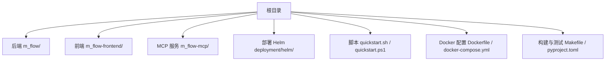
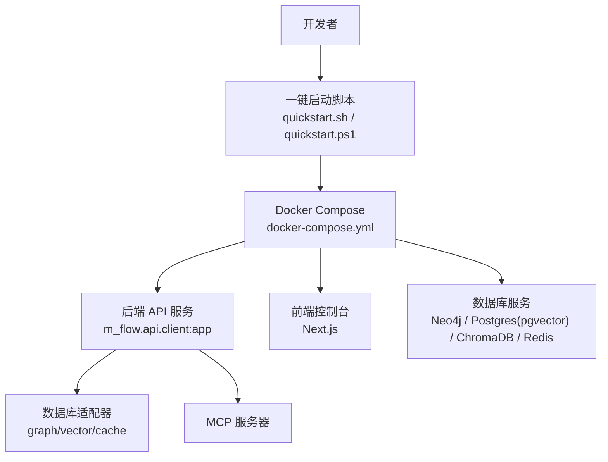
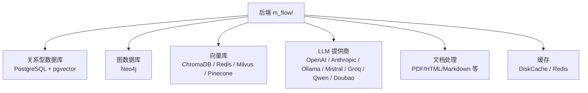

# 开发环境搭建

<cite>
**本文档引用的文件**
- [README.md](file://README.md)
- [pyproject.toml](file://pyproject.toml)
- [Dockerfile](file://Dockerfile)
- [docker-compose.yml](file://docker-compose.yml)
- [quickstart.sh](file://quickstart.sh)
- [quickstart.ps1](file://quickstart.ps1)
- [CONTRIBUTING.md](file://CONTRIBUTING.md)
- [.pre-commit-config.yaml](file://.pre-commit-config.yaml)
- [m_flow-frontend/package.json](file://m_flow-frontend/package.json)
- [m_flow-frontend/tsconfig.json](file://m_flow-frontend/tsconfig.json)
- [m_flow-mcp/pyproject.toml](file://m_flow-mcp/pyproject.toml)
- [deployment/helm/values.yaml](file://deployment/helm/values.yaml)
- [entrypoint.sh](file://entrypoint.sh)
- [Makefile](file://Makefile)
- [alembic.ini](file://alembic.ini)
</cite>

## 目录
1. [简介](#简介)
2. [项目结构](#项目结构)
3. [核心组件](#核心组件)
4. [架构总览](#架构总览)
5. [详细组件分析](#详细组件分析)
6. [依赖关系分析](#依赖关系分析)
7. [性能考虑](#性能考虑)
8. [故障排除指南](#故障排除指南)
9. [结论](#结论)
10. [附录](#附录)

## 简介
本指南面向希望在本地或容器环境中搭建 M-flow 开发与测试环境的开发者。内容覆盖系统要求（Python 版本、操作系统兼容性、硬件资源）、依赖管理（uv 工具、虚拟环境、依赖同步）、开发工具配置（IDE 设置、插件推荐、代码格式化）、数据库环境搭建（本地安装、配置文件、连接测试）、容器化方案（Docker 配置、服务编排、开发容器）、版本控制配置（Git 设置、分支策略、钩子配置），以及完整的环境搭建步骤与故障排除建议。

## 项目结构
M-flow 采用多模块分层组织，后端为 Python 包，前端为 Next.js 应用，另有 MCP 服务器与 Helm 部署模板等。根目录提供一键启动脚本与 Docker 编排文件，便于快速拉起完整栈。

图表来源
- [README.md:344-365](file://README.md#L344-L365)
- [pyproject.toml:1-323](file://pyproject.toml#L1-L323)
- [docker-compose.yml:1-227](file://docker-compose.yml#L1-L227)

章节来源
- [README.md:344-365](file://README.md#L344-L365)
- [pyproject.toml:1-323](file://pyproject.toml#L1-L323)

## 核心组件
- 后端服务：基于 FastAPI 的 API 服务，提供检索、记忆、数据集管理等能力。
- 前端控制台：Next.js 应用，提供可视化操作界面与 Playground。
- MCP 服务器：Model Context Protocol 适配器，将知识图谱能力暴露给 IDE。
- 数据库适配器：支持多种图数据库、向量库与关系型数据库。
- 容器镜像：生产级两阶段构建，包含 Alembic 迁移与健康检查。
- 开发工具链：uv、pytest、ruff、mypy、pre-commit 等。

章节来源
- [README.md:328-365](file://README.md#L328-L365)
- [pyproject.toml:29-73](file://pyproject.toml#L29-L73)
- [Dockerfile:1-90](file://Dockerfile#L1-L90)
- [m_flow-mcp/pyproject.toml:1-31](file://m_flow-mcp/pyproject.toml#L1-L31)

## 架构总览
下图展示开发环境中的典型交互：开发者通过脚本或命令启动后端与前端；后端通过适配器访问数据库；MCP 服务器可选地提供 IDE 集成；容器编排统一管理各服务。

图表来源
- [quickstart.sh:190-307](file://quickstart.sh#L190-L307)
- [docker-compose.yml:17-227](file://docker-compose.yml#L17-L227)
- [Dockerfile:1-90](file://Dockerfile#L1-L90)

章节来源
- [quickstart.sh:190-307](file://quickstart.sh#L190-L307)
- [docker-compose.yml:17-227](file://docker-compose.yml#L17-L227)

## 详细组件分析

### 系统要求与硬件资源
- Python 版本：项目要求 Python >= 3.10；默认开发环境使用 3.11。
- 操作系统：跨平台（Linux/macOS/Windows），但容器内运行基于 Debian slim。
- 硬件资源：建议至少 8GB 内存，CPU 2 核以上；容器默认限制为 4 核 CPU、8GB 内存（后端），MCP 服务 2 核 CPU、6GB 内存。

章节来源
- [pyproject.toml:8](file://pyproject.toml#L8)
- [pyproject.toml:262-264](file://pyproject.toml#L262-L264)
- [docker-compose.yml:38-47](file://docker-compose.yml#L38-L47)
- [docker-compose.yml:80-84](file://docker-compose.yml#L80-L84)

### 依赖管理（uv 工具）
- 使用 uv 进行快速、可复现的依赖安装与同步。
- 常用命令：
  - 安装开发依赖与全部可选特性：uv sync --dev --all-extras --reinstall
  - 运行测试：PYTHONPATH=. uv run pytest m_flow/tests/unit/ -v
  - 代码检查与格式化：uv run ruff check . && uv run ruff format .
- 可选特性组（按需选择）：api、dev、postgres、neo4j、langchain、ollama、mistral、groq、anthropic、embeddings、docs、scraping、monitoring、deploy 等。

章节来源
- [CONTRIBUTING.md:36-40](file://CONTRIBUTING.md#L36-L40)
- [CONTRIBUTING.md:50-63](file://CONTRIBUTING.md#L50-L63)
- [pyproject.toml:82-211](file://pyproject.toml#L82-L211)

### 虚拟环境与隔离
- 推荐使用 uv 创建隔离的开发环境，避免系统 Python 干扰。
- 在容器中，uv 构建产物被复制到精简运行时镜像，确保最小化部署体积。

章节来源
- [Dockerfile:25-58](file://Dockerfile#L25-L58)

### 开发工具配置（IDE、插件与格式化）
- 代码风格与静态检查：ruff（lint/format），mypy（类型检查），pytest（测试）。
- 前端工程：TypeScript、Next.js、TailwindCSS、ESLint、Vitest、Playwright。
- Git 钩子：pre-commit，自动执行空白符清理、格式修复、YAML/大文件检查等。

章节来源
- [pyproject.toml:269-323](file://pyproject.toml#L269-L323)
- [m_flow-frontend/package.json:1-65](file://m_flow-frontend/package.json#L1-L65)
- [m_flow-frontend/tsconfig.json:1-40](file://m_flow-frontend/tsconfig.json#L1-L40)
- [.pre-commit-config.yaml:1-22](file://.pre-commit-config.yaml#L1-L22)

### 数据库环境搭建
- 关系型数据库（PostgreSQL + pgvector）：容器镜像 pgvector/pgvector:pg17，默认用户/密码/库名可在 docker-compose 中配置。
- 图数据库（Neo4j）：镜像 neo4j:5，启用 APOC 与 GDS 插件。
- 向量库（ChromaDB）：持久化存储，支持令牌认证。
- 缓存（Redis）：支持 RedisInsight 可视化。
- 迁移与初始化：容器启动时执行 Alembic 升级；若失败则回退到直接初始化脚本。

章节来源
- [docker-compose.yml:108-140](file://docker-compose.yml#L108-L140)
- [docker-compose.yml:144-185](file://docker-compose.yml#L144-L185)
- [entrypoint.sh:13-35](file://entrypoint.sh#L13-L35)
- [alembic.ini:1-42](file://alembic.ini#L1-L42)

### 容器化开发方案
- 生产镜像：两阶段构建，第一阶段使用 uv 安装依赖，第二阶段仅包含运行时。
- 开发模式：docker-compose 提供多配置文件（profiles），可组合启用前端、Neo4j、Postgres、ChromaDB、Redis、MCP、Playground 等。
- 健康检查：后端与 MCP 服务均提供 HTTP 健康检查端点。
- 端口映射：后端 8000，前端 3000，MCP 8001，数据库端口按服务而定。

章节来源
- [Dockerfile:1-90](file://Dockerfile#L1-L90)
- [docker-compose.yml:1-227](file://docker-compose.yml#L1-L227)
- [deployment/helm/values.yaml:1-23](file://deployment/helm/values.yaml#L1-L23)

### 版本控制配置（Git）
- 分支策略：从 dev 分支派生功能分支，主分支仅接受 PR。
- 提交规范：遵循 Conventional Commits。
- 钩子：pre-commit 自动化检查与修复。

章节来源
- [CONTRIBUTING.md:2-4](file://CONTRIBUTING.md#L2-L4)
- [CONTRIBUTING.md:82-96](file://CONTRIBUTING.md#L82-L96)
- [.pre-commit-config.yaml:1-22](file://.pre-commit-config.yaml#L1-L22)

## 依赖关系分析
下图展示后端与数据库适配器之间的依赖关系，以及可选 LLM 提供商与文档处理模块的集成点。

图表来源
- [pyproject.toml:29-73](file://pyproject.toml#L29-L73)
- [pyproject.toml:82-164](file://pyproject.toml#L82-L164)

章节来源
- [pyproject.toml:29-164](file://pyproject.toml#L29-L164)

## 性能考虑
- 依赖安装：使用 uv 的缓存与并行安装，显著缩短安装时间。
- 容器资源：根据实际负载调整 CPU 与内存上限；数据库服务建议独立资源池。
- 日志与监控：可选集成 Sentry、Langfuse、Posthog 等观测性组件。
- 类型检查：mypy 与 ruff 结合，提升代码质量与运行效率。

章节来源
- [pyproject.toml:184-185](file://pyproject.toml#L184-L185)
- [pyproject.toml:306-311](file://pyproject.toml#L306-L311)

## 故障排除指南
- 端口占用：启动前检查 8000、3000 是否被占用，必要时释放或修改映射。
- Docker 权限：确保 Docker 守护进程正常运行；Windows/macOS 用户注意 WSL2 或 Docker Desktop 配置。
- API 密钥：未配置 LLM_API_KEY 时，部分测试可能无法运行；通过 quickstart 脚本交互式填写。
- 健康检查失败：查看容器日志，确认数据库连接字符串与凭据正确；必要时手动执行 Alembic 迁移。
- 前端依赖：pnpm 安装失败时，尝试使用 npm 或启用 Corepack；或直接使用容器内前端服务。
- MCP 服务：如需 IDE 集成，确保 MCP 服务已启用并监听对应端口。

章节来源
- [quickstart.sh:97-112](file://quickstart.sh#L97-L112)
- [quickstart.sh:148-177](file://quickstart.sh#L148-L177)
- [docker-compose.yml:43-47](file://docker-compose.yml#L43-L47)
- [entrypoint.sh:13-35](file://entrypoint.sh#L13-L35)

## 结论
通过 uv 与 Docker 的结合，M-flow 提供了高效、可复现且易于扩展的开发与部署体验。建议优先使用一键启动脚本完成初始配置，随后根据需要启用特定数据库与 LLM 提供商，并配合 pre-commit、ruff、pytest 等工具维持高质量开发流程。

## 附录

### 环境搭建步骤（一键启动）
- Linux/macOS：执行 ./quickstart.sh，按提示选择部署模式（Docker/本地 Python），输入 LLM API Key 与模型。
- Windows：执行 .\quickstart.ps1，流程类似。
- 本地 Python 模式：确保已安装 uv 与 pnpm，然后执行 uv sync --extra api --extra dev 与前端安装。

章节来源
- [quickstart.sh:114-141](file://quickstart.sh#L114-L141)
- [quickstart.sh:162-188](file://quickstart.sh#L162-L188)
- [quickstart.ps1:101-121](file://quickstart.ps1#L101-L121)
- [quickstart.ps1:140-162](file://quickstart.ps1#L140-L162)

### 开发常用命令
- 测试：uv run pytest m_flow/tests/unit/ -v
- 代码检查与格式化：uv run ruff check . && uv run ruff format .
- 文档构建：mkdocs build/serve（需先激活文档虚拟环境）

章节来源
- [CONTRIBUTING.md:50-63](file://CONTRIBUTING.md#L50-L63)
- [Makefile:30-43](file://Makefile#L30-L43)

### 数据库连接测试
- 使用 docker-compose 启动所需数据库服务后，通过后端日志观察连接状态；健康检查失败时，检查 .env 中的数据库连接字符串与凭据。

章节来源
- [docker-compose.yml:126-140](file://docker-compose.yml#L126-L140)
- [docker-compose.yml:108-122](file://docker-compose.yml#L108-L122)