# 性能优化

<cite>
**本文引用的文件**
- [m_flow/pipeline/operations/db_concurrency.py](file://m_flow/pipeline/operations/db_concurrency.py)
- [m_flow/shared/llm_concurrency.py](file://m_flow/shared/llm_concurrency.py)
- [m_flow/shared/rate_limiting.py](file://m_flow/shared/rate_limiting.py)
- [m_flow/adapters/cache/cache_db_interface.py](file://m_flow/adapters/cache/cache_db_interface.py)
- [m_flow/adapters/cache/config.py](file://m_flow/adapters/cache/config.py)
- [m_flow/adapters/graph/kuzu/adapter.py](file://m_flow/adapters/graph/kuzu/adapter.py)
- [m_flow/api/v1/memorize/memorize.py](file://m_flow/api/v1/memorize/memorize.py)
- [mflow_workers/tasks/queued_add_memory_nodes.py](file://mflow_workers/tasks/queued_add_memory_nodes.py)
- [m_flow/eval/runner.py](file://m_flow/eval/runner.py)
- [m_flow/eval/metrics.py](file://m_flow/eval/metrics.py)
- [m_flow/eval/report.py](file://m_flow/eval/report.py)
- [m_flow/tests/test_concurrent_subprocess_access.py](file://m_flow/tests/test_concurrent_subprocess_access.py)
- [m_flow-frontend/src/hooks/use-quick-test.ts](file://m_flow-frontend/src/hooks/use-quick-test.ts)
- [m_flow-frontend/src/lib/utils/health.ts](file://m_flow-frontend/src/lib/utils/health.ts)
- [m_flow-frontend/src/components/setup/QuickTest/TestItem.tsx](file://m_flow-frontend/src/components/setup/QuickTest/TestItem.tsx)
</cite>

## 目录
1. [简介](#简介)
2. [项目结构](#项目结构)
3. [核心组件](#核心组件)
4. [架构总览](#架构总览)
5. [详细组件分析](#详细组件分析)
6. [依赖分析](#依赖分析)
7. [性能考量](#性能考量)
8. [故障排查指南](#故障排查指南)
9. [结论](#结论)
10. [附录](#附录)

## 简介
本指南面向M-flow系统的性能优化，聚焦以下方面：性能分析（基准测试、指标监控、瓶颈识别）、内存优化（对象池与GC、内存泄漏检测）、并发优化（异步、线程池、锁）、数据库优化（查询与索引、连接池）、缓存策略（多级缓存、失效与预热）、网络优化（连接复用、超时与负载均衡），并结合仓库中的实际实现给出可操作的优化建议与案例。

## 项目结构
从性能角度，M-flow的关键性能相关模块分布如下：
- 并发与限流：共享并发控制、速率限制、管道并发控制
- 缓存：分布式缓存接口与配置
- 图数据库适配：Kùzu连接与锁管理
- 记忆化并发保护：API层并发冲突检测
- 工作队列：批量写入任务拆分与重试
- 评估与监控：评测运行器、指标计算、报告生成；前端快速测试与延迟展示
- 测试：并发子进程访问测试

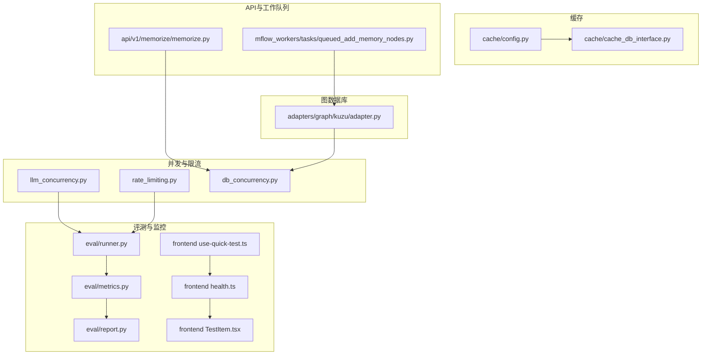

图表来源
- [m_flow/shared/llm_concurrency.py:1-45](file://m_flow/shared/llm_concurrency.py#L1-L45)
- [m_flow/shared/rate_limiting.py:1-59](file://m_flow/shared/rate_limiting.py#L1-L59)
- [m_flow/pipeline/operations/db_concurrency.py:1-200](file://m_flow/pipeline/operations/db_concurrency.py#L1-L200)
- [m_flow/adapters/cache/config.py:72-88](file://m_flow/adapters/cache/config.py#L72-L88)
- [m_flow/adapters/cache/cache_db_interface.py:1-52](file://m_flow/adapters/cache/cache_db_interface.py#L1-L52)
- [m_flow/adapters/graph/kuzu/adapter.py:150-193](file://m_flow/adapters/graph/kuzu/adapter.py#L150-L193)
- [m_flow/api/v1/memorize/memorize.py:36-80](file://m_flow/api/v1/memorize/memorize.py#L36-L80)
- [mflow_workers/tasks/queued_add_memory_nodes.py:1-13](file://mflow_workers/tasks/queued_add_memory_nodes.py#L1-L13)
- [m_flow/eval/runner.py:276-329](file://m_flow/eval/runner.py#L276-L329)
- [m_flow/eval/metrics.py:1-283](file://m_flow/eval/metrics.py#L1-L283)
- [m_flow/eval/report.py:95-162](file://m_flow/eval/report.py#L95-L162)
- [m_flow-frontend/src/hooks/use-quick-test.ts:137-180](file://m_flow-frontend/src/hooks/use-quick-test.ts#L137-L180)
- [m_flow-frontend/src/lib/utils/health.ts:235-289](file://m_flow-frontend/src/lib/utils/health.ts#L235-L289)
- [m_flow-frontend/src/components/setup/QuickTest/TestItem.tsx:138-188](file://m_flow-frontend/src/components/setup/QuickTest/TestItem.tsx#L138-L188)

章节来源
- [m_flow/shared/llm_concurrency.py:1-45](file://m_flow/shared/llm_concurrency.py#L1-L45)
- [m_flow/shared/rate_limiting.py:1-59](file://m_flow/shared/rate_limiting.py#L1-L59)
- [m_flow/pipeline/operations/db_concurrency.py:1-200](file://m_flow/pipeline/operations/db_concurrency.py#L1-L200)
- [m_flow/adapters/cache/config.py:72-88](file://m_flow/adapters/cache/config.py#L72-L88)
- [m_flow/adapters/cache/cache_db_interface.py:1-52](file://m_flow/adapters/cache/cache_db_interface.py#L1-L52)
- [m_flow/adapters/graph/kuzu/adapter.py:150-193](file://m_flow/adapters/graph/kuzu/adapter.py#L150-L193)
- [m_flow/api/v1/memorize/memorize.py:36-80](file://m_flow/api/v1/memorize/memorize.py#L36-L80)
- [mflow_workers/tasks/queued_add_memory_nodes.py:1-13](file://mflow_workers/tasks/queued_add_memory_nodes.py#L1-L13)
- [m_flow/eval/runner.py:276-329](file://m_flow/eval/runner.py#L276-L329)
- [m_flow/eval/metrics.py:1-283](file://m_flow/eval/metrics.py#L1-L283)
- [m_flow/eval/report.py:95-162](file://m_flow/eval/report.py#L95-L162)
- [m_flow-frontend/src/hooks/use-quick-test.ts:137-180](file://m_flow-frontend/src/hooks/use-quick-test.ts#L137-L180)
- [m_flow-frontend/src/lib/utils/health.ts:235-289](file://m_flow-frontend/src/lib/utils/health.ts#L235-L289)
- [m_flow-frontend/src/components/setup/QuickTest/TestItem.tsx:138-188](file://m_flow-frontend/src/components/setup/QuickTest/TestItem.tsx#L138-L188)

## 核心组件
- 数据库并发控制：根据数据库类型自动选择串行或高并发执行，并支持环境变量覆盖，避免SQLite锁竞争。
- 全局LLM并发与速率限制：统一全局信号量控制LLM调用并发，结合速率限制器按需启用节流。
- 缓存配置与接口：抽象分布式缓存后端接口，支持Redis等，提供进程内单例配置。
- 图数据库适配：Kùzu连接与查询锁、跨进程共享锁（Redis）或线程池隔离。
- 记忆化并发保护：API层对数据集级并发进行登记与冲突检测，避免重复或竞态。
- 工作队列批处理：批量写入任务拆分为两半递归重试，提升吞吐与容错。
- 评测与指标：评测运行器支持串行/并发执行，指标计算与报告生成，前端快速测试与延迟展示。

章节来源
- [m_flow/pipeline/operations/db_concurrency.py:48-119](file://m_flow/pipeline/operations/db_concurrency.py#L48-L119)
- [m_flow/shared/llm_concurrency.py:15-45](file://m_flow/shared/llm_concurrency.py#L15-L45)
- [m_flow/shared/rate_limiting.py:23-59](file://m_flow/shared/rate_limiting.py#L23-L59)
- [m_flow/adapters/cache/config.py:72-88](file://m_flow/adapters/cache/config.py#L72-L88)
- [m_flow/adapters/cache/cache_db_interface.py:12-52](file://m_flow/adapters/cache/cache_db_interface.py#L12-L52)
- [m_flow/adapters/graph/kuzu/adapter.py:150-193](file://m_flow/adapters/graph/kuzu/adapter.py#L150-L193)
- [m_flow/api/v1/memorize/memorize.py:53-80](file://m_flow/api/v1/memorize/memorize.py#L53-L80)
- [mflow_workers/tasks/queued_add_memory_nodes.py:1-13](file://mflow_workers/tasks/queued_add_memory_nodes.py#L1-L13)
- [m_flow/eval/runner.py:289-329](file://m_flow/eval/runner.py#L289-L329)
- [m_flow/eval/metrics.py:65-283](file://m_flow/eval/metrics.py#L65-L283)
- [m_flow/eval/report.py:95-162](file://m_flow/eval/report.py#L95-L162)
- [m_flow-frontend/src/hooks/use-quick-test.ts:137-180](file://m_flow-frontend/src/hooks/use-quick-test.ts#L137-L180)
- [m_flow-frontend/src/lib/utils/health.ts:235-289](file://m_flow-frontend/src/lib/utils/health.ts#L235-L289)
- [m_flow-frontend/src/components/setup/QuickTest/TestItem.tsx:138-188](file://m_flow-frontend/src/components/setup/QuickTest/TestItem.tsx#L138-L188)

## 架构总览
下图展示了性能相关组件之间的交互：评测驱动指标计算与报告生成；并发控制与限流贯穿LLM与数据库操作；缓存与图数据库适配为上层提供基础设施；前端快速测试采集延迟并汇总统计。

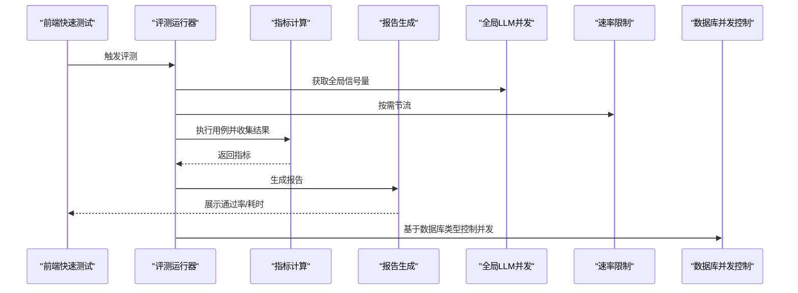

图表来源
- [m_flow/eval/runner.py:289-329](file://m_flow/eval/runner.py#L289-L329)
- [m_flow/eval/metrics.py:149-283](file://m_flow/eval/metrics.py#L149-L283)
- [m_flow/eval/report.py:95-162](file://m_flow/eval/report.py#L95-L162)
- [m_flow/shared/llm_concurrency.py:15-45](file://m_flow/shared/llm_concurrency.py#L15-L45)
- [m_flow/shared/rate_limiting.py:43-59](file://m_flow/shared/rate_limiting.py#L43-L59)
- [m_flow/pipeline/operations/db_concurrency.py:77-119](file://m_flow/pipeline/operations/db_concurrency.py#L77-L119)

## 详细组件分析

### 组件A：数据库并发控制（基于数据库类型）
- 自动检测数据库类型并设置并发上限：SQLite强制串行，PostgreSQL默认高并发。
- 支持环境变量覆盖，便于在不同部署环境中调整。
- 提供带并发限制的协程执行器，支持全并行或信号量限速并行。

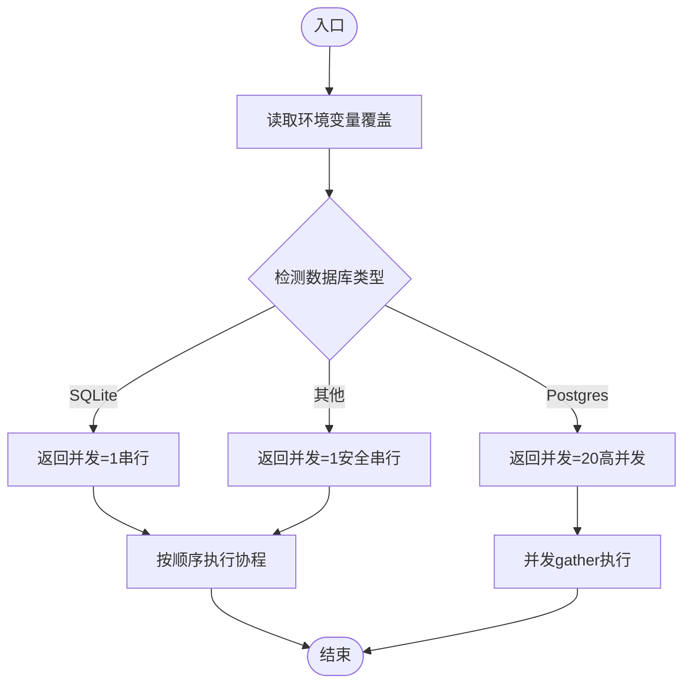

图表来源
- [m_flow/pipeline/operations/db_concurrency.py:48-119](file://m_flow/pipeline/operations/db_concurrency.py#L48-L119)
- [m_flow/pipeline/operations/db_concurrency.py:122-176](file://m_flow/pipeline/operations/db_concurrency.py#L122-L176)

章节来源
- [m_flow/pipeline/operations/db_concurrency.py:1-200](file://m_flow/pipeline/operations/db_concurrency.py#L1-L200)

### 组件B：全局LLM并发与速率限制
- 全局信号量：统一控制LLM调用并发，避免资源争用与嵌套信号量问题。
- 速率限制：基于配置动态启用/禁用LLM与Embedding的速率限制，支持请求数与时间窗口。
- 使用建议：通过环境变量调整并发上限；在高负载场景开启速率限制以避免下游限流。

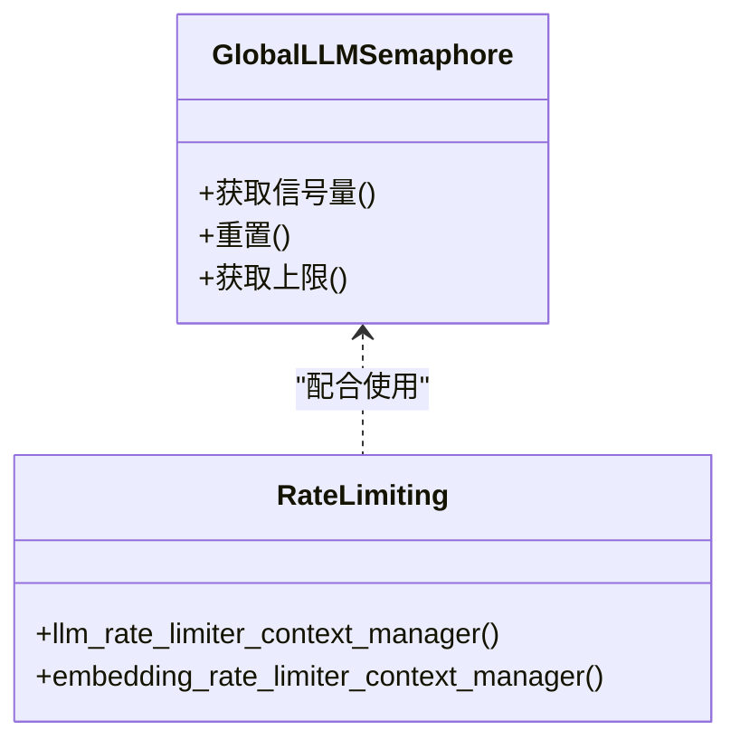

图表来源
- [m_flow/shared/llm_concurrency.py:15-45](file://m_flow/shared/llm_concurrency.py#L15-L45)
- [m_flow/shared/rate_limiting.py:23-59](file://m_flow/shared/rate_limiting.py#L23-L59)

章节来源
- [m_flow/shared/llm_concurrency.py:1-45](file://m_flow/shared/llm_concurrency.py#L1-L45)
- [m_flow/shared/rate_limiting.py:1-59](file://m_flow/shared/rate_limiting.py#L1-L59)

### 组件C：缓存配置与接口
- 抽象分布式缓存接口：定义锁原语与问答会话存储契约，便于替换Redis/Memcached等。
- 进程内单例配置：LRU缓存配置实例，确保全局一致性与最小初始化成本。
- 使用建议：优先使用Redis作为共享锁后端；在需要强一致性的场景启用共享锁。

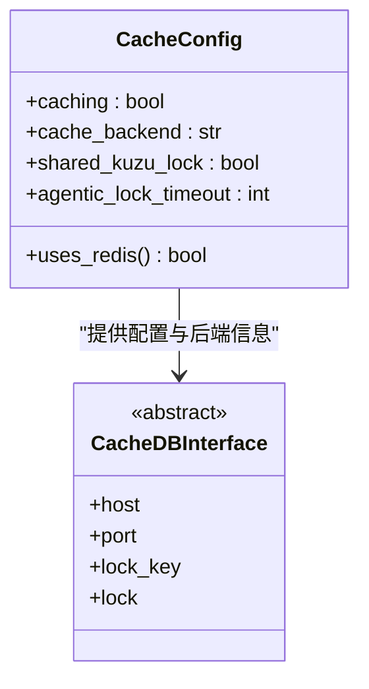

图表来源
- [m_flow/adapters/cache/config.py:72-88](file://m_flow/adapters/cache/config.py#L72-L88)
- [m_flow/adapters/cache/cache_db_interface.py:12-52](file://m_flow/adapters/cache/cache_db_interface.py#L12-L52)

章节来源
- [m_flow/adapters/cache/config.py:72-88](file://m_flow/adapters/cache/config.py#L72-L88)
- [m_flow/adapters/cache/cache_db_interface.py:1-52](file://m_flow/adapters/cache/cache_db_interface.py#L1-L52)

### 组件D：图数据库适配（Kùzu）
- 连接与查询锁：Kùzu连接非线程安全，采用异步锁串行化查询；可选Redis共享锁实现跨进程协调。
- 线程池隔离：在不使用共享锁时，使用线程池隔离阻塞操作。
- 使用建议：生产环境建议启用共享锁并使用Redis；避免在高并发下直接暴露连接给多个事件循环。

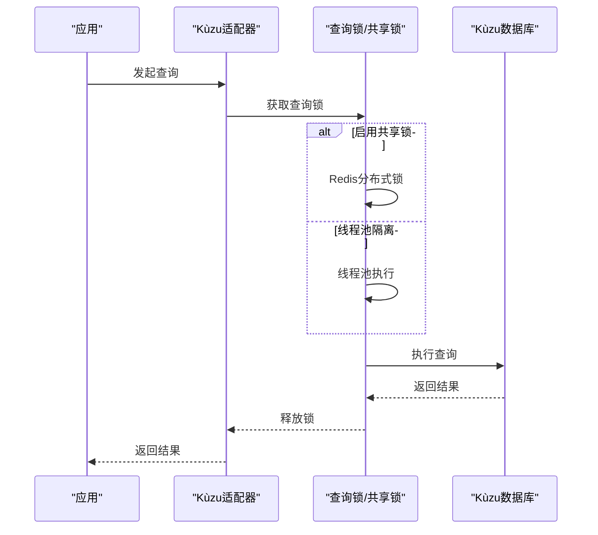

图表来源
- [m_flow/adapters/graph/kuzu/adapter.py:150-193](file://m_flow/adapters/graph/kuzu/adapter.py#L150-L193)

章节来源
- [m_flow/adapters/graph/kuzu/adapter.py:150-193](file://m_flow/adapters/graph/kuzu/adapter.py#L150-L193)

### 组件E：记忆化并发保护（API层）
- 数据集级并发登记：使用内存集合记录活跃数据集ID，避免同一数据集的重复写入。
- 冲突模式：支持忽略、告警、报错三种模式，便于在不同场景下平衡一致性与吞吐。
- 使用建议：在批量导入场景中启用严格冲突模式，防止重复写入导致的数据不一致。

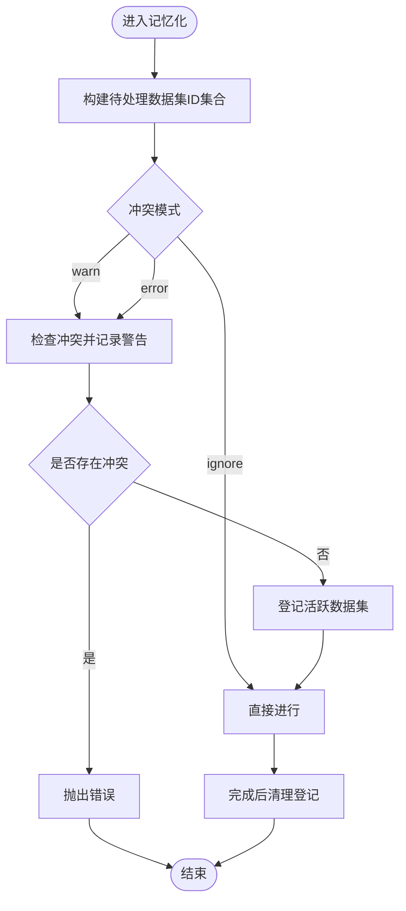

图表来源
- [m_flow/api/v1/memorize/memorize.py:53-80](file://m_flow/api/v1/memorize/memorize.py#L53-L80)

章节来源
- [m_flow/api/v1/memorize/memorize.py:36-80](file://m_flow/api/v1/memorize/memorize.py#L36-L80)

### 组件F：工作队列批处理（批量写入）
- 递归拆分：当队列写入失败时，将批次拆分为两半并分别重试，提升吞吐与稳定性。
- 使用建议：在高吞吐写入场景中启用该机制，结合背压与重试策略降低失败率。

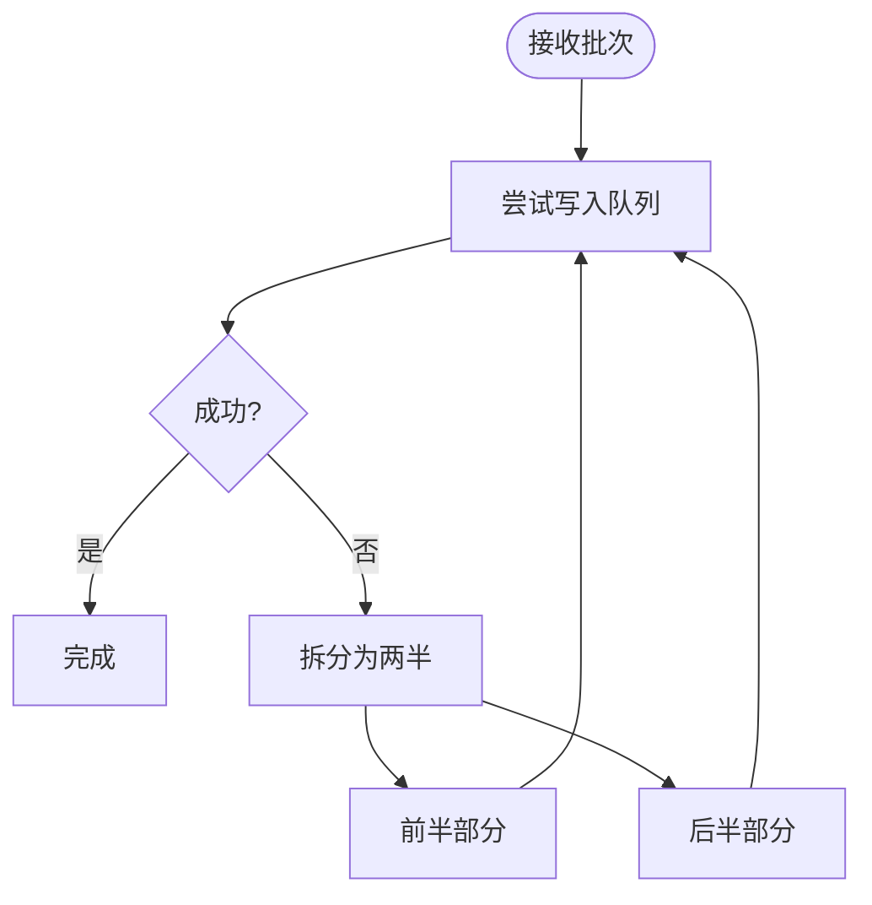

图表来源
- [mflow_workers/tasks/queued_add_memory_nodes.py:1-13](file://mflow_workers/tasks/queued_add_memory_nodes.py#L1-L13)

章节来源
- [mflow_workers/tasks/queued_add_memory_nodes.py:1-13](file://mflow_workers/tasks/queued_add_memory_nodes.py#L1-L13)

### 组件G：评测与指标（基准测试与瓶颈识别）
- 评测运行器：支持串行与并发执行，使用信号量控制并发度；提供进度回调。
- 指标计算：召回率@K、触发准确率、上下文完整性、步骤存在率、遮蔽率等。
- 报告生成：对比基线、失败样本分析与桶分类。
- 使用建议：在稳定性优先场景使用串行；在性能验证场景使用可控并发；结合指标定位检索/注入/触发等环节的瓶颈。

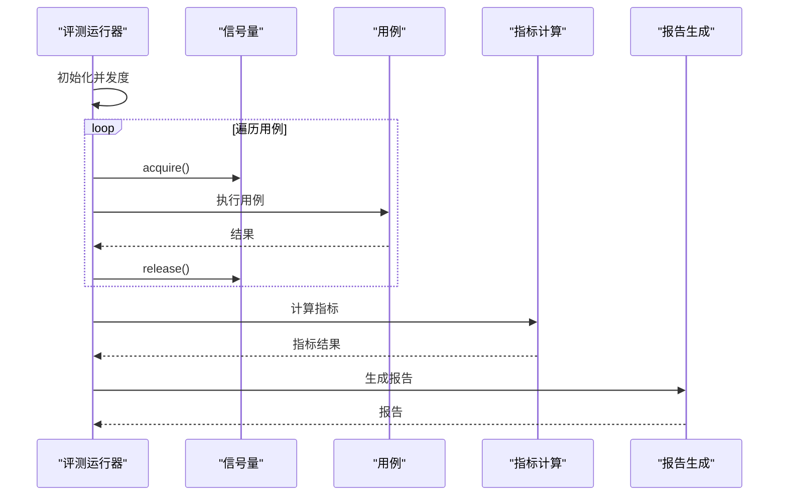

图表来源
- [m_flow/eval/runner.py:289-329](file://m_flow/eval/runner.py#L289-L329)
- [m_flow/eval/metrics.py:149-283](file://m_flow/eval/metrics.py#L149-L283)
- [m_flow/eval/report.py:95-162](file://m_flow/eval/report.py#L95-L162)

章节来源
- [m_flow/eval/runner.py:276-329](file://m_flow/eval/runner.py#L276-L329)
- [m_flow/eval/metrics.py:65-283](file://m_flow/eval/metrics.py#L65-L283)
- [m_flow/eval/report.py:95-162](file://m_flow/eval/report.py#L95-L162)

### 组件H：前端快速测试与延迟展示
- 快速测试钩子：聚合测试结果、计算通过率与总耗时。
- 延迟展示：按阈值着色显示毫秒/秒单位，直观反映性能状态。
- 使用建议：在本地开发与CI中使用快速测试，持续监控关键路径延迟变化。

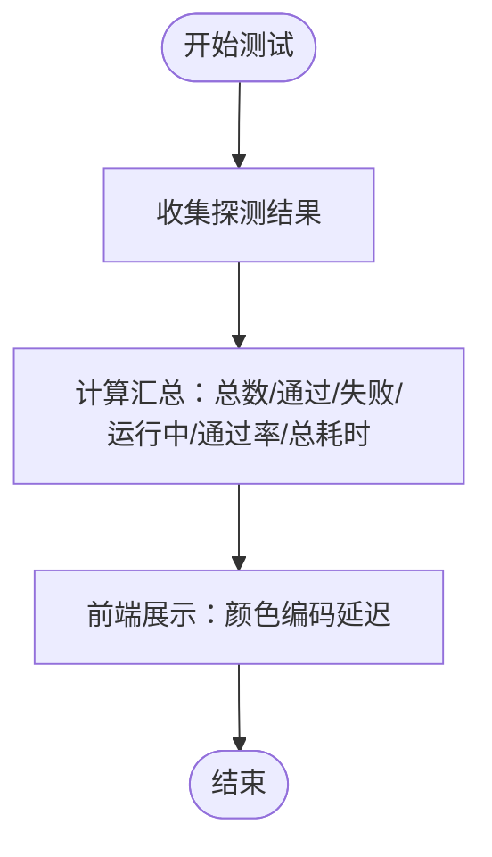

图表来源
- [m_flow-frontend/src/hooks/use-quick-test.ts:137-180](file://m_flow-frontend/src/hooks/use-quick-test.ts#L137-L180)
- [m_flow-frontend/src/lib/utils/health.ts:235-289](file://m_flow-frontend/src/lib/utils/health.ts#L235-L289)
- [m_flow-frontend/src/components/setup/QuickTest/TestItem.tsx:138-188](file://m_flow-frontend/src/components/setup/QuickTest/TestItem.tsx#L138-L188)

章节来源
- [m_flow-frontend/src/hooks/use-quick-test.ts:137-180](file://m_flow-frontend/src/hooks/use-quick-test.ts#L137-L180)
- [m_flow-frontend/src/lib/utils/health.ts:235-289](file://m_flow-frontend/src/lib/utils/health.ts#L235-L289)
- [m_flow-frontend/src/components/setup/QuickTest/TestItem.tsx:138-188](file://m_flow-frontend/src/components/setup/QuickTest/TestItem.tsx#L138-L188)

## 依赖分析
- 组件耦合与内聚：并发控制与限流模块相对独立，通过配置与环境变量影响上层行为；缓存接口与配置解耦，便于替换后端。
- 外部依赖：Kùzu适配依赖外部数据库与可选Redis共享锁；评测模块依赖LLM与数据库执行环境。
- 潜在环路：未发现明显循环依赖；并发控制模块通过延迟导入避免循环。

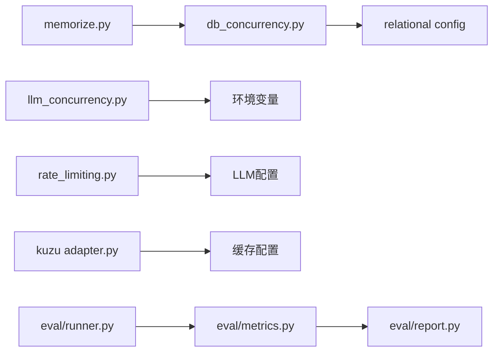

图表来源
- [m_flow/pipeline/operations/db_concurrency.py:42-45](file://m_flow/pipeline/operations/db_concurrency.py#L42-L45)
- [m_flow/shared/llm_concurrency.py:25-29](file://m_flow/shared/llm_concurrency.py#L25-L29)
- [m_flow/shared/rate_limiting.py:21-31](file://m_flow/shared/rate_limiting.py#L21-L31)
- [m_flow/adapters/graph/kuzu/adapter.py:170-175](file://m_flow/adapters/graph/kuzu/adapter.py#L170-L175)
- [m_flow/api/v1/memorize/memorize.py:36-80](file://m_flow/api/v1/memorize/memorize.py#L36-L80)
- [m_flow/eval/runner.py:289-329](file://m_flow/eval/runner.py#L289-L329)
- [m_flow/eval/metrics.py:1-20](file://m_flow/eval/metrics.py#L1-L20)
- [m_flow/eval/report.py:95-113](file://m_flow/eval/report.py#L95-L113)

章节来源
- [m_flow/pipeline/operations/db_concurrency.py:1-200](file://m_flow/pipeline/operations/db_concurrency.py#L1-L200)
- [m_flow/shared/llm_concurrency.py:1-45](file://m_flow/shared/llm_concurrency.py#L1-L45)
- [m_flow/shared/rate_limiting.py:1-59](file://m_flow/shared/rate_limiting.py#L1-L59)
- [m_flow/adapters/graph/kuzu/adapter.py:150-193](file://m_flow/adapters/graph/kuzu/adapter.py#L150-L193)
- [m_flow/api/v1/memorize/memorize.py:36-80](file://m_flow/api/v1/memorize/memorize.py#L36-L80)
- [m_flow/eval/runner.py:276-329](file://m_flow/eval/runner.py#L276-L329)
- [m_flow/eval/metrics.py:1-283](file://m_flow/eval/metrics.py#L1-L283)
- [m_flow/eval/report.py:95-162](file://m_flow/eval/report.py#L95-L162)

## 性能考量
- 基准测试与指标监控
  - 使用评测运行器在串行与并发模式下对比吞吐与延迟；结合指标计算关注召回、触发准确率与遮蔽率。
  - 前端快速测试用于持续监控关键路径延迟，及时发现回归。
- 内存优化
  - 对象池与GC：减少频繁分配与回收，优先复用连接与会话；在高并发场景中避免大对象驻留。
  - 内存泄漏检测：结合活跃数据集登记与清理流程，确保资源释放；对长生命周期对象建立弱引用或显式析构。
- 并发优化
  - 异步与信号量：统一使用全局LLM信号量与数据库并发控制，避免嵌套并发导致的死锁与资源争用。
  - 线程池与锁：Kùzu查询串行化，必要时使用Redis共享锁；批处理任务拆分重试提升稳定性。
- 数据库优化
  - SQLite强制串行，避免锁竞争；PostgreSQL可提高并发上限。
  - 查询与索引：结合检索与注入逻辑，针对高频查询建立合适索引；批量写入使用事务与批处理。
- 缓存策略
  - 多级缓存：本地LRU+分布式缓存；对热点数据预热，失效策略基于TTL与版本号。
  - 缓存预热：在启动阶段加载常用实体描述与检索结果；缓存失效采用渐进式更新。
- 网络优化
  - 连接复用：HTTP/GRPC连接池配置；前端与后端共享连接。
  - 超时与重试：合理设置请求超时与指数退避；对幂等操作启用重试。
  - 负载均衡：多副本部署，前端轮询或基于健康检查的路由。

## 故障排查指南
- 评测并发不稳定
  - 检查评测运行器并发参数与信号量；在稳定性优先场景使用串行执行。
  - 关注失败样本与桶分类，定位检索/注入/触发等环节异常。
- 数据库锁竞争
  - 确认数据库类型与并发上限；SQLite必须串行；PostgreSQL可适当提高并发。
  - 查看日志中关于“database is locked”的提示，必要时增加等待或降级。
- LLM调用过载
  - 检查全局LLM并发上限与速率限制配置；在高负载场景启用速率限制。
- 缓存一致性问题
  - 确认是否启用共享锁；Redis可用性与超时配置；缓存失效策略是否合理。
- 图数据库写入失败
  - 批量写入任务拆分重试是否生效；查询锁与共享锁是否正确配置。
- 并发子进程访问
  - 参考并发子进程测试用例，确保跨进程资源访问不会产生竞态。

章节来源
- [m_flow/eval/runner.py:289-329](file://m_flow/eval/runner.py#L289-L329)
- [m_flow/eval/report.py:95-162](file://m_flow/eval/report.py#L95-L162)
- [m_flow/pipeline/operations/db_concurrency.py:100-119](file://m_flow/pipeline/operations/db_concurrency.py#L100-L119)
- [m_flow/shared/llm_concurrency.py:25-29](file://m_flow/shared/llm_concurrency.py#L25-L29)
- [m_flow/shared/rate_limiting.py:23-31](file://m_flow/shared/rate_limiting.py#L23-L31)
- [m_flow/adapters/cache/config.py:72-88](file://m_flow/adapters/cache/config.py#L72-L88)
- [mflow_workers/tasks/queued_add_memory_nodes.py:1-13](file://mflow_workers/tasks/queued_add_memory_nodes.py#L1-L13)
- [m_flow/tests/test_concurrent_subprocess_access.py:77-93](file://m_flow/tests/test_concurrent_subprocess_access.py#L77-L93)

## 结论
通过对M-flow的并发控制、缓存、数据库与评测体系的深入分析，可以形成一套完整的性能优化闭环：以评测驱动指标、以指标指导优化、以缓存与并发控制保障吞吐与稳定性、以前端监控持续反馈。建议在生产环境中启用共享锁、合理的并发上限与速率限制，并结合多级缓存与批处理拆分策略，持续监控关键路径延迟，确保系统在高负载下的稳定与高效。

## 附录
- 实际优化案例（基于现有实现）
  - 将评测运行器从并发切换为串行，显著降低不稳定因素，便于定位问题。
  - 在PostgreSQL环境下适度提高数据库并发上限，配合LLM全局信号量，提升整体吞吐。
  - 启用Kùzu共享锁与Redis后端，避免跨进程写入冲突；对热点数据进行缓存预热。
  - 批量写入任务拆分为两半重试，提升失败恢复能力与吞吐稳定性。