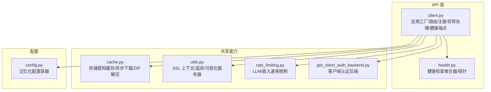
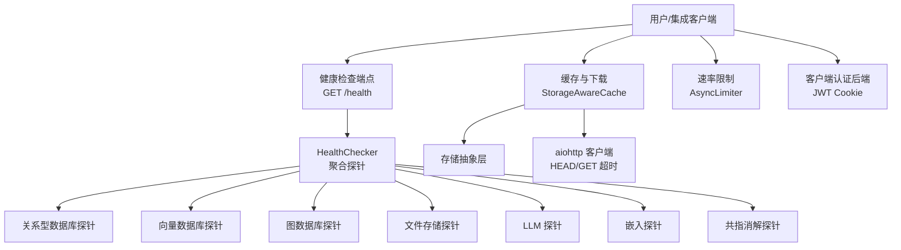
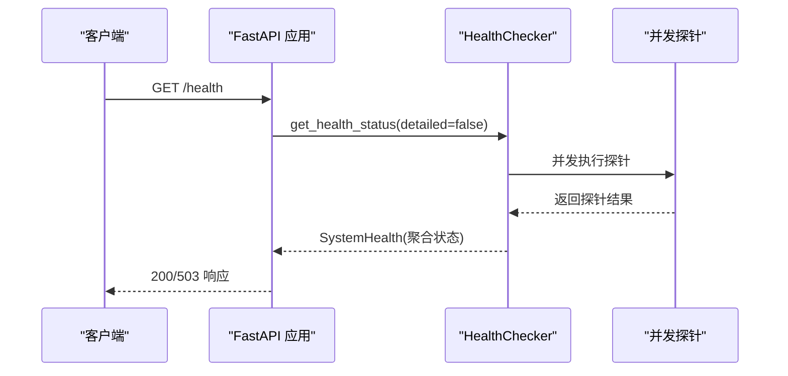
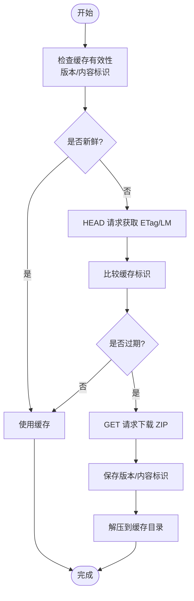
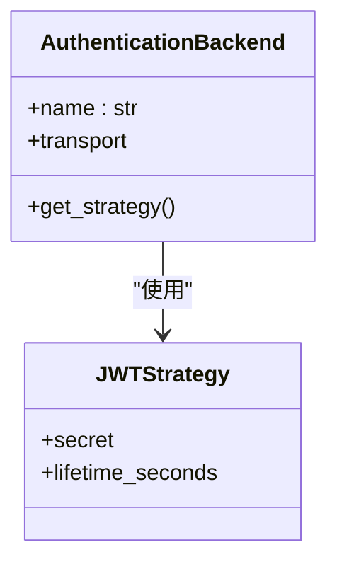
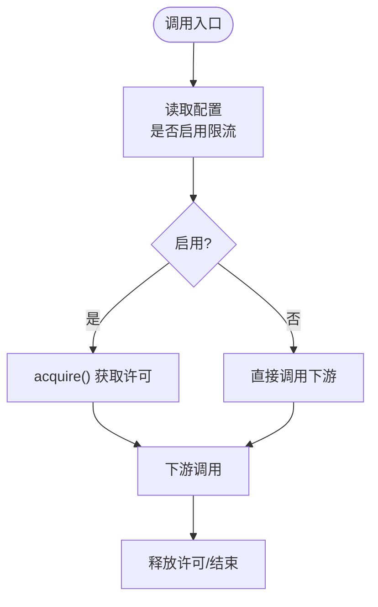
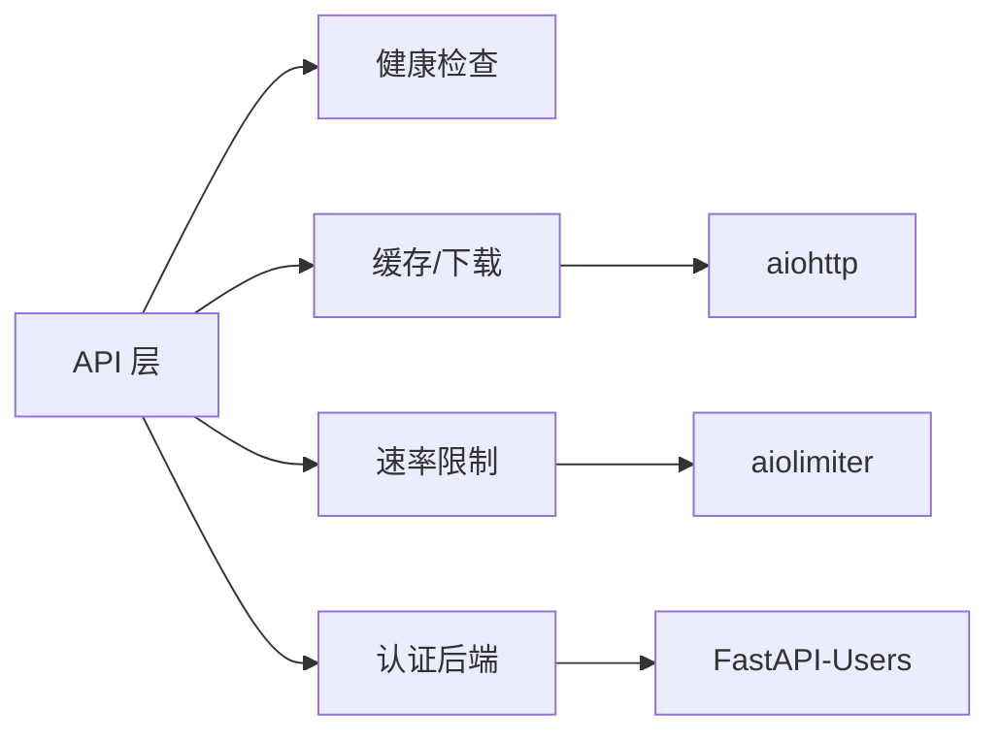

# API 客户端扩展

<cite>
**本文引用的文件**
- [m_flow/api/client.py](file://m_flow/api/client.py)
- [m_flow/api/health.py](file://m_flow/api/health.py)
- [m_flow/shared/cache.py](file://m_flow/shared/cache.py)
- [m_flow/shared/utils.py](file://m_flow/shared/utils.py)
- [m_flow/shared/rate_limiting.py](file://m_flow/shared/rate_limiting.py)
- [m_flow/auth/authentication/get_client_auth_backend.py](file://m_flow/auth/authentication/get_client_auth_backend.py)
- [m_flow/config/config.py](file://m_flow/config/config.py)
</cite>

## 目录
1. [简介](#简介)
2. [项目结构](#项目结构)
3. [核心组件](#核心组件)
4. [架构总览](#架构总览)
5. [详细组件分析](#详细组件分析)
6. [依赖分析](#依赖分析)
7. [性能考量](#性能考量)
8. [故障排查指南](#故障排查指南)
9. [结论](#结论)
10. [附录：使用示例与最佳实践](#附录使用示例与最佳实践)

## 简介
本指南面向需要扩展现有 API 客户端能力的开发者，系统讲解如何在现有框架基础上进行扩展，涵盖以下主题：
- 自定义客户端类与连接池管理
- 异步请求处理与并发控制
- 客户端配置项（超时、重试、代理等）
- 扩展示例（自定义认证、请求头管理、响应处理）
- 健康检查客户端（服务可用性监控与故障转移）
- 完整使用示例与最佳实践

## 项目结构
围绕 API 客户端扩展的相关模块主要分布在以下位置：
- API 层与健康检查：m_flow/api/client.py、m_flow/api/health.py
- 缓存与下载：m_flow/shared/cache.py
- 工具与 SSL：m_flow/shared/utils.py
- 速率限制：m_flow/shared/rate_limiting.py
- 认证后端：m_flow/auth/authentication/get_client_auth_backend.py
- 配置容器：m_flow/config/config.py

**图表来源**
- [m_flow/api/client.py:1-361](file://m_flow/api/client.py#L1-L361)
- [m_flow/api/health.py:1-402](file://m_flow/api/health.py#L1-L402)
- [m_flow/shared/cache.py:1-367](file://m_flow/shared/cache.py#L1-L367)
- [m_flow/shared/utils.py:1-200](file://m_flow/shared/utils.py#L1-L200)
- [m_flow/shared/rate_limiting.py:1-59](file://m_flow/shared/rate_limiting.py#L1-L59)
- [m_flow/auth/authentication/get_client_auth_backend.py:1-48](file://m_flow/auth/authentication/get_client_auth_backend.py#L1-L48)
- [m_flow/config/config.py:1-83](file://m_flow/config/config.py#L1-L83)

**章节来源**
- [m_flow/api/client.py:1-361](file://m_flow/api/client.py#L1-L361)
- [m_flow/api/health.py:1-402](file://m_flow/api/health.py#L1-L402)
- [m_flow/shared/cache.py:1-367](file://m_flow/shared/cache.py#L1-L367)
- [m_flow/shared/utils.py:1-200](file://m_flow/shared/utils.py#L1-L200)
- [m_flow/shared/rate_limiting.py:1-59](file://m_flow/shared/rate_limiting.py#L1-L59)
- [m_flow/auth/authentication/get_client_auth_backend.py:1-48](file://m_flow/auth/authentication/get_client_auth_backend.py#L1-L48)
- [m_flow/config/config.py:1-83](file://m_flow/config/config.py#L1-L83)

## 核心组件
- 应用工厂与路由注册：负责构建 FastAPI 应用、挂载各业务路由、统一异常处理与 OpenAPI 定制。
- 健康检查系统：对关系型数据库、向量库、图数据库、文件存储、LLM、嵌入、共指消解等子系统进行并发探针，并汇总状态。
- 存储感知缓存：基于 aiohttp 的异步 HTTP 客户端，支持 HEAD/GET 超时、ETag/LM 比较、ZIP 下载与解压、多存储后端抽象。
- 工具与 SSL：提供安全 SSL 上下文、遥测上报、可视化服务器启动等辅助能力。
- 速率限制：为 LLM 与嵌入调用提供可开关的异步限流器。
- 客户端认证后端：基于 JWT 的 Cookie 认证后端工厂，支持生产环境密钥校验。
- 配置容器：提供记忆化阶段的配置对象，便于扩展时读取模型与行为参数。

**章节来源**
- [m_flow/api/client.py:110-337](file://m_flow/api/client.py#L110-L337)
- [m_flow/api/health.py:31-398](file://m_flow/api/health.py#L31-L398)
- [m_flow/shared/cache.py:39-271](file://m_flow/shared/cache.py#L39-L271)
- [m_flow/shared/utils.py:109-149](file://m_flow/shared/utils.py#L109-L149)
- [m_flow/shared/rate_limiting.py:21-59](file://m_flow/shared/rate_limiting.py#L21-L59)
- [m_flow/auth/authentication/get_client_auth_backend.py:22-47](file://m_flow/auth/authentication/get_client_auth_backend.py#L22-L47)
- [m_flow/config/config.py:21-83](file://m_flow/config/config.py#L21-L83)

## 架构总览
下图展示了 API 客户端扩展的总体交互：客户端通过健康检查端点获取服务状态，使用缓存与异步 HTTP 客户端进行数据拉取与处理，结合速率限制与认证后端保障稳定性与安全性。

**图表来源**
- [m_flow/api/client.py:211-261](file://m_flow/api/client.py#L211-L261)
- [m_flow/api/health.py:341-398](file://m_flow/api/health.py#L341-L398)
- [m_flow/shared/cache.py:150-232](file://m_flow/shared/cache.py#L150-L232)
- [m_flow/shared/rate_limiting.py:21-59](file://m_flow/shared/rate_limiting.py#L21-L59)
- [m_flow/auth/authentication/get_client_auth_backend.py:22-47](file://m_flow/auth/authentication/get_client_auth_backend.py#L22-L47)

## 详细组件分析

### 健康检查客户端与服务可用性监控
- 组件职责
  - 提供统一健康检查接口，聚合多个子系统的探针结果。
  - 对关键子系统（关系型/向量/图/存储）执行并发探测，非关键子系统（LLM/嵌入/共指）以警告级别处理。
  - 支持“详细”模式输出每个探针的延迟、后端类型与诊断信息。
- 关键流程
  - 并发执行所有探针任务，收集结果并计算聚合状态。
  - 对超时场景（如图数据库写锁）返回警告，避免阻塞健康端点。
- 故障转移建议
  - 在客户端侧根据健康状态选择备用实例或降级路径；对警告状态触发重试与熔断。

**图表来源**
- [m_flow/api/client.py:211-261](file://m_flow/api/client.py#L211-L261)
- [m_flow/api/health.py:341-398](file://m_flow/api/health.py#L341-L398)

**章节来源**
- [m_flow/api/health.py:31-398](file://m_flow/api/health.py#L31-L398)
- [m_flow/api/client.py:211-261](file://m_flow/api/client.py#L211-L261)

### 存储感知缓存与异步下载
- 组件职责
  - 基于 aiohttp 的异步 HTTP 客户端，支持 HEAD/GET 超时与分块下载。
  - 使用 ETag 或 Last-Modified 判断缓存新鲜度，避免重复下载。
  - 支持本地与 S3 多存储后端，统一目录与文件操作接口。
  - 提供 ZIP 文件下载与解压，生成版本与内容标识用于后续校验。
- 连接池与超时
  - 通过 TCPConnector 与 ClientTimeout 控制连接复用与超时。
  - HEAD/GET 分别设置不同超时，降低慢响应影响。
- 扩展点
  - 可替换存储抽象层以适配新的后端。
  - 可增加代理配置、重试策略与指数退避。

**图表来源**
- [m_flow/shared/cache.py:136-271](file://m_flow/shared/cache.py#L136-L271)

**章节来源**
- [m_flow/shared/cache.py:28-31](file://m_flow/shared/cache.py#L28-L31)
- [m_flow/shared/cache.py:136-271](file://m_flow/shared/cache.py#L136-L271)

### 客户端认证后端（JWT Cookie）
- 组件职责
  - 基于 JWT 的 Cookie 认证后端，支持生产环境密钥校验与令牌生命周期控制。
  - 通过工厂函数创建并缓存认证后端实例，确保配置错误尽早暴露。
- 扩展点
  - 可替换传输层（如 SessionCookieTransport）或策略（自定义签发/验证逻辑）。
  - 可引入多因子认证或外部 OIDC 适配。

**图表来源**
- [m_flow/auth/authentication/get_client_auth_backend.py:22-47](file://m_flow/auth/authentication/get_client_auth_backend.py#L22-L47)

**章节来源**
- [m_flow/auth/authentication/get_client_auth_backend.py:1-48](file://m_flow/auth/authentication/get_client_auth_backend.py#L1-L48)

### 速率限制与并发控制
- 组件职责
  - 提供 LLM 与嵌入调用的异步限流器，支持按配置启用/禁用。
  - 通过上下文管理器在调用点透明地插入限流逻辑。
- 扩展点
  - 可按端点维度细分限流策略，或引入滑动窗口与令牌桶算法。

**图表来源**
- [m_flow/shared/rate_limiting.py:43-59](file://m_flow/shared/rate_limiting.py#L43-L59)

**章节来源**
- [m_flow/shared/rate_limiting.py:1-59](file://m_flow/shared/rate_limiting.py#L1-L59)

### 工具与 SSL、遥测与可视化
- SSL 上下文：提供安全默认 SSLContext，便于在异步 HTTP 客户端中启用加密连接。
- 遥测上报：在非测试/开发环境且未禁用时，发送匿名事件，注意敏感字段脱敏。
- 可视化服务器：启动简单文件服务器线程，便于本地调试与静态资源预览。

**章节来源**
- [m_flow/shared/utils.py:109-149](file://m_flow/shared/utils.py#L109-L149)

### 配置容器（记忆化）
- 作用：提供分类、摘要与三元组嵌入的配置对象，便于在扩展中读取模型与行为参数。
- 扩展建议：在客户端扩展中读取该配置，决定请求体中的模型参数或行为开关。

**章节来源**
- [m_flow/config/config.py:21-83](file://m_flow/config/config.py#L21-L83)

## 依赖分析
- 组件耦合
  - API 层依赖健康检查系统与路由注册，形成清晰的边界。
  - 缓存组件依赖存储抽象层与 aiohttp，具备良好的可替换性。
  - 认证后端与速率限制分别作为横切关注点被上层调用。
- 外部依赖
  - aiohttp（异步 HTTP）、aiolimiter（限流）、fastapi（Web 框架）、pydantic（配置）等。

**图表来源**
- [m_flow/api/client.py:110-337](file://m_flow/api/client.py#L110-L337)
- [m_flow/shared/cache.py:150-232](file://m_flow/shared/cache.py#L150-L232)
- [m_flow/shared/rate_limiting.py:21-59](file://m_flow/shared/rate_limiting.py#L21-L59)
- [m_flow/auth/authentication/get_client_auth_backend.py:22-47](file://m_flow/auth/authentication/get_client_auth_backend.py#L22-L47)

**章节来源**
- [m_flow/api/client.py:110-337](file://m_flow/api/client.py#L110-L337)
- [m_flow/shared/cache.py:150-232](file://m_flow/shared/cache.py#L150-L232)
- [m_flow/shared/rate_limiting.py:21-59](file://m_flow/shared/rate_limiting.py#L21-L59)
- [m_flow/auth/authentication/get_client_auth_backend.py:22-47](file://m_flow/auth/authentication/get_client_auth_backend.py#L22-L47)

## 性能考量
- 异步优先：使用 aiohttp 与 asyncio.gather 并发执行探针与下载，减少整体等待时间。
- 超时与背压：为 HEAD/GET 设置合理超时，避免慢探针拖垮健康端点；在下载时采用分块迭代，降低内存峰值。
- 连接复用：通过 TCPConnector 实现连接池复用，降低握手开销。
- 速率限制：在高并发场景下启用限流，防止下游服务过载。
- 缓存策略：利用 ETag/LM 判断缓存新鲜度，显著减少重复下载与网络带宽消耗。

[本节为通用指导，无需列出具体文件来源]

## 故障排查指南
- 健康检查失败
  - 检查关键子系统（关系型/向量/图/存储）是否可达；对图数据库写锁导致的超时，健康端点会返回警告而非失败。
  - 使用“详细”健康端点查看具体探针的错误信息与延迟。
- 缓存下载异常
  - 确认网络可达与证书有效；检查 ETag/LM 是否存在；必要时强制刷新缓存。
  - 观察日志中关于 HEAD/GET 超时与解压失败的记录。
- 认证问题
  - 确认 JWT 密钥已正确配置；检查 Cookie 名称与传输层设置。
- 速率限制
  - 若下游出现 429/503，检查限流配置与并发调用策略。

**章节来源**
- [m_flow/api/health.py:123-173](file://m_flow/api/health.py#L123-L173)
- [m_flow/shared/cache.py:149-178](file://m_flow/shared/cache.py#L149-L178)
- [m_flow/auth/authentication/get_client_auth_backend.py:33-35](file://m_flow/auth/authentication/get_client_auth_backend.py#L33-L35)

## 结论
通过在现有框架上扩展 API 客户端能力，可以实现：
- 更稳健的健康检查与故障转移
- 更高效的异步下载与缓存策略
- 更灵活的认证与速率限制
- 更可控的超时与重试策略

这些扩展点既保持了与现有系统的低耦合，又为未来演进提供了清晰的路径。

[本节为总结性内容，无需列出具体文件来源]

## 附录：使用示例与最佳实践
- 自定义客户端类
  - 建议封装 aiohttp.ClientSession 与 TCPConnector，集中管理超时、SSL 上下文与连接池。
  - 在客户端初始化时注入认证头（如 Cookie/JWT），并在请求前进行权限校验。
- 连接池管理
  - 使用 TCPConnector 并设置合理的 limit，避免过多并发导致资源耗尽。
  - 对不同目标域设置独立连接池，隔离风险。
- 异步请求处理
  - 对长耗时操作使用 asyncio.gather 并发执行，但需配合速率限制与超时控制。
  - 对下载大文件采用分块迭代，避免一次性加载至内存。
- 配置项建议
  - 超时：HEAD/GET 分别设置，HEAD 用于快速探测，GET 用于完整下载。
  - 重试：对临时性错误（如 5xx/超时）采用指数退避重试，最大重试次数与总超时需平衡。
  - 代理：在企业网络环境下，通过环境变量或显式配置注入代理。
- 响应处理
  - 对健康检查端点，区分成功、警告与失败状态，分别采取不同降级策略。
  - 对缓存命中与过期场景，分别走直连或回源逻辑，保证一致性与性能。
- 最佳实践
  - 将认证、限流、缓存与健康检查作为中间件或装饰器统一接入。
  - 对敏感信息（密钥、URL）使用环境变量与只读文件，避免硬编码。
  - 在生产环境启用 SSL 与严格的 CORS 策略，确保传输安全。

[本节为通用指导，无需列出具体文件来源]