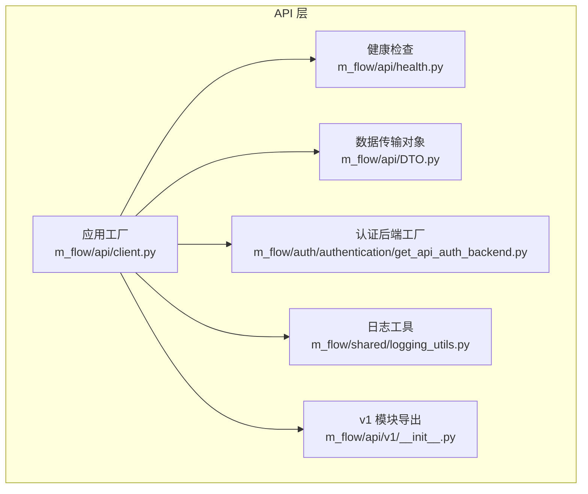
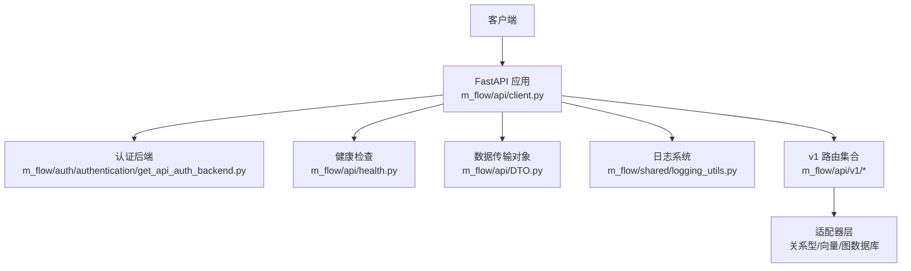
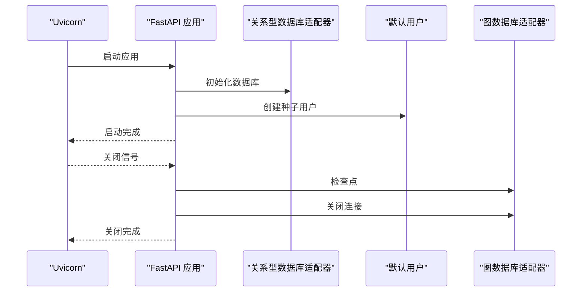
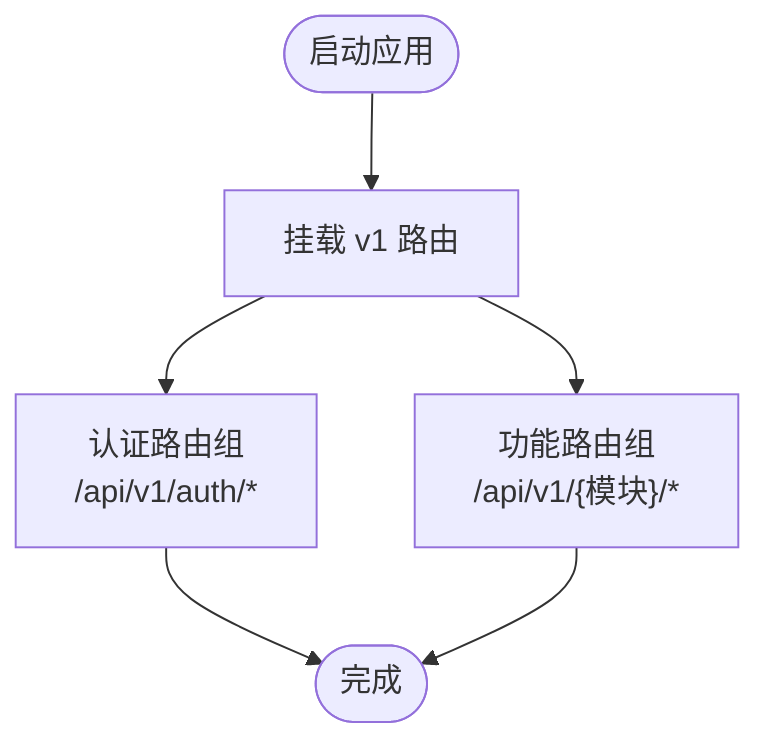
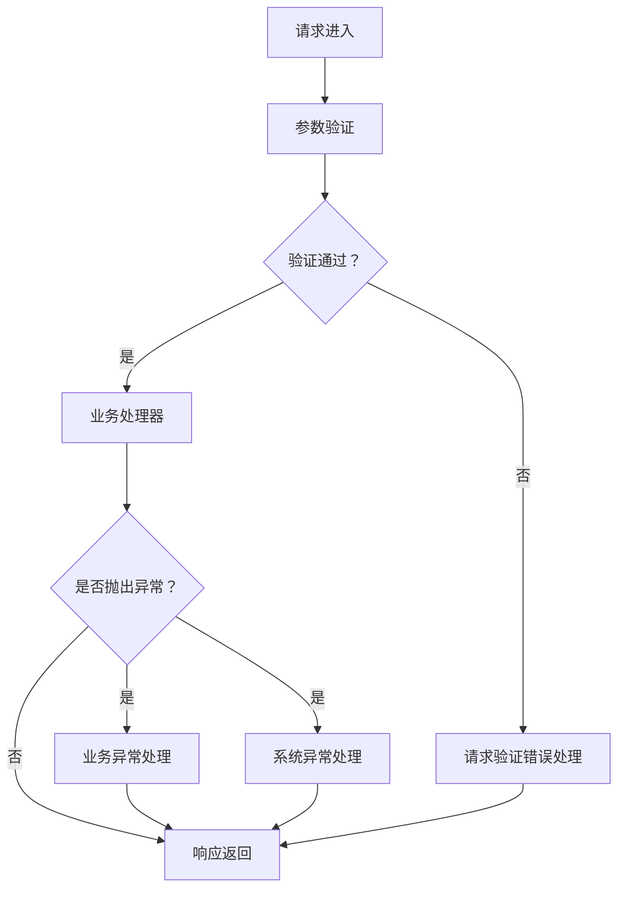
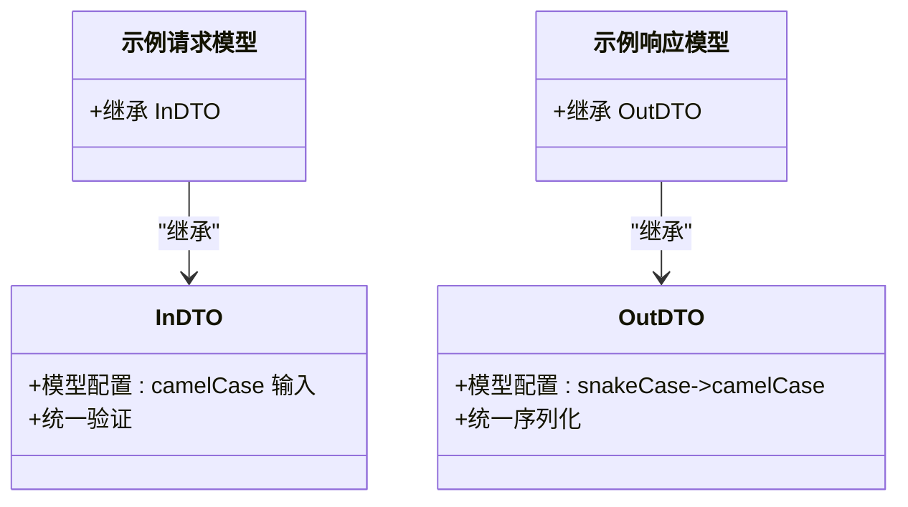
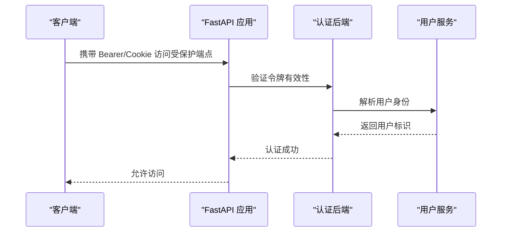
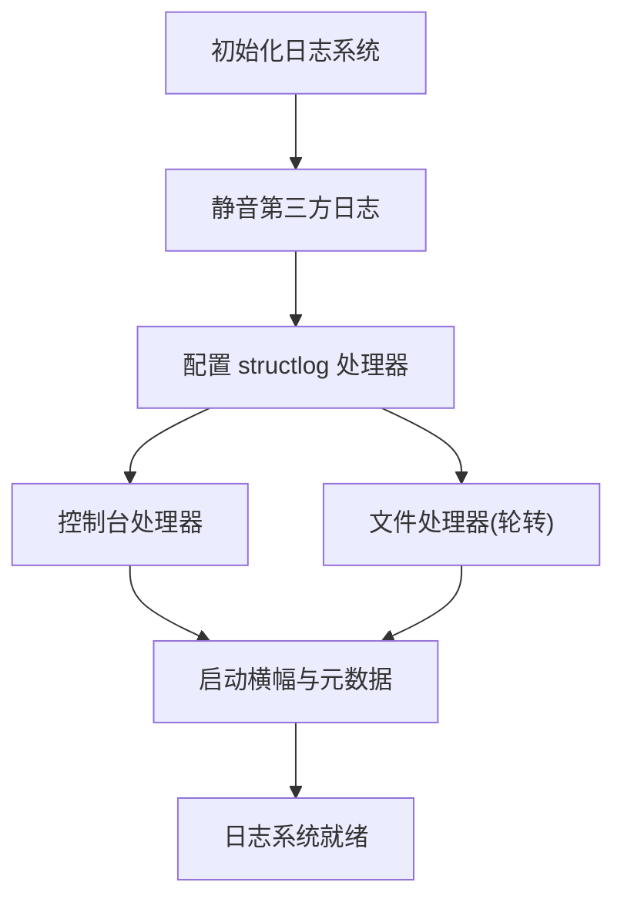
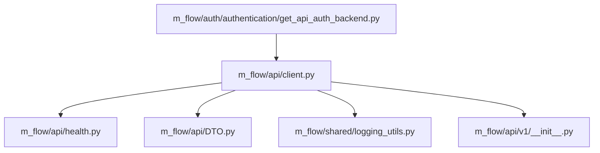

# API 扩展开发

<cite>
**本文档引用的文件**
- [m_flow/api/client.py](file://m_flow/api/client.py)
- [m_flow/api/health.py](file://m_flow/api/health.py)
- [m_flow/api/DTO.py](file://m_flow/api/DTO.py)
- [m_flow/auth/authentication/get_api_auth_backend.py](file://m_flow/auth/authentication/get_api_auth_backend.py)
- [m_flow/shared/logging_utils.py](file://m_flow/shared/logging_utils.py)
- [m_flow/api/v1/__init__.py](file://m_flow/api/v1/__init__.py)
</cite>

## 目录
1. [简介](#简介)
2. [项目结构](#项目结构)
3. [核心组件](#核心组件)
4. [架构总览](#架构总览)
5. [详细组件分析](#详细组件分析)
6. [依赖分析](#依赖分析)
7. [性能考虑](#性能考虑)
8. [故障排除指南](#故障排除指南)
9. [结论](#结论)
10. [附录](#附录)

## 简介
本指南面向希望在 M-flow RESTful API 基础上进行扩展开发的工程师，涵盖以下主题：
- 自定义路由、端点与控制器的开发流程
- API 版本管理策略与向后兼容性保障
- 请求/响应模型设计（Pydantic 模型、数据验证与序列化）
- 中间件开发（认证、日志、性能监控）
- API 客户端扩展（自定义客户端、连接池与重试）
- 完整的 API 扩展示例与安全最佳实践

## 项目结构
M-flow 的 API 层采用 FastAPI 构建，核心入口位于应用工厂模式中，统一注册各功能模块的 v1 路由，并提供健康检查、异常处理与 OpenAPI 规范定制。

**图表来源**
- [m_flow/api/client.py:110-127](file://m_flow/api/client.py#L110-L127)
- [m_flow/api/health.py:341-398](file://m_flow/api/health.py#L341-L398)
- [m_flow/api/DTO.py:24-58](file://m_flow/api/DTO.py#L24-L58)
- [m_flow/auth/authentication/get_api_auth_backend.py:22-46](file://m_flow/auth/authentication/get_api_auth_backend.py#L22-L46)
- [m_flow/shared/logging_utils.py:340-520](file://m_flow/shared/logging_utils.py#L340-520)
- [m_flow/api/v1/__init__.py:6-11](file://m_flow/api/v1/__init__.py#L6-L11)

**章节来源**
- [m_flow/api/client.py:110-127](file://m_flow/api/client.py#L110-L127)
- [m_flow/api/v1/__init__.py:6-11](file://m_flow/api/v1/__init__.py#L6-L11)

## 核心组件
- 应用工厂与生命周期：通过异步上下文管理器在启动时初始化数据库与默认用户，在关闭时执行图数据库检查点与连接关闭。
- 路由注册：集中挂载 v1 各功能模块路由，支持前缀与标签分类。
- 异常处理：统一处理请求验证错误与通用异常，返回结构化错误响应。
- OpenAPI 定制：注入 Bearer 与 Cookie 认证方案，按配置启用全局安全策略。
- 健康检查：并发探测关系型/向量/图数据库、文件存储、LLM/嵌入等关键组件，聚合状态并返回。
- 数据传输对象：统一的 InDTO/OutDTO 基类，自动进行 snake_case/camelCase 转换与序列化行为一致化。
- 认证后端：基于 JWT 的 API 认证后端工厂，支持生产环境密钥校验与令牌有效期控制。
- 日志系统：集中式结构化日志初始化，含文件轮转、噪声过滤与异常钩子。

**章节来源**
- [m_flow/api/client.py:68-103](file://m_flow/api/client.py#L68-L103)
- [m_flow/api/client.py:268-337](file://m_flow/api/client.py#L268-L337)
- [m_flow/api/client.py:169-198](file://m_flow/api/client.py#L169-L198)
- [m_flow/api/client.py:135-161](file://m_flow/api/client.py#L135-L161)
- [m_flow/api/health.py:341-398](file://m_flow/api/health.py#L341-L398)
- [m_flow/api/DTO.py:24-58](file://m_flow/api/DTO.py#L24-L58)
- [m_flow/auth/authentication/get_api_auth_backend.py:22-46](file://m_flow/auth/authentication/get_api_auth_backend.py#L22-L46)
- [m_flow/shared/logging_utils.py:340-520](file://m_flow/shared/logging_utils.py#L340-520)

## 架构总览
下图展示了从客户端到各适配器的调用链路，以及健康检查与异常处理的关键节点。

**图表来源**
- [m_flow/api/client.py:110-127](file://m_flow/api/client.py#L110-L127)
- [m_flow/auth/authentication/get_api_auth_backend.py:22-46](file://m_flow/auth/authentication/get_api_auth_backend.py#L22-L46)
- [m_flow/api/health.py:341-398](file://m_flow/api/health.py#L341-L398)
- [m_flow/api/DTO.py:24-58](file://m_flow/api/DTO.py#L24-L58)
- [m_flow/shared/logging_utils.py:340-520](file://m_flow/shared/logging_utils.py#L340-520)
- [m_flow/api/v1/__init__.py:6-11](file://m_flow/api/v1/__init__.py#L6-L11)

## 详细组件分析

### 组件一：应用工厂与生命周期管理
- 启动阶段：创建数据库、确保默认用户存在；记录启动日志。
- 关闭阶段：对图数据库执行检查点与连接关闭，避免数据丢失或资源泄露。
- 生命周期钩子使用异步上下文管理器，确保异常场景下的清理逻辑可靠执行。

**图表来源**
- [m_flow/api/client.py:68-103](file://m_flow/api/client.py#L68-L103)

**章节来源**
- [m_flow/api/client.py:68-103](file://m_flow/api/client.py#L68-L103)

### 组件二：路由注册与版本管理
- v1 路由集中挂载，支持按前缀与标签组织，便于文档生成与访问控制。
- 版本策略：当前为 v1，后续可通过新增 v2 模块并在应用工厂中注册实现平滑迁移。
- 向后兼容：保持现有路径不变，新增端点以新路径暴露，逐步引导客户端迁移。

**图表来源**
- [m_flow/api/client.py:268-337](file://m_flow/api/client.py#L268-L337)

**章节来源**
- [m_flow/api/client.py:268-337](file://m_flow/api/client.py#L268-L337)
- [m_flow/api/v1/__init__.py:6-11](file://m_flow/api/v1/__init__.py#L6-L11)

### 组件三：异常处理与健康检查
- 请求验证错误：统一捕获 FastAPI 验证异常，返回包含错误详情与原始负载的 JSON。
- 通用异常：区分业务异常与系统异常，按状态码返回结构化错误信息。
- 健康检查：并发探测多个后端服务，聚合结果并返回统一的健康状态与诊断信息。

**图表来源**
- [m_flow/api/client.py:169-198](file://m_flow/api/client.py#L169-L198)

**章节来源**
- [m_flow/api/client.py:169-198](file://m_flow/api/client.py#L169-L198)
- [m_flow/api/health.py:341-398](file://m_flow/api/health.py#L341-L398)

### 组件四：数据传输对象（DTO）与模型设计
- InDTO：请求模型基类，支持 camelCase/snake_case 双格式输入，统一验证行为。
- OutDTO：响应模型基类，自动将 snake_case 字段转换为 camelCase 输出，确保前后端一致的命名约定。
- 设计建议：所有请求/响应模型继承上述基类，避免重复配置别名与序列化规则。

**图表来源**
- [m_flow/api/DTO.py:24-58](file://m_flow/api/DTO.py#L24-L58)

**章节来源**
- [m_flow/api/DTO.py:24-58](file://m_flow/api/DTO.py#L24-L58)

### 组件五：认证中间件与安全策略
- 认证后端：基于 JWT 的 API 认证后端工厂，支持运行时密钥校验与令牌有效期控制。
- 安全方案：OpenAPI 注入 Bearer 与 Cookie 认证方案，可按需启用全局安全策略。
- 最佳实践：生产环境必须设置 JWT 密钥，避免使用默认密钥；令牌有效期应结合业务场景合理设置。

**图表来源**
- [m_flow/auth/authentication/get_api_auth_backend.py:22-46](file://m_flow/auth/authentication/get_api_auth_backend.py#L22-L46)
- [m_flow/api/client.py:135-161](file://m_flow/api/client.py#L135-L161)

**章节来源**
- [m_flow/auth/authentication/get_api_auth_backend.py:22-46](file://m_flow/auth/authentication/get_api_auth_backend.py#L22-L46)
- [m_flow/api/client.py:135-161](file://m_flow/api/client.py#L135-L161)

### 组件六：日志中间件与可观测性
- 结构化日志：初始化 structlog 与标准库日志，统一输出格式与级别。
- 文件轮转：支持按大小轮转与保留数量控制，自动清理旧日志。
- 噪声抑制：屏蔽第三方库冗余日志，降低干扰。
- 全局异常钩子：捕获未处理异常并记录完整堆栈。

**图表来源**
- [m_flow/shared/logging_utils.py:340-520](file://m_flow/shared/logging_utils.py#L340-520)

**章节来源**
- [m_flow/shared/logging_utils.py:340-520](file://m_flow/shared/logging_utils.py#L340-520)

### 组件七：性能监控中间件（建议实现）
- 指标采集：在中间件中统计请求耗时、状态码分布、并发数等指标。
- 指标暴露：通过 Prometheus 或内置指标端点暴露，供监控系统抓取。
- 告警策略：基于阈值与趋势设定告警，结合日志与追踪定位问题。
- 注意事项：避免对高频端点造成额外开销，必要时采样上报。

[本节为概念性内容，不直接分析具体文件，故无“章节来源”]

## 依赖分析
- 组件耦合：应用工厂集中管理生命周期与路由注册，健康检查与异常处理作为横切关注点被广泛复用。
- 外部依赖：FastAPI、uvicorn、structlog、pydantic、fastapi-users 等。
- 循环依赖：当前结构未发现循环导入，认证后端工厂通过延迟导入避免循环。

**图表来源**
- [m_flow/api/client.py:110-127](file://m_flow/api/client.py#L110-L127)
- [m_flow/api/health.py:341-398](file://m_flow/api/health.py#L341-L398)
- [m_flow/api/DTO.py:24-58](file://m_flow/api/DTO.py#L24-L58)
- [m_flow/shared/logging_utils.py:340-520](file://m_flow/shared/logging_utils.py#L340-520)
- [m_flow/api/v1/__init__.py:6-11](file://m_flow/api/v1/__init__.py#L6-L11)
- [m_flow/auth/authentication/get_api_auth_backend.py:22-46](file://m_flow/auth/authentication/get_api_auth_backend.py#L22-L46)

**章节来源**
- [m_flow/api/client.py:110-127](file://m_flow/api/client.py#L110-L127)
- [m_flow/auth/authentication/get_api_auth_backend.py:22-46](file://m_flow/auth/authentication/get_api_auth_backend.py#L22-L46)

## 性能考虑
- 并发健康检查：健康探针并发执行，避免阻塞主请求路径。
- 连接池与超时：在适配器层合理配置连接池大小与查询超时，防止长事务占用资源。
- 缓存策略：对热点查询结果进行缓存，减少重复计算与数据库压力。
- 日志级别：生产环境建议提升日志级别，减少高成本格式化与 I/O。

[本节提供一般性指导，不直接分析具体文件，故无“章节来源”]

## 故障排除指南
- 健康检查失败：检查数据库连接、存储权限与 LLM/嵌入配置；关注探针返回的 note 字段定位问题。
- 认证失败：确认 JWT 密钥配置、令牌有效期与传输方式（Bearer/Cookie）。
- 请求验证错误：根据错误详情修正字段命名（camelCase/snake_case），确保类型匹配。
- 服务器启动失败：查看启动日志与异常堆栈，优先检查数据库初始化与默认用户创建。

**章节来源**
- [m_flow/api/health.py:341-398](file://m_flow/api/health.py#L341-L398)
- [m_flow/auth/authentication/get_api_auth_backend.py:22-46](file://m_flow/auth/authentication/get_api_auth_backend.py#L22-L46)
- [m_flow/api/client.py:169-198](file://m_flow/api/client.py#L169-L198)
- [m_flow/api/client.py:68-103](file://m_flow/api/client.py#L68-L103)

## 结论
通过应用工厂模式、统一的 DTO 基类、集中式健康检查与日志系统，M-flow 提供了清晰且可扩展的 API 开发框架。遵循版本管理与向后兼容策略，结合认证、日志与性能监控中间件，可快速构建稳定可靠的扩展 API。

[本节为总结性内容，不直接分析具体文件，故无“章节来源”]

## 附录

### API 扩展示例步骤
- 新增模块路由：在 v1 下创建模块目录与路由器文件，导出工厂函数。
- 在应用工厂中注册：在路由挂载处添加新模块的工厂函数与前缀。
- 定义 DTO：为请求/响应模型继承 InDTO/OutDTO，确保命名一致性。
- 实现控制器：编写业务逻辑，注意异常处理与健康检查。
- 配置认证：如需保护端点，启用相应安全方案并校验令牌。
- 测试与验证：编写单元测试与集成测试，覆盖正常与异常路径。

**章节来源**
- [m_flow/api/client.py:268-337](file://m_flow/api/client.py#L268-L337)
- [m_flow/api/DTO.py:24-58](file://m_flow/api/DTO.py#L24-L58)
- [m_flow/auth/authentication/get_api_auth_backend.py:22-46](file://m_flow/auth/authentication/get_api_auth_backend.py#L22-L46)

### 安全最佳实践
- 生产环境强制启用 JWT 密钥，避免使用默认密钥。
- 对敏感字段进行最小化暴露，使用 DTO 控制序列化字段。
- 启用 CORS 白名单与安全头，限制跨域访问范围。
- 定期审计健康检查与日志，及时发现异常与攻击迹象。

**章节来源**
- [m_flow/auth/authentication/get_api_auth_backend.py:22-46](file://m_flow/auth/authentication/get_api_auth_backend.py#L22-L46)
- [m_flow/api/client.py:135-161](file://m_flow/api/client.py#L135-L161)
- [m_flow/shared/logging_utils.py:340-520](file://m_flow/shared/logging_utils.py#L340-520)